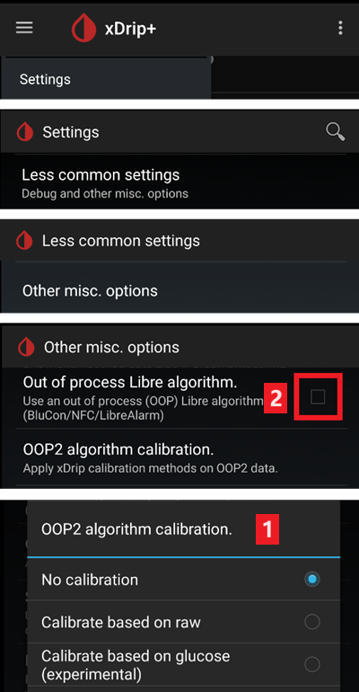
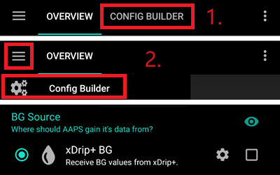
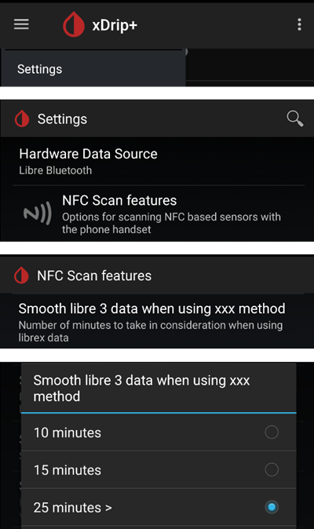
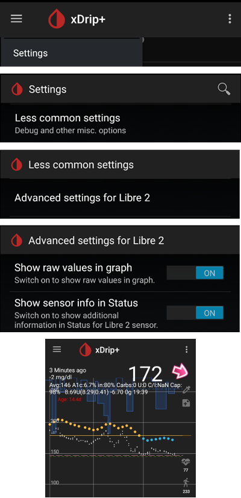
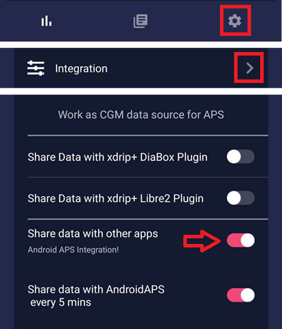

# Freestyle Libre 2 și 2+

Senzorul Libre 2 Freestyle Libre este acum un adevărat CGM chiar și cu aplicația oficială. Totuși, LibreLink nu poate trimite date către AAPS. Există mai multe soluții pentru a-l utiliza cu AAPS.

## 1. Utilizați o punte Bluetooth și OOP

Transmițătoarele prin Bluetooth pot fi utilizate împreună cu Libre 2 (UE) sau 2 + (UE) și cu o aplicație algoritm în afara procesului. Poți primi valori ale glicemiei la fiecare 5 minute, ca în cazul [Libre 1](./Libre1.md).

Verificați dacă puntea și aplicația pe care doriți să le utilizați sunt compatibile cu senzorul și xDrip+.

OOP pentru Libre2 (găsiți-l [aici](#Libre2_OOP2)) creează aceleași citiri de glicemie ca și în cazul cititorului original. AAPS cu Libre 2 face o uniformizare de 10 până la 25 de minute pentru a evita anumite salturi. Vedeți mai jos [Valoare uniformizată& valori brute](#libre2-value-smoothing-raw-values). OOP generează citiri la fiecare 5 minute, în medie cu o medie de 5 minute. Prin urmare, valorile glicemiei nu sunt atât de uniformizate, ci se potrivesc cu cele ale dispozitivului de citire original și urmează mai degrabă valorile "reale" ale glicemiei. Dacă încercați să faceți bucla cu OOP, vă rugăm să activați toate setările de uniformizare din xDrip+.

Există motive întemeiate pentru a utiliza un transmițător Bluetooth:

-   Puteți alege diferite strategii de calibrare OOP2 (1): cu valorile cititorului folosind "Fără calibrare", sau prin calibrarea senzorului ca un Libre 1 folosind "calibrare bazată pe valori brute" sau, în cele din urmă, să calibreze valorile cititorului cu "calibrare bazată pe glicemie".  
  Asigurați-vă că lăsați OOP1 dezactivat (2).

    → Meniu Hamburger → Setări → Setări mai puțin frecvente → Alte diferite opțiuni



-   Senzorul Libre 2 poate fi utilizat 14,5 zile la fel ca Libre 1
-   Reumplerea datelor pe ultimele 8 ore este completat integrată

Observație: Transmițătorul poate fi utilizat în paralel cu aplicația LibreLink fără a interfera cu ea.

### Start sensor

- → Meniu Hamburger (1) → Porniți senzorul (2) → Start senzor (3) → Răspuns "Nu astăzi (4)".


Acest lucru nu va porni fizic niciun senzor Libre2 și nici nu va interacționa cu aceștia în vreun fel. Acesta este doar pentru a indica xDrip+ faptul că un nou senzor transmite valorile glicemiei din sânge. Dacă este disponibil, introduceți două valori ale glicemiei din sânge pentru calibrarea inițială. Acum valorile glicemiei ar trebui să fie afișate în xDrip+ la fiecare 5 minute. Valorile pierdute, pentru că ați fost prea departe de telefon, nu vor fi recuperate înapoi.

După schimbarea senzorului, xDrip+ va detecta automat noul senzor și va șterge toate datele de calibrare. Vă puteți verifica glicemia după activarea și puteți face o nouă calibrare inițială.

### Configurați AAPS (doar pentru buclă)

-   În AAPS mergeți la Configurator > Sursă glicemie și bifați 'xDrip+'



-   Dacă AAPS nu primește valorile glicemiei atunci când telefonul este în modul avion utilizați 'Identificați destinatarul' așa cum este descris în [pagina de setări xDrip+](#xdrip-identify-receiver).

## 2. Utilizați conexiunea directă xDrip+

```{admonition} Libre 2 EU only
:class: avertizare
xDrip+ nu acceptă conexiune directă la Libre 2 US și AUS.
Doar modelele Libre 2 și 2+ **UE**.
```

- Urmați [aceste instrucțiuni](./Libre2MinimalL00per.md) pentru a configura xDrip+ deoarece legătura originală a documentației trimite către o versiune OOP2 învechită.
- Urmăriți instrucțiunile de configurare pe pagina [xDrip+ de setări](../CompatibleCgms/xDrip.md).

-   Selectați xDrip+ în [Configurator, Sursă glicemie](#Config-Builder-bg-source).

(libre2-value-smoothing-raw-values)=

### Uniformizarea valorilor & valorile brute

Tehnic, valoarea actuală a glicemiei este transmisă către xDrip+ în fiecare minut. Un filtru de medie ponderată calculează o valoare uniformizată pe baza ultimelor 25 de minute, în mod implicit. Puteți schimba perioada din meniul de caracteristici NFC.

→ Meniu Hamburger → Setări → Caracteristici scanare NFC → Uniformizați libre 3 când se utilizează metoda xxx



Acest lucru este obligatoriu pentru buclă. Curbele sunt uniformizate și rezultatele buclei sunt grozave. Valorile brute pe care se bazează alarmele oscilează puțin mai mult, dar corespund valorilor pe care le afișează și cititorul oficial. În plus, valorile brute pot fi afișate în graficul xDrip+ pentru a putea reacționa la timp pentru modificările rapide. Vă rugăm să porniți Setări mai puțin obișnuite \> Setări Avansate pentru Libre2 \> "Arătați valori brute" și "Arătați informațiile senzorului". Apoi valorile brute sunt afișate suplimentar ca puncte mici albe și informațiile suplimentare despre senzori sunt disponibile în meniul sistemului.

Valorile brute sunt foarte utile atunci când glicemia din sânge variază rapid. Chiar dacă valorile oscilează mai mult, ați detecta tendința mult mai bine dacă ați folosi linia netezită pentru a lua decizii terapeutice adecvate.

→ Meniu Hamburger → Setări → Setări mai puțin frecvente → Setări avansate pentru Libre 2




#### Calibrare

Puteți calibra Libre2 **cu un decalaj între -40 mg/dl și +20 mg/dL \[-2,2 mmol/l la +1,1 mmol/l\]** (intercept). Panta nu poate fi schimbată. Vă rugăm să verificați printr-o înțepătură în deget (prin glicemie capilară) după activarea unui senzor nou, și să rețineți că acesta ar putea să nu fie precis în primele 12 ore de la inserare. Deoarece pot exista diferențe mari față de măsurătorile sângelui, verificați la fiecare 24 de ore și calibrați dacă este necesar. Dacă senzorul oferă citiri eronate după câteva zile, atunci ar trebui să fie înlocuit.

## 3. Utilizare Diabox

- Instalați [Diabox](https://www.bubblesmartreader.com/_files/ugd/6afd37_f183eabd4fbd44fcac4b1926a79b094f.pdf). În Setări, Integrare, activați Partajarea datelor cu alte aplicații.



- Selectați xDrip+ în [Configurator, Sursă glicemie](#Config-Builder-bg-source).

## 4. Utilizarea Juggluco

Vedeți [aici](./Juggluco.md).
