# Cum se configurează FSL 2 și OOP2 pentru a utiliza o conexiune Bluetooth nativă în xDrip+

Transferat de la [MinimalL00per](https://www.minimallooper.com/post/how-to-setup-freestyle-libre-2-and-oop2-to-use-a-native-bluetooth-connection-in-xdrip) la markdown și **revizuit/actualizat**: Aug 25, 2025 psonnera

În partea de jos a prezentului document există o listă de definiții. Dacă nu sunteți familiarizat cu termenii sau abrevierile nu ezitați să *[săriți jos](#minimallooper-definitions)* pentru clarificare.

 

## Configurare

### Dispozitive

- *FSL2 și 2+* **NOTĂ: versiunile US, CAN, NZ, AUS NU sunt acceptate**

**(OPȚIONAL) Cititor** (nu este compatibil cu FSL2+)

- Cititor 1 (cu firmware actualizat)

- Cititor 2

*NOTĂ: Dacă plănuiți să utilizați cititorul în această soluție, TREBUIE SĂ ÎNCEPEȚI senzorul cu READER FIRST. Dacă nu faceți acest lucru, nu veți putea folosi cititorul pentru a aduna citiri de la senzorul activat. După ce senzorul s-a încălzit, puteți lua citiri din aplicația LibreLink sau xDrip+.*

### Software

**OOP** - Algoritmul în afara procesului, o aplicație externă APK Android care asistă la recuperarea datelor brute ale senzorilor pentru a obține valorile glicemiei. xDrip+ trimite date brute colectate de FSL2 Bluetooth la OOP și valorile de glicemie sunt returnate la xDrip+.

- **OOP2**

  - **Funcționează numai cu senzori europeni FSL2/2+**

  - Sursă închisă (nu este disponibilă pe GitHub)

  - Scopul este decriptarea valorilor criptate ale senzorului și returnarea lor în xDrip+. Apoi xDrip+ poate fi utilizat fie cu date brute, care necesită calibrare, fie cu valori ale glicemiei similare cu ale Reader 1.

[***xDrip+***](https://jamorham.github.io/)

- [*Nightly*](https://github.com/NightscoutFoundation/xDrip/releases) cel mai recent cod sursă construit în fiecare noapte. Nu e testat bine

- [*Stabil*](https://xdrip-plus-updates.appspot.com/stable/xdrip-plus-latest.apk) ultima versiune testată.

- **NOTĂ: noii senzori necesită actualizarea unei aplicații OOP2, pentru aceasta este recomandat să utilizați cel puțin ultima versiune de xDrip+ (Stabil), care corespunde celei mai recente OOP2.**

 

## Proces

- *Mai întâi descărcați și instalați aplicațiile de mai jos*
- *Dezinstalați posibilele aplicații conflictuale*
- *Cum să începeți un senzor FSL2 în modul nativ Bluetooth folosind LibreLink și xDrip+
  - [*Pasul 1: Instalarea și configurarea aplicației*](#minimallooper-step1)
  - [*Pasul 2: Configurare Setări xDrip+*](#minimallooper-step2)
  - [*Pasul 3: Introduceți fizic senzorul*](#minimallooper-step3)
  - [*Pasul 4: Porniți aplicația LibreLink și porniți senzorul cu prima scanarea NFC*](#minimallooper-step4)
  - [*Pasul 5: Deschideți xDrip+ și scanați NFC senzorul FSL2*](#minimallooper-step5)
  - [*Pasul 6: Porniți noul senzor în xDrip+*](#minimallooper-step6)
  - [*Pasul 7: Așteptați 60 de secunde și scanați NFC senzorul din nou*](#minimallooper-step7)
  - [*Pasul 8: Colectarea datelor între 3 și 15 minute*](#minimallooper-step8)
  - [*Pasul 9: Verificați că senzorul e conectat și transmite date*](#minimallooper-step9)

- *[Note](#minimallooper-notes)*
- *[Avantaje](#minimallooper-advantages)*
- *[Dezavantaje](#minimallooper-disadvantages)*
- <u>*\[Depanare\](#minimallooper-troubleshooting)*</u>

## Înainte să începeți

Este recomandat cu tărie să urmăriți acest proces cu un **senzor nou**. Deși s-a raportat că o conexiune poate fi făcută cu un senzor activ (***vedeți [mai jos](#minimallooper-started-sensor)***), șansa ca aplicația LibreLink sau cititorul să creeze o nouă cheie privată de partajare pentru comunicare în timpul conexiunii este foarte probabilă. Aceasta înseamnă că, după stabilirea legăturii, xDrip+ nu este conștient de noua cheie și nu va putea comunica cu senzorul. Încercați o conexiune cu un senzor de rulare pe propriul risc, preferabil spre sfârșitul vieții senzorului.

### Mai întâi descărcați și instalați aplicațiile de mai jos

(Libre2_OOP2)=

- **OOP2** - Versiunile OOP2 pot fi găsite la:

  (*Notă: trebuie să fiți autentificat la Google pentru a accesa linkul.*)

*[oop2.apk](https://drive.google.com/file/d/1106h2s12b3Ev9gKCTU2G75q8h9ChHjcz/view?usp=sharing)* - OOP2_21_09_25 (05d1989) **2025.09.21** (ultima versiune)

- **xDrip+** - **<u>cea mai recentă versiune</u>** (versiunea minimă 2025.09.26) poate fi găsită la:

[*xDrip+.apk*](https://github.com/NightscoutFoundation/xDrip/releases)

(minimallooper-started-sensor)=

### Ce se întâmplă dacă senzorul meu este deja pornit? Încă mai pot citi în xDrip+? DA!

Mulți oameni au întrebat dacă această metodă poate fi folosită cu un senzor deja activ și pot spune cu un **DA** răsunător, poți începe un senzor care rulează activ.

1.  **PRIMA OARĂ**, asigurați-vă că ați făcut modificările și setările de configurare la xDrip+ și instalat și configurat OOP2 după cum se arată mai jos.

2.  **APOI**, treceți la *Pasul 5* și **ASIGURAȚI-VĂ** ați închis forțat LibreLink înainte de a începe. Apoi urmați procesul până la finalizare.

*NOTĂ: Nu veți putea utiliza senzorul FSL2 activat cu FSLReader DACĂ nu a fost început cu FSLReader mai întâi. Dacă a fost început mai întâi cu FSLReader, apoi veți putea **să scanați** senzorul și să recuperați citirile de la ambele părți, și de la senzor și de la aplicații precum LibreLink și xDrip+.*

## Cum să porniți un senzor FSL2 în modul Bluetooth nativ folosind LibreLink și xDrip+

*NOTĂ: Dacă există setări în capturile de ecran care nu sunt afișate cu o CĂSUȚĂ în mod specific și sunt DEBIFATE (adică dezactivate) apoi PĂSTRAȚI-LE DEZACTIVATE. Capturile de ecran reflectă o configurație funcțională pentru TOATE setările afișate. Dacă doriți să experimentați pornind sau oprind alte funcții după ce aveți un senzor de lucru, sunteți liber să faceți acest lucru pe propriul risc.*

(minimallooper-step1)=

### **Pasul 1: Instalarea și configurarea aplicației**

**Instalați și configurați OOP2** și vedeți că funcționează prin deschiderea aplicației.


**Setări**

- *Utilizați serviciul* **pornit**

- *Utilizați serviciul în prim-plan* **pornit**

- *Durată temporizator* **5 minute**

  - Schimbați la 1 secundă dacă nu obțineți rezultate suficient de repede.

**Versiunea 2: 93e5cac-2020.12.08 (ultima versiune)**

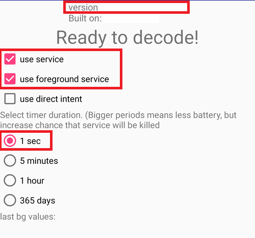

**Instalați versiunea minimă xDrip+**: ultima versiune. Mai multe documente despre instalarea și configurarea xDrip+ pot fi găsite [*aici*](https://androidaps.readthedocs.io/en/latest/Configuration/xdrip.html).

(minimallooper-step2)=

### **Pasul 2: Configurare Setări xDrip+**

**Sursa de date hardware**: Bluetooth Libre


**Setări de scanare NFC**:*setările care nu au fost menționate sunt presupuse că sunt dezactivate.*

- *Utilizați funcția NFC*: **pornit**
- *Vechimea senzorului sau expirare*: **pornit**
- *Scanați când nu este în xDrip+*: **pornit**
- *Utilizați o metodă de citire optimizată pentru Any-tag*: **oprit** dar încercați **pornit** în cazul în care se întâmpină dificultăți la scanare

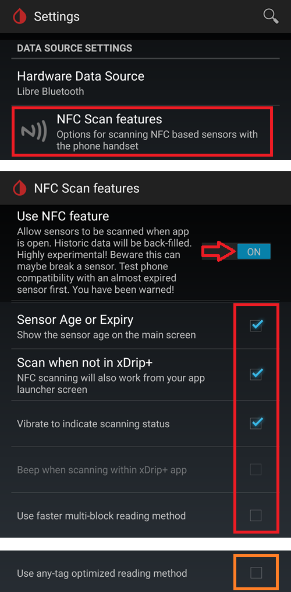

- *Începerea conexiunii Bluetooth cu senzorul FSL2*: **Conectați-vă întotdeauna la senzorii libre2**


- *Omogenizați datele Libre 3 când se folosește metoda xxx*: lasă implicit. Creșteți valoarea pentru senzorii zgomotoși, scădeți când este stabilă.

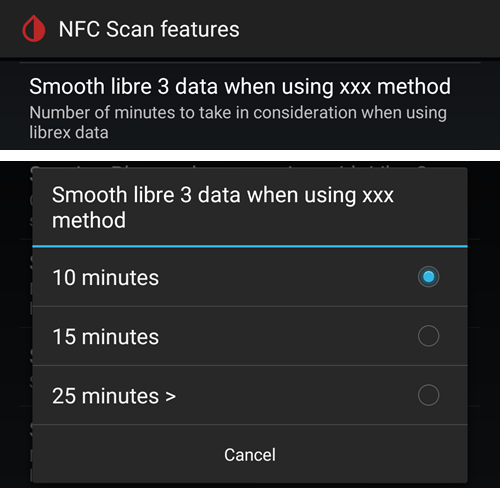

**Setări mai puțin obișnuite -\> Setări Bluetooth** (*sunt importante și pot varia în funcție de telefon/configurare*)

- *Activați Bluetooth*: **pornit**
- *Acordați încredere Auto-Connect*: **pornit**
- *Folosiți scanările de fundal*: **pornit**
- *Descoperiți întotdeauna serviciile*: **pornit**

Puteți configura xDrip+ prin utilizarea codului QR de mai jos. Trebuie să-l scanați (sau să încărcați imaginea) în xDrip+ -> Configurare automată.

```{admonition} QR Code
:class: dropdown


```

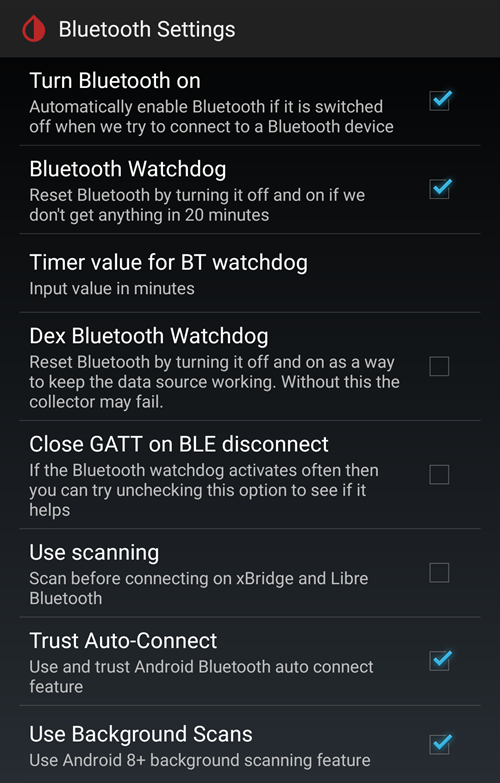

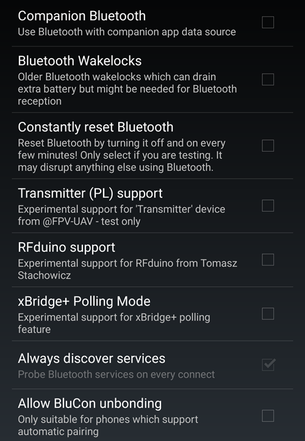

Odată scanat codul QR de mai sus, dacă aveți un telefon Samsung (dar acest lucru este util și pentru multe mărci chinezești), scanați celălalt cod QR de mai jos pentru a schimba setările pentru o conexiune mai sigură:

- *Acordați încredere Auto-Connect*: **oprit**
- *Folosiți scanările de fundal*: **oprit**

```{admonition} QR Code
:class: dropdown

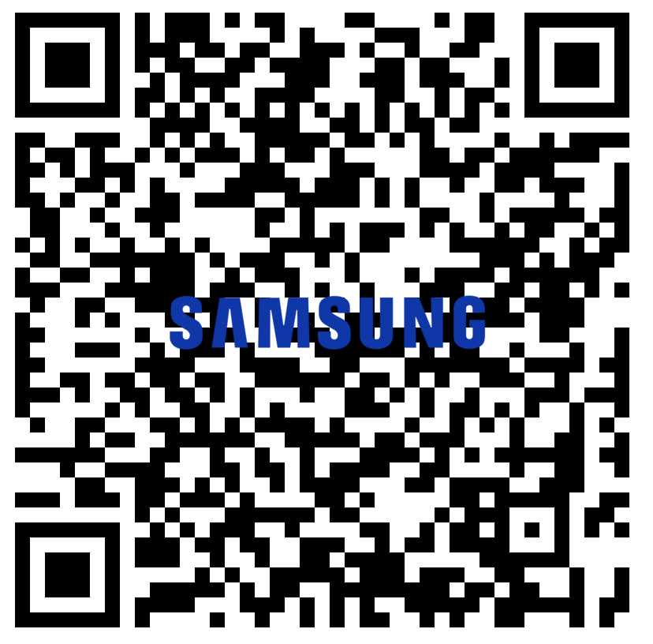
```

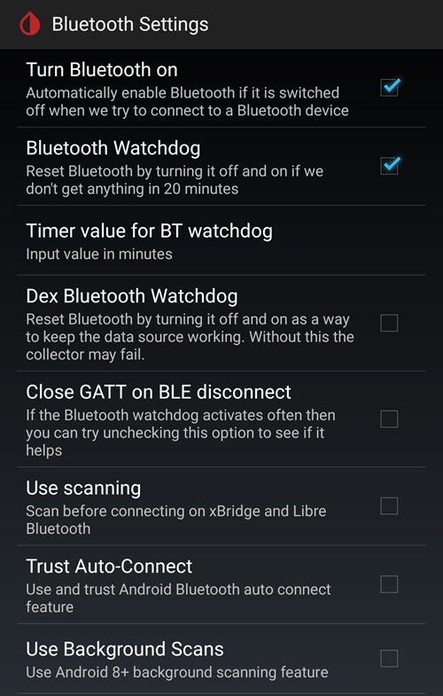

**Setări avansate pentru FSL2** (*opțional dar util*)

- *arătați valorile brute în grafic*: **pornit**

- *arătați informații despre senzori în Stare*: **pornit**


**Setări suplimentare de jurnalizare** (*necesar pentru depanare dacă nu funcționează corect*)

- *Etichete suplimentare pentru jurnalizare*: introduceți această valoare

`BgReading:d,jamorham librereceiver:v,LibreOOPAlgorthm:v,jamorham nsemulator:v,DexCollectionService:v`

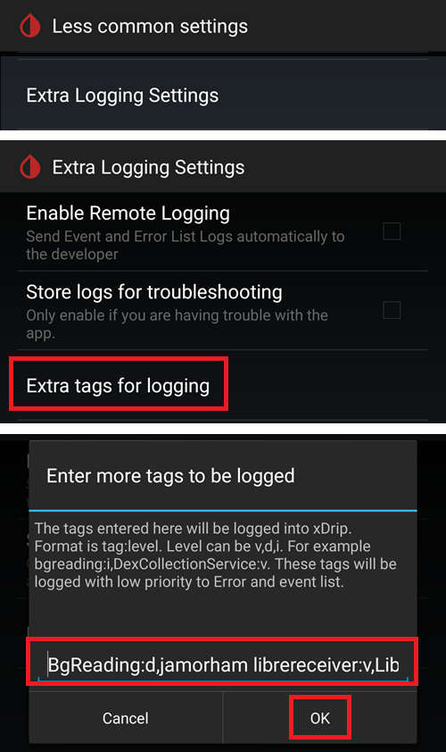

(minimallooper-OOPsettings)=

**Setări mai puțin obișnuite -\> Alte opțiuni diverse**

> **Setări pentru configurarea OOP2**

- *Algoritmul Libre în afara procesului*: **OPRIT**

(*ASIGURAȚI-VĂ CĂ ACEST LUCRU ESTE **OPRIT** PENTRU OOP2, ALTFEL NU VEȚI OBȚINE CITIRI!*)


(minimallooper-step3)=

### **Pasul 3: Introduceți fizic senzorul**

(minimallooper-step4)=

### **Pasul 4: Porniți aplicația LibreLink și porniți senzorul cu prima scanarea NFC**

Porniți aplicația LibreLink, apoi scanați senzorul nou introdus, apoi închideți și dezactivați sau dezinstalați aplicația LibreLink. **Încă trebuie să așteptați ca senzorul să se încălzească complet în cele 60 de minute înainte de a continua și de a porni senzorul în xDrip+**. Nu vă bazați pe citiri de dinainte deoarece senzorul este încă se calibrează intern, iar valorile variază în mod dramatic.

#### **Pasul 4a (OPȚIONAL, Utilizați FSLReader):**

**Porniți senzorul FSL2 (nu 2+) prin scanarea acestuia cu FSLReader cu chiar întâia scanare NFC**

Dacă doriți să puteți utiliza **FSLReader** precum și LibreLink app sau xDrip+ pentru a citi valorile de la senzorul FSL2, apoi **va trebui să scanați senzorul FSL2 introdus recent cu FSL Reader FIRST.** După ce încălzirea senzorilor este completă, puteți utiliza aplicația LibreLink sau xDrip+ pentru a scana citirile.

*NOTĂ: Aplicația LibreLink este necesară doar pentru PRIMA scanare NFC după inserarea senzorului. Acesta servește la trimiterea semnalului de inițializare a încălzirii, după aceea aplicația TREBUIE dezactivată (setările aplicației>închidere forțată) sau dezinstalată. Puteți folosi aplicația modificată 2.3 sau versiunile oficiale, nu contează. Principalul lucru este să împiedicăm aplicația LibreLink să ruleze când xDrip+ încearcă să pornească procesul de legare Bluetooth cu senzorul deoarece aplicația LibreLink interferează în procesul de reconectare Bluetooth prin întreruperea comunicării.*

*A fost raportat că simpla oprire a **permisiunilor de localizare** în setările Android ale aplicației LibreLink este suficient pentru a preveni interferarea cu conexiunea. Acest lucru a fost raportat de câțiva utilizatori ca fiind de succes. Din nou **recomand dezactivarea sau dezinstalarea aplicației**, dar puteți încerca acest lucru dacă doriți să experimentați.*

(minimallooper-step5)=

### **Pasul 5: Deschideți xDrip+ și scanați NFC senzorul FSL2**

(*Memento! Asigurați-vă că LibreLink este dezactivat (locația este oprită) sau dezinstalat și că ați așteptat toate cele 60 de minute pentru ca senzorul să se încălzească și să fie calibrat.*)

**SCANARE NFC** senzorul FSL2 cu xDrip+. Aceasta trimite un semnal către senzor pentru a activa asocierea Bluetooth pentru a începe procesul de legare. O notificare mică va apărea pe scurt în partea de jos a ecranului de ansamblu xDrip+ cu textul **Scanare** urmat de notificarea **scanat OK!** la o scanare NFC reușită a senzorului FSL 2.


(minimallooper-step6)=

### **Pasul 6: Porniți noul senzor în xDrip+**

În ecranul **Privire de ansamblu xDrip+ ** apăsați pe meniul **hamburger** din colțul din stânga sus. Apoi alegeți **Start Senzor**.

Pe ecranul **Porniți noul senzor** apăsați **Start Senzor**. Un anunț va întreba **L-ați inserat astăzi?** Răspundeți apăsând **NU ASTĂZI**.


*NOTĂ: Dacă ați apăsat din greșeală "DA, ASTĂZI" atunci va trebui să "opriți senzorul" din meniul principal xDrip+, urmat de "start senzor" trecând din nou la Pasul 5.*

(minimallooper-step7)=

### **Pasul 7: Așteptați 60 de secunde și scanați NFC senzorul din nou**

O a doua scanare NFC este necesară pentru a **ADĂUGA** senzorul ca dispozitiv Bluetooth de pe care xDrip+ îl va folosi pentru a prelua citirile. Odată finalizat, veți vedea o notificare care va spune **NOUL SENZOR PORNIT**.

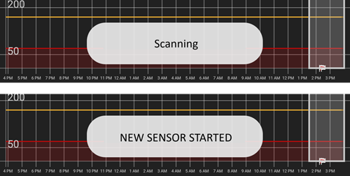

O perioadă de așteptare de 60 de secunde este impusă deoarece senzorul nu poate fi scanat în timpul acestui proces de mai mult de o dată pe minut. Dacă senzorul este scanat prea devreme avertizarea **Nu atât de repede, așteptați 60 secunde** este afișat în ecranul privire de ansamblu al xDrip.


Deschideți jurnalele evenimentelor xDrip+ și verificați senzorul asociat corect cu xDrip+.


(minimallooper-step8)=

### **Pasul 8: Colectarea datelor între 3 și 15 minute**

Între 3 și 15 minute suficiente date sunt colectate pentru a afișa primele valori. *Dacă încă nu primiți citiri în acest moment, uneori ajută repornirea telefonului.*

Dacă folosiți un Samsung (sau multe telefoane de marcă chinezească) și aveți probleme cu primirea datelor, scanați codul QR de mai jos, în xDrip+ -> Configurare automată.

```{admonition} QR Code
:class: dropdown


```

Va schimba setările Bluetooth xDrip+ în:

- *Acordați încredere Auto-Connect*: **oprit**
- *Folosiți scanările de fundal*: **oprit**

(minimallooper-step9)=

### **Pasul 9: Verificați că senzorul e conectat și transmite date**

Apăsați meniul hamburger din stânga sus a ecranului privire de ansamblu xDrip+ și selectați **Stare sistem**. Pe ecranul de Stare al Sistemului, **Dispozitivele Bluetooth** active: afișează convenția de denumire Bluetooth FSL2 de la **ABB___XXXXXXXXX**, unde XXX reprezintă numărul de serie al senzorului. Câmpul **Starea Conexiunii** afișează **Conectat** și secțiunea **Startul senzorului:** a afișat data la care senzorul a fost pornit.


Pe ecranul **Dispozitiv Bluetooth** (glisare la stânga) puteți verifica detaliile legate de conexiune ale senzorului și puteți utiliza acest ecran pentru conexiunile de depanare. Mai jos este o listă de câmpuri și scopurile lor pentru a ajuta la depanarea conexiunii.

*NOTĂ: **<u>NU ATINGEȚI</u> ȘI SCHIMBAȚI Asocierea Bluetooth de la <u>Dezactivat</u>** în această fereastră. Acest lucru va încerca o conectare directă, va eșua (nu este legată) și va trebui să începeți din nou procesul de la Pasul 5.*


- **Stare serviciului telefonic:** Ultima dată când telefonul a făcut o conexiune Bluetooth la senzor (ar trebui să fie mai mică de 5 minute în urmă)
- **Dispozitiv Bluetooth:** Afișați starea curentă a conexiunii (fie **conectat** sau **deconectat**)
- **Adresa MAC a dispozitivului**: Acesta este ID hardware al senzorului.
- **Asociere Bluetooth**: Acesta ar trebui să fie **<u>dezactivat, apăsați pentru a activa</u>**. Aveți grijă să NU atingeți acest lucru. Dacă îl atingeți din greșeală, apăsați-l din nou până când acesta revine la dezactivat.
- **Cea mai lentă trezire**: Puteți ignora asta. xDrip+ nu își petrece timpul în așteptarea de citiri: va începe să le aștepte după o anumită perioadă (în mod tradițional 5 minute). În cazul în care nu ajung date în momentul acela, veți vedea "S-a trezit devreme" însemnând că xDrip+ se aștepta ca datele să fie pregătite, dar ele nu existau. Cea mai lentă trezire este întârzierea cea mai mare înregistrată înainte de primirea datelor în mod normal.
- **Următoarea trezire**: ar trebui să spună 5 minute

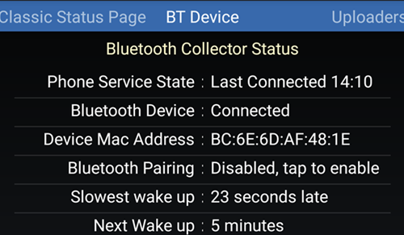

(minimallooper-notes)=

### **Note**

- **Folosiți Scanări NFC DUPĂ legătură/asociere în xDrip+ este finalizat**: Puteți efectua scanări NFC, dar procesul de legare/asociere cu xDrip+ trebuie finalizat mai întâi. Uitați-vă întotdeauna la xDrip+ și vedeți dacă este aproape de citirea de 5 minute (spre exemplu acum 4 minute), dacă se apropie de 5 minute, așteptați ca noua citire Bluetooth să vină și apoi efectuați scanarea NFC. Dacă îl prindeți la un moment greșit, procesul Bluetooth va fi perturbat în xDrip+ și nu va primi citiri Bluetooth, lucru ce poate dura o vreme pentru a re-lega și transmite din nou și uneori o conexiune cu senzorul Bluetooth poate fi "furată" de LL. Cu toate acestea, între aceste citiri Bluetooth, nu am avut probleme cu executarea unei scanări NFC, urmată de dezactivarea imediată a aplicației. Nu sunt sigur dacă LibreLink trebuie să fie dezactivată de fiecare dată, dar se poate dezactiva pentru siguranță.

- - **Ce se întâmplă?** Când o conexiune Bluetooth este făcută, o cheie privată partajată este necesară pentru a permite comunicarea între senzor și aplicația/dispozitivul de apelare. Este foarte probabil ca aplicația LibreLink sau cititorul să creeze o nouă cheie privată comună pentru comunicare în timpul conexiunii. Aceasta înseamnă că, după stabilirea legăturii, xDrip+ nu este conștient de noua cheie și nu va putea comunica cu senzorul.

  - Mai mulți utilizatori au raportat că aplicația LibreLink poate fi repornită după pornirea cu succes a senzorului și primirea cititorilor în xDrip+. În permisiunile aplicației LibreLink Android trebuie doar să opriți setarea **Permiteți localizarea**. Odată terminat, ar trebui să puteți utiliza simultan aplicația LibreLink și xDrip+. Vă recomand să nu selectați o aplicație implicită pentru scanarea NFC și să alegeți ce aplicație doriți pentru citirea senzorului printr-o scanare NFC. De asemenea, NU UITAȚI, la următoarea schimbare a senzorului să forțați închiderea aplicației LibreLink după scanarea NFC inițială pe noul senzor. După ce senzorul este configurat și primește citiri în xDrip+, puteți reporni aplicația LibreLink.

&nbsp;

- **Repornirea telefonului**: După repornire, și după dezactivarea sau închiderea forțată a aplicației, AMINTIȚI-VĂ să verificați că aplicația LibreLink NU rulează. Sugerez testarea unei reporniri pentru a vedea dacă LibreLink începe din nou automat. Puteți căuta în setările aplicației LibreLink sub setările aplicației Android de pe telefon. Dacă este încă activată, atunci dezactivați din nou aplicația LibreLink, iar dezinstalarea aplicației LibreLink poate fi singura modalitate de a evita acest lucru. Acest lucru este necesar pentru a preveni furtul accidental al legăturii Bluetooth. De asemenea, după repornirea sistemului, va dura aceleași 3-15 minute pentru a obține citiri Bluetooth din senzor, astfel încât să aveți răbdare și planificați acest lucru dacă reporniți aproape de momentul când aveți nevoie de o citire de glicemie pentru a face bolus, pentru mese, șamd.

&nbsp;

- **Setările de optimizare a bateriei**: Asigurați-vă că EXCLUDEȚI aceste aplicații din setările de optimizare a bateriei pe telefonul dumneavoastră

  - xDrip+

  - OOP 2

  - LibreLink

  - AndroidAPS

&nbsp;

- **Folosind modul avion:** Există unele situații în care se apelează la activarea modului de zbor (când se efectuează un zbor; ), dormitul noaptea și dacă nu doriți să aveți semnale de conectare WiFi sau mobile care funcționează cu telefonul dumneavoastră în zona apropiată a capului) și acest lucru poate cauza probleme cu comunicarea Bluetooth în timpul activării modului avion. La activarea modului de zbor pe telefon, urmat de activarea Bluetooth, valorile glicemiei vor fi pierdute. Singura soluție este să se repornească colectorul în xDrip+ -> Starea Sistemului - \> Pagina clasică de stare. După repornirea colectorului, valorile glicemiei au apărut din nou.

 

(minimallooper-advantages)=

### **Avantaje**

- **Aplicația modificată LibreLink nu mai este necesară** Nu mai ai nevoie de o versiune modificată a aplicației LibreLink pentru a prelua valorile de la senzorul FSL2. În timp ce puteți utiliza aplicația LibreLink modificată, versiunile oficiale ale aplicației LibreLink pot porni prima scanare de inițializare NFC în același mod ca aplicația modificată. Nu există nicio diferență în ceea ce privește scanarea de inițializare NFC pentru a porni senzorul.

&nbsp;

- **dispozitive terțe de scanare NFC nu mai sunt necesare** dispozitive terțe de scanare NFC cum ar fi (Miaomiao, Bubble sau Blucon) nu mai sunt *(dar poate fi folosit în continuare)* pentru a colecta citiri, deoarece doar senzorul le poate livra acum prin Bluetooth. Mai puține dispozitive înseamnă mai puține lucruri care pot merge prost, mai puține dispozitive pentru încărcare și o configurație mai minimalistă.

&nbsp;

- **Încă veți putea să scanați NFC cu FSL2 Reader (versiunea 1 cu versiunea actualizată FW sau versiunea 2) CÂND senzorul FSL2 a fost început MAI ÎNTÂI cu cititorul FSL.** Cititorul individual FSL2 poate fi folosit pentru a scana pe senzorul activ odată ce este conectat prin Bluetooth la xDrip+.

  - privată  După acest punct, alte aplicații software vor putea, de asemenea, să ia citirile NFC de la senzorul activat acum.
- Înțelegerea este că senzorul FSL2 (atâta timp cât nu a stabilit sau nu încearcă să stabilească o conexiune) va face întotdeauna publică prezența sa (și disponibilitatea) în prin Bluetooth exact la fiecare 2 minute (vizibil pe orice dispozitiv Bluetooth care are capacitatea de a scana pentru dispozitivele Bluetooth). Indiferent ce dispozitiv este primul care răspunde la acest anunț câștigă cursa și este *singurul* dispozitiv căruia i se permite să se conecteze și să citească senzorul deoarece o cheie privată partajată este creată în timpul procesului de conexiune NFC care este folosită pentru a decripta comunicarea FSL 2. Senzorul este apoi indisponibil pentru alte dispozitive care nu au această cheie privată de partajare și ar putea încerca să se conecteze. Se pare că cititorul FSL 2 câștigă întotdeauna această cursă indiferent de "adversar".

&nbsp;

- **Configurare cu un număr minim de dispozitive fizice** Scopul meu a fost întotdeauna să mențin numărul de dispozitive medicale atașate corpului meu la un nivel minim. FSL2 în combinație cu sistemul Omnipod a atins acest obiectiv. Acest aspect este și mai important atunci când călătoresc (atât pe distanțe scurte, cât și pe distanțe lungi), deoarece numărul de obiecte și de schimburi pentru aceste obiecte devine mai reduse; ceea ce înseamnă că am mai mult spațiu pentru alte obiecte în bagajul meu. Sperăm că în viitor va exista o pompă cu plasturi care va avea doar un rezervor de înlocuire, iar cipul și sistemul motor pot fi ambalate ca o piesă fixabilă/reutilizabilă. Acest lucru ar reduce deșeurile și ambalajul necesar pentru schimbările de senzori/locuri de aplicare, ceea ce, din nou, îmi oferă mai mult loc în valiză pentru alte lucruri.

&nbsp;

- **Nu mai sunt decalaje de oră la schimbarea senzorilor** Pentru că puteți începe un alt senzor cu aplicația LibreLink folosind o scanare NFC inițială, senzorul curent poate continua să ruleze și să livreze citirile prin Bluetooth în același timp. După 20 de minute poți obține citiri de la noul senzor, dar cel mai bine este să aștepți 1 oră pentru ca senzorul să se calibreze intern corespunzător. Aceasta înseamnă că puteți opri senzorul curent și porni pe cel nou (după ce a fost setat și încălzit cu scanarea NFC a LibreLink cu o oră mai devreme) și în decurs de 3 până la 15 minute veți avea calibrările și citirile inițiale.

&nbsp;

(minimallooper-disadvantages)=

### **Dezavantaje**

- **Repornire telefonului:** Deoarece procesul Bluetooth trebuie să înceapă din nou când telefonul se repornește, mai întâi trebuie să vă asigurați că dezactivați manual aplicația LibreLink (dacă nu ați dezinstalat-o) și să fiți răbdător pentru prima citire (între 3 și 15 minute). Acest lucru înseamnă planificarea repornirilor telefonului astfel încât acestea să nu aibă loc în timpul unor momente critice, cum ar fi bolusurile de corecție sau orele de masă și gustări.

&nbsp;

- **Nu puteți rula LibreLink și xDrip+ împreună pentru citirile Bluetooth**. LibreLink va încerca întotdeauna să "fure" conexiunea Bluetooth la senzor și să facă legătura. Dacă acest lucru se întâmplă, sunteți blocat de LibreLink pentru tot restul vieții senzorului. Deci, rularea simultană a aplicațiilor nu funcționează tot timpul. Așa cum menționez mai jos, puteți activa aplicația LibreLink și puteți face o scanare NFC pentru a obține citirea LibreLink (dacă aveți nevoie să o comparați, doriți să preluați istoricul pentru dumneavoastră sau rapoarte pentru endocrinologi); cu toate acestea, ar trebui să îl dezactivați de îndată ce aveți citirea dumneavoastră și să nu încercați acest lucru în decurs de un minut de când xDrip+ va prelua citirea prin Bluetooth. Nu sunt sigur cum funcționează cititorul FSL2 în timp ce fac acest lucru, dar voi testa acest lucru mai târziu.
- Mai mulți utilizatori au raportat că aplicația LibreLink poate fi repornită după pornirea cu succes a senzorului și primirea cititorilor în xDrip+. În permisiunile aplicației LibreLink Android trebuie doar să opriți setarea **Permiteți localizarea**. Odată terminat, ar trebui să puteți utiliza simultan aplicația LibreLink și xDrip+. Vă recomand să nu selectați o aplicație implicită pentru scanarea NFC și să alegeți ce aplicație doriți pentru citirea senzorului printr-o scanare NFC. De asemenea, NU UITAȚI, la următoarea schimbare a senzorului să forțați închiderea aplicației LibreLink după scanarea NFC inițială pe noul senzor. După ce senzorul este configurat și primește citiri în xDrip+, puteți reporni aplicația LibreLink.

&nbsp;

- **Dispozitivele terțe de scanare NFC pot fi folosite în continuare**. Da, am enumerat acest lucru ca fiind un dezavantaj, dar am dorit, de asemenea, să subliniez faptul că dacă ceva nu merge bine cu senzorul și LibreLink capturează controlul asupra acestuia, întotdeauna puteți reveni la plasarea dispozitivului de scanare NFC pe senzor pentru a obține citiri în xDrip+. De asemenea, puteți utiliza acest dispozitiv în locul unei conexiuni Bluetooth directe dacă sunteți mai confortabil cu o configurare constând dintr-un dispozitiv terț de scanare NFC (Miaomiao, Bubble, Blucon). Uneori, anumite telefoane nu funcționează bine cu conectarea Bluetooth nativă a senzorilor și extragerea datelor. Puteți utiliza aceste dispozitive ca o copie de rezervă sau ca o utilizare normală, în orice caz aveți această opțiune.
- Dacă plănuiți să utilizați **cititorul FSL** ca un dispozitiv de scanare NFC pentru citiri, TREBUIE să porniți senzorul FSL2 la **CHIAR PRIMA SCANARE** pentru a încălzi senzorul cu **CITITORUL PRIMA OARĂ**.

&nbsp;

- **Datele LibreView nu vor fi încărcate automat** Deoarece aplicația LibreLink nu are o conexiune Bluetooth constantă (deoarece LibreLink nu ar trebui să ruleze simultan cu xDrip+ odată ce senzorul trimite citiri Bluetooth), atunci nu primește citiri automat de la senzor. Aceasta înseamnă că datele privind glicemia nu sunt încărcate automat în LibreView și prin extensie în alte telefoane cu LibreLink. Consider că acesta este un dezavantaj deoarece știu că mulți părinți se bazează pe această funcționalitate, precum și pe cei care sunt obligați să utilizeze raportarea LibreView pentru furnizorul lor de asistență medicală. Încă puteți deschide aplicația LibreLink și să scanați la fiecare 8 ore pentru a obține datele completate înapoi de la senzor în LibreLink (de 3 ori pe zi, cel puțin la fiecare 8 ore, dar ar fi probabil nevoie de mai multe scanări pentru a capta toate cele 24 de ore de date), dar din nou acesta este un proces manual.

&nbsp;

(minimallooper-definitions)=

### **Definiții**

- **BT** - Bluetooth

- **BLE** - Bluetooth Low Energy

- **FSL** - FreeStyle Libre
  - **Libre 1 (FSL1)** - doar NFC. Prima versiune a senzorului

  - **FSL2 (FSL2)** - Bluetooth și NFC. A doua versiune a senzorului.

  - **Libre 3 (FSL3)** - Bluetooth și NFC. Cea de-a treia versiune mai mică a senzorului. Nu este acceptată de OOP2 (vedeți Juggluco).

- **LL** - LibreLink, **aplicația** folosită pentru a porni senzorul cu scanarea NFC inițială

- **LV** - LibreView, serviciu cloud pentru schimbul de date cu echipa de endocrinologie (luați în considerare utilizarea Tidepool sau Nightscout)

- **MM** - MiaoMiao, numele și producătorul unui dispozitiv terț de scanare NFC care oferă citiri prin Bluetooth la xDrip+.

- **NFC** - Near Field Communication (comunicare în câmp apropiat), o operațiune fizică în care apropiați senzorul NFC al telefonului de senzorul dumneavoastră pentru a iniția o citire. Aceasta este adesea denumită "scanarea senzorului", "scanarea de senzor" sau "scanare NFC". Acest proces nu folosește în niciun fel Bluetooth.

- **OOP1** - Algoritmul Extern (Out of Process Algorithm) versiunea 1 este aplicația terță care primește valorile brute (transmise către xDrip+ de la senzor prin Bluetooth sau scanare NFC) și apoi folosește un algoritm (foarte similar cu algoritmul hardware de pe cipul senzorului) pentru a procesa valorile brute și returnează către xDrip+ o valoare a glicemiei calibrată (de algoritmul OOP1, nu de calibrările native ale xDrip+), fie pentru a fi afișată, fie pentru a fi procesată în continuare cu calibrarea xDrip+ (cu o calibrare a glicemiei prin înțepătură în deget), dacă este necesar.

- **OOP2** - Algoritmul Extern versiunea 2, aplicația terță care primește date criptate de la senzorul FSL 2 (prin Bluetooth sau scanare NFC) și apoi decriptează datele criptate. Odată decriptate, datele sunt trimise la xDrip+.

 

(minimallooper-troubleshooting)=

### Depanare

#### Eșec la scanarea senzorului cu NFC

- Asigurați-vă că dispozitivul de citire NFC este activat în setările Android.
- Cititorul NFC trebuie să fie compatibil cu etichetele **ISO 15693**. Unele telefoane Cubot sunt foarte greu de folosit.
- Uitați-vă în documentația telefonului pentru a identifica poziția antenei NFC. Aduceți-l la senzor și stați pe el timp de 10 secunde: citirea de NFC xDrip+ durează mai mult decât aplicația furnizorului sau cititorul.
- Încercați să închideți xDrip+ înainte de scanarea senzorului.
- Asigurați-vă că nicio altă aplicație nu dorește să citească senzorul (este posibil să vedeți o selecție cu diferite opțiuni ale aplicației atunci când scanați: selectați xDrip+, dar nu mutați telefonul).
- Încercați toate combinațiile de setări NFC xDrip+ *Utilizați metoda de citire rapidă cu mai multe blocuri * și *Utilizați o metodă de citire optimizată cu eticheta* știind că scanările NFC sunt de obicei mai fiabile cu ambele opțiuni **oprite**.

#### Blocat la colectarea citirilor inițiale

*Notă: FSL 2 nu este recunoscut ca o sursă de date de încredere atunci când este calibrat manual.*

Setați strategia de [calibrare OOP2](#minimallooper-OOPsettings) la "Nici o calibrare" până când nu aveți totul funcțional.

Apoi puteți decide dacă calibrați sau nu.

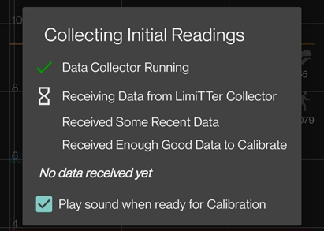

#### Senzorul este raportat ca FSL1


Asigurați-vă că rulați cele mai recente versiuni de xDrip+ și OOP2.

#### Conectarea la senzor nu a reușit

- Verificați ca OOP1 să fie dezactivat (vedeți [aici](#minimallooper-OOPsettings))

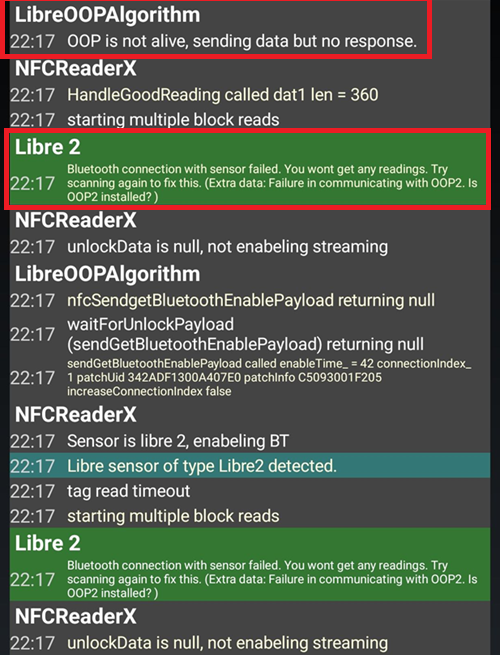

- Verificați ca OOP2 să nu fie adormit de aplicațiile și setările bateriei telefonului
- Verificați că protecția Google Play este dezactivată pentru că va închide OOP2
- Ați schimbat asocierea de tip Bluetooth în starea sistemului? Atingeți ecranul pentru a-l aduce înapoi la **<u>Dezactivat</u>**


#### Citiri ratate

Asigurați-vă că OOP2 arată valori care nu sunt 0 sau -1, acesta poate fi un semn că senzorul dumneavoastră eșuează (exemplul de mai jos în mmol/l).


Faptul că vechimea senzorului nu a avansat ar putea fi, de asemenea, un semn că senzorul dumneavoastră are probleme. Aceasta înseamnă că xDrip+ a primit o valoare, dar a eliminat-o deoarece nu a fost acceptabilă (eroare senzor).

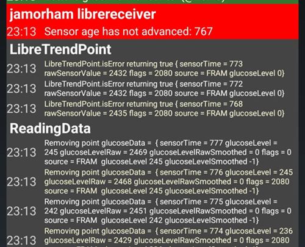

#### Reporniți de la zero asocierea senzorului

1. Meniul xDrip+ -> Stop senzor (nu va opri FSL2, doar schimbă starea xDrip+ ca să nu se pornească)
2. Meniu xDrip+ -> Stare sistem -> Uitați dispozitivul
3. Scanați senzorul cu NFC xDrip+. Așteptați cel puțin un minut
4. Meniul xDrip+ -> Porniți senzor. Așteptați cel puțin un minut
5. Scanați senzorul cu NFC xDrip+, de câteva ori, prin așteptarea a cel puțin unui minut între două scanări
