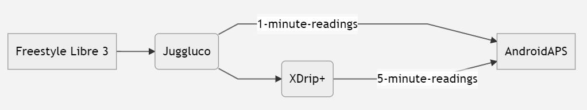
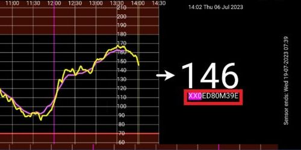
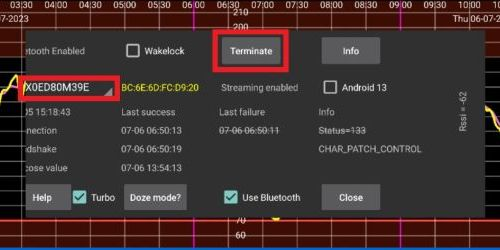

# **Freestyle Libre 3** și 3+

Freestyle Libre 3 (FSL3) necesită o configurare specială pentru a putea primi valorile glicemiei în AAPS. Există două modalități posibile de a obține valorile Freestyle Libre 3 (FSL3) în AAPS.

Metodele de mai jos pentru a realiza acest lucru sunt prin intermediul aplicației separate Juggluco. Acesta utilizează Juggluco pentru a primi date brute, la intervale de un minut de la senzor care apoi sunt transmise către xDrip+ sau AAPS. Senzorii noi pot fi porniți fie cu aplicația Libre 3, fie direct în Juggluco. Ghidul de mai jos indică procesul de pornire al unui senzor cu aplicația Juggluco. Dacă senzorul a fost pornit cu un cont Libreview conectat, este de asemenea posibilă comutarea între Juggluco și aplicația Libre 3 ca destinatar.

Juggluco poate, de asemenea, să transmită date către LibreView pentru partajarea cu furnizorii de servicii medicale atunci când senzorul este pornit cu aplicația Libre 3.

În cadrul xDrip+, senzorul poate fi calibrat în intervalul -40 mg/dl și +20 mg/dl (-2,2 mmol/l la +1,1 mmol/l) pentru a corecta diferențele dintre citirile unui glucometru și citirile senzorului.

## Metoda 1: utilizați citiri din minut în minut în mod direct
AndroidAPS este programat pentru citiri la fiecare 5 minute. Prin urmare, procesarea valorilor din minut în minut are limitări ocazionale.

Vedeți [aici](#juggluco-to-aaps).

## Metoda 2: convertiți citirile de la minut la minut în valori de 5 minute prin xDrip
Această metodă folosește Juggluco pentru a primi date brute la intervale de 1 minut de la senzorul care este sunt apoi transmise către xDrip+ pentru a fi uniformizate în datele pentru intervale de 5 minute care trebuie transmise către AAPS.

### Pasul 1: Configurare Juggluco
Descărcați și instalați aplicația Juggluco de [aici](https://www.juggluco.nl/Juggluco/download.html). Urmați instrucțiunile de [aici](https://www.juggluco.nl/Juggluco/libre3/)

Asigurați-vă că trimiteți valorile glicemiei la xDrip+: În setările Juggluco, puteți configura Juggluco pentru a-i trimite valoarea glicemiei la alte aplicații. Juggluco poate trimite trei tipuri de astfel de difuzări: **difuzarea aplicației modificate Libre** a fost la origine utilizată de aplicația modificată Librelink și poate fi folosită pentru a trimite valori ale glicemiei către xDrip+

### Pasul 2: Configurare xDrip

Valorile glicemiei sunt primite de aplicația xDrip+ de pe telefonul inteligent.

- Dacă nu l-ați configurat deja, descărcați [xDrip+](https://github.com/NightscoutFoundation/xDrip) și urmați instrucțiunile de pe pagina [cu setările xDrip+ ](../CompatibleCgms/xDrip.md).
- În xDrip+ selectați "Libre2 (aplicație modificată)" ca sursă de date.
- Dacă este necesar, introduceți "BgReading:d,xdrip libre_receiver:v" sub Setări mai puțin obișnuite → Setări de logare extra → etichete extra pentru logare. Aceasta va înregistra mesaje de eroare suplimentare pentru depanare.

- Tehnic, valoarea actuală a glicemiei este transmisă către xDrip+ în fiecare minut. Un filtru de medie ponderată calculează o valoare uniformizată pe baza ultimelor 25 de minute, în mod implicit. Puteți schimba perioada din meniul de caracteristici NFC.

  → Meniu Hamburger → Setări → Caracteristici scanare NFC → Uniformizați libre 3 când se utilizează metoda xxx

  

### Pasul 3: Porniți senzorul în xDrip

În xDrip+ pornește senzorul cu "Start Senzor" și "nu astăzi". Nu este necesar să țineți telefonul mobil pe senzor. De fapt, "Start Senzor" nu va porni fizic niciun senzor Libre 3 sau nu va interacționa cu aceștia în vreun caz. Aceasta este doar pentru a-i indica aplicației xDrip+ că un nou senzor va furniza valori ale glicemiei. Dacă sunt disponibile, introduceți două valori măsurate ale glicemiei capilare pentru calibrarea inițială. Acum valorile glicemiei ar trebuie să fie afișate în xDrip+ la fiecare 5 minute. Valorile pierdute, spre exemplu pentru că ați fost prea departe de telefon, nu vor fi recuperate înapoi.

Așteptați cel puțin 15-20 minute dacă nu există încă date.

După schimbarea senzorului, xDrip+ va detecta automat senzorul nou și va șterge toate datele de calibrare. Puteți să vă verificați glicemia după activare și să faceți o nouă calibrare inițială.

### Pasul 4: Configurați AndroidAPS

- Vedeți [aici](#juggluco-to-xdrip) și reveniți.

- Dacă AndroidAPS nu primește valorile glicemiei atunci când telefonul este în modul avion, folosiți "Identificați destinatarul"
- Opriți uniformizarea (făcută deja în xDrip+)

## Schimbări ulterioare ale senzorilor

1. Deschide Juggluco și notează numărul de serie al senzorului existent

2. Acum pur și simplu scanați noul senzor cu cititorul NFC al telefonului. Juggluco va afișa o notificare în cazul în care procesul a fost inițiat cu succes.
3. Când sunteți gata să dezactivați senzorul vechi, atunci deschideți meniul Juggluco prin apăsare oriunde în spațiul gol din colțul din stânga sus al ecranului.
4. Selectați senzorul expirat și apăsați "Terminare"

Notă: Când doi senzori sunt activi Juggluco va trimite cea mai recentă valoare de la senzor la xDrip+. Dacă senzorii nu sunt calibrați și citesc glicemia în mod similar, acest lucru poate duce la raportarea unor valori săltărețe ale glicemiei către xDrip+. If you terminate the wrong sensor, you can reactivate it by simply scanning the sensor.

## Switch sensor between Libre 3 and Juggluco app

Dacă senzorul a fost pornit cu un cont Libreview conectat, este de asemenea posibilă comutarea între Juggluco și aplicația Libre 3 ca destinatar. This requires the following steps:

1. Install the Libre 3 app from Google Playstore
2. Set up the Libre 3 app with the Libreview account with which the sensor was activated.
3. Force stop the Juggluco app in the Android settings.
4. In the Libre 3 menu, click "Start Sensor", select "Yes", "Next" and scan your sensor.
5. After some minutes, the BG-Values should be visible within Libre 3 App.

In order to switch from the Libre 3 app to Juggluco, you need to force-stop Libre 3 app via Android settings and proceed with Step 1 & 2.

(libre3-experiences-and-troubleshooting)=
## Experiences and Troubleshooting

### Troubleshooting Libre3 -> Juggluco Connection

- Make sure you are using a current version of the Juggluco app
- Check your settings according to this guide
- You may sometimes have to force stop the Libre 3 app and Juggluco and restart it.
- Disable Bluetooth and enable it again
- Wait some time or try to close Juggluco
- Older versions of Juggluco (below 2.9.6) do not send subsequent data from the Libre3 sensor to connected devices (e.g. Juggluco on WearOS). You may need to click "Resend data" in the patched Libre3 app (Juggluco menu).

### Further help

Original instructions: [jkaltes website](https://www.juggluco.nl/Juggluco/libre3/)

Additional Github repo: [Github link](https://github.com/maheini/FreeStyle-Libre-3-patch)
