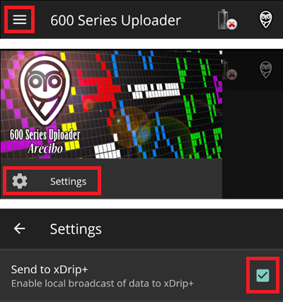

# Pentru utilizatorii de MM640G sau MM630G

-   Dacă nu ați configurat deja, descărcați [600SeriesAndroidUploader](https://pazaan.github.io/600SeriesAndroidUploader/) și urmați instrucțiunile de la [Nightscout](https://nightscout.github.io/uploader/setup/?h=uploader#medtronic-600-series-with-uploader).
-   În aplicația 600 Series Uploader mergeți la Setări > Trimiteți la xDrip+ și selectați PORNIT (bifă).

-   Selectați MM640g în [Configurator, Sursă glicemie](#Config-Builder-bg-source).

