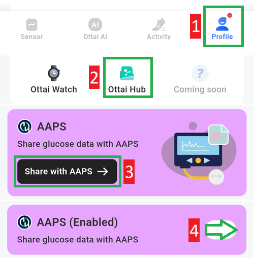

# Ottai M8

## Using M8 with Ottai app

-   Descărcați și instalați fișierul apk de la <https://play.google.com/store/apps/details?id=com.ottai.seas>. Pentru versiunea chineză Ottai folosiți <https://ottai.com.cn/70ICjxAI4i>

-   Porniți senzorul

- Selectați Ottai în [Configurator, Sursă glicemie](#Config-Builder-bg-source).

Activați transmisiunea în aplicația Ottai:

1. Selectați profilul
2. Ottai hub
3. Atingeți Distribuiți cu AAPS, acceptați acordul de transfer terț de date
4. Activați partajarea datelor de glicemie cu AAPS

