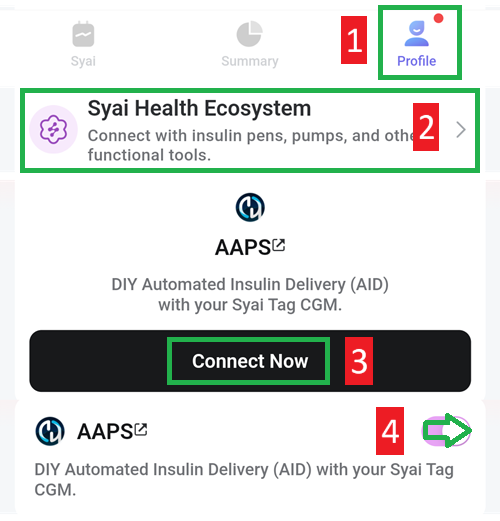

# Syai X1

## Using X1 And Syai Tag app

-   Instalați aplicația de la <https://play.google.com/store/apps/details?id=com.syai.tag>.

-   Start X1 sensor

- Selectați Syai Tag în [Configurator, Sursă glicemie](#Config-Builder-bg-source).

Activați transmisiunea în aplicația Syai:

1. Selectați profilul
2. Syai Health Ecosystem
3. Atingeți Conectați-vă acum cu AAPS, acceptați acordul de transfer terț al datelor
4. Activați partajarea datelor cu AAPS

