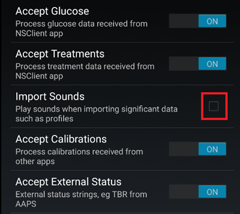
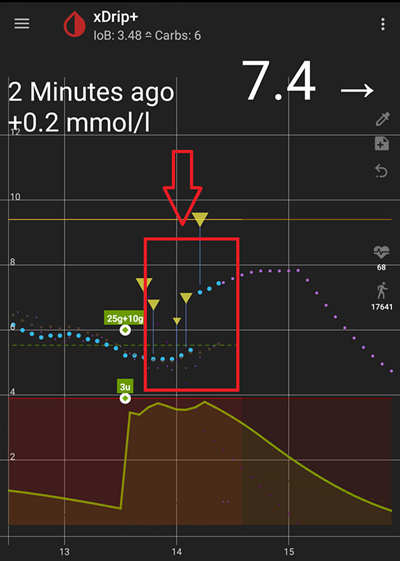
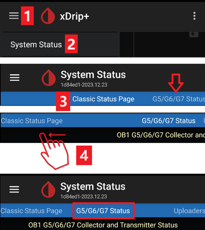
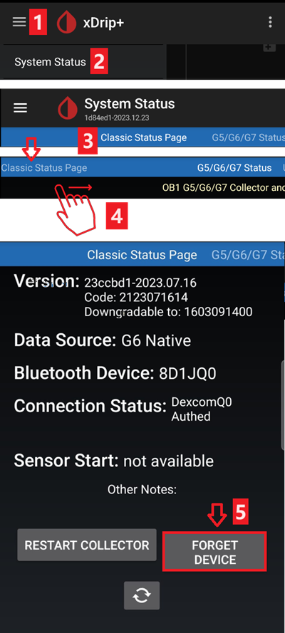
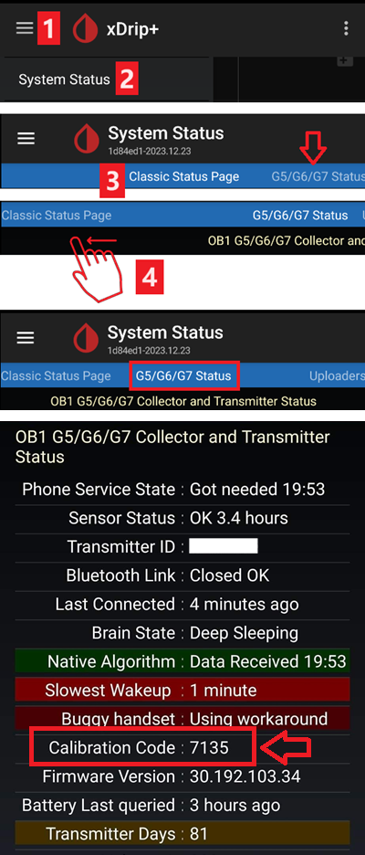
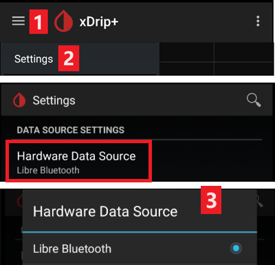
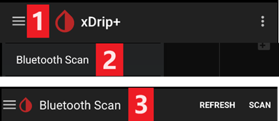
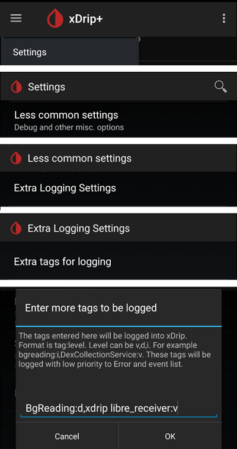

# Cofigurare xDrip+

Dacă nu a fost configurat deja, atunci descărcați [xDrip+](https://jamorham.github.io/#xdrip-plus).

Dezactivați optimizarea bateriei și permiteți activitate de fundal pentru aplicația xDrip+.

Puteți descărca în siguranță [ultimul APK (stabil)](https://xdrip-plus-updates.appspot.com/stable/xdrip-plus-latest.apk) cu excepția cazului în care aveți nevoie de caracteristici recente sau folosiți senzori care sunt integrați activ (cum ar fi G7), în cazul acela ar trebui să utilizați cel mai recent [Nightly Snapshot](https://github.com/NightscoutFoundation/xDrip/releases).

## Setari de baza pentru toate sistemele CGM & FGM

### Dezactivează încărcarea datelor în Nightscout

Începând cu AAPS 3.2, nu ar trebui să lăsați nicio altă aplicație să încarce date (glicemia din sânge și tratamente) în Nightscout.

→ Meniu Hamburger (1) → Setări (2) → Cloud Upload (3) -> Nightscout Sync (REST-API)(4) → Comutați **OFF** `Activat` (5)

#### Dezactivează calibrarea automată și tratamentele

Dacă utilizați o versiune mai veche de AAPS (înainte de 3.2), asigurați-vă că dezactivați `Calibrarea automată` (7) În cazul în care caseta de selectare pentru `Calibrare automată` este bifată, activați tratamentele `Descărcați` (6) o dată, apoi ștergeți căsuța de selectare pentru `Calibrarea automată` și dezactivați din nou `Descărcați tratamentele`.

Atingeți `Opțiuni suplimentare`(8)

    {admonition} Atenționare siguranță
    :class: atenționare
    Trebuie să dezactivați "Încarcă tratamente" din xDrip+, altminteri tratamentele pot fi înregistrate de 2 ori în AAPS ceea ce va duce la COB și IOB false.

Dezactivați `Încărcați tratamentele`(9) și asigurați-vă că **NU** utilizați `Date de completare retroactivă` (11).

Opțiunea `Alerta privind eșecurile` ar trebui, de asemenea, dezactivată (10). Altfel veți primi o alarmă la fiecare 5 minute în caz de probleme cu rețeaua Wi-Fi/mobile sau în cazul în care serverul nu este disponibil.

### **Setări între aplicații** (Broadcast)

Dacă urmează să utilizați AAPS și datele trebuie transmise către AAPS trebuie să activați difuzarea în xDrip+ în setările între aplicații.

→ Meniu Hamburger (1) → Setări (2) → Setări între aplicații (3) → Transmisiune locală **PORNITĂ** (4)

Pentru ca valorile să fie identice în AAPS în raport cu xDrip+, ar trebui să activați `Trimiteți valoarea de glicemie afișată` (5).

Activează transmisiunea compatibilă (6).

Dacă ați activat de asemenea `Acceptați tratamentele` în xDrip+ și `Activați transmisiunile la xDrip+` în plugin-ul AAPS xDrip+, apoi xDrip+ va primi insulină, carbohidrați și informații privind rata bazală din AAPS.

Dacă activați `Acceptați calibrările`, xDrip+ va utiliza calibrările de la AAPS. Fiți atent când utilizați această funcționalitate cu senzorii Dexcom: citiți [acest](https://navid200.github.io/xDrip/docs/Calibrate-G6.html) mai întâi.

Amintiți-vă să dezactivați Importul de sunete pentru a evita declanșarea sunetelor în xDrip+ de fiecare dată când AAPS trimite o schimbare de bazală/profil.

(xdrip-identify-receiver)=

#### Identificare receptor

- Dacă sunt probleme cu transmisiunea locală (AAPS nu primește valori glicemice din xDrip+) mergeți la → Hamburger Menu (1) Setări (2) → Setări între aplicații (3) → Identifică receptorul (7) și introduceți `info.nightscout.androidaps` pentru AAPS (dacă folosești PumpControl, vă rugăm să introduceți `info.nightscout.aapspumpcontrol` în schimb!!).
- Atenție: Auto-corectarea tinde uneori să schimbe litera i în majuscula I. **Trebuie să utilizați doar litere mici** când tastați `info.nightscout.androidaps` (sau `info.nightscout.aapspumpcontrol` pentru PumpControl). Capital I would prevent the App from receiving BG values from xDrip+.
    
    

## Utilizați AAPS pentru a calibra în xDrip+

- Dacă doriți să aveți posibilitatea de a utiliza AAPS pentru calibrări mergeți în xDrip la Setări > Setări între aplicații > Acceptă Calibrări și selectați ON. 
- S-ar putea să doriți de asemenea să revizuiți opțiunile din Setări → Setări mai puțin obișnuite → Setări avansate de calibrare.

## Dexcom G6

- The Dexcom G6 transmitter can simultaneously be connected to the Dexcom receiver (or alternatively the t:slim pump) and one app on your phone.
- When using xDrip+ as receiver uninstall Dexcom app first. **Transmiţătorul NU POATE FI conectat simultan cu xDrip+ si aplicatia Dexcom**
- If you need Clarity and want to profit from xDrip+ features, use the [Build Your Own Dexcom App](#DexcomG6-if-using-g6-with-build-your-own-dexcom-app) with local broadcast to xDrip+, or use xDrip+ as a Companion app receiving notifications from the official Dexcom app.

### Versiunea xDrip+ în funcție de seria transmitatorului G6.

- All G6 transmitters manufactured after fall/end 2018 are called "Firefly". They do not allow sensor restart without [removing the transmitter](https://navid200.github.io/xDrip/docs/Remove-transmitter.html), they do not send raw data. It is recommended to use the latest [Nightly Snapshot](https://github.com/NightscoutFoundation/xDrip/releases).
- Old rebatteried transmitters and modified transmitters allow sensor life extension and restarts, they also send raw data. You can use the [latest APK (stable)](https://xdrip-plus-updates.appspot.com/stable/xdrip-plus-latest.apk).

### Setări specifice Dexcom

- Follow [these instructions](https://navid200.github.io/xDrip/docs/G6-Recommended-Settings.html) to setup xDrip+.

### Nu se recomandă repornirea preventivă

**Only rebatteried or modified Dexcom transmitters. [Preemptive restarts](https://navid200.github.io/xDrip/docs/Preemptive-Restart.html) do not work with standard transmitters and will stop the sensor completely: you need to [remove the transmitter](https://navid200.github.io/xDrip/docs/Remove-transmitter.html) to restart the sensor.**

The automatic extension of Dexcom sensors (`preemptive restarts`) is not recommended as this might lead to “jumps” in BG values on day 9 after restart.

To use it safely, there are a few points to be aware of:

- If you are using the native data with the calibration code in xDrip+ or Spike, the safest thing to do is not allow preemptive restarts of the sensor.
- If you must use preemptive restarts, then make sure you insert at a time of day where you can observe the change and calibrate if necessary. 
- If you are restarting sensors, either do it without the factory calibration for safest results on days 11 and 12, or ensure you are ready to calibrate and keep an eye on variation.
- Pre-soaking of the G6 with factory calibration is likely to give variation in results. Dacă faceți preinserare, atunci pentru a obține cele mai bune rezultate, probabil că va trebui să calibrați senzorul.
- If you aren’t being observant about the changes that may be taking place, it may be better to revert to non-factory-calibrated mode and use the system like a G5.

To learn more about the details and reasons for these recommendations read the [complete article](https://www.diabettech.com/artificial-pancreas/diy-looping-and-cgm/) published by Tim Street at [www.diabettech.com](https://www.diabettech.com).

(xdrip-connect-g6-transmitter-for-the-first-time)=

### Conectează transmițătorul G6 pentru prima dată

**For second and following transmitters see [Extend transmitter life](#xdrip-extend-transmitter-life) below.**

Follow [these instructions](https://navid200.github.io/xDrip/docs/Starting-G6.html).

(xdrip-transmitter-battery-status)=

### Stare baterie transmiţător

- Battery status can be controlled in system status  
    → Hamburger Menu (1) → System Status (2) → If you are on the Classic Status Page (3) swipe the screen (4) to reach → G5/G6/G7 Status screen.

- See [here](https://navid200.github.io/xDrip/docs/Battery-condition.html) for more information.

(xdrip-extend-transmitter-life)=

### Extindere durata de functionare a transmiţătorului

- [Lifetime](https://navid200.github.io/xDrip/docs/Transmitter-lifetime.html) cannot be extended for Firefly transmitters: only rebatteried or modified transmitters.
- Follow [these instructions](https://navid200.github.io/xDrip/docs/Hard-Reset.html) for non-Firefly transmitters.

(xdrip-replace-transmitter)=

### Înlocuire transmiţător

- Dezactivează receptorul Dexcom original (dacă este utilizat).
- [Stop sensor](https://navid200.github.io/xDrip/docs/Dexcom/StartG6Sensor.html) (only if replacing sensor).

- Scoate dispozitivul de la starea sistemului xDrip+ ȘI DIN setările de bluetooth ale smartphone-ului (va fi afișat ca Dexcom?? unde ?? are the last two digits of the transmitter serial no.)  
    → Hamburger Menu (1) → System Status (2) → If you are not on the Classic Status Page (3) swipe the screen (4) to reach it → then tap Forget Device (5).

- Remove transmitter (and sensor if replacing sensor). To remove transmitter without removing sensor see [this](https://navid200.github.io/xDrip/docs/Remove-transmitter.html), or this video <https://youtu.be/AAhBVsc6NZo>.
- Pune transmiţătorul vechi departe de a preveni reconectarea. A microwave is a perfect Faraday shield for this - but unplug power cord to be 100% sure no one is turning the microwave on.
- Follow [these instructions](https://navid200.github.io/xDrip/docs/Starting-G6.html).
- Nu reporni receptorul Dexcom original (dacă este utilizat) înainte ca xDrip+ să afișeze primele citiri.

### Senzor nou

- Dezactivează receptorul Dexcom original (dacă este utilizat).
- Stop sensor following [these instructions](https://navid200.github.io/xDrip/docs/Dexcom/StartG6Sensor.html).

- Insert and then start a new sensor following [these instructions](https://navid200.github.io/xDrip/docs/Starting-G6.html).

(xdrip-retrieve-sensor-code)=

### Recuperează codul senzorului

→ Hamburger Menu (1) → System Status (2) → If you are on the Classic Status Page (3) swipe the screen (4) to reach → G5/G6/G7 Status screen → Calibration Code.

(xdrip-troubleshooting-dexcom-g5-g6-and-xdrip)=

### Depanare Dexcom G5/G6 şi xDrip+

#### Problemă la conectarea transmiţătorului

Follow [these instructions](https://navid200.github.io/xDrip/docs/Connectivity-troubleshoot.html).

#### Problemă la pornirea unui senzor nou

Follow [these instructions](https://navid200.github.io/xDrip/docs/Dexcom/SensorFailedStart.html).

## Libre 1

- Setup your NFC to Bluetooth bridge in xDrip+
    
    → Hamburger Menu (1) → Settings (2) → Less common settings (3) → Bluetooth Settings (4)

- In Bluetooth Settings set the checkboxes exactly as in the screenshots below (5)
    
    - Disable watchdogs as they will reset the phone Bluetooth and interrupt your pump connection.
    
    

- You can try to enable the following settings (7)
    
    - Folosește scanarea
    - Trust Auto-Connect
    - Use Background Scans

- If you easily lose connection to the bridge or have difficulties recovering connection, **DISABLE THEM** (8).
    
    

- Leave all other options disabled unless you know why you want to enable them.
    
    

### Nivel baterie de la transmițătorul Libre

- Battery level of bridges such as MiaoMiao and Bubble can be displayed in AAPS (not Blucon).
- Details can be found on [screenshots page](#screens-sensor-level-battery).

### Conectează Transmiterul Libre& pornește senzorul

- If your sensor requires it (Libre 2 EU and Libre 1 US) install the latest out of process algorithm.

- Your sensor must be already started using the vendor app or the reader (xDrip+ cannot start or stop Libre sensors).

- Set the data source to Libre Bluetooth.
    
    → Hamburger Menu (1) → Settings (2) → Select Libre Bluetooth in Hardware Data source (3)
    
    

- Scan Bluetooth and connect the bridge.
    
    → Hamburger Menu (1) → Scan Bluetooth (2) → Scan (3)
    
    - If xDrip+ can't find the bridge, make sure it's not connected to the vendor app. Put it in charge and reset it.
    
    

- Start the sensor in xDrip+.
    
        {admonition} Safety warning
        :class: warning
        Do not use sensor data before the one hour warm-up is over: the values can be extremely high and cause wrong decisions in AAPS.
    
    → Hamburger Menu (1) → Start sensor (2) → Start sensor (3) → Set the exact time you started it with the reader or the vendor app. If you didn't start it today, answer "Not Today" (4).

(xdrip-libre2-patched-app)=

## Libre 2 patched app

- Set the data source to Libre patched app.
    
    → Hamburger Menu (1) → Settings (2) → Select Libre (patched App) in Hardware Data source (3)
    
    

- You can add `BgReading:d,xdrip libre_receiver:v` under Less Common Settings->Extra Logging Settings->Extra tags for logging. This will log additional error messages for trouble shooting.

