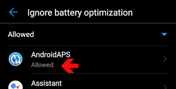
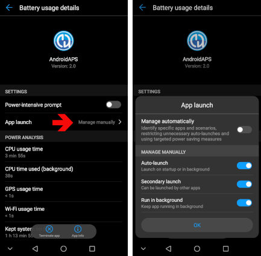
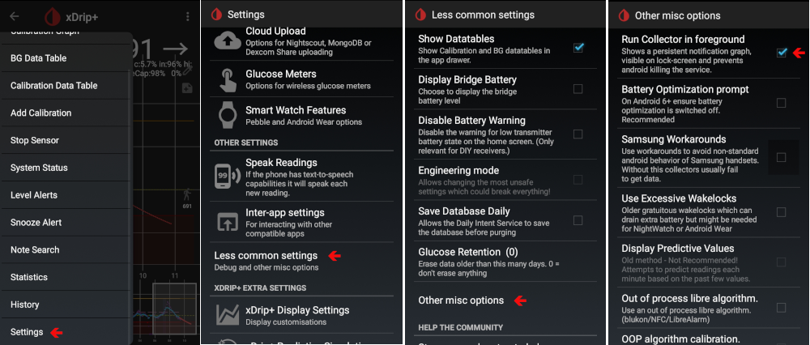

# Cum să configurați un telefon Huawei

Există diferite opțiuni, unele specifice Android, altele specifice Huawei:

* Adăugați AAPS și xDrip+ la lista de aplicații care ignoră optimizarea bateriei:
  
  * Setări / Aplicații / Setări / autorizări speciale / Ignorați optimizarea bateriei / Selectați "Toate aplicațiile" / Setați aplicația la permise
    
    

* Setați setările opțiunii bateriei:
  
  * Setări / Aplicație / Selectați AndroidAPS/xdrip+ / Sub baterie / Lansarea aplicației
    
    * Asigurați-vă că eliminați „gestionarea automată”
    * Permiteți:
      
      * Lansare automată
      * Lansare secundară (poate fi lansată de către alte aplicații)
      * Pornire în fundal
        
        

* Blocați aplicația
  
  * Accesați lista de aplicații recente și selectați pictograma de blocare
    
    

Pentru xDrip+, trebuie să activați notificările persistente (în aplicația xDrip+):

* Setări / setări mai puțin obișnuite / alte diverse opțiuni / Pornește Colectorul în prim-plan
  
  

În funcție de versiunea Android, aceste setări sunt în altă parte. Aceste explicații sunt pentru Android 8.1.