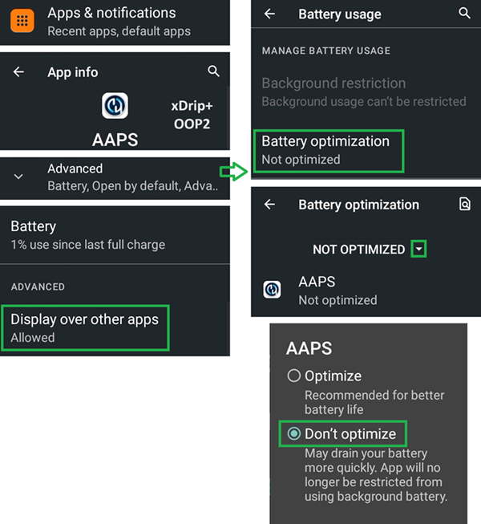
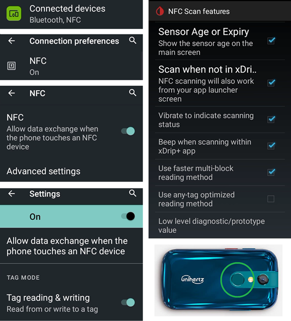
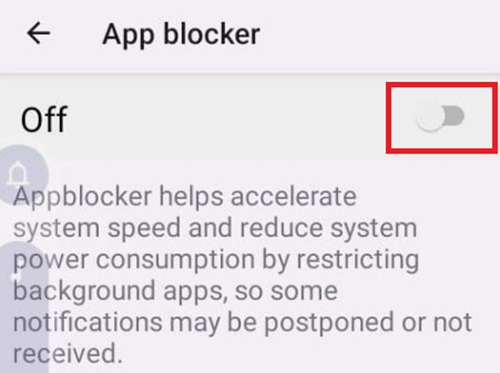

# Jelly

## Jelly 2

A nu se confunda cu Jelly Star (mai jos).

**Avantaje**

* E foarte mic.
* Android 11.
* Chiar dacă le spui oamenilor, este posibil ca aceștia să nu considere că este un telefon inteligent normal și va fi acceptat mai ușor în circumstanțe în care telefoanele sunt în mod normal interzise.

**Dezavantaje**

* Recomandat numai pentru utilizatori de buclă experimentați (unele setări nu sunt recunoscute, trebuie să le știți din experiența cu un telefon Android mai mare folosit la AAPS, cum și unde se află. Unele butoane AAPS sunt greu de atins și necesită mult pipăit, dar nu cu degete butucănoase.)
* Poate fi folosit numai ca telefon special pentru buclă. E mai bine să aveți un telefon inteligent normal în buzunar. 

### Optimizarea vieții bateriei

Jelly 2 vine cu caracteristici puternice de optimizare care **trebuie** dezactivate pentru AAPS (și pentru alte aplicații DIY precum BYODA, xDrip+, OOP2, Juggluco, șamd).

Puteți lăsa asistența inteligentă activată, dar **trebuie dezactivată pentru aplicațiile DIY**.

Poți activa NFC pentru senzorii Libre.

## Jelly Star Mini

**Features**

* Android 13
* 8 GB RAM

### Optimizarea vieții bateriei

Pentru a evita interferența cu **AAPS**, utilizarea bateriei Jelly Star ar trebui să fie dezactivată prin selectarea "nerestricționat" (și pentru alte aplicații **DIY** cum ar fi BYODA, xDrip+, OOP2, Juggluco, șamd).

### Asistență inteligentă și blocarea aplicațiilor

Ca și în cazul Jelly 2 (deasupra), Jelly Star ar trebui să aibă "Asistență Inteligentă" dezactivată pentru aplicațiile **DIY**. Similar, 'App Blocker' sub 'Settings' trebuie de asemenea oprit pentru a evita perturbările privind **AAPS**:

### Protecție Google Play

Nu uitați să dezactivați Google Play Protect.

### Conexiune la distanță pentru apk Wear 

Pentru anumite ceasuri inteligente, cum ar fi Galaxy Samsung, 'Conexiune la distanță' sub funcțiile avansate ale Galaxy Samsung trebuie să fie trecute cu **pornit** pentru a utiliza Jelly 2, **Wear.apk** & **AAPS** de la distanță prin wifi.

