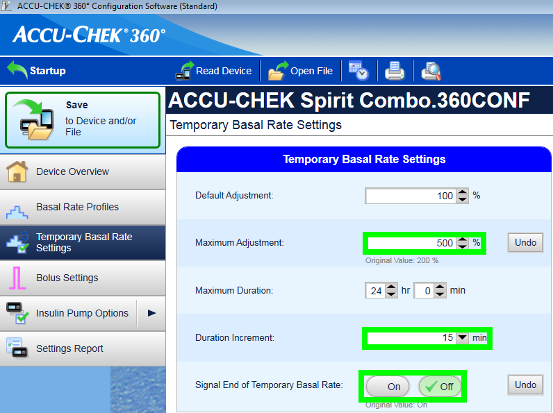
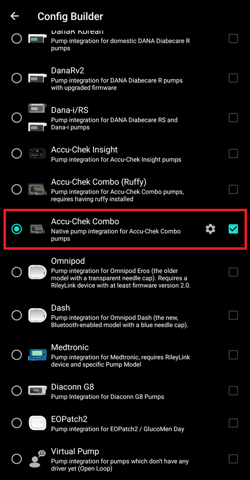
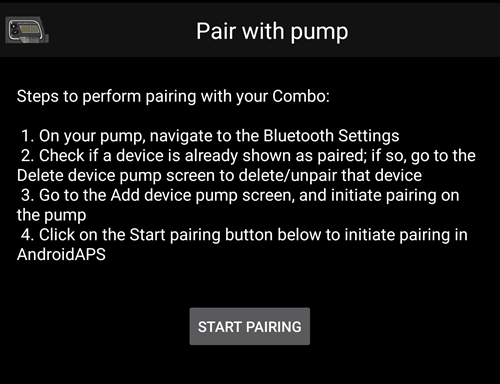
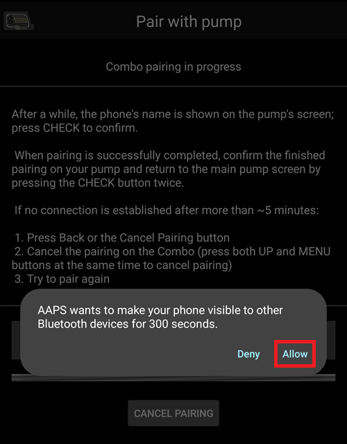
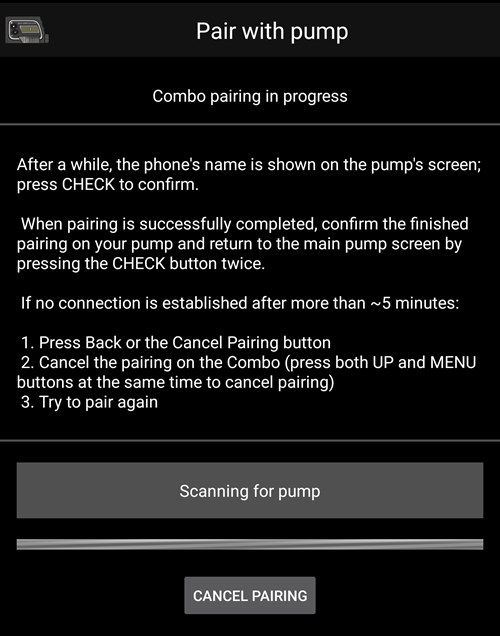

# Pompa Accu Chek Spirit Combo

**Acesta aplicație face parte dintr-o soluție DIY (do-it-yourself/ o aplicație pe care o construiești singur) și nu este un produs finit; ea solicita implicarea utilizatorului: să citească, să învețe și să înțeleagă sistemul, de la construcție pana la modul de utilizare. Nu este un facut pentru a vă gestiona tratamentul diabetul in totalitate, dar vă permite să vă îmbunătățiți calitatea vieții alaturi de diabet, dacă sunteți dispus să acordați timpul necesar. Acordați-vă timp pentru a învăța sa-l intelegeti si folosi. You alone are responsible for what you do with it.**

## Cerințe hardware și software

* O pompă de insulină Accu-Chek Combo (orice versiune de firmware, funcționează toate).
* Un dispozitiv Smartpix sau Realtyme împreună cu Softul de Configurare 360 pentru a configura pompa. (Roche trimite clienților lor la cerere și gratuit dispozitivele Smartpix împreuna cu softul de configurare)
* Un telefon compatibil. Android 9 (Pie) sau mai nou este obligatoriu. Dacă folosiți LineageOS, versiunea minimă acceptată este 16.1. Vedeți notele [de eliberare](#maintenance-android-version-aaps-version) pentru detalii.
* Aplicația AndroidAPS instalată pe telefon.

Unele telefoane pot funcționa mai bine decât altele, în funcție de calitatea conexiunii prin Bluetooth și dacă au sau nu o logică suplimentară foarte agresivă de economisire a energiei. O listă de telefoane poate fi găsită în documentul [Telefoane AAPS](#Phones-list-of-tested-phones). Atenție la faptul că aceasta nu este o listă completă și reflectă doar experiența avută de utilizator în folosire. Vă încurajăm să scrieți și experiența pe care o aveți dumneavoastră, cu scopul de a ajuta și alte persoane în luarea unei decizii (toate aceste proiecte sunt despre a vă aduce propria contribuție la binele comunității).

(combov2-before-you-begin)=
## Înainte să începeți

**SIGURANȚA MAI ÎNTÂI** - nu încercați acest proces într-un mediu în care nu vă puteți recupera după o eroare. Țineți la îndemână dispozitivul Smartpix / Realtyme, împreună cu programul de configurare 360. Planificați pentru a petrece aproximativ o oră pentru a configura totul și pentru a verifica dacă totul funcționează corect.

Fiți conștienți de următoarele limitări:

* Bolusul extins și bolusul multiplu nu sunt acceptate în prezent (puteți utiliza [Carbohidrați extinși](../DailyLifeWithAaps/ExtendedCarbs.md)).
* Doar un singur profil bazal (primul) este acceptat.
* Bucla este dezactivată dacă profilul actual activ al pompei nu este profilul cu numărul 1. Acest lucru continuă până când profilul cu numărul 1 devine activ; când se face acest lucru, data viitoare când AAPS se conectează (fie pe cont propriu după un timp, fie pentru că utilizatorul apasă butonul de reîmprospătare din interfața de utilizator combov2), va observa că acel profil cu numărul 1 este cel curent și bucla se va activa din nou.
* Dacă bucla solicită ca o RBT care rulează să fie anulată, Combo va seta o RBT de 90% sau 110% timp de 15 minute. Acest lucru se datorează faptului că anularea unui RBT provoacă o alertă în pompă care provoacă o mulțime de vibrații, iar aceste vibrații nu pot fi dezactivate.
* Stabilitatea conexiunii Bluetooth variază în funcție de telefon, ceea ce cauzează apariția alertei "pompă inaccesibilă" și nu se mai realizează nici o altă conexiune între telefon și pompă. Dacă apare această eroare, asigurați-vă că Bluetooth este activat, apăsați butonul Refresh în pagina Combo pentru a afla dacă aceasta a fost cauzată de o problemă intermitentă și dacă în continuare nu există conexiune, reporniți telefonul ceea ce de obicei rezolvă problema.
* Există și o altă problemă atunci când o repornire a telefonului nu ajută, dar apăsarea unui buton al pompei trebuie apăsat (buton ce resetează sistemul Bluetooth al pompei), înainte ca pompa să accepte din nou conexiuni cu telefonul.
* Setarea unei RBT în pompă ar trebui evitată, deoarece doar bucla ar trebuie să ia astfel de decizii și să facă astfel de acțiuni - ar trebui să fie singura care controlează RBT-urile. Detectarea unei RBT noi în pompă durează până la 20 de minute și efectul RBT-ului va fi luat în calcul doar începând cu momentul detecției, astfel că în cazul cel mai rău pot exista 20 de minute a unei RBT a cărei valoare să nu se reflecte în IOB.

Dacă ați folosit vechiul driver Combo care depinde de aplicația Ruffy separată și doriți să mutați la una nouă, observați că asocierea trebuie refăcută – Ruffy și noul driver Combo nu pot împărtăși informații privind asocierea. De asemenea, asigurați-vă că Ruffy _nu_ rulează. Dacă aveți dubii, apăsați lung pictograma Ruffy pentru a deschide un meniu contextual. În acel meniu, apăsați pe "App Info". În interfața care tocmai s-a deschis, apăsați "Oprire Forțată". În acest fel, se asigură că o instanță activă Ruffy nu poate interfera cu noul driver.

De asemenea, dacă migrați de la vechiul driver, fiți conștient de faptul că noul driver comunică comanda unui bolus într-un mod complet diferit către Combo, care este mult mai rapid, astfel încât să nu fiți surprinși atunci când un bolus începe imediat, indiferent de doză. În plus, sugestiile, sfaturile și trucurile generale șamd cu privire la modul de abordare al asocierii la Ruffy și problemele de conexiune nu se aplică aici, de vreme ce acesta este un driver complet nou care nu împarte niciun cod cu cel vechi.

Acest nou driver este scris în prezent pentru a sprijini următoarele limbi pe Combo. (Acest lucru nu are legătură cu limba din AAPS - este limba afișată în LCD al pompei Combo însăși.)

* Engleză
* Spaniolă
* Franceză
* Italiană
* Rusă
* Turcă
* Poloneză
* Cehă
* Hungarian
* Slovak
* Romanian
* Croatian
* Dutch
* Greek
* Finnish
* Norwegian
* Portuguese
* Swedish
* Danish
* German
* Slovenian
* Lithuanian

**Important**: If your pump is set to a language that is not part of this list, please contact the developers, and set the pump's language to one in this list. Otherwise, the driver won't work properly.

## Phone setup

It is very important to make sure that battery optimizations are turned off. AAPS already auto-detects when it is subject to these optimizations, and requests in its UI that these be turned off. But, on modern Android phones, Bluetooth _itself_ is an app (a system app). And, usually, that "Bluetooth app" is run _with battery optimizations on by default_. As a result, Bluetooth can refuse to respond when the phone aims to save power because it kills off the Bluetooth app. This means that in that Bluetooth system app's settings, battery optimizations must be turned off as well. Unfortunately, how one can find that Bluetooth system app differs between phones. In stock Android, go to Settings -> Apps -> See all N apps (N = the number of apps on your phone). Then, open the menu to the top right corner, tap on "Show system" or "Show system apps" or "All apps". Now, in the newly expanded list of apps, look for a "Bluetooth" app. Select it, and on its "App info" UI, tap on "Battery". There, disable battery optimizations (sometimes called "battery usage").

## Combo setup

* Configure the pump using the Accu-Chek 360 Configuration Software. Dacă nu aveți acest software, contactați linia telefonică de suport Accu-Chek. De obicei, aceștia vor trimite către utilizatorii înregistrați un CD conținând software-ul "360° Pump Configuration Software" și un dispozitiv de conectare USB-infraroșu SmartPix (de asemenea, se poate folosi și dispozitivul Realtyme).

  - **Required settings** (marked green in screenshots):

     * Set/leave the menu configuration as "Standard", this will show only the supported menus/actions on the pump and hide those which are unsupported (extended/multiwave bolus, multiple basal rates), which cause the loop functionality to be restricted when used because it's not possible to run the loop in a safe manner when used.
     * Verify the _Quick Info Text_ is set to "QUICK INFO" (without the quotes, found under _Insulin Pump Options_).
     * Set TBR _Maximum Adjustment_ to 500%
     * Disable _Signal End of Temporary Basal Rate_
     * Set TBR _Duration increment_ to 15 min
     * Activați Bluetooth-ul

  - **Recommended settings** (marked blue in screenshots)

     * Stabiliți alarma de cartuș pe terminate așa cum considerați necesar
     * Configurați un bolus maxim potrivit indicațiilor dumneavoastră terapeutice pentru a vă proteja de o eventuală eroare posibilă în software
     * În mod similar, configurați o durată maximă a RBT ca un mijloc de protecție. Allow at least 3 hours, since the option to disconnect the pump for 3 hours sets a 0% for 3 hours.
     * Enable key lock on the pump to prevent bolusing from the pump, esp. when the pump was used before and quick bolusing was a habit.
     * Stabiliți un interval minim de 5.5, respectiv 5 pentru timpul după care ecranul să se stingă automat sau meniurile să se stingă automat. This allows the AAPS to recover more quickly from error situations and reduces the amount of vibrations that can occur during such errors

  

  

  

  

## Activating the driver and pairing it with the Combo

* Select the "Accu-Chek Combo" driver in [Config builder > Pump](../SettingUpAaps/ConfigBuilder.md). **Important**: There is the old driver, called "Accu-Chek Combo (Ruffy)", in that list as well. Do _not_ select that one.

  

* Atingeți rotița pentru a deschide setările driverului.

* În setările interfeței utilizatorului, apăsați pe butonul 'Asociați cu pompa' din partea de sus a ecranului. Aceasta deschide interfața utilizatorului de asociere Combo. Urmați instrucțiunile afișate pe ecran pentru a începe asocierea. Când Android solicită permisiunea de a face telefonul vizibil pentru alte dispozitive Bluetooth, apăsați "Permiteți". În cele din urmă, Combo va afișa un cod PIN personalizat de 10 cifre pe ecran, iar driverul îl va solicita. Introduceți acel cod PIN în câmpul corespunzător.

  

  

  

  

  

* Când driverul cere codul PIN de 10 cifre afișat în Combo, iar codul este introdus incorect, următorul mesaj este afișat: 

* Odată ce asocierea a fost făcută, interfața utilizatorului este închisă prin apăsarea butonului OK din ecran care arată că asocierea a reușit. După ce a fost închis, reveniți la interfața de utilizare a setărilor de driver. Butonul "Asociați pompă" ar trebui acum să fie gri și dezactivat.

  Fila Combo Accu-Chek arată așa după asocierea cu succes:

  

  dacă totuși nu există o asociere cu Combo, fila arată așa:

  

* Pentru a verifica configurarea (cu pompa **deconectată** de la orice canulă pentru a fi în siguranță!) utilizați AAPS pentru a seta o RBT de 500% pentru 15 minute și administrați un bolus. Pompa ar trebui să aibă acum un RBT activă și să afișeze bolusul în istoric. AAPS ar trebui, de asemenea, să afișeze RBT activă și bolusul administrat.

* Pe Combo, este recomandat să activați blocarea tastelor pentru a preveni bolusul de la pompă, în special când pompa a fost utilizată înainte și utilizarea funcției de "bolus rapid" era un obicei.

## Note despre asociere

Accu-Chek Combo a fost dezvoltată înainte ca Bluetooth 4.0 să fie lansat și la doar un an de la lansarea primei versiuni de Android. Acesta este motivul pentru care modul ei de asociere cu alte dispozitive nu este 100 % compatibil cu modul în care se face astăzi în Android. Pentru a depăși pe deplin această situație, AAPS ar avea nevoie de permisiuni la nivelul sistemului, care sunt disponibile doar pentru aplicațiile de sistem. Acestea sunt instalate de către producătorii de telefoane pe telefon - utilizatorii nu pot instala aplicațiile de sistem.

Consecința acestui fapt este că asocierea nu va fi niciodată 100% fără probleme, deși se îmbunătățește considerabil în acest nou driver. În special, în timpul asocierii, dialogul Android cu privire la PIN Bluetooth poate apărea pe scurt și poate dispărea automat. Dar câteodată rămâne pe ecran și cere un cod PIN de 4 cifre. (Aceasta nu trebuie confundată cu codul PIN de asociere Combo de 10 cifre) Nu introduceți nimic, doar apăsați pe butonul de anularea. Dacă asocierea nu continuă, urmați instrucțiunile de pe ecran pentru a reîncerca încercarea de asociere.

(combov2-tab-contents)=
## Conținutul filei Accu-Chek Combo

Fila afișează următoarele informații atunci când o pompă a fost asociată (elementele sunt enumerate de sus în jos):

1. _Starea driverului_: Driverul poate fi într-una din următoarele stări:
   - "Deconectat": nu există nicio conexiune Bluetooth; driver se află de cele mai multe ori în această stare și se conectează la pompă doar atunci când este necesar - acest lucru economisește energia
   - "Se conectează"
   - "Verificarea pompei": pompa este conectată, dar driverul efectuează în prezent verificări de siguranță pentru a se asigura că totul este în regulă și actualizat
   - "Pregătit" : driverul este gata să accepte comenzi din AAPS
   - "Suspendat": pompa este suspendată (indicată ca "oprit" în Combo)
   - "Executarea comenzii" : o comandă AAPS este executată
   - "Eroare" : a apărut o eroare; conexiunea a fost terminată, orice comandă în desfășurare a fost abandonată
2. _Ultima conexiune_: Cu câte minute în urmă s-a conectat cu succes driverul la Combo; dacă acest lucru depășește 30 de minute, acest element este afișat cu o culoare roșie
3. _Activitatea curentă_: Detalii suplimentare despre ceea ce face pompa în prezent; aici este de asemenea unde o bară de progres subțire poate arăta progresul executării unei comenzi, cum ar fi setarea unui profil bazal
4. _Baterie_: nivel baterie; Combo indică numai dacă bateria este "plină", "joasă", "descărcată", și nu oferă nimic mai precis (cum ar fi un procentaj), astfel încât doar aceste trei niveluri sunt prezentate aici
5. _Rezervor_: Câte unități sunt în prezent în rezervorul pompei Combo
6. _Ultimul bolus_: Cu câte minute în urmă a fost administrat ultimul bolus; dacă niciunul nu a fost administrat încă după ce AAPS a fost pornit, acesta este gol
7. _Bazală temporară_: Detalii despre bazala temporară activată în prezent; dacă niciuna nu este activă, acesta este gol
8. _Base basal rate_: Currently active base basal rate ("base" means the basal rate without any active TBR influencing the basal rate factor)
9. _Serial number_: Combo serial number as indicated by the pump (this corresponds to the serial number shown on the back of the Combo)
10. _Bluetooth address_: The Combo's 6-byte Bluetooth address, shown in the `XX:XX:XX:XX:XX:XX` format

The Combo can be operated through Bluetooth in the _remote-terminal_ mode or in the _command_ mode. The remote-terminal mode corresponds to the "remote control mode" on the Combo's meter, which mimics the pump's LCD and four buttons. Some commands have to be performed in this mode by the driver, since they have no counterpart in the command mode. That latter mode is much faster, but, as said, limited in scope. When the remote-terminal mode is active, the current remote-terminal screen is shown in the field that is located just above the Combo drawing at the bottom. When the driver switches to the command mode however, that field is left blank.

(The user does not influence this; the driver fully decides on its own what mode to use. This is merely a note for users to know why sometimes they can see Combo frames in that field.)

At the very bottom, there is the "Refresh" button. This triggers an immediate pump status update. It also is used to let AAPS know that a previously discovered error is now fixed and that AAPS can check again that everything is OK (more on that below in [the section about alerts](#combov2-alerts)).

## Preferințe

These preferences are available for the combo driver (items are listed from top to bottom):

1. _Asociază pompa_: Acesta este un buton care poate fi apăsat pentru a se asocia cu un Combo. It is disabled if a pump is already paired.
2. _Unpair pump_: Unpairs a paired Combo; the polar opposite of item no. 1. It is disabled if no pump is paired.
3. _Discovery duration (in seconds)_: When pairing, the drivers makes the phone discoverable by the pump. This controls how long that discoverability lasts. By default, the maximum (300 seconds = 5 minutes) is selected. Android does not allow for discoverability to last indefinitely, so a duration has to be chosen.
4. _Autodetect and automatically enter insulin reservoir change_: If enabled, the "reservoir change" action that is normally done by the user through the "prime/fill" button in the Action tab. This is explained [in further detail below](#combov2-autodetections).
5. _Autodetect and automatically enter battery change_: If enabled, the "battery change" action that is normally done by the user through the "pump battery change" button in the Action tab. This is explained [in further detail below](#combov2-autodetections).
6. _Enable verbose Combo logging_: This greatly expands the amount of logging done by the driver. **CAUTION**: Do not enable this unless asked to by a developer. Otherwise, this can add a lot of noise to AndroidAPS logs and lessen their usefulness.

Most users only ever use the top two items, the _Pair with pump_ and _Unpair pump_ buttons.

(combov2-autodetections)=
## Autodetecting and automatically entering battery and reservoir changes

The driver is capable of detecting battery and reservoir changes by keeping track of the battery and reservoir levels. If the battery level was reported by the Combo as low the last time the pump status was updated, and now, during the new pump status update, the battery level shows up as normal, then the driver concludes that the user must have replaced the battery. The same logic is used for the reservoir level: If it now is higher than before, this is interpreted as a reservoir change.

This only works if the battery and reservoir are replaced when these levels are reported as low _and_ the battery and reservoir are sufficiently filled.

These autodetections can be turned off in the Preferences UI.

(combov2-alerts)=
## Alerts (warnings and errors) and how they are handled

The Combo shows alerts as remote-terminal screens. Warnings are shown with a "Wx" code (x is a digit), along with by a short description. One example is "W7", "TBR OVER". Errors are similar, but show up with an "Ex" code instead.

Certain warnings are automatically dismissed by the driver. These are:

- W1 "reservoir low" : the driver turns this into a "low reservoir" warning that is shown on the AAPS main tab
- W2 "battery low" : the driver turns this into a "low battery" warning that is shown on the AAPS main tab
- W3, W6, W7, W8 : these are all purely informational for the user, so it is safe for the driver to auto-dismiss them

Other warnings are _not_ automatically dismissed. Also, errors are _never_ automatically dismissed. Both of these are handled the same way: They cause the driver to produce an alert dialog on top of the AAPS UI, and also cause it to abort any ongoing command execution. The driver then switches to the "error" state (see [the Accu-Chek Combo tab contents description above](#combov2-tab-contents)). Această stare nu permite executarea comenzilor. Utilizatorul trebuie să gestioneze eroarea de pe pompă; de exemplu, o eroare de ocluzie poate necesita înlocuirea canulei. Odată ce utilizatorul s-a ocupat de eroare, operația normală poate fi reluată prin apăsarea butonului "Reîmprospătare" de pe fila Accu-Chek Combo. Driverul se conectează apoi la pompa Combo și îi actualizează starea, verifică dacă vreo eroare mai este încă afișată pe ecran șamd. De asemenea, driverul reîmprospătează automat starea pompei după un timp, așa că apăsarea manuală a butonului nu este obligatorie.

Bolusarea este un caz special. Se face în modul de comandă Combo, care nu raportează în timpul bolusului că a apărut vreo alerta. În consecință, driverul nu poate respinge automat avertismentele _în timpul_ unui bolus. Aceasta înseamnă că, din păcate, pompa va emite semnale sonore până la terminarea bolusului. Alerta cea mai comună din timpul unui bolus este de obicei W1 "rezervor golit". **Nu** respingeți avertismentele Combo de pe pompă în timpul unui bolus. Riscați să întrerupeți bolusul. Driverul se va ocupa de avertisment odată ce bolusul s-a terminat.

Alertele care au loc în timp ce driverul nu este conectat la Combo nu vor fi observate de către driver. Combo nu are nici o modalitate de a împinge automat acea alertă la telefon; întotdeauna telefonul este cel care trebuie să inițieze conexiunea. În consecință, alerta va persista până când driverul se conectează la pompă. Utilizatorii pot apăsa butonul "Reîmprospătați" pentru a declanșa o conexiune și permite driverului să gestioneze alerta chiar atunci și acolo (în loc să aștepte până când AAPS însuși decide să inițieze o conexiune).

**IMPORTANT**: Dacă are loc o eroare, sau apare un avertisment care nu este unul dintre cei care sunt revocați automat, driverul intră în starea de eroare. În această stare, bucla **VA FI BLOCATĂ** până când starea pompei este reîmprospătată! Aceasta este deblocată după ce starea pompei este actualizată (fie prin apăsarea manuală a butonului "Reîmprospătare" sau prin eventuala actualizare a driverului) și nicio eroare nu mai este afișată.

## Lucruri despre care trebuie să fiți atent când utilizați Combo

* Țineți cont că acesta nu este un produs, mai ales la început, utilizatorul trebuie să monitorizeze și să înțeleagă sistemul, limitările și modul în care poate eșua. Se recomandă ferm să NU utilizați acest sistem atunci când persoana care îl utilizează nu este capabilă să înțeleagă complet sistemul.
* Datorită modului în care merge funcționalitatea de control la distanță a pompei Combo, mai multe operațiuni (în special setarea unui profil bazal) sunt lente în comparație cu alte pompe. Aceasta este o limitare regretabilă a Combo, care nu poate fi depășită.
* Nu stabiliți sau anulați o RBT direct în pompă. Bucla presupune controlul RBT și nu poate funcționa în mod fiabil în caz contrar, din moment ce nu este posibil să se determine ora de începere a RBT care a fost setată de către utilizatorul pompei.
* Nu apăsați niciun buton de pe pompă în timp ce AAPS comunică cu pompa (simbolul Bluetooth este afișat în pompă în timp ce este conectat la AAPS). Acest lucru va întrerupe conexiunea Bluetooth. Faceți acest lucru numai dacă există probleme cu stabilirea unei conexiuni (vedeți secțiunea ["Înainte să începeți" de deasupra](#combov2-before-you-begin)).
* Nu apăsați niciun buton în timp ce pompa bolusează. În special, nu încercați să respingeți alertele prin apăsarea de butoane. Vedeți [secțiunea despre alerte](#combov2-alerts) pentru o explicație mai detaliată de ce.

## Listă de verificare atunci când nu poate fi stabilită nicio conexiune cu Combo

Driverul face tot posibilul să se conecteze la Combo, și folosește câteva trucuri pentru a maximiza fiabilitatea. Cu toate acestea, uneori, conexiunile nu sunt stabilite. Iată câțiva pași de făcut pentru a încerca să remediem această situație.

1. Apăsați un buton de pe Combo. Uneori, stiva de Bluetooth a pompei Combo devine non-responsivă și nu mai acceptă conexiuni. Prin apăsarea unui buton din Combo și aprinderea afișajului LCD, stiva Bluetooth este resetată. De cele mai multe ori, acesta este singurul pas necesar pentru rezolvarea problemelor de conectare.
2. Reporniți telefonul. Acest lucru ar putea fi necesar dacă există o problemă cu stiva Bluetooth a telefonului în sine.
3. Dacă capacul de baterie al Combo-ului este vechi, luați în considerare înlocuirea lui. Capacele vechi de baterie pot cauza probleme cu sursa de alimentare a Combo, care afectează Bluetooth.
4. Dacă încercările de conexiune tot nu reușesc, luați în considerare dezasocierea și apoi reasocierea pompei.
