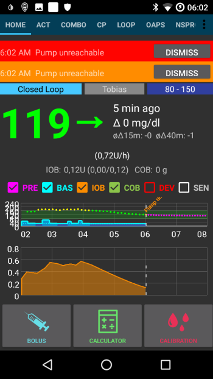
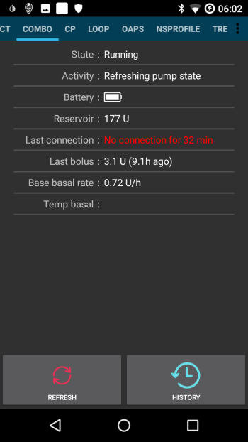
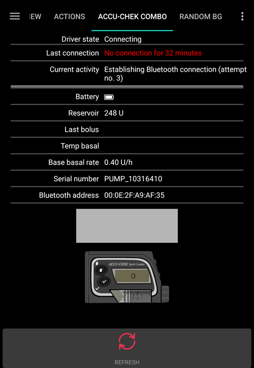
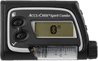
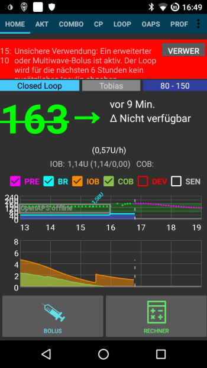

# Sfaturi pentru utilizarea de bază a Accu-Chek Combo

## Cum se asigură buna derulare a operațiunilor

* Întotdeauna **purtați telefonul inteligent asupra dumnevoastră**, lăsați-l lângă patul dumneavoastră noaptea. Deoarece pompa dumneavoastră poate sta în spatele sau sub corpul dumneavoastră în timp ce dormiți, o poziție mai înaltă (pe un raft sau pe o masă) funcționează cel mai bine.
* Asigurați-vă întotdeauna că bateria pompei este cât se poate de încărcată. Vedeți secțiunea despre baterie pentru sfaturi legate de aceasta.
* Ori de câte ori este posibil, utilizați pompa doar prin aplicația AAPS. Pentru a facilita acest lucru, activați blocarea tastelor la **SETĂRI POMPĂ / BLOCARE TASTE / PORNIT**. Numai în momentul schimbării bateriei sau a cartușului, este necesară utilizarea tastelor pompei. 

## Pompă indisponibilă. Ce poate fi făcut?

### Activați alarma de pompă indisponibilă

* În AAPS, mergeți la **Setări / Alarme Locale** și activați **alarmă atunci când pompa nu este disponibilă** și setați **limita pentru pompa indisponibilă [Min]** la **31** minute.
* Acest lucru vă va oferi suficient timp pentru a nu declanșa alarma când părăsiți camera în timp ce telefonul dumneavoastră este lăsat pe birou, dar vă informează dacă pompa este indisponibilă pentru o perioadă de timp care depășește durata unei rate bazale temporare.

### Restabilire disponibilitate pompă

* Când AAPS raportează o alarmă de **pompă indisponibilă**, mai întâi deblocați tastatura **apăsați orice tastă de pe pompă** (spre exemplu tasta "jos"). Imediat ce afișajul pompei s-a oprit, apăsați **Reîmprospătați** din **fila Combo** în AAPS. De cele mai multe ori, comunicarea funcționează din nou.
* Dacă acest lucru nu ajută, reporniți telefonul dumneavoastră inteligent. După repornire, AAPS va fi reactivat și o nouă conexiune va fi stabilită cu pompa. Dacă utilizați un driver mai vechi, ruffy va fi reactivat de asemenea.

* Testele efectuate cu telefoane inteligente diferite au arătat că anumite telefoane inteligente declanșează mai des decât altele eroarea "pompă indisponibilă". Vedeți [Telefoane AAPS](#Phones-list-of-tested-phones) pentru telefoane inteligente testate cu succes.

### Cauzele fundamentale și consecințele erorilor frecvente de comunicare

* Pe telefoanele cu **memorie mică** (sau **setări agresive de economisire a energiei**), AAPS este adesea închis. Vă puteți da seama prin faptul că butoanele Bolus și Calculator de pe ecranul de pornire nu sunt afișate la deschiderea AAPS deoarece sistemul se inițializează. Acest lucru poate declanșa "alarma de pompă indisponibilă" la pornire. În câmpul **Ultima Conexiune** din fila Combo, poți verifica când AAPS a comunicat ultima dată cu pompa.

* Această eroare poate consuma bateria pompei mai repede, deoarece profilul bazalei este citit din pompă atunci când aplicația este repornită.
* De asemenea, crește probabilitatea de a cauza eroarea care determină pompa să respingă toate conexiunile primite până când se apasă un buton de pe pompă. 

## Anularea ratei bazale temporare eșuează

* Ocazional, AAPS nu poate anula automat o alertă **RBT ANULATĂ**. Apoi trebuie fie să apăsați **ACTUALIZARE** în fila AAPS **Combo** sau alarma din pompă trebuie confirmată.

## Considerații despre bateria pompei

### Schimbarea bateriei

* După o alarmă <0>baterie scăzută</0>, bateria trebuie schimbată cât mai curând posibil pentru a avea întotdeauna suficientă energie pentru o comunicare Bluetooth fiabilă cu telefonul inteligent chiar dacă telefonul se află la o distanță mai mare de pompă.
* Chiar și după o alarmă **baterie scăzută**, bateria poate fi folosită pentru o perioadă semnificativă de timp. Cu toate acestea, se recomandă să aveți întotdeauna o baterie nouă cu dumneavoastră după ce o alarmă "baterie scăzută" a sunat.
* Înainte de a schimba bateria, apăsați pe simbolul **Buclă** pe ecranul principal și selectați **Suspendă bucla pentru 1h**. 
* Așteptați ca pompa să comunice cu pompa și sigla Bluetooth de pe pompă s-a estompat.

* Deblocați tastele pompei, puneți pompa în modul stop, confirmați o posibilă rată bazală temporară anulată și schimbați bateria rapid.
* Când se utilizează driverul vechi, dacă ceasul din pompă nu a supraviețuit schimbării bateriei, setați data și ora de pe pompă exact la data/ora de pe telefonul care rulează AAPS. (Noul driver actualizează automat data și ora pompei.)
* Apoi puneți pompa înapoi în modul de rulare prin selectarea **Reluați** după ce apăsați pe pictograma **Bucla Suspendată** de pe ecranul principal.
* AAPS va restabili rata bazală temporar necesară la primirea următoarei valori a glicemiei.

(Accu-Chek-Combo-Tips-for-Basic-usage-battery-type-and-causes-of-short-battery-life)=

### Tipul de baterie și cauzele duratei scurte de viață a bateriei

* Deoarece comunicarea intensivă prin Bluetooth consumă multă energie, folosește doar bateriile **de înaltă calitate** precum Energizer Ultimate Lithium, cele "power one" din pachetul de servicii Accu-Chek sau dacă doriți o baterie reîncărcabilă, folosiți baterii Eneloop. 

 

Intervalele pentru durata de viața tipică a diferitelor tipuri de baterie sunt următoarele:

* **Energizer Ultimate Litiu**: 4 până la 7 săptămâni
* **Power One Alcalin** (Varta) din pachetul de servicii: 2 până la 4 săptămâni
* Baterii ** Eneloop reîncărcabile** (BK-3MCCE): 1 până la 3 săptămâni

Dacă durata de viață a bateriei este semnificativ mai scurtă decât cea de mai sus, vă rugăm să verificați următoarele cauze:

* Există unele variante ale capacului bateriei cu filet al pompei Combo, care scurtcircuitează parțial bateriilor și le consumă rapid. Capacele fără această problemă pot fi recunoscute după contactele metalice aurite.
* Dacă ceasul pompei nu "supraviețuiește" o schimbare scurtă a bateriilor, este probabil ca condensatorul, ceea ce menține ceasul în funcțiune în timpul unei scurte întreruperi a alimentării, să fie stricat. În acest caz, ar putea ajuta înlocuirea pompei de către Roche, ceea ce nu reprezintă o problemă în perioada de garanție. 
* Hardware-ul și software-ul pentru telefoanele inteligente (sistemul de operare Android și stiva Bluetooth) influențează, de asemenea, durata de viață a bateriei pompei, chiar dacă factorii exacți nu sunt încă pe deplin cunoscuți. Dacă aveți ocazia, încercați un alt telefon inteligent și comparați durata de viață a bateriei.

## Bolus extins, bolus multiplu

Algoritmul OpenAPS nu suportă un bolus paralel extins sau bolusuri multiple. Dar un tratament similar poate fi obținut prin următoarele alternative:

* Folosiți **carbohidrați extinși** când introduceți carbohidrații sau folosiți calculatorul prin introducerea carbohidraților la întreaga masă și durata de timp în care vă așteptați transformarea carbohidraților în glucoză în sângele dumneavoastră. Sistemul va calcula apoi carbohidrați mici distribuiți egal pe întreaga durată de absorbție, ceea ce va determina algoritmul să asigure o dozare echivalentă de insulină, verificând în același timp în permanență creșterea/scăderea generală a glicemiei. Pentru o abordare cu bolus dual, puteți de asemenea să combinați un mic bolus imediat împreună cu carbohidrați extinși. 
* Înainte de a mânca, în secțiunea **Acțiuni** din AAPS setați ca un obiectiv temporar **Mănânc în curând** cu o țintă a glicemiei de 80 pentru câteva ore. Durata ar trebui să se bazeze pe intervalul pe care l-ați alege pentru bolusul prelungit. Acest lucru vă va menține ținta mai mică decât de obicei și, prin urmare, va crește cantitatea de insulină furnizată.
* Apoi folosiți **CALCULATORUL** pentru a introduce în întregime carbohidrații pentru masă, dar nu implementați direct valorile sugerate de calculatorul de bolus. Dacă un bolus multiplu urmează să fie administrat, corectați în jos dozajul de insulină. În funcție de masă, algoritmul trebuie acum să furnizeze SMB suplimentare sau rate bazale temporare mai mari pentru a contracara creșterea glicemiei. În acest caz, limitarea de siguranța a ratei bazale (Max IE / h, IOB bazală maximă) trebuie experimentată cu foarte mare atenție și, dacă este necesar, temporar modificată.

* Dacă sunteți tentat să utilizați direct bolusul extins sau multiplu din pompă, AAPS vă va penaliza prin dezactivarea buclei închisă pentru următoarele șase ore pentru a se asigura că nu se calculează doze de insulină în exces.

## Alarme la administrarea bolusului

* Dacă AAPS detectează că un bolus identic a fost livrat cu succes în același minut, administrarea bolusului va fi prevenită cu un număr identic de unități de insulină. Dacă doriți să bolusați aceeași cantitate de insulină de două ori în succesiune rapidă, așteptați încă două minute și apoi administrați din nou bolusul. În cazul în care primul bolus a fost întrerupt sau nu a fost livrat din alte motive, puteți retrimite imediat bolusul de la AAPS 2.0 încoace.
* Alarma este un mecanism de siguranță care citește istoricul bolusurilor din pompă înainte de a trimite un nou bolus pentru a calcula corect insulina la bord (IOB), chiar și atunci când un bolus este administrat direct din pompă. În acest caz, trebuie prevenite înregistrările care nu pot fi distinse.

* Acest mecanism este, de asemenea, responsabil de o a doua cauză a erorii: Dacă în timpul utilizării calculatorului de bolus, un alt bolus este administrat prin intermediul pompei și astfel se modifică istoricul bolusului, baza de calcul a bolusului este greșită și bolusul este întrerupt. 

