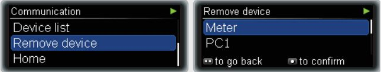
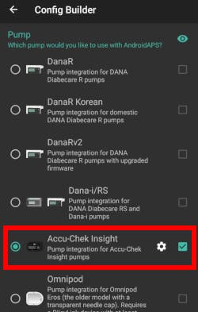
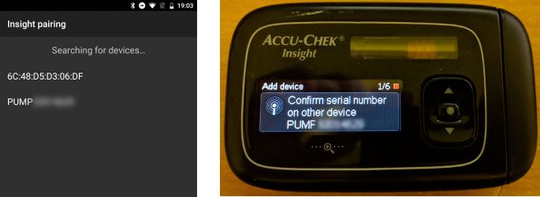
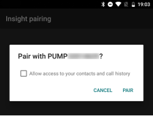
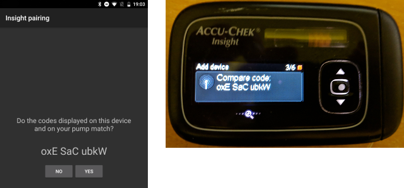
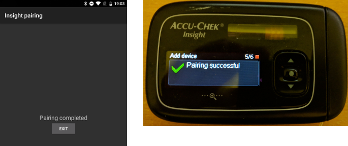
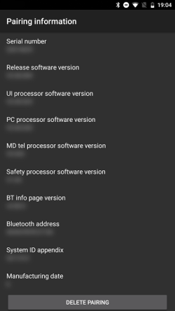
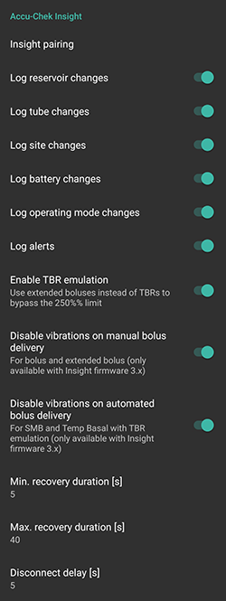
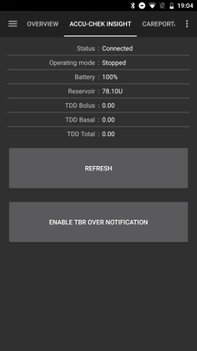
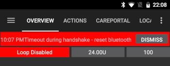

# Pompa Accu-Chek Insight

**Aceasta aplicatie face parte dintr-o soluție de pancreas artificial DIY (Do-it-Yourself), realizata personal) care nu este un produs finit, ceea ce inseamna ca va trebui ca TU sa citesti, să studiezi si să înțelegi sistemul, inclusiv cum să îl folosesti. Nu este ceva creat pentru a gestiona in totalitate tratamentul diabetul, dar permite îmbunătățirea calitatii vieții cu diabet, dacă acordati timpul necesar. Nu te grăbi să o faci, dar acorda-ți timp să înveți. Doar tu esti responsabil de utilizarea acestui sistem.**

* * *

## ***AVERTISMENT:** Dacă ai folosit in trecut Insight cu **SightRemote** te rog **actualizeaza la cea mai nouă versiune AAPS** și **dezinstaleaza SightRemote**.*

## Cerințe hardware și software

* O pompă de insulină Accu-Chek Combo (orice versiune de firmware, funcționează toate)

Atentie: AAPS va scrie întotdeauna date în **primul profil al ratei bazale din pompă**.

* Un telefon Android (în principiu orice versiune de Android ar funcționa cu Insight, dar verificați pe pagina [Module](../Getting-Started/ComponentOverview) care este versiunea Android necesară pentru a rula AndroidAPS.)
* Aplicația AAPS instalată pe telefonul dumneavoastră

## Instalare

* Pompa Insight nu ar trebui conectată la mai multe dispozitive in acelasi timp. Dacă ai utilizat anterior telecomanda Insight (glucometrul), trebuie să elimini telecomanda din lista cu dispozitive împerecheate a pompei: Meniu > Setări > Comunicare > Elimină dispozitiv
    
    

* În [Confiigurator > Pompă](../SettingUpAaps/ConfigBuilder.md), selectați Accu-Chek Insight.
    
    

* Atinge roata pentru a deschide setările Insight.

* În setări, apasă butonul 'Insight conectare' din partea de sus a ecranului. Ar trebui să vedeți o listă cu toate dispozitivele bluetooth din apropiere (jos stânga).
* Pe pompa Insight mergi la Menu > Settings > Communication > Add Device. Pompa va afișa pe următorul ecran (mai jos dreapta) numărul de serie al pompei.
    
    

* Înapoi la telefon, apasă pe numărul de serie al pompei din lista dispozitivelor bluetooth. Apoi apasă pe conectare pentru a confirma.
    
    

* Atât pompa cât și telefonul vor afișa un cod. Verifică iar daca codurile sunt identice pe ambele dispozitive confirma atât pe pompa cât și pe telefon.
    
    

* Succes! Felicitați-vă pentru asocierea reușită dintre pompă și AAPS.
    
    

* Pentru a verifica că totul este bine, mergeți înapoi la Configurator în AAPS și apăsați pe roata dințată a pompei Insight pentru a ajunge la setările Insight apoi apăsați pe Asociere Insight și veți vedea câteva informații despre pompă:
    
    

Atentie: Nu va exista o conexiune permanentă între pompă și telefon. O conexiune va fi stabilită numai dacă este necesar (de ex la stabilirea ratei bazale temporare, livrarea de bolus, citirea istoricului pompei...). În caz contrar, bateriile de la telefon și de la pompa s-ar consuma mult prea repede.

(Accu-Chek-Insight-Pump-settings-in-aaps)=

## Setări în AAPS

**Notă: Este acum posibil (numai cu AAPS v2.7.0sau mai mare) să utilizați „Folosiți întotdeauna valorile bazale absolute” dacă doriți să utilizați Autotune cu pompa Insight chiar dacă 'sincronizarea este activată' cu Nightscout.** (În AAPS mergeți la [Preferințe > NSClient > Setări avansate](#Preferences-advanced-settings-nsclient)).

În setările Insight din AAPS, puteți activa următoarele opțiuni:

* "Înregistrează schimbarea rezervorului": Se va înregistra automat schimbarea rezervorului de insulină daca rulezi pe pompa "umple canula".

* "Înregistrează schimbările de tub": Aceasta adaugă o notă în baza de date AAPS când rulați programul de „umplere tub” pe pompă.

* "Înregistrează schimbările locului de inserție": Se va adăuga o notiță în baza de date AndroidAPS dacă rulați programul de "umplere canula" pe pompă. **Atentie: O modificare a locului de insertie resetează deasemenea si Autosens.**

* "Înregistrează schimbarea bateriei": Se înregistrează schimbarea bateriei atunci când pui baterii noi în pompă.

* „Înregistrează schimbările modului de operare”: Se va adăuga o notiță în baza de date AndroidAPS ori de câte ori porniți, opriți sau întrerupeți pompa.

* "Înregistrați alerte": Aceasta înregistrează o notă în baza de date AAPS ori de câte ori pompa emite o alertă (cu excepția mementourilor, anulării bolusului și a RBT - acestea nu sunt înregistrate).

* "Activare emulare RBT": Pompa Insight poate emite rate bazale temporare (RBT) doar până la 250%. Pentru a rezolva această restricție, daca soliciti RBT mai mare de 250%, emularea va comanda pompei să livreze pentru insulina suplimentara un bolus extins.
    
    **Atentie: Utilizeaza un singur bolus extins odata, folosirea simultana a mai multor bolusuri extinse poate cauza erori.**

* "Dezactivare vibrații la livrare manuala de bolus": Se dezactivează vibrațiile pompei Insight atunci când livrează un bolus manual (sau bolus extins). Această setare este disponibilă doar cu cea mai recentă versiune de firmware Insight (3.x).

* "Dezactivare vibrații la livrarea automată de bolus": Se dezactivează vibrațiile pompei Insight atunci când livrează un bolus automat (SMB (super micro bolus) sau bazala temporara cu emulare RBT). Această setare este disponibilă doar cu cea mai recentă versiune de firmware Insight (3.x).

* "Durata de restabilire a conexiunii": Aceasta definește cât va aștepta AndroidAPS înainte de a încerca din nou reconectarea după o încercare de conectare eșuată. Poți alege de la 0 la 20 de secunde. Dacă întâmpini probleme cu conexiunea, alege o durata de așteptare mai lung.   
      
    Exemplu de durata de restabilire a conexiunii minim = 5 sec. și maxim = 20 sec.   
    reîncearcă -> fără conexiune -> așteaptă **6** sec.   
    reîncearcă -> fără conexiune -> așteaptă **7** sec.   
    reîncearcă -> fără conexiune -> așteaptă **8** sec.   
    ...   
    reîncercați -> nicio conexiune -> așteptați **20** sec.   
    reîncercați -> nicio conexiune -> așteptați **20** sec.   
    ...

* "Întârziere la deconectare": Aceasta definește în cât timp (în secunde) AndroidAPS se deconectează de la pompă după terminarea unei operațiuni. Valoarea implicită este de 5 secunde.

Pentru perioadele în care pompa a fost oprită, AAPS va înregistra o rată bazală de 0%.

În AAPS, fila Accu-Chek Insight afișează starea curentă a pompei și are două butoane:

* "Refresh": Actualizeaza starea pompei
* "Activează/Dezactivează notificarea de RBT": O pompă standard Insight emite o alarmă atunci când un RBT este terminat. Acest buton permite să activedeți sau să dezactivedeți această alarmă fără a fi nevoie de configurarea software-ului.
    
    

## Setările pompei

Configurați alarmele în pompă după cum urmează:

* Menu > Settings > Device settings > Mode settings > Quiet > Signal > Sound
* Menu > Settings > Device settings > Mode settings > Quiet > Volume > 0 (remove all bars)
* Menu > Modes > Signal mode > Quiet

Aceasta va reduce la tăcere toate alarmele din pompă, permițând AAPS să decidă dacă o alarmă este relevantă pentru dumneavoastră. Dacă în AAPS nu se ține seama de o alarmă, volumul său va crește (prima dată semnal sonor, apoi vibrații).

(Accu-Chek-Insight-Pump-vibration)=

### Vibrare

În funcție de versiunea de firmware a pompei dumneavoastră, Insight va vibra scurt de fiecare dată când un bolus este livrat (de exemplu, când AndroidAPS inițiază un SMB sau emularea prin TBR livrează un bolus extins).

* Firmware 1.x: Fără vibrații din proiectare.
* Firmware 2.x: Vibrațiile nu pot fi dezactivate.
* Firmware 3.x: AAPS livrează silențios bolusul. (versiunea minimă [2.6.1.4](#Releasenotes-version-2-6-1-4))

Versiunea de firmware poate fi găsită în meniu.

## Înlocuire baterie

Durata de viață a bateriei pentru Insight atunci când e în buclă variază între 10 și 14 zile, maximum. 20 de zile. Utilizatorul care a raportat acest lucru utilizează baterii cu litiu de tip Energizer.

Pompa Insight are o baterie internă mică pentru a păstra funcțiile esențiale precum ceasul care rulează în timp ce se schimbă bateria detașabilă. Dacă schimbarea bateriei durează prea mult, această baterie internă se poate termina, ceasul se va reseta, și după introducerea unei baterii noi vi se va cere să completați din nou ora și data. Dacă se întâmplă acest lucru, toate intrările in AndroidAPS înainte de schimbarea bateriei nu vor mai fi incluse în calcule, deoarece timpul corect nu poate fi identificat corespunzător.

(Accu-Chek-Insight-Pump-insight-specific-errors)=

## Insight - erori specifice

### Bolus extins

Utilizați doar un bolus extins la un moment dat deoarece mai multe boluri extinse în același timp ar putea cauza erori.

### Pauză

Uneori se poate întâmpla ca pompa Insight să nu răspundă în timpul configurării conexiunii. În acest caz, AAPS va afișa următorul mesaj: "Timpul de așteptare a expirat la sincronizarea Bluetooth".

În acest caz, dezactivați Bluetooth pe pompă DAR ȘI PE telefon timp de aproximativ 10 secunde și apoi reporniți-l din nou.

## Traversarea fusurilor orare cu pompa Insight

Pentru informații despre călătoriile prin diverse fusuri orare, vedeți secțiunea [Călătorit prin fusuri orare cu pompa](#timezone-traveling-insight).