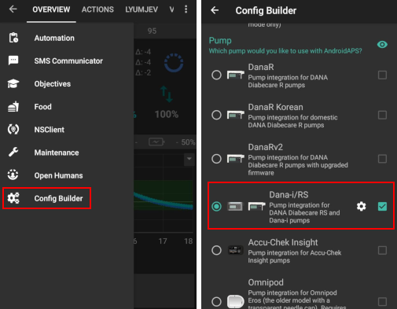
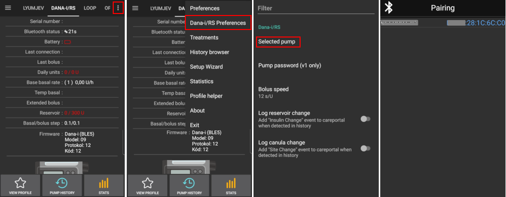
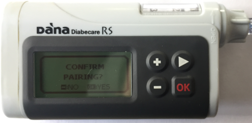
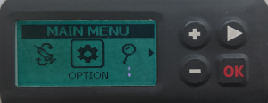
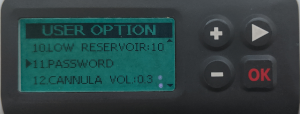
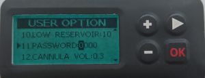
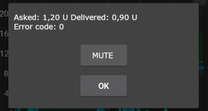

# Pompele DanaRS și Dana-i

*Aceste instrucțiuni sunt destinate configurării aplicației și pompei dumneavoastră pentru cazul în care aveți o pompă model DanaRS model 2017 sau mai nouă sau mai recentă Dana-i. Vizitați <0>Pompa de insulină DanaR</0> dacă aveți în schimb DanaR original.*

**Noul firmware v3 Dana RS poate fi folosit cu AndroidAPS începând cu versiunea 2.7.**

**Noul Dana-i poate fi folosit de la AAPS versiunea 3.0.**

* În pompa DanaRS doar "BAZALĂ A" este folosită de aplicație. Datele preexistente vor fi suprascrise.

(DanaRS-Insulin-Pump-pairing-pump)=

## Asociere pompă

* Pe ecranul principal AAPS dați click pe meniul Hamburger din colțul din stânga sus și mergeți la Configurator.
* În secțiunea de pompă selectați 'Dana-i/RS'.
* Atingeți rotița dințată pentru a ajunge direct la setările pompei sau reveniți la ecranul de pornire.
    
    

* Mergeți la fila 'DANA-i/RS'.

* Selectați meniul de preferințe prin atingerea celor 3 puncte din dreapta sus. 
* Selectați 'Preferințe Dana-i/RS'.
* Atingeți pe "Pompa selectată".
* În fereastra de asociere atingeți intrarea pompei dumneavoastră.
    
    

* **Trebuie să confirmați de pe pompă asocierea!** Acesta este exact modul în care sunteți obișnuit cu alte asocieri Bluetooth (spre exemplu telefon inteligent și sistemul audio al automobilului).
    
    

* Urmăriți procesul de asociere în funcție de tipul și firmware-ul pompei dumneavoastră:
    
    * Pentru DanaRS v1 selectați parola pompei în preferințe și setați parola.
    * Pentru DanaRS v3 trebuie să tastați 2 secvențe de numere și litere afișate pe pompă în dialogul de asociere AAPS.
    * Pentru Dana-i dialogul de asociere Android standard apare și trebuie să introduceți un număr format din 6 cifre afișat în pompă.

* Selectați Viteză Bolus pentru a schimba valoarea implicită de livrare a unui bolus (12 secunde per unitate, 30 secunde per unitate sau 60 de secunde pentru livrarea unei unități de insulină).

* Stabiliți pasul bazalei în pompă la 0,01 U/h prin intermediul meniului de doctor (vedeți manualul de utilizare al pompei).
* Stabiliți pasul bazalei în pompă la 0,05 U/oră prin intermediul meniului de doctor (vedeți manualul de utilizare al pompei).
* Activați bolusurile extinse în pompă

(DanaRS-Insulin-Pump-default-password)=

### Parola implicită

* Pentru DanaRS cu firmware v1 şi v2 parola implicită este 1234.
* Pentru DanaRS cu firmware v3 sau Dana-i parola implicită este derivată din data de fabricație și se calculează ca LLZZ unde LL este luna și ZZ este ziua, pompa a fost produsă (ex "0124" reprezentând luna 01 și ziua 24).
    
    * Din MENU PRINCIPAL selectați REVIZUIRE și deschideți INFORMAȚII DE LIVRARE din sub-meniu
    * Numărul 3 este data producției. 
    * Pentru v3/i, această parolă este folosită numai pentru blocarea meniului în pompă. Nu este folosit pentru comunicare și nu este necesar să intrați în AAPS.

(DanaRS-Insulin-Pump-change-password-on-pump)=

## Schimbă parola pe pompă

* Apăsaţi butonul OK pe pompă
* În meniul principal selectați "OPȚIUNE" (mută spre dreapta prin apăsarea butonului săgeată de mai multe ori)
    
    

* În meniul de opțiuni selectați "OPȚIUNE UTILIZATOR"
    
    

* Folosiți butonul săgeată pentru a derula în jos la "11. parolă"
    
    

* Apăsaţi OK pentru a introduce parola veche.

* Introduceți **parola veche** (Parolă implicită vedeți [mai sus](#DanaRS-Insulin-Pump-default-password)) și apăsați OK
    
    

* Dacă este introdusă o parolă greşită aici nu va exista nici un mesaj care să indice greșeala!

* Setează **noua parolă** (Schimbă numerele cu + & - butoane / Mută la dreapta cu butonul săgeată).
    
    

* Confirmaţi cu butonul OK.

* Apăsați OK pentru a salva setările.
    
    

* Deplasați în jos la "14. IEȘIRE" și apăsați butonul OK.
    
    

(DanaRS-Insulin-Pump-dana-rs-specific-errors)=

## Erori specifice Dana RS

### Eroare în timpul administrării insulinei

În cazul în care conexiunea dintre AAPS și Dana RS este pierdută în timpul administrării insulinei prin bolus (de exemplu, vă îndepărtați de telefon în timp ce Dana RS pompează insulina) vei vedea următorul mesaj și vei auzi un sunet de alarmă.

* În cele mai multe cazuri, aceasta este doar o problemă de comunicare, iar cantitatea corectă de insulină este administrată.
* Verificați istoricul pompei (fie în pompă, fie prin fila Dana > istoricul pompei > bolusuri) dacă bolusul corect a fost administrat.
* Ștergeți intrarea eronată din [fila Tratamente](#screens-bolus-carbs) dacă doriți.
* Cantitatea reală este citită și înregistrată la următoarea conectare. Pentru a forța acest lucru, apăsați pictograma Bluetooth în fila Dana sau doar așteptați următoarea conectare.

## Notă specială atunci când se schimbă telefonul

Când treceți la un telefon nou, sunt necesari următorii pași:

* [Exportați setările](../Maintenance/ExportImportSettings.md) pe telefonul tău vechi
* Transferați setările de pe un telefon vechi pe unul nou

### DanaRS v1

* **Asociați manual** Dana RS cu noul telefon
* Deoarece setările pompei sunt, de asemenea, importate AAPS de pe noul telefon deja va „știi” pompa și, prin urmare, nu va începe o scanare Bluetooth. Prin urmare, telefonul nou și pompa trebuie asociate manual.
* Instalați AAPS pe noul telefon.
* [Importați setările](../Maintenance/ExportImportSettings.md) pe telefonul dumneavoastră nou

### DanaRS v3, Dana-i

* Începeți procedura de asociere așa cum este descrisă [mai sus](#DanaRS-Insulin-Pump-pairing-pump).
* Uneori, ar putea fi necesară curățarea informațiilor de asociere în AAPS cu o atingere lungă pe pictograma Bluetooth din fila Dana-i/RS.

## Traversarea fusurilor orare cu pompa Dana RS

Pentru informații despre călătoriile de-a lungul fusurilor orare, consultați secțiunea [Călătorii de-a lungul fusurilor orare cu pompe](#timezone-traveling-danarv2-danars).