# Pompa de insulină Diaconn G8

## Cuplarea pompei de insulină prin Bluetooth

- Apăsați pe meniul hamburger din colțul din stânga sus.

- Apăsați pe Configurator.

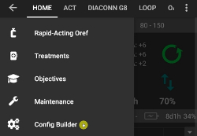

- După selectarea pompei Diaconn G8, apăsați pe pictograma Setări (rotița dințată).

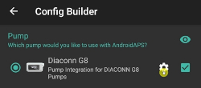

- Alegeți pompa selectată.

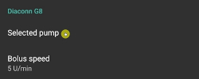

- După ce apare în listă, alegeți modelul pompei de insulină.

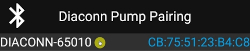

- Există două opțiuni pentru a verifica numărul modelului:

1. Ultimele 5 cifre ale numărului SN de pe spatele pompei.
2. Apăsați pe butonul O > Informații > BLE > Ultimele 5 cifre.

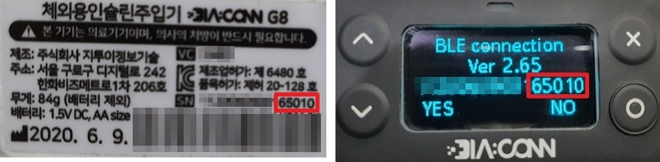

- Odată ce ați selectat pompa dumneavoastră, o fereastră va apărea și va cere un cod PIN. Introduceți numărul PIN afișat în pompă pentru a finaliza conexiunea.

 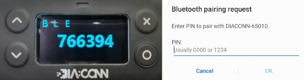

## Verificarea stării pompei și sincronizarea jurnalelor

- Odată ce pompa este conectată, apăsați pe simbolul Bluetooth pentru a verifica starea și pentru a sincroniza jurnalele.

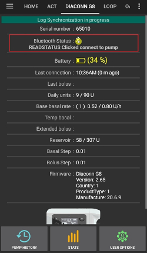

## Depanare Bluetooth

**Ce trebuie să faceți în cazul unei conexiuni Bluetooth instabile cu pompa.**

### Metoda 1) Verificați pompa din nou după ce setările din aplicația AAPS au fost finalizate.

- Atingeți pe butonul 3 puncte din dreapta sus.

- Apăsați pe Ieșire.

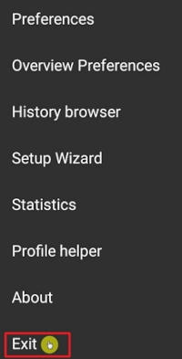

### Metoda 2) Dacă prima metodă nu funcționează, deconectați Bluetooth și apoi reconectați.

- Apăsați și mențineți apăsat butonul Bluetooth din partea de sus timp de aproximativ 3 secunde.

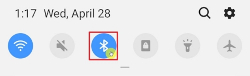

- Apăsați pe butonul de setare al pompei de insulină Diaconn G8 asociate.

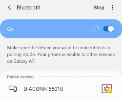

- Dezasociați.

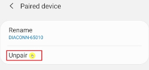

- Repetați procesul de asociere cu Bluetooth pentru pompă (vedeți mai sus).

## Informații suplimentare

### Setări pompă de insulină Diaconn G8

- Manager configurare > pompă > Diaconn G8 > Setări
- DIACONN G8 din partea de sus> buton 3 puncte din dreapta sus > Preferințe Diaconn G8

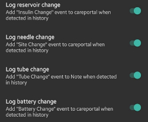

- În cazul în care opțiunea **Înregistrați schimbările de rezervor** este activată, detaliile relevante sunt încărcate automat în Nightscout, atunci când apare un eveniment "Schimbare insulină".
- Dacă opțiunea **Înregistrați schimbare ac** este activată, detaliile relevante sunt încărcate automat în Nightscout, atunci când are loc un eveniment "Schimbare loc".
- În cazul în care opțiunea **Înregistrați schimbările de tub** este activată, detaliile relevante sunt încărcate automat în Nightscout, atunci când apare un eveniment "Schimbare tub".
- În cazul în care opțiunea **Înregistrează schimbările de baterie** este activată, detaliile relevante sunt încărcate automat în Nightscout, atunci când are loc un eveniment "Schimbare baterie" și butonul SCHIMBARE BATERIE POMPĂ din fila ACȚIUNI este dezactivat. (Notă: Pentru a schimba bateria, vă rugăm să opriți toate funcțiile în curs ce implică injectar înainte de a continua)

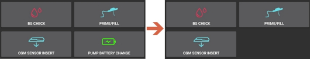

### Funcția de bolus extins

- Dacă utilizați bolusul extins, acesta va dezactiva bucla închisă.
- Vedeți [această pagină](#extended-bolus-and-why-they-wont-work-in-closed-loop-environment) pentru detalii de ce bolusul extins nu funcționează într-un scenariu de buclă închisă.
