# Manualul de instrucțiuni EOPatch2

Plasturele necesită utilizarea insulinei de tip U-100 cu acțiune rapidă, cum sunt NovoRapid sau Humalog. Utilizați o insulină cu acțiune rapidă potrivită pentru dumneavoastră în funcție de prescripția medicului dumneavoastră și injectați doza prescrisă.

Cea mai mică doză de insulină injectabilă atunci când se utilizează plasturele este de 0,05 U. Prin urmare, profilul bazal trebuie setat la o valoare minimă de 0,05 U/oră sau mai mult și un interval de 0,05 U/oră, în caz contrar, poate exista o eroare între cantitatea totală estimată din profil și cantitatea reală perfuzată din plasture. De asemenea, bolusul trebuie reglat și perfuzat cu un volum de perfuzie minim de 0,05 U.

## Configurare pompă
1. Pe ecranul de pornire AAPS, faceți clic pe meniul hamburger din colțul din stânga sus și mergeți la Configurator.
1. Selectați 'EOPatch2' din secțiunea Pompe.
1. Apăsați tasta Înapoi pentru a reveni la ecranul de pornire.

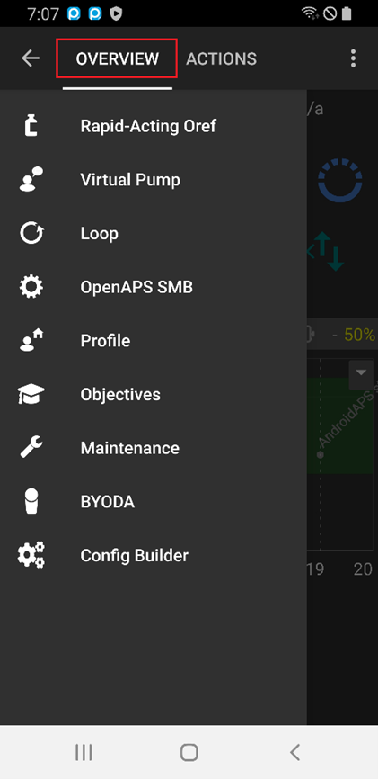 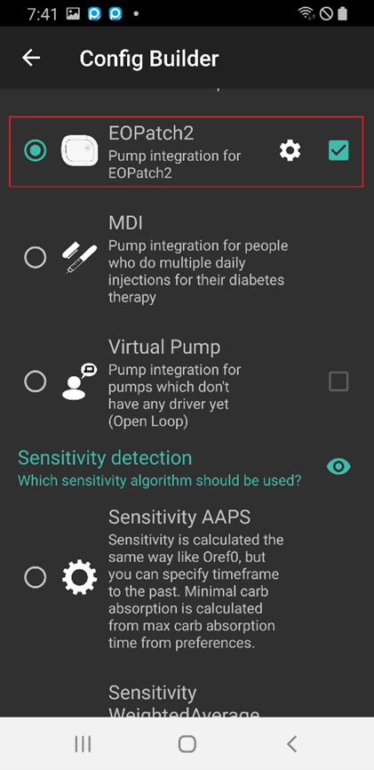

## Setări
Selectați EOPATCH2 în partea de sus a ecranului de start pentru a merge în fila EOPATCH2.

Selectați meniul Preferințe EOPatch2 făcând clic pe cele trei puncte din colțul din dreapta sus.

Meniul Preferințe EOPatch2 oferă un meniu pentru a seta 3 tipuri de notificări.

### Alerte rezervor redus
Un avertisment apare atunci când cantitatea de insulină rămasă în rezervor atinge valoarea stabilită sau mai mică în timp ce se utilizează plasturele. Poate fi stabilită de la 10 la 50U în incremente de 5U.

### Memento de expirare plasture
Acesta este un memento pentru a vă notifica de timpul rămas până la expirarea plasturelui curent. Poate fi setat de la 1 la 24 de ore în incremente de 1 oră. Valoarea setării inițiale este de 4 ore.

### Mementoul sonerie al plasturelui
Aceasta este o funcție de reamintire pentru alte injecții decât injecția bazală. Dacă utilizați o injecție bolus (extinsă) sau o injecție bazală temporară, plasturele va produce un sunet în momentul în care începe injecția și când injecția este completă. Valoarea setării inițiale este pusă pe oprit.

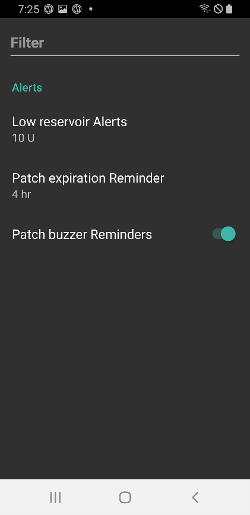

## Conectarea plasturelui

### Mutați-vă în ecranul de conectare al plasturelui

Selectați EOPATCH2 în partea de sus a ecranului de pornire și faceți clic pe butonul ACTIVARE din stânga jos.

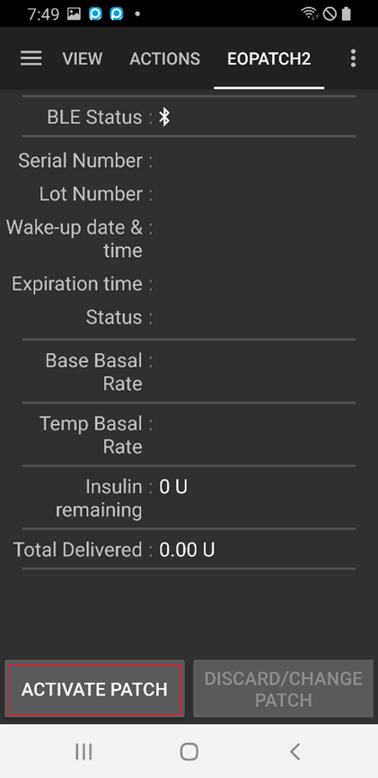

### Conectarea plasturelui
Introduceți acul seringii în orificiul de admisie a insulinei de pe plasture și apoi împingeți încet pistonul pentru a injecta insulina. Când insulina este umplută cu mai mult de 80U, plasturele emite un sunet de inițializare și pornește. După confirmarea sunetului, apăsați butonul PORNIȚI ASOCIERE de pe ecran.

[Atenție]

- Nu rotiți maneta de acționare a acului până când nu primiți instrucțiuni. În caz contrar, poate cauza probleme grave în timpul injectării sau al verificărilor de siguranță.
- Cantitatea de insulină care poate fi injectată în plasture este de 80~200U. Dacă injectați inițial mai puțin de 80U în plasture, plasturele nu va funcționa.
- Luați insulina ce va fi introdusă în plasture din frigider și lăsați-o la temperatura camerei timp de 15 până la 30 de minute înainte. Temperatura insulinei care trebuie injectată trebuie să fie de cel puțin 10°C.

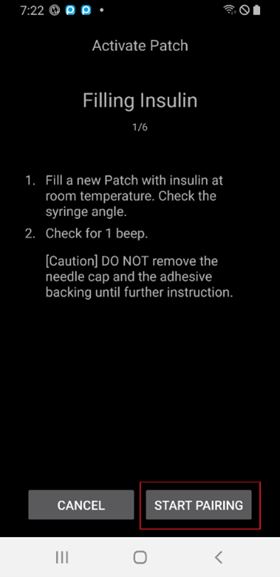

### Asocierea plasturelui
Ecranul de asociere al plasturelui va fi afișat și asocierea va fi încercată automat. În cazul în care comunicarea a reușit, apare o notificarea pentru solicitarea de asociere prin Bluetooth. Apăsați pe OK și atunci când notificarea solicitării de asociere Bluetooth apare a doua oară cu codul de autentificare, selectați din nou OK.

[Atenție]

- Pentru asociere, plasturele și telefonul inteligent trebuie să fie la o distanță de 30 cm unul de celălalt.
- După ce pornirea plasturelui a fost finalizată, plasturele va piui o dată la 3 minute până când asocierea se finalizează.
- După pornirea plasturelui, aplicarea plasturelui trebuie finalizată prin intermediul aplicației în decurs de 60 de minute. Dacă aplicarea nu poate fi finalizată în decurs de 60 minute, plasturele trebuie aruncat.

 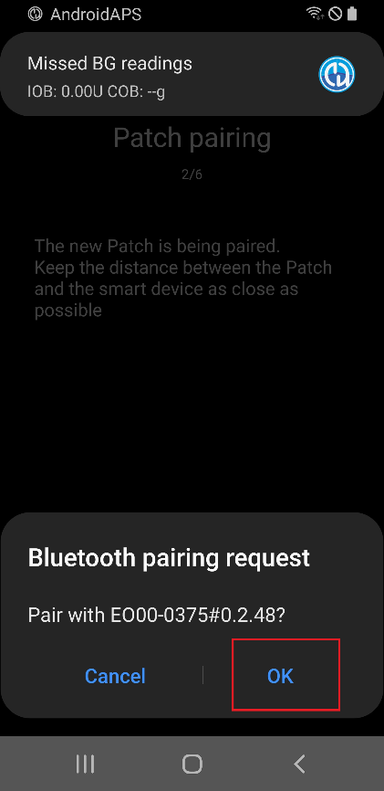 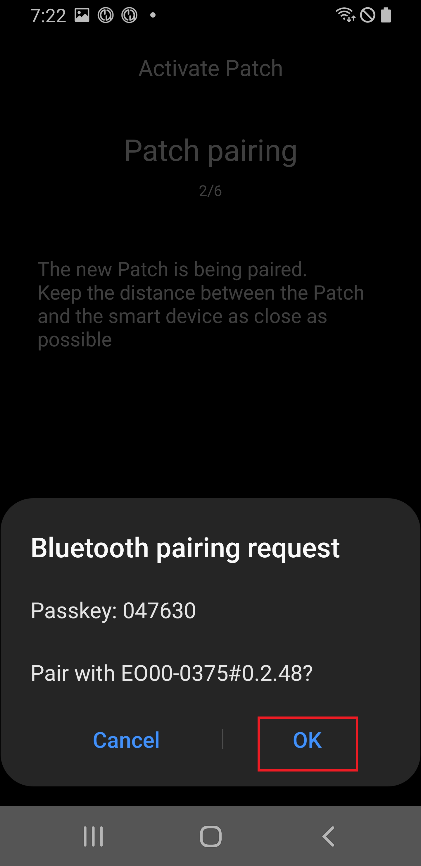

### Pregătirea plasturelui
După ce ați îndepărtat banda adezivă a plasturelui, verificați dacă acul iese în afară. În cazul în care nu există probleme cu plasturele, apăsați URMĂTORUL.

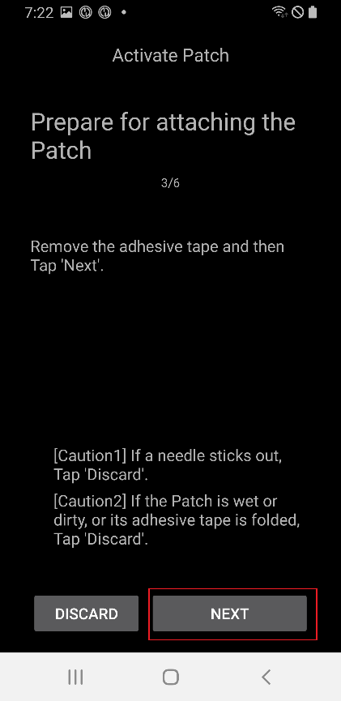

### Atașarea pompei
Insulina trebuie injectată într-un loc, cu țesut adipos subcutanat, dar puțini nervi sau vase de sânge, de aceea se recomandă utilizarea abdomenului, brațului sau coapsei pentru locul de atașare a plasturelui. Alegeți un loc de atașare a plasturelui și aplicați plasturele după dezinfectarea locației.

[Atenție]

- Asigurați-vă că ați întins uniform partea benzii plasturelui atașată de corp, astfel încât plasturele să adere complet la piele.
- Dacă plasturele nu se lipește complet, poate pătrunde aerul între plasture și piele, care poate slăbi rezistența adezivă și efectul de impermeabilizare a plasturelui.

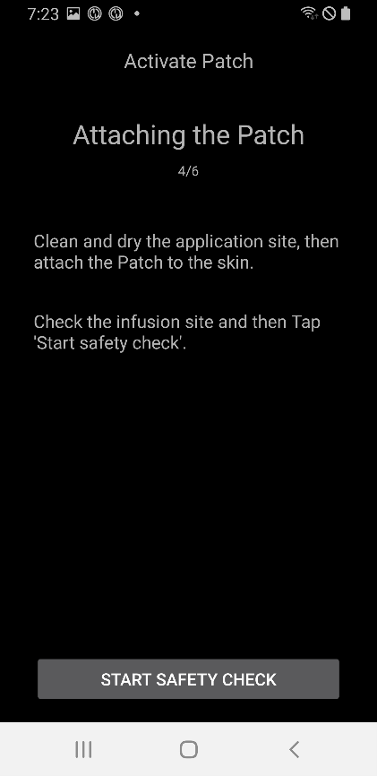

### Verificare de siguranță
Când aplicarea plasturelui este finalizată, apăsați "Pornire Verificare de Siguranță". Când verificarea de siguranță este finalizată, plasturele va emite un semnal sonor o dată.

[Atenție]

- Pentru o utilizare sigură, nu rotiți maneta de acționare a acului până când nu este finalizată verificarea de siguranță.

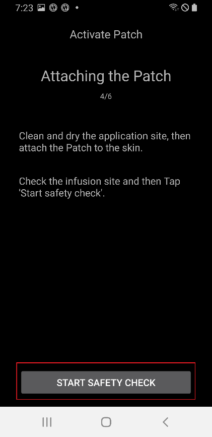 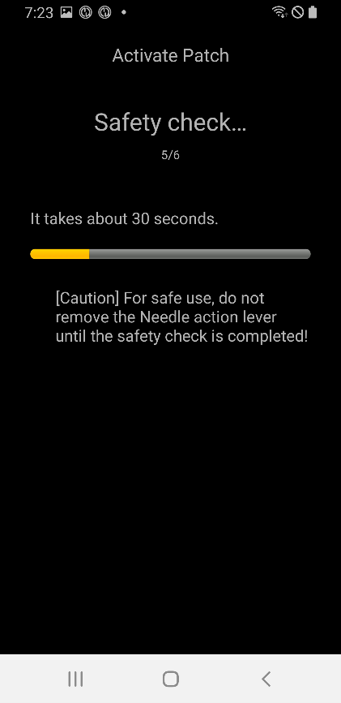

### Introducerea acului
Acul este introdus prin ținerea plasturelui și rotirea manetei de acționare a acului cu mai mult de 100° în direcția în sus a manetei. Se aude un semnal sonor când acul este introdus corect. Rotiți maneta de acționare a acului mai departe în sensul acelor de ceasornic pentru a elibera maneta. Apăsați pe URMĂTORUL.

[Atenție]

- Dacă treceți la pasul următor fără ca semnalul sonor să se audă, va apărea un avertisment de eroare la introducerea acului.

## Eliminarea plasturelui
Plasturii trebuie înlocuiți în cazul unor valori mici ale cantității de insulină, al expirării duratei de utilizare și al defectelor. Perioada recomandată de utilizare pentru fiecare plasture este de 84 de ore după pornirea plasturelui.

### Eliminarea plasturelui
Selectați EOPATCH2 în partea de sus a ecranului principal și faceți clic pe butonul ELIMINARE/SCHIMBARE PLASTURE din partea de jos. Pe ecranul următor, apăsați pe butonul ELIMINAȚI PLASTURE. Apare o casetă de dialog pentru a confirma încă o dată, iar dacă selectați butonul ELIMINAȚI PLASTURE, eliminarea este finalizată.

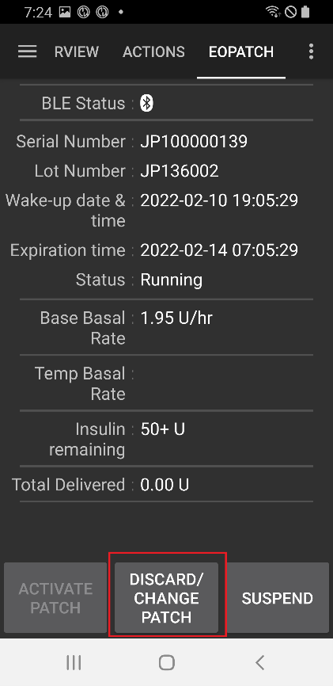 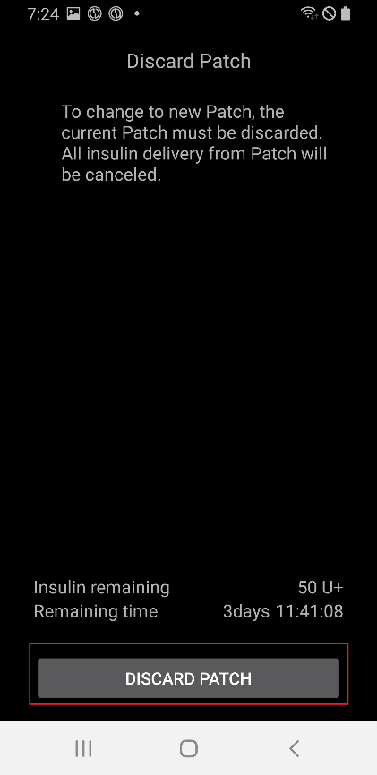 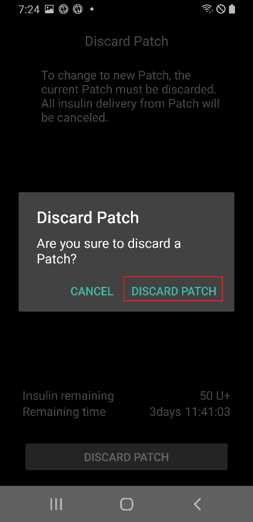 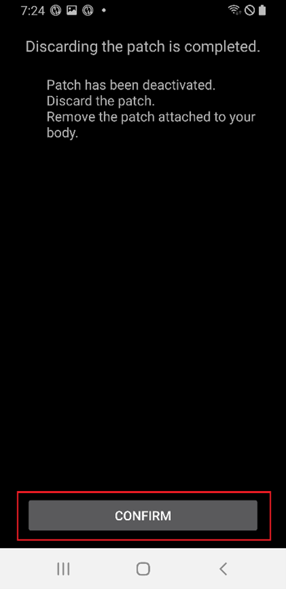

## Suspendarea și reluarea administrării insulinei
Suspendarea administrării insulinei anulează, de asemenea, atât bolusul extins, cât și bazala temporală. La reluarea administrării insulinei, nu se va mai relua administrarea bolusului extins și a bazalei temporare anulate. Iar atunci când administrarea insulinei este suspendată, plasturele va emite un sunet la fiecare 15 minute.

### Suspendarea administrării insulinei
Selectați EOPATCH2 în partea de sus a ecranului de pornire și faceți clic pe butonul SUSPENDARE din dreapta jos. Atunci când selectați CONFIRMARE în caseta de confirmare, apare o casetă de selectare a timpului. Dacă selectați butonul de CONFIRMARE după selectarea orei, administrarea insulinei va fi suspendată pentru perioada de timp setată.

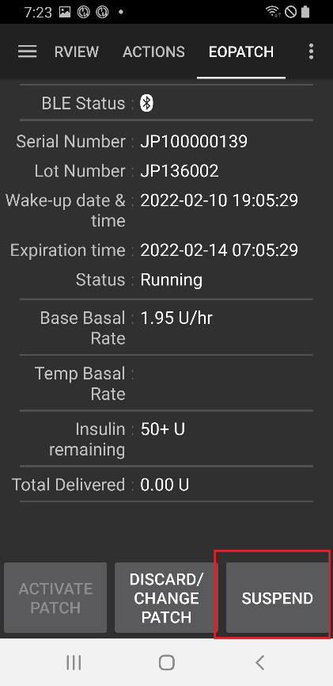 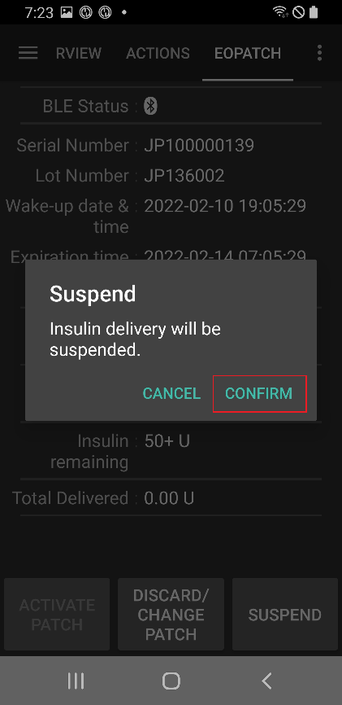 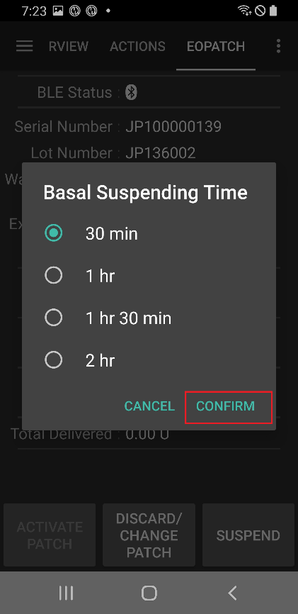

### Reluarea administrării insulinei
Selectați EOPATCH2 în partea de sus a ecranului de pornire și faceți clic pe butonul RELUAȚI din dreapta jos. Administrarea insulinei va fi reluată selectând CONFIRMAȚI în caseta de dialog de confirmare.

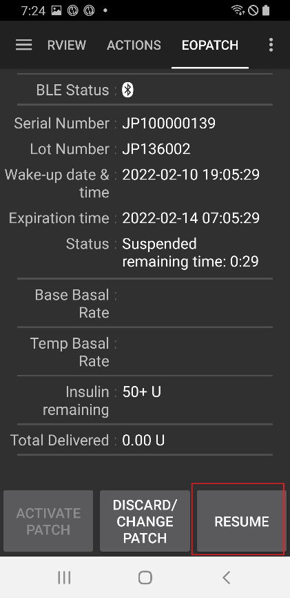 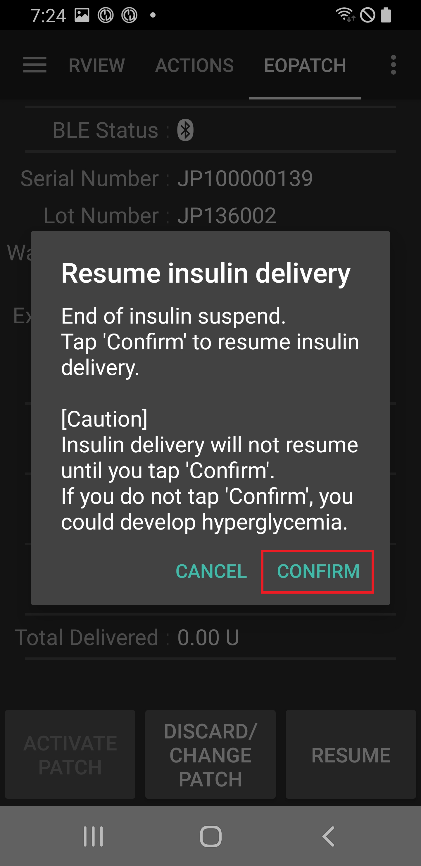

## Alarme/Avertizări

### Alarmă

Se emit alarme pentru situații de urgență de maximă prioritate și care necesită măsuri imediate. Semnalul de alarmă nu dispare sau nu expiră până când nu este confirmat. O alarmă se declanșează atunci când există o problemă cu plasturele utilizat, așadar pot exista cazuri în care plasturele în uz trebuie eliminat și înlocuit cu un plasture nou. Avertismentul este afișat sub forma unei casete de dialog, iar comutarea la un alt ecran nu este posibilă până la finalizarea procesării.

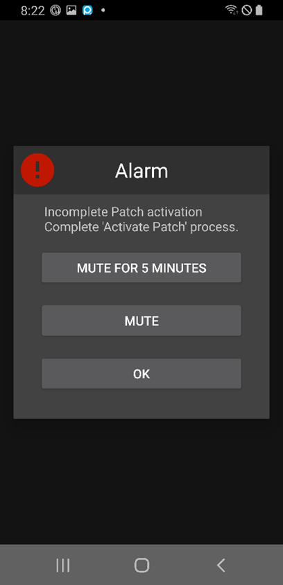 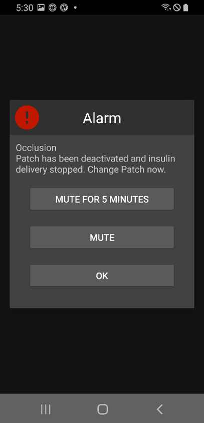

Diferitele tipuri de alarme sunt explicate mai jos.

| Alarme                             | Explicație                                                                                                                                                                                                                                                                    |
| ---------------------------------- | ----------------------------------------------------------------------------------------------------------------------------------------------------------------------------------------------------------------------------------------------------------------------------- |
| Rezervor gol                       | Se întâmplă când rezervorul plasturelui rămâne fără insulină.                                                                                                                                                                                                                 |
| Plasture expirat                   | Se întâmplă când durata de utilizare a expirat, și nu mai sunt posibile administrări suplimentare de insulină.                                                                                                                                                                |
| Ocluzie                            | Se întâmplă când pare că orificiul de admisie a insulinei al plasturelui este înfundat.                                                                                                                                                                                       |
| Eroare la auto-testarea de pornire | Se întâmplă atunci când plasturele detectează o eroare neașteptată în timpul procesului de auto-testare de după inițializare (post-boot).                                                                                                                                     |
| Temperatură nepotrivită            | Se întâmplă când plasturele se află în afara intervalului normal de temperatură de funcționare în timpul aplicării și utilizării plasturelui. Pentru a gestiona această alarmă, mutați plasturele într-o condiție de temperatură de funcționare adecvată (de la 4,4 la 37°C). |
| Eroare la inserarea acului         | Se întâmplă când inserția acului nu a decurs normal în timpul procesului de aplicare al plasturelui. Verificați dacă marginea de inserare a acului a plasturelui și butonul de activare a acului sunt aliniate.                                                               |
| Eroare baterie plasture            | Se întâmplă chiar înainte ca bateria internă a plasturelui să se epuizeze și să se oprească (să se deconecteze de la alimentare).                                                                                                                                             |
| Eroare la activarea plasturelui    | Se întâmplă când aplicația nu reușește să finalizeze procesul de aplicare a plasturelui în decurs de 60 de minute după ce plasturele a pornit.                                                                                                                                |
| Eroare plasture                    | Se întâmplă atunci când plasturele se confruntă cu o eroare neașteptată la aplicarea și utilizarea plasturelui.                                                                                                                                                               |

### Atenție

O atenționare are loc într-o situație de prioritate medie sau redusă. Când are loc o atenționare, este afișată ca o notificare în vederea de ansamblu.

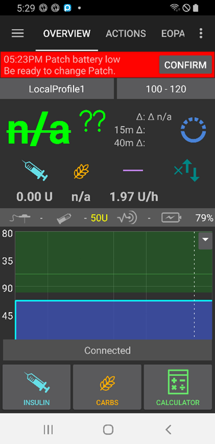

Diferitele tipuri de atenționări sunt explicate mai jos.

| Atenționări                                   | Explicație                                                                                                                                             |
| --------------------------------------------- | ------------------------------------------------------------------------------------------------------------------------------------------------------ |
| Sfârșitul suspendării de insulină             | Se întâmplă când timpul setat de utilizator s-a scurs după ce suspendarea perfuziei de insulină a fost finalizată.                                     |
| Nivel rezervor scăzut                         | Se întâmplă atunci când cantitatea de insulină rămasă din plasture este sub valoarea fixată.                                                           |
| Durata de funcționare a plasturelui a expirat | Se întâmplă când durata de utilizare a plasturelui s-a încheiat.                                                                                       |
| Plasturele va expira în curând                | Se întâmplă cu o oră înainte de expirarea plasturelui.                                                                                                 |
| Activarea plasturelui incompletă              | Se întâmplă când au trecut mai mult de 3 minute din cauza unei întreruperi în timpul aplicării plasturelui, în etapa de după finalizarea împerecherii. |
| Baterie plasture slabă                        | Se întâmplă când bateria plasturelui este scăzută.                                                                                                     |

