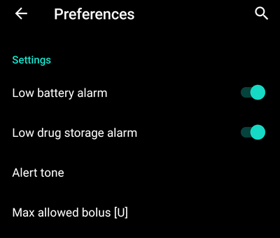
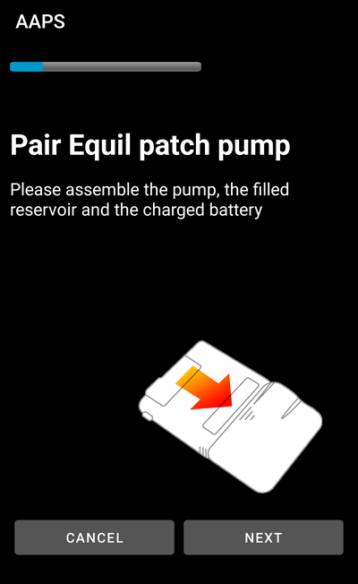

# Equil

Aceste instrucțiuni sunt pentru configurarea pompei de insulină Equil.

## Capacități pompă cu AAPS

§todo

## Cerințe hardware și software
* **Echipament compatibil Equil**

  În prezent Equil 5.3 și 5.4 sunt acceptate

* [Versiunea 3.3.0.0](#version3300) sau mai nouă de AAPS

### Selectați pompa Equil

În [Configurator > Pompa](#Config-Builder-pump), treceți la **Equil 5.3**.

### Setări

### Activați plasturele

Navigați spre fila Equil și apăsați **Asociați plasturele Equil **.

Dacă setați o parolă diferită de cea implicită 0000 (recomandat pentru siguranța dumneavoastră), nu uitați să păstrați această parolă într-un loc sigur. Această parolă este stocată în pompă. Apoi această parolă va fi cerută la fiecare următoare încercare de asociere până când veți face o deconectare corespunzătoare în AAPS. Acest lucru face ca pompa să fie de asemenea inutilizabilă cu telecomanda originală, până când anulați asocierea pompei din AAPS.
