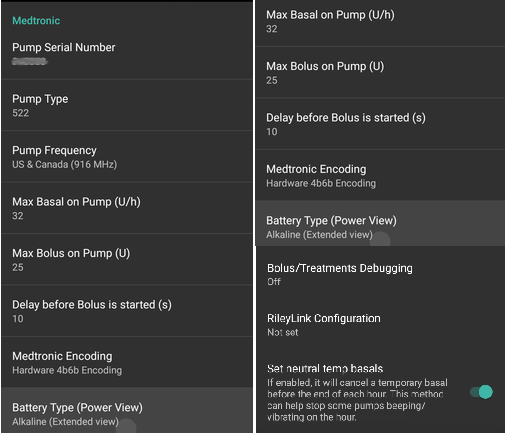
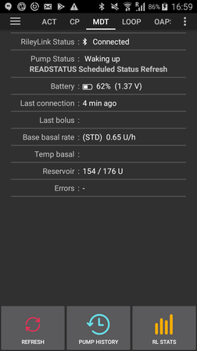
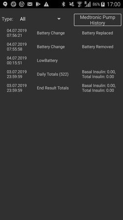
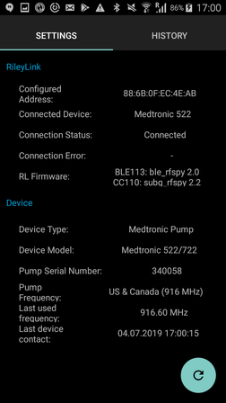
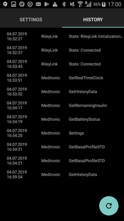
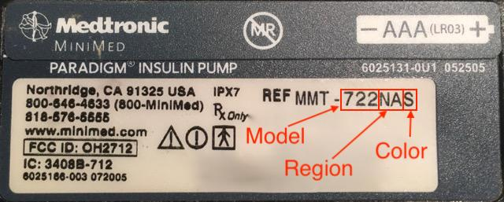

# Pompele Medtronic

Driverul nu funcționează cu nici un model mai nou, inclusiv cu toate modelele care se termină în G (530G, 600 [630G, 640G, 670G], serie de 700 [770G, 780G] etc.).

Următoarele modele și combinații de firmware sunt compatibile:

- 512/712 (orice versiune de firmware)
- 515/715 (orice versiune de firmware)
- 522/722 (orice versiune de firmware)
- 523/723 (firmware 2.4A sau mai mic)
- 554/754 lansare UE (firmware 2.6A sau mai mic)
- 554/754 Versiunea de Canada (firmware 2.7A sau mai mic)

Puteți afla cum să verificați firmware-ul de pe pompele de la [documentația OpenAPS](https://openaps.readthedocs.io/en/latest/docs/Gear%20Up/pump.html#how-to-check-pump-firmware-check-for-absence-of-pc-connect) sau [LoopDocs](https://loopkit.github.io/loopdocs/build/step3/#medtronic-pump-firmware).

## Cerințe hardware și software

- **Telefon:** Driverul Medtronic ar trebui să funcționeze cu orice telefon Android care acceptă conexiuni Bluetooth. **IMPORTANT: Implementările Bluetooth ale producătorilor de telefoane pot varia, astfel că modul în care se comportă fiecare model de telefon poate fi diferit. De exemplu, unele telefoane vor gestiona activarea/dezactivarea Bluetooth în mod diferit. Acest lucru poate avea impact asupra experienței utilizatorului când AAPS trebuie să se reconecteze la dispozitivul de tip RileyLink.**
- **Dispozitiv compatibil RileyLink:** Telefoanele Android nu pot comunica cu pompele Medtronic fără un dispozitiv separat pentru a gestiona comunicațiile. Acest dispozitiv se va conecta cu telefonul dumneavoastră prin Bluetooth și cu pompa printr-o conexiune radio compatibilă. Primul astfel de dispozitiv s-a numit RileyLink, dar acum sunt disponibile o serie de alte opțiuni care pot oferi funcționalitate suplimentară.
    
    - RileyLink disponibil la [getrileylink.org](https://getrileylink.org/product/rileylink916)
    - OrangeLink disponibil la [getrileylink.org](https://getrileylink.org/product/orangelink)
    - EmaLink (mai multe opțiuni ale modelului) disponibil pe [github.com](https://github.com/sks01/EmaLink)
    - Gnarl (necesită unele adaptări/modificări suplimentare de tip "Fă-o Singur" - DIY) detalii disponibile pe [github.com](https://github.com/ecc1/gnarl)

Un grafic de comparație pentru diferitele dispozitive compatibile RileyLink poate fi găsit la [getrileylink.org](https://getrileylink.org/rileylink-compatible-hardware-comparison-chart)

(MedtronicPump-configuration-of-the-pump)=

## Configurarea pompei

Următoarele setări trebuie să fie configurate în pompă pentru ca AAPS să trimită comenzi de la distanță. Etapele necesare pentru a face fiecare modificare pe un Medtronic 715 sunt indicate în paranteze pentru fiecare setare. Etapele exacte pot varia în funcție de tipul pompei și/sau versiunea firmware.

- **Activează modul de la distanță în pompa** (Pe pompă apasă Act și mergi la utilități -> Opțiuni de distanță, Selectați Activat, și pe ecranul următor să adăugați ID și să adăugați orice ID aleatoriu cum ar fi 111111). Cel puțin un ID trebuie să fie pe lista de ID-uri la distanță pentru ca pompa să se aștepte la comunicarea la distanță.
- **Setați bazala maximă** (Pe pompă apăsați Act și ajungeți la bazală și apoi selectați Rată bazală Max) ca un exemplu de setare a acestei valori la de patru ori rata bazală standard maximă ar permite o rată bazală temporară de 400 %. Valoarea maximă permisă de pompă este de 34,9 unități pe oră.
- **Setează bolusul maxim** (Pe pompă, apăsați pe Act și mergeți la bolus, apoi selectați bolus maxim) Acesta este cel mai mare bolus pe care pompa îl va accepta. Valoarea maximă permisă de pompă este 25.
- **Setează profilul la standard**. (Pe pompă, apăsați pe Act și mergeți la Bazal, apoi Selectați Tipare) Pompa va avea nevoie de un singur profil, deoarece AAPS va gestiona profiluri diferite pe telefonul dumneavoastră. Nu sunt necesare alte tipare.
- **Setează tipul de rată bazală temporară** (În pompă apăsați Act și mergeți la bazală și apoi tipul bazalei temporare). Selectați Absolut (nu Procent).

## Configurare Medtronic a telefonului/AAPS

- **Nu asociați dispozitivul compatibil RileyLink din meniul Bluetooth de pe telefonul dumneavoastră** Asocierea prin meniul Bluetooth de pe telefon va opri AAPS să vadă dispozitivul compatibil RileyLink atunci când urmați instrucțiunile de mai jos.
- Dezactivați rotirea automată a ecranului pe telefon. Pe anumite dispozitive rotirea automată a ecranului determină repornirea sesiunilor Bluetooth, ceea ce ar cauza probleme pompei Medtronic. 
- Există două modalități de a configura pompa Medtronic în AAPS:

1. Utilizarea asistentului de configurare ca parte a unei noi instalări
2. Selectând pictograma roată dințată (sau: iconița setări) de lângă selecția Medtronic, în opțiunea de selectare a pompei din Configurator

Când configurați pompa Medtronic cu ajutorul asistentului de configurare, este posibil să nu puteți finaliza configurarea din cauza problemelor Bluetooth (spre exemplu nu vă puteți conecta cu succes la pompă). Dacă se întâmplă acest lucru, trebuie să selectați opțiunea pompei virtuale pentru a finaliza configurația și pentru a permite depanarea ulterioară folosind opțiunea 2.

În timpul configurării AAPS pentru a lucra cu pompa Medtronic trebuie să setați următoarele elemente: (vedeți imaginea de mai sus)

- **Numărul de serie al pompei**: afișat pe spatele pompei și începe cu SN. Ar trebui să introduceți doar cele 6 numere afișate fără nici un caracter alfabetic (de exemplu 123456).
- **Tip pompă**: Pompa model pe care o folosiți (de exemplu 522). 
- **Frecvența pompei**: Există două opțiuni bazate pe locul în care pompa a fost distribuită inițial. Vă rugăm să verificați [Întrebările frecvente](#MedtronicPump-faq) dacă nu sunteți sigur ce opțiune să selectați: 
    - pentru SUA & Canada, frecvența utilizată este de 916 Mhz
    - pentru restul lumii, frecvența utilizată este 868 Mhz
- **Bazală maximă în pompă (U/h)**: Aceasta trebuie să corespundă setării din pompă (vedeți Configurarea pompei de mai sus). Din nou, această setare trebuie selectată cu atenție, deoarece va determina cât de mult AAPS poate livra prin rata bazală. Aceasta va stabili efectiv rata bazală temporară maximă. De exemplu, stabilirea acestei valori la de patru ori valoarea maximă a valorii bazalei standard ar permite o rată bazală temporară de 400%. Valoarea maximă permisă de pompă este de 34,9 unități pe oră.
- **Bolus maxim în pompă (U)** (într-o oră): Aceasta trebuie să corespundă setării setate de pompă (vedeți Configurarea pompei de mai sus). Această setare trebuie analizată cu atenție, deoarece determină cât de mare poate fi setat bolusul de către AAPS.
- **Întârziere înainte ca bolusul să înceapă (s)**: Numărul de secunde după ce un bolus este emis înainte ca această comandă să fie trimisă la pompă. Această perioadă de timp permite utilizatorului să anuleze bolusul în cazul în care o comandă bolus este trimisă din greșeală. Nu este posibilă anularea unui bolus care a început prin AAPS. Singurul mod de a anula un bolus care a început deja este de a suspenda pompa manual, urmat de reluare.
- **Codificarea Medtronic**: Determină dacă codarea Medtronic se efectuează. Selectarea codificării hardware (adică, efectuată de dispozitivul compatibil Rileylink) este preferată, deoarece aceasta duce la trimiterea mai multor date. Selectarea codificării Software (spre exemplu realizată de AAPS) poate ajuta în cazul în care se văd deconectări frecvente. Această setare va fi ignorată dacă aveți versiunea de firmware 0.x pe dispozitivele Rileylink.
- **Tipul bateriei (Power View)**: Pentru a determina corect nivelul rămas al bateriei ar trebui să selectați tipul de baterie AAA în uz. Atunci când o altă valoare decât vizualizarea simplă este selectată AAPS va afișa nivelul procentual al bateriei și voltajul. Sunt disponibile următoarele opțiuni:
    
    - Fără selecție (Afișare simplificată)
    - Alcalină (Afișare extinsă)
    - Litiu (Afișare extinsă)
    - NiZn (Afișare extinsă)
    - NiMH (Afișare extinsă)
- **Depanare bolus/tratamente**: Selectați Pornit sau Oprit în funcție de cerințe.

- **Configurare RileyLink**: Această opțiune vă permite să găsiți și să asociați dispozitivul compatibil RileyLink. Selectarea vă va arăta orice dispozitive compatibile RileyLink din apropiere și puterea semnalului.
- **Utilizați scanarea** Activați scanarea Bluetooth înainte de a vă conecta cu dispozitivele compatibile RileyLink. Acest lucru ar trebui să îmbunătățească fiabilitatea conexiunii dumneavoastră la dispozitiv.
- **Afișați nivelul bateriei raportat de OrangeLink/EmaLink/DiaLink** Această funcție este disponibilă doar pe dispozitivele mai noi, cum ar fi EmaLink sau OrangeLink. Valorile vor fi afișate în fila Medtronic din AndroidAPS. 
- **Setați bazale temporare neutre** În mod implicit pompele Medtronic luminează în timpul orei când o rată bazală temporară este activă. Activarea acestei opțiuni poate ajuta la reducerea numărului de semnale sonore auzite prin întreruperea unei bazale temporare la schimbarea orei pentru a suprima semnalul sonor.

## FILA MEDTRONIC (MDT)

 Când AAPS este configurat pentru a utiliza o pompă Medtronic o filă MDT va fi afișată în lista de file din partea de sus a ecranului. Această filă afișează informațiile curente despre starea pompei împreună cu unele acțiuni specifice Medtronic.

- **Starea RileyLink**: Starea curentă a conexiunii dintre telefon și dispozitivul compatibil RileyLink. Ar trebui să apară permanent drept conectat. Orice altă stare poate necesita intervenția utilizatorului. 
- **Bateria RileyLink**: Nivelul actual al bateriei pentru dispozitivul dumneavoastră EmaLink sau OrangeLink. În funcție de selectarea "Afișați nivelul bateriei raportat de dispozitivul OrangeLink/EmaLink/DiaLink" din meniul de configurare al pompei Medtronic.
- **Starea pompei**: Starea curentă a conexiunii pompei. Deoarece pompa nu va fi conectată în mod constant, aceasta va arăta în general pictograma de somn. Există o serie de posibile alte stări, inclusiv "Trezire" când AAPS încearcă să emită o comandă sau alte posibile comenzi de pompă cum ar fi "Obțineți timpul", "Setați o rată bazală temporară", șamd.
- **Baterie**: Afișați starea bateriei pe baza valorii alese pentru Tipul bateriei (Vizualizare Energie) în meniul de configurare al pompei Medtronic. 
- **Ultima conexiune**: Cu cât timp în urmă a avut loc ultima conexiune reușită la pompă.
- **Ultimul Bolus**: În urmă cu cât timp a fost livrat ultimul bolus cu succes.
- **Rata bazală de bază**: Aceasta este rata bazală de bază care rulează în pompă la această oră în profilul activ.
- **Bazală Temporară**: Bazala temporară care se livrează în prezent, care poate fi 0 unități pe oră.
- **Rezervor**: Cât insulină este în rezervor (actualizată cel puțin o dată pe oră).
- **Erori**: Șirul de eroare în cazul în care există probleme (în principal arată dacă există eroare în configurație).

În partea de jos a ecranului sunt trei butoane:

- **Reîmprospătați** este pentru reîmprospătarea stării curente a pompei. Acest lucru ar trebui să fie utilizat numai în cazul în care conexiunea a fost pierdută pentru o perioadă lungă de timp, deoarece este necesară o reîmprospătare completă a datelor (preluare istoric, obțineți/setați ora, obțineți profilul, obțineți starea bateriei, șamd).
- **Istoric pompă**: Afișați istoricul pompei (vedeți [mai jos](#MedtronicPump-pump-history))
- **Statistici RL**: Arată Statisticile RL (vedeți [mai jos](#MedtronicPump-rl-status-rileylink-status))

(MedtronicPump-pump-history)=

## Istoric pompă

Istoricul pompei este preluat la fiecare 5 minute și păstrat local. Se stochează doar istoricul ultimelor 24 de ore. Permite o modalitate convenabilă de a vedea comportamentul pompei în cazul în care acest lucru este necesar. Singurele elemente stocate sunt cele relevante pentru AAPS și nu vor include o funcție de configurare care nu are relevanță.

(MedtronicPump-rl-status-rileylink-status)=

## Stare RL (Stare RileyLink)

 

Dialogul de stare RL are două file:

- **Setări**: Afișați setări despre dispozitivul compatibil RileyLink: Adresa configurată, Dispozitiv conectat, Starea conexiunii, Eroare conexiune și firmware RileyLink. Tipul dispozitivului este întotdeauna pompa Medtronic, Modelul ar fi modelul dumneavoastră, Numărul de serie este numărul de serie configurat, Frecvența Pompei indică frecvența pe care o utilizați, Ultima Frecvență fiind ultima frecvență utilizată.
- **Istoric**: Afișați istoricul comunicațiilor, elementele cu RileyLink arată modificările de stare pentru RileyLink și indicațiile Medtronic care comenzi au fost trimise la pompă.

## Acțiuni

Când driverul Medtronic este utilizat, două acțiuni suplimentare sunt adăugate în lista de acțiuni:

- **Treziți și reinițializați** - În cazul în care AAPS nu s-a conectat la pompă pentru o perioadă îndelungată (ar trebui să se conecteze la fiecare 5 minute), puteți forța o reinițializare. Se va încerca contactarea pompei prin căutarea pe toate frecvențele radio posibile folosite de pompă. În cazul în care o conexiune reușită are loc, frecvența care a reușit va fi setată ca implicită.
- **Resetați configurarea RileyLink** - Dacă resetați dispozitivul compatibil RileyLink, ar putea fi necesar să folosiți această acțiune astfel încât dispozitivul să poată fi reconfigurat (setare de frecvență, tip de frecvență setată, codare configurată).

## Note importante

### Este necesară o atenție specială în configurația Nightscout

AAPS utilizează un număr de serie pentru sincronizare și numărul de serie este expus în Nigtscout. Deoarece cunoașterea numărului de serie al pompei vechi Medtronic poate fi utilizată pentru controlul pompei de la distanță, să aveți grijă deosebită la întărirea site-ului NS prevenind astfel scurgerea de date în ceea ce privește numărul de serie al pompei. Vedeți https://nightscout.github.io/nightscout/security

### OpenAPS users

Utilizatorii OpenAPS ar trebui să ia aminte că AAPS cu Medtronic utilizează o abordare complet diferită față cea de la OpenAPS. Prin folosirea AAPS, principala metodă de a interacționa cu pompa este prin telefonul dumneavoastră. În cazuri normale de utilizare, este posibil ca singura dată când este necesară utilizarea meniului pompei să fie atunci când se schimbă rezervoarele. Acest lucru este foarte diferit atunci când se utilizează OpenAPS, unde cel puțin o parte din bolus este livrată, de obicei, prin intermediul butoanelor rapide pentru bolus. În cazul în care pompa este folosită pentru a livra manual un bolus, pot apărea probleme dacă AAPS încearcă să livreze unul în același timp. În astfel de cazuri există controale care încearcă să prevină problemele, dar acest lucru trebuie evitat pe cât posibil.

### Jurnalizare

În cazul în care trebuie să depanați funcția pompei Medtronic selectați pictograma de meniu din colțul din stânga sus al ecranului, selectați Setările de Întreținere și Jurnal. Pentru depanarea oricăror probleme Medtronic, elementele Pump, PumpComm, PumpBTComm trebuie bifate.

### CGM Medtronic

CGM Medtronic nu este momentan acceptat.

### Utilizarea manuală a pompei

Trebuie să evitați bolusarea manuală sau configurarea ratelor bazale temporare direct de pe pompă. Toate aceste comenzi ar trebui trimise prin AAPS. În cazul în care se folosesc comenzi manuale, trebuie să existe o întârziere de cel puțin 3 minute între ele pentru a reduce riscul apariției oricăror probleme.

### Schimbările de fus orar, Ora de vară (DST) și Călătoriile cu pompa Medtronic și AAPS

AAPS va detecta automat modificările de fus orar și va actualiza pompa atunci când telefonul se schimbă la noua oră.

Călătoritul spre est înseamnă că vei adăuga ore la ora curentă (spre exemplu de la GMT+0 la GMT+2) nu vor rezulta probleme deoarece nu va fi nicio suprapunere (spre exemplu nu va fi posibil să ai aceeași oră de două ori). Totuși, călătoria înspre vest poate duce la probleme, deoarece vă întoarceți de fapt în timp, ceea ce poate duce la date IOB incorecte.

Problemele observate în timpul călătoriei spre vest sunt cunoscute de dezvoltatori și lucrul la o posibilă soluție este în curs de desfășurare. Vedeți https://github.com/andyrozman/RileyLinkAAPS/issues/145 pentru mai multe detalii. Pentru moment, vă rugăm să rețineți că această problemă poate apărea și să monitorizați cu atenție atunci când se schimbă fusele orare.

### Este GNARL este un dispozitiv complet compatibil Rileylink?

Codul GNARL acceptă pe deplin toate funcțiile folosite de driverul Medtronic în AAPS, ceea ce înseamnă că este complet compatibil. Este important să rețineți că acest lucru va necesita muncă suplimentară, deoarece va trebui să obțineți hardware compatibil și apoi să încărcați codul GNARL pe dispozitiv.

**Notă autorului:** Vă rugăm să rețineți că software-ul GNARL este încă experimental și puțin testat, și nu trebuie să fie considerat sigure pentru utilizarea RileyLink.

(MedtronicPump-faq)=

## Întrebări frecvente

(MedtronicPump-what-to-do-if-i-loose-connection-to-rileylink-and-or-pump)=

### Ce trebuie făcut dacă am pierdut conexiunea la RileyLink și/sau pompă?

Există o serie de opțiuni pentru încercarea rezolvării problemelor de conectivitate.

- Utilizați butonul "Trezire și Reinițializare" în fila ACT așa cum este detaliat mai sus.
- Dezactivați Bluetooth de pe telefon, așteptați 10 secunde și apoi activați din nou. Acest lucru va forța dispozitivul RileyLink să se reconecteze la telefon.
- Resetați dispozitivul RileyLink. Apoi trebuie să utilizați butonul "Resetare Configurare RileyLink" în fila ACT.
- Alți utilizatori consideră că următorii pași sunt eficienți în restabilirea conectivității atunci când alte metode nu au fost: 
    1. Reporniți telefonul
    2. *În timp ce* telefonul repornește reporniți dispozitivul RileyLink
    3. Deschideți AAPS și permite conexiunii să se restabilească

### Cum să determinați ce frecvență utilizează pompa dumneavoastră

Pe spatele pompei veți găsi o linie care detaliază numărul modelului dumneavoastră, împreună cu un cod special de 3 litere. Primele două litere determină tipul de frecvență și ultimul determină culoarea. Iată valorile posibile pentru frecvență:

- NA - America de Nord (în selecția de frecvențe trebuie să selectați "US & Canada (916 MHz)")
- CA - Canada (în selecția de frecvențe trebuie să selectați "US & Canada (916 MHz)")
- WW - Lume (în selectarea frecvenței trebuie să selectați "Worldwide (868 Mhz)")