# Medtrum Nano / 300U

Aceste instrucțiuni sunt pentru configurarea pompei de insulină Medtrum.

Această aplicație face parte dintr-o soluție DIY (do-it-yourself/ o aplicație pe care o construiți singur) și nu este un produs finit; și necesită ca dumneavoastră să citiți, să învățați și să înțelegeți sistemul, de la construcție pana la modul de utilizare. You alone are responsible for what you do with it.

```{contents} Table of contents
:depth: 1
:local: true
```

## Capacități pompă cu AAPS
* Toată funcționalitatea buclei suportată (SMB, RBT șamd)
* Detecția automată a timpului și a fusului orar activată
* Bolusul extins nu este acceptat de driverul AAPS

## Cerințe hardware și software
* **Pompa de bază Medtrum compatibilă și plasturii cu rezervor**
    - Acceptat în prezent:
        - Medtrum TouchCare Nano cu referințe ale pompei de bază: **MD0201** și **MD8201**.
        - Medtrum TouchCare 300U cu referințe ale pompei de bază: **MD8301**.
        - Dacă aveți un model neacceptat și sunteți dispuși să donați echipamente sau să asistați cu testarea, vă rugăm să ne contactați prin intermediul discord [aici](https://discordapp.com/channels/629952586895851530/1076120802476441641).
* **Versiunea 3.2.0.0 sau mai nouă de AAPS construită și instalată** folosind instrucțiunile [construiește APK](../SettingUpAaps/BuildingAaps.md).
* **Telefon Compatibil Android** cu o conexiune Bluetooth BLE
    - Vedeți [Notele de lansare](../Maintenance/ReleaseNotes.md) AAPS
* [**Senzor de monitorizarea continuă a glicemiei (CGM)**](../Getting-Started/CompatiblesCgms.md)

## Înainte să începeți

**SIGURANȚA MAI ÎNTÂI** Nu încercați acest proces într-un mediu în care nu vă puteți reveni după o eroare (trebuie să existe plasturi suplimentari, insulină și dispozitive de control a pompei).

**Telecomanda de control și aplicația Medtrum nu vor funcționa cu un plasture care este activat de către AAPS.** Anterior, ați folosit probabil telecomanda sau aplicația Medtrum pentru a trimite comenzi către pompa dumneavoastră. Din motive de securitate, puteți folosi plasturele activat dar cu dispozitivul sau aplicația care au fost folosite pentru activare sa.

*Aceasta NU înseamnă că ar trebui să vă aruncați telecomanda. Este recomandat să fie păstrată undeva în siguranță ca rezervă în caz de urgență, de exemplu, dacă telefonul se pierde sau AAPS nu funcționează corect.*

**Pompa nu va opri administrarea insulinei atunci când nu este conectată la AAPS** Ratele bazale implicite sunt programate în pompă așa cum sunt definite în profilul activ în prezent. Atâta timp cât AAPS este operațional, va trimite comenzi pentru rate bazale temporare care rulează pentru un maximum de 120 de minute. Dacă dintr-un motiv sau altul pompa nu primește nicio comandă nouă (spre exemplu deoarece comunicarea a fost pierdută din distanței dintre pompă și telefonul), pompa va reveni la rata bazală implicită programată în pompă odată ce rata bazală temporară se încheie.

**Profile cu rate bazale pe durate de 30 de minute NU sunt acceptate în AAPS.** **Profilul AAPS nu accepta un interval de timp de 30 de minute al ratei bazale** Dacă sunteți la început în AAPS și vă configurați pentru prima dată profilul de rată bazală pentru prima dată, vă rugăm să rețineți că intervalele de rate bazale care încep la și jumătate nu sunt acceptate, și va trebui să ajustați profilul de rată a bazalei pentru a începe la fix. Spre exemplu, dacă ai o rată bazală de 1,1 unități care începe la ora 09:30 și are o durată de 2 ore cu terminare la ora 11:30, aceasta nu va funcționa. Va trebui să schimbați această rată bazală de 1,1 unități într-un interval de timp ca 9:00-11:00 sau 10:00-12:00. Chiar dacă dispozitivul pompei Medtrum în sine acceptă incrementele de 30 de minute ale profilului bazalei AAPS nu le poate lua în considerare cu algoritmii săi în prezent.

**Ratele bazale de 0U/h din profil NU sunt acceptate în AAPS** Deși pompa Medtrum acceptă o rată bazală de zero unități AAPS folosește multipli ai ratei bazale de profil pentru a determina tratamentul automat și prin urmare nu poate funcționa cu o rată bazală de zero unități. O rată bazală temporară de zero unități poate fi obținută prin intermediul funcției "Deconectare pompă" sau printr-o combinație de Dezactivare a buclei/ratei bazale temporare sau prin Suspendarea Buclei/Ratei bazale temporare.

## Instalare

ATENȚIE: Când activați un plasture cu AAPS, **TREBUIE** dezactivate toate celelalte dispozitive care pot vorbi cu baza pompei Medtrum. spre exemplu telecomandă activă și aplicație Medtrum. Asigurați-vă că aveți baza pompei dumneavoastră și numărul de serie al bazei pompei pregătit pentru activarea unui nou plasture.

### Pasul 1: Selectați pompa Medtrum

#### Opțiunea 1: Instalări noi

Dacă instalați AAPS pentru prima dată, **Asistentul de configurare** vă va ghida în instalarea AAPS. Selectați "Medtrum" când ajungeți la selecția pompei.

Dacă aveți dubii puteți selecta "Pompa virtuală" și selecta "Medtrum" mai târziu, după ce ați configurat AAPS (vedeți opțiunea 2).

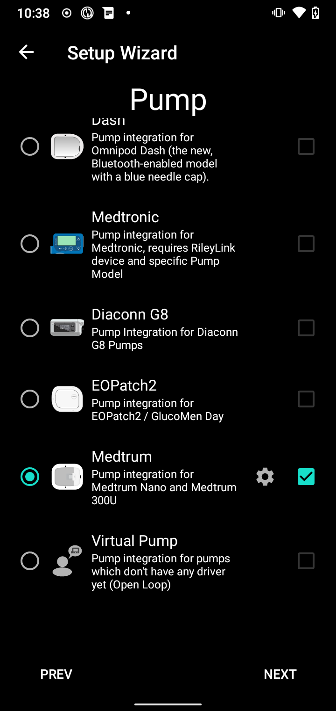

#### Opțiunea 2: Configurator

Pe o instalare existentă, puteți selecta pompa **Medtrum** în [Configurator > Pompa](#Config-Builder-pump):

În colțul din stânga sus **meniu hamburger** selectați **Configurator**\ ➜\ **Pompă**\ ➜ \ **Medtrum**\ prin selectarea butonului **Activare** intitulat **Medtrum**.

Selectarea **casetei de selectare** lângă **Roata Zimțată de Setări** va permite privirii de ansamblu asupra Medtrum să fie afișată ca o filă în interfața AAPS intitulată **Medtrum**. Bifarea acestei casete vă va facilita accesul la comenzile Medtrum atunci când folosiți AAPS și este recomandată în mod special.

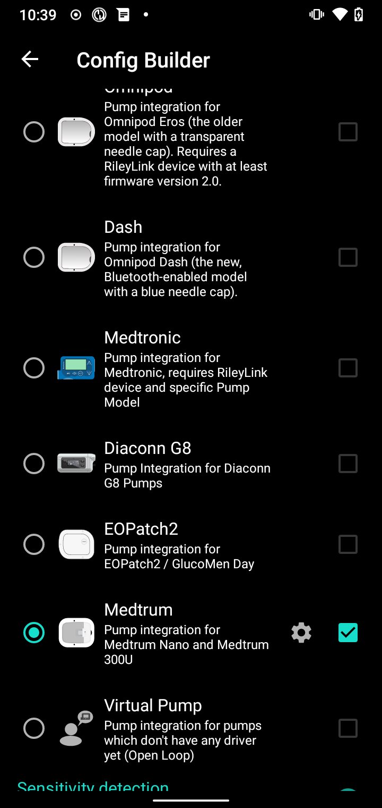

### Pasul 2: Modificați setările Medtrum

Introduceți setările Medtrum prin atingerea **Rotiței zimțate a Setărilor** din modulul Medtrum în Configurator.

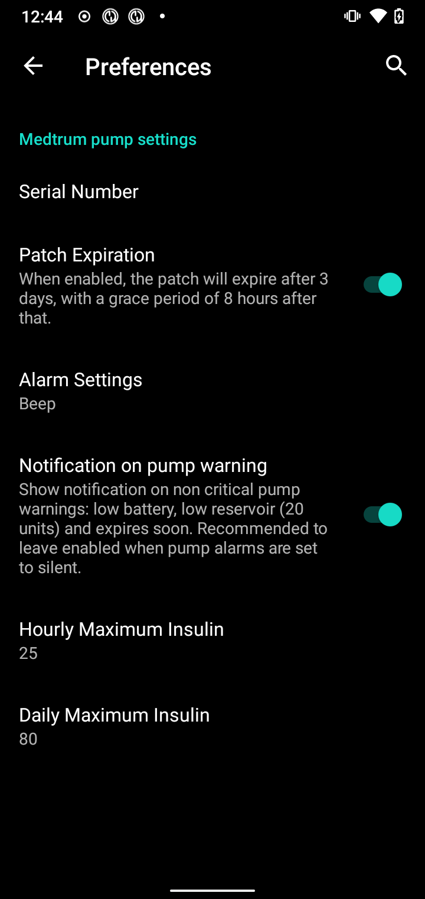

#### Număr de serie:

Introduceți aici numărul de serie al bazei pompei dumneavoastră așa cum este înscris pe baza pompei. Asigurați-vă că numărul de serie este corect și că nu există spații adăugate (puteți folosi litere mari sau mici).

NOTĂ: Această setare poate fi schimbată doar când nu există un plasture activ.

#### Setări alarmă

***Implicit: semnal sonor.***

Această setare schimbă modul în care pompa vă va alerta atunci când există un avertisment sau o eroare.

- Semnal sonor > Plasturele va suna la alarme și avertismente
- Silențios > Plasturele nu vă va alerta prin alarme și avertismente

Notă: În modul silențios, AAPS încă va suna alarma în funcție de setările de volum ale telefonului. Dacă nu răspundeți la alarmă, în cele din urmă plasturele va emite un semnal sonor.

#### Notificare la avertizarea pompei

***Implicit: Activat.***

Aceste setări schimbă modul în care AAPS va afișa notificarea în cazul avertismentelor non-critice ale pompei. Când este activată, o notificare va fi afișată pe telefon atunci când apare un avertisment al pompei, inclusiv:
    - Baterie slabă
    - Rezervor redus (20 de unități)
    - Avertizare de expirare a plasturelui

În orice caz, aceste avertismente sunt afișate și în ecranul privire de ansamblu al Medtrum sub [Alarme active](#medtrum-active-alarms).

(medtrum-patch-expiration)=
#### Expirare plasture

***Implicit: Activat.***

Această setare schimbă comportamentul plasturelui. Când este activat, plasturele va expira după 3 zile și va emite un avertisment sonor dacă aveți sunetul activat. După 3 zile și 8 ore, plasturele va înceta să funcționeze.

Dacă această setare este dezactivată, plasturele nu vă va avertiza și va continua să ruleze până când bateria plasturelui sau rezervorul se vor termina.

#### Avertizare de expirare pompă

***Implicit: 72 de ore.***

Această setare schimbă ora de expirare când [Expirare plasture](#medtrum-patch-expiration) este activată, AAPS va notifica la o oră după activare.

#### Insulină maximă pe oră

***Implicit: 25U.***

Această setare modifică cantitatea maximă de insulină care poate fi administrată într-o oră. Dacă această limită este depășită, plasturele se va suspenda și va da o alarmă. Alarma poate fi resetată prin apăsarea butonului de resetare din meniul general vedeți [Resetați alarmele](#nano-reset-alarms).

Stabiliți aceasta la o valoare rezonabilă pentru necesarul dumneavoastră de insulină.

#### Insulină maximă zilnică

***Implicit: 80U.***

Această setare schimbă cantitatea maximă de insulină care poate fi administrată într-o zi. Dacă această limită este depășită, plasturele se va suspenda și va da o alarmă. Alarma poate fi resetată prin apăsarea butonului de resetare din meniul general vedeți [Resetați alarmele](#nano-reset-alarms).

Stabiliți aceasta la o valoare rezonabilă pentru necesarul dumneavoastră de insulină.

#### Eroare Scanare la conexiune

***Implicit: oprit.***

Localizat sub **Setări avansate**.

Activați numai dacă aveți probleme de conexiune. Dacă este activată, driverul scanează după pompa din nou înainte de a încerca reconectarea la pompă. Asigurați-vă că aveți permisiunea de locație setată la "Întotdeauna permiteți".

### Pasul 2b: Setările alertelor AAPS

Mergeți la preferințe

#### Pompă:

##### BT Watchdog

Mergeți la preferințe și selectați **Pompa**:

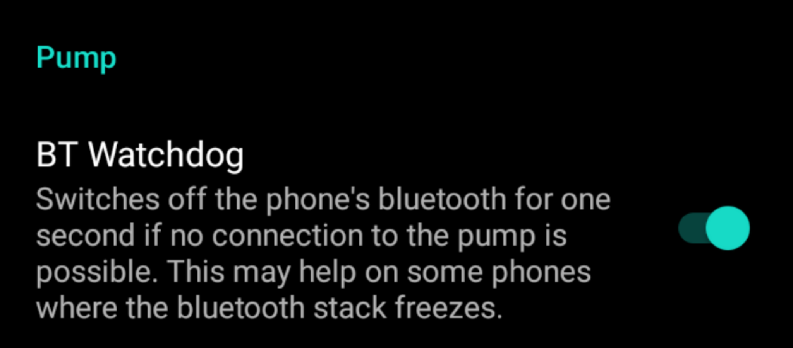

##### BT Watchdog

Această setare va încerca să remedieze orice probleme legate de BLE. Va încerca să se reconecteze la pompă atunci când conexiunea este pierdută. De asemenea, va încerca să se reconecteze la pompă atunci când pompa nu mai este accesibilă pentru o anumită perioadă de timp.

Activați această setare dacă întâmpinați probleme frecvente de conectare cu pompa.

#### Alerte locale:

Mergeți la preferințe și selectați **Alerte locale**:

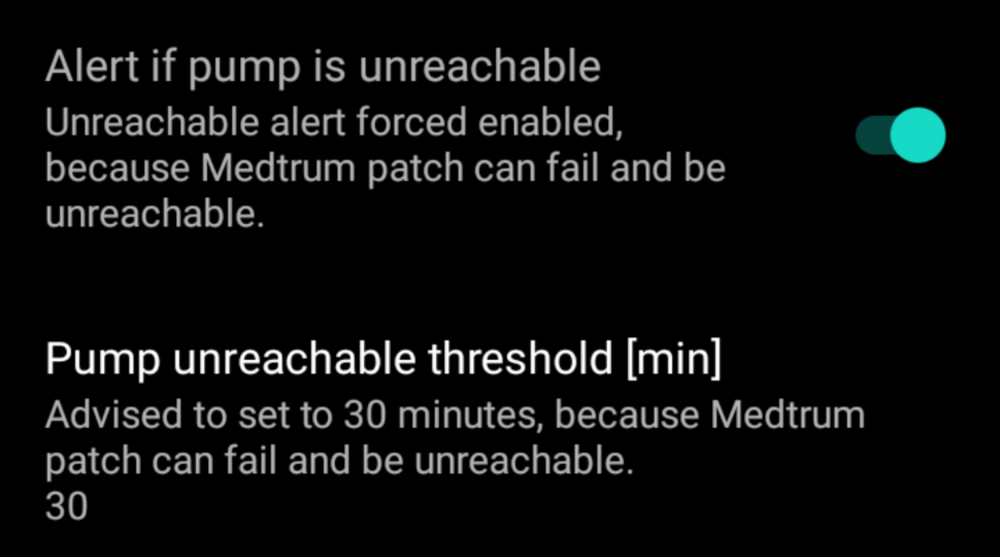

##### Alertați dacă pompa este indisponibilă

***Implicit: Activat.***

Această setare este forțată să fie activată atunci când driverul Medtrum este activ. Vă va alerta când pompa nu este accesibilă. Acest lucru se poate întâmpla atunci când pompa nu este în preajmă sau când pompa nu răspunde din cauza unui plasture sau a unei baze de pompă defecte, spre exemplu, când apa se scurge între baza pompei și plasture.

Din motive de siguranță, această setare nu poate fi dezactivată.

##### Prag pompă indisponibilă [min]

***Implicit: 30 de minute.***

Această setare schimbă timpul după care AAPS vă va alerta atunci când pompa nu este accesibilă. Acest lucru se poate întâmpla atunci când pompa nu este în preajmă sau când pompa nu răspunde din cauza unui plasture sau a unei baze de pompă defecte, spre exemplu, când apa se scurge între baza pompei și plasture.

Această setare poate fi schimbată când se utilizează pompa Medtrum, dar se recomandă setarea acesteia la 30 de minute, din motive de siguranță.

### Pasul 3: Activați plasturele

**Înainte să continuați:**
- Să aveți baza pompei Medtrum Nano și un plasture cu rezervor pregătite.
- Asigurați-vă că AAPS este configurat în mod corespunzător și că [este activat un profil](../DailyLifeWithAaps/ProfileSwitch-ProfilePercentage.md).
- Alte dispozitive care pot vorbi cu pompa Medtrum sunt dezactivate (telecomanda sau aplicația Medtrum)

#### Activați plasturele din fila vedere de ansamblu Medtrum

Navigați spre [fila Medtrum](#nano-overview) în interfața AAPS și apăsați butonul **Schimbați plasturele** din colțul din dreapta jos.

Dacă un plasture este deja activ, vi se va cere să dezactivați mai întâi acest plasture. vedeți [Dezactivați plasturele](#nano-deactivate-patch).

Urmați instrucțiunile pentru a umple și a activa un nou plasture. Vă rugăm să rețineți - este important să conectați baza pompei la plasturele rezervor doar în etapa în care vi se cere să faceți acest lucru. **Trebuie să puneți pompa pe corpul dumneavoastră și să introduceți canula numai când vi se cere în timpul procesului de activare (după ce amorsarea este completă).**

##### Pornire activare

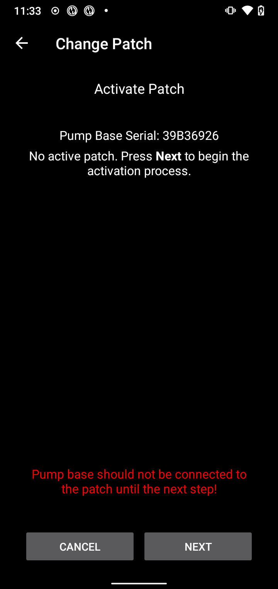

În această etapă, verificați numărul de serie și asigurați-vă că baza pompei nu este încă conectată la plasture.

Apăsați **Înainte** pentru a continua.

##### Umpleți plasturele transdermic

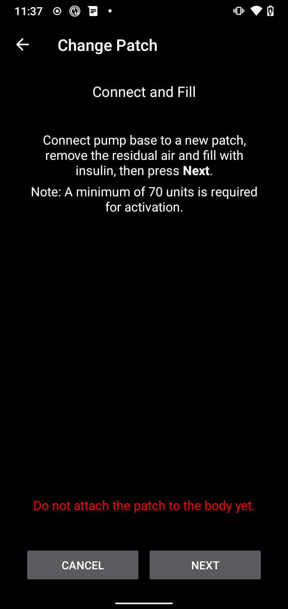

Odată ce plasturele este detectat și umplut cu minim 70 de unități de insulină, va apărea **Următorul**.

##### Amorsați plasturele transdermic

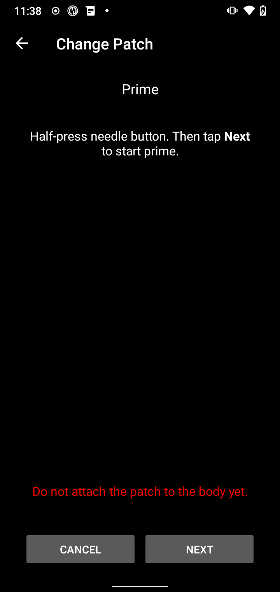

Nu îndepărtați piedica de siguranță și apăsați butonul acului de pe plasture.

Apăsați **Următorul** pentru a începe să amorsați

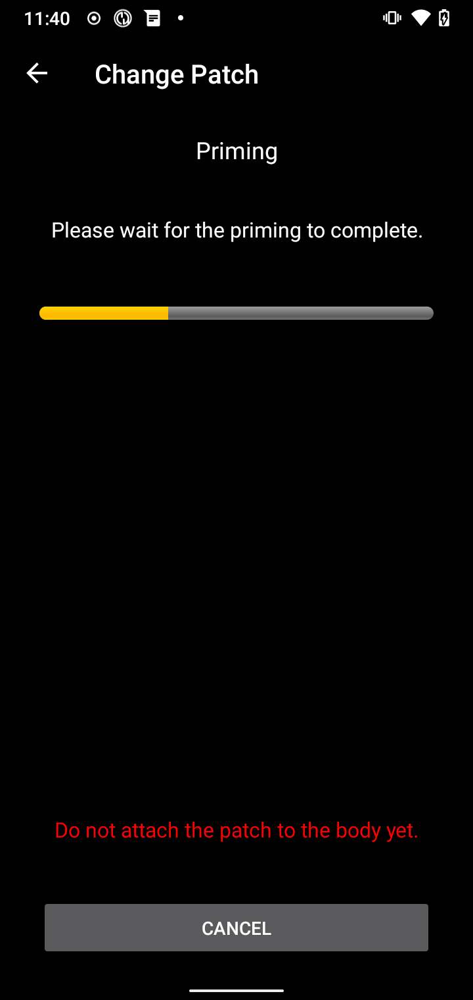

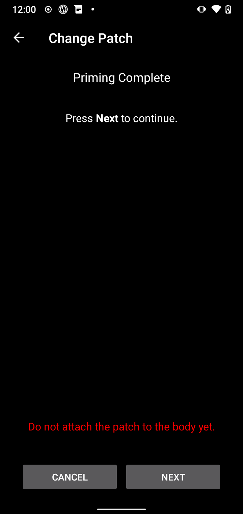

Odată ce amorsarea este finalizată, apăsați **Următorul** pentru a continua.

##### Atașați plasturele

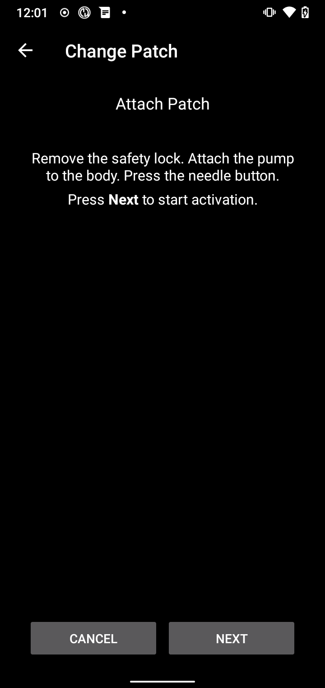

Curățați pielea, îndepărtați autocolantele și atașați plasturele pe corpul dumneavoastră. Îndepărtați piedica de siguranță și apăsați pe butonul acului de pe plasture pentru a introduce canula.

Apăsați **Următorul** pentru a activa plasturele.

(medtrum-activate-patch)=
##### Activați plasturele

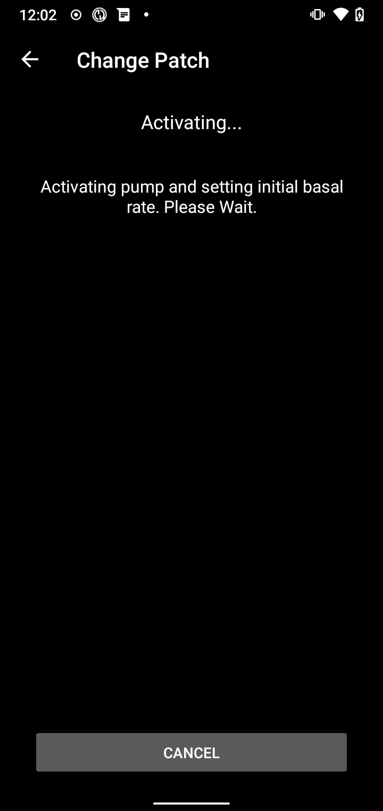

Când activarea este finalizată, va apărea următorul ecran

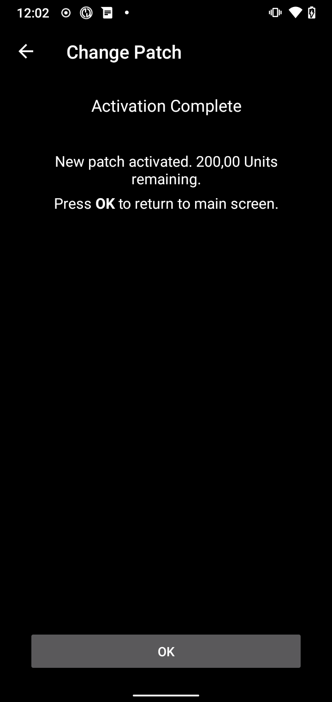

**OK** pentru a reveni la ecranul principal.

(nano-deactivate-patch)=

### Dezactivați plasturele

Pentru a dezactiva un plasture activ, accesați [fila Medtrum](#nano-overview) din interfața AAPS și apăsați butonul **Schimbați plasture**.


Vi se va cere să confirmați că doriți să dezactivați plasturele curent. **Vă rugăm să rețineți că această acțiune nu este reversibilă.** Când dezactivarea este finalizată, puteți apăsa **Următorul** pentru a continua procesul de activare a unui nou plasture. Dacă nu sunteți gata să activați un nou plasture, apăsați **Anulați** pentru a reveni la ecranul principal.


Dacă Android APS nu poate dezactiva plasturele (de exemplu, pentru că baza pompei a fost deja scoasă din plasturele rezervor), puteți apăsa **Renunțați** pentru a uita sesiunea curentă a plasturelui și pentru a face posibilă activarea unui nou plasture.

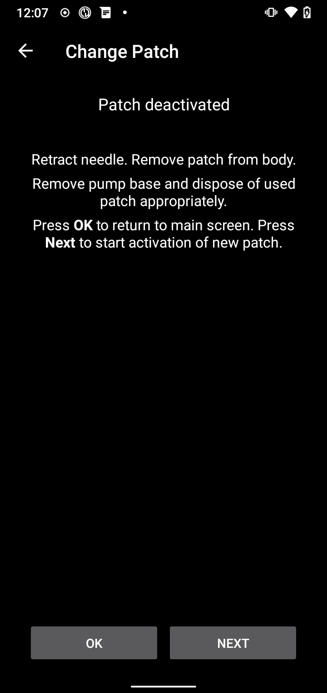

Odată ce dezactivarea este finalizată, apăsați **OK** pentru a reveni la ecranul principal sau apăsați **Următorul** pentru a continua procesul de activare a unui nou plasture.

(nano-resume-interrupted-activation)=

### Reluați activarea întreruptă

Dacă activarea unui plasture este întreruptă, de exemplu pentru că bateria telefonului se oprește, poți relua procesul de activare prin [fila Medtrum](#nano-overview) în interfața AAPS și apăsați butonul **Schimbați plasturele**.

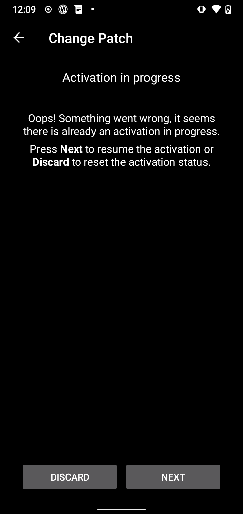

Apăsați **Următorul** pentru a continua procesul de activare. Apăsați **Aruncați** pentru a renunța la sesiunea curentă a plasturelui și pentru a face posibilă activarea unui nou plasture.

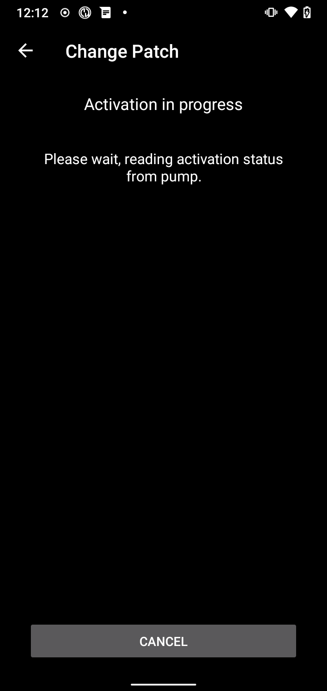

Driverul va încerca să determine starea actuală a activării plasturelui. Dacă operațiunea a reușit, procesul de activare va continua de la pasul curent.

(nano-overview)=

## Privire de ansamblu

Vederea de ansamblu conține starea curentă a plasturelui Medtrum. Conține de asemenea butoane pentru a schimba plasturele, pentru a reseta alarme și a actualiza starea.

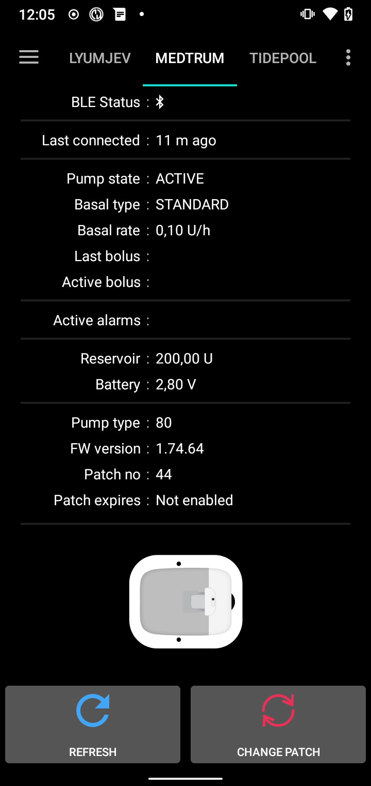

### Stare BLE:

Aceasta afișează starea curentă a conexiunii Bluetooth cu baza de pompă.

### Ultima conexiune:

Aceasta arată ultima dată când pompa a fost conectată la AAPS.

### Stare pompă:

Aceasta arată starea curentă a pompei. Spre exemplu:
    - ACTIV: Pompa este activată și rulează normal
    - OPRIT: Plasturele nu este activat

### Tip bazală:

Aceasta arată tipul bazalei curente.

### Rată bazală:

Acesta arată rata bazală curentă.

### Ultimul bolus:

Acest lucru arată ultimul bolus care a fost administrat.

### Bolus activ:

Acest lucru arată bolusul activ care este în prezent în curs de livrare.

(medtrum-active-alarms)=
### Alarme active:

Acest lucru arată orice alarme active care sunt active în prezent.

### Rezervor:

Acesta indică nivelul curent al rezervorului.

### Baterie:

Acest lucru arată tensiunea curentă a bateriei plasturelui.

### Tip pompă:

Aceasta afișează numărul actual al tipului de pompă.

### Versiune FW:

Acesta arată versiunea curentă de firmware a plasturelui.

### Numărul plasturelui:

Acesta arată numărul de ordine al plasturelui activat. Acest număr este incrementat de fiecare dată când este activat un nou plasture.

### Plasturele expiră:

Acesta arată data și ora când plasturele va expira.

### Reîncărcați:

Acest buton va reîmprospăta starea plasturelui.

### Schimbați plasturele transdermic:

Acest buton va începe procesul de schimbare a plasturelui. Vedeți [Activați plasture](#medtrum-activate-patch) pentru mai multe informații.

(nano-reset-alarms)=

### Resetați alarmele

Butonul de alarmă va apărea pe ecranul vedere de ansamblu atunci când există o alarmă activă care poate fi resetată. Apăsarea acestui buton va reseta alarmele și va relua administrarea insulinei dacă plasturele a fost suspendat din cauza alarmei. Spre exemplu în cazul suspendării cauzate de alarma privind doza maximă zilnică de insulină.

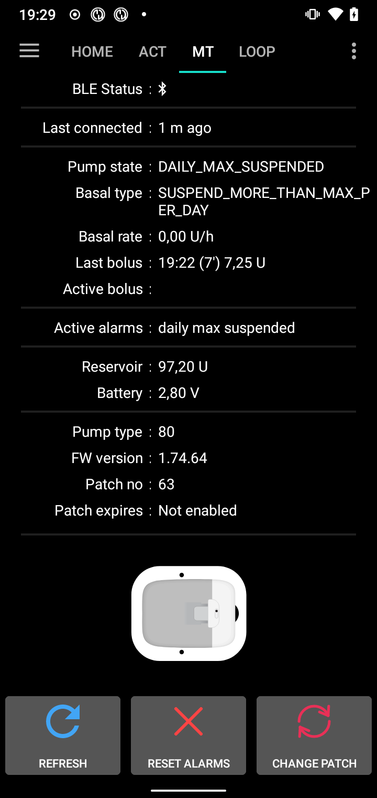

Apăsați butonul **Resetați alarmele** pentru a reseta alarmele și a relua operațiunea normală.

## Schimbarea telefonului, setări export/import

Când treceți la un telefon nou, sunt necesari următorii pași:
* [Exportați setările](../Maintenance/ExportImportSettings.md) pe telefonul tău vechi
* Transferați setările de pe telefonul vechi la cel nou și importați-le în AAPS

Fișierul de setări importat trebuie să aparțină aceleiași sesiuni de plasture pe care o utilizați în prezent, altfel plasturele nu se va conecta.

După ce se importă setările, driverul va sincroniza istoricul cu pompa, iar acest lucru poate dura o vreme în funcție de vârsta fișierului de setări.

De la versiunea 3.0.0 AAPS, progresul sincronizării este afișat în ecranul principal: 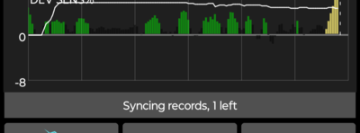

## Depanare

### Probleme de conexiune

Dacă aveți întreruperi de conexiune sau alte probleme de conexiune:
- În setările Android ale aplicației AAPS: Setați permisiunea de localizare la "Permiteți tot timpul".

### Probleme Bluetooth
Pentru probleme cunoscute cu conexiunile Bluetooth, întreruperile pompei, activarea și problemele de conexiune [Depanarea Bluetooth](../GettingHelp/BluetoothTroubleshooting.md)

### Activare întreruptă

Dacă procesul de activare este întrerupt spre exemplu de către bateria descărcată a telefonului sau ale unei erori de sistem a telefonului. Procesul de activare poate fi reluat mergând la ecranul de schimbare a plasturelui și urmați pașii pentru a relua activarea, așa cum este subliniat aici: [Reluați activare întreruptă](#nano-resume-interrupted-activation)

### Prevenirea defecțiunilor plasturelui

Plasturele poate produce o varietate de erori. Pentru a preveni erorile frecvente:
- Asigurați-vă că baza pompei este așezată corespunzător în plasture și că nu sunt vizibile goluri.
- La umplerea plasturelui nu aplicați o forță excesivă pistonului. Nu încercați să umpleți plasturele peste limita maximă care se aplică modelului dumneavoastră.

## Unde să obțineți ajutor

Toată munca de dezvoltare pentru driverul Medtrum este realizată de comunitate pe bază **voluntară**; vă cerem să vă amintiți acest lucru și să utilizați următoarele recomandări înainte de a solicita asistență:

-  **Nivelul 0:** Citiți secțiunea relevantă a acestei documentații pentru a vă asigura că înțelegeți cum ar trebui să meargă funcționalitatea cu care aveți dificultăți.
-  **Nivelul 1:** Dacă încă întâmpinați probleme pe care nu le puteți rezolva folosind acest document, apoi vă rugăm să mergeți la canalul *#Medtrum* pe **Discord** folosind [această legătură de invitație](https://discord.gg/4fQUWHZ4Mw).
-  **Nivelul 2:** Căutați problemele existente pentru a vedea dacă problema dumneavoastră a fost deja raportată la [Probleme](https://github.com/nightscout/AAPS/issues) dacă există, vă rugăm să confirmați/comentați/adăugați informații despre problema dumneavoastră. Dacă nu, vă rugăm să creați o nouă problemă [](https://github.com/nightscout/AndroidAPS/issues) și să atașați [fișierele de jurnal](../GettingHelp/AccessingLogFiles.md).
-  **Fiți răbdători - majoritatea membrilor comunității noastre sunt voluntari bine-voitori, și rezolvarea problemelor necesită adesea timp și răbdare atât din partea utilizatorilor cât și din partea dezvoltatorilor.**