# Omnipod DASH

Aceste instrucțiuni sunt pentru configurarea pompei de generație **Omnipod DASH** **(NU Omnipod Eros)**, disponibilă ca parte a versiunii 3.0 a **AAPS**.

## Specificații Omnipod DASH

Acestea sunt specificațiile modelului **Omnipod DASH** ("DASH") și ce îl diferențiază de modelul **Omnipod EROS** ("EROS"):

- Pompele DASH sunt identificate printr-un **capac albastru pentru ac** (EROS are un capac transparent pentru ac). Capsulele sunt în rest identice în ceea ce privește dimensiunile fizice.
- DASH nu necesită un dispozitiv BLE link/bridge (NU este nevoie de RileyLink, OrangeLink sau EmaLink).
- Conexiunea Bluetooth a DASH este utilizată numai atunci când se trimite o comandă (spre exemplu un Bolus) și se deconectează imediat după emiterea comenzii.
- Gata cu erorile "fără conexiune la dispozitivul/podul conectat" cu DASH.
- **AAPS** va aștepta accesibilitatea pompei pentru a trimite comenzi.
- La activarea pompei, **AAPS** va găsi și se va conecta la o nouă pompă DASH.
- Rază de acțiune preconizată: 5-10 metri (Rezultatele pot varia).

(omnipod-dash-constraints)=

## Constrângeri/probleme AAPS cunoscute pentru Omnipod DASH
- Android 16 necesită **AAPS** versiunea 3.3.2.1 sau mai târziu.
- Recomandare generală este de a rula **AAPS** pe Android 14 sau 16. Android 15 are multe probleme [raportate ](https://github.com/nightscout/AndroidAPS/issues/3471) de către comunitate. Cu toate acestea, dacă rulați pe Android 15, este posibil să fie nevoie să activați și să utilizați Bluetooth Bonding cu succes pompele, vedeți [Depanare](../GettingHelp/GeneralTroubleshooting.md) pentru mai multe informații despre setările de asociere.
- Actualizările prea frecvente ale bazalelor pot cauza [probleme](https://github.com/nightscout/AndroidAPS/issues/4158) în administrarea insulinei bazale cu Omnipod Dash. Când se utilizează **SMB**, limitează intervalul la minim 5 minute pentru a evita această problemă.
- Dash acceptă doar rata bazale în pași de 0,05 U/h. Dacă încercați să setați bazala cu pași de 0,01 în profilul **AAPS**, AAPS nu vă va da un avertisment, chiar dacă pompa va rotunji rata bazală în pași de 0,05. Dacă afișați Gestionare Pompă/Istoric Pompă vă va arată că s-a setat o bazală de 0,05. Acest lucru înseamnă, de asemenea, cea mai mică rată bazală permisă de DASH din **AAPS** este de 0,05U/h.
- Starea de activare a unei pompe este stocată în fișierul de setări, dacă exportați un fișier de setări cu o pompă activă. Apoi schimbați la o nouă pompă, restabiliți setările din exportul anterior și veți fi restabilit activarea pompei vechi și veți fi eliminat activarea pompei noi. De aceea, vă recomandăm să exportați setările după fiecare activare de pompă pentru a permite o restaurare a stării de activare a pompei, dacă ceva se întâmplă cu dispozitivul dumneavoastră.
- La setarea unui profil bazal nou, DASH va suspenda livrarea înainte de a seta noul **Profil** bazal. Dacă există o întrerupere sau o eroare de comunicare, profilul bazalei nu va reporni automat. Vedeți secțiunea [Reluarea Administrării de insulină](#omnipod-dash-resuming-insulin-delivery) pentru detalii.
- În cazul în care alertele sunt configurate, iar pompa este pe cale să expire, pompa va continua să piuie până când alertele sunt reduse la tăcere, Vedeți [Suprimarea alertelor pompei](#omnipod-dash-silencing-pod-alerts) pentru detalii.
- Există o serie de probleme cunoscute cu Bluetooth, care pot cauza probleme de activare a pompei. Vedeți [Depanarea Bluetooth](../GettingHelp/BluetoothTroubleshooting.md) pentru problema cunoscută și soluțiile la aceste probleme.

(hardware-software-requirements)=

(omnipod-dash-hardware-software-requirements)=
## Cerințe hardware/software

- Omnipod DASH este identificat prin capacul albastru al acului.

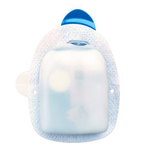

- **Un telefon Android** compatibil cu Bluetooth Low Energy (BLE) (a se vedea [Telefoane](../Getting-Started/Phones.md) pentru mai multe informații), În plus, următoarele informații vă vor ghida cu privire la alte aspecte esențiale legate de activarea și utilizarea cu succes a DASH pe un telefon compatibil:
    -  Driverul **AAPS** Omnipod Dash se conectează cu pompa DASH folosind Bluetooth.  
      **AAPS** va stabili automat o nouă conexiune Bluetooth la pompă de fiecare dată când trebuie să trimită o comandă (spre exemplu, un bolus), după trimiterea comenzii, conexiunea Bluetooth este deconectată imediat.
       - **NOTĂ:**
         - Conexiunea Bluetooth poate fi întreruptă/perturbată de alte dispozitive Bluetooth conectate la telefonul care rulează **AAPS**, cum ar fi căștile șamd... Dispozitive ca acestea pot cauza erori de conectare sau probleme de activare ale pompei pe unele modele de telefoane. Este o idee bună să revizuiți lista [pentru configurațiile hardware testate](https://docs.google.com/spreadsheets/u/1/d/e/2PACX-1vScCNaIguEZVTVFAgpv1kXHdsHl3fs6xT6RB2Z1CeVJ561AvvqGwxMhlmSHk4J056gMCAQE02sAWJvT/pubhtml?gid=683363241&single=true) pentru configurațiile de lucru cunoscute înainte de a te înhăma la un nou dispozitiv pregătit pentru Omnipod DASH.
         - Există o serie de probleme cunoscute cu Bluetooth, care pot cauza probleme de activare a pompei (Vedeți [Depanarea](#troubleshooting) pentru sfaturi cu privire la alte probleme Bluetooth) în mod specific secțiunea [probleme legate de Bluetooth](#omnipod-dash-bluetooth-related-issues).
    - Pentru **Android 15** sau mai jos: Dumneavoastră **TREBUIE** să utilizați ** cel puțin Versiunea 3.0 de AAPS** folosind instrucțiunile [**Construire APK**](../SettingUpAaps/BuildingAaps.md), cu toate acestea, este recomandabil să rulați ultima versiune publicată.
    - Pentru **Android 16**: **TREBUIE** să folosești **Versiunea 3.3.2. sau mai nou de AAPS** folosind instrucțiunile [**Construire APK**](../SettingUpAaps/BuildingAaps.md), datorită modificării modului de funcționare a sistemului Bluetooth de către Android 16. Orice versiune mai veche de 3.3.2.1 va cauza probabil defecțiuni ale pompei și/sau [probleme](https://github.com/nightscout/AndroidAPS/issues/3471) la activare.
- Un [**Senzor de monitorizare continuă a glicemiei (CGM)**](../Getting-Started/CompatiblesCgms.md)

Instrucțiunile de mai jos explică cum să activați o nouă sesiune de pompă prin utilizarea **AAPS**. Ar trebui să așteptați ca pompa curentă să fie aproape de expirare pentru că va trebui să activați o pompă nouă cu **AAPS**. Odată ce o pompă este dezactivată, nu poate fi reutilizată/reactivată, dezactivarea este finală.

## Înainte să începeți

Asigurați-vă că ați citit și înțeles acest ghid, că ați citit și înțeles secțiunea **Înainte de a începe**, precum și  **[Constrângeri și Probleme Omnipod și AAPS](#omnipod-dash-constraints)** pentru a evita apariția unor probleme cunoscute.

### **SIGURANȚA MAI ÎNTÂI** - **NU AR TREBUI** să încercați să conectați **AAPS** la o pompă Omnipod DASH pentru prima oară fără sa aveți acces la următoarele:
1. Pompe suplimentare (3 sau mai multe de rezervă)
2. Insulină de rezervă și stilouri de insulină
3. Un PDM Omnipod (În cazul în care**AAPS** nu funcționează)
4. Telefoanele acceptate sunt o necesitate! (Vedeți [Cerințele Hardware/Software](#hardware-software-requirements))
5. Versiunea corectă a AAPS construită și instalată

### **Telecomanda dumneavoastră Omnipod Dash va fi redundantă după ce driverul AAPS Dash vă activează pompa.**
- Înainte de utilizarea **AAPS** ar fi trebuit ca dumneavoastră sau persoana care vă îngrijește să gestioneze pompa folosind telecomanda Omnipod (sau în unele regiuni o aplicație de telefon) pentru a trimite comenzi către pompa DASH (spre exemplu un bolus).
- DASH poate facilita o singură conexiune cu un singur dispozitiv Bluetooth (de exemplu telecomanda sau telefon) pentru gestionare și trimiterea comenzilor.
- Dispozitivul care activează cu succes pompa este singurul dispozitiv care are permisiunea de a comunica cu acea pompă din acel moment. Asta înseamnă că odată ce activați DASH cu telefonul dumneavoastră Android folosind **AAPS**, **nu vei mai putea folosi telecomanda cu acea pompă!** Pentru perioada în care pompa este activă ** driverul Dash** care rulează pe telefonul dumneavoastră Android este acum noua telecomanda pentru pompă.
- **NU aruncați telecomanda Omnipod!** Se recomandă să fie păstrat ca o copie de rezervă și pentru urgențe, de exemplu când telefonul se pierde sau **AAPS** nu funcționează corect.

### Pompa **NU VA** opri administrarea insulinei atunci când nu este conectată la AAPS.
Ratele bazale implicite sunt programate pe pompă la momentul activării așa cum sunt definite în [**profilul**](../SettingUpAaps/YourAapsProfile.md) care este activat în prezent.  
Atâta timp cât **AAPS** este operațional va trimite comenzi de ajustare ale ratei bazale care vor rula pentru un maximum de 120 de minute.  
Când pentru vreun motiv anume pompa nu primește comenzi noi (de exemplu pentru că comunicarea a fost pierdută din cauza distanței pompă ➜ telefon) pompa va reveni la rata bazală implicită așa cum a fost setată în [**profilul**](../SettingUpAaps/YourAapsProfile.md) dumneavoastră.

### **Profilul(urile) AAPS nu acceptă intervale de 30 minute pentru ratele bazale**
Dacă sunteți la început cu **AAPS** și configurați [**profilul**](../SettingUpAaps/YourAapsProfile.md) ratei bazale pentru prima dată, vă rugăm să rețineți că ratele bazale la intervale de o jumătate de oră nu sunt acceptate. De exemplu, pe telecomanda Omnipod, dacă aveți o rată bazală de 1,1 unitățile care începe la ora 09:30 și care au o durată de 2 ore care se termină la ora 11:30, în schimb nu este posibil să reproducem acest **profil** bazal în **AAPS**.  
Va trebui să schimbați această rată bazală de 1,1 unități într-un interval de timp care să fie 9:00-11:00, fie 10:00-12:00. Chiar dacă hardware-ul DASH însuși suportă incrementele de 30 de minute ale **profilulului** ratei bazale, **AAPS** NU acceptă această caracteristică.

### **Valori bazale de 0U/h ale profilului NU sunt acceptate în AAPS**
Deși DASH acceptă o rată bazală de zero, **AAPS** folosește multiplii ai ratelor bazale din **Profil** pentru a determina tratamentul automat; nu poate funcționa cu rată bazală de zero.  
În schimb o rată bazală temporară de zero poate fi obținută prin funcția "Deconectare pompă", ori printr-o combinație de Oprire buclă/Rate bazale temporare sau Suspendare buclă/Rate bazale temporare.  
**NOTĂ:** Cea mai mică rată bazală permisă de către DASH în **AAPS** este 0,05U/h.

## Selectare Dash în AAPS

Există **două** opțiuni disponibile pentru a configura Omnipod în **AAPS**:

### Opțiunea 1: Instalări noi

La instalarea **AAPS** pentru prima dată, **Asistenul de configurare** va ghida utilizatorii noi prin caracteristici cheie și cerințe de instalare pentru **AAPS**.  
Selectați "DASH" când ajungeți la selecția pompei.

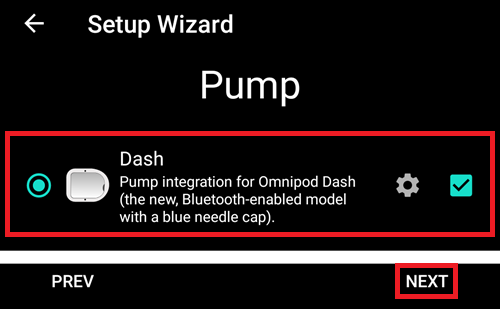

Dacă aveți dubii, puteți selecta "Pompa virtuală" și să selectați "DASH" mai târziu, după configurarea **AAPS** (vedeți Opțiunea 2).

(omnipod-dash-option-2-config-builder)=
### Opțiunea 2: Configurator

Pe o instalație existentă puteți selecta pompa **DASH** din Configurator:

În colțul din stânga sus **hamburger menu** selectați **Configurator (1)** ➜ **Pompă** ➜ **Dash** ➜ **Roată Zimțată de Setări (3)** prin selectarea butonului radio **(2)** intitulat **Dash**.

Selectarea **casetei de selectare (4)** aproape de **Roata zimțată de setări (3)** va permite meniului DASH să fie afișat ca o filă intitulată DASH în interfața **AAPS**. Bifarea acestei casete vă va facilita accesul la comenzile DASH atunci când utilizați **AAPS**.

**NOTĂ:** O modalitate mai rapidă de a accesa [**Setările Dash**](#omnipod-dash-settings) poate fi găsită mai jos în secțiunea Setări DASH a acestui document.

### Verificarea Selecției Driverului Omnipod

Pentru a verifica dacă ați selectat DASH în **AAPS**, dacă aveți **caseta bifată (4)**, **glisați în stânga** din fila **Vedere de ansamblu**, unde vei vedea acum o filă **DASH** în **AAPS**. În cazul în care această casetă este lăsată debifată, vei găsi fila DASH în meniul hamburger din stânga sus.

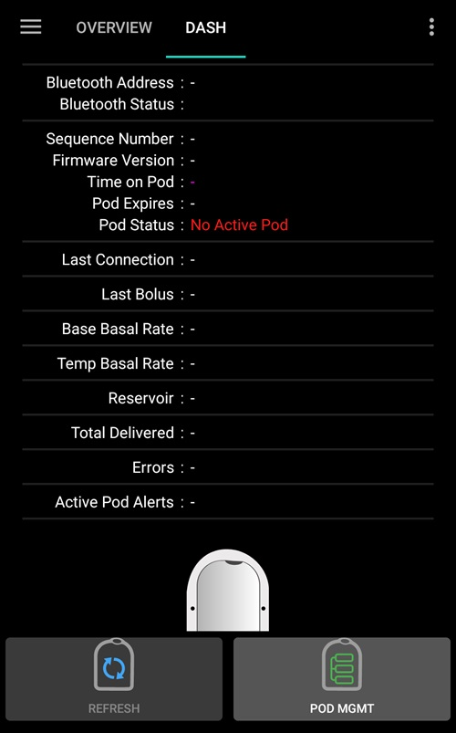

## Configurare Dash

**Glisați în stânga** la [**fila DASH**](#omnipod-dash-tab) unde veți putea să gestionați toate funcțiile pompei (unele dintre aceste funcții nu sunt activate sau vizibile fără o sesiune activă de pompă):

 'Reîmprospătare' conectivitatea pompă și stare, să puteți să reduceți la tăcere alarmele de pompa atunci când pompa emite semnale sonore

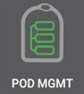   'Administrare Pompă' (Activare, dezactivare, redare semnal sonor de test și istorie pompă)

(omnipod-dash-activate-pod)=

### Activează pompă

1. Navigați la fila **DASH** și faceți clic pe butonul **Gestionare pompă (1)** și apoi apăsați pe **Activați pompă (2)**.

   

   

2. Ecranul **Umplere Pompă** este afișat. Umpleți un nouă pompă cu **cel puțin 80 unități** de insulină și ascultați două semnale sonore care indică faptul că pompa este gata de amorsare.

   ***NOTĂ:** La calcularea cantității totale de insulină de care aveți nevoie pentru 3 zile, vă rugăm să luați în considerare faptul că amorsarea pompei va utiliza aproximativ 3-10 unități.*

   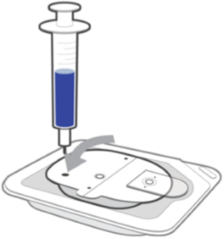

   

   Asigurați-vă că noua pompă și telefonul pe care rulează **AAPS** se află în imediata apropiere și apăsați pe butonul **Următorul**.

   ***NOTĂ**: dacă mesajul de eroare de mai jos apare _'Nu s-a putut găsi o pompă disponibilă pentru activare'_ (se poate întâmpla), nu intrați în panică. Apăsați pe butonul **Reîncercați**. În majoritatea situațiilor, activarea va continua cu succes.*

   

3. Pe ecranul **Inițializați pompa**, pompa va începe amorsarea (veți auzi un clic urmat de o serie de ticăituri pe parcursul amorsării pompei).  
   Un marcaj verde va fi afișat la amorsarea cu succes, iar butonul **Următorul** va fi activat. Apăsați pe butonul **Următorul** pentru a finaliza inițializarea de amorsare a pompei și pentru afișarea ecranului **Atașați Pompa**.

   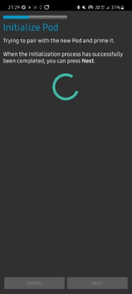    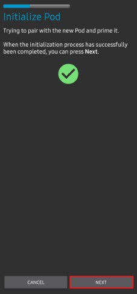

4. Apoi, pregătiți locul de infuzare pentru a fi gata să primească noua pompă. Spălați-vă pe mâini pentru a evita orice risc de infecție. Curățați locul de infuzie fie cu apă și săpun, fie cu un tampon cu alcool pentru a dezinfecta zona și lăsați aerul să usuce pielea complet înainte de a continua.   
   Dacă aveți iritații ale pielii de la adeziv, luați în considerare folosirea un șervețel (umed) pentru barieră cutanată sau un spray pentru barieră cutanată.

   Îndepărtați capacul de plastic al acului, de culoare albastră. Dacă vedeți ceva ce iese din pompă sau ceva care arată neobișnuit, **OPRIȚI** procesul și începeți cu o nouă pompă. Dacă totul arată **OK**, continuați să îndepărtați folia de protecție albă de pe adeziv și lipiți pompa pe locul selectat de pe corpul dumneavoastră.

   Când ați terminat, apăsați pe butonul **Următorul**.

   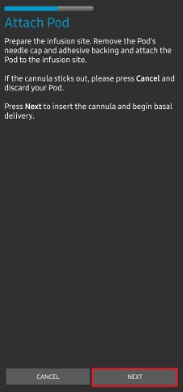

6. Caseta de dialog **Atașează Pompă** va apărea acum. **Apăsați pe butonul OK DOAR dacă sunteți pregătit să introduceți canula!**

   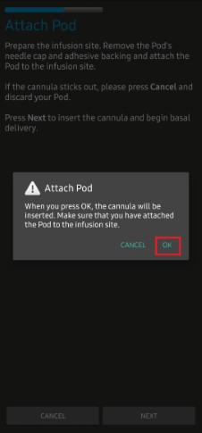

7. După ce apăsați **OK**, poate dura ceva timp până când DASH răspunde și introduce canula (maxim 1-2 minute). **Aveți răbdare**

   ***NOTĂ:** Înainte de inserarea canulei, este recomandat să prindeți pielea (între degete) lângă punctul de inserție al canulei. Acest lucru asigură o inserare lină a acului și va reduce riscul de apariție a ocluziilor.*

       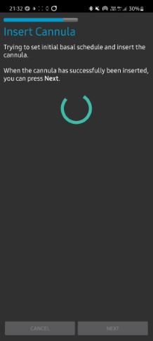

8. Un marcaj verde este afișat pe ecran, iar butonul **Următorul** devine disponibil după inserarea cu succes a canulei.   
   Apăsați pe butonul **Următorul**.

   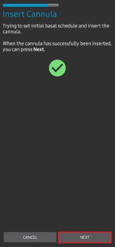

1. Ecranul **Pompă activată** este afișat.

   Apăsați pe butonul verde **Finalizare**.

   Felicitări! Tocmai ați început o nouă sesiune de pompă.

   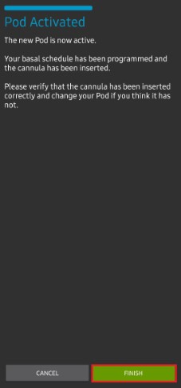

2. Meniul **Gestionare pompă** de pe ecran ar trebui să afișeze acum butonul **Activare pompă (1)** ca dezactivat și butonul ** Dezactivare pompă (2)** ca *activat*. Acest lucru se datorează faptului că o pompă este acum activă și nu puteți activa o pompă suplimentară fără a dezactiva mai întâi pompa activă.

    Apăsați pe butonul înapoi de pe telefonul dumneavoastră pentru a reveni la fila **DASH**, care va afișa acum informații despre pompă pentru sesiunea activă de pompă, inclusiv rata bazală curentă, nivelul rezervorului, insulina livrată, erorile pompei și alertele.

    ***NOTĂ:** Pentru mai multe detalii despre informațiile afișate, accesați [**Fila DASH**](#omnipod-dash-tab) a acestui document.*

   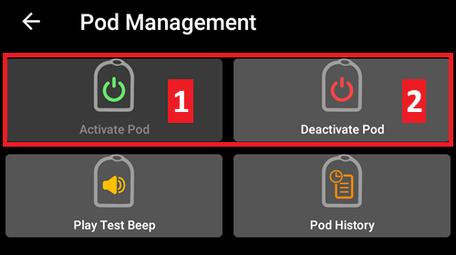

   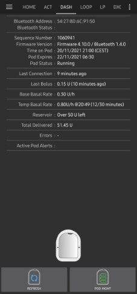

   ***NOTĂ:** Este recomandat să exportați setările DUPĂ activarea pompei. Setările trebuie exportate după fiecare schimbare de pompă și o dată pe lună, asigurați-vă că veți copia fișierul de setări exportat într-o locație de stocare în cloud (spre exemplu Google Drive) sau undeva în afara telefonului în cazul în care vă pierdeți telefonul (vedeți [**Export setări**](../Maintenance/ExportImportSettings.md)).*

(omnipod-dash-deactivate-pod)=

### Dezactivare pompă

În condiții normale, durata de viață preconizată a unei pompe este de trei zile (72 de ore) și de încă 8 ore după avertismentul privind expirarea pompei, pentru un total de 80 de ore de utilizare totală a pompei.

Pentru a dezactiva o pompă (fie de la expirare, fie de la o defecțiune de pompă):

1. Mergeți la fila **DASH**, faceți clic pe butonul **Gestionare pompă (1)**, iar pe ecranul **Gestionare pompă** click pe butonul **Dezactivează pompă (2)**.

   

   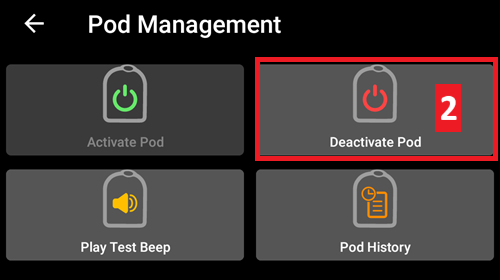

2. Pe ecranul **Dezactivați pompă**, faceți clic pe butonul **Următorul** pentru a începe procesul de dezactivare a pompei.

   Veți primi un semnal sonor de confirmare de la pompă că dezactivarea a reușit.

   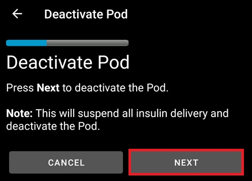

   

3. O bifă verde va fi afișată la dezactivarea cu succes. Faceți clic pe butonul **Următorul** pentru a afișa ecranul de pompă dezactivată.

   Acum puteți să dați jos pompa deoarece sesiunea activă a fost dezactivată.

   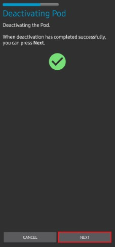

4. Faceți clic pe butonul verde pentru a reveni la ecranul **Gestionare pompă**.

   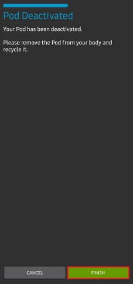

5. Acum sunteți în meniul **Gestionare pompă**, apăsați butonul înapoi de pe telefon pentru a reveni la fila **DASH**.

   Verifică dacă câmpul **Stare pompă** afișează un mesaj **Nicio pompă**.

   

   

(omnipod-dash-resuming-insulin-delivery)=

### Reluarea administrării de insulină

**NOTĂ**: În timpul **Comutării de profil**, ca atunci când se utiliza PDM, AAPS trebuie să suspende administrarea de pe pompă înainte de a seta noul **profil** bazal. În cazul în care comunicarea nu reușește între comenzile de suspendare și reluare, administrarea poate rămâne suspendată, Citește [**Administrare suspendată**](#omnipod-dash-delivery-suspended) în secțiunea ce ține de depanare pentru mai multe detalii.

Când administrarea insulinei este suspendată, va trebui să dați o comandă pentru a instrui pompa activă, suspendată în prezent, să reia administrarea de insulină. După procesarea cu succes a comenzii, insulina va relua administrarea normală folosind rata bazală curentă în funcție de timpul curent în baza **profilului** activ de bazală. Pompa va accepta din nou comenzi pentru bolus, **RBT**și **SMB**.

1. Mergeți la fila **DASH** și asigurați-vă că câmpul **Stare pompă (1)** afișează **SUSPENDAT**, apoi apăsați butonul **RELUAȚI LIVRAREA(2)** pentru a începe procesul de instruire a pompei curente pentru reluarea administrării normale de insulină. Un mesaj **RELUAȚI LIVRAREA** va fi afișat în câmpul **Stare pompă (3)**.

   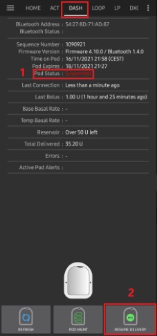   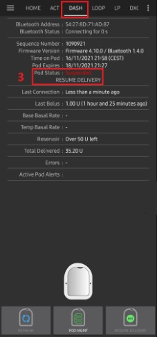

2. Atunci când comanda de reluare a administrării a avut succes, un dialog de confirmare va afișa mesajul **Administrarea insulinei a fost reluată**. Apăsați **OK** pentru a confirma și continua.

   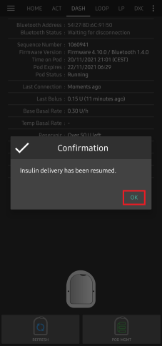

3. Fila **DASH** va actualiza câmpul **Stare pompă (1)** pentru a afișa **RULEAZĂ,** iar butonul **Reluați administrarea** nu va mai fi afișat

   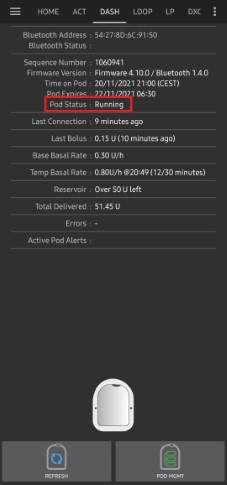

(omnipod-dash-silencing-pod-alerts)=

### Amuțirea alertelor de pompă

Procedura de mai jos vă va arăta cum să recunoașteți și să opriți semnalele sonore pompei atunci când timpul de utilizare al pompei active atinge limita de avertizare înainte de expirarea pompei la 72 de ore (3 zile). Acest termen de avertizare este definit în setarea de alerte Dash numită **Orele de dinainte de închidere**. Durata maximă de viață a unei pompe este de 80 de ore (3 zile 8 ore), cu toate acestea, Insulet recomandă să nu fie depășită limita de 72 de ore (3 zile).

***NOTĂ**: Butonul **AMUȚEȘTE ALERTELE(3)** este disponibil doar în fila **DASH** atunci când sunt declanșate alerta de expirare a pompei sau cea de rezervor scăzut. Dacă butonul **AMUȚEȘTE ALERTE** nu este vizibil și auziți semnale sonore din pompă, încercați să "Reîmprospătați starea pompei".*

1. Când este atinsă limita de timp definită **Ore înainte de închidere**, poma va emite semnale sonore de avertizare pentru a vă informa că se apropie de ora expirării și că va fi necesară o modificare a pompei în curând.  
   Puteți verifica acest lucru în fila **DASH**, câmpul **Pompa expiră: (1)** va arăta ora exactă la care pompa va expira (72 ore după activare), iar textul se va face **roșu** după ce a trecut acest timp.  
   Sub câmpul **Alerte active ale pompei (2)** mesajul **Pompa va expira în curând** este afișat. Acest lucru va declanșa, de asemenea, afișarea butonului **AMUȚIRE ALERTE(3)**.

   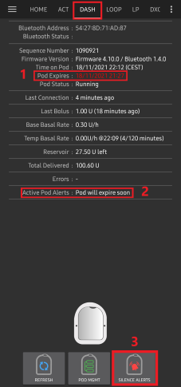

2. Mergeți la fila **DASH** și apăsați butonul **AMUȚEȘTE ALERTELE(2)**. **AAPS** trimite comanda către pompă pentru a dezactiva semnalele sonore de avertizare a expirării pompei și actualizează câmpul **Status pompă (1)** cu **CONFIRMAȚI ALERTELE**.

   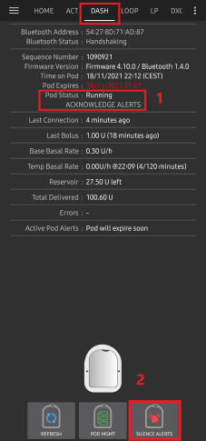

3. La **dezactivarea cu succes** a alertelor, **2 semnale de sonore** vor fi emise de către dispozitivul activ și un dialog de confirmare va afișa mesajul **Alertele active au fost dezactivate**. Apăsați pe butonul **OK** pentru a confirma și a închide dialogul.

   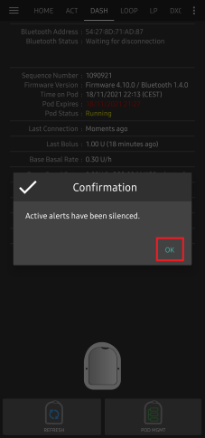

4. Mergeți la fila **DASH**. Sub câmpul **Alerte pompă activă**, mesajul de avertizare nu mai este afișat, iar pompa activă nu va mai emite semnale sonore legate de expirare.

(omnipod-dash-view-pod-history)=

### Vedeți istoricul pompei

Această secțiune explică modul de revizuire al istoricului pompei active și filtrarea după diferite categorii de acțiune. Instrumentul Istoric pompă vă permite să vizualizați acțiunile și rezultatele înregistrate pentru pompa dumneavoastră activă curent, pe parcursul celor trei zile (72 – 80 de ore) de viață ale acesteia.

Această funcție este utilă în verificarea bolusurilor, a RBT și a comenzilor bazale care au fost trimise către pompă. Restul categoriilor sunt utile pentru depanarea problemelor și pentru determinarea ordinii evenimentelor care au dus la o defecțiune.

***NOTĂ:** **Numai ultima comandă poate fi incertă**. Comenzile noi *nu vor fi trimise* până când comanda **nu va fi ultima 'incertă' devine 'confirmată' sau 'refuzată'**. Modul de a 'rezolva' comenzile incerte este de a **'reîmprospăta starea pompei'**.*

1. Mergeți la fila **DASH** și apăsați butonul **Gestionare pompă (1)** pentru a accesa meniul **Gestionare pompă** și apoi apăsați butonul **Istoric Pompă (2)** pentru a accesa ecranul istoricului de pompă.

     
   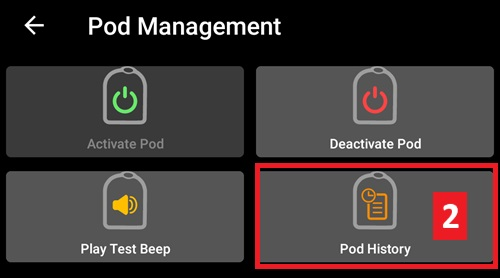

2. Pe ecranul **Istoric pompă**, categoria implicită **Toate (1)** este afișată, afișează **Data și ora (2)** ale tuturor **Acțiunilor (3)** și **Rezultate (4)** în ordine cronologică inversă. Folosește de **2 ori** butonul **de înapoi** al telefonului tău pentru a te întoarce la fila **DASH** din interfața principală <0>AAPS</0>.

   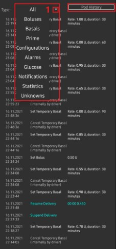 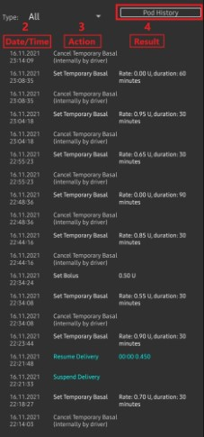

(omnipod-dash-tab)=

## Fila DASH

Mai jos este o explicație a aspectului și semnificației pictogramelor și a câmpurilor de stare din fila **DASH** din interfața principală AAPS.

***NOTĂ:** Dacă vreun mesaj din câmpurile de stare ale filei **DASH** raportează (incert), atunci va trebui să apăsați butonul Reîmprospătare pentru a șterge mesajul și a actualiza starea pompei.*

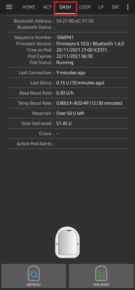

### Câmpuri

- **Adresa Bluetooth:** Afișați adresa curentă Bluetooth a pompei conectate.

- **Stare Bluetooth:**  Afișați starea curentă a conexiunii.

- **Număr secvență:** Afișați numărul secvenței al pompei active.

- **Versiunea firmware:** Afișați versiunea de firmware pentru conexiunea activă.

- **Timpul pe pompă:** Afișați ora curentă de pe pompă.

- **Stare pompă:** Afișați starea pompei.

- **Ultima conexiune:** Afișați timpul ultimei comunicări cu pompa.

  - *Adineauri* - mai puțin de 20 de secunde în urmă.

  - *Cu mai puțin de un minut în urmă* - mai mult de 20 de secunde, dar mai puțin de 60 de secunde în urmă.

  - *Acum 1 minut* - mai mult de 60 de secunde, dar mai puțin de 120 de secunde (2 minute)

  - *XX minute în urmă* - mai mult de 2 minute în urmă așa cum este definit de valoarea XX

- **Ultimul bolus:** Afișați cantitatea ultimului bolus trimis către pompa activă și cu cât timp în urmă a fost emis în paranteză.

- **Rată bazală de bază:** Afișați rata bazală programată pentru timpul curent din profilul ratei bazale.

- **Rata bazalei temporare:** Afișați rata bazală temporară care rulează în prezent în următorul format
  - {Unități pe oră} @{timp de început RBT} ({minute rulate}/{total minute în care va fi rulat RBT})

  - Exemplu: * 0,00U/h @18:25 ( 90/120 minute)

- **Rezervor:** Afișați peste 50+U rămase atunci când mai mult de 50 de unități au rămas în rezervor. Sub 50 U, unitățile exacte sunt afișate.

- **Total livrat:** Afișați numărul total de unități de insulină livrate din rezervor. Acestea includ insulina utilizată pentru activare și amorsare.

- **Eroare:** Afișați ultima eroare întâlnită. Revizuiți [Istoricul de pompă](#omnipod-dash-view-pod-history) și fișierele de jurnal pentru erorile anterioare și informații mai detaliate.

- **Alerte active de pompă:** Rezervat pentru rularea alertelor pe pompa activă.

### Butoane

 Trimite comanda de reîmprospătare la pompa activă pentru a actualiza comunicarea.

  - *Folosiți pentru a reîmprospăta starea pompei și a închide câmpurile de stare care conțin textul (incert).*

  - *Vedeți secțiunea [Depanare](#omnipod-dash-troubleshooting) de mai jos pentru informații suplimentare.*

   Navigare la meniul de gestionare pompă.

 Când este apăsat acesta va dezactiva alertele sonore ale pompei și notificările (expirare, rezervor scăzut..).

  - *Butonul este afișat numai atunci când timpul pompei e trecut de timpul de avertizare al expirării.*
  -  *După închiderea cu succes, această pictogramă nu va mai apărea.*

    Reluați livrarea administrării curente de insulină în pompa activă.

### Meniu Gestionare Pompă

Mai jos este descris scopul fiecărei pictograme din meniul **Gestionare pompă**, accesat prin apăsarea butonului **Gestionare pompă (1)** din fila **DASH**.

**Tabelul de mai jos descrie fiecare buton și funcția sa:**

| Buton | Funcție                                                                                                 |
| ----- | ------------------------------------------------------------------------------------------------------- |
| 1     | Accesați setările Gestionare pompă                                                                      |
| 2     | [**Activați pompa**](#omnipod-dash-activate-pod): Amorsează și activează o nouă pompă.                  |
| 3     | [**Dezactivați pompa**](#omnipod-dash-deactivate-pod): Dezactivează pompa activă în prezent.            |
| 4     | **Redați semnal sonor** : Redă un singur semnal sonor de test pe pompă atunci când este apăsat.         |
| 5     | [**Istoricul de pompă**](#omnipod-dash-view-pod-history) : Afișați istoricul activității pompei active. |

(omnipod-dash-settings)=

## Setări Dash

Setările driverului Dash sunt configurabile din colțul stânga-sus **meniul hamburger** sub **Constructorul de configurație (1)** ➜ **Pompă** **Dash** ➜ **Rotița de setări (3) ** prin selectarea **butonului radio (2)** denumit **Dash**. Bifarea **casetei de selecție (4)** aproape de **Roata zimțată de setări (3)** va permite meniului DASH să fie afișat ca o filă intitulată DASH în interfața **AAPS**.

***NOTĂ:** O modalitate mai rapidă de a accesa setările **Dash** este accesând meniul **3 puncte (1)** în colțul din dreapta sus al filei **DASH** și selectând **preferințe Dash(2)** din meniul derulant.*

Grupurile de setări sunt listate mai jos; puteți activa sau dezactiva printr-un comutator pentru majoritatea intrărilor descrise mai jos:

***NOTĂ:** Un asterisc (\*) denotă că setarea implicită este activată.*

### Semnale sonore de confirmare

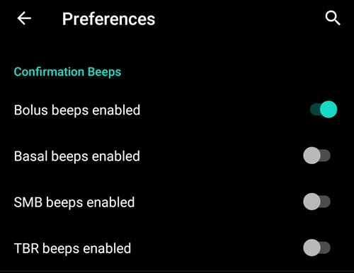

Furnizează semnale acustice de confirmare de la pompă pentru administrarea și modificările de bolus, insulină bazală, SMB și TBR.

**Semnale sonore activate pentru bolusuri:** Activați sau dezactivați semnalele sonore de confirmare atunci când un bolus este administrat.

**Semnale sonore activate pentru bazale** Activați sau dezactivați semnalele sonore de confirmare atunci când o nouă rată bazală este setată, rata bazală activă este anulată sau rata bazală curentă este schimbată.

**Semnale sonore SMB:** Activați sau dezactivați semnalele sonore de confirmare atunci când un SMB este administrat.

**Semnale sonore RBT:**  Activați sau dezactivați mesajele de confirmare atunci când o RBT este setată sau anulată.

### Alerte

Furnizează alerte **AAPS** în ceea ce privește expirarea pompei, închiderii, rezervorului scăzut în baza unităților prag definite.

***NOTĂ:** o notificare AAPS va fi ÎNTOTDEAUNA emisă pentru orice alertă după comunicarea inițială cu pompa de când a fost declanșată alerta. Închiderea notificării NU va anula alerta DECÂT dacă opțiunea de recunoaștere automată a alertelor de pompă este activată. Pentru a închide MANUAL alerta trebuie să vizitați fila **DASH** și să apăsați butonul **Reducere la tăcere a alertelor**.*

**Memento expirare activat:** Activați sau dezactivați mementoul de expirare a al pompei, setat să se declanșeze atunci când este atins numărul de ore definit, înainte de oprirea acesteia.

**Ore înainte de închidere:**  Definiți numărul de ore înainte ca pompa activă să se închidă, ceea ce va declanșa apoi alerta de expirare.

**Alertă de rezervor scăzut activată:** Activați sau dezactivați  o alertă atunci când se atinge limita joasă a rezervorului rămase în pompă, așa cum a fost definit în câmpul Număr de unități.

**Numărul de unități:** Numărul de unități la care să fie declanșată alerta rezervor scăzut al pompei.

### Notificări

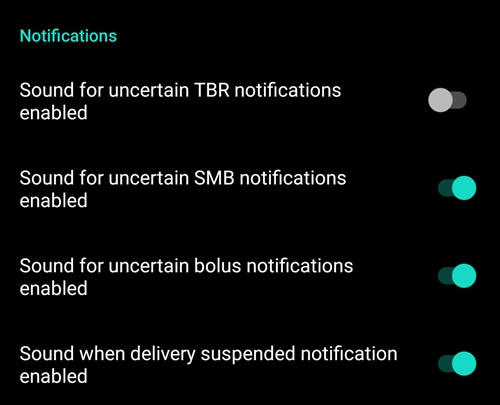

Secțiunea Notificări permite utilizatorului să își selecteze notificările preferate și alertele sonore atunci când AAPS nu este sigur de starea RBT, SMB, sau a bolusurilor, și când evenimentele de suspendare a administrării au avut succes.

***NOTĂ:** Acestea sunt doar notificări, nu sunt create alerte sonore.*

**Sunet pentru notificări RBT incerte activat:** Activați sau dezactivați această setare pentru a declanșa o alertă sonoră și o notificare vizuală atunci când **AAPS** nu este sigur dacă un RBT a fost setat cu succes.

**Sunet pentru notificări SMB incerte activat:** Activați sau dezactivați această setare pentru a declanșa o alertă sonoră și o notificare vizuală atunci când **AAPS** nu este sigur dacă un SMB a fost administrat cu succes.

**Sunet pentru notificări de bolus incert activat:** Activați sau dezactivați această setare pentru a declanșa o alertă sonoră și o notificare vizuală atunci când **AAPS** nu este sigur dacă un bolus a fost administrat cu succes.

**Sunet pentru notificările de suspendare a livrării activat:** Activați sau dezactivați această setare pentru a declanșa o alertă sonoră și o notificare vizuală atunci când comanda de suspendare a administrării a fost executată cu succes.

## Fila Acțiuni (ACT)

Această filă este bine documentată în documentația principală **AAPS**, dar există câteva elemente în această filă care sunt specifice modului în care DASH diferă de pompele bazate pe fir, mai ales după aplicarea unei noi pompe.

1. Mergeți la fila **Acțiuni (ACT)** din interfața principală **AAPS**.

2. În secțiunea **Careportal (1)** câmpurile **Insulină** și **Canula** vor avea **vechimea resetată** la 0 zile și 0 ore **după fiecare schimbare de pompă**. Asta se face datorită modului în care pompa Omnipod este construită și funcționează. Deoarece pompa inserează canula direct în piele la locul aplicării pompei, un fir obișnuit nu este utilizată în pompele Omnipod. *Prin urmare, după schimbarea pompei vechimea fiecăreia dintre aceste valori se va reseta automat la zero.* **Vechimea bateriei pompei** nu este raportată deoarece bateria din pompă va fi întotdeauna mai mare decât durata de viață a pompei (maxim 80 de ore). **Bateria pompei** și **rezervorul de insulină** sunt integrate înăuntrul fiecărei pompe.

   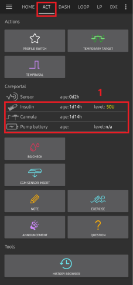

### Nivel

**Nivelul insulinei**

Nivelul insulinei afișat este cantitatea raportată de DASH. Cu toate acestea, pompa raportează nivelul real al rezervorului de insulină numai atunci când acesta este sub 50 de unități. Până atunci va fi afișat "Peste 50 de unități". Cantitatea raportată nu este exactă: când pompa raportează "gol" în majoritatea cazurilor, rezervorul va mai avea încă câteva unități suplimentare de insulină.

Fila vedere de ansamblu DASH va afișa după cum este descris mai jos:

  * **Peste 50 de unități** - Pompa raportează peste 50 de unități în prezent în rezervor.
  * **Sub 50 de unități** - cantitatea de insulină rămasă în rezervor, așa cum este raportată de către pompă.

Notă suplimentară:
  * **SMS** - Returnează valoarea sau 50+U pentru răspunsuri SMS
  * **Nightscout** - Încarcă în Nightscout valoarea de 50 atunci când sunt peste 50 de unități (versiunea 14.07 și mai vechi).  Versiunile mai noi vor raporta o valoare de 50+ atunci când depășesc 50 de unități.

(omnipod-dash-troubleshooting)=

## Depanare

(omnipod-dash-delivery-suspended)=

Prezenta secțiune se referă la problemele comune cunoscute și la soluțiile pentru utilizarea Omnipod DASH împreună cu AAPS. Există, de asemenea, secțiunea [Depanare generală](../GettingHelp/GeneralTroubleshooting.md) în documentație care ar trebui să fie reluată deoarece acoperă subiecte relevante și pentru unele probleme specifice pompei Omnipod.

---

(omnipod-dash-bluetooth-related-issues)=

## **Probleme legate de Bluetooth**

Pentru probleme cunoscute cu conexiunile Bluetooth, întreruperile pompei, activarea și problemele de conexiune [Depanarea Bluetooth](../GettingHelp/BluetoothTroubleshooting.md)

---
### Administrarea insulinei suspendată

  - Nu mai există niciun buton de suspendare. Dacă doriți să "suspendați" pompa, puteți seta o **RBT** zero pentru x minute.
  - În timpul **Comutării de profil**, DASH trebuie să suspende administrarea înainte de a seta noul **profil** bazal. Dacă comunicarea nu reușește între cele două comenzi, atunci administrarea poate rămâne suspendată. Când se întâmplă acest lucru:
     - Nu va fi nicio administrare a insulinei, nici bazală, SMB, bolusare manuală șamd.
     - Este posibil să existe notificări că una dintre comenzi este neconfirmată: acest lucru depinde de când a avut loc eșecul.
     - **AAPS** va încerca să seteze noul profil bazal la fiecare 15 minute.
     - **AAPS** va afișa o notificare care va informa că administrarea este suspendată la fiecare 15 minute, dacă administrarea este încă suspendată (reluarea administrării a eșuat).
     - Butonul [**Reluați administrarea**](#omnipod-dash-resuming-insulin-delivery) va fi activ dacă utilizatorul alege să reia administrarea manual.
     - Dacă **AAPS** nu reia singur administrarea (acest lucru se întâmplă dacă pompa nu este accesibilă, sunetul este dezactivat, șamd), pompa va începe să emită semnale sonore de 4 ori pe minut timp de 3 minute; se repetă la fiecare 15 minute, dacă administrarea este încă suspendată timp de peste 20 de minute.
  - Pentru comenzile neconfirmate, "Reîmprospătare stare pompă" ar trebui să le confirme/infirme.

*****NOTĂ:** Când auziți semnale sonore de la pompă, nu presupuneți că administrarea va continua fără a verifica telefonul, administrarea poate rămâne suspendată, ***așa că trebuie să verificați!******

---
### Eșecuri pompă

- Ocazional, apare un eșec din cauza unei varietăți de probleme, inclusiv a problemelor de hardware cu pompa în sine.
- Este recomandat să nu deschideți tichete de suport sau cereri de înlocuire la Insulet, deoarece AAPS nu este o metodă de utilizare aprobată pentru pompe.
- O listă a codurilor de defecțiuni poate fi [**găsită aici**](https://github.com/openaps/openomni/wiki/Fault-event-codes) pentru a ajuta la determinarea cauzei.

---
### Prevenirea erorii 49 de pompă

Acest eșec este legat de o stare incorectă a pompei pentru o comandă sau o eroare în timpul unei comenzi de administrare a insulinei. Asta se întâmplă atunci când driverul și pompa sunt în dezacord cu starea de fapt. Pompa (datorită unei măsuri de siguranță integrate) reacționează apoi cu un cod de eroare nevalorificabil 49 (0x31) care se termină cu ceea ce se știe ca un "sunet țipător": sunetul lung și iritant care poate fi oprit doar prin perforarea unei găuri la locul potrivit în spatele pompei. Originea exactă a "defecțiunii 49 a pompei" este adesea greu de identificat. În situații care sunt suspectate de această defecțiune (de exemplu, la închiderile din senin ale aplicației, rularea unei versiuni de dezvoltare sau reinstalare).

---

### Alerte de pompă inaccesibilă

Atunci când nu poate fi stabilită nicio comunicare cu pompa pentru o perioadă preconfigurată de timp o alertă de tip "pompă inaccesibilă" va fi emisă. Alertele de pompă inaccesibilă pot fi configurate mergând în meniul cu trei puncte din dreapta sus, selectând **Preferințe** ➜ **Alerte Locale** ➜**Prag pompă inaccesibilă [min]**. Valoarea recomandată este alertarea după **120** minute.

---
### Exportați setările

Prin exportarea setărilor **AAPS** vă permite să restabiliți toate setările și, poate mai important, toate obiectivele dumneavoastră. Este posibil să fie necesară restabilirea setărilor la "ultima configurație funcțională cunoscută" fie după dezinstalarea/reinstalarea **AAPS**, fie în cazul pierderii telefonului și reinstalării aplicației pe un dispozitiv nou.

***NOTĂ:** Informațiile pompei active sunt incluse în setările exportate. Dacă importați un fișier "vechi" exportat, pompa dumneavoastră reală va "muri". Nu există nicio altă alternativă. În unele cazuri (cum ar fi o schimbare de telefon _programată_), s-ar putea să fie necesar să utilizați fișierul exportat pentru a restaura setările **AAPS păstrând în același timp pompa activă curent**. În acest caz, este important să se utilizeze doar fișierul de setări recent exportat care conține în prezent pompa activă.*

**Este o bună practică să faci un export imediat după activarea unei pompe**. În acest fel veți putea întotdeauna să restabiliți pompa activă curent în cazul unei probleme. De exemplu, la mutarea pe un alt telefon de rezervă.

Copiați în mod regulat setările exportate (preferabil după fiecare exportare) într-un loc sigur (un disc în cloud, spre exemplu Google Drive) care este accesibil de pe orice telefon atunci când este nevoie. Acest lucru vă permite să restaurați de pe orice telefon de oriunde în cazul unei pierderi de telefon sau a unei resetări din fabrică a telefonului în timp ce nu sunteți acasă.

---
### Importați setările

**ATENȚIE**: Vă rugăm să rețineți că este posibil ca setările de import să importe o stare a pompei învechită (în funcție de momentul în care ați făcut ultimul export/backup).  
Ca rezultat, există un **risc de a pierde pompa activă!** (a se vedea **Setările de export**).
1. Încercați o importare doar atunci când nu sunt disponibile alte opțiuni.
2. Atunci când importați setări cu o pompă activă, asigurați-vă că exportarea a fost făcut cu pompa activă curent.

**Importarea în timp ce sunteți pe o pompă activă:** (riscați să pierdeți pompa!)

1. **Asigurați-vă că importați setări care au fost exportate recent cu pompa activă în prezent!**
2. Importați-vă setările.
3. Verificați toate preferințele.

**Importare (nicio sesiune de pompă activă)**

1. Importarea oricărui export recent ar trebui să funcționeze (vedeți mai sus)
2. Importați-vă setările.
3. Verificați toate preferințele.
4. Este posibil să fie nevoie să **Dezactivați** pompa "inexistentă" dacă setările importate includ datele vreunei pompe active.

---
### Importă setările care conțin starea pompei de la o pompă inactivă

Atunci când se importă setări care conțin date pentru o pompă care nu mai este activă, AAPS va încerca să se conecteze cu ea, ceea ce în mod evident va eșua. Nu poți activa o nouă pompă în această situație.

Pentru a elimina vechea sesiune de pompă:
1. "Încercați" pentru a dezactiva pompa. Dezactivarea va eșua, cel mai probabil.
2. Selectați "Reîncercați".
3. După cea de-a doua și ce de-a treia reîncercare veți primi opțiunea de a elimina pompa.
4. Odată ce vechea pompă este eliminată, veți putea activa o nouă pompă.

### Eroare generică: java.lan.illegalStateException: Se încearcă setarea unei adrese Bluetooth la ***, dar este deja setată la ***.

Dacă primiți această eroare atunci când încercați să inițializați o pompă nouă **AAPS** eșuează deoarece încă mai are setările pentru o pompă veche stocate în configurație.

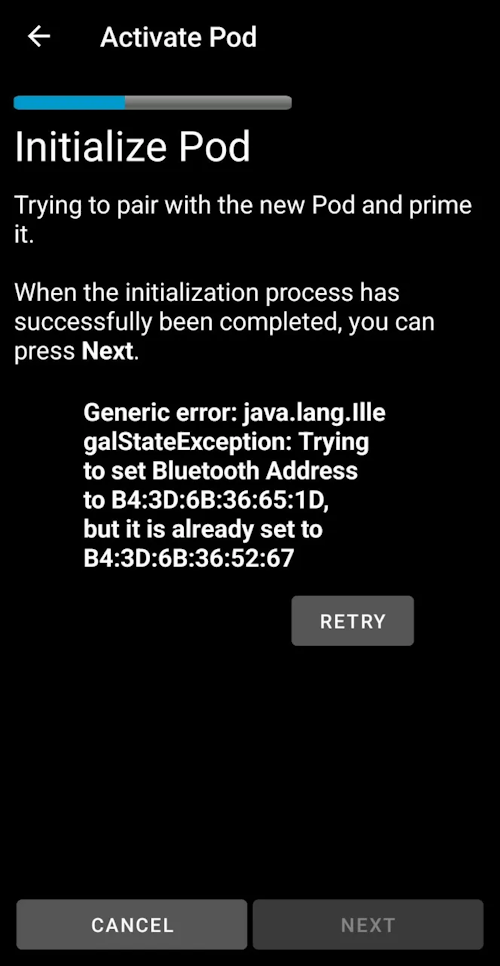

Acest lucru se poate întâmpla dacă restaurați dintr-o copie de rezervă sau dacă dezactivarea pompei eșuează.

Pentru a rezolva apăsați pe `REÎNCERCAȚI` până când opțiunea `Renunțați` este afișată, apoi renunțați. Această procedură ar trebui să funcționeze și pentru dezactivarea unei pompe.

Acum ar trebui să puteți activa o pompă nouă.

---
### Reinstalarea AAPS

La dezinstalarea **AAPS** veți pierde toate setările, obiectivele și sesiunea de pompă curentă. **Pentru a le restaura asigurați-vă că aveți disponibil un fișier de setări exportate recent!**

Dacă aveți o pompă activă, asigurați-vă că aveți un export pentru sesiunea de pompă curentă altfel veți pierde pompa activă la importarea setărilor mai vechi.

1. Exportă setările și stochează o copie într-un loc sigur (de exemplu Google Drive).
2. Dezinstalați **AAPS** și reporniți telefonul.
3. Instalați noua versiune de **AAPS**.
4. Importați-vă setările.
5. Verificați toate preferințele (opțional importați din nou setările).
6. Activați un nouă pompă.
7. Când s-a terminat: Exportați setările curente.

---
### Actualizarea AAPS la o versiune mai nouă

În cele mai multe cazuri nu este necesară dezinstalarea. Puteți instala "în loc" prin pornirea instalării pentru noua versiune. Acest lucru este posibil chiar și atunci când există o sesiune activă de pompă.

1. Exportați setările.
2. Instalați noua versiune **AAPS**.
3. Verificați că instalarea a reușit
4. Repornește pompa sau activează o pompă nouă.
5. Când s-a terminat: Exportați setările curente.

---
### Alerte driver Omnipod

Driverul Omnipod Dash prezintă o varietate de alerte unice în **fila Vedere de ansamblu**, cele mai multe dintre acestea sunt informative și pot fi respinse, în timp ce unele dintre ele furnizează utilizatorului o acțiune care necesită contribuția sa pentru a rezolva cauza alertei declanșate.

Un rezumat al principalelor alerte pe care este posibil să le întâlniți este prezentat mai jos:

- No active Pod session detected. Această alertă poate fi dezactivată temporar prin apăsarea **AMÂNAȚI** dar va continua să se declanșeze atâta timp cât o nouă pompă nu a fost activată. Once activated this alert is automatically silenced.
- Pompă suspendată Alertă informațională că pompa a fost suspendată.
- Setarea bazalei în **Profil** a eșuat: Administrarea ar putea fi suspendată! Reîmprospătați manual starea pompei din fila Omnipod și reluați livrarea, dacă este necesar. Alertă informativă că setarea bazalei din pompă în **Profil** a eșuat și va trebui să apăsați *Reîmprospătați* pe fila Omnipod.
- Nu s-a putut verifica dacă bolusul **SMB** a avut loc cu succes. If you are sure that the Bolus didn't succeed, you should manually delete the SMB entry from Treatments. Alertă că comanda **SMB** nu a putut fi verificată cu succes, va trebui să verificați câmpul *Ultimul bolus* din fila DASH pentru a vedea dacă bolusul **SMB** a reușit și dacă nu eliminați intrarea din fila Tratamente.
- Nu este sigur dacă "sarcina bolus/RBT/SMB" s-a finalizat; vă rugăm verificați manual dacă a avut succes.

(omnipod-dash-where-to-get-help-for-dash)=

## Unde să obțineți ajutor pentru DASH

Toată activitatea de dezvoltare pentru DASH este făcută de comunitate pe o bază **voluntară**; vă rugăm să rețineți acest lucru și să utilizați următoarele instrucțiuni înainte de a solicita asistență:

-  **Nivelul 0:** Citiți secțiunea relevantă a acestei documentații pentru a vă asigura că înțelegeți cum ar trebui să meargă funcționalitatea cu care aveți dificultăți.
-  **Nivelul 1:** Dacă încă întâmpinați probleme pe care nu le puteți rezolva prin intermediul acestui document, apoi vă rugăm să mergeți la canalul *#AAPS* pe **Discord** folosind [acest link de invitație](https://discord.gg/4fQUWHZ4Mw). Există, de asemenea, numeroase grupuri de Facebook și alte grupuri pe care le puteți întreba de asemenea (vedeți [**Obținerea Ajutorului**](../GettingHelp/WhereCanIGetHelp.md))
-  **Nivelul 2:** Căutați problemele existente pentru a vedea dacă problema a fost deja raportată la [Probleme](https://github.com/nightscout/AndroidAPS/issues) dacă există, vă rugăm să confirmați/comentați/adăugați informații despre problema dumneavoastră. If not, please create a [new issue](https://github.com/nightscout/AndroidAPS/issues) and attach [your log files](../GettingHelp/AccessingLogFiles.md).
-  **Fiți răbdători - majoritatea membrilor comunității noastre sunt voluntari bine-voitori, și rezolvarea problemelor necesită adesea timp și răbdare atât din partea utilizatorilor cât și din partea dezvoltatorilor.**

Atunci când solicitați ajutor veniți pregătit cu următoarele informații pentru a-i ajuta pe cei din comunitate cu întrebările și problemele dumneavoastră specifice:
- Marca și modelul telefonului Android
- Versiunea Android OS (de exemplu 15 sau 16)
  - Ați actualizat recent versiunea Android OS?
- Versiunea **AAPS** pe care o utilizați
- Descriere simplă în limba engleză a problemei cu care vă confruntați luând în considerare câteva dintre următoarele lucruri
   - A funcționat până acum?
   - Când a funcționat sau nu a funcționat?
   - Ați făcut vreo modificare în configurație sau în setările de profil?
   - Ați asociat un nou dispozitiv Bluetooth?
   - Ați actualizat sau instalat o aplicație nouă?
   - Cât de mult a funcționat înainte să înceteze să funcționeze?
