# Documentație pentru driverul AAPS al pompei de insulină Omnipod

Aceste instrucțiuni sunt pentru configurarea pompei Omnipod Eros (**NU Omnipod Dash**). Driverul Omnipod este disponibil ca parte a AAPS (AAPS) începând cu versiunea 2.8.

**Această aplicație face parte dintr-o soluție DIY (do-it-yourself/ o aplicație pe care o construiți singur) și nu este un produs finit; și necesită ca dumneavoastră să citiți, să învățați și să înțelegeți sistemul, de la construcție pana la modul de utilizare. You alone are responsible for what you do with it.**

```{contents}
:backlinks: entry
:depth: 2
```

## Cerințe hardware și software

- **Dispozitiv de comunicare cu pompa**

> Componenta care face puntea de comunicarea de la telefonul cu AAPS activat către generația de pompe Eros.
> 
> > - 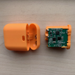  [Website OrangeLink](https://getrileylink.org/product/orangelink)
> > -  [433MHz RileyLink](https://getrileylink.org/product/rileylink433)
> > - 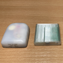  [Site Emalink](https://github.com/sks01/EmaLink) - [Informații de contact](mailto:getemalink@gmail.com)
> > -   DiaLink - [Informații de contact](mailto:Boshetyn@ukr.net)
> > - 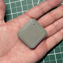  [SiteLoopLink](https://www.getlooplink.org/) - [Informații de contact](https://jameswedding.substack.com/) - Netestat

-   **Telefon mobil**

> Componenta care va opera AAPS și va trimite comenzi de control către dispozitivul de comunicare cu pompa.
> 
> > - [Un telefon Android cu driver Omnipod](#Phones-list-of-tested-phones) acceptat cu o versiunea AAPS 2.8 și elementele conexe configurate.

- 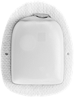  **Dispozitiv de administrare insulină**

> Componenta care va interpreta comenzile primite de la dispozitivul de comunicare cu pompa care provine de la telefonul ce rulează AAPS.
> 
> > - O nouă pompă Omnipod (generația Eros - **NU DASH**)

Aceste instrucțiuni vor presupune că porniți o nouă sesiune de pompă; în caz contrar, vă rugăm să aveți răbdare și să încercați să începeți acest proces la următoarea schimbare de pompă.

## Înainte să începeți

**SIGURANȚA MAI ÎNTÂI** - nu încercați acest proces într-un mediu în care nu vă puteți reveni după o eroare (pompe suplimentare, insulină, RileyLink încărcat și dispozitive de telefonie mobilă sunt obligatorii).

**Telecomanda dumneavoastră Omnipod nu va mai funcționa după ce driverul AAPS pentru Omnipod activează pompa**. Anterior, ați folosit telecomanda Omnipod pentru a trimite comenzi la pompa Omnipod Eros. O pompă Omnipod Eros permite unui singur dispozitiv să comunice cu ea. Dispozitivul care activează cu succes pompa este singurul dispozitiv care are permisiunea de a comunica cu ea de atunci încolo. Aceasta înseamnă că odată ce activați o pompă Omnipod Eros cu RileyLink prin intermediul driverului AAPS pentru Omnipod, **nu veți mai putea folosi telecomanda cu pompa**. Driverul AAPS Omnipod cu RileyLink este acum telecomanda dumneavoastră în vigoare. *This does NOT mean you should throw away your PDM, it is recommended to keep it around as a backup, and for emergencies with AAPS is not working correctly.*

**You can configure multiple RileyLinks, but only one selected RileyLink at a time can communicate with a pod.** The AAPS Omnipod driver supports the ability to add multiple RileyLinks in the RileyLink configuration, however, only one RileyLink at a time can be selected to be used for sending and receiving communication.

**Your pod will not shut off when the RileyLink is out of range.** When your RileyLink is out of range or the signal is blocked from communicating with the active pod, your pod will continue to deliver basal insulin. Upon activating a pod, the basal profile defined in AAPS will be programmed into the new pod. Should you lose contact with the pod, it will revert to this basal profile. You will not be able to issue new commands until the RileyLink comes back in range and re-establishes the connection.

**30 min Basal Rate Profiles are NOT supported in AAPS.** If you are new to AAPS and are setting up your basal rate profile for the first time please be aware that basal rates starting on a half hour are not supported and you will need to adjust your basal rate profile to start on the hour. For example, if you have a basal rate of say 1.1 units which starts at 09:30 and has a duration of 2 hours ending at 11:30, this will not work.  You will need to update this 1.1 unit basal rate to a time range of either 9:00-11:00 or 10:00-12:00.  Even though the 30 min basal rate profile increments are supported by the Omnipod hardware itself, AAPS is not able to take them into account with its algorithms currently.

## Enabling the Omnipod Driver in AAPS

You can enable the Omnipod driver in AAPS in **two ways**:

### Option 1: The Setup Wizard

After installing a new version of AAPS, the **Setup Wizard** will start automatically.  This will also occur during in place upgrades.  If you already have exported your settings from a previous installation you can exit the Setup Wizard and import your old settings.  For new installations proceed below.

Via the **AAPS Setup Wizard (2)** located at the top right-hand corner **three-dot menu (1)** and proceeding through the wizard menus until you arrive at the **Pump** screen. Then select the **Omnipod radio button (3)** .

> 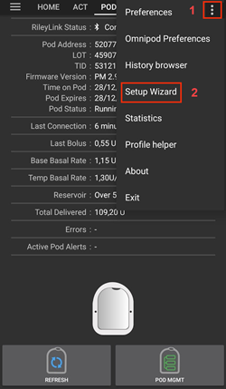  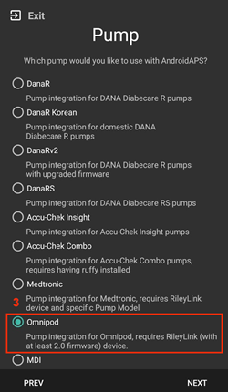

On the same screen, below the pump selection, the **Omnipod Driver Settings** are displayed, under the **RileyLink Configuration** add your RileyLink device by pressing the **Not Set** text.

On the **RileyLink Selection** screen press the **Scan** button and select your RileyLink by scanning for all available Bluetooth devices and selecting your RileyLink from the list. When properly selected you are returned to the pump driver selection screen displaying the Omnipod driver settings showing your selected RileyLink with the MAC address listed.

Press the **Next** button to proceed with the rest of the **Setup Wizard.**  It can take up to one minute for the selected RileyLink to initialize and the **Next** button to become active.

Detailed steps on how to setup your pod communication device are listed below in the [RileyLink Setup Section](#OmnipodEros-rileylink-setup).

**OR**

### Opțiunea 2: Configurator

Via the top-left hand corner **hamburger menu** under **Config Builder (1)** ➜**Pump**➜**Omnipod** by selecting the **radio button (2)** titled **Omnipod**. Selecting the **checkbox (4)** next to the **Settings Gear (3)** will display the Omnipod menu as a tab in the AAPS interface titled **POD**. This is referred to in this documentation as the **Omnipod (POD)** tab.

> **NOTE:** A faster way to access the **Omnipod settings** can be found below in the [Omnipod Settings section](#OmnipodEros-omnipod-settings) of this document.
> 
> 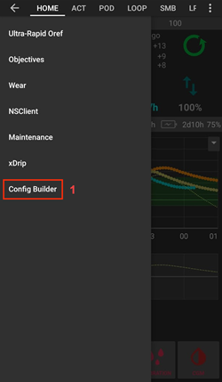 

### Verificarea Selecției Driverului Omnipod

*Note: If you have exited the Setup Wizard early without selecting your RileyLink, the Omnipod Driver is enabled but you will still need to select your RileyLink.  You may see the Omnipod (POD) tab appear as it does below*

To verify that you have enabled the Omnipod driver in AAPS **swipe to the left** from the **Overview** tab, where you will now see an **Omnipod** or **POD** tab.

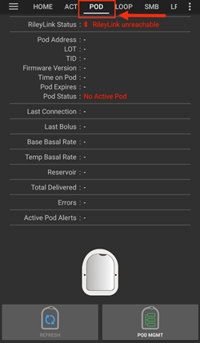

## Omnipod Configuration

Please **swipe left** to the **Omnipod (POD)** tab where you will be able to manage all pod and RileyLink functions (some of these functions are not enabled or visible without an active pod session):

>  Refresh Pod connectivity and status
> 
> 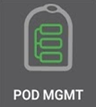 Pod Management (Activate, Deactivate, Play test beep, RileyLink Stats and Pod history)

(OmnipodEros-rileylink-setup)=

### RileyLink Setup

If you already successfully paired your RileyLink in the Setup Wizard or steps above, then proceed to the [Activating a Pod Section](#OmnipodEros-activating-a-pod) below.

*Note: A good visual indicator that the RileyLink is not connected is that the Insulin and Calculator buttons on the HOME tab will be missing. This will also occur for about the first 30 seconds after AAPS starts, as it is actively connecting to the RileyLink.*

1. Ensure that your RileyLink is fully charged and powered on.

2. After selecting the Omnipod driver, identify and select your RileyLink from **Config Builder (1)** ➜**Pump**➜**Omnipod**➜**Gear Icon (Settings) (2)** ➜**RileyLink Configuration (3)** by pressing the **Not Set** or **MAC Address (if present)** text.

   > Ensure your RileyLink battery is charged and it is [positioned in close proximity](#OmnipodEros-optimal-omnipod-and-rileylink-positioning) (~30 cm away or less) to your phone for AAPS to identify it by its MAC address. Odată selectat, puteți continua pentru a activa prima sesiune de pompă. Utilizați butonul înapoi de pe telefon pentru a reveni la interfața principală AAPS.
   > 
   > 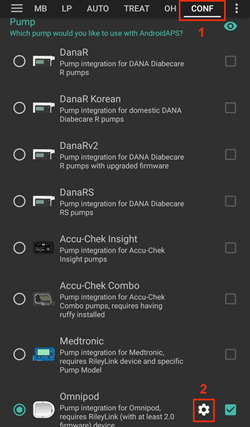 

3. În ecranul de **selecție a dispozitivului RileyLink** apăsați pe butonul **Scanare (4)** pentru a iniția o scanare Bluetooth. **Alegeți dispozitivul dumneavoastră RileyLink (5)** din lista de dispozitive Bluetooth disponibile.

   >  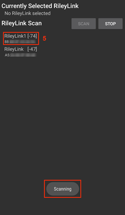

4. După selectarea cu succes veți fi redirecționat la pagina Setări Omnipod unde este afișată **adresa MAC a dispozitivului RileyLink selectat curent (6).**

   > 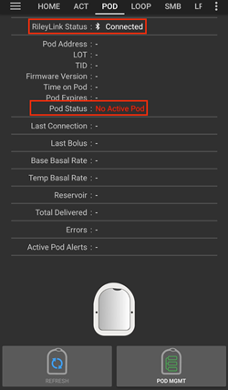

5. Verificați că în fila **Omnipod (POD)** că **Starea RileyLink (1)** apare ca **Conectat**. Câmpul **Starea pompei (2)** ar trebui să arate **Nicio pompă activă**; dacă nu, vă rog să încercați pasul anterior sau să părăsiți AAPS pentru a vedea dacă se reîmprospătează conexiunea.

   > 

(OmnipodEros-activating-a-pod)=

### Activarea unei pompe

Înainte de a putea activa o pompă, vă rugăm să vă asigurați că ați configurat corect și că ați conectat puntea RileyLink în setările Omnipod

*REAMINTIRE: Comunicarea cu pompa se realizează pe o rază limitată în timpul activării și al asocierii, din motive de siguranță și securitate. Înainte de asociere semnalul radio al pompei este mai slab, însă după ce acesta va fi asociat, acesta va opera la putere totală de semnal. În timpul acestor proceduri, asigurați-vă că pompa dumneavoastră este* [în imediata apropiere](#OmnipodEros-optimal-omnipod-and-rileylink-positioning) (~30 cm sau mai puțin), dar nu deasupra sau chiar lângă dispozitivul RileyLink.\*

01. Navigați la fila **Omnipod (POD)** și apăsați pe butonul **Gestionare pompă (1) **, și apoi apăsați pe **Activați pompă (2)**.

    > 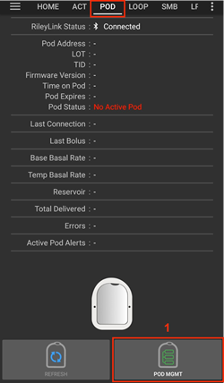 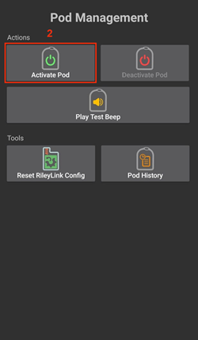

02. Ecranul **Umplere Pompă** este afișat. Umpleți un nouă pompă cu cel puțin 80 de unități de insulină și ascultați cele două semnale sonore care indică faptul că pompa este gata de amorsare. Când calculați cantitatea totală de insulină de care aveți nevoie pentru 3 zile, vă rugăm să luați în considerare faptul că amorsarea pompei va utiliza 12 până la 15 unități.

    > 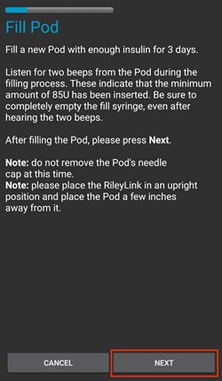
    > 
    > Asigurați-vă că noua pompa și dispozitivul RileyLink sunt foarte aproape unul de celălalt (~30 cm sau mai puțin) și apăsați pe butonul **Următorul**.

03. Pe ecranul **inițializare pompă**, pompa va începe amorsarea (veți auzi un clic urmat de o serie de sunete ticăitoare pe măsură ce pompa se amorsează). Dacă dispozitivul RileyLink este în afara razei de comunicarea a pompei ce se activează, veți primi un mesaj de eroare **Niciun răspuns de la pompă**. Dacă se întâmplă aceasta, [mutați dispozitivul RileyLink mai aproape](#OmnipodEros-optimal-omnipod-and-rileylink-positioning) (~30 cm sau mai aproape) dar nu deasupra sau chiar lângă pompă și apăsați pe butonul **Reîncercați (1)**.

    > 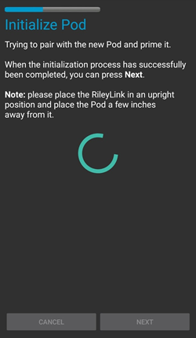 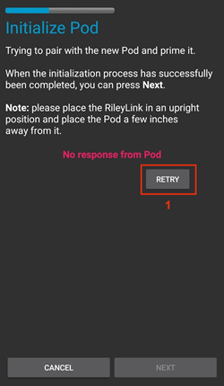

04. După amorsarea cu succes va fi afișată o bifă verde, iar butonul **Următorul** va fi activat. Apăsați pe butonul **Următorul** pentru a finaliza inițializarea de amorsare a pompei și pentru afișarea ecranului **Atașați Pompa**.

    > 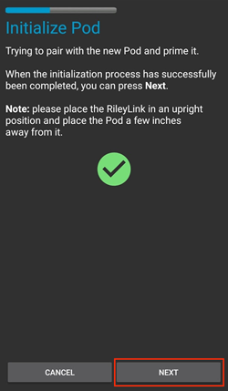

05. În continuare, pregătiți locul de infuzare al pompei. Îndepărtați capacul de plastic al acului și hârtia protectoare de pe adeziv și puneți pompa pe locul selectat de pe corp. Când ați terminat, apăsați pe butonul **Următorul**.

    > 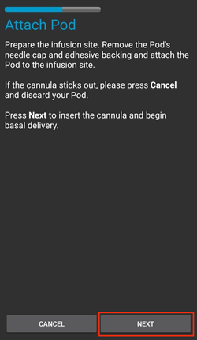

06. Caseta de dialog **Atașează Pompă** va apărea acum. **Apăsați pe butonul OK DOAR dacă sunteți pregătit să introduceți canula**.

    > 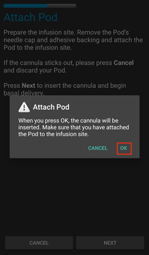

07. După ce apăsați **OK**, poate dura ceva timp până când Omnipod răspunde și introduce canula (maxim 1-2 minute), așa că aveți răbdare.

    > Dacă dispozitivul RileyLink este în afara razei de comunicarea a pompei ce se activează, veți primi un mesaj de eroare **Niciun răspuns de la pompă**. Dacă se întâmplă aceasta, mutați dispozitivul RileyLink mai aproape (~30 cm sau mai puțin) dar nu deasupra sau chiar lângă pompă și apăsați butonul **Reîncercați**.
    > 
    > Dacă RileyLink este în afara razei de acțiune Bluetooth sau nu are conexiune activă la telefon, veți primi un mesaj de eroare **Niciun răspuns de la RileyLink**. Dacă se întâmplă acest lucru, mutați dispozitivul RileyLink mai aproape de telefon și apăsați pe butonul **Reîncercați**.
    > 
    > *NOTĂ: Înainte de introducerea canulei, este o bună practică să strângeți pielea lângă punctul de inserție al canulei. Acest lucru asigură o inserare lină a acului și va reduce riscul de apariție a ocluziilor.*
    > 
    > 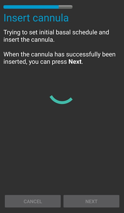
    > 
    >  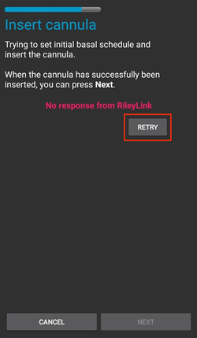

08. O bifă verde va apărea, și butonul **Următorul** devine activat la inserarea cu succes a canulei. Apăsați pe butonul **Următorul**.

    > 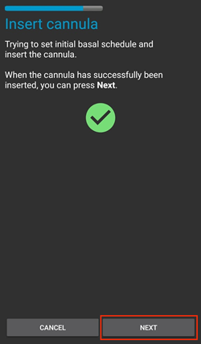

09. Ecranul **Pompă activată** este afișat. Apăsați pe butonul verde **Finalizare**. Felicitări! Acum ați început o nouă sesiune activă de pompă.

    > 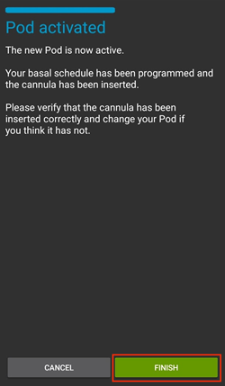

10. Ecranul meniului **Gestionare pompă** ar trebui să afișeze acum butonul **Activați pompa (1)** ca *dezactivat* și butonul **Dezactivați pompa (2)** ca *activat*. Acest lucru se datorează faptului că o pompă este acum activă și nu puteți activa o pompă suplimentară fără a dezactiva mai întâi pompa activă.

    Apăsați pe butonul înapoi de pe telefonul dumneavoastră pentru a reveni la ecranul filei **Omnipod (POD)** care va afișa acum informații despre sesiunea activă de pompă, inclusiv rata bazală curentă, nivelul rezervorului din pompă, insulina administrată, erorile pompei și alertele.

    Pentru mai multe detalii despre informația afișată mergeți la secțiunea [Fila Omnipod (POD)](#OmnipodEros-omnipod-pod-tab) a acestui document.

    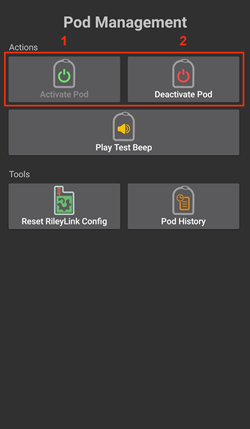 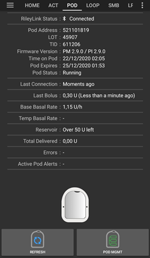

### Dezactivarea unei pompe

În condiții normale, durata de viață preconizată a unei pompe este de trei zile (72 de ore) și de încă 8 ore după avertismentul privind expirarea pompei, pentru un total de 80 de ore de utilizare totală a pompei.

Pentru a dezactiva o pompă (fie de la expirare, fie de la o defecțiune de pompă):

1. Mergeți la fila **Omnipod (POD)**, apăsați pe butonul **Gestionare pompă (1) **, pe ecranul **Gestionare pompă** apăsați pe butonul **Dezactivați pompa (2)**.

   > 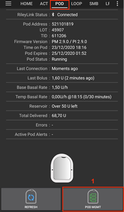 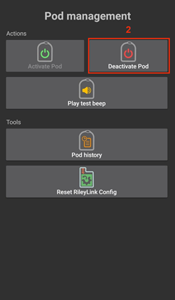

2. Pe ecranul **Dezactivați pompa**, mai întâi, asigurați-vă că dispozitivul RileyLink este în imediata apropiere a pompei, dar nu deasupra sau chiar lângă pompă, apoi apăsați pe butonul **Următorul** pentru a începe procesul de dezactivare a pompei.

   > 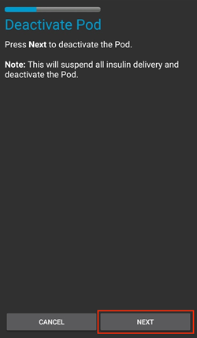

3. Ecranul **Dezactivați pompa** va apărea, și veți primi un semnal sonor de confirmare de la pompă că dezactivarea a avut loc cu succes.

   > 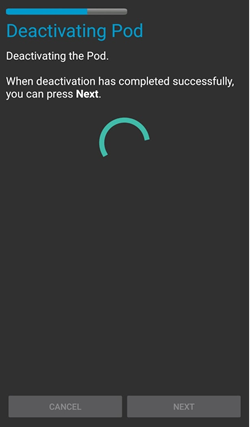
   > 
   > **DACĂ dezactivarea eșuează** și nu primiți semnalul sonor de confirmare, puteți un mesaj **Niciun răspuns de la dispozitivul RileyLink** sau **Niciun răspuns de la pompă**. Apăsați vă rog pe butonul **Reîncercați (1)** pentru a încerca dezactivarea din nou. Dacă dezactivarea continuă să eșueze, vă rugăm să apăsați clic pe butonul **Renunțați la pompă (2)** pentru a renunța la pompă. Acum puteți să dați jos pompa deoarece sesiunea activă a fost dezactivată. Dacă pompa emite o alarmă sonoră continuă, veți fi probabil nevoit să îl reduceți la tăcere în mod manual (folosind un bold sau o agrafă) deoarece butonul **Renunțați la pompă (2)** nu o poate opri.
   > 
   > > 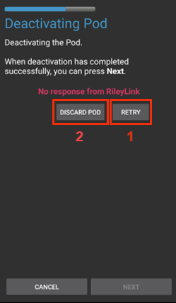  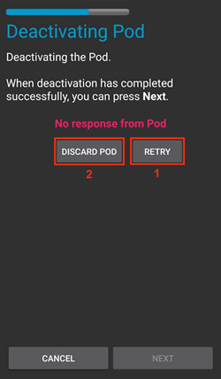

4. O bifă verde va apărea după dezactivarea cu succes. Faceți clic pe butonul **Următorul** pentru a afișa ecranul de pompă dezactivată. Acum puteți să dați jos pompa deoarece sesiunea activă a fost dezactivată.

   > 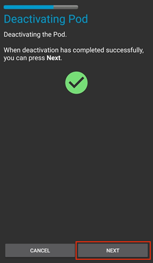

5. Apăsați pe butonul verde pentru a reveni la ecranul **Gestionare pompă**.

   > 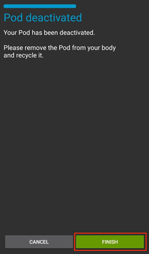

6. Acum că v-ați întors la meniul **Gestionare pompă** apăsați butonul de înapoi de pe telefonul dumneavoastră pentru a reveni la fila **Omnipod (POD)**. Verificați dacă câmpul **Stare RileyLink:** raportează **Conectat** și câmpul **Starea pompei** afișează un mesaj **Nicio pompă activă**.

   > 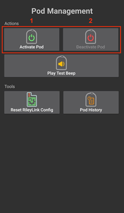  

### Suspendarea și reluarea administrării insulinei

Procesul de mai jos vă va arăta cum se suspendă și se reia administrarea pompei de insulină.

*NOTĂ - dacă nu vedeți un buton SUSPENDAȚI*, apoi nu a fost activat să fie afișat în fila Omnipod (POD). Activați setarea **Afișați butonul Suspendaț Administrare în fila Omnipod** din [setările Omnipod](#OmnipodEros-omnipod-settings) sub categoria **Altele**.

#### Suspendarea administrării insulinei

Folosiți această comandă pentru a pune pompa activă într-o stare suspendată. În această stare de suspendare, pompa nu va mai administra deloc insulină. Această comandă imită funcția de suspendare pe care telecomanda Omnipod originală o transmite unei pompe active.

1. Mergeți la fila **Omnipod (POD)** și apăsați pe butonul **SUSPENDAȚi (1)**. Comanda de suspendare este trimisă din dispozitivul RileyLink către pompa activă și butonul **SUSPENDAȚI (3)** va deveni inactiv. **Starea pompei (2)** va afișa **ADMINISTRARE SUSPENDATĂ**.

   > 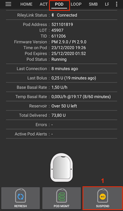 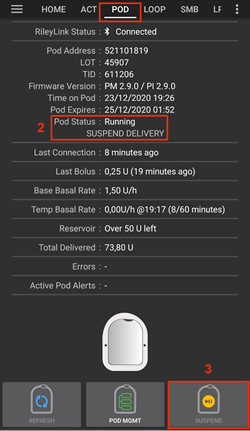

2. Când comanda de suspendare este confirmată cu succes de către dispozitivul RileyLink, un dialog de confirmare va afișa mesajul **Administrarea de insulină a fost suspendată**. Apăsați **OK** pentru a confirma și continua.

   > 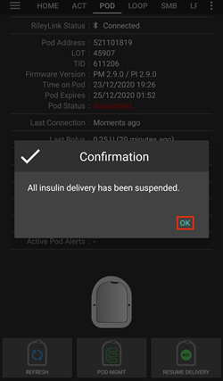

3. Your active pod has now suspended all insulin delivery. The **Omnipod (POD)** tab will update the **Pod status (1)** to **Suspended**. The **SUSPEND** button will change to a new **Resume Delivery (2)** button

   > 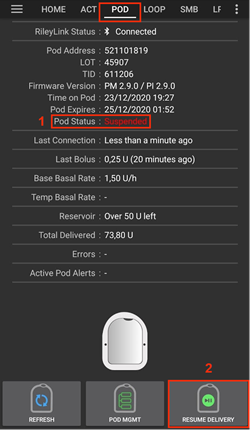

#### Reluarea administrării de insulină

Use this command to instruct the active, currently suspended pod to resume insulin delivery. After the command is successfully processed, insulin will resume normal delivery using the current basal rate based on the current time from the active basal profile. The pod will again accept commands for bolus, TBR, and SMB.

1. Go to the **Omnipod (POD)** tab and ensure the **Pod status (1)** field displays **Suspended**, then press the **Resume Delivery (2)** button to start the process to instruct the current pod to resume normal insulin delivery. A message **RESUME DELIVERY** will display in the **Pod status (3)** field, signifying the RileyLink is actively sending the command to the suspended pod.

   > 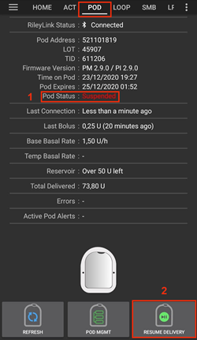 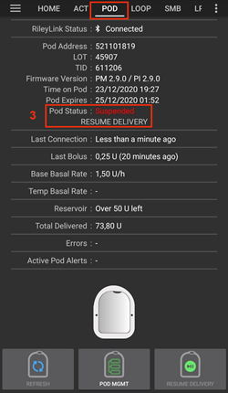

2. When the Resume delivery command is successfully confirmed by the RileyLink a confirmation dialog will display the message **Insulin delivery has been resumed**. Apăsați **OK** pentru a confirma și continua.

   > 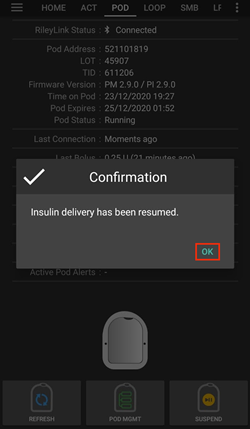

3. The **Omnipod (POD)** tab will update the **Pod status (1)** field to display **RUNNING,** and the **Resume Delivery** button will now display the **SUSPEND (2)** button.

   > 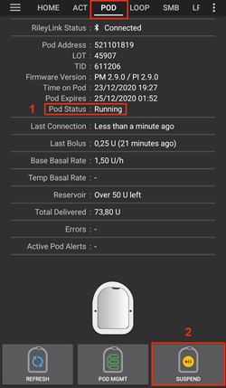

### Acknowledging Pod Alerts

*NOTE - if you do not see an ACK ALERTS button, it is because it is conditionally displayed on the Omnipod (POD) tab ONLY when the pod expiration or low reservoir alert has been triggered.*

The process below will show you how to acknowledge and dismiss pod beeps that occur when the active pod time reaches the warning time limit before the pod expiration of 72 hours (3 days). This warning time limit is defined in the **Hours before shutdown** Omnipod alerts setting. The maximum life of a pod is 80 hours (3 days 8 hours), however Insulet recommends not exceeding the 72 hour (3 days) limit.

*NOTE - If you have enabled the "Automatically acknowledge Pod alerts" setting in Omnipod Alerts, this alert will be handled automatically after the first occurrence and you will NOT need to manually dismiss the alert.*

1. When the defined **Hours before shutdown** warning time limit is reached, the pod will issue warning beeps to inform you that it is approaching its expiration time and a pod change will soon be required. You can verify this on the **Omnipod (POD)** tab, the **Pod expires: (1)** field will show the exact time the pod will expire (72 hours after activation) and the text will turn **red** after this time has passed, under the **Active Pod alerts (2)** field where the status message **Pod will expire soon** is displayed. This trigger will display the **ACK ALERTS (3)** button. A **system notification (4)** will also inform you of the upcoming pod expiration

   > 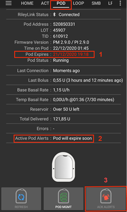 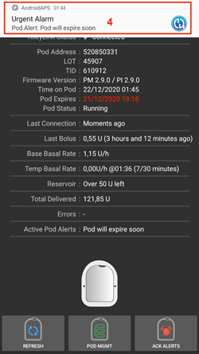

2. Go to the **Omnipod (POD)** tab and press the **ACK ALERTS (2)** button (acknowledge alerts). The RileyLink sends the command to the pod to deactivate the pod expiration warning beeps and updates the **Pod status (1)** field with **ACKNOWLEDGE ALERTS**.

   > 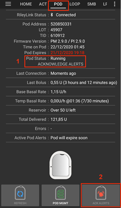

3. Upon **successful deactivation** of the alerts, **2 beeps** will be issued by the active pod and a confirmation dialog will display the message **Activate alerts have been acknowledged**. Apăsați pe butonul **OK** pentru a confirma și a închide dialogul.

   > 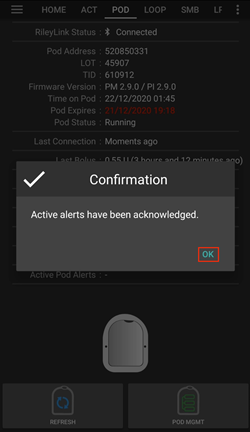
   > 
   > If the RileyLink is out of range of the pod while the acknowledge alerts command is being processed a warning message will display 2 options. **Mute (1)** will silence this current warning. **OK (2)** will confirm this warning and allow the user to try to acknowledge alerts again.
   > 
   > 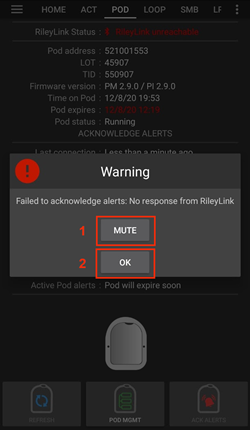

4. Go to the **Omnipod (POD)** tab, under the **Active Pod alerts** field, the warning message is no longer displayed and the active pod will no longer issue pod expiration warning beeps.

(OmnipodEros-view-pod-history)=

### Vedeți istoricul pompei

This section shows you how to review your active pod history and filter by different action categories. The pod history tool allows you to view the actions and results committed to your currently active pod during its three day (72 - 80 hours) life.

This feature is useful for verifying boluses, TBRs, basal changes that were given but you may be unsure if they completed. The remaining categories are useful in general for troubleshooting issues and determining the order of events that occurred leading up to a failure.

*NOTE:* **Uncertain** commands will appear in the pod history, however due to their nature you cannot ensure their accuracy.

1. Go to the **Omnipod (POD)** tab and press the **POD MGMT (1)** button to access the **Pod management** menu and then press the **Pod history (2)** button to access the pod history screen.

   > 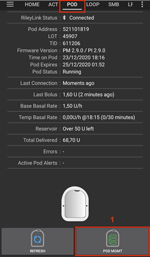 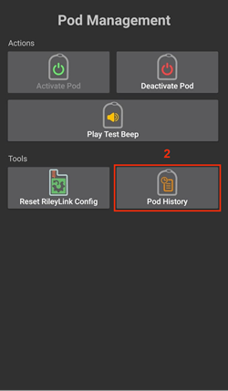

2. On the **Pod history** screen, the default category of **All (1)** is displayed showing the **Date and Time (2)** of all pod **Actions (3)** and **Results (4)** in reverse chronological order. Use your phone’s **back button 2 times** to return to the **Omnipod (POD)** tab in the main AAPS interface.

   >  

### Vedeți Setările RileyLink și Istoric

Această secțiune vă arată cum să verificați setările pompei active și ale dispozitivului RileyLink împreună cu istoricul comunicărilor fiecăruia. Această caracteristică, odată accesată, este împărțită în două secțiuni: **Setări** și **Istoric**.

Principala utilizare a acestei funcții este atunci când dispozitivul dumneavoastră de comunicare cu pompa nu mai este în aria de acoperire Bluetooth a telefonului dumneavoastră după o perioadă de timp și **starea RileyLink** raportează **RileyLink inaccesibil**. Butonul **REÎMPROSPĂTAȚI** din fila principală **Omnipod (pompă)** va încerca manual să restabilească comunicarea prin Bluetooth cu dispozitivul RileyLink configurat în setările Omnipod.

În cazul în care butonul **REÎMPROSPĂTAȚI** din fila principală **Omnipod (pompă)** nu restabilește conexiunea la dispozitivul de comunicare cu pompa, vă rugăm să urmați pașii suplimentari de mai jos pentru o reconectare manuală.

#### Restabiliți manual comunicarea Bluetooth a dispozitivului de comunicare cu pompă

1. Din fila **Omnipod (pompă)** atunci când **Starea RileyLink: (1)** raportează **RileyLink inaccesibil** apăsați butonul **Gestionare pompă (2)** pentru a naviga la meniul **Gestionare pompă**. În meniul **Gestionare pompă** veți vedea o notificare care apare în mod activ în căutarea unei conexiuni RileyLink, apăsați butonul **RileyLink (3)** pentru a accesa ecranul **Setări RileyLink**.

   >  

2. În ecranul **Setări RileyLink (1)** sub secțiunea **RileyLink (2)** puteți confirma atât starea conexiunii Bluetooth, cât și eroarea în câmpurile **Stare de conexiune și Eroare: (3)**. Stările *Eroare Bluetooth* și *RileyLink inaccesibil* ar trebui să fie afișate. Porniți reconectarea Bluetooth manuală prin apăsarea butonului **Reîmprospătați (4)** din colțul din dreapta jos.

   > 
   > 
   > Dacă dispozitivul de comunicare cu pompa nu răspunde sau nu are rază de acțiune în timp ce comanda Bluetooth de reîmprospătare este în curs de procesare un mesaj de avertizare va afișa 2 opțiuni.

   - **Mute (1)** will silence this current warning.
   - **OK (2)** va confirma această avertizare și îi va permite utilizatorului să restabilească conexiunea Bluetooth.

   > 

3. Dacă conexiunea **Bluetooth** nu se restabilește, încercați să **dezactivați ** manual și apoi înapoi **să activați** funcția Bluetooth de pe telefonul dumneavoastră.

4. După o reconectare cu succes la dispozitivul Bluetooth RileyLink câmpul **Starea conexiunii: (1)** ar trebui să raporteze **RileyLink pregătit**. Felicitări, ați reconectat dispozitivul de comunicare cu pompa configurat la AAPS!

   > 

#### Setări ale dispozitivului de comunicare cu pompă și ale pompei active

Acest ecran va furniza informații, stare și setări de configurare pentru dispozitivul de comunicare cu pompa configurat în prezent și pompa Omnipod Eros activă.

1. Mergeți la fila **Omnipod (pompă)** și apăsați butonul **Gestionare pompă (1)** pentru a accesa meniul **Gestionare pompă**, apoi apăsați butonul **Statistici RileyLink (2)** pentru a vedea setările dispozitivului **RileyLink (3)** configurat și setările **pompei active (4)**.

   >  
   > 
   > 

##### câmpuri RileyLink (3)

> - **Adresă:** Adresa MAC a dispozitivului selectat de comunicare cu pompa definit în Setările Omnipod.
> - **Nume:** numele de identificare Bluetooth al dispozitivului selectat de comunicare cu pompa definit în setările Bluetooth ale telefonului.
> - **Nivelul bateriei:** Afișați nivelul bateriei curente a dispozitivului de comunicare cu pompa care este conectat
> - **Dispozitiv conectat:** Modelul pompei Omnipod ce comunică în prezent cu dispozitivul de comunicare cu pompa
> - **Stare conexiune**: Starea curentă a legăturii Bluetooth între dispozitivul de comunicare cu pompa și telefonul pe care rulează AAPS.
> - **Eroare de conexiune:** Dacă există vreo eroare în legătura Bluetooth a dispozitivului de comunicare cu pompa detaliile vor fi afișate aici.
> - **Versiunea de firmware:** Versiunea curentă de firmware instalată pe dispozitivul de comunicare cu pompa conectat în prezent.

##### Câmpuri dispozitiv (4) - Cu o pompă activă

> - **Device Type:** The type of device communicating with the pod communication device (Omnipod pod pump)
> - **Device Model:** The model of the active device connected to the pod communication device (the current model name of the Omnipod pod, which is Eros)
> - **Pump Serial Number:** Serial number of the currently activated pod
> - **Pump Frequency:** Communication radio frequency the pod communication device has tuned to enable communication between itself and the pod.
> - **Last Used frequency:** Last known radio frequency the pod used to communicate with the pod communication device.
> - **Last Device Contact:** Date and time of the last contact the pod made with the pod communication device.
> - **Refresh button** manually refresh the settings on this page.

(omnipod-eros-rileylink-and-active-pod-history)=
#### RileyLink și istoricul pompei active

Acest ecran furnizează informații în ordinea cronologică inversă a fiecărei stări sau acțiuni pe care RileyLink sau pompa conectată în prezent se află sau pe care a întreprins-o. Întregul istoric este disponibil doar pentru pompa activă, după o schimbare de pompă acest istoric va fi șters și doar evenimentele din noua pompă activată vor fi înregistrate și afișate.

1. Go to the **Omnipod (POD)** tab and press the **POD MGMT (1)** button to access the **Pod Management** menu, then press the **Pod History (2)** button to view the **Settings** and **History** screen. Click on the **HISTORY (3)** text to display the entire history of the RileyLink and currently active pod session.

   >  
   > 
   > 

##### Câmpuri

> - **Date & Time**: In reverse chronological order the timestamp of each event.
> - **Device:** The device to which the current action or state is referring.
> - **State or Action:** The current state or action performed by the device.

(OmnipodEros-omnipod-pod-tab)=

## fila Omnipod (POD)

Below is an explanation of the layout and meaning of the icons and status fields on the **Omnipod (POD)** tab in the main AAPS interface.

*NOTĂ: Dacă vreun mesaj din câmpurile de stare ale filei Omnipod (POD) raportează (incert), atunci va trebui să apăsați butonul Reîmprospătați pentru a șterge mesajul și a actualiza starea pompei.*

> 

### Câmpuri

- **RileyLink Status:** Displays the current connection status of the RileyLink

- *RileyLink Unreachable* - pod communication device is either not within Bluetooth range of the phone, powered off or has a failure preventing Bluetooth communication.
- *RileyLink Ready* - pod communication device is powered on and actively initializing the Bluetooth connection
- *Connected* - pod communication device is powered on, connected and actively able to communicate via Bluetooth.

- **Pod address:** Displays the current address in which the active pod is referenced

- **LOT:** Displays the LOT number of the active pod

- **TID:** Displays the serial number of the pod.

- **Firmware Version:** Displays the firmware version of the active pod.

- **Time on Pod:** Displays the current time on the active pod.

- **Pod expires:** Displays the date and time when the active pod will expire.

- **Pod status:** Displays the status of the active pod.

- **Last connection:** Displays the last time communication with the active pod was achieved.

- *Adineauri* - mai puțin de 20 de secunde în urmă.
- *Cu mai puțin de un minut în urmă* - mai mult de 20 de secunde, dar mai puțin de 60 de secunde în urmă.
- *Acum 1 minut* - mai mult de 60 de secunde, dar mai puțin de 120 de secunde (2 minute)
- *XX minute în urmă* - mai mult de 2 minute în urmă așa cum este definit de valoarea XX

- **Last bolus:** Displays the dosage of the last bolus sent to the active pod and how long ago it was issued in parenthesis.

- **Rată bazală de bază:** Afișați rata bazală programată pentru timpul curent din profilul ratei bazale.

- **Rata bazalei temporare:** Afișați rata bazală temporară care rulează în prezent în următorul format

- Unități / oră @ ora la care a fost emisă RBT (minute rulate / total minute pentru care RBT va fi rulată)
- *Example:* 0.00U/h @18:25 ( 90/120 minutes)

- **Rezervor:** Afișați peste 50+U rămase atunci când mai mult de 50 de unități au rămas în rezervor. Sub această valoare, unitățile exacte sunt afișate în text galben.

- **Total livrat:** Afișați numărul total de unități de insulină livrate din rezervor. *Note this is an approximation as priming and filling the pod is not an exact process.*

- **Eroare:** Afișați ultima eroare întâlnită. Review the [Pod history](#OmnipodEros-view-pod-history), [RileyLink history](#omnipod-eros-rileylink-and-active-pod-history) and log files for past errors and more detailed information.

- **Alerte active de pompă:** Rezervat pentru rularea alertelor pe pompa activă. Folosit în mod normal atunci când expirarea pompei a trecut de 72 de ore și sunt rulate alerte sonore native.

### Pictograme

- **REFRESH:**

  > 
  > 
  > Trimite o comandă de reîmprospătare către pompa activă pentru a actualiza comunicarea
  > 
  > Folosiți pentru a reîmprospăta starea pompei și a închide câmpurile de stare care conțin textul (incert).
  > 
  > See the [Troubleshooting section](#OmnipodEros-troubleshooting) below for additional information.

- **POD MGMT:**

  > 
  > 
  > Navigare la meniul de administrare a pompei

- **ACK ALERTS:**

  > 
  > 
  > When pressed this will disable the pod expiration beeps and notifications.
  > 
  > Button is displayed only when pod time is past expiration warning time Upon successful dismissal, this icon will no longer appear.

- **SET TIME:**

  > 
  > 
  > When pressed this will update the time on the pod with the current time on your phone.

- **SUSPEND:**

  > 
  > 
  > Suspends the active pod

- **RESUME DELIVERY:**

  > 
  > 
  > > Resumes the currently suspended, active pod

### Meniu Gestionare Pompă

Below is an explanation of the layout and meaning of the icons on the **Pod Management** menu accessed from the **Omnipod (POD)** tab.

> 

- **Activează pompă**

  > 
  > 
  > Primes and activates a new pod

- **Dezactivare pompă**

  > 
  > 
  > Deactivates the currently active pod.
  > 
  > A partially paired pod ignores this command.
  > 
  > Use this command to deactivate a screaming pod (error 49).
  > 
  > If the button is disabled (greyed out) use the Discard Pod button.

- **Play test beep**

  > 
  > 
  > Plays a single test beep on the pod when pressed.

- **Discard pod**

  > 
  > 
  > Deactivates and discards the pod state of an unresponsive pod when pressed.
  > 
  > Button is only displayed when very specific cases are met as proper deactivation is no longer possible:
  > 
  > > - A **pod is not fully paired** and thus ignores deactivate commands.
  > > - A **pod is stuck** during the pairing process between steps
  > > - A **pod simply does not pair at all.**

- **Pod history**

  > 
  > 
  > Displays the active pod activity history

- **RileyLink stats:**

  > 
  > 
  > Navigates to the RileyLink Statistics screen displaying current settings and RileyLink Connection history
  > 
  > > - **Settings** - displays RileyLink and active pod settings information
  > > - **History** - displays RileyLink and Pod communication history

- **Reset RileyLink Config**

  > 
  > 
  > When pressed this button resets the currently connected pod communication device configuration.
  > 
  > > - When communication is started, specific data is sent to and set in the RileyLink > - Memory Registers are set > - Communication Protocols are set > - Tuned Radio Frequency is set 
  > > - See [additional notes](#OmnipodEros-reset-rileylink-config-notes) at the end of this table

- **Read pulse log:**

  > 
  > 
  > > Sends the active pod pulse log to the clipboard

(OmnipodEros-reset-rileylink-config-notes)=

#### *Reset RileyLink Config Notes*

- The primary usage of this feature is when the currently active pod communication device is not responding and communication is in a stuck state.
- If the pod communication device is turned off and then back on, the **Reset RileyLink Config** button needs to be pressed, so that it sets these communication parameters in the pod communication device configuration.
- If this is NOT done then AAPS will need to be restarted after the pod communication device is power cycled.
- This button **DOES NOT** need to be pressed when switching between different pod communication devices

(OmnipodEros-omnipod-settings)=

## Omnipod Settings

The Omnipod driver settings are configurable from the top-left hand corner **hamburger menu** under **Config Builder**➜**Pump**➜**Omnipod**➜**Settings Gear (2)** by selecting the **radio button (1)** titled **Omnipod**. Selecting the **checkbox (3)** next to the **Settings Gear (2)** will allow the Omnipod menu to be displayed as a tab in the AAPS interface titled **OMNIPOD** or **POD**. This is referred to in this documentation as the **Omnipod (POD)** tab.


**NOTE:** A faster way to access the **Omnipod settings** is by accessing the **3 dot menu (1)** in the upper right hand corner of the **Omnipod (POD)** tab and selecting **Omnipod preferences (2)** from the dropdown menu.


Grupurile de setări sunt listate mai jos; puteți activa sau dezactiva printr-un comutator pentru majoritatea intrărilor descrise mai jos:


*NOTE: An asterisk (\*) denotes the default for a setting is enabled.*

### RileyLink

Allows for scanning of a pod communication device. The Omnipod driver cannot select more than one pod communication device at a time.

- **Show battery level reported by OrangeLink/EmaLink/DiaLink:** Reports the actual battery level of the OrangeLink/EmaLink/Dialink. It is **strongly recommended** that all OrangeLink/EmaLink/DiaLink users enable this setting.

- NU funcționează cu dispozitivul RileyLink original.
- Este posibil să nu funcționeze cu dispozitivele alternative RileyLink.
- Activat - Raportează nivelul bateriei curente pentru dispozitivele acceptate de comunicare cu pompa.
- Dezactivat - Raportează o valoare de n/a.

- **Enable battery change logging in Actions:** In the Actions menu, the battery change button is enabled IF you have enabled this setting AND the battery reporting setting above.  Some pod communication devices now have the ability to use regular batteries which can be changed.  This option allows you to note that and reset battery age timers.

### Semnale sonore de confirmare

Furnizează semnale acustice de confirmare de la pompă pentru administrarea și modificările de bolus, insulină bazală, SMB și TBR.

- **\*Bolus beeps enabled:** Enable or disable confirmation beeps when a bolus is delivered.
- **\*Basal beeps enabled:** Enable or disable confirmation beeps when a new basal rate is set, active basal rate is canceled or current basal rate is changed.
- **\*SMB beeps enabled:** Enable or disable confirmation beeps when a SMB is delivered.
- **TBR beeps enabled:** Enable or disable confirmation beeps when a TBR is set or canceled.

### Alerte

Provides AAPS alerts and Nightscout announcements for pod expiration, shutdown, low reservoir based on the defined threshold units.

*Note an AAPS notification will ALWAYS be issued for any alert after the initial communication with the pod since the alert was triggered. Închiderea notificării NU va anula alerta DECÂT dacă opțiunea de recunoaștere automată a alertelor de pompă este activată. To MANUALLY dismiss the alert you must visit the Omnipod (POD) tab and press the ACK ALERTS button.*

- **\*Expiration reminder enabled:** Enable or disable the pod expiration reminder set to trigger when the defined number of hours before shutdown is reached.
- **Hours before shutdown:** Defines the number hours before the active pod shutdown occurs, which will then trigger the expiration reminder alert.
- **\*Low reservoir alert enabled:** Enable or disable an alert when the pod's remaining units low reservoir limit is reached as defined in the Number of units field.
- **Number of units:** The number of units at which to trigger the pod low reservoir alert.
- **Automatically acknowledge Pod alerts:** When enabled a notification will still be issued however immediately after the first pod communication contact since the alert was issued it will now be automatically acknowledged and the alert will be dismissed.

### Notificări

Provides AAPS notifications and audible phone alerts when it is uncertain if TBR, SMB, or bolus events were successful.

*NOTE: These are notifications only, no audible beep alerts are made.*

- **Sound for uncertain TBR notifications enabled:** Enable or disable this setting to trigger an audible alert and visual notification when AAPs is uncertain if a TBR was successfully set.
- **\*Sound for uncertain SMB notifications enabled:** Enable or disable this setting to trigger an audible alert and visual notification when AAPS is uncertain if an SMB was successfully delivered.
- **\*Sound for uncertain bolus notifications enabled:** Enable or disable this setting to trigger an audible alert and visual notification when AAPS is uncertain if a bolus was successfully delivered.

### Altele

Provides advanced settings to assist debugging.

- **Show Suspend Delivery button in Omnipod tab:** Hide or display the suspend delivery button in the **Omnipod (POD)** tab.
- **Show Pulse log button in Pod Management menu:** Hide or display the pulse log button in the **Pod Management** menu.
- **Show RileyLink Stats button in Pod Management menu:** Hide or display the RileyLink Stats button in the **Pod Management** menu.
- **\*DST/Time zone detect on enabled:** allows for time zone changes to be automatically detected if the phone is used in an area where DST is observed.

### Switching or Removing an Active Pod Communication Device (RileyLink)

With many alternative models to the original RileyLink available (such as OrangeLink or EmaLink) or the need to have multiple/backup versions of the same pod communication device (RileyLink), it becomes necessary to switch or remove the selected pod communication device (RileyLink) from Omnipod Setting configuration.

The following steps will show how to **Remove** and existing pod communication device (RileyLink) as well as **Add** a new pod communication device.  Executing both **Remove** and **Add** steps will switch your device.

1. Access the **RileyLink Selection** menu by selecting the **3 dot menu (1)** in the upper right hand corner of the **Omnipod (POD)** tab and selecting **Omnipod preferences (2)** from the dropdown menu. On the **Omnipod Settings** menu under **RileyLink Configuration (3)** press the **Not Set** (if no device is selected) or **MAC Address** (if a device is present) text to open the **RileyLink Selection** menu.

   >  

### Remove Currently Selected Pod Communication Device (RileyLink)

This process will show how to remove the currently selected pod communication device (RileyLink) from the Omnipod Driver settings.

1. Under **RileyLink Configuration** press the **MAC Address (1)** text to open the **RileyLink Selection** menu.

   > 

2. On the **RileyLink Selection** menu the press **Remove (2)** button to remove **your currently selected RileyLink (3)**

   > 

3. At the confirmation prompt press **Yes (4)** to confirm the removal of your device.

   > 

4. You are returned to the **Omnipod Setting** menu where under **RileyLink Configuration** you will now see the device is **Not Set (5)**.  Congratulations, you have now successfully removed your selected pod communication device.

   > 

### Add Currently Selected Pod Communication Device (RileyLink)

This process will show how to add a new pod communication device to the Omnipod Driver settings.

1. Under **RileyLink Configuration** press the **Not Set (1)** text to open the **RileyLink Selection** menu.

   > 

2. Press the **Scan (2)** button to start scanning for all available Bluetooth devices.

   > 

3. Select **your RileyLink (3)** from the list of available devices and you will be returned to the **Omnipod Settings** menu displaying the **MAC Address (4)** of your newly selected device.  Congratulations you have successfully selected your pod communication device.

   >  

## Fila Acțiuni (ACT)

This tab is well documented in the main AAPS documentation but there are a few items on this tab that are specific to how the Omnipod pod differs from tube based pumps, especially after the processes of applying a new pod.

1. Go to the **Actions (ACT)** tab in the main AAPS interface.
2. Under the **Careportal (1)** section the following 3 fields will have their **age reset** to 0 days and 0 hours **after each pod change**: **Insulin** and **Cannula**. Asta se face datorită modului în care pompa Omnipod este construită și funcționează. **Bateria pompei** și **rezervorul de insulină** sunt integrate înăuntrul fiecărei pompe. Deoarece pompa inserează canula direct în piele la locul aplicării pompei, un fir obișnuit nu este utilizată în pompele Omnipod. *Prin urmare, după schimbarea pompei vechimea fiecăreia dintre aceste valori se va reseta automat la zero.* **Vechimea bateriei pompei** nu este raportată deoarece bateria din pompă va fi întotdeauna mai mare decât durata de viață a pompei (maxim 80 de ore).

> 

### Levels

**Nivelul insulinei**

Reporting of the amount of insulin in the Omnipod Eros Pod is not exact.  This is because it is not known exactly how much insulin was put in the pod, only that when the 2 beeps are triggered while filling the pod that over 85 units have been injected. A Pod can hold a maximum of 200 units. Priming can also introduce variance as it is not and exact process.  With both of these factors, the Omnipod driver has been written to give the best approximation of insulin remaining in the reservoir.

> - **Above 50 Units** - Reports a value of 50+U when more than 50 units are currently in the reservoir.
> - **Below 50 Units** - Reports an approximate calculated value of insulin remaining in the reservoir.
> - **SMS** - Returnează valoarea sau 50+U pentru răspunsuri SMS
> - **Nightscout** - Încarcă în Nightscout valoarea de 50 atunci când sunt peste 50 de unități (versiunea 14.07 și mai vechi).  Versiunile mai noi vor raporta o valoare de 50+ atunci când depășesc 50 de unități.

**Battery Level**

Battery level reporting is a setting that can be enabled to return the current battery level of pod communication devices, such as the OrangeLink, EmaLink or DiaLink.  The RileyLink hardware is not capable of reporting its battery level.  The battery level is reported after each communication with the pod, so when charging a linear increase may not be observed.  A manual refresh will update the current battery level.  When a supported Pod communication device is disconnected a value of 0% will be reported.

> - **RileyLink hardware is NOT capable of reporting battery level**
> - **"Show battery level reported by OrangeLink/EmaLink/DiaLink" Setting MUST be enabled in the Omnipod settings to report battery level values**
> - **Battery level reporting ONLY works for OrangeLink, EmaLink and DiaLink Devices**
> - **Battery Level reporting MAY work for other devices (excluding RileyLink)**
> - **SMS** - Returns current battery level as a response when an actual level exists, a value of n/a will not be returned
> - **Nightscout** - Battery level is reported when an actual level exists, a value of n/a will not be reported

(OmnipodEros-troubleshooting)=

## Depanare

### Eșecuri pompă

Ocazional, apare un eșec din cauza unei varietăți de probleme, inclusiv a problemelor de hardware cu pompa în sine. It is best practice not to call these into Insulet, since AAPS is not an approved use case. A list of fault codes can be found [here](https://github.com/openaps/openomni/wiki/Fault-event-codes) to help determine the cause.

### Prevenirea erorii 49 de pompă

Acest eșec este legat de o stare incorectă a pompei pentru o comandă sau o eroare în timpul unei comenzi de administrare a insulinei. We recommend users to switch to the Nightscout client to *upload only (Disable sync)* under the **Config Builder**➜**General**➜**NSClient**➜**cog wheel**➜**Advanced Settings** to prevent possible failures.

### Alerte de pompă inaccesibilă

It is recommended that pump unreachable alerts be configured to **120 minutes** by going to the top right-hand side three-dot menu, selecting **Preferences**➜**Local Alerts**➜**Pump unreachable threshold \[min\]** and setting this to **120**.

(OmnipodEros-import-settings-from-previous-aaps)=
### Import Settings from previous AAPS

Please note that importing settings has the possibility to import an outdated Pod status. As a result, you may lose an active Pod. It is therefore strongly recommended that you **do not import settings while on an active Pod session**.

1. Deactivate your pod session. Verify that you do not have an active pod session.
2. Export your settings and store a copy in a safe place.
3. Uninstall the previous version of AAPS and restart your phone.
4. Install the new version of AAPS and verify that you do not have an active pod session.
5. Import your settings and activate your new pod.

### Alerte driver Omnipod

please note that the Omnipod driver presents a variety of unique alerts on the **Overview tab**, most of them are informational and can be dismissed while some provide the user with an action to take to resolve the cause of the triggered alert. Un rezumat al principalelor alerte pe care este posibil să le întâlniți este prezentat mai jos:

#### No active Pod

No active Pod session detected. Această alertă poate fi dezactivată temporar prin apăsarea **AMÂNAȚI** dar va continua să se declanșeze atâta timp cât o nouă pompă nu a fost activată. Once activated this alert is automatically silenced.

#### Pod suspended

Informational alert that Pod has been suspended.

#### Setting basal profile failed. Delivery might be suspended! Reîmprospătați manual starea pompei din fila Omnipod și reluați livrarea, dacă este necesar.

Informational alert that the Pod basal profile setting has failed, and you will need to hit *Refresh* on the Omnipod tab.

#### Unable to verify whether SMB bolus succeeded. If you are sure that the Bolus didn't succeed, you should manually delete the SMB entry from Treatments.

Alert that the SMB bolus success could not be verified, you will need to verify the *Last bolus* field on the Omnipod tab to see if SMB bolus succeeded and if not remove the entry from the Treatments tab.

#### Nu este sigur dacă "sarcina bolus/RBT/SMB" s-a finalizat; vă rugăm verificați manual dacă a avut succes.

Due to the way that the RileyLink and Omnipod communicate, situations can occur where it is *uncertain* if a command was successfully processed. The need to inform the user of this uncertainty was necessary.

Below are a few examples of when an uncertain notification can occur.

- **Boluses** - Uncertain boluses cannot be automatically verified. The notification will remain until the next bolus but a manual pod refresh will clear the message. *By default alerts beeps are enabled for this notification type as the user will manually need to verify them.*
- **TBRs, Pod Statuses, Profile Switches, Time Changes** - a manual pod refresh will clear the message. By default alert beeps are disabled for this notification type.
- **Pod Time Deviation -** When the time on the pod and the time your phone deviates too much then it is difficult for AAPS loop to function and make accurate predictions and dosage recommendations. If the time deviation between the pod and the phone is more than 5 minutes then AAPS will report the pod is in a Suspended state under Pod status with a HANDLE TIME CHANGE message. An additional **Set Time** icon will appear at the bottom of the Omnipod (POD) tab. Clicking Set Time will synchronize the time on the pod with the time on the phone and then you can click the RESUME DELIVERY button to continue normal pod operations.

## Best Practices

(OmnipodEros-optimal-omnipod-and-rileylink-positioning)=

### Optimal Omnipod and RileyLink Positioning

The antenna used on the RileyLink to communicate with an Omnipod pod is a 433 MHz helical spiral antenna. Due to its construction properties it radiates an omni directional signal like a three dimensional doughnut with the z-axis representing the vertical standing antenna. This means that there are optimal positions for the RileyLink to be placed, especially during pod activation and deactivation routines.


> *(Fig 1. Graphical plot of helical spiral antenna in an omnidirectional pattern*)

Because of both safety and security concerns, pod *activation* has to be done at a range *closer (~30 cm away or less)* than other operations such as giving a bolus, setting a TBR or simply refreshing the pod status. Due to the nature of the signal transmission from the RileyLink antenna it is NOT recommended to place the pod directly on top of or right next to the RileyLink.

The image below shows the optimal way to position the RileyLink during pod activation and deactivation procedures. The pod may activate in other positions but you will have the most success using the position in the image below.

*Note: If after optimally positioning the pod and RileyLink communication fails, this may be due to a low battery which decreases the transmission range of the RileyLink antenna. To avoid this issue make sure the RileyLink is properly charged or connected directly to a charging cable during this process.*


## Where to get help for Omnipod driver

All of the development work for the Omnipod driver is done by the community on a volunteer basis; we ask that you please be considerate and use the following guidelines when requesting assistance:

- **Nivelul 0:** Citiți secțiunea relevantă a acestei documentații pentru a vă asigura că înțelegeți cum ar trebui să meargă funcționalitatea cu care aveți dificultăți.
- **Level 1:** If you are still encountering problems that you are not able to resolve by using this document, then please go to the *#androidaps* channel on **Discord** by using [this invite link](https://discord.gg/4fQUWHZ4Mw).
- **Level 2:** Search existing issues to see if your issue has already been reported; if not, please create a new [issue](https://github.com/nightscout/AndroidAPS/issues) and attach your [log files](../GettingHelp/AccessingLogFiles.md).
- **Fiți răbdători - majoritatea membrilor comunității noastre sunt voluntari bine-voitori, și rezolvarea problemelor necesită adesea timp și răbdare atât din partea utilizatorilor cât și din partea dezvoltatorilor.**
