# Automatizare

## Ce este o Automatizare?

"**Automatizarea**" este o caracteristică ce poate automatiza sarcini în AAPS.

Automatizările efectuează acțiuni specifice bazate pe una sau mai multe condiții sau în baza unor elemente declanșatoare. Declanșatoarele pot include evenimente neregulate, cum ar fi niveluri scăzute sau crescute ale glicemiei în sânge (BG) sau o cantitate negativă stabilită de insulină la bord (IOB). Automatizările pot face față și unor evenimente recurente, cum ar fi mesele sau exercițiile fizice la anumite ore ale zilei, sau când utilizatorul se află la o anumită distanță a unei locații GPS sau a unei zone SSID WiFi. Automatizarea poate face copiile de rezervă ale setărilor AAPS pe baza unei planificări sau la fiecare schimbare de pompă (Omnipod).

Regulile de automatizare sunt create și modificare din fila Automatizări. Fiecare regulă este definită de două caracteristici:

- Una sau mai multe condiții sau "declanșatoare" care inițiază o acțiune.

    Gândiți-vă la un anumită planificare, un eveniment sau valori ale caracteristicilor în AAPS

- Una sau mai multe acțiuni de efectuat.

    Cum ar fi o alarmă sau setarea unui procentaj de profil sau exportul setărilor AAPS la schimbarea pompei (Omnipod).


Există o gamă largă de opțiuni de automatizare, iar utilizatorii sunt încurajați să le studieze în cadrul aplicației AAPS, în secțiunea Automatizare. De asemenea, puteți căuta grupurile de utilizatori AAPS pe  și  pentru exemple de automatizare de la alți utilizatori.

## Cum poate ajuta automatizarea

1. **Automatizarea sarcinilor recurente:** Execută automat acțiunile programate fără interacțiunea utilizatorului.

1. **Reducerea oboselii decizionale:** Beneficiul principal al **Automatizărilor** este de a scuti utilizatorul de sarcina de a face intervenții manuale în **AAPS**. [Cercetările](https://www.ncbi.nlm.nih.gov/pmc/articles/PMC6286423/#ref4) estimează că 180 de decizii zilnice suplimentare trebuie luate de cei care trăiesc cu diabet de tip 1. **Automatizările** pot reduce povara mentală, eliberând energia mentală a utilizatorului pentru alte aspecte ale vieții.

1. **Îmbunătățirea potențială a controlului glicemic:** de exemplu **Automatizările** se pot asigura că **Țintele temporare** sunt întotdeauna stabilite atunci când este necesar, chiar și în situații de program încărcat sau în perioade de uitare. De exemplu, dacă un copil cu diabet zaharat are sporturi programate la școală marți, la ora 10:00 și joi, la ora 14:00 și necesită o țintă temporară ("TT") acționată cu 30 de minute înainte de activitatea sportivă; **Ținta temporară** poate fi activată prin intermediul unei **Automatizări**.

1. **Permiterea AAPS să fie foarte personalizat** pentru a fi mai mult sau mai puțin agresiv în situații specifice, conform preferinței unui utilizator. De exemplu, declanșarea unei reduceri temporare a **Profilului** % pentru o perioadă de timp determinată dacă se strânge **IOB** negativ la mijlocul nopții, ceea ce indică că **Profilul** existent poate fi prea puternic.

Exemplul de mai jos ilustrează cum o **Automatizare** poate permite eliminarea pașilor.

Utilizatorul face exerciții în fiecare dimineață la ora 6 dimineața: trebuie să își amintească să stabilească manual o țintă temporară în AAPS la 5 dimineața, înainte de a face exerciții.


Utilizatorul a setat o **Automatizare** care să declanșeze o "Țintă temporară de activitate" la ora 5 dimineața pentru a se asigura că **glicemia** și **IOB** sunt optime, în vederea pregătirii exercițiului său de la 6 dimineața:

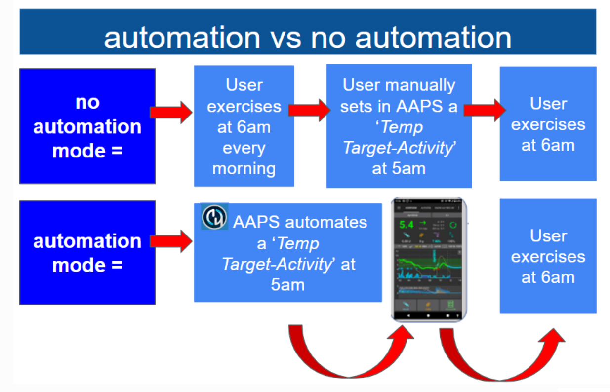

## Considerații-cheie înainte de a începe cu automatizările

1. Înainte de a configura anumite automatizări, ar trebui să aveți un control rezonabil **al glicemiei** cu **AAPS**. Automatizările nu ar trebui folosite pentru a compensa setările suboptime ale bazalelor, **ISF** sau **ICR** (discutate mai jos). Evitați să setați o **schimbare a profilului** automată pentru a compensa creșterile de **glicemie** din cauza _, spre exemplu, _ alimentelor, acestea sunt gestionate mai bine prin intermediul altor strategii (SMB șamd).

1. Cum este cu orice tehnologie, **CGM**, **pompele** și telefoanele se pot defecta: probleme tehnice sau erori ale senzorilor pot întrerupe acțiunile **Automatizărilor**, și este nevoie de intervenții manuale.

1. **Cerințele pentru **Automatizări** se vor schimba probabil odată cu schimbarea rutinelor**. Atunci când schimbați între perioade de lucru/școală/vacanță, setați un memento în calendar pentru a verifica care **Automatizări** sunt în prezent active (sunt ușor de activat și de dezactivat). De exemplu, dacă mergeți în vacanță, și nu mai este nevoie de o automatizare pentru activitățile sportive școlare sau zilnice, sau dacă este necesară ajustarea orarului.

1. **Automatizările** pot intra în conflict unele cu altele, și este bine să revizuiești orice nouă **Automatizare** care se stabilește cu atenție într-un mediu sigur; și să înțelegeți de ce o **automatizare** poate sau nu să fi fost declanșată în modul în care vă așteptați.

1. Dacă utilizați Autosens, încercați să faceți uz de **Ținte Temporare** în locul **Schimbărilor de profil**. **Țintele temporare** nu resetează Autosens înapoi la 0. **Profile Switches** reset Autosens.

1. Most **Automations** should only be set for a **limited time duration**, after which **AAPS** can re-evaluate and repeat the **Automation**, if necessary, and if the condition is still met. For example, "start temp target of 7.0 mmol/l for 30 min" or "start **Profile** 110% for 10 min" _and_ "start temp target of 5.0 mmol/l for 10 min". Using **Automations** to create permanent changes (e.g. to stronger %profile) risks hypoglycemia.

## When can I start using Automation?

**Automations** can be started in **objective 10**.

## Where are Automations located in AAPS?

Depending on your [Config builder > General](../SettingUpAaps/ConfigBuilder.md) settings, **Automation** is located either in the ‘hamburger’ menu or as a tab with **AAPS**.

## How can I set up an Automation?

To set up an **Automation** create a ‘rule’ with **AAPS** as follows:

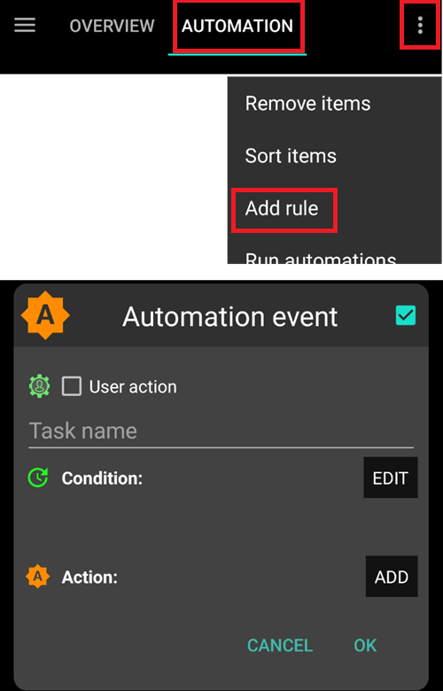

* give your ‘rule’ a title;
* select at least one ‘Condition’;

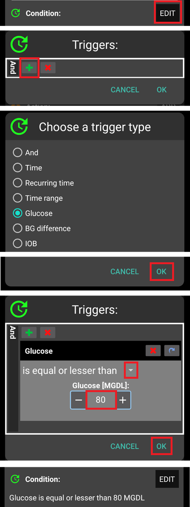

* select one ‘Action’;


* check the right box to the **Automation** event is ‘ticked’ to activate the **Automation**:

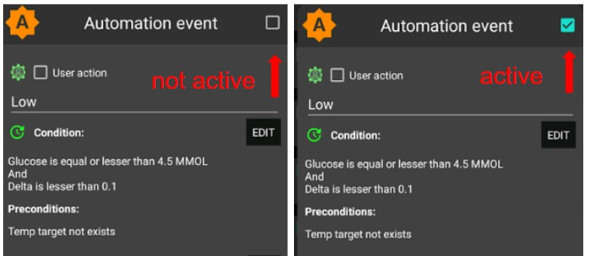


To deactivate an **Automation** rule, untick the box left of the name of the **Automation**. The example below shows an **Automation** entitled ‘Low Glucose TT’ as either activated (‘ticked') or deactivated (‘unticked’).

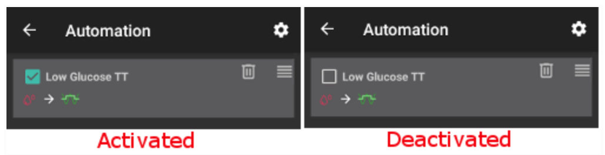


When setting up an **Automation**, you can first test it by activating the ‘notification’ option under "Actions". This triggers **AAPS** to first display a notification rather than actually automating an action. When you are comfortable that the notification has been triggered at the correct time/conditions, the **Automation** rule can be updated to replace the ‘Notification’ with an ‘Action’.

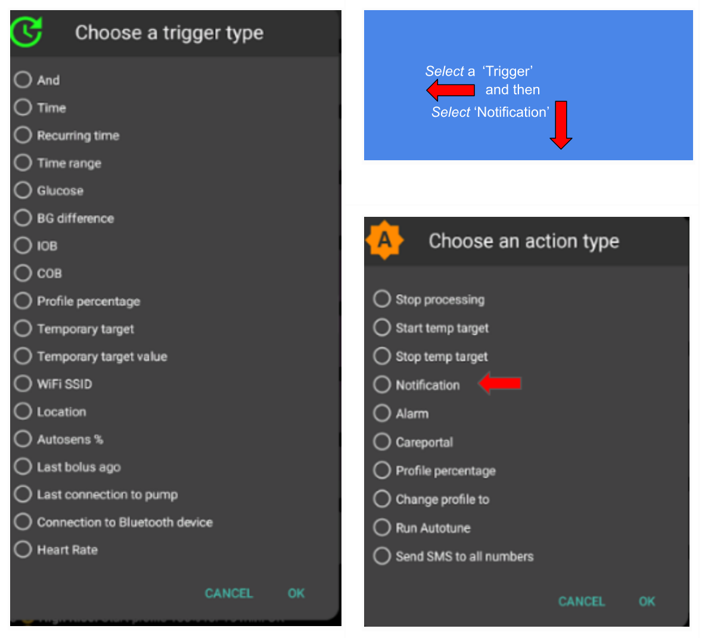

```{admonition} Important note
:class: note

**Automations** are still active when the Loop is disabled!
```


## Safety limits

There are safety limits set for **Automations**:

* The **glucose** value has to be between 72 and 270 mg/dl (or 4 and 15 mmol/l).
* The **Profile Percentage** has to be between 70% and 130%.
* There is a 5 minute time limit between executions of  **Automation** (and first execution).

## Correct use of negative values

```{admonition} Warning
:class: warning

Please be careful when selecting a negative value in **Automation**
```

Caution must be taken when selecting a ‘negative value’ within the ‘Condition’ like "less than" in **Automations**. For example:

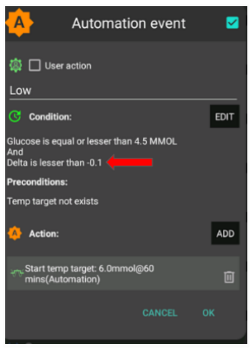

**Example 1:** Creating a Condition **"is lesser than"** "-0.1mmol/l" (or "-2mg/dl") will:

Trigger an **Automation** for any number which is **strictly less than** -0.1 (-2). This includes numbers like -0.2, -0.3, -0.4 (-4, -6, -8) and so on. Remember that -0.1 (-2) itself **is not** included in this condition. (The condition "is equal or lesser than -0.1mmol/l (-2 mg/dl)" _would_ include -0.1 mmol/l or -2 mg/dl).

**Example 2:** Creating a Condition "is greater than" -0.1mmol/l (-2mg/dl) will:

Trigger an **Automation** for any number which is **greater than** -0.1mmol/l (-2mg/dl). This includes numbers like 0, 0.2, 0.4mmol/l, (0, 4, 8mg/dl) and any other positive number.

It is important to carefully consider the exact intention of your **Automation** when choosing these conditions and values.

(automations-automation-triggers)=
## Automation Triggers


There are various ‘Triggers’ that can be selected by the user. Triggers are the conditions that must be met in order for the automation to execute. The list below is non-exhaustive:

**Trigger:** connect conditions

**Options:**

Several conditions can be linked with
* "Și"
* "Sau"
* “Exclusive or” (which means that if one - and only one of the - conditions applies, the action(s) will happen)

**Trigger:** time vs. recurring time

**Options:**

* time = single time event
* recurring time = something that happens regularly (i.e. once a week, every working day etc.)

**Trigger:** location

**Options:**

* in the **config builder** (Automation), the user can select their required location service.

**Trigger:** location service

**Options:**

* Use passive location: **AAPS** only takes locations when other apps are requesting it.
* Folosiți locația rețelei: locația Wi-Fi.
* Utilizează locația GPS (Atenție! This can cause excessive battery drain!)

**Triggers** : pump and sensor data

* Cannula age trigger: Available for all pumps
* Insulin age trigger: Available for supported pumps
* Battery age trigger: Available for supported pumps
* Sensor age trigger: always available
* Pod Activation trigger: Available for patch pumps

Note that for all age related triggers the equal comparison is unlikely to trigger, so in that case two triggers are required to create a range

* Reservoir level trigger: Available for all pumps, comparison "NOT\_AVAILABLE" is not working for this trigger as the value is always filled in **AAPS**
* Pump battery level trigger: Available for supported pumps, comparison "NOT\_AVAILABLE" is not working for this trigger as the value is always filled in **AAPS**

(automations-automation-action)=
## Acțiune


**Actions:** start **Temp Target**

**Options:**

* **BG** must be between 72 mg/dl and 270 mg/dl (4 mmol/l and 15 mmol/l)
* **TT** works only if there is no previous Temp Target

**Actions:** stop **Temp Target**

**Options:**

niciunul

**Actions:** **Profile Percentage**

**Options:**

* **Profile** must be between 70% and 130%
* works only if the previous Percentage is 100%

Once the ‘Action’ is added,  the default values must be changed to the desired number by clicking and adjusting the default values.

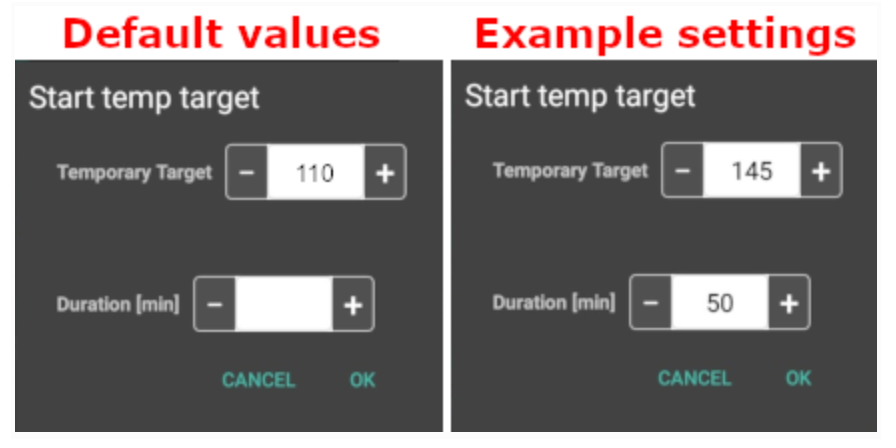

(Automations-the-order-of-the-automations-in-the-list-matters)=
## The order of the **Automations** in the list matters
 **AAPS** will automate the rules created in the order of preference, starting from the top of the **Automation** list. For example, if the ‘Low’  **Automation** is the most important **Automation**, above all other rules, then this  **Automation** should appear at the top of the user’s **Automation** list as demonstrated below:


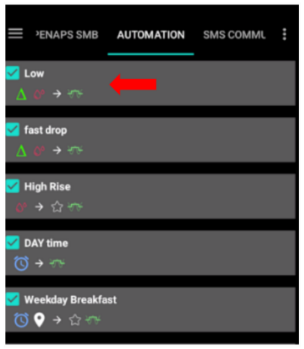

To reprioritize the **Automation** rules, click and hold the four-lines-button on the right side of the screen. Reorder the  **Automations** by moving the rules up or down.

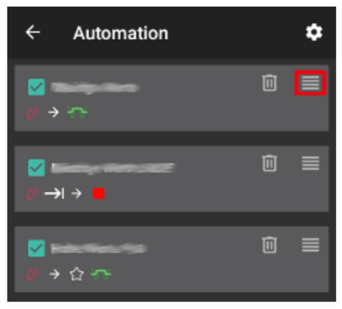

## How to delete Automation rules

To delete an **Automation** rule click on the trash icon.

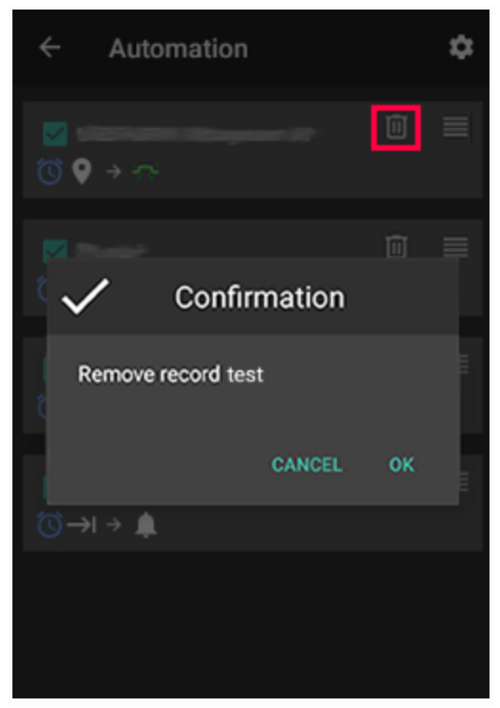

## Examples of Automations

Below are examples of **Automations**. Further discussion on **Automations** and how users have individualised their  **Automation** can be found in Facebook discussions groups or on Discord. The examples below should not be replicated without the user having a good understanding of how the **Automation** will work.

### Țintă temporară în caz de hipoglicemie

This **Automation**  triggers an automatic ‘Temp Target Hypo’ when low **BG** is at a certain threshold.

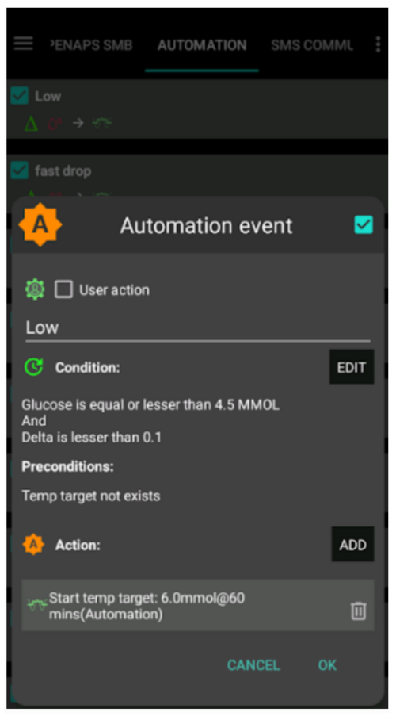

### Lunch Time Temp Target (with ‘Location’)

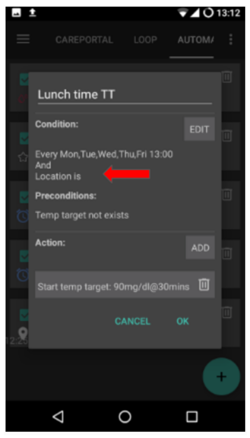

This **Automation** has been created for a user who eats their lunch at work around the same time every weekday but triggered only if the user is situated within a set ‘location’.  So if the user is not at work one day, this **Automation** will be activated.

This **Automation** will set a low **Temp Target** (Eating Soon) at 13:00 to drive ‘BG, to 90mg (or 5 mmol/l) in preparation for lunch.

The ‘Trigger’ location is set by inputting the latitude and longitude GPS coordinates as below:

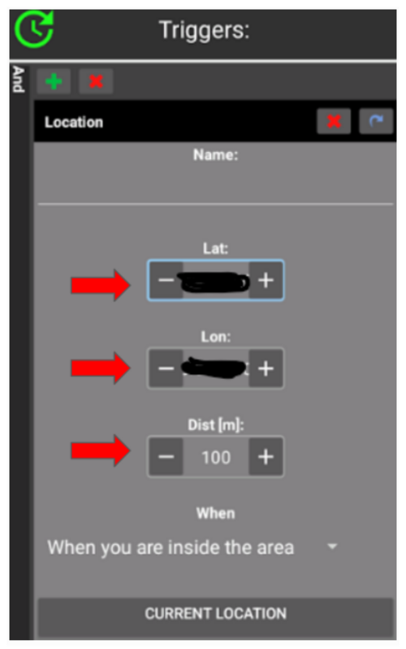

Because of the ‘And’ connection, the **Automation** only happens during the ‘chosen time’ and if the user is at the selected location.

The **Automation** will not be triggered on any other time at this location or on this time outside of 50 meters set GPS coordinates.

### WIFI SSID Location Automation

Using WIFI SSID is a good option to trigger an **Automation** while within range of a specific wifi network (than compared with GPS), it is fairly precise, uses less battery and works in enclosed spaces where GPS and other location services might not be available.

Here is another example of setting up a **Temp Target** for work days only before breakfast(1).


The **Automation** will trigger at 05:30am only on Monday-Friday(2)  
and while being connected to a home wifi network (3).


It will then set a **Temp Target**  of 75mg/dl for 30 minutes (4). One of the advantages of including the location is that it will not trigger if the user is travelling on vacation for instance.

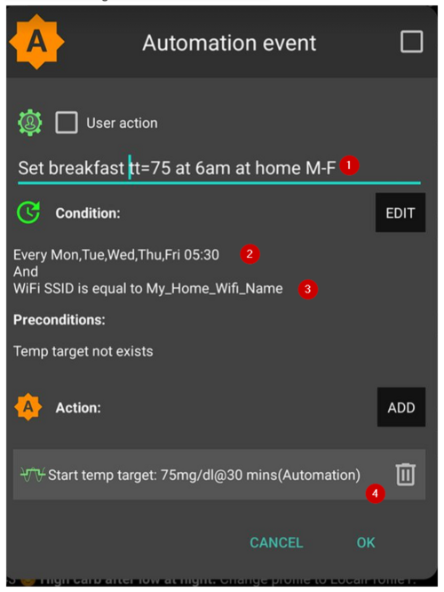

Here is the screenshot detailing the **Automation** triggers:

1) În cadrul principalului „AND” (ambele condiții trebuie îndeplinite pentru a declanșa) 1) Timp recurent = L, M, Mi, J, V la 5:30 dimineața  
1) Nume rețea WiFi = Rețeaua_mea_WiFi_de_acasă

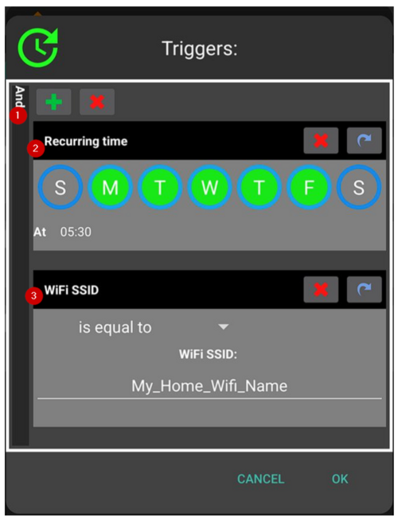

(automating-preference-settings-export)=

## Automating Preference Settings Export

### Unattended Exports: scheduled (daily)

Screenshots detailing the Automation triggers:

1) Condiție: Timp recurent = L, M, Mi, J, V la 8:00 dimineața 1) Acțiune: Setări Export (pentru "Text în tratamente" introduceți "Zilnic")

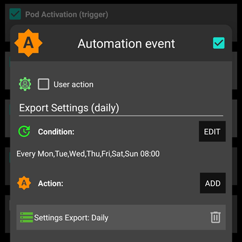

Note: Export execution will be logged on Careportal

### Unattended Exports: Pod Activation (patch pump only)

Screenshots detailing the Automation triggers:

1) Condiție: Activare pompă 1) Acțiune: Setări Export (pentru "Text în tratamente" introduceți "Activare Pompă: setări export")

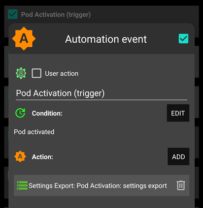

Note: Export execution will be logged on Careportal. Note : Automation will not trigger **at all** if you have not done a manual settings export before. See [Preferences > Maintenance](#preferences-maintenance-settings) for proper activation of unattended settings export.


## Automation Logs

**AAPS** has a log of the most recent **Automation** triggered at the bottom of the screen under the **Automation** tab.

In the example below the logs indicate:

(1) at 01:58 am, the “Low BG triggers temp hypo profile” is activated
* glucose value is less than 75mg/dl;
* delta is negative (ie: the BG is going down);
* time is within 01:00 am and 06:00 am.

The **Automation** will:
* set a **Temp Target** to 110mg/dl for 40 minutes;
* start a temporary **Profile** at 50% for 40 minutes.

(2) at 03:38 am,  the “High carb after low at night” is triggered
* time is between 01:05 am and 06:00 am;
* glucose value is greater than 110mg/dl.

The **Automation** will:
* change **Profile** to LocalProfile1 (ie: cancel the temporary profile if any)
* stop **Temp Target** (if any)

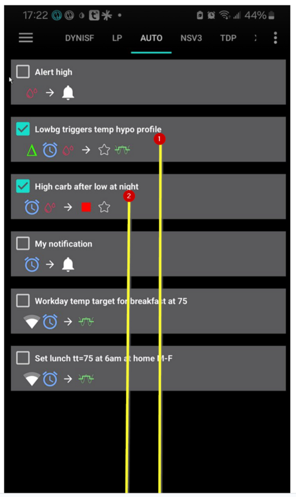

## Depanare

* Problem: __My automations are not being triggered by AAPS?__

Check the box to the right of **Automation** event is ‘ticked’ to ensure the rule is activated.

## Depanare

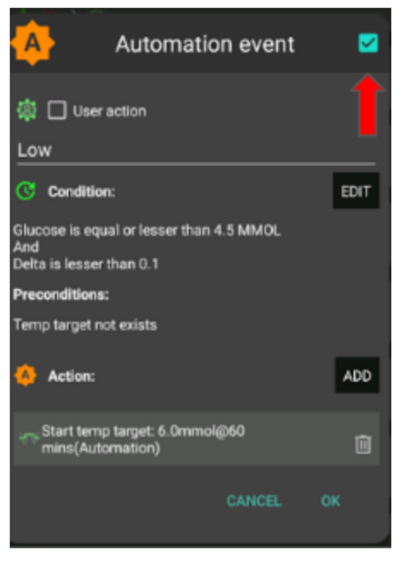

* Problem: __My automations are being triggered in the wrong order.__

Check your rule prioritisation order as discussed above here.

## Alternatives to Automations

For advanced users, there are other possibilities to automate tasks using IFTTT or a third party Android app called Automate. 
