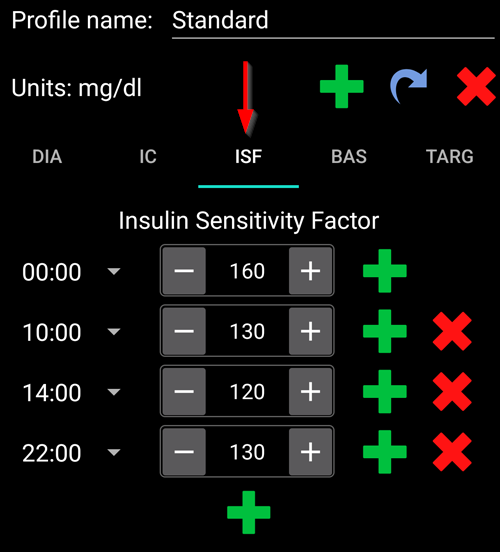
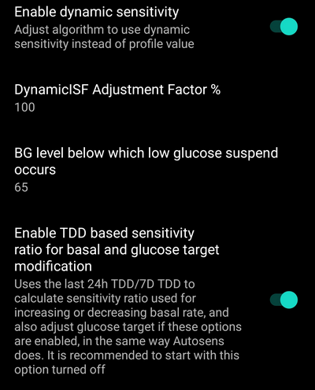

(Open-APS-features-DynamicISF)=
# ISF dinamic (DynISF)

Până acum, cu **AMA** și **SMB**, **ISF** a fost definit în **Profil** și a fost static pentru fiecare perioadă definită din zi. Dar în realitate, valoarea **ISF** a unei persoane nu este atât de statică și variază în funcție de nivelul **glicemiei**: la un nivel ridicat de glicemie, utilizatorul va avea nevoie de mai multă insulină pentru a reduce valoarea **glicemiei** cu 50mg/dl / 3mmol/l comparativ cu o **glicemie** mai mică. [Autosens](#Open-APS-features-autosens) a fost primul algoritm care a încercat să rezolve această problemă, prin ajustarea **ISF** între mese.

**ISF dinamic** (numit și **DynISF**) servește aceluiași scop, dar este mai avansat, deoarece poate fi utilizat în orice moment. Este recomandat doar pentru utilizatorii avansați care au stăpânire bună pe controalele și monitorizarea **AAPS**. Citiți mai jos [Lucruri de luat în considerare la activarea ISF dinamic](#dyn-isf-things-to-consider-when-activating-dynamicisf) înainte de a-l încerca.

```{admonition} CAUTION - Automations or Profile Percentage change
:class: avertizare

**Automatizările** ar trebui folosite întotdeauna cu grijă. Mai ales cu **ISF dinamic**.

Când folosiți **ISF dinamic**, dezactivați orice modificare temporară a **Profilului** ca regulă de **Automatizare****, deoarece acest lucru ar determina ca **ISF dinamic** să fie excesiv de agresiv în bolusurile de corecție și ar duce la hipoglicemie. Acesta este scopul exact al **ISF dinamic** și de aceea nu este necesar ca **AAPS** să fie informat să furnizeze insulină suplimentară prin automatizare în cazul în care sunt **glicemii** mari.

```

Pentru a **ISF dinamic**, baza de date a **AAPS** necesită minimum 7 zile de date **AAPS** ale utilizatorului.

## Ce face ISF dinamic?

**Dynamic ISF** adapts the insulin sensitivity factor (**ISF**) dynamically based on the user's:

- Total Daily Dose of insulin (**TDD**); and
- current and predicted blood glucose values.

When using **Dynamic ISF**, the **ISF** values entered in the **Profile** are not used at all anymore, except as a fallback if there is not enough TDD data in **AAPS** database (*i.e.* fresh reinstallation  of the app).

**SMB/AMA** - an example of a user's **Profile** with static **ISF** as set by the user and utilised by **SMB** and **AMA**.



**Dynamic ISF** - an example of a user's **ISF** subject to change as determined by **Dynamic ISF**.


The section circled in red shows: `profile ISF` -> `ISF as calculated by DynISF`. <br/> Taping on this section shows a dialog with additional information, such as the **ISF** used for the calculator and carbs absorption (see [Other usages of ISF](#dynisf-other-usages-of-isf) below).

The **DynISF** value can also be shown in an additional graph, enabling “Variable sensitivity” data. It shows as a white line (see red arrow on the image above).

## How is Dynamic ISF calculated ?

**Dynamic ISF** uses Chris Wilson’s model to determine **ISF** instead of the user's static **ISF** value as set within the **Profile**. A detailed explanation can be found here: [Chris Wilson on Insulin Sensitivity (Correction Factor) with Loop and Learn, 2/6/2022](https://www.youtube.com/watch?v=oL49FhOts3c).

The **Dynamic ISF** equation implemented is: `ISF = 1800 / ((TDD * DynISF Adjust Factor) * Ln (( current BG / insulin divisor) + 1 ))`

Variabilele folosite în această ecuație sunt detaliate mai jos.<br/> Notă: `Ln` reprezintă logaritm natural, o funcție matematică.

The implementation uses the above equation to calculate current **ISF** and in the oref1 [predictions for **IOB**, **ZT** (zero-temping) and **UAM**](#aaps-screens-prediction-lines). It is also used for **COB** and in the bolus wizard (see [Other usages of ISF](#dynisf-other-usages-of-isf) below).

### TDD (Total Daily Dose)
TDD will use a combination of the following values:
1.  7 day's average **TDD**;
2.  the previous day’s **TDD**; and
3.  a weighted average of the last eight (8) hours of insulin use extrapolated out for 24 hours.

The **TDD** used in the above equation is weighted one third of each of the above values.

### Dynamic ISF Adjustment Factor

This is set within the user’s **Preferences** and is used to make **Dynamic ISF** more or less aggressive. See the [Preferences](#dyn-isf-preferences) section below.

### Insulin Divisor
The insulin divisor depends on the peak of the insulin used and is inversely proportional to the peak time. For Lyumjev this value is 75, for Fiasp, 65 and regular rapid insulin, 55.

### ISF based on predicted BG for dosing decisions

Dynamic sensitivity is computed with the **current BG** value, and displayed as your current ISF in **AAPS**. But when doing dosing calculations, the oref1 algorithm computes and uses **Future ISF** instead.

This is done to prevent dosing too much insulin when **BG** is low or predicted to go low.

**Future ISF** uses the same formula as described above, except that it may use **minimum predicted BG** instead of **current BG**. **Minimum predicted BG**, [as calculated in oref1](https://openaps.readthedocs.io/en/latest/docs/While%20You%20Wait%20For%20Gear/Understand-determine-basal.html), is the minimum value your BG is predicted to go during all the course of the predictions.

* If the current **BG** is above target  <br/> **and** if **BG** levels are flat, within +/- 3 mg/dL:<br/>BG is used in the formula as follows: `average(minimum predicted BG, current BG)`.
* If eventual **BG** is above target and glucose levels are increasing,<br/>  
  **or** eventual **BG** is above current **BG**:<br/>BG is used in the formula as follows: `current BG`.
* Otherwise:<br/>BG is used in the formula as follows: `minimum predicted BG`.

For a simplified explanation, refer to the screenshot below, which illustrates the above situation. Orange dots use **predicted BG**, purple dots use **average(predicted BG, current BG)**, and blue dots use **current BG**.


(dynisf-other-usages-of-isf)=
## Other usages of ISF

### ISF and COB absorption

As described in the [COB Calculation](../DailyLifeWithAaps/CobCalculation.md) page, usually, the absorption of COB is calculated with this formula :   
`absorbed_carbs = deviation * ic / isf`  
When using **Dynamic ISF**, the **ISF** used here is the average of past 24h Dynamic ISF values.

### ISF in Bolus Wizard

When using the [Bolus wizard](#aaps-screens-bolus-wizard), **ISF** is used if **BG** is above target to add a correction.

When using **Dynamic ISF**, the **ISF** used here is the average of past 24h Dynamic ISF values.

(dyn-isf-preferences)=
## Preferințe

Check **Enable dynamic sensitivity** in [Preferences > OpenAPS SMB](#Preferences-openaps-smb-settings) to activate. New settings become available once selected.



(dyn-isf-adjustment-factor)=
### Dynamic ISF Adjustment Factor
**Dynamic ISF** works based on a single rule which is supposed to apply to everyone, implying that people having the same **TDD** would have the same sensitivity. As each user has their own personal sensitivity, the **Adjustment Factor** allows the user to define whether they are more or less sensitive to insulin than the "standard" person.

The **Adjustment Factor** is a value between 1% and 300%. This acts as a multiplier on the **TDD** value.

* Increasing this value above 100 % makes **DynISF** more aggressive: the **ISF** values become *smaller* (_i.e._ more insulin required to decrease **BG** levels a small amount)
* Lowering this value under 100% makes **DynISF** less aggressive: the **ISF** values become larger (_i.e._ less insulin required to decrease **BG** levels a small amount).

The **Adjustment Factor** is also altered when activating a [**Profile Switch** with percentage](../DailyLifeWithAaps/ProfileSwitch-ProfilePercentage.md). A lower **Profile Percentage** will lower the **Adjustment Factor**, and vice versa in respect of higher **Profile Percentage**.

For example, if your **Adjustment Factor** is 80%, and **Profile Switch** to 80% is actioned , the resulting **Adjustment Factor** will be `0.8*0.8=0.64`.

This means that, when using **DynISF**, you can use **Profile Percentage** to temporarily fine tune your sensitivity manually. This can be useful for physical activity (lower percentage), illness (higher percentage), etc.

### Nivel glicemic sub care survine suspendarea de hipoglicemie

**BG** value below which insulin is suspended. Default value uses the standard target model. A user can set this value between 60mg/dl (3.3mmol/l) and 100mg/dl(5.5mmol/l). Values below 65/3.6 result in use of the default model.

### Activează raportul de sensibilitate bazat pe DZt pentru modificarea bazalei și a țintei glicemice

This setting replaces Autosens, and uses the last 24h **TDD**/7D **TDD** as the basis for increasing and decreasing basal rate, in the same way that standard Autosens does. This calculated value is also used to adjust target, if the options to adjust target with sensitivity are enabled. Unlike Autosens, this option does not adjust **ISF** values.

(dyn-isf-things-to-consider-when-activating-dynamicisf)=
## Things to consider when activating Dynamic ISF

* **Dynamic ISF** is recommended only for advanced users that have a good handle on their **AAPS'** controls and monitoring. Users should ideally have attained good control with **SMB** before moving onto **Dynamic ISF**.
* As mentioned above, turn off all [**Automations**](../DailyLifeWithAaps/Automations.md) which activate a **Profile Percentage** in relation to **BG** because it will be too aggressive and may over deliver in insulin! This is already part of the **Dynamic ISF** algorithm.
* [Profile Percentage](../DailyLifeWithAaps/ProfileSwitch-ProfilePercentage.md) is taken into account for the Dynamic ISF calculation (see [Dynamic ISF Adjustment Factor](#dyn-isf-adjustment-factor) above). It is bad practice to use a **Profile Percentage** other than 100% for a long time. If you determine that your **Profile** has changed, create a new **Profile** with your revised values in order to replicate the **Profile** with a specific percentage.
* **Dynamic ISF** may not work for everyone. Specifically, you may see unexpected results if one of these situations apply to you:
  * Variable lifestyle (inconsistent eating or physical activity patterns)
  * Inconsistent TDD or sensitivity from day to day.
* There is no precise guide to set the initial value of the **Adjustment Factor**. However, as a starting point: assuming your **Profile** values are correct, when you are in range and **BG** levels are flat, the **DynISF** value should be about the same as the one you had in your **Profile** before.<br/>If you see that **Dynamic ISF** is too aggressive, lower the **Adjustment Factor**, and vice-versa.
* Even though **DynISF** does not use **Profile ISF** at all, if you notice that your sensitivity is very different from what was previously stored in your **Profile**, you should consider keeping it up-to-date. This may be useful in case you loose your **AAPS** data (_i.e._ new phone, new **AAPS** version…), as your **Profile ISF** will be used as fallback for the next 7 days.