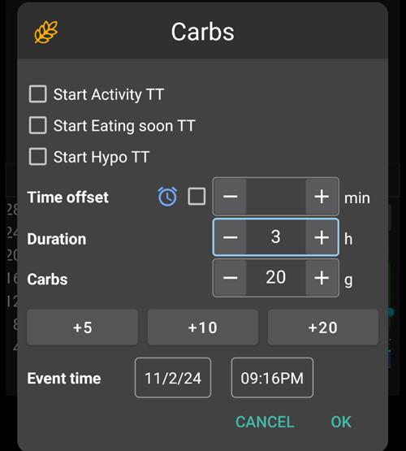
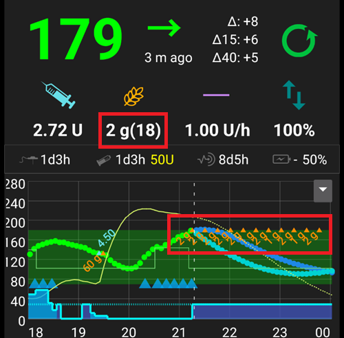
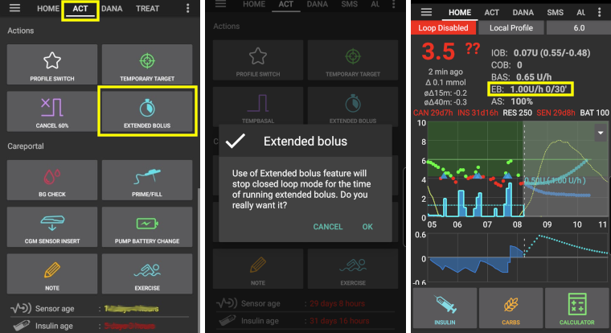

(Extended-Carbs-extended-carbs-ecarbs)=
# Carbohidrați extinși / eCarbs

## What are eCarbs and when are they useful?

Cu o pompă obișnuită, bolusurile extinse reprezintă o modalitate bună de a face față meselor grase sau altor mese absorbite lent care cresc glicemia pe termen mai lung decât al acțiunii insulinei. Cu toate acestea, într-un context de buclă, bolusurile extinse nu au nici un sens (și prezintă dificultăți tehnice); pentru că sunt de fapt o rată bazală fixă și temporară, care contravine modului de funcționare a buclei, care ajustează dinamic rata bazală. For details see [extended bolus](#extended-bolus-and-why-they-wont-work-in-closed-loop-environment) below.

Cu toate acestea, încă mai există necesitatea de a face față acestor mese. Which is why AAPS as of version 2.0 supports so called extended carbs or eCarbs.

Carbohidrații extinși sunt carbohidrații care sunt răspândiți de-a lungul câtorva ore. Pentru mesele standard cu mai mulți carbohidrați decât grăsimi/proteină, de obicei este suficient să se introducă carbohidrații înainte (și să se reducă valoarea bolusului inițial, dacă este necesar) pentru a preveni administrarea prea rapidă a insulinei.  Dar pentru mesele cu absorbție mai lentă, unde introducerea întregii cantități de carbohidrați de la început duce la un surplus de insulină activă (IOB) din cauza micro-bolusurilor automate (SMB), se pot folosi carbohidrații extinși pentru a simula mai precis modul în care carbohidrații (și orice echivalent de carbohidrați introdus pentru alți macronutrienți) sunt absorbiți și influențează glicemia. Cu această informație, bucla poate administra SMB mai granular pentru a face față acestor carbohidrați, ceea ce poate fi văzut ca un bolus extins dinamic (acest lucru ar trebui să funcționeze și fără SMB, dar este probabil mai puțin eficace).

**Note:** eCarbs aren't limited to fatty / protein heavy meals: they can be also be used to help in any situation where there are influences that increase the blood sugar, e.g. other medication like corticosteroids.

## Mechanics of using eCarbs

To enter eCarbs, set a duration in the *Carbs* dialog on the overview tab, the total carbs and optionally a time shift (*numbers below are just examples, you will need to try your own values to arrive at satisfactory glucose response for your use-cases*):

Carbohidrații extinși din vederea de ansamblu, țineți cont de carbohidrații din paranteze din câmpul COB, care arată carbohidrații în viitor:

______________________________________________________________________

A way to handle fat and protein with that feature is described here: [https://adriansloop.blogspot.com/2018/04/page-margin-0.html](https://adriansloop.blogspot.com/2018/04/page-margin-0.html)

______________________________________________________________________

## Recommended setup, example scenario, and important notes

The recommended setup is to use the OpenAPS SMB APS plugin, with SMBs enabled as well as the *Enable SMB with COB* preference being enabled.

A scenario e.g. for a Pizza might be to give a (partial) bolus up front via the *calculator* and then use the *carbs* button to enter the remaining carbs for a duration of 4-6 hours, starting after 1 or 2 hours.

**Important notes:** You'll need to try out and see which concrete values work for you of course. You might also carefully adjust the setting *max minutes of basal to limit SMB to* to make the algorithm more or less aggressive. În cazul meselor cu conținut scăzut de carbohidrați, și conținut ridicat lipidic sau proteic poate fi suficient să utilizați doar carbohidrați extinși fără bolusuri manuale (a se vedea postarea de blog de mai sus). Atunci când carbohidrații extinși sunt generați, o notă Careportal este, de asemenea, creată pentru a documenta toate intrările, pentru a facilita iterarea și îmbunătățirea intrărilor.

(extended-bolus-and-why-they-wont-work-in-closed-loop-environment)=
## Extended bolus and why they won't work in closed-loop environment?

După cum s-a menționat mai sus, bolusurile extinse sau multiunde nu funcționează cu adevărat într-un sistem de tip buclă închisă. [See below](#why-extended-boluses-wont-work-in-a-closed-loop-environment) for details

(Extended-Carbs-extended-bolus-and-switch-to-open-loop-dana-and-insight-pump-only)=
### Bolus extins și comutați la buclă deschisă - doar pompele Dana și Insight

Anumite persoane solicitau oricum opțiunea de a utiliza bolusul extins în AAPS, deoarece doreau să trateze alimentele speciale în felul în care se obișnuiseră.

Din acest motiv, cu versiunea 2.6 există opțiunea unui bolus extins pentru utilizatorii de pompe Dana și Insight.

- Closed loop will automatically be stopped and switched to open loop mode for the time running extended bolus.
- Unitățile bolusului, timpul rămas și timpul total vor fi afișate pe ecranul principal.
- On Insight pump extended bolus is *not available* if [TBR emulation](#Accu-Chek-Insight-Pump-settings-in-aaps) is used.

(why-extended-boluses-won-t-work-in-a-closed-loop-environment)=
### De ce bolusurile extinse nu vor funcționa într-un sistem buclă închisă

1. Bucla determină că acum 1,55U/h urmează să fie administrat. Dacă aceasta este administrată sub formă de bolus extins sau RBT nu contează pentru algoritm. De fapt, unele pompe folosesc bolusul extins. Ce ar trebui să se întâmple? Most pump drivers then stop the extended bolus -> You didn't even need to start it.

2. Dacă ați avut bolusul extins ca intrare, ce trebuie să se întâmple în model?

   1. Ar trebui ca acesta să fie considerat neutru împreună cu rata bazală (BR) și inclus în bucla? Apoi bucla ar trebui să poată reduce bolusul dacă, de exemplu, glicemia scade prea mult și toată insulina "neutră" este înlăturată?
   2. Ar trebui ca bolusul extins să fie doar adăugat? Deci buclei ar trebui să i se permită pur și simplu să continue? Chiar și cu cea mai severă hipoglicemie? Nu cred că este așa de bine: O hipoglicemie este prevăzută, însă nu trebuie prevenită?

3. IOB pe care bolusul extins îl acumulează se materializează după 5 minute la următoarea rulare. În consecință, bucla ar oferi mai puțină bazală. So not much changes... except that the possibility of hypo avoidance is taken.
