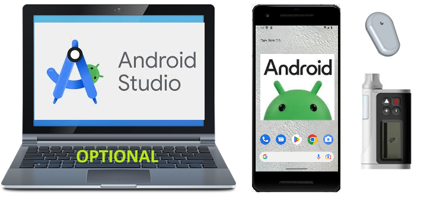

# Component Overview

**AAPS** is not just a (self-built) application, it is but one of several modules of your closed loop system. Before deciding for components, it would be a good idea to have a look at the component documentation.



```{admonition} IMPORTANT SAFETY NOTICE
:class: important

The foundation of **AAPS** safety features discussed in this documentation is built on the safety features of the hardware used to build your system. For closing an automated insulin dosing loop, it is critically important that you only use an insulin pump and CGM that are tested, fully functioning and approved by the official instances of your country. Hardware or software modifications to these components can cause unexpected insulin dosing, causing significant risk to the user. If you find or get offered broken, modified or self-made insulin pumps or CGM receivers, **do not use** these for creating an **AAPS** system.

Additionally, it is equally important to only use original supplies such as inserters, cannulas and insulin containers approved by the manufacturer for use with your pump or CGM. Using untested or modified supplies can cause CGM inaccuracy and insulin dosing errors. Insulin is highly dangerous when misdosed - please do not play with your life by hacking with your supplies.

Last but not least, you must not take SGLT-2 inhibitors (gliflozins) as they incalculably lower blood sugar levels. The combination with a system that lowers basal rates in order to increase BG is especially dangerous as due to the gliflozin this rise in BG might not happen and a dangerous state of lack of insulin can happen. [More information here](#PreparingForAaps-no-sglt-2-inhibitors).
```

## Necessary Modules

### Good individual dosage algorithm for your diabetes therapy

Even though this is not something to create or buy, this is the 'module' which is probably underestimated the most but essential. When you let an algorithm help manage your diabetes, it needs to know the right settings to not make severe mistakes. Even if you are still missing other modules, you can already verify and adapt your **Profile** in collaboration with your diabetes team.

The **Profile** includes:

- BR (Basal rates): provides background insulin;
- ISF (insulin sensitivity factor): how much your blood glucose level will be reduced by 1 unit of insulin;
- CR (carb ratio): how many grams of carbohydrate are covered by one unit of insulin;
- DIA (duration of insulin action).

Most loopers use circadian BR, ISF and CR, which adapt hormonal insulin sensitivity during the day.

More information about your **Profile** [on the dedicated page](../SettingUpAaps/YourAapsProfile.md).

### Phone

See the dedicated page [Phones](../Getting-Started/Phones.md).

### Pompa de insulină

Consultați pagina dedicată [Pompe compatibile](../Getting-Started/CompatiblePumps.md).

**Avantajele și dezavantajele unor modele de pompă**

Combo, Insight și modelul mai vechi Medtronic sunt pompe solide și cu funcție de buclă. Combo are avantajul că oferă mult mai multe tipuri de seturi de perfuzie din care puteți alege, deoarece are un conector Luer-Lock standard. Și bateria este una implicită pe care o poți cumpăra de la orice benzinărie, magazin deschis non-stop și, dacă chiar ai nevoie de una, o poți fura/împrumuta de la telecomanda din camera de hotel ;-).

Avantajele DanaR/RS și Dana-i față de Combo, ca pompă preferată, sunt însă:

- Asocierea inițială este mai simplă cu Dana-i/RS. Dar, de obicei, faceți asta o singură dată, așa că are impact doar dacă vreți să testați o nouă funcție cu pompe diferite.
- Până acum, Combo funcționează prin analizarea ecranului. În general, funcționează excelent, dar este lent. Pentru buclă, acest lucru nu contează prea mult, deoarece totul funcționează în fundal. Still there is much more time you need to be connected so more time when the BT connection might break, which isn't so easy if you walk away from your phone whilst bolusing & cooking.
- The Combo vibrates on the end of TBRs, the DanaR vibrates (or beeps) on SMB. At nighttime, you are likely to be using TBRs more than SMB.  The Dana-i/RS is configurable so that it does neither beep nor vibrate.
- Reading the history on the Dana-i/RS in a few seconds with carbs makes it possible to switch phones easily while offline and continue looping as soon as some CGM values are in.
- All pumps **AAPS** can talk with are waterproof on delivery. Only the Dana pumps are also "waterproof by warranty" due to the sealed battery compartment and reservoir filling system.

### Sursă valoare glicemie

See the dedicated page [Compatible CGMs](../Getting-Started/CompatiblesCgms.md).

### **AAPS**-.apk file

The main component of the system. In order to install the app, you have to build the apk-file yourself first. Instructions are [here](../SettingUpAaps/BuildingAaps.md).

### Reporting server

A reporting server displays your glucose and treatment data, and creates reports for detailed analysis. There are currently two reporting servers available for use with AAPS : [Nightscout](#SettingUpTheReportingServer-nightscout) and [Tidepool](#SettingUpTheReportingServer-tidepool). They both provide ways to visualize your diabetes data over time, provide statistics about the **time in range** (TIR) and other measures.

The Reporting server is independent of the other modules. If you don’t want to use a reporting server, you should know that it is not mandatory for running **AAPS** in the long term. But you still need to set up one as it will be required to fulfill [**Objective 1**](#objectives-objective1).

Additional information on how to set up your reporting server can be found [here](../SettingUpAaps/SettingUpTheReportingServer.md).

## Module opționale

### Ceas inteligent

You can choose any smartwatch with Android WearOS 2.x up to 4.x. **Beware, WearOS 5.x is not always compatible!**

Users are creating a [list of tested phones and watches](#Phones-list-of-tested-phones). There are different watchfaces for use with **AAPS**, which you can find [here](../WearOS/WearOsSmartwatch.md).

### xDrip+

Even if you don't need to have the xDrip+ App as **BG Source**, you can still use it for _i.e._ alarms or a different blood glucose display. You can have as many alarms as you want, specify the time when the alarm should be active, if it can override silent mode, etc. Some xDrip+ information can be found [here](../CompatibleCgms/xDrip.md). Vă rugăm să rețineți că documentația pentru această aplicație nu este întotdeauna actualizată, deoarece progresul său este destul de rapid.

## Ce trebuie făcut în timp ce așteptați modulele

It sometimes takes a while to get all the modules for closing the loop. Dar nu vă faceți griji, sunt multe lucruri pe care le puteți face în timp ce așteptați. It is **necessary** to check and (where appropriate) adapt basal rates (BR), insulin-carbratio (IC), insulin-sensitivity-factors (ISF) etc. And maybe open loop can be a good way to test the system and get familiar with **AAPS**. Using this mode, **AAPS** gives treatment recommendations you can manually execute.

You can keep on reading through the docs here, get in touch with other loopers online or offline, [read](../UsefulLinks/BackgroundReading.md) documentations or what other loopers write (even if you have to be careful, not everything is correct or good for you to reproduce).

**Gata?** Dacă aveți componentele **AAPS** împreună (felicitări!) sau cel puțin suficient pentru a începe în modul buclă deschisă, ar trebui să citiți mai întâi [descrierea obiectivului](../SettingUpAaps/CompletingTheObjectives.md) înaintea fiecărui nou obiectiv și să vă configurați echipamentul.
