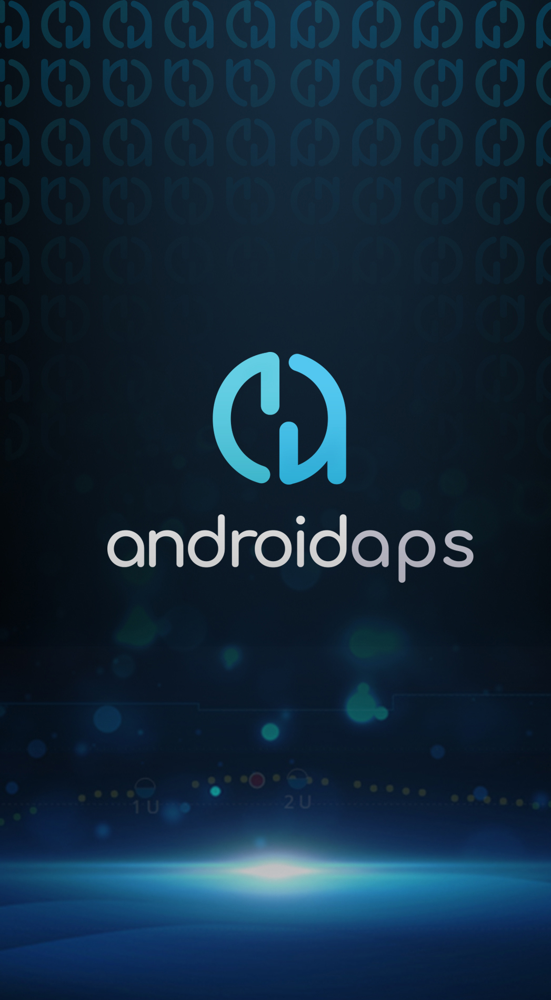

# Lista de telefoane testate

Utilizatorii au creat o [listă de telefoane și ceasuri testate](https://docs.google.com/spreadsheets/d/1gZAsN6f0gv6tkgy9EBsYl0BQNhna0RDqA9QGycAqCQc/edit?usp=sharing)

Puteți folosi filtre pentru a afișa anumite pompe sau telefoane, dar va trebui să ștergeți aceste filtre după ce ați reușit să vedeți ceea ce vă interesa, pentru ca și următoarele persoane să poată vedea întreaga listă.

Pentru a adăuga un telefon sau un ceas care nu este deja listat în acel fișier, vă rugăm să completați [formularul](https://docs.google.com/forms/d/e/1FAIpQLScvmuqLTZ7MizuFBoTyVCZXuDb__jnQawEvMYtnnT9RGY6QUw/viewform)

Orice probleme aveți cu foaia de calcul vă rugăm să trimiteţi email la hardware@androidaps.org, orice donaţii de modele de telefoane/ceasuri care mai au nevoie de testare vă rugăm să trimiteţi un e-mail la donations@androidaps.org.

# Fundalul telefonului

   Design: Thiago:)   Daca vrei sa iti înfrumusețezi telefonul cu mai multe imagini AndroidAPS, iti poti descarca imaginea de fundal de aici: 