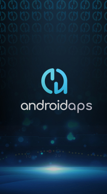

# Telefoane

Versiunea actuală a **AAPS** (3.4) necesită un telefon inteligent Android cu Google **Android 12.0 sau o versiune ulterioară**. If you are considering buying a new phone, (as of January 2026), **Android 16 is preferred**, Android 15 is not recommended.

Verificați [Facebook sau Discord](../GettingHelp/WhereCanIGetHelp.md) pentru cele mai recente actualizări pe acest subiect.

Utilizatorii sunt încurajați insistent să își mențină versiunea de **AAPS** la zi din motive de siguranță. Totuși, pentru utilizatorii care nu pot folosi un dispozitiv cu Android 12.0 sau o versiune mai nouă, versiunile anterioare de **AAPS** compatibile cu versiunile mai vechi de Android rămân disponibile; consultați: [Note de lansare](#maintenance-android-version-aaps-version).

- [Setări Jelly Pro](../CompatiblePhones/Jelly.md)
- [Setări Huawei](../CompatiblePhones/Huawei.md)

(Lista-de-telefoane-testate)=

## List of tested Phones

We maintain a list of the [tested hardware setups](https://docs.google.com/spreadsheets/u/1/d/e/2PACX-1vScCNaIguEZVTVFAgpv1kXHdsHl3fs6xT6RB2Z1CeVJ561AvvqGwxMhlmSHk4J056gMCAQE02sAWJvT/pubhtml?gid=683363241&single=true) that you can [explore with a friendly interface](https://vnniyb.github.io/androidAPS_testedHardwareEasyBrowser/). Contribute by filling out the [Google form](https://docs.google.com/forms/d/e/1FAIpQLSfoGKLYEx4aUAJ5RWL3xLJeNdmRyxtXmDzpGhuU3Rfcj2H_Jw/viewform) and adding your setup!

Această listă oferă feedback utilizatorilor cu privire la utilizarea unui telefon, împreună cu **AAPS** și o anumită pompă și CGM. Vă poate ajuta să verificați dacă telefonul / pompa / senzorul dumneavoastră a fost utilizat cu succes de alți utilizatori.

The document is read-only. With CRTL-F, you can search in the text of the Google sheet.

Pentru a vă înregistra testul unei configurații hardware, vă rugăm să completați acest [formular](https://docs.google.com/forms/d/e/1FAIpQLSfoGKLYEx4aUAJ5RWL3xLJeNdmRyxtXmDzpGhuU3Rfcj2H_Jw/viewform). După ce completați datele formularului, foaia se actualizează automat la fiecare 5 minute.

Dacă aveți probleme cu foaia de calcul, vă rugăm să contactați administratorul acesteia, *@theodoor5137*, pe Discord sau să consultați secțiunea [Unde pot primi ajutor? pagină](../GettingHelp/WhereCanIGetHelp.md).

## Nu mi-am găsit telefonul

Dacă aveți întrebări despre un anumit model de telefon, vă rugăm să căutați sau să adresați întrebări în [comunitatea noastră Facebook sau Discord](../GettingHelp/WhereCanIGetHelp.md).

Pentru a dona modele de telefoane sau ceasuri inteligente care încă necesită testare, vă rugăm să trimiteți un e-mail la adresa <donations@androidaps.org>.

(Telefoane-imagine-de-fundal-telefon)=

## Imagine de fundal pentru telefon

Dacă vrei să vă decorați telefonul cu și mai mult **AAPS**, vă puteți descărca imaginea de fundal [aici](../images/bg_phone.jpg)!

Design: Thiago :)