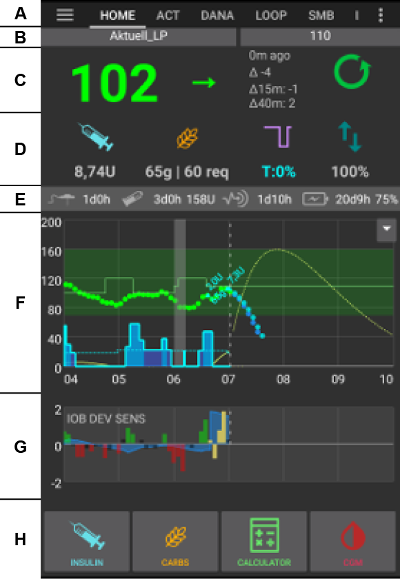
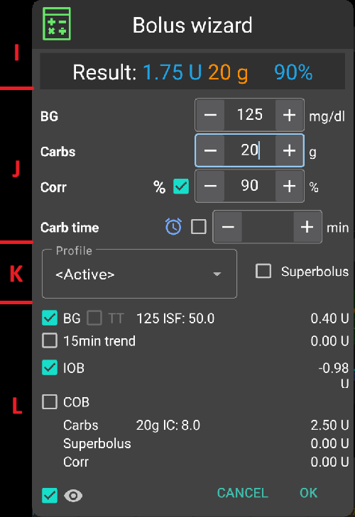
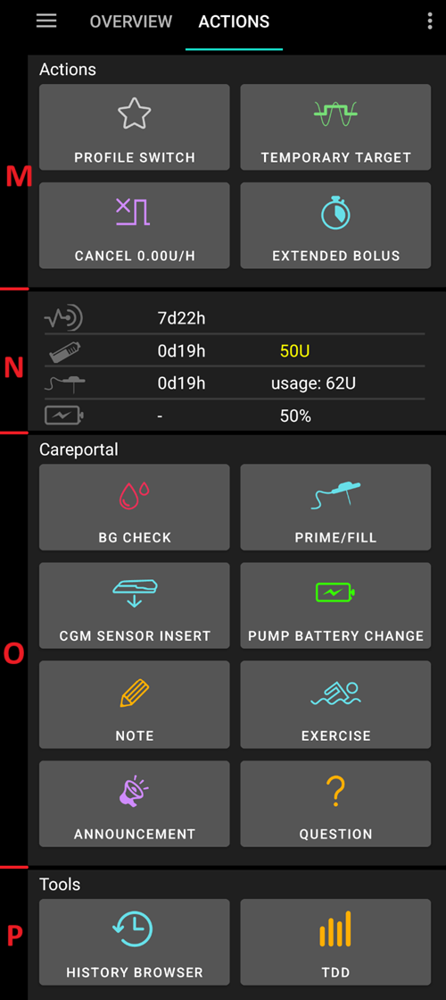
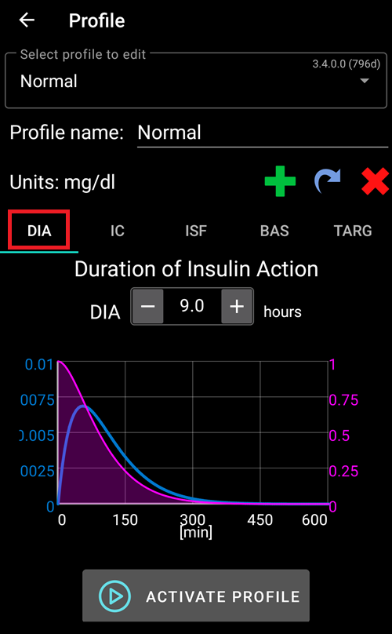

# Ecrane AndroidAPS

## Ecranul de pornire

Acesta este primul ecran pe care îl veți descoperi când deschideți AndroidAPS și conține majoritatea informațiilor de care veți avea nevoie zi de zi.

### Secțiunea A - Pagini

* Navigaţi între diferitele module AndroidAPS.
* Alternativ, puteţi schimba ecranele glisând în stânga sau în dreapta.
* Paginile afișate pot fi selectate în [config builder](../Configuration/Config-Builder#tab-or-hamburger-menu).

### Secţiunea B - Profil & ţintă

#### Profil curent

* Profilul curent este afișat în bara din stânga.
* Apăsați scurt pe bara de profil pentru a vizualiza detaliile profilului
* Apăsați lung pe bara de profil pentru a [schimba între diferite profiluri](../Usage/Profiles#profile-switch).
* Dacă schimbarea profilului a fost făcută cu durată, timpul rămas în minute este afișat între paranteze.

#### Țintă

* Nivelul ţintă actual al glicemiei este indicat în bara din dreapta.
* Apăsaţi scurt bara ţintă pentru a seta o [ţintă temporară](../Usage/temptarget.md).
* Dacă ținta temporară este setată, bara devine galbenă și timpul rămas în minute este afișat între paranteze.

#### Vizualizarea ajustării dinamice a țintei

* AAPS poate ajusta dinamic ţinta bazându-se pe sensibilitate dacă folosiţi algoritmul SMB.
* Activaţi fie una, fie ambele din [următoarele opţiuni](../Configuration/Preferences#openaps-smb-settings) 
   * "sensibilitatea ridica ţinta" si/sau 
   * "rezistența la insulină poate coborî ţinta" 
* Dacă AAPS detectează rezistenţă sau sensibilitate, ţinta se va modifica de la ce este setat din profil. 
* Când modifică ţinta glicemiei, fundalul se va schimba în verde.

### Secţiunea C - Glicemie & stare buclă

#### Valoarea actuală a glicemiei

* Ultima citire a glicemiei din CGM este afişată în partea stângă.
* Culoarea valorii glicemiei reflectă starea pentru [intervalul](../Configuration/Preferences#range-for-visualization) stabilit. 
   * verde = în interval
   * roşu = sub interval
   * galben = deasupra intervalului
* Zona gri din mijloc arată minutele de la ultima citire si schimbări de la ultima citire, in ultimele 15 si 40 de minute.

#### Stare buclă

* O nouă iconiță arată starea buclei:
   
   * cerc verde = buclă funcționează
   * cerc verde cu linie punctată = [suspendare hipoglicemie (LGS)](../Usage/Objectives#objective-6-starting-to-close-the-loop-with-low-glucose-suspend)
   * cerc roșu = buclă dezactivată (nu funcționează permanent)
   * cerc galben = buclă suspendată (temporar întreruptă, dar insulina bazală va fi administrată) - timpul rămas este afișat sub iconiță
   * cerc gri = pompa deconectată (temporar nu se administrează nici un fel de insulină) - timpul rămas este afișat sub iconiță
   * cerc portocaliu = rulează super bolus - timpul rămas este afișat sub iconiță
   * cerc albastru cu linie punctată = buclă deschisă

* Apăsați scurt sau apăsați lung pe iconiță pentru a deschide Dialog Buclă pentru a schimba modul buclei (Închisă, Suspendare hipoglicemie, Deschisă sau Dezactivată), suspendare / reactivare buclă sau deconectare / reconectare pompă.
   
   * Dacă apăsați scurt pe iconița Buclei, este necesară o validare după selecția în Dialog Buclă
   
   

### Secţiunea D - IOB, COB, BR și AS

* Seringa: insulină la bord (IOB) - cantitatea de insulină activă din interiorul corpului
   
   * Insulina la bord va fi zero dacă rulează doar basala standard şi nu mai există insulină care să fi rămas din bolusurile anterioare. 
   * IOB poate fi negativ dacă s-au înregistrat recent perioade de bazală redusă.
   * Apăsați iconița pentru a vedea împărțirea insulinei între bolus și bazală

* Spic de grâu: [carbohidrați la bord (COB)](../Usage/COB-calculation.rst) - carbohidrați încă neabsorbiți pe care i-ați consumat anterior -> iconița pulsează dacă sunt necesari carbohidrați

* Linie violetă: rata bazală – modificările iconiței reflectă modificările temporare ale ratei bazale (plat la 100%) 
   * Apăsați iconița pentru a vedea rata bazalei și detaliile oricărei bazale temporare (inclusiv durata rămasă)
* Săgeți sus & jos: indică starea actuală [autosens](../Usage/Open-APS-features#autosens) (activată sau dezactivată) și valoarea este afișată sub iconiță

#### Carbohidrați necesari

* Sunt oferite sugestii pentru carbohidrați atunci când design-ul de referință detectează că este nevoie de carbohidrați.
* Acest lucru se întâmplă când algoritmul oref crede ca nu poate opri hipoglicemia doar setând livrarea de insulina la zero si vei avea nevoie de carbohidrați.
* Notificările pentru carbohidrați sunt mult mai sofisticate decât calculatoarele pentru bolus. S-ar putea să vedeți sugestii pentru carbohidrați în timp ce calculatorul de bolus nu arată carbohidrați lipsă.
* Carb required notifications can be pushed to Nightscout if wished, in which case an announcement will be shown and broadcast.

### Secţiunea E - Lumini de stare

* Status lights give a visual warning for 
   * Vechime canulă
   * Insulin age (days reservoir is used)
   * Reservoir level (units)
   * Sensor age
   * Vârsta şi nivelul bateriei (%)
* If threshold warning is exceeded, values will be shown in yellow.
* If threshold critical is exceeded, values will be shown in red.
* Setările pot fi făcute în [preferinţe](../Configuration/Preferences#status-lights).

### Secţiunea F - Grafic principal

* Graficul prezintă glicemia dumneavoastră (BG), așa cum se citeşte de către sistemul de monitorizare a glicemiei (CGM). 
* Aici se afișează notițele introduse în pagina de acțiune, cum ar fi calibrările și intrările de carbohidrați precum și schimbările de profil. 
* Apăsați lung pe grafic pentru a schimba intervalul de timp. Puteţi alege 6, 12, 18 sau 24 ore.
* Zona verde reflectă intervalul tău țintă. Poate fi configurat în [preferinţe](../Configuration/Preferences#range-for-visualization).
* Triunghiurile albastre afișează [SMB](../Usage/Open-APS-features#super-micro-bolus-smb) - dacă este activat în [preferințe](../Configuration/Preferences#openaps-smb-settings).
* Informaţii opţionale:
   
   * Predicții
   * Basals
   * Activitate - curba activităţii insulinei

#### Activare informaţii opţionale

* Faceţi click pe triunghiul din partea dreaptă a graficului principal pentru a selecta care informaţii vor fi afişate în graficul principal.
* Pentru graficul principal doar cele trei opţiuni de deasupra liniei "\---\---- Graph 1 \---\----" sunt disponibile.
   
   

#### Linii de predicție

* Linia **Portocalie**: [COB](../Usage/COB-calculation.rst) (culoarea este folosită în general pentru a reprezenta COB și carbohidrați)
   
   Linia de predicție arată încotro va evolua glicemia dvs. (nu cum vor fi absorbite glucidele deja mâncare: CoB!) pe baza setărilor actuale ale pompei și presupunând că deviațiile datorate absorbției de carbohidrați rămân constante. Această linie apare numai dacă există COB cunoscuţi.

* Linia **Albastru închis**: IOB (culoarea este folosita in general pentru a reprezenta IOB si insulina)
   
   Linia de predicţie arată ce s-ar întâmpla sub influenţa doar a insulinei. De exemplu, dacă ați administrat o anumită cantitate de insulină şi apoi nu aţi mâncat nici un fel de carbohidrati.

* Linia **Albastră**: zero-temp (glicemia prezisă dacă se va stabili rata bazală temporară la 0%)
   
   Linia de predicţie arată cum s-ar modifica curba IOB dacă pompa ar opri toate livrările de insulină (0% TBR).

* Linia **galben închis**: [UAM](../Configuration/Sensitivity-detection-and-COB#sensitivity-oref1) (mese neanunțate)
   
   Mesele inopinate (neanunțate) înseamnă că se detectează o creştere semnificativă a nivelului glicemiei din cauza meselor, a adrenalinei sau a altor influenţe. Linia de predicție este similară cu linia PORTOCALIE COB, dar presupune că devierile vor scădea în ritm constant (prin extinderea ratei actuale de reducere).

De obicei, curba reală a glicemiei ajunge în mijlocul acestor linii, sau aproape de cea care face presupuneri care se apropie cel mai mult de situația ta.

#### Basals

* Linia **albastră groasă** afișează livrarea bazală a pompei și reflectă livrarea efectivă de-a lungul timpului.
* Linia **albastră punctată** afișează cum ar fi rata bazală dacă nu ar exista ajustări temporare ale bazalei (TBRs).
* Când se administrează rata bazală standard, zona de sub curbă este indicată in culoarea albastru închis.
* Când rata bazală este ajustată temporar (crescând-o sau scăzând-o), zona de sub curba este indicată în albastru deschis.

#### Activitate

* Linia **galbenă subțire** arată activitatea Insulinei. 
* Aceasta se bazează pe scăderea preconizată a concentraţiei plasmatice a insulinei în sistemul dumneavoastră dacă nu au fost prezenţi alţi factori (cum sunt carbohidraţii).

### Secţiunea G - grafice suplimentare

* Puteţi activa până la patru grafice suplimentare sub graficul principal.
* Pentru a deschide setările pentru graficele suplimentare, faceți clic pe triunghiul din partea dreaptă a [graficului principal](../Getting-Started/Screenshots#section-f-main-graph) și derulați în jos.

* Pentru a adăuga un grafic suplimentar, bifaţi caseta din partea stângă a numelui său (de ex. \---\---- Graph 1 \---\----).

#### Absolute insulin

* Insulina activă, inclusiv bolusuri **şi bazală**.

#### Insulină la bord

* Arată insulina pe care o aveţi la bord (= insulină activă în corpul dumneavoastră). Include insulina din bolus și bazala temporară (**dar exclude ratele bazale stabilite în profilul dvs.**).
* Acesta ar fi zero dacă nu ar exista [SMB-uri](../Usage/Open-APS-features#super-micro-bolus-smb), nici bolusuri și nici TBR pe durata DIA.
* IOB poate fi negativ dacă nu mai aveți insulină din bolusuri și zero/low temp de o perioadă mai lungă de timp.
* Consumarea insulinei depinde de [DIA şi de profilul de insulină](../Configuration/Config-Builder#local-profile-recommended). 

#### Carbohidrați activi

* Arată carbohidrații pe care îi aveți la bord (= activi, nu sunt încă dezintegrați în corpul dumneavoastră). 
* Consumarea lor depinde de abaterile pe care le detectează algoritmul. 
* Dacă algoritmul detectează o absorbție de carbohidrați mai mare decât cea așteptată, se administrează insulină, iar aceasta creşte cantitatea de IOB (mai mult sau mai puţin, în funcţie de condiţiile dumneavoastră de siguranţă). 

#### Deviații

* Barele **GRI** afișează o deviație cauzată de carbohidrați. 
* Barele **VERZI** afișează că Glicemia este mai mare decât algoritmul se aștepta să fie. Barele verzi sunt folosite pentru a crește rezistenta în [Autosens](../Usage/Open-APS-features#autosens).
* Barele **ROȘII** afișează că Glicemia este mai mică decât algoritmul se aștepta să fie. Barele roșii sunt folosite pentru a crește sensibilitatea în [Autosens](../Usage/Open-APS-features#autosens).
* Barele **GALBENE** afișează o deviație cauzată de UAM.
* Barele **NEGRE** afișează mici abateri care nu sunt luate în considerare pentru sensibilitate

#### Sensibilitate

* Prezintă sensibilitatea pe care a detectat-o [Autosens](../Usage/Open-APS-features#autosens). 
* Sensibilitatea este un calcul al sensibilităţii la insulină ca rezultat al exerciţiilor fizice, hormonilor etc.

#### Activitate

* Arată activitatea insulinei, calculată în funcţie de profilul insulinei (nu este derivat din IOB). 
* Valoarea este mai mare pentru insulina în apropierea momentului de vârf.
* Ar însemna să fie negativă atunci când IOB scade. 

#### Deviation slope

* Valoare internă utilizată în algoritm.

### Secţiunea H - Butoane

* Butoanele pentru insulină, carbohidrati şi calculator sunt 'întotdeauna active'. 
* Alte Butoane trebuie să fie setate în [preferinţe](../Configuration/Preferences#buttons).

#### Insulină

* To give a certain amount of insulin without using [bolus calculator](#bolus-wizard).
* Prin bifarea căsuței poți să pornești automat [ținta temporară pentru masă în curând](../Configuration/Preferences#default-temp-targets).
* Dacă nu doriţi să bolusaţi prin pompă, dar doriți să înregistraţi cantitatea de insulină (de exemplu insulină administrată cu siringa) bifaţi căsuța corespunzătoare.

#### CH

* Pentru a înregistra carbohidrați fără bolusare.
* Anumite [ținte temporare prestabilite](../Configuration/Preferences#default-temp-targets) pot fi selectate direct prin bifarea unei casuțe.
* Decalaj de timp: Când vei mânca / ai mâncat carbohidrați (în minute).
* Durată: Se vor folosi pentru ["carbohidrați extinși"](../Usage/Extended-Carbs.rst)
* Puteți folosi butoanele pentru a crește rapid cantitatea de carbohidrați.
* Notes will be uploaded to Nightscout - depending on your settings for [NS client](../Configuration/Preferences#nsclient).

#### Calculator

* See Bolus Wizard [section below](#bolus-wizard)

#### Calibrări

* Trimite o calibrare la xDrip+ sau deschide dialogul de calibrare cu Dexcom.
* Trebuie să fie activat în [preferinţe](../Configuration/Preferences#buttons).

#### CGM

* Deschide xDrip+.
* Butonul Înapoi revine la AAPS.
* Trebuie să fie activat în [preferinţe](../Configuration/Preferences#buttons).

#### Asistent Rapid

* Introduceți cu ușurință cantitatea de carbohidrați și stabiliți calculele de bază.
* Detaliile sunt stabilite în [preferinţe](../Configuration/Preferences#quick-wizard).

## Asistent Bolus

Când doriţi să faceţi un bolus pentru o masă, în mod normal de aici veţi face asta.

### Secţiunea I

* Câmpul Glicemie este deja completat cu ultima citire din CGM. Dacă nu aveţi un CGM funcţional, atunci acesta va fi gol. 
* În câmpul CARBOHIDRAȚI adăugați cantitatea de carbohidrați - sau echivalent - pentru care doriți să faceți bolus. 
* Câmpul CORECȚIE este dacă doriţi să modificaţi dozajul final dintr-un anumit motiv.
* Câmpul DECALAJ CARB este pentru pre-bolusare, astfel încât să puteţi spune sistemului că va fi o întârziere până când vor apărea carbohidrații. Puteţi să puneţi un număr negativ în acest câmp dacă bolusați pentru carbohidrați anteriori.

#### Memento pentru masă

* Pentru carbohidrații din viitor căsuța de alarmă poate fi selectatată (e implicit atunci cand este introdus un timp în viitor) astfel încât să vă puteți aminti la un moment dat in viitor când să mâncați carbohidrații pe care i-ați introdus în AndroidAPS
   
   

### Secţiunea J

* SUPER BOLUS este cazul în care insulina bazală pentru următoarele două ore este adăugată în bolus imediat şi se emite RBT=0 pentru următoarele două ore pentru a prelua insulina suplimentară. The option only shows when "Enable [superbolus](../Configuration/Preferences#superbolus) in wizard" is set in the [preferences overview](../Configuration/Preferences#overview).
* Ideea este de a livra insulina mai devreme în speranța de a reduce vârfurile.
* Pentru detalii vizitați [diabetesnet.com](https://www.diabetesnet.com/diabetes-technology/blue-skying/super-bolus/).

### Secţiunea K

* Arată bolus-ul calculat. 
* În cazul în care cantitatea de insulină la bord depăşeşte bolusul calculat, atunci aceasta va afişa doar cantitatea de carbohidrați care mai sunt necesari.
* Notes will be uploaded to Nightscout - depending on your settings for [NS client](../Configuration/Preferences#nsclient).

### Secţiunea L

* Detalii despre asistentul de calculul al bolusului.
* Puteți deselecta orice pe care nu doriți să îl includeți dar, în mod normal, nu ați dori să îl faceți.
* Din motive de siguranţă, **căsuța TT trebuie să fie bifată manual** dacă doriţi ca asistentul de bolus să calculeze pe baza unei ţinte temporare existente.

#### Combinaţii de COB şi IOB şi ce înseamnă acestea

* Pentru motive de siguranţă, IOB nu poate fi debifat atunci când căsuța COB este bifată deoarece s-ar putea să existe riscul unei cantitați prea mari de insulină deoarece AAPS nu calculează pentru ceea ce a fost deja administrat.
* Dacă bifaţi COB şi IOB, vor fi luați în considerare carbohidraţi neabsorbiţi care nu sunt incă acoperiţi de insulină + toată insulina care a fost eliberată sub formă de RBT sau SMB.
* Dacă bifaţi IOB fără COB, AAPS ia în considerare insulina deja eliberată, dar nu o va acoperi în raport cu niciun carbohidrat care nu a fost încă absorbit. Acest lucru conduce la o notiță "carbohidrați lipsă”.
* Dacă bolusați pentru **mâncare suplimentară** la scurt timp după o masă (de ex. desert suplimentar) poate fi util să **debifați toate căsuţele**. În acest fel, doar noii carbohidrați sunt adăugați deoarece masa principală nu va fi absorbită așa că IOB nu se potrivește cu precizie cu COB la scurt timp după un bolus de masă.

#### Detectare cantitate COB greșită 

* Dacă vedeţi avertismentul de mai sus după utilizarea asistentului de bolus, AndroidAPS a detectat că valoarea COB calculată poate fi greşită. 
* Așadar, dacă doriți să faceți din nou bolus după o masă anterioară cu COB, trebuie să fiți conștienți de suprapunere! 
* Pentru detalii vezi indiciile la [COB pagina de calcul](../Usage/COB-calculation#detection-of-wrong-cob-values).

## Pagina Acțiuni

### Acțiuni - secțiunea M

* Button [profile switch](../Usage/Profiles#profile-switch) as an alternative to pressing the [current profile](../Getting-Started/Screenshots#section-b-profile-target) on homescreen.
* Button [temporary target](../Usage/temptarget#temp-targets) as an alternative to pressing the [current target](../Getting-Started/Screenshots#section-b-profile-target) on homescreen.
* Button to start or cancel a temporary basal rate. Please note that the button changes from “TEMPBASAL” to “CANCEL x%” when a temporary basal rate is set.
* Even though [extended boluses](../Usage/Extended-Carbs#extended boluses) do not really work in a closed loop environment some people were asking for an option to use extended bolus anyway.
   
   * This option is only available for Dana RS and Insight pumps. 
   * Closed loop will automatically be stopped and switched to open loop mode for the time running extended bolus.
   * Make sure to read the [details](../Usage/Extended-Carbs#extended boluses) before using this option.

### Careportal - section N

* Displays information on
   
   * sensor age & level (battery percentage)
   * insulin age & level (units)
   * canula age
   * pump battery age & level (percentage

* Less information will be shown if [low resolution skin](../Configuration/Preferences#skin) is used.

#### Sensor level (battery)

* Needs xDrip+ nightly build Dec. 10, 2020 or newer.
* Works for CGM with additional transmitter such as MiaoMiao 2. (Technically sensor has to send cat level information to xDrip+.)
* Thresholds can be set in [preferences](../Configuration/Preferences#status-lights).
* If sensor level is the same as phone battery level you xDrip+ version is probably too old and needs an update.
   
   

### Careportal - section O

* BG check, prime/fill, sensor insert and pump battery change are the base for the data displayed in [section N](#careportal-section-n).
* Prime/Fill allows you to record pump site and insulin cartridge change.
* Section O reflects the Nightscout careportal. So exercise, announcement and question are special forms of notes.

### Instrumente - secţiunea P

#### Vizualizare istoric

* Vă permite să mergeți înapoi prin istoricul AAPS.

#### TDD

* Doza zilnică totală = bolus + bazală pe zi
* Some doctors use - especially for new pumpers - a basal-bolus-ratio of 50:50. 
* Therefore ratio is calculated as TDD / 2 * TBB (Total base basal = sum of basal rate within 24 hours). 
* Others prefer range of 32% to 37% of TDD for TBB. 
* Like most of these rules-of-thumb it is of limited real validity. Note: Your diabetes may vary!

## Insulin Profile

* This shows the activity profile of the insulin you have chosen in [config builder](../Configuration/Config-Builder#insulin). 
* The PURPLE line shows how much insulin remains after it has been injected as it decays with time and the BLUE line shows how active it is.
* The important thing to note is that the decay has a long tail. 
* If you have been used to manual pumping you have probably been used to assuming that insulin decays over about 3.5 hours. 
* However, when you are looping the long tail matters as the calculations are far more precise and these small amounts add up when they are subjected to the recursive calculations in the AndroidAPS algorithm.

For a more detailed discussion of the different types of insulin, their activity profiles and why all this matters you can read an article here on [Understanding the New IOB Curves Based on Exponential Activity Curves](https://openaps.readthedocs.io/en/latest/docs/While%20You%20Wait%20For%20Gear/understanding-insulin-on-board-calculations.html#understanding-the-new-iob-curves-based-on-exponential-activity-curves)

And you can read an excellent blog article about it here: [Why we are regularly wrong in the duration of insulin action (DIA) times we use, and why it matters…](https://www.diabettech.com/insulin/why-we-are-regularly-wrong-in-the-duration-of-insulin-action-dia-times-we-use-and-why-it-matters/)

And even more at: [Exponential Insulin Curves + Fiasp](https://seemycgm.com/2017/10/21/exponential-insulin-curves-fiasp/)

## Stare pompă

* Different information on pump status. Displayed information depends on your pump model.
* See [pumps page](../Hardware/pumps.rst) for details.

## Care Portal

Careportal replicated the functions you will find on your Nightscout screen under the “+” symbol which allows you to add notes to your records.

### Review carb calculation

* If you have used the [Bolus Wizard](../Getting-Started/Screenshots#bolus-wizard) to calculate insulin dosage you can review this calculation later on treatments tab.
* Just press the green Calc link. (Depending on pump used insulin and carbs can also be shown in one single line in treatments.)

### Carb correction

Treatment tab can be used to correct faulty carb entries (i.e. you over- or underestimated carbs).

1. Check and remember actual COB and IOB on homescreen.
2. Depending on pump in treatment tab carbs might be shown together with insulin in one line or as a separate entry (i.e. with Dana RS).
3. Remove the entry with the faulty carb amount.
4. Make sure carbs are removed successfully by checking COB on homescreen again.
5. Do the same for IOB if there is just one line in treatment tab including carbs and insulin.
   
   -> If carbs are not removed as intended and you add additional carbs as explained here (6.), COB will be too high and that might lead to too high insulin delivery.

6. Enter correct carb amount through carbs button on homescreen and make sure to set the correct event time.

7. If there is just one line in treatment tab including carbs and insulin you have to add also the amount of insulin. Make sure to set the correct event time and check IOB on homescreen after confirming the new entry.

## Buclă, AMA / SMB

* Aceste pagini prezintă detalii despre calculele algoritmului și de ce AAPS acționează în modul în care funcționează.
* Calculele se fac de fiecare dată când sistemul primește o nouă citire de la CGM.
* Pentru mai multe detalii vedeţi [secțiunea APS din pagina config builder](../Configuration/Config-Builder#aps).

## Profil

* Profilul conţine informaţii despre setările personale ale diabetului:
   
   * DIA (Durata de Acțiune a Insulinei)
   * IC sau I:C: Raportul insulină la carbohidrați
   * ISF: Factorul de sensibilitate la insulină
   * Basal rate
   * Ținta: Nivelul glicemiei pe care doriţi ca AAPS să îl atingă

* Puteţi fie să utilizaţi un [profil local](../Configuration/Config-Builder#local-profile-recommended) care poate fi editat pe telefon sau un [profil Nightscout](../Configuration/Config-Builder#ns-profile) care trebuie să fie editat pe pagina NS şi să fie transferat după aceea în telefonul dumneavoastră. Pentru detalii vedeţi secţiunile corespunzătoare de pe [pagina config builder](../Configuration/Config-Builder.md).

## Tratament

Istoricul următoarelor tratamente:

* Bolus & carbohidrați -> opțiune de [ștergere intrări](../Getting-Started/Screenshots#carb-correction) pentru a corecta istoricul
* [Bolus extins](../Usage/Extended-Carbs#extended-bolus)
* Rată bazală temporară
* [Ţintă temporară](../Usage/temptarget.md)
* [Schimbare de profil](../Usage/Profiles.md)
* [Careportal](../Usage/CPbefore26#careportal-discontinued) - notițe introduse prin intermediul paginii de acțiuni și notițe în dialoguri

## Sursă Glicemie - xDrip, aplicația Dexcom (modificată)...

* În funcţie de setările sursei de Glicemie, această pagină este denumită diferit.
* Afișează istoricul citirilor CGM și oferă opțiunea de eliminare a citirilor în caz de eroare (adică hipo cauzat de compresie).

## Client NS

* Afişează starea conexiunii cu site-ul dumneavoastră Nightscout.
* Setările se fac în [preferinţe](../Configuration/Preferences#nsclient). Puteți deschide secțiunea corespunzătoare făcând clic pe roata dințată din partea dreaptă sus a ecranului.
* Pentru depanare, vedeți această [pagină](../Usage/Troubleshooting-NSClient.md).