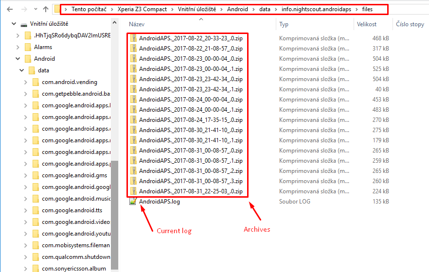

(Accessing-logfiles-accessing-logfiles)=

# Accessing logfiles

* Connect phone to a computer in file transfer mode
* Localizați fișierele de jurnal în directorul de date AAPS, în `Android\data\info.nightscout.androidaps\files`.  
    Denumirea dosarului rădăcină de stocare poate varia puțin în funcție de telefon.
* The location is `Android\data\info.nightscout.aapsclient\files` for [AAPSClient](#RemoteControl_aapsclient).
* Note : log location has changed in **AAPS 3.3**. See the previous versions' documentation if needed.

* The current log is a .log file which can be viewed in a number of ways such as [LogCat](https://developer.android.com/studio/debug/am-logcat.html) within Android Studio, any Log Viewer android app, or simply as plain text. 
* Previous log files are zipped and stored in folders in date/time order. 
* If you are sharing your log file in [discord](https://discord.gg/4fQUWHZ4Mw) to talk about a potential bug, please unzip and upload the file dated before the error occurred.