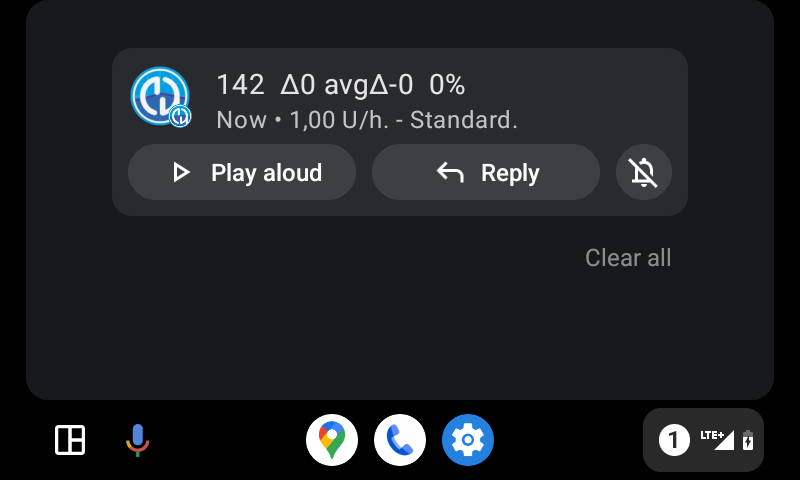
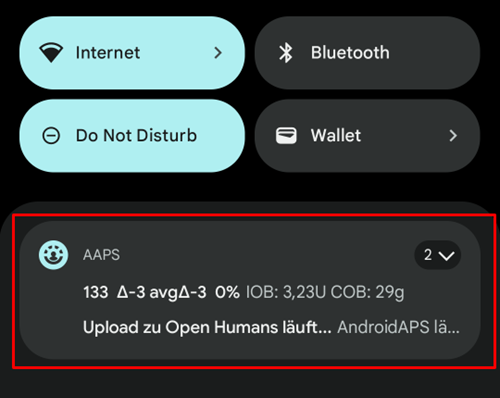
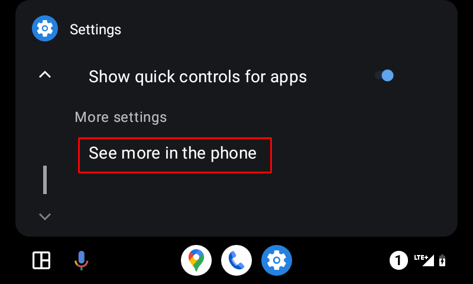
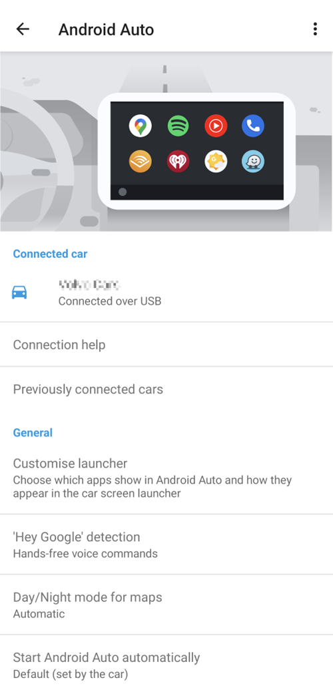

# Android Auto

**AAPS** este capabil să vă trimită informații despre starea dumneavoastră curentă ca mesaj, direct în Android Auto în mașina dumneavoastră.

```{admonition} version and last change information :class: dropdown date of last edit: 07/05/2023

versiuni utilizate pentru documentație:

* AAPS 3.2.0-dev-i
* Android Auto: 9.3.631434-release ```

## Cerințe

**AAPS** utilizează o caracteristică a Android Auto care permite ca mesajele de la aplicațiile de pe mobil să fie direcționate către afișarea Auto Audio în mașină.

Aceasta înseamnă că:

* Trebuie să configurați **AAPS** pentru a utiliza notificările de sistem pentru alerte și notificări și
* Cum **AAPS** este o aplicație neoficială, permiteți utilizarea de "surse necunoscute" cu Android Auto.



## Utilizați notificările de sistem în AAPS pentru alerte și notificări

Deschideți meniul în 3 puncte din dreapta sus în **AAPS** și selectați **Preferințe**


În **Alerte locale** activați **Utilizați notificările de sistem pentru alerte și notificări**


Verificați acum dacă primiți notificări de la **AAPS** pe telefon înainte de a merge la mașina dumneavoastră!



## Permiteți utilizarea de "surse necunoscute" cu Android Auto.

Deoarece **AAPS** nu este o aplicație Android oficială, notificările trebuie să fie activate pentru "surse necunoscute" în Android Auto. Acest lucru se face prin utilizarea modului de dezvoltator pe care vi-l vom arăta aici.

Mergeți la mașină și conectați-vă telefonul mobil cu sistemul audio pentru mașini.

Ar trebui să vedeți acum un ecran similar cu acest ecran.


Apăsați pe pictograma **setare** pentru a începe configurarea.

Derulați în jos până la sfârșitul paginii și selectați **vedeți mai multe în telefon**.



Acum, pe mobil vom activa modul de dezvoltator.

Primul ecran arată așa. Derulează în jos până la sfârșitul paginii.



Aici vedeți versiunea de Android Auto prezentată. Atingeți de 10 ori (în cuvinte zece) pe versiunea Android Auto. Cu această combinație ascunsă ați activat acum modul de dezvoltator.


Confirmați că doriți să activați modul dezvoltator în dialogul modal "Permiteți setările de dezvoltare?".


În setările **pentru dezvoltator** activați "Surse necunoscute".


Acum puteți ieși din modul de dezvoltator dacă doriți. Atingeți meniul cu trei puncte din dreapta sus pentru a face asta.

## Afișați notificările în mașină

Apăsați pe **pictograma număr** din partea dreaptă jos a Android Auto din mașina dumneavoastră.


Datele dumneavoastră CGM vor fi afișate după cum urmează:


## Depanare:

* Dacă nu vedeți notificarea, verificați dacă [ați permis AAPS să afișeze notificările](#use-system-notifications-in-aaps-for-alerts-and-notifications) în Android și dacă [Android Auto are drepturi de acces la notificări](#allow-the-use-of-unknown-sources-with-android-auto).