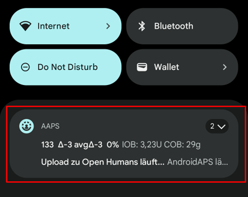

# Android Auto

**AAPS** este capabil să vă trimită informații despre starea dumneavoastră curentă ca mesaj, direct în Android Auto în mașina dumneavoastră.

## Cerințe

**AAPS** utilizează o caracteristică a Android Auto care permite ca mesajele de la aplicațiile de pe mobil să fie direcționate către afișarea Auto Audio în mașină.

Aceasta înseamnă că:

* Android must allow **AAPS** to show notifications and
* Cum **AAPS** este o aplicație neoficială, permiteți utilizarea de "surse necunoscute" cu Android Auto.

## Check that AAPS can show notifications

**AAPS** always shows a status notification with your current glucose, IOB and COB. This is the notification that Android Auto displays in the car. There is nothing to switch on in **AAPS**, but Android must allow **AAPS** to show notifications.

On your phone, open **Settings** > **Apps** > **AAPS** > **Notifications** and make sure **All AAPS notifications** is on.

Scroll down and make sure **Ongoing status** is on: this is the channel of the status notification.

Please check now that you see the **AAPS** status notification on the phone before you walk to your car!

## Permiteți utilizarea de "surse necunoscute" cu Android Auto.

Deoarece **AAPS** nu este o aplicație Android oficială, notificările trebuie să fie activate pentru "surse necunoscute" în Android Auto. Acest lucru se face prin utilizarea modului de dezvoltator pe care vi-l vom arăta aici.

Mergeți la mașină și conectați-vă telefonul mobil cu sistemul audio pentru mașini.

Ar trebui să vedeți acum un ecran similar cu acest ecran.

Apăsați pe pictograma **setare** pentru a începe configurarea.

Derulați în jos până la sfârșitul paginii și selectați **vedeți mai multe în telefon**.

Acum, pe mobil vom activa modul de dezvoltator.

Primul ecran arată așa. Derulează în jos până la sfârșitul paginii.

Aici vedeți versiunea de Android Auto prezentată. Atingeți de 10 ori (în cuvinte zece) pe versiunea Android Auto. Cu această combinație ascunsă ați activat acum modul de dezvoltator.

Confirmați că doriți să activați modul dezvoltator în dialogul modal "Permiteți setările de dezvoltare?".

În setările **pentru dezvoltator** activați "Surse necunoscute".

Acum puteți ieși din modul de dezvoltator dacă doriți. Atingeți meniul cu trei puncte din dreapta sus pentru a face asta.

## Afișați notificările în mașină

Apăsați pe **pictograma număr** din partea dreaptă jos a Android Auto din mașina dumneavoastră.

Datele dumneavoastră CGM vor fi afișate după cum urmează:

(android-auto-troubleshooting)=

## Depanare:

* If you don't see the notification, check if you [allowed AAPS to show notifications](#check-that-aaps-can-show-notifications) in Android and if [Android Auto has access rights to notifications](#allow-the-use-of-unknown-sources-with-android-auto).