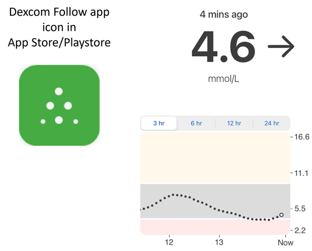
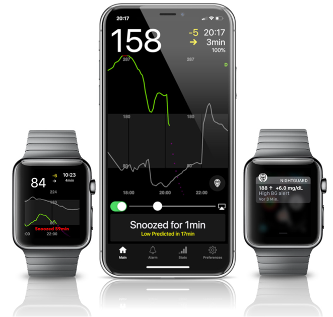
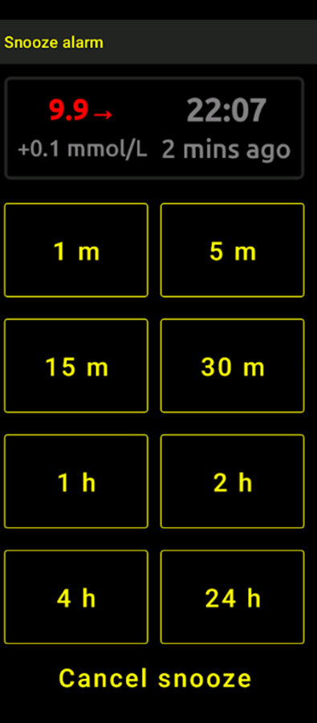
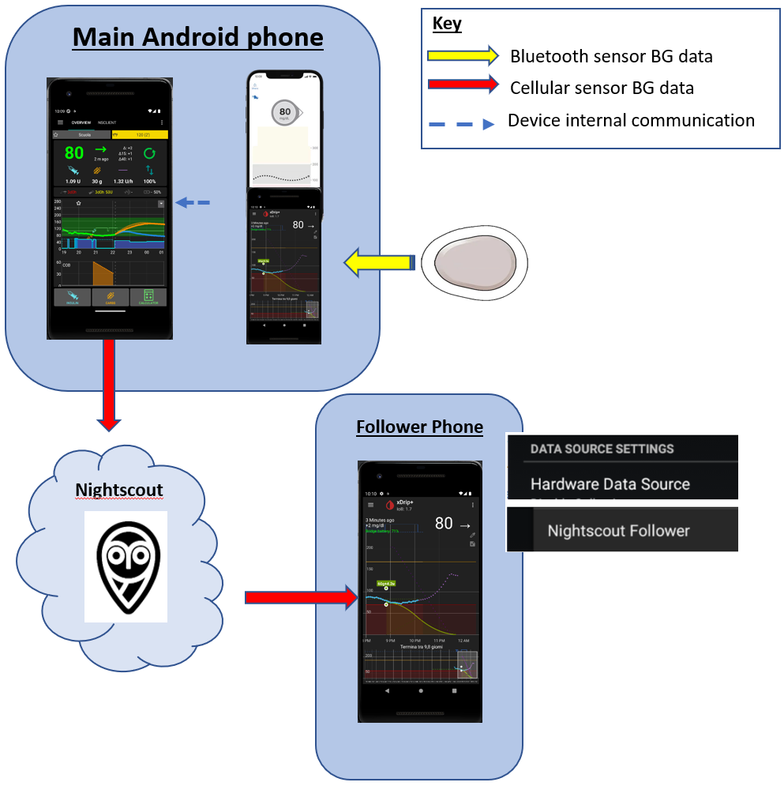
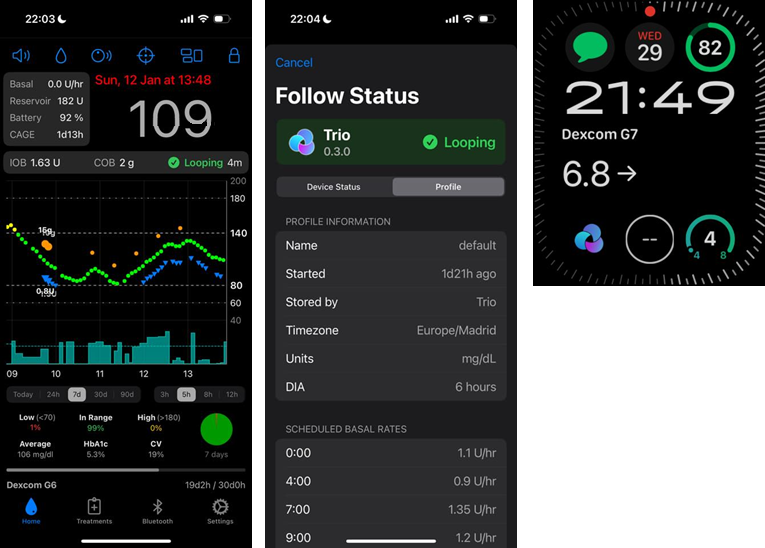
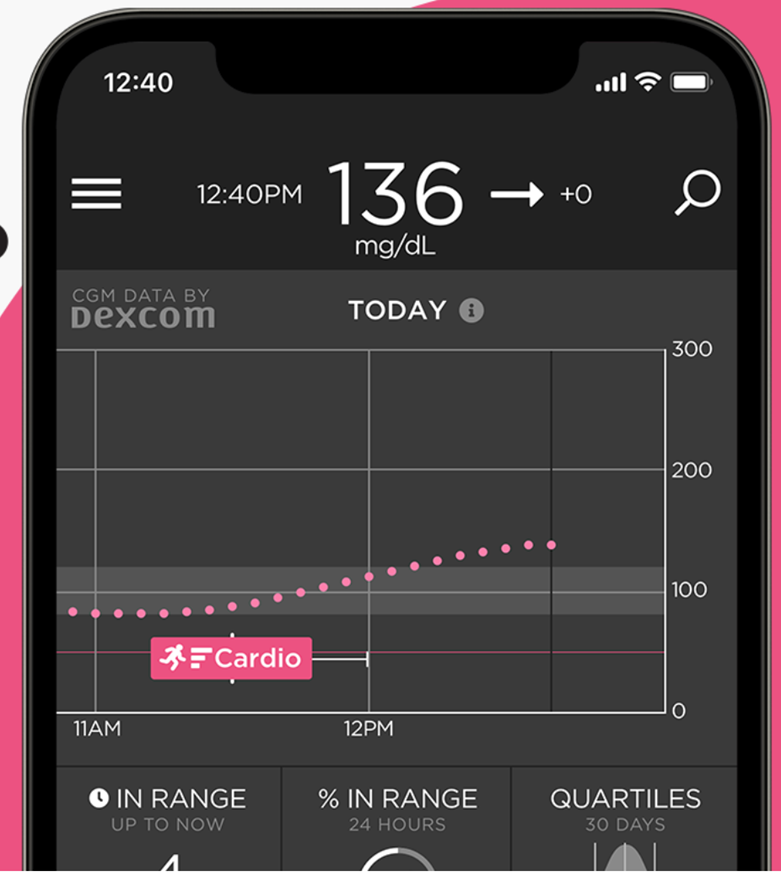
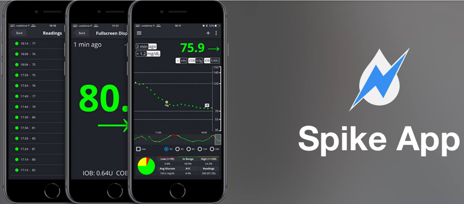
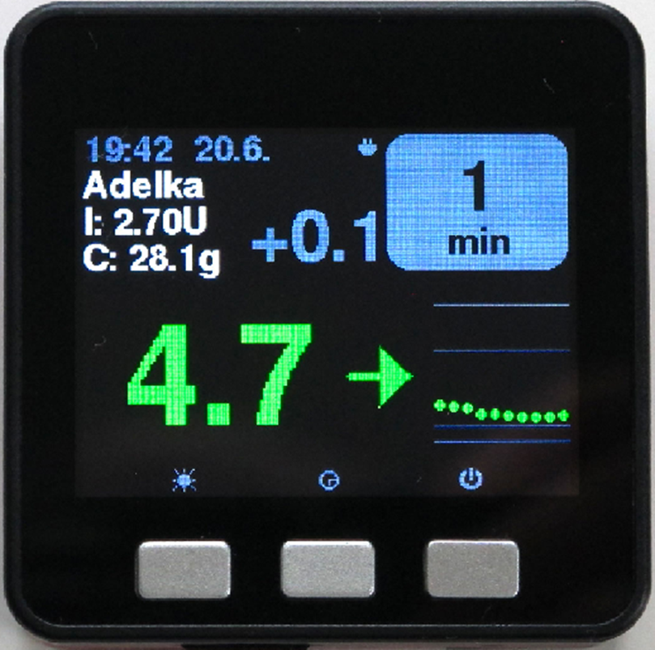
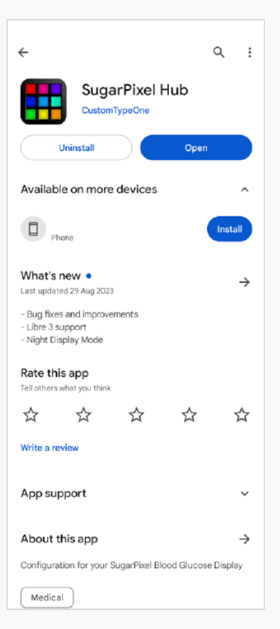

# Urmărirea AAPS (fără interacțiune cu sistemul AAPS)

În plus față de gama de posibilități disponibile pentru controlul de la distanță _și_ urmărire a **AAPS** care sunt descrise în [control la distanță](../RemoteFeatures/RemoteControl.md), există mai multe aplicații și dispozitive suplimentare pe care comunitatea le-a dezvoltat, să urmărească pur și simplu numerele (nivelul de glicemie și alte informații), fără a interacționa cu **AAPS**.

O bună imagine de ansamblu a opțiunilor vaste disponibile pentru a urmări **AAPS** este pe pagina web [Nightscout](https://nightscout.github.io/nightscout/downloaders/#).

```{contents} Table of contents
:depth: 1
:local: true
```

Cele mai frecvente strategii utilizate în combinație cu **AAPS** sunt explicate mai detaliat în partea de jos.

## Aplicații telefon inteligent

```{contents} These are some of the main “follower” apps used by **AAPS** users. All of these apps are “free”: 
:depth: 1
:local: true
```

### Dexcom Follow ([Android](https://play.google.com/store/apps/details?id=com.dexcom.follow.region2.mgdl) și [iOS](https://apps.apple.com/fr/app/dexcom-follow-mg-dl-dxcm2/id1032203080))



* Dexcom Follow este compatibil cu o gamă largă de dispozitive mobile (atât Android cât și iPhone). Dexcom Follow poate fi utilizat chiar dacă nu utilizați aplicația oficială Dexcom pentru a primi datele de la senzori.

* Mulți îngrijitori sunt familiarizați cu Dexcom Follow, preferând interfața sa clară față de ceva mai complicat.

* Dexcom Follow este foarte bun pentru profesori/bunici și pentru cei care știu foarte puțin despre diabet și nivelul glicemiei. It has customisable alerts (BG level, what sound to play etc.). Alarmele pot fi oprite complet, dacă este necesar, ceea ce este foarte util dacă aveți un senzor care încă se obișnuiește cu corpul și creează multe hipoglicemii false.

#### Configurarea Dexcom Follow: ghid

Dacă folosiți aplicația Dexcom neoficială BYODA pentru a primi datele senzorului, ai putea trimite invitații urmăritorilor din aplicația BYODA.

Nu mai puteți trimite e-mailuri de invitație către urmăritorii Dexcom, din aplicații terțe. În xDrip+, cererea de invitație va avea ca rezultat mesajul "invitația nu a fost trimisă".

Trebuie să instalați aplicația oficială Dexcom, să trimiteți invitația și apoi să dezinstalați aplicația oficială.

Pașii în acest sens sunt următorii:

1) Instalați aplicația oficială "Dexcom" pe _orice telefon inteligent_ (Android/iPhone), acesta poate fi telefonul urmăritor dacă este mai convenabil. 2) Autentificați-vă cu numele de utilizator și parola Dexcom, acestea sunt aceleași detalii de autentificare pe care le-ați folosi pentru Dexcom Clarity, dacă sunteți deja un client Dexcom/Clarity. Dacă nu ai un cont Dexcom, există opțiunea de a crea o nouă autentificare în acest moment.   
3) Glisați prin meniurile introductive. 4) Adăugați "niciun cod" pentru codul senzorului. 5) Sub Transmitter SN selectați "enter manually" și introduceți orice cod valid pentru transmițători (utilizați unul dintre codurile dumneavoastră pentru transmițătorii expirați. dacă știți unul, astfel încât nu interferează cu rularea transmițătorului curent, să aibă un format specific de anumite numere și litere: "NLNNL" și să utilizeze numai anumite combinații, deci este cel mai ușor să folosiți unul pe care deja îl știți valid). 6) Odată ce aplicația încearcă să găsească transmițătorul și senzorul, veți putea invita urmăritori: selectați cele trei puncte mici din stânga sus a aplicației și adăugați un nou urmăritor. De asemenea, poți folosi acest lucru dacă unul dintre urmăritorii tăi și-a schimbat dispozitivul manual și are nevoie de o invitație nouă, aici le puteți șterge din lista de urmăritori și retrimiteți un nou e-mail de invitație pe care îl puteți utiliza la noul lor dispozitiv mobil. 7) Pe telefonul urmăritorului, instalați Dexcom Follow prin descărcarea acesteia din App Store (iPhone) sau Play (Android). Configurați aplicația Dexcom Follow, și vi se va solicita să vă deschideți e-mailul pentru a găsi invitația pentru a fi urmăritor.    
8) Acum puteți șterge aplicația oficială Dexcom G6.

Pentru Dexcom Follow, datele de la senzori sunt apoi exportate din telefonul **AAPS** fie direct din BYODA, sau din xDrip+, în funcție de aplicația pe care o folosiți.


### [Nightguard](https://apps.apple.com/fr/app/nightguard/id1116430352) (iOS)



Avantaje (așa cum au fost raportate de utilizatori):

* Disponibil în [magazinul de aplicații](https://apps.apple.com/us/app/nightguard/id1116430352), simplă, ușor de utilizat.

* Glisați butonul sau scuturați telefonul pentru a amâna alarmele la diferite intervale între 5 minute și 24 de ore

* Personalizați alarmele (alerte mari, mici, citiri ratate atunci când nu există date de 15-45 de minute).

* Creștere/cădere rapidă timp de 2-5 citiri consecutive (alegerea dumneavoastră). De asemenea, puteți alege delta dintre două citiri distincte

* Amânare inteligentă așa că nu alertează dacă nivelurile se îndreaptă în direcția corectă

* Există o filă Îngrijire care pare să vă permită setarea unei noi ținte temporare pentru o anumită durată, să ștergeți ținta temporară sau să introduceți carbohidrați.

Dezavantaje (așa cum au fost raportate de utilizatori)

* Disponibil doar pentru iOS

* Ținta temporară se prezintă ca 5 mmol indiferent de nivelul țintei temporare stabilite

* Nu arată niciodată rata bazalei temporare, chiar dacă arată bazală temporară

### [Nightwatch](https://play.google.com/store/apps/details?id=se.cornixit.nightwatch) (Android)




* Nightwatch se comercializează în calitate de client Nightscout și monitorizează nivelurile de glicemie ale utilizatorului Nightscout fie pe telefonul Android, fie pe tabletă.

* Aplicația poate fi descărcată de pe [Google play](https://play.google.com/store/apps/details?id=se.cornixit.nightwatch) și afișează date glicemice în timp real.

* Utilizatorul poate fi alertat cu setul de alarme de zgomot redus și ridicat.

* Datele privind glicemia pot fi vizualizate fie în mmol/l, fie în mg/dl.

* Necesită Android 5.0 și mai mare.

* Acesta are o interfață de utilizator de culoare închisă, afișaje și butoane mari, fiind conceput pentru a fi utilizat pe timpul nopții.

### xDrip+ (Android)

Puteți utiliza xDrip+ ca urmăritor.

#### Cu Nightscout

Setați xDrip+ ca urmăritor Nightscout. Veți primi glicemia și tratamentele, dar nu bazala.



#### Fără Nightscout - sursa datelor de glicemie în xDrip+

Dacă sursa de date **AAPS** este xDrip+ (sau dacă xDrip+ poate primi glicemia și de la o altă aplicație precum BYODA, Juggluco) îl poți folosi de la telefonul principal pentru a împărtăși date cu urmăritorii xDrip+, afișând glicemia, tratamente și ratele bazale.


#### Fără Nightscout - xDrip+ aplicație companion pentru glicemii

În cazul în care sursa de date **AAPS** nu este xDrip+, dar puteți afișa date glicemice din sursa de date a aplicației companion, îl poți folosi de la telefonul principal pentru a partaja date cu adepții xDrip+, afișând glice, tratamente și tarife bazale.


### xDrip4iOS (iOS)


xDripSwift was created from porting the original xDrip app to iOS and evolved to "xDrip for iOS" written **xDrip4iOS** .

```{admonition} Further detail about how to attempt to obtain the original **xDrip4iOS** app
:class: dropdown
[grupul de Facebook xDrip4iOS](https://www.facebook.com/groups/853994615056838/announcements) este principala comunitate de suport pentru xDrip4iOS și Shuggah. **xDrip4iOS** can connect to many different CGM systems and transmitters and display blood glucose values, charts and statistics as well as provide alarms. It can also upload to Nightscout or act as a [follower app for Nightscout](https://xdrip4ios.readthedocs.io/en/latest/connect/follower/). 

"How can I get **xDrip4iOS** on my iPhone?"
There are two options:

1. If you have a Mac and an Apple Developer account (99 EUR/USD per year) you can build your own xDrip4iOS by [following the instructions](https://xdrip4ios.readthedocs.io/en/latest/install/build/).

If you want, you can then become a "releaser" and [share a Personal Testflight xDrip4iOS](https://xdrip4ios.readthedocs.io/en/latest/install/personal_testflight/) with up to 100 other people to help them.

2. You join the [xDrip4iOS Facebook group](https://www.facebook.com/groups/853994615056838/announcements) and read the pinned posts for current methods to get the app. **You should not ask for an invitation to the app** (read the group rules).
```




"Ce este **Shuggah**?" Un grup de dezvoltatori ucraineni au copiat codul proiectului pentru xDrip4iOS (care este partajat public pe GitHub) și l-a lansat pe App Store sub un cont de afaceri. Versiunea de Shuggah nu este gestionată în niciun fel de dezvoltatorii xDrip4iOS.

Grupul de Facebook [xDrip4iOS](https://www.facebook.com/groups/853994615056838/announcements) sprijină xDrip4iOS și aplicațiile Apple Watch compatibile.

### [Sugarmate](https://apps.apple.com/fr/app/sugarmate/id1111093108) (iOS)




[Sugarmate](https://sugarmate.io/) poate fi descărcat pe iPhone din magazinul de aplicații. Sugarmate este compatibil cu:
* Apple iPhone (Necesită software versiunea 13.0 sau mai târziu)
* Apple iPad (Necesită software versiunea 13.0 sau mai târziu)
* Google Android (salvați aplicația web pe ecranul de pornire)

S-a raportat de către utilizatorii Sugarmate că poate fi folosit cu Apple CarPlay în SUA pentru a afișa citirile de glucoză în timpul conducerii. Încă nu s-a stabilit dacă acest lucru este posibil în țările din afara SUA. Dacă știți mai multe despre asta, vă rugăm să adăugați aici detalii la documentație completând o cerere de tragere (link) care este rapidă și ușor de făcut.


### [Spike](https://spike-app.com/) (iOS)



Spike poate fi folosit ca receptor primar sau ca aplicație urmăritor, furnizând glicemii, alarme și IOB și multe altele.

Website-ul și aplicația nu mai sunt dezvoltate. Sprijin poate fi găsit pe [Facebook](https://www.facebook.com/groups/1973791946274873) și [Gitter](https://gitter.im/SpikeiOS/Lobby).

## Ceas inteligent pentru **Monitorizarea AAPS** (date complete de profil sau numai glicemie) unde **AAPS** rulează pe un telefon.

Vedeți [aici](../Getting-Started/Watches.md).


## Dispozitive pentru urmărirea AAPS

```{contents} Devices include:
:depth: 1
:local: true
```

### Stivă M5



M5Stack este o cutie mică care poate fi programată pentru multe aplicații. Proiectul lui Martin [M5Stack NightscoutMon](https://github.com/mlukasek/M5_NightscoutMon/wiki) afișează valori și tendințe ale glicemiei senzorilor, IOB și COB. Este într-o cutie de plastic, dotată cu un ecran de culoare, slotul cardului microSD, 3 butoane, difuzor și baterie internă. Este un foarte bun monitor pentru glicemia și este relativ ușor de stabilit dacă ai un cont Nightscout. Utilizatorii îl rulează de obicei pe Wi-Fi-ul lor, dar unii utilizatori raportează că îl utilizează ca afișaj la motocicletă, printr-un hotspot Wi-Fi al telefonului.

### Sugarpixel

SugarPixel este un dispozitiv pentru un sistem secundar de alertă pentru afișarea glicemiei pentru monitorizarea continuă a glucozei, care se conectează cu aplicația Dexcom sau cu aplicația Nightscout pe telefonul inteligent al utilizatorului. Dispozitivul afișează valorile glicemiei în timp real. Acest monitor CGM hardware beneficiază de alerte audio cu tonuri aleatorii (care sunt incredibil de zgomotoase), alerte de vibrație pentru tulburările de auz, opțiuni de afișare personalizabile și urmărire nativă pentru mai mulți utilizatori.




* SugarPixel are multiple opțiuni de afișare, în mg/dL și mmol/L, pentru a se potrivi nevoilor utilizatorului, cu valori ale glucozei codate prin culori.
* Fața standard afișează glicemia, săgeata de tendință și delta. Delta este schimbarea cu + sau - de la ultima citire.
* SugarPixel poate fi personalizat pentru a fi utilizat la luminozitate redusă, folosind interfața Glicemie și Oră pentru a vizualiza valoarea glicemiei utilizatorului și ora curentă pe noptiera acestuia.
* Interfața Culoare a SugarPixel utilizează întregul ecran pentru a afișa o singură culoare ce reprezintă valoarea glicemiei (BG). Acest lucru permite utilizatorului să vadă citirile glicemiei la distanță prin fereastră în timp ce se joacă în curtea din spate, terasă sau piscină.
* Fața mare a glicemiei este utilă pentru utilizatorii nocturni care poartă ochelari sau lentile de contact.

### Ceas Nightscout pe Ulanzi TC001

**Nightscout Clock** este un software open source care rulează pe dispozitivul **Ulanzi TC001**. Se conectează cu serverele Dexcom sau Nightscout și afișează valorile glicemiei în timp real.


* Ceasul acceptă atât unități mmol/l, cât și mg/dl și include alarme sonore.
* Mai multe afișaje disponibile, vedeți [Github nightscout-clock](https://github.com/ktomy/nightscout-clock?tab=readme-ov-file#more-information-for-people-who-needs-it) pentru o prezentare generală.
* Setarea și configurarea dispozitivului implică doar câțiva pași simpli. Odată configurat, are nevoie doar de pornire și Wi-Fi pentru a funcționa.
* Dispozitivul Ulanzi TC001 este semnificativ mai ieftin decât SugarPixel.
* Programul și instrucțiunile de instalare pot fi găsite pe [Github Nightscout-clock](https://github.com/ktomy/nightscout-clock?tab=readme-ov-file).
* Acesta este dezvoltat și întreținut de Artiom Kenibasov, oferind suport pe grupul [Facebook AAPS Users group](https://www.facebook.com/groups/cgminthecloud/posts/8776932509094594/).

### PC (TeamViewer)
Unii utilizatori consideră că un instrument complet de acces la distanță, precum [Teamviewer](https://www.teamviewer.com/), este util pentru depanarea avansată de la distanță.
