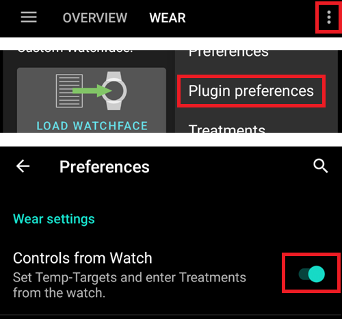
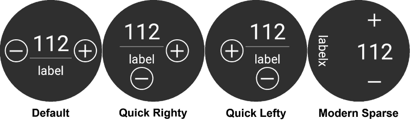
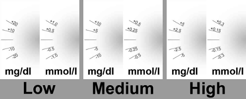
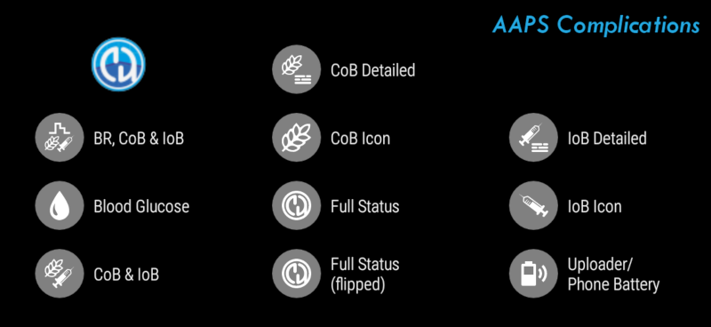
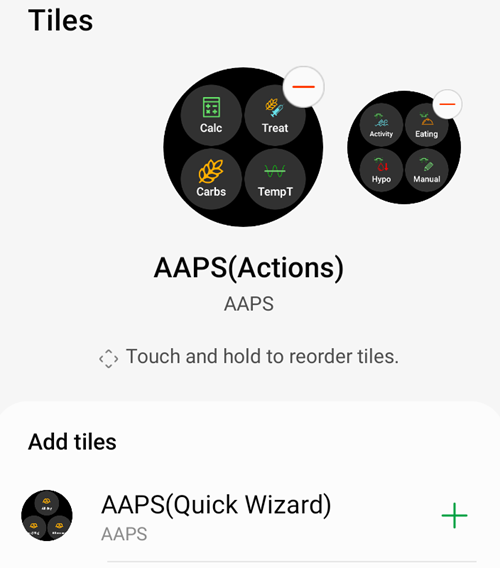
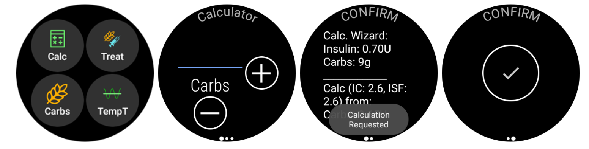
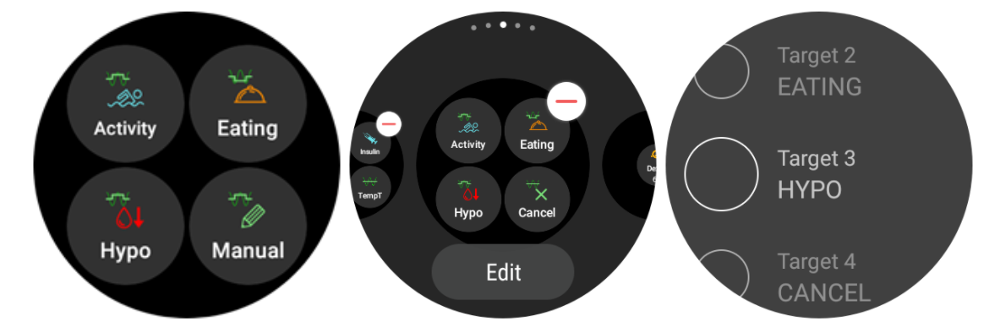
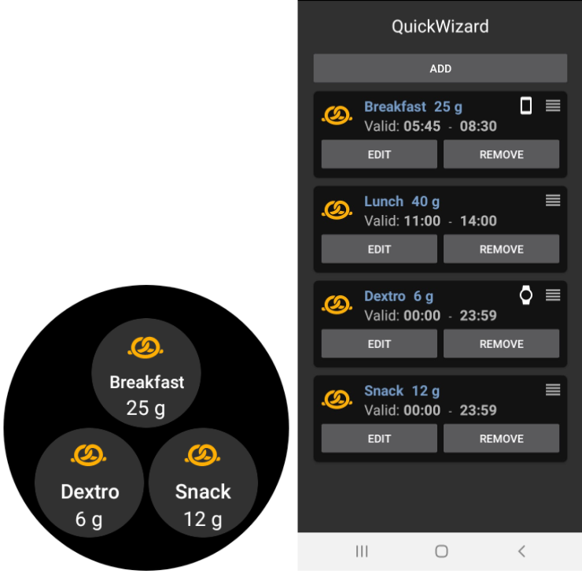
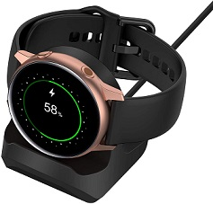
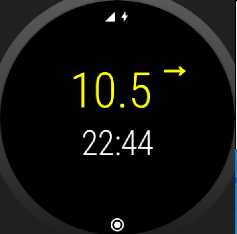

# Operarea AAPS prin intermediul ceasului inteligent Wear OS

(Watchfaces-aaps-watchfaces)=

## Fețe de ceas AAPS

```{warning}
Fețele de ceas AAPS sunt disponibile pentru ceasul inteligent Wear OS cu API nivel 28 până la 33.
Odată cu Wear OS 5, nu mai este posibilă folosirea fețelor personalizate.
```

Există mai multe fețe de ceas din care să alegeți care sunt incluse în aplicația de baza a AAPS Wear APK. Aceste fețe de ceas includ diferența medie, IOB, rata bazalei temporare și profilurile bazale active în prezent și graficul citirilor CGM.

Unele acțiuni disponibile pe ceas sunt:

* Atingeți de două ori pe glicemie pentru a ajunge în meniul AAPS
* Atingeți de două ori graficul glicemic pentru a schimba scara temporală a graficului

## Configurare

Activați modulul Wear în [Configurator > Sincronizare](../SettingUpAaps/ConfigBuilder.md).

Utilizați preferințele Wear pentru a defini variabilele care ar trebui luate în considerare la calcularea bolusului de pe ceas (spre exemplu tendința din ultimele 15 minute, COB șamd).

Dacă doriți să bolusați șamd. de pe ceas, în "Setări Wear", trebuie să activați "Control de pe Ceas".



Prin fila Ceas (Wear) sau prin meniul principal (sus stânga ecranului, dacă fila nu este afișată) puteți

* Retrimiteți toate datele. Ar putea fi de ajutor dacă ceasul nu a fost conectat de ceva timp, și doriți să transmiteți informația către ceas.
* Deschideți setările pe ceas direct de pe telefon.

Asigurați-vă că notificările de la AAPS nu sunt blocate pe ceas. Confirmarea unei acțiuni (spre exemplu bolus, țintă temporară) vine printr-o notificare pe care va trebui să o glisați și să o bifați.

## Accesarea meniului principal al AAPS

Pentru a accesa meniul principal al AAPS, puteți utiliza următoarele opțiuni:

* apăsați de două ori pe valoarea glicemiei
* selectați pictograma AAPS în meniul de aplicații al ceasului
* apăsați pe complicația AAPS (dacă este configurat pentru meniu)

## Setări (în ceas)

Pentru a accesa setările pentru fețele de ceas, intrați in meniul principal AAPS, glisați in sus și selectați "Setări".

Pictograma cu steaua umplută este pentru starea activată (**Pornit**), iar pictograma cu stea goală indică faptul că setarea este dezactivată (**Oprit**):


### Parametrii AAPS însoțitor

* **Vibrare la Bolus** (implicit `Pornit`):
* **Unități pentru Acțiuni** (implicit `mg/dl`): dacă este **Pornit** unitatea de măsură este `mg/dl`, dacă este **Oprit** unitatea de măsură folosită este `mmol/l`. Folosit la setarea unei ținte temporare din ceas.

(Watchfaces-watchface-settings)=

### Setări fețe de ceas

* **Afișați data** (implicit `Oprit`): notă, datele nu sunt disponibile pe toate fețele de ceas
* **Afișați IOB** (implicit `Pornit`): Afișați sau nu valoarea IOB (setarea pentru valoarea detaliată este în parametrii de ceas din AAPS)
* **Afișați COB** (implicit `Pornit`): Afișați sau nu valoarea COB
* **Afișați Variația** (implicit `Pornit`): Afișați sau nu variația glicemiei din ultimele 5 minute
* **Afișați variația medie** (implicit `Pornit`): Afișați sau nu variația medie a glicemiei din ultimele 15 minute
* **Afișați bateria telefonului** (implicit `Pornit`): Baterie telefon în %. Roșu dacă e sub 30%.
* **Afișați baterie dispozitiv** (implicit `Oprit`): Bateria dispozitivului este o sinteză a bateriilor din telefon, pompă și senzor (în general, cea mai mică dintre cele 3 valori)
* **Afișați Rata Bazală** (implicit `Pornit`): Afișare sau nu a ratei bazale curente (în U/h sau în % dacă RBT)
* **Afișați starea buclei** (implicit `Pornit`): arată câte minute au trecut de la ultima buclă activă (săgețile din jurul valorii devin roșii dacă este peste 15').
* **Afișați glicemia** (implicit `Pornit`): Afișați sau nu ultima valoare a glicemiei
* **Afișați săgeata de direcție** (implicit `Pornit`): Afișați sau nu săgeata tendinței glicemiei
* **Afișați vechime** (implicit `Pornit`): arată numărul de minute de la ultima citire.
* **Întunecat** (implicit `Pornit`): Puteți comuta de pe fundal negru pe fundal alb (cu excepția fețelor de ceas Cockpit și Steampunk)
* **Evidențiați bazalele** (implicit `Oprit`): Îmbunătățirea vizibilității ratei bazalelor și bazalelor temporare
* **Potrivire separator** (implicit `Oprit`): Pentru fețele de ceas AAPS, AAPSv2 și AAPS (Mare), se poate seta un fundalul în contrast pentru separator (**Oprit**) sau se poate potrivi separatorul cu culoarea fundalului (**Pornit**)
* **Interval de timp al graficului** (implicit `3 ore`): puteți selecta în sub-meniu intervalul maxim de timp al graficului între 1 oră și 5 ore.

### Setări Interfață Utilizator

* **Design de intrare**: cu acest parametru, poți selecta poziția butoanelor "+" și "-" atunci când introduci comenzi pentru AAPS (ținte temporare, insulină, carbohidrați)



### Parametrii specifici pentru fețele de ceas

#### Fața de ceas Steampunk

* **Granularitate variație** (implicit `Mediu`)



#### Cadran FațaCeas

* **Cifre mari** (implicit `Oprit`): Crește dimensiunea textului pentru a îmbunătăți vizibilitatea
* **Istoric cu cercuri** (implicit`Oprit`): Vizualizare grafică istoric glicemie cu inele gri în interiorul inelului verde al orei
* **Istoric cu cerc luminos** (implicit `Pornit`): cercul de istoric este mai discret cu un gri mai închis
* **Animații** (implicit `Pornit`): Când este activat și acceptat de ceas și nu e în modul rezoluție mică pentru economisirea energiei, cadranul ceasului va fi animat

### Setări comenzi

* **Asistent în Meniu** (implicit `Pornit`): Permite în meniul principal să se introducă carbohidrații și să se seteze bolusul din ceas
* **Amorsare în meniu** (implicit`Oprit`): Permite Amorsare/Umplere de pe ceas
* **Țintă unică** (implicit `Pornit`):
  
  * `Pornit`: ați setat o singură valoare pentru Ținta Temporară
  * `Off`: ați setat ținta inferioară și superioară pentru ȚintaTemporară

* **Asistent Procentaj** (implicit `Oprit`): Permiteți corecții bolus din asistent (valoarea introdusă în procente înainte de notificarea de confirmare)

(Watchfaces-complications)=

## Complicații

*Complicația* este un termen de la producătorii tradiționali de ceasuri, care descrie adăugarea pe fața principală a ceasului - o altă fereastră sau cadran mai mic (cu data, ziua săptămânii, faza lunii, șamd). Wear OS 2.0 permite diverșilor furnizori de date, cum ar fi aplicația de vremea, notificările, contoarele de fitness și multe altele - să fie adăugate la orice față de ceas care acceptă complicații.

Aplicația AAPS Wear OS acceptă fețe personalizate de la construcția cu versiunea `2.6`și permite oricărei fețe de ceas terțe care suportă complicații să fie configurată pentru a afișa date legate de AAPS (BG cu tendința, IOB, COB șamd).

Complicațiile servesc de asemenea ca **scurtătură** spre funcții AAPS. Prin apăsarea pe ele puteți deschide meniurile și dialogurile legate de AAPS (în funcție de tipul de complicație și configurație).


### Tipuri de complicații

Aplicația AAPS Wear OS furnizează numai date brute, conform formatelor predefinite. Depinde de dezvoltatorul terț al feței de ceas să decidă unde și cum să afișeze complicațiile, inclusiv modul de prezentare, margine, culoare și font. Din multele tipuri disponibile de complicații ale Wear OS, AAPS utilizează:

* `TEXT SCURT ` -Conține două linii de text, 7 caractere fiecare, denumite uneori valoare și etichetă. De obicei, redat în interiorul unui cadran sau a unei mici buline - unul sub altul, sau lateral unul de altul. Este o complicație foarte limitată ca spațiu. AAPS încearcă să înlăture caracterele care nu sunt necesare pentru a se încadra: prin rotunjirea valorilor, înlăturarea zerourilor de la începutul și sfârșitul valorilor, șamd.
* `TEXT LUNG` - Conține două linii de text, aproximativ 20 de caractere fiecare. De obicei, redat în interiorul unui dreptunghi sau al unui cadran lung - unul sub altul. Este folosit pentru mai multe detalii și stare textuală.
* `VALOARE INTERVAL` -Folosit pentru valori din intervalul predefinit, ca un procentaj. Conține pictogramă, etichetă și este de obicei redată ca un cadran de progres.
* `IMAGINE MARE` - Imagine de fundal personalizată care poate fi folosită (atunci când este acceptată de ceas) ca fundal.

### Configurare complicație

Pentru a adăuga complicații la fața de ceas, configurați-o printr-o apăsare lungă și prin apăsarea pe roata dințată de mai jos. În funcție de modul specific în care se configurează o față de ceas - fie apăsați pe înlocuitori fie intrați in meniul de configurare al fețelor de ceas pentru complicații. Complicațiile AAPS sunt grupate în meniul AAPS.

Când configurați complicații pe ceas, Wear OS va prezenta și va filtra lista de complicații care se pot potrivi în locul selectat pe ceas. Dacă anumite complicații nu pot fi găsite în listă, este probabil din cauza faptului că acel tip nu poate fi utilizat pentru locul respectiv.

### Complicații furnizate de către AAPS

AAPS furnizează următoarele complicații:



* **RB, CoB & IoB** (`TEXT SCURT`, deschide *Meniu*): Afișați *Rata Bazală* pe prima linie și *Carbohidrați la Bord* și *Insulină la Bord* pe linia a doua.
* **Glicemia** (`TEXT SCURT`, deschide *Meniu*): Afișați valoarea *Glicemiei* și săgeata de *tendință* pe prima linie iar pe linia a doua *vechimea măsurătorii* și *Variația Glicemiei*.
* **CoB & IoB** (`TEXT SCURT`, deschide *Meniu*): Afișați *Carbohidrați la Bord* în prima linie și *Insulină la Bord* în a doua linie.
* **CoB Detaliat** (`TEXT SCURT`, deschide *Asistent*): Afișați în prima linie *Carbohidrații la Bord* activi și în a doua linie Carbohidrații planificați (viitori, carbohidrați extinși).
* **Icoană CoB** (`TEXT SCURT`, deschide *Asistent*): Afișați o iconiță statică cu valoarea *Carbohidrați la Bord*.
* **Stare Completă** (`TEXT LUNG`, deschide *Meniu*): Arată majoritatea datelor deodată: valoarea *glicemiei* și săgeata *tendinței*, *variația glicemiei* și *vechimea măsurătorii* pe prima linie. Pe linia a doua linie *Carbohidrați la Bord*, *Insulină la Bord* și *Rata bazală*.
* **Stare completă (inversat)** (`TEXT LUNG`, deschide *Meniu*): Aceleași date ca și la *Stare completă*, dar liniile sunt inversate între ele. Poate fi folosit în fețele de ceas care ignoră una din cele două linii în `TEXT LUNG`
* **IoB Detaliat** (`TEXT SCURT`, deschide *Bolus*): Afișați *Insulina la Bord* totală în prima linie și *IoB* defalcat pentru *Bolus* și *Bazală* în linia a doua.
* **Iconiță IoB** (`TEXT SCURT`, deschide *Bolus*): Afișați valoarea *Insulinei la Bord* printr-o iconiță statică.
* **Baterie Telefon/Încărcător** (`VALOARE INTERVAL`, deschide *Status*): Afișați în procente bateria telefonului cu AAPS (încărcătorului de date), așa cum este raportat de AAPS. Prezentat ca un indicator în procente cu o iconiță de baterie care afișează valoarea raportată. Este posibil să nu se actualizeze în timp real, doar atunci când apar alte modificări importante de date AAPS (de obicei: la fiecare ~ 5 minute cu noua valoare a *glicemiei*).

În plus, există trei complicații de tip `IMAGINE MARE`: **fundal întunecat**, **fundal gri** și **fundal deschis**, ce afișează imaginea de fundal statică AAPS.

### Setări legate de complicații

* **Acțiunea de atingere a complicațiilor** (implicit `Implicit`): Decideți ce dialog se deschide când utilizatorul apasă pe complicație: 
  * *Implicit*: acțiune specifică tipului de complicație*(vedeți lista de mai sus)*
  * *Meniu*: Meniu principal AAPS
  * *Asistent*: asistent bolusare - calculator pentru bolus
  * *Bolus*: introducere directă a valorii bolus
  * *Carbohidrați extinși*: dialog de configurare carbohidrați extinși
  * *Stare*: submeniul de stare
  * *Niciunul*: Dezactivează acțiunea de atingere a complicațiilor AAPS
* **Unicode în complicații** (implicit `Pornit`): Când e `Pornit`, complicațiile vor folosi caractere Unicode pentru simboluri ca `Δ` Delta, `⁞` separator vertical din puncte sau `⎍` simbol pentru Rata Bazală. Afișarea lor depinde de font, și asta poate fi foarte specific pentru fiecare cadran. Această opțiune permite comutarea simbolurilor Unicode `Oprit` dacă este necesar - când caracterul utilizat de către fața de ceas personalizată nu suportă acele simboluri - pentru a evita erorile grafice.

(WearOsSmartwatch-wear-os-tiles)=

## Panouri Wear OS

Panourile Wear OS oferă acces facil la informațiile utilizatorilor și la acțiunile acestora pentru a rezolva lucrurile cum trebuie. Panourile sunt disponibile doar pe ceasurile inteligente Android care rulează Wear OS versiunea 2.0 sau mai mare.

Panourile vă permit să accesați rapid acțiunile de pe aplicația AAPS fără a trece prin meniul de ceas. Panourile sunt opționale și pot fi adăugate și configurate de către utilizator.

Panourile sunt folosite "lângă" orice față de ceas. Pentru a accesa un panou, când este activat, glisați dreapta spre stânga pe fața ceasului pentru a le afișa.

Vă rugăm să rețineți; că panourile nu păstrează starea actuală a aplicației de telefon AAPS și vor face doar o solicitare, care trebuie să fie confirmată pe ceas înainte de a fi aplicată.

## Cum să adăugați Panouri

Înainte de a folosi panourile, trebuie să activați "Control de la ceas" în setările "Wear OS" pentru Android APS.


În funcție de versiunea dumneavoastră Wear OS, marca și telefonul dumneavoastră inteligent există două modalități de a activa panourile:

1. Pe ceas, de pe fața ceasului; 
  * Glisați de la dreapta la stânga până ajungeți la "+ Adăugați panouri" 
  * Selectați unul dintre panouri.
2. Pe telefonul dumneavoastră deschideți aplicația companion pentru ceas. 
  * Pentru Samsung deschideți "Galaxy Wearable" sau pentru alte mărci "Wear OS"
  * Click pe secțiunea "Panouri", urmată de butonul "+Adăugați"
  * Găsiți panoul AAPS pe care doriți să-l adăugați prin selectarea sa. 
  * Ordinea panourilor poate fi schimbată prin glisare și plasare

Conținutul panourilor poate fi personalizat prin apăsarea lungă a unei iconițe și apăsarea butonului "Editare" sau iconița cu "roata dințată".

### Panou APS(Acțiuni)

Panoul de acțiune poate conține 1 până la 4 butoane de acțiune definite de utilizator. Pentru a configura, apăsați lung pe panou, care va afișa opțiunile de configurare. Acțiuni similare sunt disponibile și prin intermediul meniului standard de ceas.

Acțiunile suportate în panoul de acțiune pot solicita aplicația de telefon AAPS pentru:

* **Calculator**; faceți un calcul pentru bolus, bazat pe introducerea carbohidraților și pe un procent [1] opțional
* **Insulină**; solicitați administrarea insulinei prin introducerea unității de insulină
* **Tratamentul**; cere atât administrarea insulinei cât și adăugarea carbohidraților
* **Carbohidrați**; adăugați carbohidrați (extinși)
* **Țintă Temporară**; setați o țintă temporară personalizată și durata



[1] Via, meniul Wear OS, setați opțiunea "Calculator procentaj" ca "Pornită" pentru a afișa procentajul de intrare în calculatorul de bolus. Procentul implicit este bazat pe setările telefonului din secțiunea ["Administrează această parte a rezultatului asistentului de bolusuri %"](#Preferences-deliver-this-part-of-bolus-wizard-result) Când utilizatorul nu oferă un procentaj, valoarea implicită de pe telefon este folosită. Configurați ceilalți parametri pentru calculatorul de bolus din aplicația de telefon prin intermediul "Preferințe" "Setări asistent".

### Panou AAPS(Țintă temporară)

Panoul țintă temporară poate solicita o țintă temporară pe baza presetărilor telefonului AAPS. Configurați ora și țintele prestabilite prin setarea aplicației telefonului prin accesarea "Preferințelor", "Prezentare", ["Ținte temporare implicite"](#Preferences-default-temp-targets) și setați durata și țintele pentru fiecare presetare. Configurați acțiunile vizibile pe panou prin setările de panou. Apăsați lung pe iconiță pentru a afișa opțiunile de configurare și selectați 1 până la 4 opțiuni:

* **Activitate**; pentru sport
* **Hipo**; pentru a crește ținta în timpul tratamentului hipoglicemiei
* **Mănâncă în curând**; pentru a scădea ținta și a crește insulina la bord
* **Manual**; setați o țintă temporară personalizată și o durată
* **Anulați**; pentru a opri ținta temporară curentă



### AAPS(Asistent)Panou

Panoul AsistentRapid poate ține 1 până la 4 butoane de acțiune rapide, definite cu aplicația pentru telefon[2]. Vedeți [AsistentRapid](#Preferences-quick-wizard). Puteți stabili mese standard (carbohidrați și metode de calcul pentru bolus) care să fie afișate pe panou, în funcție de ora zilei. Ideal pentru cele mai frecvente mese/gustări pe care le mâncați în timpul zilei. Puteți specifica dacă butonul de asistent rapid va fi afișat pe telefon, ceas sau ambele. Vă rugăm să rețineți că telefonul poate arăta doar un singur buton de asistent rapid. De asemenea, setarea rapidă a asistentului poate specifica un procentaj personalizat de insulină pentru bolus. Procentul personalizat vă permite să variați, de exemplu, gustare la 120%, micul dejun lent absorbit la 80% și o gustare pentru prevenire hipoglicemie la 0%



[2] Wear OS limitează frecvența de actualizare a panourilor la doar o dată la 30 de secunde. Când observați că modificările de pe telefon nu sunt reflectate pe panouri, luați în considerare; o așteptare de 30 de secunde, prin folosirea butonului "Retrimite toate datele" din secțiunea Wear OS a AAPS, sau eliminarea panoului și adăugarea sa din nou. Pentru a schimba ordinea butoanelor Asistentului Rapid glisați un articol în sus sau în jos.

## Întotdeauna pornit

Durata lungă de viață a bateriei pentru ceasurile inteligente Android Wear OS reprezintă o provocare. Unele ceasuri inteligente pot ajunge până la 30 de ore înainte de reîncărcare. Afișajul ar trebui să fie oprit pentru o economisire optimă a energiei atunci când nu este utilizat. Cele mai multe ceasuri inteligente acceptă afișajul „Întotdeauna pornit".

De la versiunea 3 AAPS, putem folosi o "Interfață Simplificată" în modul „Întotdeauna pornit". Această interfață conține numai glicemia, direcția și timpul. Această interfață este optimizată din punctul de vedere al bateriei prin actualizări mai puțin frecvente, afișarea a mai puțină informație și iluminarea a mai puțini pixeli pentru a economisi energie pe ecranele OLED.

Modul de interfață simplificat este disponibil pentru fețele de ceas: AAPS, AAPS V2, Home Big, Digital Style, Steampunk și Cockpit. Interfața simplificată este opțională și este configurată prin intermediul setărilor feței ceasului. (apăsați prelung fața ceasului și apăsați pe butonul "editare" sau pe icoana roata dințată) Selectați configurația "Interfață simplificată" și setați la "Mereu pornit" sau "Întotdeauna pornit și la încărcare".

### Modul de noapte

În timpul încărcării, ar fi util ca afișajul să rămână „permanent pornit" și să arate glicemia în timpul nopții. Cu toate acestea, fețele standard de ceas sunt prea luminoase și au prea multe informații, iar detaliile sunt greu de citit cu ochii somnolenți. Prin urmare, am adăugat o opțiune pentru ca interfața de ceas să simplifice interfața doar în timpul încărcării atunci când este stabilită în configurație.

Modul de interfață simplificat este disponibil pentru fețele de ceas: AAPS, AAPS V2, Home Big, Digital Style, Steampunk și Cockpit. Interfața simplificată este opțională și este configurată prin intermediul setărilor feței ceasului. (apăsați prelung fața ceasului și apăsați pe butonul "editare" sau pe icoana roata dințată) Selectați configurația "Interfață simplificată" și setați la "În timpul încărcării" sau "Întotdeauna pornit și la încărcare"

Opțiunile de dezvoltator Android permit ceasului să rămână treaz în timpul încărcării. Pentru a face disponibile opțiunile de dezvoltator, consultați [documentația oficială](https://developer.android.com/training/wearables/get-started/debugging). Setați "Rămâneți treaz la încărcare" la "pornit" în "opțiunile dezvoltatorului”.

Notă: nu toate ecranele pot folosi modul mereu-aprins foarte bine. Poate cauza arderea ecranului, în special pe ecranele OLED mai vechi. În general, ceasurile vor estompa afișajul pentru a preveni arsurile; vă rugăm să verificați manualul, cu fabricantul sau internetul pentru recomandări.





## Scurtătură amânați alerta

Este posibil să creați o scurtătură pentru a amâna alertele/alarma AAPS. Amuțirea sunetului prin ceas este convenabilă și mai rapidă fără a ajunge la telefon. Notă; încă trebuie să verificați mesajul de alarmă de pe telefon și să-l gestionați în consecință, dar puteți verifica acest lucru mai târziu. Când ceasul are două butoane, poți atribui o tastă programului `Amânare alertă AAPS`.

Pentru a lega butonul din Samsung Watch 4 mergeți la `Setări > Caracteristici Avansate > Butoane de personalizare > Apăsare dublă > Amânare alertă AAPS`

### Amânați xDrip

Când utilizați xDrip și aveți xDrip instalat pe ceas, scurtătura "Amânare alertă AAPS" va amâna, de asemenea, orice alarmă xDrip.

## Sfaturi legate de performanța și durata de viață a bateriei

Ceasurile Wear OS sunt dispozitive cu constrângeri mari în ceea ce privește consumul de energie. Dimensiunea ceasului limitează capacitatea bateriei incluse. Chiar și cu progresele recente atât pe partea de hardware, cât și pe cea de software, ceasurile Wear OS necesită în continuare încărcare zilnică.

Dacă bateria ține mai puțin de o zi (de dimineața până seara), iată câteva sfaturi pentru a rezolva problemele.

Principalele arii cu consum ridicat de baterie sunt:

* Afișare activă cu iluminare de fundal (pentru LED) sau în modul intensitate completă (pentru OLED)
* Afișare pe ecran
* Comunicații radio prin Bluetooth

Deoarece nu putem face compromisuri în comunicare (avem nevoie de date actualizate) și dorim să avem cele mai recente date redate, majoritatea optimizărilor se pot face în zona *timp de afișare*:

* De obicei, fețele de ceas implicite sunt mai bine optimizate decât cele personalizate, descărcate din magazin.
* Este mai bine să utilizați fețe de ceas care limitează cantitatea de date afișate în modul inactiv/estompat.
* Fiți conștient când amestecați alte complicații, cum ar fi widgeturile meteorologice terțe, sau alte ce utilizează date din surse externe.
* Începeti cu fețe de ceas mai simple. Adăugați pe rând câte o complicație și observați cum afectează durata de viața a bateriei.
* Încercați să utilizați tema **întunecată** pentru ceasurile AAPS și [**separatoare de potrivire**](#watchface-settings). Pe dispozitivele OLED, va limita numărul de puncte iluminate și va limita defectarea ecranului.
* Verificați ce funcționează mai bine pe ceas: fața standard de ceas sau alte fețe cu complicații AAPS.
* Observați timp de câteva zile, cu diferite profiluri de activitate. Cele mai multe ceasuri activează afișarea la ridicarea încheieturii, mișcare și alți declanșatori legați de utilizare.
* Verificați setările globale ale sistemului care afectează performanța: notificările, luminozitatea/timpul de expirare al ecranului activ, când este activat GPS-ul.
* Check [list of tested phones and watches](#Phones-list-of-tested-phones) and [ask community](../GettingHelp/WhereCanIGetHelp.md) for other users experiences and reported battery lifetime.
* **Nu putem garanta că datele afișate pe fața de ceas sau pe complicații sunt actuale**. În cele din urmă, depinde de Wear OS să decidă când actualizează fața de ceas sau complicațiile. Chiar și atunci când aplicația AAPS solicită actualizarea, Sistemul poate decide să amâne sau să ignore actualizările pentru a economisi bateria. Când aveți dubii și bateria ceasului este scăzută - verificați întotdeauna cu aplicația principală AAPS de pe telefon.

(Watchfaces-troubleshooting-the-wear-app)=

## Depanarea aplicației de pe ceas:

* Activați ADB debugging în Opțiuni Dezvoltator (de pe ceas), conectați ceasul prin intermediul unui USB și porniți aplicația de ceas cel puțin o dată în Android Studio.
* Dacă complicațiile nu actualizează datele - verificați mai întâi dacă fețele de ceas AAPS funcționează.

## Additional AAPS custom watchfaces are also available

[Here](../ExchangeSiteCustomWatchfaces/index.md) you can download Zip-Files with custom watchfaces made by other users.

## Build your own watchface

If you want to build your own watchface, follow the [guide here](../ExchangeSiteCustomWatchfaces/CustomWatchfaceReference.md).

Once you have built a custom watchface, you can share your own **AAPS** custom watchface with others, the zip-file can be uploaded in the folder "ExchangeSiteCustomWatchfaces" via a Pull Request into Github. During merge of the pull request, the documentation team will extract the CustomWatchface.png file and prefix it with the filename of the Zip-file.