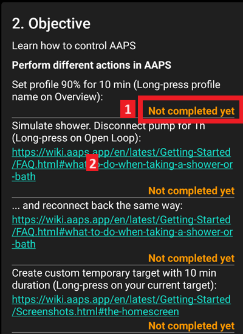
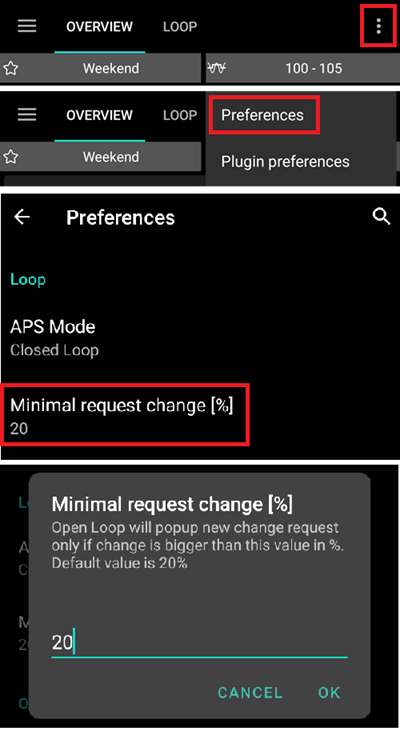
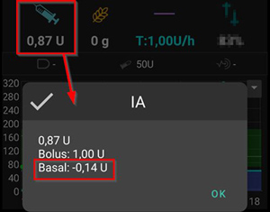
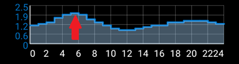

# Îndeplinirea obiectivelor

**AAPS** has a series of **Objectives** required to be completed to help the user progress from basic open looping to hybrid closed looping and full **AAPS** functionality. Completing the **Objectives** aims to ensure you have:

* Configured everything correctly in your **AAPS** setup;
* Learned about the essential features of **AAPS**; and
* A basic understanding of what your system can do, in order to help instill confidence when using **AAPS**.

When **AAPS** is installed for the first time, each objective must be completed before moving on to the next one. New features will gradually be unlocked as progress is made through each **Objective**.

**Objectives 1 to 8** will guide you from configuring **AAPS** on your smartphone to “basic” hybrid closed looping. Este nevoie de aproximativ 6 săptămâni pentru a fi finalizat. You can proceed up to **Objective 5** using a virtual pump (and using some other method of insulin delivery in the meantime). **Objectives 9 to 11** are designed to test more advanced **AAPS** features with the aim of better control of your diabetes, and will take up to 3 months to complete, possibly longer. Further details on an estimated breakdown of time can be obtained here: [How long will it take?](#preparing-how-long-will-it-take)

As well as progressing through the **Objectives**, if required, you can also remove your progress and [go back to an earlier objective](#go-back-in-objectives).

## Faceți o copie de rezervă a setărilor

```{admonition} Note
:class: nota

Se recomandă exportul setărilor **AAPS** după completarea fiecărui **Obiectiv**!
```

It is strongly recommended that you [export your settings](../Maintenance/ExportImportSettings.md) after completing each objective to avoid losing any progress made in **AAPS**. This exporting process creates a **settings file** (.json) which should be backed-up in one or more safe places (e.g. Google Drive, hard disk, email attachment _etc._). This ensures that any progress made in **AAPS** is saved. If your phone is lost or if you accidentally delete your progress, the json file can be re-loaded to **AAPS** by importing a recent settings file. Having a backup **settings file** is also required if a new **AAPS** smartphone is required for any reason (upgrading/lost/broken phone _etc._)

The **settings** file will save not only your progress through the **Objectives**, but also all your **AAPS** settings such as **max bolus** _etc._

The **Objectives** will need to be restarted from the beginning should you fail to have a backup of your settings and anything happens to your **AAPS** smartphone. Progressing through the **Objectives** takes time, and having to re-complete them again because for example you lost your smartphone, is a situation to be best avoided.

(objectives-objective1)=
## Obiectivul 1: Configurarea vizualizării și a monitorizării, analizarea bazalelor și a raporturilor

**Objective 1** requires the user to set up their basic technical setup in **AAPS**. Nu se poate face niciun progres până când acest pas nu este finalizat.

- Select the correct CGM/FGM in [Config Builder > BG Source](#Config-Builder-bg-source). See [BG Source](../Getting-Started/CompatiblesCgms.md) for more information.
- Select the correct Pump in [Config Builder > Pump](../SettingUpAaps/ConfigBuilder.md) to ensure your pump can communicate with **AAPS**. Select **virtual pump** if you are using a pump model with no **AAPS** driver for looping, or if you want to work through the early **Objectives** while using another system for insulin delivery. See [insulin pump](../Getting-Started/CompatiblePumps.md) for more information.
- Dacă utilizați Nightscout:
  - Follow instructions in [Nightscout](../SettingUpAaps/Nightscout.md) page to ensure **Nightscout** can receive and display **AAPS** data.
  - Note that URL in **NSClient** must be **_without_ "/api/v1/"** at the end - see [Preferences > NSClient](#Preferences-nsclient).
- Dacă utilizați Tidepool:
  - Follow instructions in [Tidepool](../SettingUpAaps/Tidepool.md) page to ensure **Tidepool** can receive and display **AAPS** data.

Note - *You may need to wait for the next sensor glucose reading to arrive before **AAPS** will recognise it.*

(objectives-objective2)=
## Objective 2: Learn how to control AAPS

**Objective 2** requires several ‘tasks’ to be actioned as shown in the screenshot below Click on the orange text "Not completed yet" to access the to-dos. Legături pentru a vă ghida vor fi furnizate, în cazul în care nu sunteți familiarizat cu o acțiune specifică.



Tasks to complete **Objective 2** are:
- Set your **Profile** to 90% for a duration of 10 min.
  - _Hint_: Long press your Profile name on the OVERVIEW screen. More information in [Profile switch & Profile Percentage](../DailyLifeWithAaps/ProfileSwitch-ProfilePercentage.md).
  - _Note_: **AAPS** does not accept basal rates below 0.05U/hr. If your **Profile** includes rates 0.06U/hr or lower you will need to create a temporary **Profile** with higher basal rates before completing this task. Switch back to your normal **Profile** after completing this task.
- Simulate "taking a shower" by [disconnecting your pump](#AapsScreens-section-c-bg-loop-status) in **AAPS** for a duration of 1h.
  - _Hint_: press the loop icon on the OVERVIEW screen to open the Loop dialogue.
- Încheiați "efectuarea dușului" prin reconectarea pompei dumneavoastră.
  - _Hint_: press the "disconnected"-icon to open the loop dialog.
- Set a custom [**Temporary Target**](../DailyLifeWithAaps/TempTargets.md) with a duration of 10 min.
  - _Hint_: press the target bar on the OVERVIEW screen to bring up the temporary target dialog.
- Activate the **Actions** plugin in [**Config Builder**](../SettingUpAaps/ConfigBuilder.md) to make it appear on the top scrollable menu bar.
  - _Hint_: Go to **Config Builder** and scroll down to General.
- Display the **Loop** plugin's content.
- [Scale the BG-Chart](#aaps-screens-main-graph) to be able to look at larger or smaller time frames: toggling between 6h, 12h, 18h 24h of past data.
  - _Hint_: Long press on the chart or use the arrow at the top right.
- Check that AAPS master password is set and known
  - Hint : see [Preferences > Protection](#Preferences-protection).


(objectives-objective3)=
## Obiectivul 3: Dovediți-vă cunoștințele

**Objective 3** requires the user to pass a multiple-choice exam which is designed to test your **AAPS** knowledge.

Some users find **Objective 3** to be the most difficult objective to complete. Please read the **AAPS** documents in conjunction with the questions. If you are genuinely stuck after researching the **AAPS** documents, please search the [Facebook](https://www.facebook.com/groups/AndroidAPSUsers) or [Discord](https://discord.gg/4fQUWHZ4Mw) group for "Objective 3" (because it is likely that your question has been asked before - and answered by the group). These groups can provide friendly hints, or redirect you to the relevant part of the **AAPS** documents.

Între timp:
- To reduce the number of notifications / decisions you are asked to make (temporary basal rates) while in Open Loop, set a wide target range in your **Profile** _e.g._ 90 - 150 mg/dl or 5.0 - 8.5 mmol/l.
- S-ar putea să doriți să setați o limită superioară mai mare sau chiar să dezactivați bucla deschisă, noaptea.

To proceed with **Objective 3**, click on the orange text “**Not completed yet**” to access the relevant question. Vă rugăm să citiți cu atenție fiecare întrebare și să selectați răspunsul (răspunsurile).

Pentru fiecare întrebare, poate fi mai mult de un răspuns corect! Dacă este selectat un răspuns incorect, întrebarea va fi blocată timp de o oră înainte de a putea reveni și răspunde din nou la întrebare. Fiți conștient de faptul că ordinea răspunsurilor s-a schimbat când veți încerca să răspundeți, acest lucru este necesar pentru a se asigura că le-ați citit cu atenție și că înțelegeți cu adevărat validitatea (sau nu) fiecărui răspuns.

```{admonition}  __What happens if new question(s) are added to an Objective when I update to a newer version of AAPS?__
:class: Note
From time to time, new features are added to **AAPS** which may require a new question to be added to the **Objectives**, particularly **Objective 3**. As a result, any new question added to **Objective 3** will be marked as “incomplete” because **AAPS** will require you to action this. Do not worry, as each **Objective** is independent, you will **not lose the existing functionality of AAPS**, providing the other **Objectives** remain completed.
```

## Obiectivul 4: Pornirea cu o buclă deschisă

The purpose of **Objective 4** is to recognise how often **AAPS** will evaluate the user's basal rate against glucose levels, and recommend temporary basal rate adjustments. As part of this **Objective**, you will activate open looping for the first time, and will accept 20 proposed temporary basal rate changes, and if required, apply these manually on your pump. You will also observe the impact of [**Temporary Targets**](../DailyLifeWithAaps/TempTargets.md). If you are not familiar with setting a temporary basal rate change in **AAPS** yet, please refer to the [**Actions** tab](#screens-action-tab).

The minimal time to complete this objective: **7 days**. Acesta este un timp de așteptare obligatoriu. It is not possible to proceed to the next **Objective**, even if all basal rate changes were enacted already.

- Select Open Loop either by pressing and holding the [Loop icon](#AapsScreens-loop-status) on the top right of the **Overview** screen.
- Implementați manual cel puțin 20 de sugestii de rată bazală temporară pe o perioadă de 7 zile; introduceți-le în pompa dumneavoastră (fizică) și confirmați în AAPS că le-ați acceptat. Ensure these basal rate adjustments show up in **AAPS** and **Nightscout**.
- Use [**Temp Targets**](../DailyLifeWithAaps/TempTargets.md) when necessary. După tratarea unei hipoglicemii, utilizați "ținta temporară de hipoglicemie" predefinită pentru a preveni supracorectarea sistemului la saltul înapoi al glicemiei.
- If you are still in [Simple Mode](#preferences-simple-mode) at this point, now is probably a good time to switch it off.

To reduce the number of proposed basal rate changes while in Open Loop, you can still use the tips described in [**Objective 3**](#objective-3-prove-your-knowledge). Adițional, puteți modifica procentajul minim pentru modificările recomandate ale ratei bazale. Cu cât valoarea este mai mare, cu atât veți primi mai puține notificări de schimbare.



```{admonition} Note
:class: Nota

Nu trebuie să acționați la fiecare recomandare de sistem!
```
(objectives-objective5)=
## Obiectivul 5: Înțelegerea buclei deschise, inclusiv a recomandărilor privind bazala temporară

As part of **Objective 5** you will start to understand how temporary basal recommendations are derived. This includes the [determination of basal logic](https://openaps.readthedocs.io/en/latest/docs/While%20You%20Wait%20For%20Gear/Understand-determine-basal.html), analyzing the impact by observing [prediction lines in **AAPS Overview**](#aaps-screens-prediction-lines) (or Nightscout) and looking at detailed calculations shown on your **OpenAPS** tab.

Estimated time to complete this objective: **7 days**.

This **Objective** requires you to determine and set your “Max U/h a temp basal can be set to” (max-basal) value as described in [OpenAPS-features](#Open-APS-features-max-u-h-a-temp-basal-can-be-set-to). This value can be set in [Preferences > OpenAPS SMB](#Preferences-openaps-smb-settings). If you are still using a virtual pump, make sure this safety setting is set in both **AAPS** and your insulin pump.

You might wish to set your [**Profile** BG target](#profile-glucose-targets) higher than usual until you are comfortable with **AAPS**' calculations and settings. You may wish to experiment with adjusting your **BG target** in your **Profile** being in a tighter range (say, 1 or less mmol/l [20 mg/dl or less] wide) and observe the resulting behavior.


```{admonition} If you have been using a virtual pump, change to a real insulin pump now!
:class: note

If you are open looping with a virtual pump **stop here**. Only click verify at the end of this **Objective** once you have changed to using a "real" pump which delivers insulin.

```


(objectives-objective6)=
## Obiectivul 6: Începerea închiderii buclei cu Suspendare la Hipoglicemie


```{admonition}  Closed loop will not correct high **BG** values in **Objective 6** as it is limited to **Low Glucose Suspend** only!
:class: Notă
Va trebui să corectați singur valorile mari ale glicemiei (manual cu corecții cu pompa sau cu stiloul)!
```

As part of **Objective 6** you will close the loop and activate its **Low Glucose Suspend** (LGS) mode while [max IOB](#Open-APS-features-maximum-total-iob-openaps-cant-go-over) is set to zero. You have to remain in LGS mode for 5 days to complete this **objective**. You should use this time to check if your **Profile** settings are accurate and LGS events are not triggered too often.

Minimal time to complete this objective: **5 days**. Acesta este un timp de așteptare obligatoriu. You cannot proceed to the next **Objective** before this time is up.

It is crucial that your current **Profile** (basal, ISF, IC) have been well tested before you close your loop in **LGS** mode. Incorrect **Profile** settings might force you into hypo situations which have to be treated manually. An accurate **Profile** will help reduce the need for low glucose treatments during the 5 days period.

**If you still observe frequent or severe low glucose episodes consider refining your DIA, basal, ISF and carb ratios.** Please refer to the [Facebook](https://www.facebook.com/groups/AndroidAPSUsers) or [Discord](https://discord.gg/4fQUWHZ4Mw) group which has much discussion on this.


During **Objective 6**, **AAPS** will override the maxIOB setting to zero. **This override will end when moving to Objective 7.**

This means that when you are on **Objective 6**, if sensor glucose levels are dropping, **AAPS** will reduce your basal insulin delivery for you. But, if sensor glucose levels are rising, **AAPS** will  increase the basal rate above your **Profile** value only if **basal IOB** is negative as a result of  a previous **LGS**. Otherwise, **AAPS** will not increase basal above your current profile value, even if glucose levels are rising. This caution is to avoid hypos as you are learning to use **AAPS**.

**As a consequence, you have to handle high glucose values with manual insulin bolus corrections.**

- If your IOB is negative (see screenshot below) a temporary basal rate (TBR) > 100% can be triggered in **Objective 6**.



- Stabiliți intervalul țintă puțin mai mare decât de obicei ați intenționa, doar pentru a fi în siguranță și pentru a adăuga un tampon de siguranță.
- Activați modul "Suspendare la glicemie scăzută" prin apăsarea și ținerea apăsată a pictogramei buclă în colțul din dreapta sus al Vederii de ansamblu și prin selectarea pictogramei bucla - mod LGS.
- Urmăriți bazalele active temporare uitându-vă la textul bazal turcoaz pe ecranul VEDERE DE ANSAMBLU sau la randarea turcoaz a bazalei ca parte a graficului VEDERE DE ANSAMBLU.
- Este posibil să aveți parte temporar de valori crescute în urma tratării hipoglicemiilor fără a fi în măsură să creșteți bazalele la revenire.

(objectives-objective7)=
## Obiectivul 7: reglarea buclei închise, creșterea valorii maxIOB peste 0 și scăderea treptată a țintelor de glicemie

To complete **Objective 7** you have to close your loop and raise your [maxIOB](#Open-APS-features-maximum-total-iob-openaps-cant-go-over). **maxIOB** was zeroed out automatically in **Objective 6**, due to the Low Glucose Suspend mode. This is no longer the case. **AAPS** will start to use your defined maxIOB value to correct high glucose values.

Minimal time to complete this objective: **1 day**. Acesta este un timp de așteptare obligatoriu. It is not possible to proceed to the next **Objective** until this period of time has expired.

- Select **Closed Loop** by pressing and holding the [Loop icon](#AapsScreens-loop-status) in the top right corner of the **Overview** screen. Stay in **Closed Loop** over a period of 1 day.

- Creșteți lent 'Maximum IOB peste care OpenAPS nu poate trece' (în OpenAPS numit 'max-iob') peste 0, până când găsiți cele mai bune setări pentru dumneavoastră.

The default recommendation for this setting is “**average meal bolus + 3x max daily basal**”, where “max daily basal” is the maximum hourly value in any time segment of the day.



Această recomandare ar trebui considerată ca un punct de plecare. Dacă utilizați această regulă, dar vi se întâmplă ca AAPS să livreze prea multă insulină pe măsură ce valorile glicemiei cresc, poate fi nevoie să:
* reduceți valoarea "IOB maxim peste care OpenAPS nu poate trece";
* review your **Profile** settings, only making one adjustment at a time.

Alternatively, if you are very insulin resistant, raise the **maxIOB** value very cautiously.

Once confident on how much **maxIOB** suits your looping patterns, lower your **BG targets** to your desired level.

(objectives-objective8)=
## Obiectivul 8: Ajustarea bazalelor și a rapoartelor dacă este necesar și apoi activarea Autosens

As part of this **objective**, you will revisit your **Profile**'s performance and will use [Autosens](#Open-APS-features-autosens) functionality as an indicator for wrong settings.

Minimal time to complete this objective: **7 days**. Acesta este un timp de așteptare obligatoriu. It is not possible to proceed to the next **Objective** until this period of time has expired.

Enable [Autosens](../DailyLifeWithAaps/KeyAapsFeatures.md) over a period of 7 days and watch [**Overview**'s graph white line](#AapsScreens-section-g-additional-graphs) showing your insulin sensitivity rising or falling due to exercise or hormones etc. Keep an eye on the OpenAPS report tab which shows **AAPS** adjusting the sensitivity, basals and targets accordingly.

This is a good time to review your settings for [Sensitivity Detection](#Config-Builder-sensitivity-detection). Vă puteți vedea sensibilitatea pe ecranul principal într-un [grafic adițional](#AapsScreens-section-g-additional-graphs).

Additionally, you can use [Autotune](https://openaps.readthedocs.io/en/latest/docs/Customize-Iterate/autotune.html) as a one off to check your basals remain accurate or do a traditional basal test.

(objectives-objective9)=
## Obiectivul 9: Facilitarea unor elemente suplimentare de oref1 pentru utilizarea în timpul zilei, cum ar fi super micro bolusul (SMB)

In **Objective 9**, you will tackle and use **"Super Micro Bolus (SMB)"** as one core functionality. După ce ați realizat citirile obligatorii, veți înțelege bine ce reprezintă SMB, cum funcționează și de ce bazala este setată temporar la zero după ce au fost date SMB (temporară zero).

Minimal time to complete this objective: **28 days**. Acesta este un timp de așteptare obligatoriu. Nu puteți trece la următorul obiectiv înainte ca acest timp să se încheie.

- The [SMB section in this documentation](#Open-APS-features-super-micro-bolus-smb) and [oref1 coverage in the openAPS docs](https://openaps.readthedocs.io/en/latest/docs/Customize-Iterate/oref1.html) are must-reads to understand **SMB** and the concept of **zero-temping**.
- Once done, you can [raise maxIOB](#Open-APS-features-maximum-total-iob-openaps-cant-go-over) to get **SMBs** working more effectively. maxIOB now includes all **IOB**, not just accumulated basal. This threshold pauses **SMBs** until IOB drops below this value (_e.g._ **maxIOB** is set to 7U and a bolus of 8U is given to cover a meal: SMBs will be paused and not given unless **IOB** drops below 7U). A good start is setting **maxIOB** = **average meal bolus + 3x max daily basal** where "max daily basal" is the maximum hourly value in any time segment of the day. See [objective 7](#objective-7-tuning-the-closed-loop-raising-maxiob-above-0-and-gradually-lowering-bg-targets) as reference.
- Evaluate your carb absorption rate and consider changing the “min_5m_carbimpact”-parameter in [Preferences > Absorption settings > min_5m_carbimpact](#Preferences-min_5m_carbimpact) if you find it too slow or too fast.

(objectives-objective10)=
## Obiectivul 10: Automatizare

**Automations** become available when **Objective 10** is started.

Minimal time to complete this objective: **28 days**. Acesta este un timp de așteptare obligatoriu. Nu puteți trece la următorul obiectiv înainte ca acest timp să se încheie.

Read the documentation page [Automation](../DailyLifeWithAaps/Automations.md) first.

Configurați cea mai de bază regulă de automatizare; de exemplu, declanșați o notificare Android în câteva minute:
- Selectați fila de notificare
- Din meniul din dreapta sus 3 puncte, selectați adăugarea unei reguli
- Dați un nume de sarcină "Prima mea notificare automată"
- "editați" "condiție"
  - apăsați pe simbolul "+" pentru a adăuga primul declanșator
  - select "Time"  & "OK", it will create a default entry AT TODAY HOUR:MINUTE
  - apăsați pe porțiunea MINUTE pentru a edita timpul astfel încât să se declanșeze în câteva minute. Apoi apăsați ok pentru a închide
  - apăsați "ok" pentru a închide ecranul de declanșatori
- "ADĂUGAȚI" o "Acțiune"
  - selectați "Notificare", "OK"
  - apăsați "Notificare" pentru a edita mesajul, introduceți ceva de genul "Prima mea automatizare"
- Așteptați până când ora declanșează notificarea (rețineți că, în funcție de telefon, poate dura câteva minute)

You can then experiment with setting up a more useful **Automation**. The documentation page gives a few examples, and you can search for "Automation" screenshots on the [Facebook](https://www.facebook.com/groups/AndroidAPSUsers) group. There is also a dedicated channel in the [Discord](https://discord.gg/4fQUWHZ4Mw) community.

For example, if you eat the same thing for breakfast at the same time every morning before school/work, you can create an **Automation** such as "before-breakfast-target" to set a slightly lower **Temporary Target** 30 minutes before having breakfast. În acest caz, starea dumneavoastră poate include "ora recurentă", care constă în selectarea anumitor zile ale săptămânii (Luni, Marți, Miercuri, Joi, Vineri) și o anumită oră (06:30 dimineața). Acțiunea va consta din „Start țintă temporară” cu o valoare țintă mai mică decât de obicei și o durată de 30 de minute.

(CompletingTheObjectives-go-back-in-objectives)=
## Mergeți înapoi la obiective

If you wish to go back in the **Objectives** for whatever reason you can do so by clicking at "clear finished".


