<!-- Android Studio Build, FKA Computer Build. Preserve filenames to avoid breaking URLs. -->

# Android Studio Build

Aceasta este metoda tradițională de a construi aplicația AAPS.

Puteți construi aplicația fără un calculator folosind metoda [Browser Build](./BrowserBuild.md).

## Construiți-vă în loc să descărcați

**The AAPS app (an apk file) is not available for download, due to regulations around medical devices. It is legal to build the app for your own use, but you must not give a copy to others!**

See [FAQ page](../UsefulLinks/FAQ.md) for details.

---

(Building-APK-Recomded-specification-of-computer-for-building-apk-file)=
## Specificații pentru calculator și software pentru construirea AAPS

* A specific **[Android Studio](https://developer.android.com/studio/)** version may be required to build the apk. See table below :

| Versiune AAPS           | Preferred<br/>Android Studio<br/>Version | Alternative<br/>Android Studio<br/>Version | Gradle | JVM |
| ----------------------- | ---------------------------------------------------- | ------------------------------------------------------ | ------ |:--- |
| 2.6.2                   | 3.6.1                                                |                                                        | 5.6.4  | 11  |
| 2.8.2.1                 | 4.1.1                                                |                                                        | 6.1.1  | 13  |
| [3.1.0.3](#version3100) | 2020.3.1                                             | up to Panda 2                                          | 7.3.3  | 17  |
| [3.2.0.4](#version3204) | Hedgehog (2023.1.1)                                  | up to Panda 2                                          | 8.2    | 17  |
| [3.3.1.3](#version3300) | Ladybug Feature Drop (2024.2.2)                      | up to Panda 2                                          | 8.10   | 21  |
| [3.3.2](#version3300)   | Meerkat (2024.3.1)                                   | up to Panda 2                                          | 8.11.1 | 21  |
| [3.3.2.1](#version3321) | Narwhal (2025.1.2)                                   | up to Panda 2                                          | 8.13   | 21  |
| [3.4.1](#version3410)   | Panda 2 (2025.32)                                    |                                                        | 9      | 21  |

The "preferred version" is packaged with the appropriate JVM version. The preferred version is also the minimal version you can use to build **AAPS**. You will **NOT** be able to build on a version older than the "preferred" one. If using a different version, you may encounter issues related to JVM version. See the [Troubleshooting Android Studio](#troubleshooting_androidstudio-uncommitted-changes) page to help solve these issues. If your current Android Studio version is not listed in the table, you must update it first.

The Gradle version is linked to the source code, you will always get the correct Gradle version when downloading / updating the source code. It is mentioned here for reference only, you don't have to take action on it.

* [Windows 32-bit systems](#troubleshooting_androidstudio-unable-to-start-daemon-process) are not supported by Android Studio. Please keep in mind that both **64 bit CPU and 64 bit OS are mandatory condition.** If your system DOES NOT meet this condition, you have to change affected hardware or software or the whole system.

<table class="tg">
<tbody>
  <tr>
    <th class="tg-baqh">OS (doar 64 biți)</th>
    <td class="tg-baqh">Windows 8 sau mai mare</td>
    <td class="tg-baqh">Mac OS 10.14 sau mai mare</td>
    <td class="tg-baqh">Orice Linux care acceptă Gnome, KDE, sau Unity DE;&nbsp;&nbsp;GNU C Library 2.31 sau mai recent</td>
  </tr>
  <tr>
    <th class="tg-baqh"><p align="center">CPU (doar 64 biți)</th>
    <td class="tg-baqh">arhitectură x86_64 CPU; a doua generație Intel Core sau mai nou sau AMD CPU cu suport pentru un <br><a href="https://developer.android.com/studio/run/emulator-acceleration#vm-windows" target="_blank" rel="noopener noreferrer"><span style="text-decoration:var(--devsite-link-text-decoration,none)">Windows Hypervisor</span></a></td>
    <td class="tg-baqh">chip-uri pe bază de ARM sau de a doua generație Intel Core sau mai noi cu suport pentru <br><a href="https://developer.android.com/studio/run/emulator-acceleration#vm-mac" target="_blank" rel="noopener noreferrer"><span style="text-decoration:var(--devsite-link-text-decoration,none)">Hipervisor.Framework</span></a></td>
    <td class="tg-baqh">arhitectură x86_64 CPU; a doua generație Intel Core sau un procesor AMD cu suport pentru Virtualizare AMD (AMD-V) și SSSE3</td>
  </tr>
  <tr>
    <th class="tg-baqh"><p align="center">Memorie RAM</th>
    <td class="tg-baqh" colspan="3"><p align="center">16GB or more</td>
  </tr>
  <tr>
    <th class="tg-baqh"><p align="center">Disc</th>
    <td class="tg-baqh" colspan="3"><p align="center">Cel puțin 30GB spațiu liber. Se recomandă SSD.</td>
  </tr>
  <tr>
    <th class="tg-baqh"><p align="center">Rezoluție</th>
    <td class="tg-baqh" colspan="3"><p align="center">1280 x 800 Minimum <br></td>
  </tr>
  <tr>
    <th class="tg-baqh"><p align="center">Internet</th>
    <td class="tg-baqh" colspan="3"><p align="center">Banda largă</td>
  </tr>
</tbody>
</table>

**It is strongly recommended (not mandatory) to use SSD (Solid State Disk) instead of HDD (Hard Disk Drive) because it will take less time when you are building the AAPS apk file.**  You can still use a HDD when you are building the **AAPS** apk file. Dacă o faceți, procesul de construire poate dura mult timp până se finalizează, dar odată ce a început, îl puteți lăsa nesupravegheat.

## Ajutor și asistență în timpul procesului de construire

Dacă întâmpinați dificultăți în procesul de construire a aplicației **AAPS**, există o secțiune de depanare [**Android Studio**](../GettingHelp/TroubleshootingAndroidStudio.md), vă rugăm să o consultați mai întâi.

If you think something in the building instructions is wrong, missing or confusing, or you are still struggling, please reach out to other **AAPS** users group on [Facebook](https://www.facebook.com/groups/AndroidAPSUsers) or [Discord](https://discord.gg/4fQUWHZ4Mw). If you want to change something yourself (updating screenshots _etc_), please submit a [pull request (PR)](../SupportingAaps/HowToEditTheDocs.md).

## Ghid pas cu pas pentru construirea aplicației AAPS

```{admonition} WARNING
:class: warning
If you have built AAPS before, you don't need to take all the following steps again.
Please jump directly to the [update guide](../Maintenance/UpdateToNewVersion.md)!
```

```{contents} The overall steps for building the **AAPS** apk file
:depth: 1
:local: true
```

În acest ghid veți găsi _exemplu_ capturi de ecran pentru construirea fișierului **AAPS**. Pentru că  **Android Studio** - programul pe care îl folosim pentru a construi **AAPS** - este actualizat în mod regulat, este posibil ca aceste capturi de ecran să nu fie identice cu instalarea, dar ar trebui să fie în continuare posibile de urmat.

Deoarece **Android Studio** rulează pe platformele Windows, Mac OS X și Linux, pot exista, de asemenea, diferențe minore între diferitele platforme.

(install-git-if-you-dont-have-it)=
### Instalare Git

```{admonition} Why Git? 
:class: dropdown

Git este cunoscut ca "_Versioning Control System_" (VCS).
Git este un program care vă permite să urmăriți modificările din cod și să colaborați cu ceilalți. Veți folosi Git pentru a face o copie a codului sursă **AAPS** de pe siteul GitHub pe calculatorul local. Then, you will use Git on your computer to build the **AAPS** application (apk). 
```

(BuildingAaps-steps-for-installing-git)=
#### Pași pentru instalarea Git

1.  Verificați dacă nu aveți deja **Git** instalat. Puteți face acest lucru tastând "git" în bara de căutare Windows - dacă vedeți **"Git bash"** sau o altă formă de Git, este deja instalat și puteți merge direct la [instalare Android Studio](#install-android-studio):


2. Dacă nu aveți Git instalat, descărcați și instalați cea mai recentă versiune pentru sistemul dumneavoastră din secțiunea "Descărcări" de [**aici**](https://git-scm.com/downloads). Orice versiune Git recentă ar trebui să funcționeze, selectați versiunea corectă în funcție de sistemul dumneavoastră, fie Mac, Windows sau Linux.

**Notă pentru utilizatorii Mac:** pagina web Git vă va ghida, de asemenea, să instalați un program suplimentar numit "homebrew" pentru a facilita instalarea. Dacă instalați Git via homebrew, nu este nevoie să schimbați preferințele.

(Make_a_note_of_Git_path)=

* În timpul instalării, când vi se cere să "selectați locația destinației" notează _unde_ Git este instalat (**calea de instalare**) pe care va trebui să o verificați în pasul următor. Va fi ceva similar cu "C:\Program Files\Git\cmd\git.exe"

*  Pe măsură ce treceți prin câțiva pași ai instalării Git, pur și simplu acceptați toate opțiunile implicite.

*  După instalare, dacă ați uitat să notați locul în care a fost instalat Git, îl puteți găsi după cum urmează: introduceți "git" în bara de căutare PC; clic dreapta pe "Git bash", selectați "Deschide locația fișierului" deasupra pictogramei "Git bash" cu mouse-ul, care apoi va dezvălui unde este instalat.

* Reporniți calculatorul înainte de pasul următor.

(Building-APK-install-android-studio)=
### Instalați Android Studio

- **Trebuie să fiți online tot timpul în timpul următorilor pași, deoarece Android Studio descarcă mai multe actualizări**

```{admonition} What is Android Studio?
:class: dropdown
Android Studio este un program care rulează pe calculatorul dumneavoastră. Vă permite să descărcați codul sursă de pe internet (folosind Git) și să construiți aplicații telefon inteligent (și ceasul inteligent). You cannot "break" a current, looping version of **AAPS** which you might have running on a smartphone by building a new or updated app on your PC with Android Studio, these are totally separate processes. 
```

Unul dintre cele mai importante lucruri la instalarea Android Studio este **să aveți răbdare!** În timpul instalării și instalării, Android Studio descarcă multe lucruri, ce vor dura timp.

```{admonition} Different UI
:class: avertizare
Notă de import: Studio Android și-a schimbat interfața în timpul ultimelor versiuni. Acest ghid vă va arăta pașii cu *noua interfață* în "Ladybug". If you still use the older UI, you might want to change Android Studio to the new UI first following [these instructions](NewUI).
```

Versiunea de Android Studio este foarte importantă. Vedeți instrucțiunile [de mai sus](#Building-APK-recommended-specification-of-computer-for-building-apk-file) pentru a alege versiunea corectă a Android Studio.

Descărcați versiunea actuală [a Android Studio](https://developer.android.com/studio) sau o versiune mai veche din [**Arhive**](https://developer.android.com/studio/archive) și acceptați acordurile de descărcare.

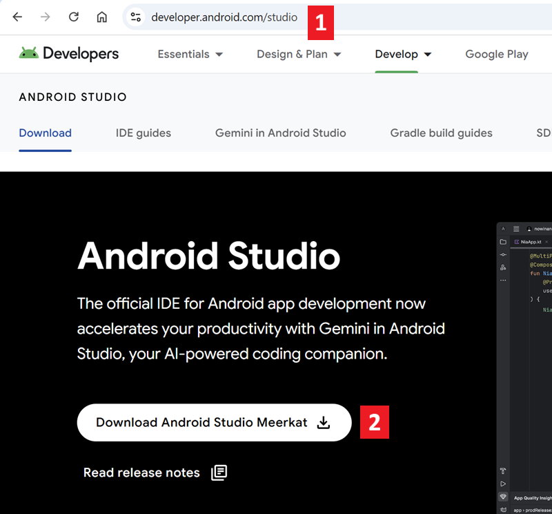

După terminarea descărcării, porniți aplicația descărcată pentru a o instala pe calculator. S-ar putea să fie nevoie să acceptați/confirmați unele avertismente despre aplicațiile descărcate din partea Windows!

Instalați Android Studio prin apăsarea pe "Următorul", așa cum se arată în următoarele capturi de ecran. **Nu** trebuie să schimbați vreo setare!


Dacă doriți să salvați spațiul de stocare, puteți debifa Android Virtual Device: nu este folosit pentru construirea **AAPS**.

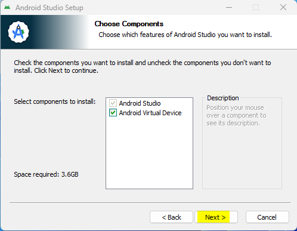


Acum apăsați pe "Instalați":


Odată terminat, apăsați pe "Următorul"


În ultimul pas, apăsați pe "Finalizat" pentru a începe Android Studio pentru prima dată.


Veți fi întrebat dacă doriți să ajutați la îmbunătățirea Android Studio. Alegeți opțiunea dorită de dumneavoastră, nu va conta deloc pentru următorii pași.

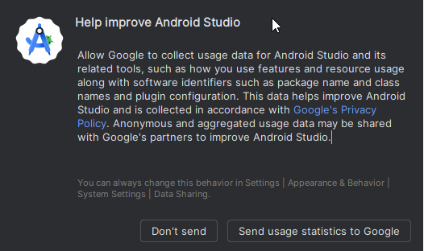

Ecranul de întâmpinare vă salută la instalarea Android Studio. Apăsați "Următorul".


Selectați "Standard" ca tip de instalare.


Verificați setările prin apăsarea din nou pe "Următorul".


Acum trebuie să acceptați acordurile de licență. Aveți două secțiuni (1 + 3) în partea stângă pe care trebuie să le selectați una după cealaltă și după aceea să selectați fiecare "Accept" (2 + 4) în partea dreaptă.

Apoi butonul "Terminat" (5) poate fi apăsat.

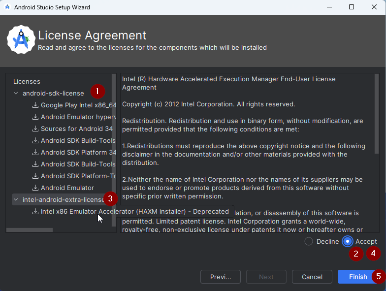

Unele pachete Android vor fi acum descărcate și instalate. Aveți răbdare și așteptați.

Când se termină, veți găsi următorul ecran unde puteți selecta "Finalizați" din nou.

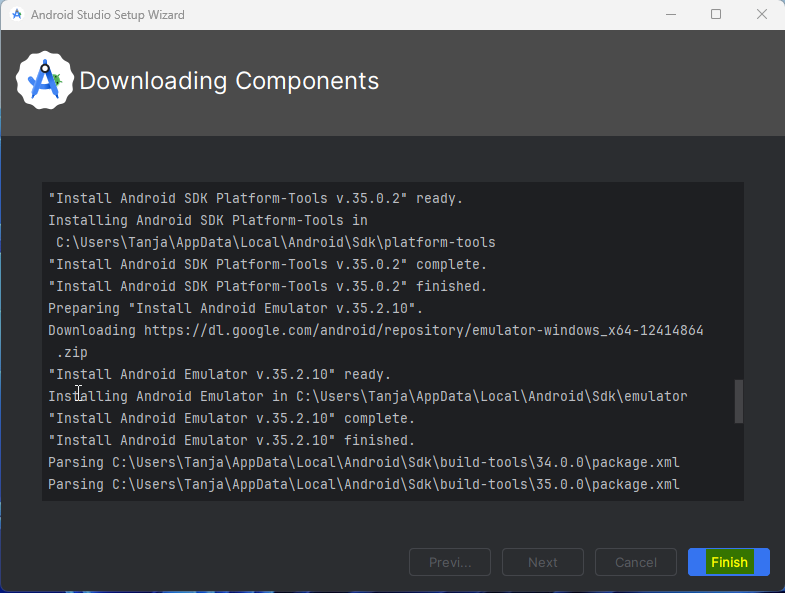

Veți vedea acum ecranul de întâmpinare al Android Studio.

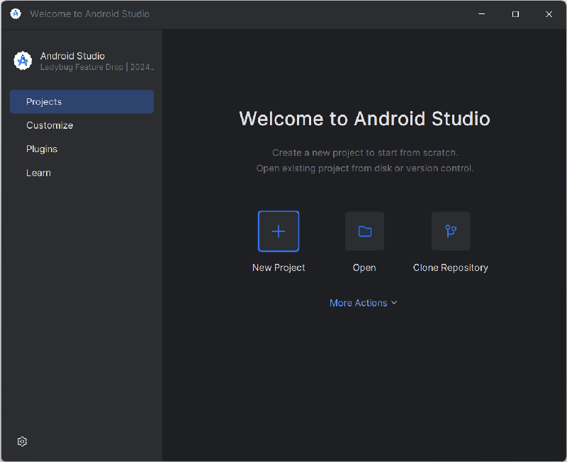


(Building-APK-download-AAPS-code)=
### Descărcați codul AAPS

```{admonition} Why can it take a long time to download the AAPS code?
:class: dropdown

The first time **AAPS** is downloaded, Android Studio will connect over the internet to the Github website to download the source code for **AAPS**. This should take about 1 minute. 

Android Studio will then use **Gradle** (a development tool for Android apps) to identify other components needed to build these items on your computer. 
```

On the Android Studio Welcome screen, check that "**Projects**" (1) is highlighted on the left.

Then click "**Clone Repository**" (2) on the right:


Acum îi vom spune aplicației Android Studio de unde să obțină codul:

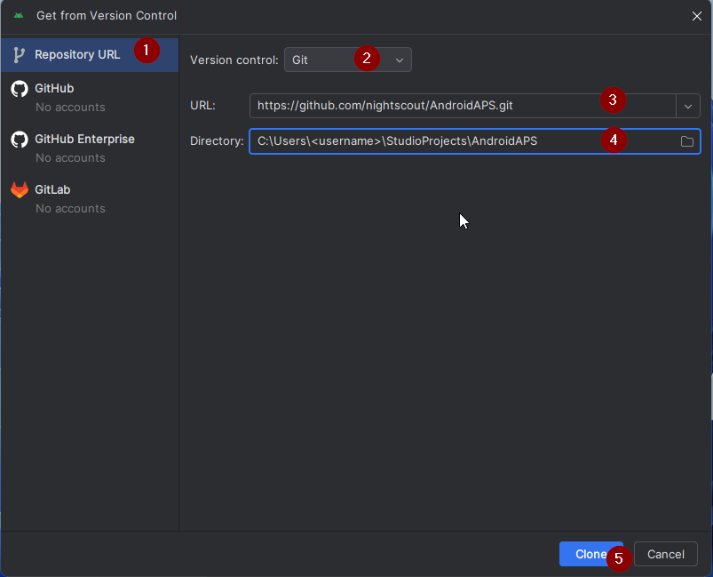

* "Adresa URL a depozitului" ar trebui selectată (implicit) în stânga (1).
* "Git" ar trebui selectat (implicit) ca versiune de control (2).
* Acum copiați acest URL:
    ```
    https://github.com/nightscout/AndroidAPS.git
    ```
    și inserați-l în caseta de text URL (3).

* Check the (default) directory for saving the cloned code does not already exist on your computer (4). Îl puteți schimba într-un alt dosar, dar nu uitați unde l-ați stocat!
* Acum apăsați pe butonul "Clonați" (5).

```{admonition} INFORMATION
:class: information
Make a note of the directory. It is where your sourcecode is stored!
```

Veți vedea acum un ecran care vă va spune că depozitul este clonat:

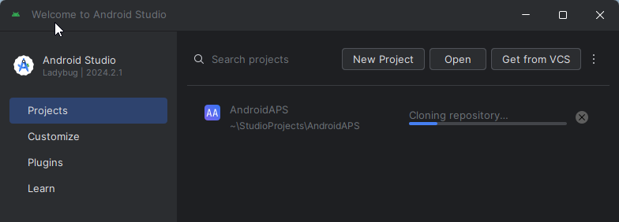

La un moment dat, Android Studio se va închide și va începe din nou. S-ar putea să fiți întrebat dacă doriți să aveți încredere în proiect. Apăsați pe "Aveți încredere în proiect":

  


Doar pentru utilizatorii de Windows: Dacă firewall-ul solicită permisiune, permiteți accesul:

 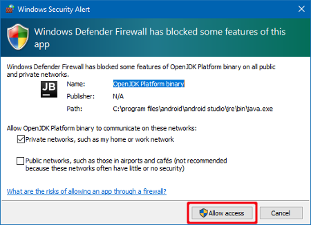

După ce depozitul este clonat cu succes, Android Studio va deschide proiectul clonat.

(NewUI)=
```{admonition} New UI
:class: information
Android Studio changed its UI recently. New installations of Android Studio use the new UI by default!

Only if your Android Studio looks different, you might need to switch to the new UI:
Click on the hamburger menu on the top left, then select **Settings** (or **Preferences** on Apple computers).
In **Appearance & Behaviour**, go to **New UI** and tick **Enable new UI**. Then restart Android Studio to start using it.

If you don't find the option **New UI** don't worry: you are already using it!
```


When Android Studio opened, wait patiently (this may take a few minutes), and particularly, **do not** update the project as suggested in the pop-up.

Android Studio va începe automat o "sincronizare proiect Gradle", care va dura câteva minute până se termină. Îl puteți vedea (încă) cum rulează:


```{admonition} NEVER UPDATE GRADLE!
:class: warning

Android Studio might recommend updating the gradle system. **Never update gradle!** This will lead to difficulties.
```

Only on windows computers: You might get a notification about windows defender running: Click on **Automatically** and confirm, it will make the build run faster!


Puteți lăsa sincronizarea Gradle să ruleze și să urmați deja pașii următori.

(Building-APK-set-git-path-in-preferences)=
### Setați calea Git în preferințele Android Studio

Now we will tell Android studio where to find Git, which you installed [earlier](#install-git-if-you-dont-have-it).

* Windows users only: Make sure you have restarted your computer after [installing Git](#install-git-if-you-dont-have-it). Dacă nu, reporniți acum și redeschideți Android Studio

In the top left corner of **Android Studio**, open the hamburger menu and navigate to **File** > **Settings** (on Windows) or **Android Studio** > **Preferences** (on Mac). This opens the following window, click to expand the dropdown called **Version Control** (1) and select **Git**

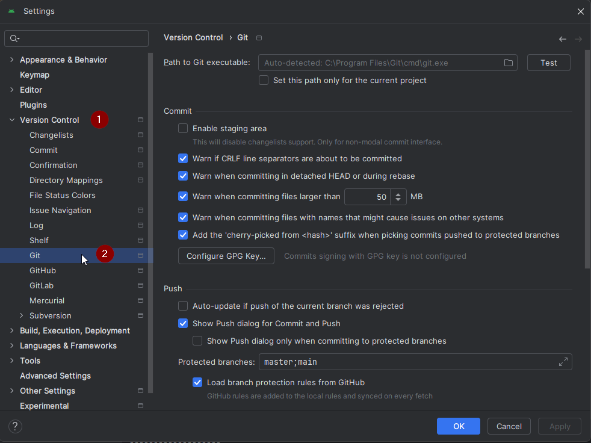

Check if **Android Studio** can automatically locate the correct **Path to Git executable** automatically by clicking the button "Test" (1):

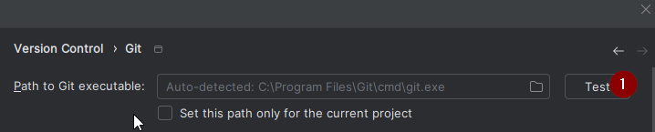


If the automatic setting is successful, your current version of **Git** will be displayed next to the path.

   


If you find that **git.exe** is not found automatically, or that clicking "Test" results in an error (1), you can either
* manually enter the path which you saved [earlier](#BuildingAaps-steps-for-installing-git), or
* click on the folder icon (1) and manually navigating to the directory where **git.exe** was installed [earlier](#BuildingAaps-steps-for-installing-git)
* Verify your settings with the **Test** button!

  

(Building-APK-generate-signed-apk)=
### Construiți APK "semnat" AAPS

```{admonition} Why does the AAPS app need to be "signed"?
:class: dropdown

Android requires each app to be _signed_, to ensure that it can only be updated later from the same trusted source that released the original app. For more information on this topic, follow [this link](https://developer.android.com/studio/publish/app-signing.html#generate-key). 

For our purposes, this just means that we generate a signing or "keystore" file and use it when we build the **AAPS** app.
```


**Important: Make sure the gradle sync is finished successfully before proceeding!**


Apăsați pe meniul hamburger din stânga sus pentru a deschide bara de meniu. Select **Build** (1), then select **Generate Signed App Bundle / APK** (2)

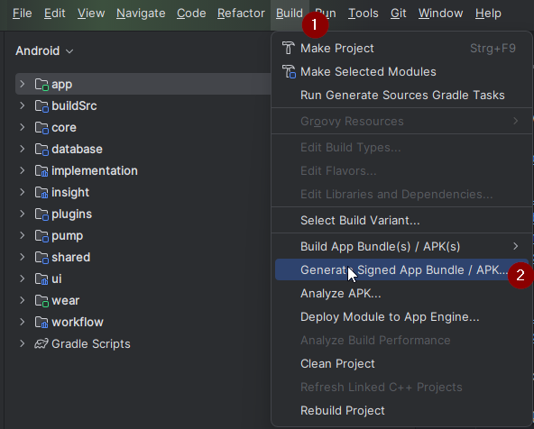

Selectați "APK" în loc de "Android Bundle" și apăsați pe "Următorul":


În ecranul următor, asigurați-vă că "Module" este setat pe "AAPS.app" (1).

(Building-APK-wearapk)=
```{admonition} INFORMATION!
:class: informații
Dacă doriți să creați fișierul apk pentru ceas, acum trebuie să selectați AAPS.wear!
```
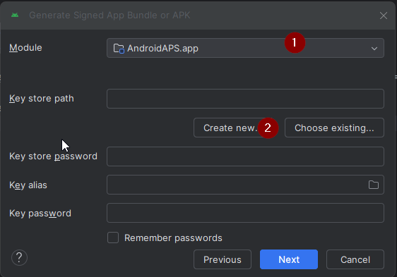

Apăsați pe "Creați nou..." (2) pentru a începe să creați propriul fișier keystore.

```{admonition} INFORMATION!
:class: information
You will only need to create the keystore once.
If you have build AAPS before, do NOT create a new keystore but select your existing one and enter its passwords!
```

**_Note:_** The key store is a file in which the information for signing the app is stored. Este criptat și informația este securizată cu parole.

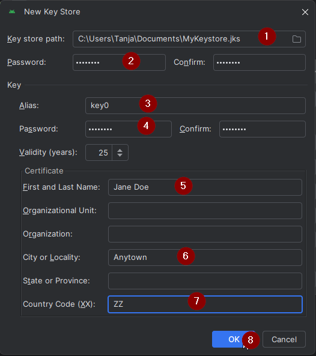

* Apăsați pe simbolul "dosar" (1) pentru a selecta o cale pe calculator pentru fișierul dumneavoastră keystore.

  Do **not** use the directory where you stored your sourcecode but some directory that you would also transfer to a new computer.

```{admonition} WARNING!
:class: warning
Make sure to note down for yourself where your keystore is stored. You will need it when you build the next AndroidAPS update!
```

* Acum alegeți o parolă simplă (și notați-o), introduceți-o în caseta cu parolă (2), și confirmați (2).

  Parolele pentru fișierul keystore și cheia nu trebuie să fie sofisticate. If you lose your password in the future, see [troubleshooting for lost key store](#troubleshooting_androidstudio-lost-keystore).

* Aliasul implicit (3) pentru cheia dumneavoastră este "key0", lăsați acest lucru neschimbat.

* Acum aveți nevoie de o parolă pentru cheia dumneavoastră. Pentru a-l păstra simplu, dacă doriți, puteți utiliza aceeași parolă pe care ați folosit-o mai sus pentru fișierul keystore. Introduceți o parolă (4) și confirmați-o.

```{admonition} WARNING!
:class: warning
Note down these passwords! You will need them when you build the next AAPS update!
```

* Valabilitatea este în mod implicit de 25 de ani, lăsați-o așa cum este.

* Introduceți prenumele și numele (5). Nu trebuie adăugate alte informații, dar sunteți liber să le completați (6-7).

* Apăsați "OK" (8) pentru a continua:


On the **Generate signed App Bundle or APK** page, the path to your keystore will now be displayed. Acum reintroduceți parola pentru Key Store (1) și parola Key (2) și bifați căsuța (3) pentru memorarea parolelor, astfel încât să nu fie nevoie să le introduceți din nou data viitoare când generați fișierul APK (de exemplu, atunci când faceți actualizarea la o versiune nouă de AAPS). Apăsați pe "Următorul" (4):


Pe ecranul următor, selectați construirea variantei "fullRelease" (2) și apăsați pe "Creați" (3). Ar trebui să vă amintiți directorul afișat la (1) pentru că mai târziu veți găsi fișierul apk construit acolo!

   

Android Studio will now build the **AAPS** apk. Acesta va arăta „Gradle Build rulează” (2) în dreapta jos. The process takes some time, depending on your computer and internet connection, so **be patient!** If you want to watch the progress of the build, click on the small hammer "build" (1) at the bottom of Android Studio:


Acum puteți urmări progresul construirii:

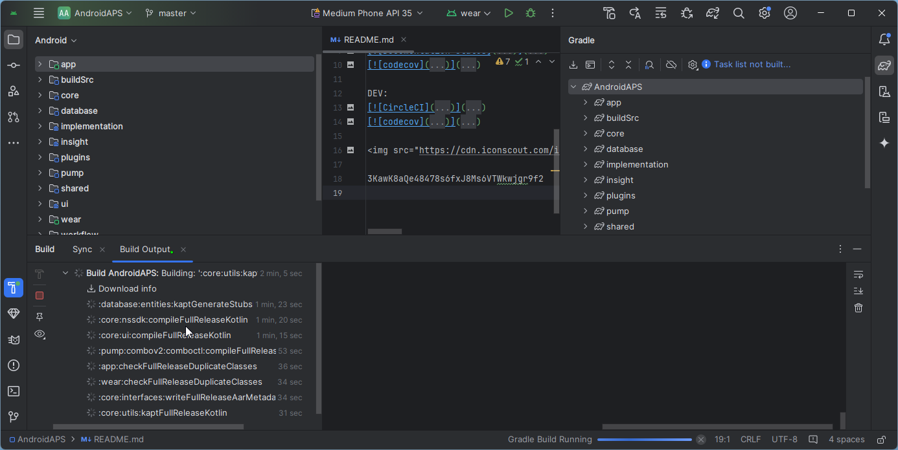

Android Studio va afișa informația "CONSTRUIRE REUȘITĂ" după ce construcția este finalizată. Este posibil să vedeți o notificare de tip fereastră emergentă (pop-up) pe care puteți apăsa pentru a selecta "localizați". If you miss this, click on the notification icon (1) and then on **locate** (2) at the very bottom of the screen to bring up the Notifications:

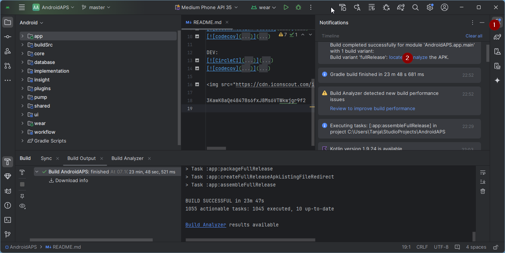

**_If the build was not successful, refer to the [Android Studio Troubleshooting section](../GettingHelp/TroubleshootingAndroidStudio.md)._**

În caseta de Notificări, apăsați pe linkul albastru "localizați":

 Your file manager will open and show you the build apk file that you have just built.

   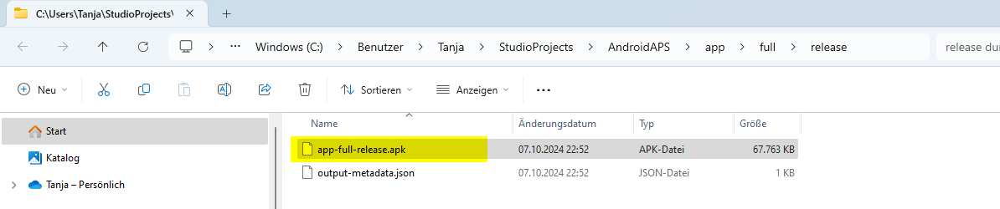

Felicitări! Now you have built the **AAPS** apk file, you will be transferring this file to your smartphone in the next section of the docs.

```{tip}
If you think you might want to use an Android Wear smartwatch in the future, this is the best time to build the AAPS Wear apk to be sure it will be synchronized with your AAPS apk.
```

Move to the next stage of [Transferring and Installing **AAPS**](../SettingUpAaps/TransferringAndInstallingAaps.md).


