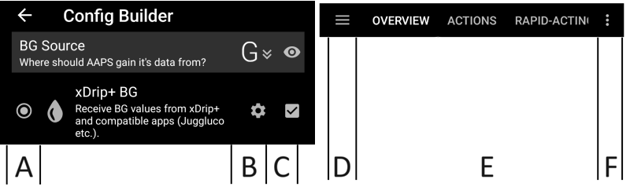
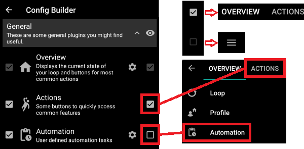
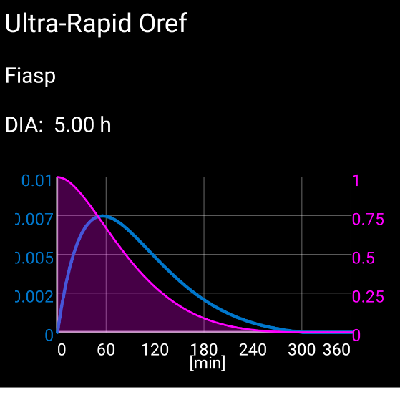
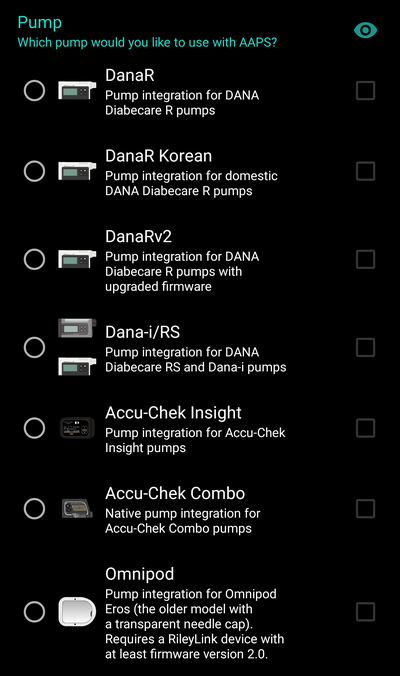
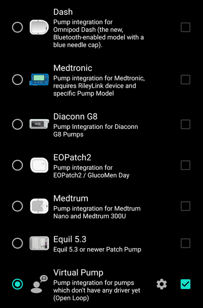

# Configurarea Sistemului (Config Builder)

În funcție de setările dumneavoastră puteți deschide Configuratorul de Sistem printr-o filă din partea de sus a ecranului **AAPS** sau prin meniul hamburger.


**Configuratorul de Sistem** este o secțiune în care puteți porni sau opri diferitele opțiuni modulare. În imaginea de mai jos, casetele din partea stângă (A) îți permit să selectați modulele pe care vreți să le acivați. În mod implicit, la deschiderea Configuratorului de Sistem, secțiunile sunt ascunse pentru a afișa doar modulele active. Apăsați pe săgeată (G) pentru a afișa toate opțiunile disponibile. Casetele din partea dreaptă (C) vă permit să vizualizați modulele active ca o filă (E) în **AAPS**. În cazul în care caseta din dreapta nu este activată, poți ajunge la funcție folosind meniul hamburger (D) din stânga sus a ecranului. Vedeți [Filă sau meniul Hamburger](#tab-or-hamburger-menu) de mai jos.

Când există setări suplimentare disponibile în cadrul modulului, poți face clic pe rotița dințată (B), care te va duce la setările specifice din secțiunea de preferințe.



(Config-Builder-tab-or-hamburger-menu)=

## Fila sau meniul principal

Cu bifa de sub simbol puteți stabili cum să deschideți secțiunea corespunzătoare a programului.



```{contents}
:backlinks: entry
:depth: 2
```

(ConfigBuilder_Profile)=

## Profil

Acest modul nu poate fi dezactivat deoarece este o parte de bază a **AAPS**.

Vedeți [Profilul dumneavoastră AAPS](../SettingUpAaps/YourAapsProfile.md) pentru o înțelegere de bază a ceea ce este în interiorul **Profilului** dumneavoastră.

(Config-Builder-insulin)=

## Insulină


Selectați tipul de insulină pe care o utilizați.

Mai multe informații pentru a înțelege Profilul Insulinei așa cum este indicat în **AAPS** [aici](#AapsScreens-insulin-profile).

### Diferențe între tipurile de insulină

* Toate opțiunile 'Rapid-Acting Oref', Ultra-Rapid Oref', 'Lyumjev' și 'Free-Peak Oref' au formă exponențială.
* Pentru insuline cu durata de 'Acțiune-Rapidă', 'Ultra-Rapidă' și 'Lyumjev', DIA este singura variabilă pe care o poți modifica, durata până la vârf este prestabilită. 
* Opțiunea Insulină Fără-Vârf (Free-Peak) permite să ajustați atât DIA cât și durata până la vârf; trebuie să fie folosită numai de utilizatori avansați care cunosc efectele acestor setări. 
* [Graficul curbei de insulină](#AapsScreens-insulin-profile) vă ajută să înțelegeți diferitele curbe ale insulinei.

#### Oref Acțiune-Rapidă


* recomandat pentru Humalog, Novolog și Novorapid
* DIA = cel puțin 5 ore
* Maximum vârf = 75 minute după injectare (fix, nemodificabilă)

#### Oref Insulină-UltraRapidă



* recomandat pentru FIASP
* DIA = cel puțin 5 ore
* Maximum vârf = 55 minute după injecție (fix, nemodificabil)

(Configurator-lyumjev)=

#### Lyumjev


* profil special de insulină pentru Lyumjev
* DIA = cel puțin 5 ore
* Maximum vârf = 45 minute după injectare (fix, nemodificabil)

#### Oref Fără-Vârf


* Cu tipul de profil "0ref Vârf-Liber" puteți introduce individual durata până la vârf. Pentru a face acest lucru, apăsați pe rotița dințată pentru a intra în setările avansate.
* DIA este setată automat la 5 ore dacă în profil nu se specifică o durată mai mare.
* Acest profil este recomandat în situația în care se utilizează o insulină neacoperită în aplicație sau atunci când se utilizează un amestec de insuline.

(Config-Builder-bg-source)=

## Sursă valoare glicemie

Selectați sursa de monitorizare a glicemiei din sânge pe care o folosiți. Vedeți pagina [Sursă glicemie](../Getting-Started/CompatiblesCgms.md) pentru mai multe informații despre configurare.


* [xDrip+](../CompatibleCgms/xDrip.md)
* [Glicemie NSClient](../CompatibleCgms/CgmNightscoutUpload.md) - doar dacă știți ce faceți, vedeți [Sursă glicemie](../Getting-Started/CompatiblesCgms.md).
* [MM640g](../CompatibleCgms/MM640g.md)
* Glimp - doar versiunea 4.15.57 și versiuni mai noi sunt acceptate
* [Construiește-ți propria aplicație Dexcom (BYODA)](#DexcomG6-if-using-g6-with-build-your-own-dexcom-app).
* [Poctech](../CompatibleCgms/PocTech.md)
* Aplicația Tomato pentru dispozitivul MiaoMiao
* [Aplicația Glunovo](https://infinovo.com/) pentru sistemul de monitorizare al glicemiei Glunovo
* [Ottai](../CompatibleCgms/OttaiM8.md)
* [Syai Tag](../CompatibleCgms/SyaiTagX1.md)
* Glicemie aleatorie: generează valori aleatorii ale glicemiei (doar în modul DEMO)

## Smoothing


Vedeți [Netezirea datelor de glicemie](../CompatibleCgms/SmoothingBloodGlucoseData.md).

(Config-Builder-pump)=

## Pompă

Alegeți tipul de pompă pe care îl folosiți. Vedeți pagina [Pompe Compatibile](../Getting-Started/CompatiblePumps.md) pentru mai multe informații despre configurare.

 

* [Dana R](../CompatiblePumps/DanaR-Insulin-Pump.md)
* Dana R Coreeană (pentru pompa DanaR domestică)
* Dana Rv2 (Pompa DanaR cu actualizare de firmware neoficială)
* [Dana-i/RS](../CompatiblePumps/DanaRS-Insulin-Pump.md)
* [Accu-Chek Insight](../CompatiblePumps/Accu-Chek-Insight-Pump.md)
* [Accu Chek Combo](../CompatiblePumps/Accu-Chek-Combo-Pump-v2.md)
* Omnipod pentru [Omnipod Eros](../CompatiblePumps/OmnipodEros.md)
* Dash pentru [Omnipod DASH](../CompatiblePumps/OmnipodDASH.md)
* [Medtronic](../CompatiblePumps/MedtronicPump.md)
* [Diaconn G8](../CompatiblePumps/DiaconnG8.md)
* [EOPatch2](../CompatiblePumps/EOPatch2.md)
* [Medtrum](../CompatiblePumps/MedtrumNano.md)
* [Equil 5.3](../CompatiblePumps/Equil5.3.md)
* Pompă virtuală: doar sugestii pentru buclă deschisă - **AAPS** 
  * pe măsură ce faceți primii pași cu **AAPS**, în timpul primelor [obiective](../SettingUpAaps/CompletingTheObjectives.md)
  * pentru pompa care încă nu are driver

## Detectare Sensibilitate

Alegeți tipul de detecție a sensibilității. Pentru mai multe detalii despre diferite designuri, vă rugăm să [citiți aici](../DailyLifeWithAaps/SensitivityDetectionAndCob.md). Această funcție analizează în timp real datele istorice și face ajustări dacă consideră că reacționați mai sensibil (sau invers, sunteți mai rezistent) la insulină decât de obicei. Mai multe detalii despre Algoritmul de Sensibilitate pot fi citite în [Documentația OpenAPS](https://openaps.readthedocs.io/en/latest/docs/Customize-Iterate/autosens.html).

Vă puteți vedea sensibilitatea pe ecranul principal într-un [grafic adițional](#AapsScreens-section-g-additional-graphs). Vă puteți vedea sensibilitatea la insulină pe ecranul principal prin selectarea SEN și prin urmărirea liniei albe în grafic. Notă, trebuie să fiți în [Obiectivul 8](#objectives-objective8) pentru a permite Detectării Sensibilității /[Autosens](#Open-APS-features-autosens) să ajusteze automat cantitatea de insulină livrată. Înainte de a ajunge la acest obiectiv, procentajul Autosens / linia din grafic este afișată doar pentru informare.

### Setări absorbție

Dacă utilizați Oref1 cu **SMB** trebuie să schimbați **min_5m_carbimpact** (impactul estimat al carbohidraților la fiecare 5 minute) la 8. Valoarea este utilizată în timpul întreruperii citirilor **CGM** sau atunci când activitatea fizică „folosește" întreaga creștere a glicemiei, care altfel ar determina **AAPS** să scadă COB. În momentele în care [absorbția de carbohidrați](../DailyLifeWithAaps/CobCalculation.md) nu poate fi ajustată dinamic pe baza reacțiilor din sânge, se introduce o degradare implicită a carbohidraților. Practic, este un sistem de siguranță.

(Config-Builder-aps)=

## APS

Selectați algoritmul APS dorit pentru ajustări ale terapiei. Puteți vedea detaliile despre algoritmul ales în fila OpenAPS (OAPS).

* OpenAPS AMA 
  * Asistență Avansată pentru Masă: algoritmul mai vechi nu mai este recomandat.
  * Pe scurt, avantajul este că, după ce îți administrezi un bolus pentru masă, sistemul poate crește mai rapid nivelul temporar al insulinei DACĂ introduci corect valorile pentru carbohidrați.
* [OpenAPS SMB](#Open-APS-features-super-micro-bolus-smb) 
  * Super Micro Bolus: cel mai recent algoritm recomandat pentru toți utilizatorii.
  * Spre deosebire de AMA, SMB nu folosește rate bazale temporare pentru a controla nivelurile glicemiei, ci în principal mici **Super Micro Bolusuri**.
  * Notă: Este recomandat să utilizați acest algoritm de la început, chiar dacă nu veți primi Super Micro Bolusuri (SMB) până la [Obiectivul 9](#objectives-objective9).

Dacă treceți de la algoritmul AMA la algoritmul SMB, *min_5m_carbimpact* trebuie modificat manual în **8** (valoarea implicită pentru SMB) în [Preferințe > Detecția Sensibilității > Setări sensibilitate Oref1 ](../SettingUpAaps/Preferences.md).

## Buclă

Acest modul nu poate fi dezactivat deoarece este o parte de bază a **AAPS**.

## Constrângeri

### Obiective

**AAPS** are un program de învățare (o serie de obiective) pe care trebuie să îl parcurgeți pas cu pas. Acesta ar trebui să vă ghideze să configurați în siguranță un sistem de buclă închisă. Parcurgerea programului de instruire garantează că ați setat totul corect și înțelegeți exact face sistemul. Numai așa puteți avea încredere în sistem.

Vedeți pagina [Obiective](../SettingUpAaps/CompletingTheObjectives.md) pentru mai multe informații.

## Sincronizare

În această secțiune, puteți alege dacă/unde doriți **AAPS** să trimită datele dumnevoastră.

### NSClient sau NSClientV3

Poate fi folosit ca un [server de raportare](../SettingUpAaps/SettingUpTheReportingServer.md) și/sau pentru [monitorizare de la distanță](../RemoteFeatures/RemoteMonitoring.md), [control de la distanță](../RemoteFeatures/RemoteControl.md).

Vedeți [Sincronizarea cu serverul de raportare](#SetupWizard-synchronization-with-the-reporting-server-and-more) pentru a te ajuta să alegeți între NSClient (v1) și NSClientV3.

### Tidepool

Poate fi folosit ca un [server de raportare](../SettingUpAaps/SettingUpTheReportingServer.md).

Vedeți [Tidepool](../SettingUpAaps/Tidepool.md).

### xDrip

Folosit pentru **trimite ** date, cum ar fi tratamente pentru xDrip+.

### Open Humans

Vedeți [Open Humans](../SupportingAaps/OpenHumans.md).

### Ceas

Monitorizează și controlează **AAPS** folosind ceasul cu Android WearOS (vedeți [pagina Afișaj Ceas](../WearOS/WearOsSmartwatch.md)).

### Samsung Tizen

Transmitere de date către aplicația Samsung G-Watch Wear (TizenOS).

### Garmin

Conexiune la dispozitivul Garmin (Fenix, Edge…)

## Tratamente

În fila Tratamente (Treat) puteți vedea tratamentele care au fost încărcate în Nightscout. Dacă doriți să modificați sau să ștergeți date introduse (spre exemplu când ați mâncat mai puțini carbohidrați decât ați estimat), selectați 'Ștergeți' și scrieți noua valoare (schimbați și ora, dacă este necesar) prin butonul carbohidrați din ecranul principal<0>.</p> 

## General

### Privire de ansamblu

Acesta este [ecranul principal](#AapsScreens-the-homescreen) din **AAPS** și nu poate fi dezactivat.

#### Afișați câmpul pentru note în dialogurile de tratamente

Alegeți dacă vreți sau nu să aveți câmpul pentru note atunci când introduceți tratamente.

#### Lumini de stare

Alegeți dacă doriți să aveți [lumini de stare ](#Preferences-status-lights) în privirea de ansamblu pentru vârsta canulei, vârsta insulinei, vârsta senzorului, vârsta bateriei, nivelul rezervorului sau nivelul bateriei. Când nivelul de avertizare este atins, culoarea luminii de stare va comuta la galben. La atingerea nivelului critic culoarea luminii de stare va fi roșie.

#### Setări avansate

**Livrează parțial bolusul calculat de Asistentul Rapid **: Când utilizează SMB (super micro bolus), multe persoane vor să nu primească 100% bolusul de insulină necesar, ci doar parțial (spre exemplu 75 %) și permit SMB prin UAM (unattended meal detection = detectarea automată a mesei) să facă restul. În această setare, puteți alege o valoare implicită pentru procentajul cu care asistentul de bolus ar trebui să calculeze. Dacă în această setare valoarea implicită este stabilită la 75% și ar trebui să bolusați 10u, Asistentul va propune un bolus de doar 7,5 unități.

**Activați funcționalitatea super bolus în asistent ** (Este diferită de *super micro bolus*!): Utilizați cu precauție și nu activați până nu știți cu adevărat ce face. Practic, bazala pentru următoarele două ore este adăugată la bolus și se activează în următoarele două ore o bazală temporară zero. **Funcțiile buclei AAPS vor fi dezactivate - așa că utilizați cu grijă! Dacă utilizați SMB funcțiile de buclă AAPS vor fi dezactivate în funcție de setările dumneavoastră din ["Maximul de minute de bazală pentru a limita SMB la"](#Open-APS-features-max-minutes-of-basal-to-limit-smb-to), dacă nu utilizați SMB funcțiile de buclă vor fi dezactivate pentru două ore.** Detalii despre super bolus pot fi găsite [aici](https://www.diabetesnet.com/diabetes-technology/blue-skying/super-bolus).

(Config-Builder-actions)=

### Acțiuni

O filă care oferă mai multe butoane pentru a întreprinde [acțiuni](#screens-action-tab) în **AAPS**.

### Automatizare

O filă pentru gestionarea <0>Automatizărilor</0>, disponibilă de la <1>Obiectivul 10</1>.

(Config-Builder-sms-communicator)=

### Comunicator SMS

Permite aparținătorilor să controleze de la distanță anumite funcții ale **AAPS**prin SMS, vedeți [Comenzi SMS](../RemoteFeatures/SMSCommands.md) pentru mai multe informații privind configurarea.

### Mâncare

Afișați presetările alimentare definite în baza de date Nightscout, vedeți [Nightscout Readme](https://github.com/nightscout/cgm-remote-monitor#food-custom-foods) pentru mai multe informații despre configurare.

Notă: Intrările nu pot fi utilizate în calculatorul **AAPS**. (Numai vizualizare)

(Config-Builder-wear)=

### Ceas

Monitorizați și controlați AAPS folosind ceasul Android Wear (vedeți [pagina Afișaj Ceas](../WearOS/WearOsSmartwatch.md)). Utilizați setările (rotiță dințată) pentru a stabili variabilele care ar trebui luate în considerare la calcularea bolusului dat de ceas (spre exemplu tendința de 15 minute, COB...).

Dacă doriți să bolusați șamd. de pe ceas, în "Setări Wear", trebuie să activați "Control de pe Ceas".


Prin fila Ceas (Wear) sau prin meniul principal (sus stânga ecranului, dacă fila nu este afișată) puteți

* Retrimiteți toate datele. Ar putea fi de ajutor dacă ceasul nu a fost conectat de ceva timp și doriți să împingeți informațiile către ceas.
* Deschideți setările pe ceas direct de pe telefon.

### Autotune

Puteți activa Autotune, vedeți [aici](../AdvancedOptions/Autotune.md).

### Mentenanță

Accesați această filă pentru a exporta / importa setările.

### Configurarea Sistemului (Config Builder)

Această filă curentă.