# Preferințe

- **Open preferences** by clicking the three-dot menu on the top right side of the home screen.

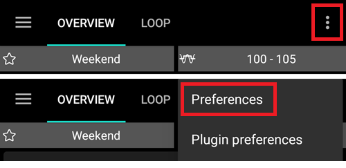

- You can jump directly to preferences for a certain tab (i.e. pump tab) by opening this tab and clicking Plugin preferences.

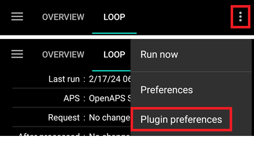

- **Sub-menus** can be opened by clicking the triangle below the sub-menu title.


- With the **filter** on top of the preferences screen you can quickly access certain preferences. Trebuie doar începeți să tastați o parte din textul pe care îl căutați.

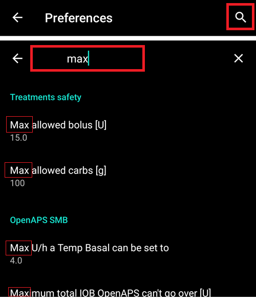

```{contents}
:backlinks: entry
:depth: 2
```

(Preferences-general)=
## General

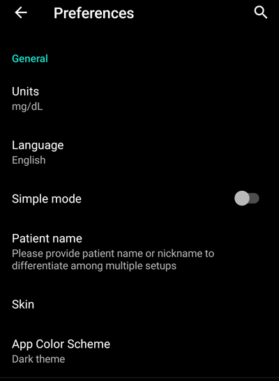

**Unități**

- Setați unitățile in mmol/l sau mg/dl în funcție de preferințe.

**Limba**

- Opțiune nouă de utilizare a limbii implicite a telefonului (recomandat).

- In case you want **AAPS** in a different language than your standard phone language, you can choose from a broad variety.

- If you use different languages, you might sometimes see a language mix. This is due to an android issue where overriding the default android language sometimes doesn't work.
- Setting hidden in [simple mode](#preferences-simple-mode).

(preferences-simple-mode)= **Simple mode**

The **simple mode** is activated by default when you first install **AAPS**. In **simple mode**, a significant amount of settings is hidden and preferences are replaced by predefined values. [Additional graphs](#AapsScreens-section-g-additional-graphs) on the HomePage are also predefined for you. You should switch off Simple mode once you become familiar with **AAPS** user interface and settings.

**Limba**

- Can be used if you have to differentiate between multiple setups (i.e. two T1D kids in your family).
- Displayed in the [Dual Watchface](../WearOS/WearOsSmartwatch.md).

(Preferences-skin)=
### Piele

Setting hidden in [simple mode](#preferences-simple-mode).

Puteți alege din patru tipuri de piele:


'Low resolution skin' comes with shorter labels and age/level removed to have more available space on a very low resolution screen.

Difference between the other skins depends on the phone's display orientation:

#### Orientare în mod vertical

- **Original Skin** and **Buttons are always displayed on bottom of screen** are identical
- **Large Display** has an increased height for all graphs compared to other skins

#### Orientare în mod orizontal

- Using **Original Skin** and **Large Display**, you have to scroll down to see buttons at the bottom of the screen

- **Large Display** has an increased height for all graphs compared to other skins

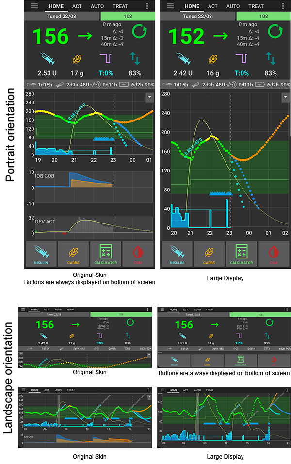

(Preferences-protection)=
## Protecție

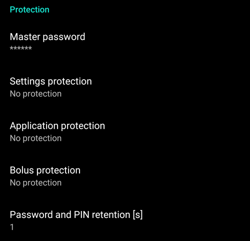

(Preferences-master-password)=
### Parola principală

Mandatory to be able to [export settings](../Maintenance/ExportImportSettings.md) as they are encrypted from version 2.7.

**Biometric protection may not work on OnePlus phones. This is a known issue of OnePlus on some phones.**


### Protecție setări

- Protect your settings with a password or phone's biometric authentication (i.e. [child is using **AAPS**](../RemoteFeatures/RemoteMonitoring.md)). If you enable this feature, you will be prompted for authentication each time you want to access any Preferences related view.

- Custom password should be used if you want to use master password just for securing [exported settings](../Maintenance/ExportImportSettings.md), and use a different one for editing the preferences.

- If you are using a custom password click on line "Settings password" to set password as described [above](#Preferences-master-password).

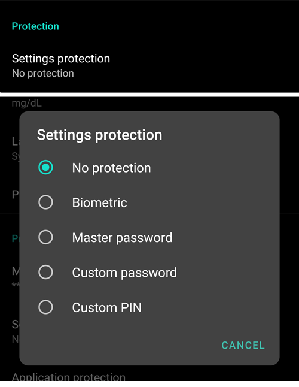

### Protecția aplicației

If the app is protected, you must enter the password or use the phone's biometric authentication to open **AAPS**.

**AAPS** will shut down immediately if a wrong password is entered - but will still run in background if it was previously opened successfully.

### Protecția bolusului

- Bolus protection might be useful if **AAPS** is used by a small child and you [bolus via SMS](../RemoteFeatures/SMSCommands.md).

- In exemplul de mai jos se vede solicitarea pentru protecția biometrică. If biometric authentication does not work, click in the space above the white prompt and enter thr master password.

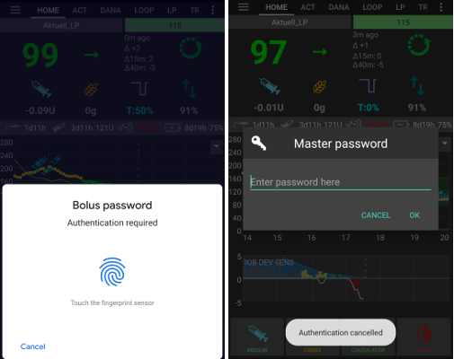

### Password and PIN retention

Define how long (in seconds), the preferences or bolus functionalities remain unlocked after you successfully enter the password.

## Privire de ansamblu

In the **Overview** section, you can define the preferences for the home screen.


### Keep screen on

Option 'Keep screen on' will force Android to keep the screen on at all times. This is useful for presentations etc. But it consumes a lot of battery power. Therefore, it is recommended to connect the smartphone to a charger cable.

(Preferences-buttons)=
### Butoane

- Define which buttons are visible on the bottom of your home screen.
- Setting hidden in [simple mode](#preferences-simple-mode).

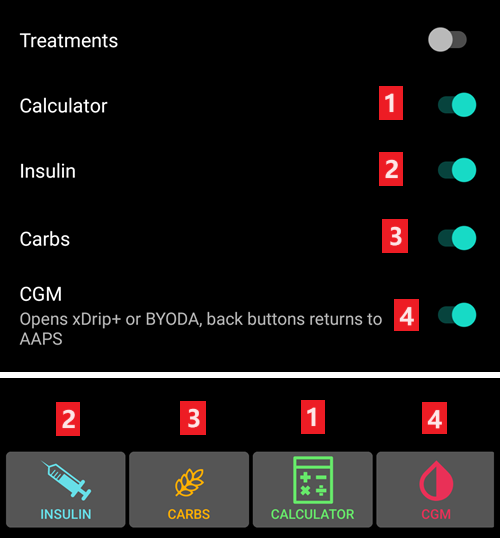

- The **Increment** options allow you to define the amount for the three buttons in the carb and insulin dialogues, for easy entry.


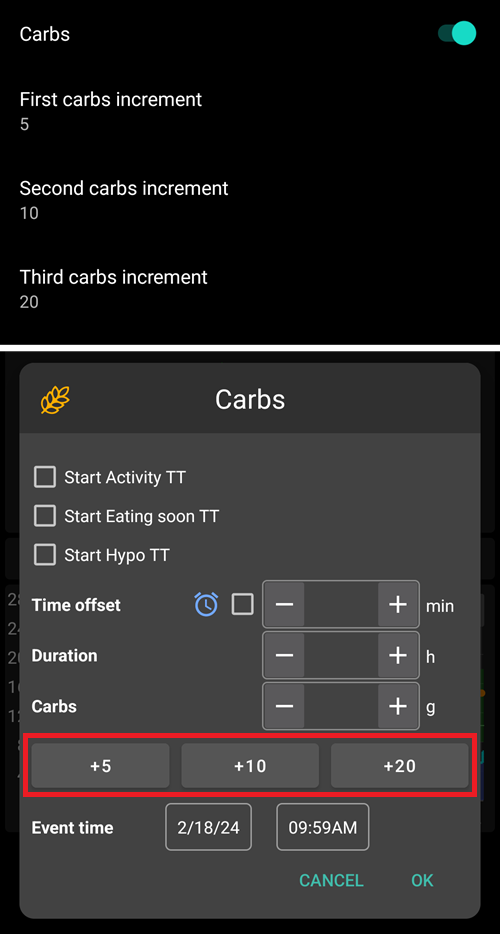

(Preferences-quick-wizard)=
### Asistent Rapid

Create customized buttons for certain standard meals or snacks which will be displayed on the home screen. Useful for standard meals frequently eaten.

For each button, you define the carbs and calculation method for the bolus. Then, you define during which time period the button will be visible on your home screen - just one button per period. The button will not be visible if outside the specified time range or if you have enough IOB to cover the carbs defined in the QuickWizard button. Dacă sunt specificate ore diferite pentru diferite mese, veți avea întotdeauna butonul de masă standard corespunzător pe ecranul de pornire, în funcție de ora zilei.


If you click the quick wizard button **AAPS** will calculate and propose a bolus for those carbs based on your current ratios (considering blood glucose value or insulin on board if set up).

Propunerea trebuie confirmată înainte de a se administra insulină.


Only one QuickWizard button can show up at the same time. If you want to execute a different one : long press on the Quick Wizard button currently showing. It will take you to the list of all Quick Wizard options. To execute one, long press on it. You will have to confirm before execution.

(Preferences-default-temp-targets)=
### Ținte temporare implicite

Setting hidden in [simple mode](#preferences-simple-mode).

[Temporary targets (TT)](../DailyLifeWithAaps/TempTargets.md) allow you to change your blood glucose target for a certain time period. When setting a default TT, you can easily change your target for activity, eating soon etc.

Here you can change the target and the duration for each predefined TT. Valorile prestabilite sunt:

* Eating soon: target 72 mg/dL / 4.0 mmol/l, duration 45 min
* Activity: target 140 mg/dL / 7.8 mmol/l, duration 90 min
* Hypo: target 125 mg/dL / 6.9 mmol/l, duration 45 min

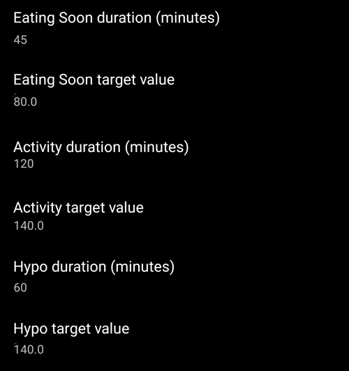

Learn how to [activate Temp Targets here](#TempTargets-where-can-i-select-a-temp-target).

### Umplere/Amorsare cantități standard de insulină

Setting hidden in [simple mode](#preferences-simple-mode).

If you want to fill the tube or prime cannula through **AAPS** you can do this through the [**Actions** tab](#screens-action-tab).

În acest dialog pot fi definite valori prestabilite. Alege butonul corespunzător cantității implicite de insulina pentru umplere/amorsare, în funcție de lungimea cateterului.

(Preferences-range-for-visualization)=
### Intervalul pentru vizualizare

Choose the high and low marks for the BG-graph on **AAPS** overview and smartwatch. Este doar pentru vizualizare, nu este intervalul țintă al glicemiei. Exemplu: 70-180 mg/dl sau 3,9-10 mmol/l

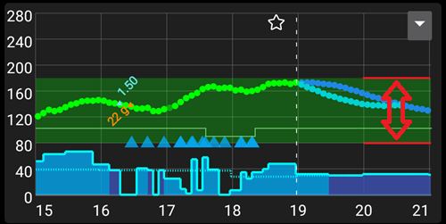

### Scurtează titlurile filelor

Setting hidden in [simple mode](#preferences-simple-mode).

Useful to see more tab titles on screen.

De exemplu, fila "OpenAPS AMA" devine "OAPS", "OBIECTIVE" devine "OBJ" șamd.


(Preferences-show-notes-field-in-treatments-dialogs)=
### Afișați zona pentru note în dialogurile de tratamente

Setting hidden in [simple mode](#preferences-simple-mode).

Oferă posibilitatea sa adaugi texte scurte la tratament (ajutor la bolusare, carbohidrați, insulină...)

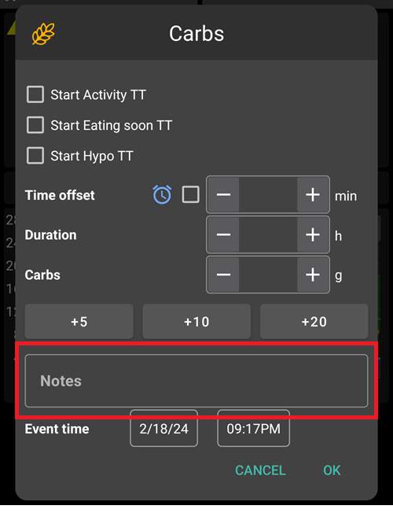

(Preferences-status-lights)=
### Lumini de stare

Setting hidden in [simple mode](#preferences-simple-mode).

Luminile de stare oferă un avertisment vizual pentru:

- Vechime senzor
- Sensor battery level for certain smart readers (see [screenshots page](#screens-sensor-level-battery) for details).
- Vechimea insulinei (de câte zile este utilizat rezervorul)
- Nivelul rezervorului (unități)
- Vechime canulă
- Vechime baterie pompă
- Nivel baterie pompă (%)

If the warning threshold is exceeded, values will be shown in yellow. If the critical threshold is exceeded, values will be shown in red.

The last option allows you to import those settings from Nightscout if defined there. See [Nightscout documentation](https://nightscout.github.io/nightscout/setup_variables/#age-pills) for more information.

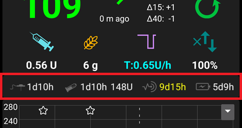

(Preferences-deliver-this-part-of-bolus-wizard-result)=
### Administrează doar această parte din cantitatea calculată de asistent

Set the [default percentage](#AapsScreens-section-j) of the bolus calculated when using the bolus wizard.

Default is 100%: no correction. Even when setting a different value here, you can still change each time you use the bolus wizard. If this setting is 75 % and you had to bolus 10U, the bolus wizard will propose a meal bolus of only 7.5 units.

When using [SMB](#objectives-objective9), many people do not meal-bolus 100% of needed insulin, but only a part of it (e.g. 75 %) and let the SMB with UAM (Unattended Meal Detection) do the rest. Using a value lower than 100% here can be useful:
* for people with slow digestion: sending all the bolus upfront can cause hypo because the insulin action is faster than the digestion.
* to leave more room to **AAPS** to deal by itself with **BG rise**. In both cases, **AAPS** will compensate for the missing part of the bolus with SMBs, if/when deemed adequate.

### Old glycemia time threshold

If the last **BG** received is older than this threshold, then the bolus wizard will by default offer a 100% dose instead of the **Deliver this part of bolus wizard result** setting above. The reason for this is that when **BG** is missing, **AAPS** will not be able to send the remaining part of the bolus afterward (the loop is not running), which would result in high **BG**.

### Enabled bolus advisor

Setting hidden in [simple mode](#preferences-simple-mode).


When enabled, when you use the bolus wizard as you are in hyperglycemia, you will get a warning, prompting you if you wish to pe-bolus and eat later, when your **BG** gets back in range.

### Enabled bolus reminder

Setting hidden in [simple mode](#preferences-simple-mode).

% todo

(Preferences-advanced-settings-overview)=
### Setări avansate (Privire generală)

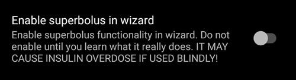

#### Superbolus

Setting hidden in [simple mode](#preferences-simple-mode).

Activarea superbolusului în asistentul de bolus.

[Superbolus](https://www.diabetesnet.com/diabetes-technology/blue-skying/super-bolus/) is a concept to "borrow" some insulin from basal rate in the next two hours to prevent spikes. It is different from *super micro bolus*!

Use with caution and do not enable it until you learn what it really does. Practic, bazala pentru următoarele două ore este adăugată la bolus și se activează în următoarele două ore o bazală temporară zero. **Funcțiile buclei AAPS vor fi dezactivate - așa că utilizați cu grijă! If you use SMB **AAPS** looping functions will be disabled according to your settings in ["Max minutes of basal to limit SMB to"](#Open-APS-features-max-minutes-of-basal-to-limit-smb-to), if you do not use SMB looping functions will be disabled for two hours.** Details on super bolus can be found [here](https://www.diabetesnet.com/diabetes-technology/blue-skying/super-bolus).

## Siguranța tratamentului

(preferences-patient-type)=
### Tip de pacient

- Limitele de siguranță sunt stabilite în baza vârstei selectate în această setare.
- Dacă începeți să vă loviți de aceste limite dure (cum ar fi bolusul maxim) este timpul să vă mutați cu un pas mai sus.
- It's a bad idea to select higher than real age because it can lead to overdosing by entering the wrong value in the insulin dialog (by skipping the decimal dot, for example).
- If you want to know the actual numbers for these hard-coded safety limits, scroll to the algorithm feature you are using on [this page](../DailyLifeWithAaps/KeyAapsFeatures.md).

### Max allowed bolus

- Defines the maximum amount of bolus insulin, in insulin units, that **AAPS** is allowed to deliver at once.
- Această setare are rațiunea de a fi o limită de siguranță pentru a preveni livrarea unor bolusuri masive, datorită unor greșeli de introducere sau din eroarea utilizatorului.
- Este recomandat să stabiliți această valoare la o cantitate de bun simț, care corespunde în linii mari cu maximul de bolus de insulină pe care l-ați putea face la o masă sau ca pe o corecție în mod obișnuit.
- Restricția este, de asemenea, aplicată și rezultatele calculatorului de bolus.

### Max allowed carbs

- Defines the maximum amount of carbs, in grams, that **AAPS** bolus calculator is allowed to dose for.
- Această setare are rațiunea de a fi o limită de siguranță pentru a preveni livrarea unor bolusuri masive, datorită unor greșeli de introducere sau din eroarea utilizatorului.
- Se recomandă să stabiliți această setare la o valoare de bun simț, care să corespundă, în linii mari, cantității maxime de carbohidrați pe care ați putea-o ingera la o masă.

## Buclă

As of [AAPS version 3.4](#version3400), it is no longer possible to set the loop mode here. See [AAPS Screens > The Homescreen > Loop status](#AapsScreens-loop-status) to change loop mode now.

(Preferences-minimal-request-change)=
### Cereri minime pentru modificări

When using **Open loop**, you will receive notifications every time **AAPS** recommends adjusting the basal rate. To reduce the number of notifications you can either use a [wider bg target range](#profile-glucose-targets) or increase the percentage of the minimal request rate. Aceasta definește modificarea relativa care declanșează o notificare.

## Asistent avansat la masă (AMA) sau Super Micro bolus (SMB)

Depending on your settings in [Config builder > APS](../SettingUpAaps/ConfigBuilder.md) you can choose between two algorithms:

- [Advanced meal assist (OpenAPS AMA)](#Open-APS-features-advanced-meal-assist-ama) - state of the algorithm in 2017
- [Super Micro Bolus (OpenAPS SMB)](#Open-APS-features-super-micro-bolus-smb) - most recent algorithm recommended for beginners

As of [**AAPS** version 3.3](#version3300), [Dynamic ISF](../DailyLifeWithAaps/DynamicISF.md) feature has been moved as part of OpenAPS SMB.

### OpenAPS AMA

All the settings for OpenAPS AMA are described in the dedicated section in [Key AAPS Features > Advanced Meal Assist (AMA)](#Open-APS-features-advanced-meal-assist-ama).

(Preferences-openaps-smb-settings)=
### OpenAPS SMB

All the settings for OpenAPS SMB are described in the dedicated section in [Key AAPS Features > Super Micro Bolus (SMB)](#Open-APS-features-super-micro-bolus-smb).

## Setări absorbție

(Preferences-min_5m_carbimpact)=
### min_5m_carbimpact

Setting hidden in [simple mode](#preferences-simple-mode).

The algorithm uses BGI (blood glucose impact) to determine when [carbs are absorbed](../DailyLifeWithAaps/CobCalculation.md).

At times when carb absorption can’t be dynamically worked out based on your blood's reactions, **AAPS** inserts a default decay to your carbs. Practic, este un sistem de siguranță. This value is only used during gaps in **CGM** readings or when physical activity “uses up” all the blood glucose rise that would otherwise cause **AAPS** to decay COB.

Pentru a spune mai simplu: Algoritmul "știe" cum *ar trebui* să se comporte glicemia ta atunci când este afectată de doza actuală de insulină șamd. Ori de câte ori există o deviere pozitivă de la comportamentul așteptat, câțiva carbohidrați sunt absorbiți/eliminați. Schimbare mare=mulți carbohidrați etc.

Algoritmul min_5m_carbimpact definește impactul implicit al absorbției carbohidraților per 5 minute. For more details see [OpenAPS docs](https://openaps.readthedocs.io/en/latest/docs/While%20You%20Wait%20For%20Gear/preferences-and-safety-settings.html?highlight=carbimpact#min-5m-carbimpact).

Valoarea standard pentru AMA este 5, pentru SMB este 8.

Graficul COB de pe ecranul principal indică atunci când este folosit min_5m_impact punând un cerc portocaliu în partea de sus.


### Meal max absorption time

Dacă mâncați în mod obișnuit mâncăruri grase sau cu proteine multe, va trebui să creșteți timpul de absorbție.

### Setări avansate - raport autosens

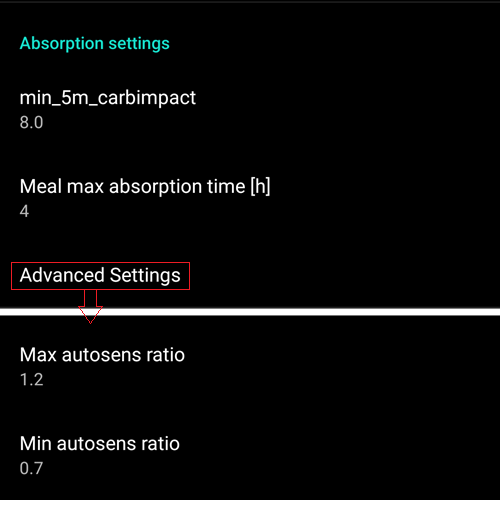

- Define min. and max. [autosens](#Open-APS-features-autosens) ratio.
- Normally standard values (max. 1.2 and min. 0.7) should not be changed.

## Pompă

### BT Watchdog

Activate BT watchdog if necessary (e.g. for Dana pumps). Asta va opri Bluetooth pentru o secundă daca nu este posibilă conexiunea la pompă. Aceasta poate ajuta în cazul unor telefoane cărora le îngheață stiva Bluetooth.

## Setări pompă

The options here will vary depending on which pump driver you have selected in [Config Builder > Pump](#Config-Builder-pump).  Pair and set your pump up according to the [pump related instructions](../Getting-Started/CompatiblePumps.md).

## Tidepool

More information on the dedicated [Tidepool](../SettingUpAaps/Tidepool.md) page.

(Preferences-nsclient)=
## Client NS


Original communication protocol, can be used with older Nightscout versions.

- Set your *Nightscout URL* (i.e. <https://yoursitename.yourplaform.dom>).
- **Make sure that the URL is WITHOUT /api/v1/ at the end.**
- The *[API secret](https://nightscout.github.io/nightscout/setup_variables/#api-secret-nightscout-password)* (a 12 character password recorded in your Nightscout variables).
- This enables data to be read and written between both the Nightscout website and **AAPS**.
- Verificați temeinic să nu existe greșeli de scriere în aceste setări, în cazul în care nu puteți îndeplini Obiectivul 1.

## NSClientV3

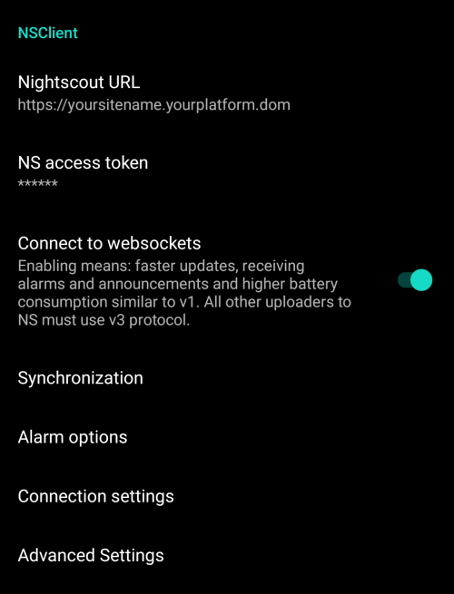

[New protocol introduced with AAPS 3.2.](#Important-comments-on-using-v3-versus-v1-API-for-Nightscout-with-AAPS) Safer and more efficient.

```{admonition} V3 data uploaders
:class: warning

When using NSClientV3, all uploaders must be using the API V3. Since most are not compatible yet, this means **you must let **AAPS** upload all data** (BG, treatments, ...) to Nightscout and disable all other uploaders if they're not V3 compliant.
```

- Set your *Nightscout URL* (i.e. <https://yoursitename.yourplaform.dom>).
- **Make sure that the URL is WITHOUT /api/v1/ at the end.**
- In Nightscout, create an *[Admin token](https://nightscout.github.io/nightscout/security/#create-a-token)* (requires [Nightscout 15](https://nightscout.github.io/update/update/) to use the V3 API) and enter it in the **NS access token** (not your API Secret!).
- This enables data to be read and written between both the Nightscout website and **AAPS**.
- Verificați temeinic să nu existe greșeli de scriere în aceste setări, în cazul în care nu puteți îndeplini Obiectivul 1.
- Leave Connect to websockets enabled (recommended).

(Preferences-nsclient-synchronization)=
### Sincronizare

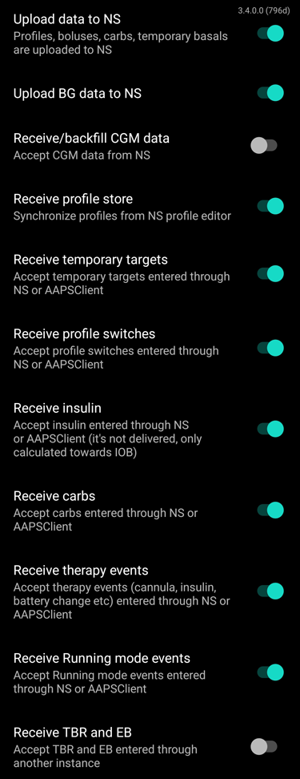

Synchronization choices will depend on the way you will want to use **AAPS**.

You can select which data you want to [upload and download to or from Nightscout](#Nightscout-aaps-settings).

### Opțiuni alarme


- Alarm options allows you to select which Nightscout alarms to use through the app. **AAPS** will alarm when a Nightscout alarm triggers.
- For the alarms to sound you need to set the Urgent High, High, Low and Urgent Low alarm values in your [Nightscout variables](https://nightscout.github.io/nightscout/setup_variables/#alarms).
- They will only work whilst you have a connection to Nightscout and are intended for parent/caregivers.
- If you have the **CGM** source on your phone (i.e. xDrip+ or BYODA) then use those alarms instead of Nightscout Alarms.
- Create notifications from Nightscout [announcements](https://nightscout.github.io/nightscout/discover/#announcement) will echo Nightscout announcements in the **AAPS** notifications bar.
- You can change stale data and urgent stale data alarms threshold when no data is received from Nightscout after a certain time.

### Setări conexiune

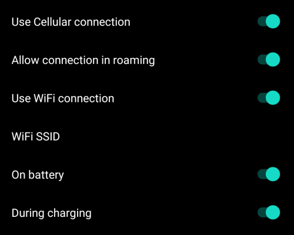

- Connection settings define when Nightscout connection will be enabled.
- Restricționați încărcarea Nightscout doar prin Wi-Fi sau doar prin anumite rețele Wi-Fi.
- If you want to use only a specific Wi-Fi network you can enter its Wi-Fi SSID.
- Rețele SSID multiple pot fi separate prin punct și virgulă.
- Pentru a șterge toate rețelele SSID introduceți un spațiu gol în câmp.

(Preferences-advanced-settings-nsclient)=
### Setări avansate (NSClient)

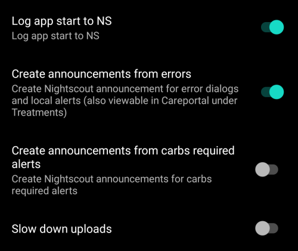

Options in advanced settings are self-explanatory.

## Comunicator SMS

More information on the dedicated [SMS Commands](../RemoteFeatures/SMSCommands.md) page.

## Automatizare

Selectați ce serviciu de localizare va fi folosit:

- Use passive location: **AAPS** only takes locations if other apps are requesting it
- Folosiți locația de rețea: Locația Wi-Fi
- Utilizează locația GPS (Atenție! Poate cauza un consum excesiv de baterie!)

## Alerte locale


Setările ar trebui să fie de la sine înțelese.

(preferences-maintenance-settings)=
## Setări Întreținere

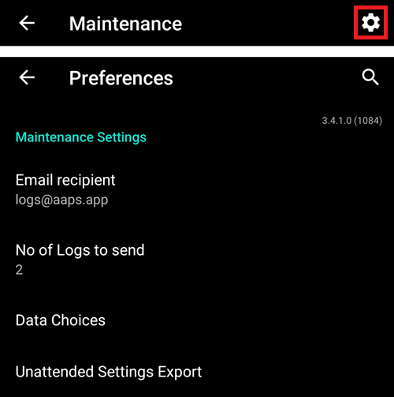

**Email recipient**: Standard recipient of logs is <logs@aaps.app>.

**Alegerea datelor**

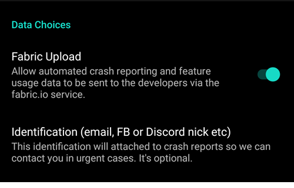

You can help develop **AAPS** further by sending crash reports to the developers.

**Unattended Settings Export**<br/> By enabling this feature, you allow **AAPS** to execute settings exports without user intervention. For this the master password is securely stored on your phone (only) at the next manually export. The stored password will be used for up to 4 weeks. After 4 weeks you will be notified the password is about to expire. During a grace period of 1 week, the password can then be refreshed by manually exporting settings from the maintenance menu.

After the grace period of 1 week has passed the stored password expires and any automated settings export will abort while notifying the user, asking to reenter the password.  [(**Automated settings exports**)](../DailyLifeWithAaps/Automations.md#automating-preference-settings-export)  will be logged to the **AAPS** 'Careportal' and 'User entry' lists under Treatments.

After enabling this option, make sure to perform a manual settings export, where you will be requested for your password, so that **AAPS** can store it.

### Fișiere jurnal

AAPS will save logs for troubleshooting.

Do not disable this feature: it will help understanding the reasons if something goes wrong.

If you need to send the logs to the developers, make sure you file accurately the mail contents to describe the issue. It is preferable to send logs only after being requested to do so, following an [issue report in GitHub](https://github.com/nightscout/AndroidAPS/issues).

You can find AAPS logs in your phone memory -> Android -> data -> info.nightscout.androidaps -> files.

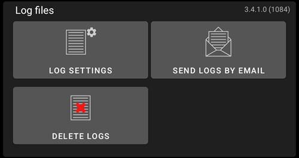

(preferences-maintenance-logdirectory)=

### Setting the local AAPS directory

Maintenance settings also include the **AAPS** directory, which can be found directly under the Maintenance tab. This setting allows the user to choose a directory on their phone where **AAPS** will store preferences, logs, and other files.

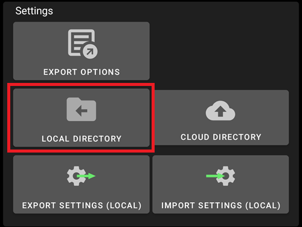

It is strongly recommended to use a directory directly in the main entry of your phone memory. Default is AAPS.


If you select a subdirectory of AAPS, you will see an error message. Tap "OK" and retry, selecting the correct directory (one above). Do not select "DISMISS" unless you clearly know what you are doing.


(preferences-maintenance-cloud)=

### Setting a cloud directory

You can export your settings, logs and CSV data to a cloud service.

1.  Select Cloud directory
2. Select your cloud service
3. Enable cloud export


You can then define what data will be uploaded to the cloud.

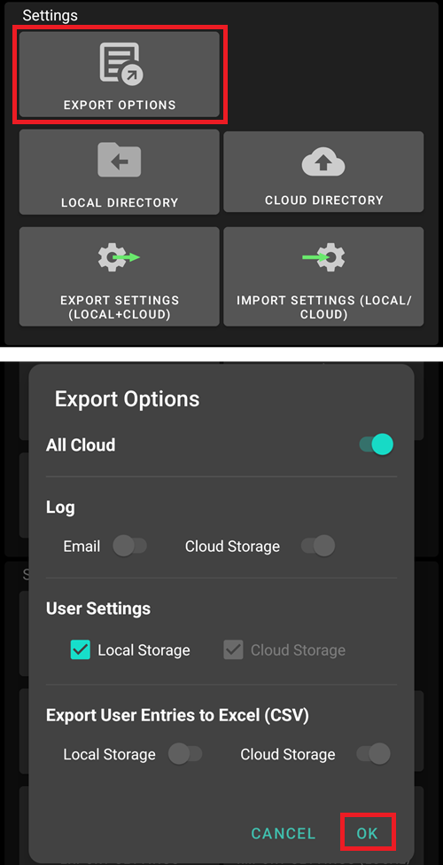

You can disable cloud export.


## Open Humans

Poți ajuta comunitatea prin donarea datelor tale către proiecte de cercetare! Details are described on the [Open Humans page](../SupportingAaps/OpenHumans.md).

In Preferences, you can define when data shall be uploaded
- only if connected to Wi-Fi
- doar când se încarcă
