# AAPS Setup Wizard

When you first start **AAPS** you are guided by the "**Setup Wizard**", to quickly setup all the basic configurations of your app in one go. **Setup Wizard** guides you, in order to avoid forgetting something crucial. For example, the **permission settings** are fundamental for setting up **AAPS** correctly.

However, it's not mandatory to get everything completely configured in the first run of using the **Setup Wizard** and you can easily exit the Wizard and come back to it later. There are three routes available after the **Setup Wizard** to further optimise/change the configuration. These will be explained in the next section. So, it's okay if you skip some points in the Setup Wizard, you can easily configure them later.

During, and directly after using the **Setup Wizard** you may not notice any significant observable changes in **AAPS**. To enable your **AAPS** loop, you have to follow the **Objectives** to enable feature after feature. You will start **Objective 1** at the end of the Setup Wizard. You are the master of **AAPS**, not the other way around.

```{admonition} Preview Objectives
:class: note
If you are keen to know the structure of the objectives, please read [Completing the objectives](../SettingUpAaps/CompletingTheObjectives.md) but then come back here to run the Setup Wizard first.

```

From previous experience, we are aware that new starters often put themselves under pressure to setup **AAPS** as fast as possible, which can lead to frustration as it is a big learning curve.

So, please take your time in configuring your loop, the benefits of a well-running **AAPS** loop are huge.

```{admonition} Ask for Help
:class: note
If there is an error in the documentation or you have a better idea for how something can be explained, you can ask for help from the community as explained at [Connect with other users](../GettingHelp/WhereCanIGetHelp.md).
```
## Welcome message

This is just the welcome message which you can skip with the "NEXT" button:

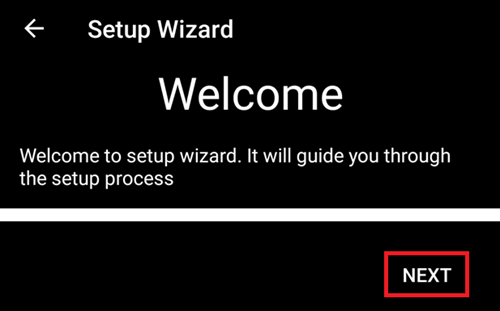

## Acord de licențiere

In the end user license agreement there is important information about the legal aspects of using **AAPS**. Vă rugăm să o citiți cu atenție.

If you don't understand, or can't agree to the end user license agreement please don't use **AAPS** at all!

Dacă înțelegeți și sunteți de acord, vă rugăm să apăsați pe butonul "ÎNȚELEG ȘI SUNT DE ACORD" și să urmați ghidul de configurare:

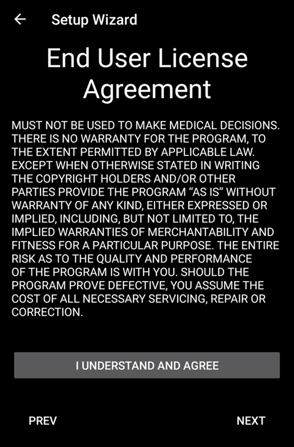

## Permisiunile necesare

**AAPS** needs some requirements to operate correctly.

In the following screen you are asked several questions you have to agree to, to get **AAPS** working. Asistentul în sine explică de ce solicită setările relevante.

În acest ecran, dorim să oferim mai multe informații de fond, să traducem mai multe informații tehnice în limba comună sau să explicăm motivul. Continue reading below to see each permission request.


### Notificări

Android necesită permisiuni speciale pentru aplicații dacă acestea doresc să vă trimită notificări.

While it is a good feature to disable notifications _e.g._ from  social media apps, it is essential that you allow **AAPS** to send you notifications.

Please click the first "ASK FOR PERMISSION" button:


Selectați aplicația "AAPS":


Activați "Permiteți afișare deasupra altor aplicați" prin glisarea comutatorului spre dreapta:


Comutatorul trebuie să arate în acest fel dacă este activat:


### Battery optimization

Battery consumption on smartphones is a consideration, as the performance of batteries is still quite limited. Therefore, the Android operating system on your smartphone is restrictive about allowing applications to run and consume CPU time, and therefore battery power.

However, **AAPS** needs to run regularly, _e.g._ to receive the glucose readings every few minutes and then apply the algorithm to decide how to deal with your glucose levels, based on your specifications. Prin urmare, trebuie să i se permită să facă asta de către Android.

Faceți acest lucru prin confirmarea setării.

Click the second "ASK FOR PERMISSION" button.

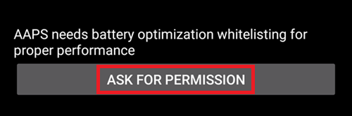

Vă rugăm să selectați "Permiteți":

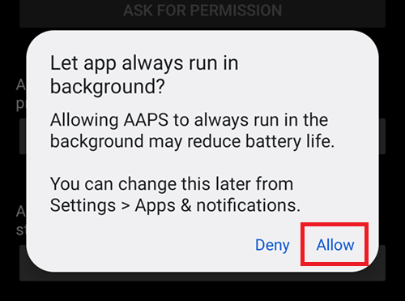

(setup-wizard-bluetooth-battery-optimisation)=
### Bluetooth battery optimisation

Newer versions of Android have added battery optimisation to the system Bluetooth application too.

As well as Disabling battery optimisation for **AAPS**, you will likely need to also disable this for the Bluetooth system app. Failure to do this may lead to pump connection dropouts and issues.

***NOTE: The xDrip documentation covers how to do this here: [xDrip documentation](https://navid200.github.io/xDrip/docs/BluetoothBatteryOpt.html)***

Follow these steps on Android 16, other versions will varies slightly from the provided screenshots:

1. Open Android settings and search for **Apps**, and open the Apps settings.

   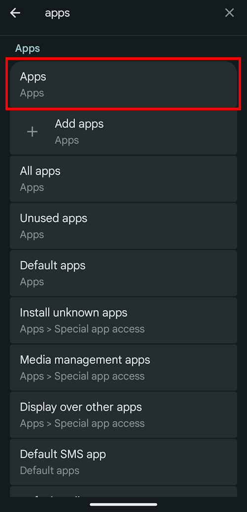

2. You will see the App settings, however we need to expand to see all apps, click on **See all apps** to expand.

   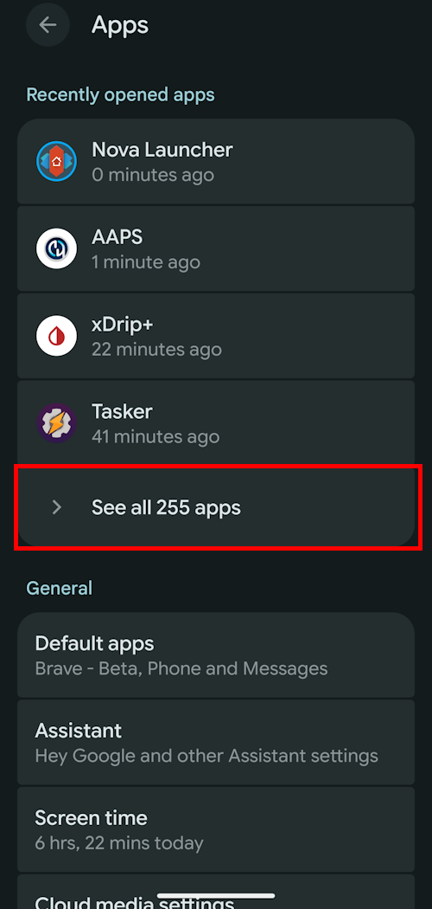

3. As the Bluetooth app is a system app its hidden by default, we need to show system apps. Click on the **three dots (hamburger)** on the top left (1). Then click on **Show System** (2).

   

4. Search for the `Bluetooth` app and click on `Bluetooth` and/or `Legacy Bluetooth` if both are present ensure the procedure is followed for both.

   ***NOTE: It's safe to ignore the `Bluetooth MIDI Service` this is not used by AAPS***

   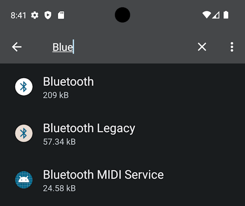        

   1. On Android 12 Click on `Battery`, Android 13+ Click on `App battery usage`,

   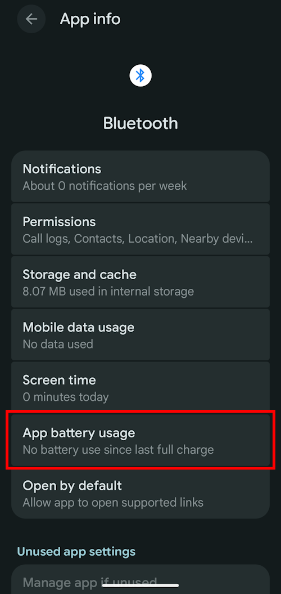)   

5. On Android 12+ select the `Unrestricted` option, on Android 15+ you need to expand the `Allow background usage` setting, click on the section highlighted in red to do this then follow step 6 to complete.

       

6. On Android 16 Select `Unrestricted`

   

(SetupWizard-StoragePermission)=

### Storage permission

**AAPS** needs to log information to the permanent storage of your smartphone. Stocarea permanentă înseamnă că va fi disponibilă chiar și după repornirea telefonului dumneavoastră inteligent. Alte informații se pierd, deoarece nu sunt salvate în spațiul de stocare permanent.

Click the first "ASK FOR PERMISSION" button:


Apăsați pe "Permiteți":


Click "AAPS Directory". This opens the filesystem on your phone and allows you to choose where you want AAPS to store its information.

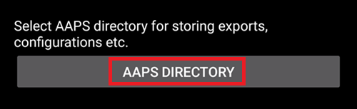

```{tip}
Choosing the default AAPS directory is recommended.</br>
Do **not** select a subdirectory of AAPS.
```

The default directory is **AAPS**, but you can use any dedicated directory of your liking. Create the directory if necessary, enter it, and choose "Use this folder":

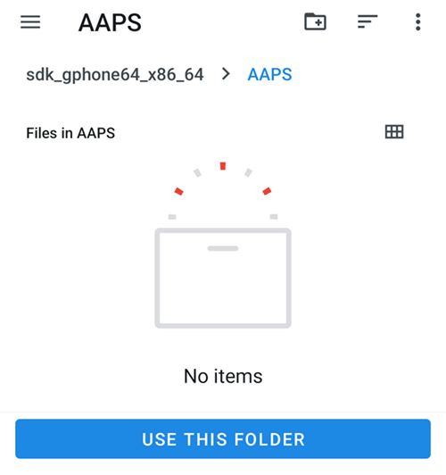

Confirm that you wish to grant access to **AAPS** to the selected directory:


Apăsați pe butonul "URMĂTORUL":


### Localizare

Android links the use of Bluetooth communication to the ability to use location services. Poate că l-ați văzut și cu alte aplicații. It's common to need location permission if you want to access Bluetooth.

**AAPS** uses Bluetooth to communicate with your CGM and insulin pump if they are directly controlled by **AAPS** and not another app which is used by **AAPS**. Detaliile pot diferi de la configurare la configurare.

Click the first "ASK FOR PERMISSION" button:


Acest lucru este important. Otherwise **AAPS** can not work properly at all.

Apăsați pe "În timp ce utilizați aplicația":


Click the second "ASK FOR PERMISSION" button:


Select "Allow all the time".

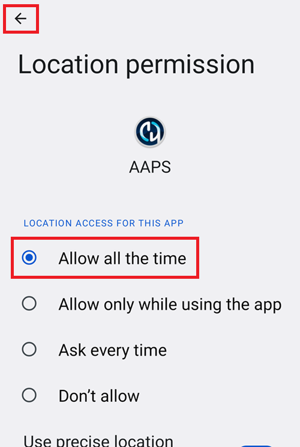


Apăsați pe butonul "URMĂTORUL":


## Parola principală

As the configuration of **AAPS** contains some sensitive data (_e.g._ API_KEY for accessing your Nightscout server) it is encrypted by a password you can set here.

The second sentence is very important, please **DO NOT LOSE YOUR MASTER PASSWORD**. Please make a note of it _e.g._ on Google Drive. Google Drive is a good place as it is backed up by Google for you. Your smartphone or PC can crash and you may have no actual copy. If you forget your Master Password, it can be difficult to recover your profile configuration and progress through the **Objectives** at a later date.

After filling in the password twice, please click the "NEXT" button:


### Importă setările

```{tip}
Import your last settings file if present.</br>
You can also do this after completing the wizard.</br>
If you already have them ready, importing now will be faster than recreating you profile.
```

If your current AAPS directory contains settings, you will be asked if you want to import them.

This will happen only if you uninstalled and reinstalled AAPS on the same phone.

Tap NEXT if you don't want to restore them now.

Tap RESTORE SETTINGS to select which file to restore, then NEXT.

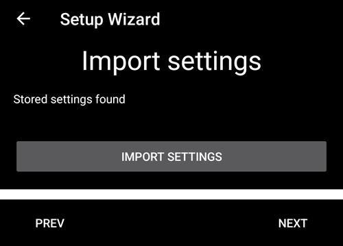

## Units (mg/dL <-> mmol/L)

Please select if your glucose values are in mg/dL or mmol/L and then please click the "NEXT" button:


## Display settings

 Here you select the range for the sensor glucose display, which will be shown as "in range" between the values you set. You can leave it as the default values for now, and edit it later.

The values you choose only affect the graphical presentation of the diagram, and nothing else.

Your glucose target _e.g._ is configured separately in your profile.

Your range to analyze TIR (time in range) is configured separately in your reporting server.

Please press the "NEXT" button:


(SetupWizard-synchronization-with-the-reporting-server-and-more)=
## Synchronization with the reporting server and more

Here you are configuring the data upload to your reporting server.

You could do other configurations here too, but for the first run we will just focus on the reporting server.

If you are not able to set it up at the moment, skip it for now. You can configure it later.

If you select an item here on the left tick box, on the right you can then ticking the visibility (eye) box, which will place this plugin in the upper menu on the **AAPS** home screen. Please select the visibility too if you configure your reporting server at this point.

In this example we select Nightscout as reporting server, and will configure it.

```{admonition}  **NSClient** version
:class: Note

Click [here](#version3200) for the release notes of **AAPS** 3.2.0.0 which explain the differences between the top option **NSClient** (this is "v1", although it is not explicitly labelled) and the second option, **NSClient v3**.
```
Pentru Tidepool este chiar mai simplu, deoarece aveți nevoie doar de informațiile dumneavoastră personale de autentificare.

După ce ați făcut selecția, apăsați butonul rotiță zimțată lângă elementul pe care l-ați selectat:

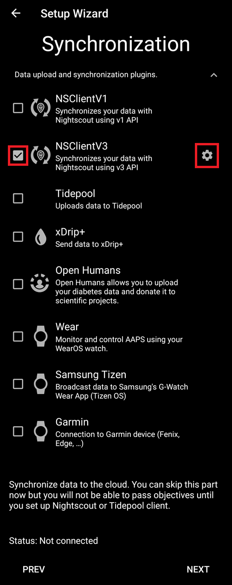

Aici configurați serverul de raportare Nightscout.

Vă rugăm să apăsați pe "Nightscout URL":

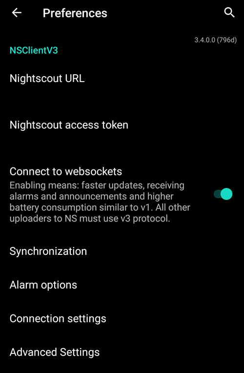

Introduceți adresa de Nightscout care este serverul dumneavoastră personal Nightscout. Este doar o adresă URL pe care ați configurat-o, sau care v-a fost dată de furnizorul de servicii pentru Nightscout.

Vă rugăm să apăsați pe butonul "OK":

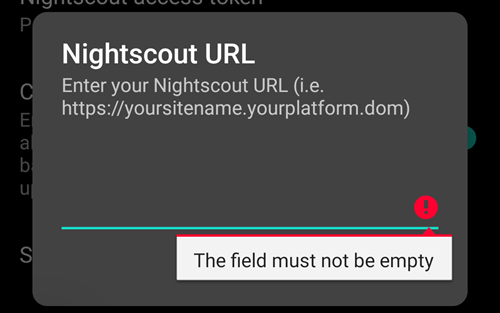

Enter your Nightscout access token. Acesta este jetonul de acces pentru serverul Nightscout pe care l-ați configurat. Fără acest jeton, accesul nu va funcționa.

If you don't have it at the moment please check the documentation for setting up the reporting server in the **AAPS** documentation.

After filling in the "**Nightscout access token**" and clicking "OK", please click on the "Synchronization" button:


Please select "Upload data to NS" if you already configured Nightscout in the previous steps of the Setup Wizard.

If you have stored profiles on Nightscout and want to download them to **AAPS**, enable "Receive profile store":


Mergeți înapoi la ecranul anterior și selectați "Opțiunea Alarmă":

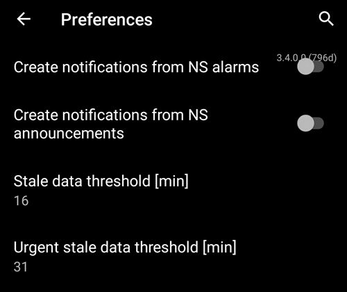

Deocamdată, lăsați comutatoarele dezactivate. We only walked to the screen to make you familiar with possible options you might configure in the future. În acest moment nu este nevoie să facem acest lucru.

Înapoi la ecranul anterior și selectați "Setări conexiune".

Aici puteți configura cum să transferați datele dumneavoastră pe serverul de raportare.

Caregivers must enable "use cellular connection" as otherwise the smartphone which serves the dependant/child can not upload data outside of WiFi range _e.g._ on the way to school.

Other **AAPS** users can disable the transfer via cellular connection if they want to save data or battery.

Dacă aveți dubii, lăsați totul activat.

Mergeți înapoi la ecranul de dinainte și selectați "Setări avansate".


Activați "Înregistrați pornirea aplicației în NS" dacă doriți să obțineți aceste informații pe serverul de raportare. Vă poate ajuta să aflați de la distanță dacă și când aplicația a fost repornită, în special ca îngrijitor.

It might be interesting to see if **AAPS** is correctly configured now, but later it is usually not that important to be able to see **AAPS** stopping or starting in Nightscout.

Activați "Creați anunțuri pe baza erorilor" și "Creați anunțuri cu carbohidrații necesari".

Lăsați "Încetiniți încărcările" dezactivat. You would only use it in unusual circumstances if for example a lot of information is to be transferred to the Nightscout server, and the Nightscout server is being slow in processing this data.

Mergeți înapoi de două ori, la lista de module și selectați "URMĂTORUL" pentru a merge la următorul ecran:


## Limba

Here you can setup your name in **AAPS**.

Poate fi orice. Este doar pentru diferențierea utilizatorilor.

Pentru a păstra lucrurile simple trebuie doar să introduceți prenumele și numele.

Apăsați "URMĂTORUL" pentru a merge la următorul ecran.

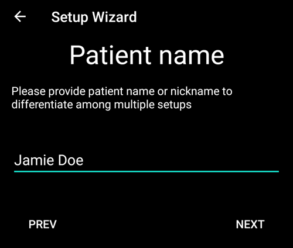

## Tip de pacient

Here you select your "Patient type" which is important, as the **AAPS** software has different limits, depending on the age of the patient. Acest lucru este important din motive de securitate și siguranță.

Here is where you also configure the **maximum allowed bolus** for a meal. Adică, cel mai mare bolus pe care trebuie să-l dați pentru a acoperi mesele obișnuite. Este o caracteristică de securitate care ajută la evitarea unei supradozări accidentale atunci când bolusați pentru masă.

A doua limită este similară din punct de vedere al conceptului, dar se referă la cantitatea maximă de carbohidrați pe care o așteptați.

După setarea acestor valori, apăsați "URMĂTORUL" pentru a merge la următorul ecran:

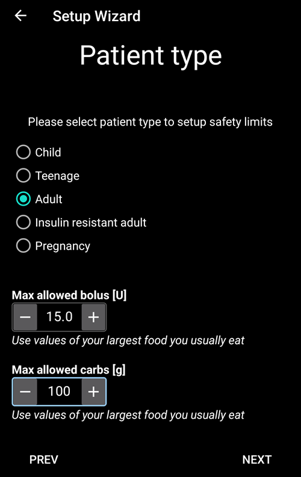

## Insulină utilizată

Selectați tipul de insulină care este utilizată în pompă.

Denumirile tipurilor de insulină ar trebui să fie de la sine înțelese.

```{admonition} Don't use the "Free-Peak Oref" unless you know what you are doing
:class: danger
For advanced users or medical studies there is the possibility to define with "Free-Peak Oref" a customised profile of how insulin acts. Please don't use it unless you are an expert, usually the pre-defined values work well for each branded insulin.
```

Apăsați "URMĂTORUL" pentru a merge la următorul ecran:

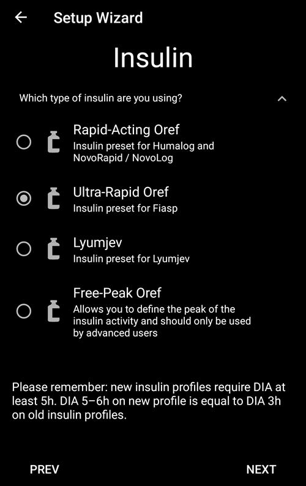


## Sursa glicemiei

Selectați sursa de glicemie pe care o folosiți. Please read the documentation for your [BG source](../Getting-Started/CompatiblesCgms.md).

Deoarece sunt disponibile mai multe opțiuni, nu explicăm configurația pentru toate aceste opțiuni. We are using xDrip+ in our example here:


Enable the visibility in the top level menu by clicking the check box on the right side.

După ce faceți selecția, apăsați "URMĂTORUL" pentru a merge la următorul ecran:


Click on the cogwheel button to access the settings.

Enable the "Upload BG data to NS" and "Log sensor change to NS".

Go back and press "NEXT" to go to the next screen:


(setup-wizard-profile)=
## Profil

Now we are entering a very important part of the Setup Wizard.

Please read the documentation about [profiles](../SettingUpAaps/YourAapsProfile.md) before you try to enter your profile details on the following screen.

```{admonition} Working profile required - no exceptions here !
:class: danger
An accurate profile is necessary to control the safe action of **AAPS**.

It's required that you have determined and discussed your profile with your doctor, and that it has been proven to work by successful basal rate, ISF and IC testing!

If a robot has an incorrect input it will fail - consistently. **AAPS** can only work with the information it is given. If your profile is too strong, you risk hypoglycemia, and if it is too weak, you risk hyperglycemia. 
```

Apăsați "URMĂTORUL" pentru a merge la următorul ecran. Enter a "profile name":

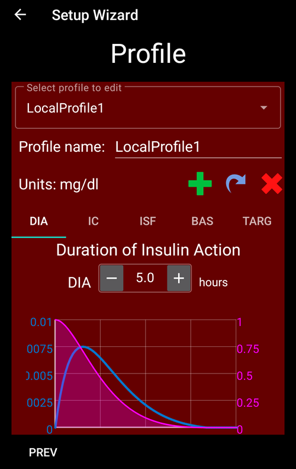


You can have several profiles in the long-term if needed. We only create one here.

```{admonition} Profile only for tutorial - not for your usage
:class: information
The example profile here is only to show you how to enter data.

It is not intended to be an accurate profile or something very well optimised, because each person's needs are so different.

Don't use it for actually looping!
```

Enter your [Duration of insulin Action (DIA)](#your-aaps-profile-duration-of-insulin-action) in hours. Then press "IC":


Enter your [IC](#your-aaps-profile-insulin-to-carbs-ratio) values:


Press "ISF". Enter your [ISF values](#your-aaps-profile-insulin-sensitivity-factor):

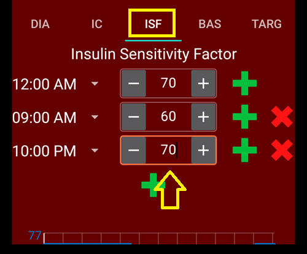


Press "BAS". Enter your [basal values](#your-aaps-profile-basal-rates):

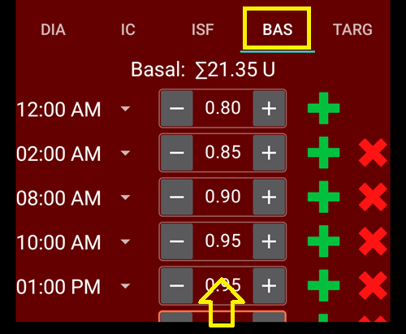


Press "TARG". Enter your blood sugar target values.

For open looping this target can be a wider range, as otherwise **AAPS** notifies you permanently to change the temporary basal rate or another setting, which can be exhausting.

Later, for closed looping, you will generally have only one value for top and bottom. That makes it easier for **AAPS** to hit the target and give you better overall diabetes control.

Enter/confirm the target values:


Save the profile by clicking on "SAVE":

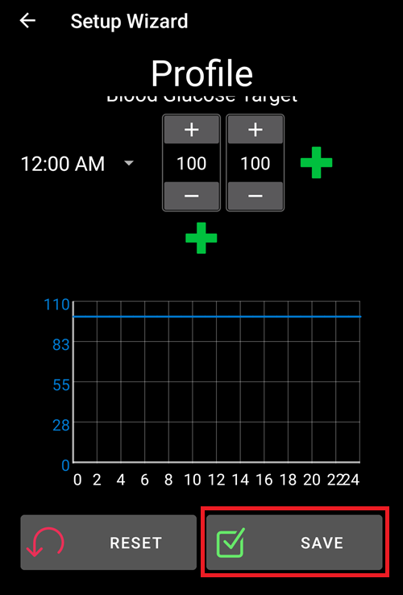


After saving, a new button "Activate Profile" appears.

```{admonition} Several defined but only one active profile
:class: information
You can have several profiles defined, but only one activated profile running at any given time.
```

Press "Activate Profile":

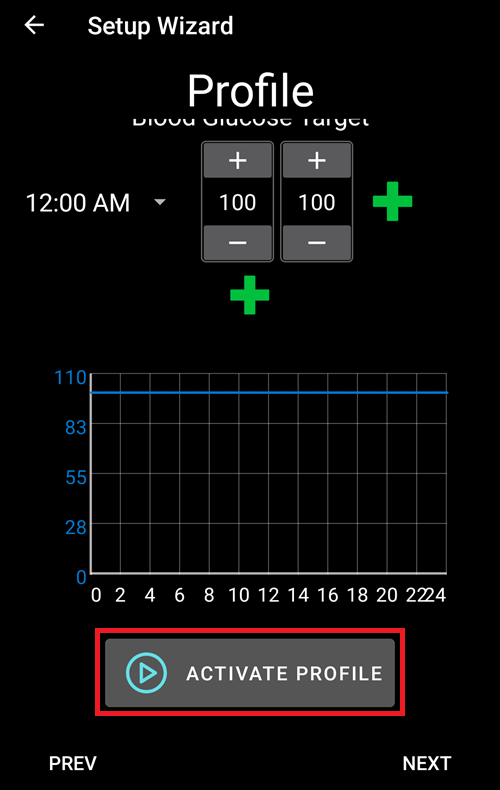


The profile switch dialogue appears. In this case let it stay as preset.

```{admonition} Several defined but only one active profile
:class: information
You will learn later how to use this general dialog to handle situations like illness or sport, where you need to change your profile suitable for the circumstances.
```


Press "OK":


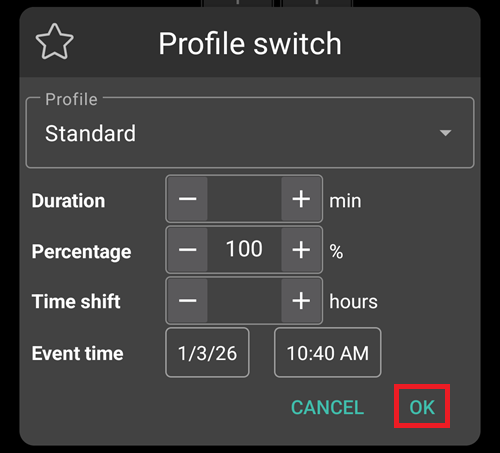


A confirmation dialog for the profile switch appears.

You can confirm it with pressing "OK". Apăsați "URMĂTORUL" pentru a merge la următorul ecran:

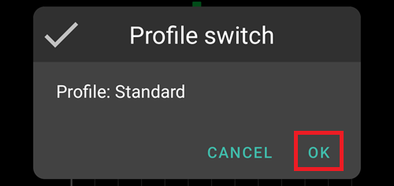

Your profile has now been set:

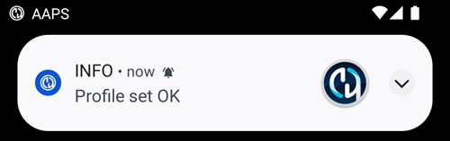


## Pompa de insulină


Now you are selecting your insulin pump.

You get an important warning dialog. Please read it, and press "OK".

Dacă v-ați configurat deja profilul în pașii de dinainte și știți cum să conectați pompa, nu ezitați s-o conectați acum.

Otherwise, leave the Setup Wizard, using the arrow in the top left corner and let **AAPS** first show you some blood glucose values. Puteți reveni oricând sau să folosiți una dintre opțiunile de configurare directă (nu prin folosirea Asistentului).

Please read the documentation for your [insulin pump](../Getting-Started/CompatiblePumps.md).

Apăsați "URMĂTORUL" pentru a merge la următorul ecran.


Once a pump requiring AAPS to use Bluetooth is select, you will see a warning: AAPS requires Bluetooth permission. This will be addressed after you complete the Wizard.


In this case we select "Virtual Pump".


## Algoritm APS

Use the OpenAPS SMB algorithm as your APS algorithm. Despite the name the SMB feature of the algorithm is disabled until you are familiar with AAPS and already worked through the first objectives. OpenAPS SMB is newer and in general better compared to the OpenAPS AMA anyway.

The reason SMB is disabled in the beginning is because the SMB feature enables faster reaction on blood sugar increase through the Super Micro Bolus instead of increasing the basal rate percentage. As in the beginning your profile is in general not as good as after some time of experience the feature is disabled in the beginning.

```{admonition} Only use the older algorithm **OpenAPS AMA** if you know what you are doing
:class: information
OpenAPS AMA is the most basic algorithm which does not support micro boluses to correct high values. There might be circumstances where it is better to use this algorithm but it is not the recommendation.
```

Press the cogwheel to see the details:

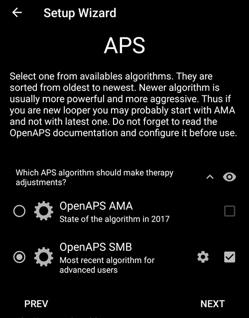


Only read the text and change nothing here.

Due to the limitations which are imposed by the **Objectives** you can't use either "closed loop" or "SMB features" at the moment anyway.

Go back and press "NEXT" to go to the next screen:

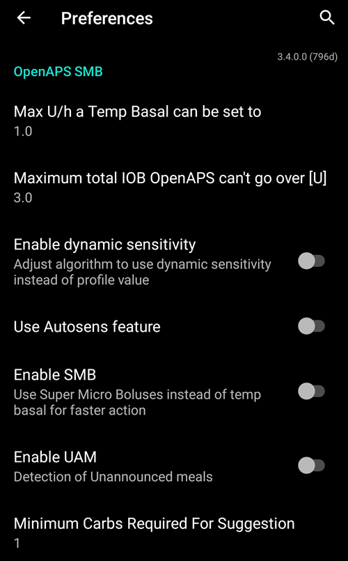

## Detectare sensibilitate

Let "Sensitivity Oref1" the standard for the sensitivity plugins selected.

Apăsați "URMĂTORUL" pentru a merge la următorul ecran:


## Start Objective 1

You are entering now the Objectives. The qualification for access to further **AAPS** features.

Here we start Objective 1, even if at the moment our setup is not completely ready to successfully complete this Objective.

But this is the start.

Press the green "START" to to start objective 1:


You see that you already made some progress, but other areas are to be done.

Press "FINISH" to go to the next screen.

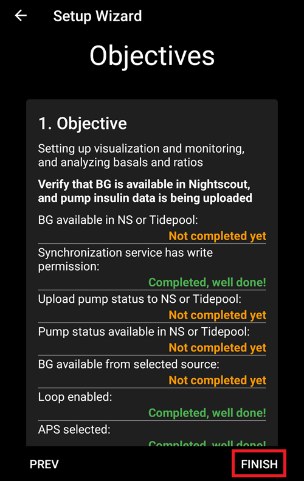

You are coming to the home screen of **AAPS**.

Here you find the information message in **AAPS** that you set your profile.

This was done when we switched to our new profile.

You can click "SNOOZE" and it will disappear.


If you accidentally leave the Setup Wizard at any point, you can either simply re-start the Wizard, or change the [configuration of the AAPS loop](../SettingUpAaps/ChangeAapsConfiguration.md) manually.

## Restart AAPS to validate settings

From the top right menu, select Exit to force AAPS to restart.


If you selected a Bluetooth connected pump, you will now see the permission request:


Allow AAPS to connect to nearby devices.

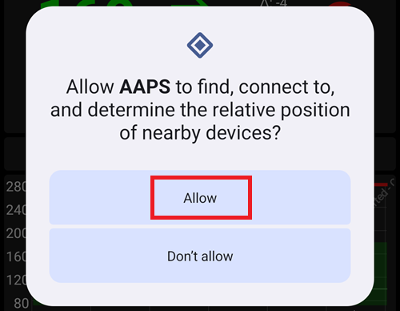

If your **AAPS** loop is now fully setup, please move on to the next section ["Completing the objectives"](../SettingUpAaps/CompletingTheObjectives.md).