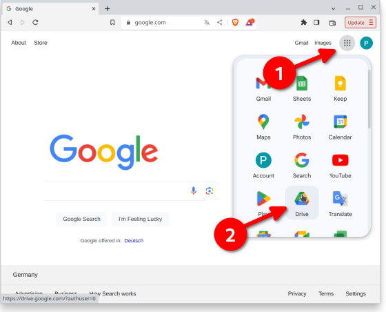
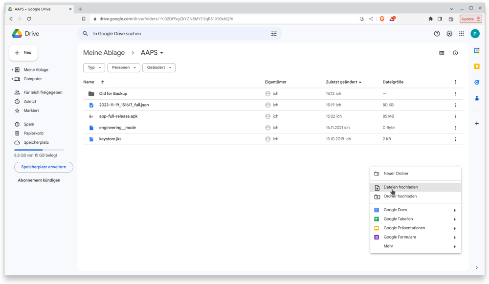
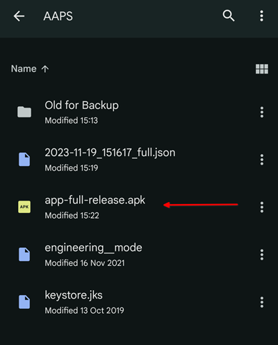

# Transferring and Installing AAPS on your smartphone

În secțiunea anterioară, [Construirea **AAPS**](../SettingUpAaps/BuildingAaps.md), ați construit aplicația AAPS</strong> **(care este un fișier apk) pe un computer. </p>

Următorii pași sunt pentru **transferul** fișierului APK al **AAPS** (și al altor aplicații de care ați mai avea nevoie, cum ar fi BYODA, xDrip+ sau alte aplicații CGM de recepționat) pe telefonul dumneavoastră Android, și apoi **instalarea** acestor aplicații.

După instalarea **AAPS** pe telefonul inteligent, veți putea trece la [**Configurarea buclei AAPS**](../SettingUpAaps/SetupWizard.md).

Există mai multe modalități de a transfera fișierul APK **AAPS** de pe computer pe telefonul inteligent. Here we explain two different ways:

* Option 1 -  Use your Google drive (Gdrive)
* Option 2 -  Use a USB cable

Please note that transfer by email might cause difficulties, and is discouraged.

## Option 1. Use Google drive to transfer files

Deschideți [Google.com](https://www.google.com/) în navigatorul de internet și autentificați-vă în contul dumneavoastră Google.

On the right upper side select the Drive app in the Google menu.



Right click in the free area below the files and folders in the Google Drive app and select "Upload File".



The apk file should now be uploaded on Google Drive.


### Use the Google Drive app to execute the apk file for installation

Switch to your mobile and start the Google Drive app. It is a preinstalled app and can be found where the other Google apps are located or with search for the name of the app.


Launch the apk installation by double click on the filename in the Google Drive App on the mobile.



In case you get a security notice that you are not allowed to install apps from Google Driver at the moment please allow it for that short moment and disallow it afterwards as it is a security risk when you let it enable all the time.


After the installation finished your are done with this step.

ar trebui să vedeți pictograma **AAPS** și să puteți deschide aplicația.

```{warning}
**NOTIFICAT DE SIGURANȚĂ**
V-ați amintit să nu permiteți instalarea de pe Google Drive?
```

Vă rugăm să continuați cu [Configurare buclă AAPS](../SettingUpAaps/SetupWizard.md).

## Option 2. Use a USB cable to transfer files
Cea de-a doua modalitate de a transfera fișierul apk AAPS este cu un cablu [USB](https://support.google.com/android/answer/9064445?hl=en).

Transfer the file from its location on your computer to the "downloads" folder on the phone.

On your phone, you will have to allow installation from unknown sources. Explicații despre cum să faceți acest lucru pot fi găsite pe internet (_spre exemplu_ [aici](https://www.expressvpn.com/de/support/vpn-setup/enable-apk-installs-android/) sau [aici](https://www.androidcentral.com/unknown-sources)).

Once you have transferred the file by dragging it across, to install it, open the "downloads" folder on the phone, press the AAPS apk and select "install". Poți trece apoi la pasul următor, [Instalarea](../SettingUpAaps/SetupWizard.md), care vă va ajuta să configurați aplicația **AAPS** și să închideți bucla pe telefonul dumneavoastră inteligent.

Vă rugăm să continuați cu [Configurare buclă AAPS](../SettingUpAaps/SetupWizard.md).