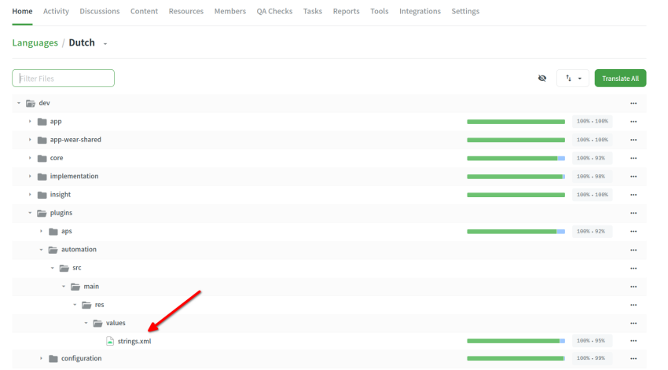
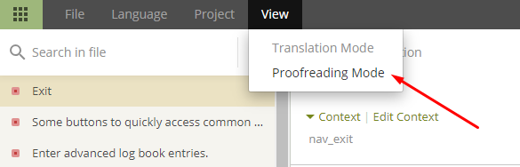
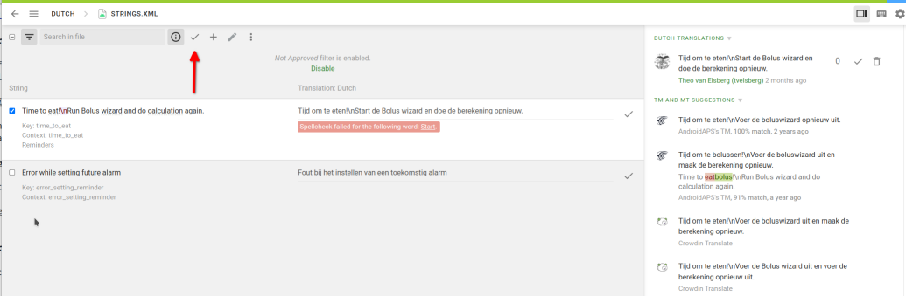
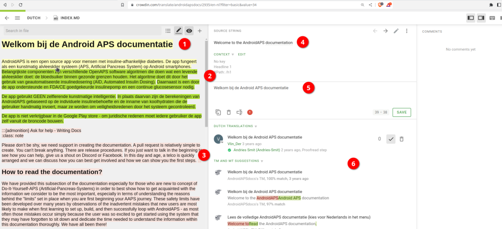

# Cum să traducem fraze pentru aplicația AAPS sau documentație

* Pentru frazele utilizate în aplicație mergeți la <https://crowdin.com/project/androidaps> și autentificați-vă folosind contul GitHub
* Pentru documentație vă rugăm să vizitați <https://crowdin.com/project/androidapsdocs> și să vă autentificați folosind contul GitHub

* Trimiteți o cerere de aderare echipei ce se ocupă de documente. Pentru a face acest lucru, faceți clic pe steagul limbii dorite și apoi pe butonul "Alăturare" din colțul din dreapta sus al paginii următoare. Vă rugăm să menționați limba, oferiți câteva informații despre dumneavoastră și experiența AAPS și dacă dorești să fii traducător sau corector (numai persoane competente în traducere + utilizatori avansați AAPS).

```{admonition} Time for Approval :class: note

Aprobarea este un pas manual. Ca organizație non-profit, nu oferim SLA dar, în general, aprobarea va fi făcută în < 1 zi. Dacă nu, vă rugăm să contactați echipa Doc prin Facebook sau Discord.

    <br />* Când vă aprobăm, faceți clic pe steagul
       ! Când vă aprobăm, faceți clic pe steagul](../images/translation_flags.png)
    
    ## Traducerea aplicației
    
    (translations-translate-strings-for-AAPS-app)=
    ### Traducere fraze pentru aplicația AAPS
    
    * Dacă nu aveți preferințe pentru frazele pe care le traduceți doar selectați butonul "Traducere Toate" pentru a începe. Vă va arăta frazele care necesită traducere.
    
       
    
    * Dacă doriți să traduceți un fișier individual, vă rugăm să căutați fișierul prin bara de căutare sau prin structura arborescentă și faceți clic pe numele fișierului pentru a începe activitatea de traducere pentru frazele din acel fișier.
    
       
    
    * Traduceți propoziții în stânga prin adăugarea de text tradus sau folosiți & editare sugestie 
    
       ! Traducere aplicație](../images/translations-translate.png)
    
    
    ### Corectați frazele pentru aplicația AAPS
    
    * Corectorii încep prin selectarea "Proofread" la începerea din ecranul de pornire al limbii.
    
        
    
    
      and approve translated texts 
    
       
    
    When a proofreader approves a translation it will be added to the next version of AAPS.
    
    (translations-translation-of-the-documentation)=
    ## Translation of the documentation
    
    * Click the name of the docs page you want to translate
    
    
    
    
    * Translate sentences by sentence
    
        1. The yellow text is the text you are working at the moment.
    
        1. The green text is already translated. You don't need to do this again.
    
        1. The red text is the remaining text which have to be translated.
    
        1. This is the source text you are working on at the moment
    
        1. This is the translation you are preparing. You can copy the text from above or select one of the suggestions below.
    
        1. These are the suggestion for a translation. Especially you can see how much Crowdin rates this as a fit or if it was already just in the past and come up through text rearrangements but not content change.
        1. Press the "save" button to save a proposal for the translation. It will then promoted to a proofreader for final check.
    
    
    
    * A translated page will not be published in docs before 
    
        1. the translation is proofread
    
        1. the sync run between Crowdin and Github finished (once an hour) which creates an PR for Github.
    
        1. the PR in Github was approved.
    
    In general this needs 1 - 3 days but might during holiday take a little bit longer.
    
    ### Translating links
    
    ```{admonition} Links are not translated anymore
    :class: note
    
    Links are not translated anymore. In the past we had a topic here but this is gone as through migraton to Markdown and the myst_parser we explicitly create labels in the english text and propagate these labels under the hood to the languages.
    
    

You are translating the text which represents the link. Please you have to be careful **not** to remove the link which is represented by a pair of `<0></0>` tags or if their are more in one paragraph other numbers.

It's the proofreaders job to have a special look on this!

### Corectare

* Corectorii trebuie să treacă pe modul de corectare
    
    
    
    și aprobă texte traduse
    
    

* When a proofreader approves a translation it will be added to the next docs build which happens in no fixed schedule on demand but around once a week except during hollidays. To speed up the process you can inform docs team about new translations.