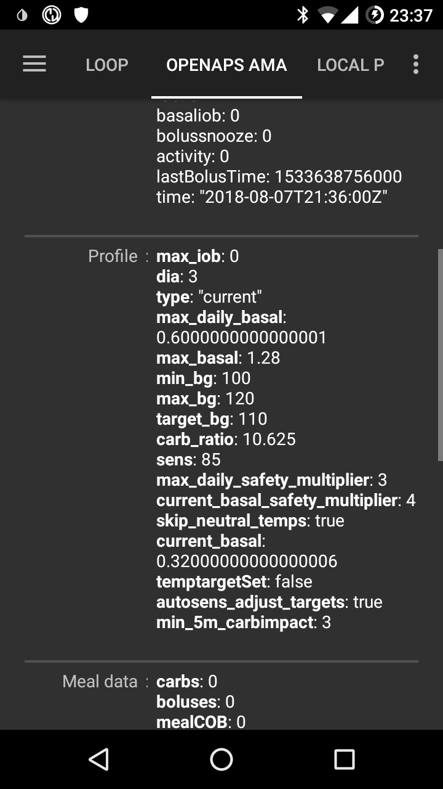

# FAQ pentru cei care folosesc bucla

How to add questions to the FAQ: Follow the these [instructions](../SupportingAaps/HowToEditTheDocs.md)

## General

### Can I just download the AAPS installation file?

Nu. There is no downloadable apk file for AAPS. You have to [build](../SettingUpAaps/BuildingAaps.md) it yourself. Iată de ce:

AAPS is used to control your pump and give insulin. Under current regulations in Europe, all systems classed as IIa or IIb are medical devices that require regulatory approval (a CE mark) which needs various studies and sign offs. Distribuirea unui dispozitiv nereglementat este ilegală. Reglementări similare există şi în alte părţi ale lumii.

This regulation is not restricted just to sales (in the meaning of getting money for something) but applies to any distribution (even giving away for free). Building a medical device for yourself is the only way to use the app within these regulations.

De aceea fișierele apk nu sunt disponibile.

(FAQ-how-to-begin)=

### How to begin?

First of all, you have to **get loopable hardware components**:

- A [supported insulin pump](../Getting-Started/CompatiblePumps.md), 
- an [Android smartphone](../Getting-Started/Phones.md) (Apple iOS is not supported by AAPS - you can check [iOS Loop](https://loopkit.github.io/loopdocs/)) and
- a [continuous glucose monitoring system](../Getting-Started/CompatiblesCgms.md). 

Secondly, you have to **setup your software components**: [AAPS](../SettingUpAaps/BuildingAaps.md), [CGM/FGM source](../Getting-Started/CompatiblesCgms.md) and a [reporting server](../SettingUpAaps/SettingUpTheReportingServer.md).

Thirdly, you have to learn and **understand the OpenAPS reference design to check your treatment factors**. The founding principle of closed looping is that your [basal rate and carb ratio](../SettingUpAaps/YourAapsProfile.md) are accurate. All recommendations assume that your basal needs are met and any peaks or troughs you're seeing are a result of other factors which therefore require some one-off adjustments (exercise, stress etc.). The adjustments the closed loop can make for safety have been limited (see maximum allowed temporary basal rate in [OpenAPS Reference Design](https://openaps.org/reference-design/)), which means that you don't want to waste the allowed dosing on correcting a wrong underlying basal. If for example you are frequently low temping on the approach of a meal then it is likely your basal needs adjusting. You can use [Autotune](https://openaps.readthedocs.io/en/latest/docs/Customize-Iterate/autotune.html#phase-c-running-autotune-for-suggested-adjustments-without-an-openaps-rig) to consider a large pool of data to suggest whether and how basals and/or ISF need to be adjusted, and also whether carb ratio needs to be changed. Or you can test and set your basal the [old-fashioned way](https://integrateddiabetes.com/basal-testing/).

### What practicalities of looping do I have?

#### Password protection

If you don't want your preferences to be easily changed then you can password protect the preferences menu by selecting in the preferences menu "password for settings" and type the password you choose. The next time you go into preferences menu it will ask for that password before going any further. If you later want to remove the password option then go into "password for settings" and delete the text.

#### Android Wear Smartwatches

If you plan to use the android wear app to bolus or change settings then you need to ensure notifications from AAPS are not blocked. Confirmation of action comes via notification.

(FAQ-disconnect-pump)=

#### Disconnect pump

If you take your pump off for showering, bathing, swimming, sports or other activities you must let AAPS know that no insulin is delivered to keep IOB correct.

The pump can be disconnected using the Loop Status icon on the [AAPS Home Screen](#AapsScreens-loop-status).

#### Recommendations not only based on one single CGM reading

For safety, recommendations made are based on not one CGM reading but the average delta. Therefore, if you miss some readings it may take a while after getting data back before AAPS kicks in looping again.

#### Further readings

There are several blogs with good tips to help you understand the practicalities of looping:

- [Fine-tuning Settings](https://seemycgm.com/2017/10/29/fine-tuning-settings/) See my CGM
- [Why DIA matters](https://seemycgm.com/2017/08/09/why-dia-matters/) See my CGM
- [Limiting meal spikes](https://diyps.org/2016/07/11/picture-this-how-to-do-eating-soon-mode/) #DIYPS
- [Hormones and autosens](https://seemycgm.com/2017/06/06/hormones-2/) See my CGM

### What emergency equipment is recommended to take with me?

You have to have the same emergency equipment with you like every other T1D with insulin pump therapy. When looping with AAPS it is strongly recommended to have the following additional equipment with or near to you:

- Battery pack and cables to charge your smartphone, watch and (if needed) BT reader or Link device
- Pump batteries
- Current [apk](../SettingUpAaps/BuildingAaps.md) and [preferences files](../Maintenance/ExportImportSettings.md) for AAPS and any other apps you use (e.g. xDrip+, BYO Dexcom) both locally and in the cloud (Dropbox, Google Drive).

### How can I safely and securely attach the CGM/FGM?

You can tape it. There are several pre-perforated 'overpatches' for common CGM systems available (search Google, eBay or Amazon). Some loopers use the cheaper standard kinesiology tape or rocktape.

You can fix it. You can also purchase upper arm bracelets that fix the CGM/FGM with a band (search Google, eBay or Amazon).

## APS algorithm

### Why does it show "dia:3" in the "OPENAPS AMA"-tab even though I have a different DIA in my profile?

In AMA, DIA actually doesn't mean the 'duration of insulin acting'. It is a parameter, which used to be connected to the DIA. Now, it means, 'in which time should the correction be finished'. It has nothing to do with the calculation of the IOB. In OpenAPS SMB, there is no need for this parameter any longer.

## Other settings

### Nightscout settings

#### AAPSClient says 'not allowed' and does not upload data. Ce pot face?

In AAPSClient check 'Connection settings'. Maybe you actually are not in an allowed WLAN or you have activated 'Only if charging' and your charging cable is not attached.

### CGM settings

#### Why does AAPS say 'BG source doesn't support advanced filtering'?

If you do use another CGM/FGM than Dexcom G5 or G6 in xDrip native mode, you'll get this alert in AAPS OpenAPS-tab. See [Smoothing blood glucose data](../CompatibleCgms/SmoothingBloodGlucoseData.md) for more details.

### Pump

#### Unde să montați pompa pe corp?

Există nenumărate posibilități de a plasa pompa. Nu contează dacă folosiți sau nu bucla.

#### Baterii

Folosirea buclei poate duce la reducerea timpului de utilizare a bateriilor, deoarece sistemul interacționează cu pompa mult mai des decât ar face-o un utilizator obișnuit. Se recomandă să schimbați bateriile la 25%, deoarece comunicația devine problematică sub această valoare. Puteți seta alarme de avertizare pentru bateria pompei folosind variabila PUMP_WARN_BATT_P în site-ul dumneavoastră Nightscout. Sfaturi pentru îmbunătățirea vieții bateriilor:

- reduceți perioada de timp cât ecranul pompei stă aprins (din setările pompei)
- reduceți perioada de timp cât iluminarea ecranului pompei este pornită (din setările pompei)
- selectați notificarea să fie prin intermediul unui sunet mai degrabă decât prin vibrație (în setările pompei)
- only press the buttons on the pump to reload, use AAPS to view all history, battery level and reservoir volume.
- AAPS app may often be closed to save energy or free RAM on some phones. When AAPS is reinitialized at each startup it establishes a Bluetooth connection to the pump, and re-reads the current basal rate and bolus history. Acest lucru consumă baterie. Pentru a vedea dacă se întâmplă astfel, mergeți la Preferințe > NSClient și activați 'Înregistrează pornirea aplicației pe NS'. Nightscout will receive an event at every restart of AAPS, which makes it easy to track the issue. To reduce this happening, whitelist AAPS app in the phone battery settings to stop the app power monitor closing it down.
    
    De exemplu, pentru a acorda toate permisiunile pe un telefon Samsung care rulează cu Android Pie:
    
    - Mergeți la Setări-> Îngrijire dispozitiv-> Baterie 
    - Scroll until you find AAPS and select it
    - Dezactivați "Pune aplicația în repaus"
    - DE ASEMENEA mergeți la Setări -> Aplicații -> (Simbolul format din trei cercuri în dreapta sus a ecranului) selectați "acces special" -> Optimizare utilizare baterie
    - Scroll to AAPS and make sure it is de-selected.

- curățați bornele bateriei cu tampon cu alcool, pentru a vă asigura că nu a rămas ceară/unsoare.

- pentru [pompele Dana R/RS](../CompatiblePumps/DanaRS-Insulin-Pump.md) procedura de pornire trage un curent mare prin baterie pentru a rupe în mod intenționat filmul de pasivizare (care previne pierderea de energie în timp ce este în stocare), dar nu funcționează întotdeauna pentru a-l rupe 100%. Fie scoateți și reintroduceți bateria de 2-3 ori până când se afișează 100% pe ecran, fie utilizați cheia bateriei pentru o scurtcircuitare rapidă înainte de a fi introdusă, prin aplicarea sa la ambele borne pentru o fracțiune de secundă.
- see also more tips for [particular types of battery](#Accu-Chek-Combo-Tips-for-Basic-usage-battery-type-and-causes-of-short-battery-life)

#### Schimbarea rezervoarelor și a canulelor

The change of cartridge cannot be done via AAPS but must be carried out as before directly via the pump.

- Long press on "Open Loop"/"Closed Loop" on the Home tab of AAPS and select 'Suspend Loop for 1h'
- Now nnect the pump and change the reservoir as per pump instructions.
- Also priming and filling tube and cannula can be done directly on the pump. In this case use [PRIME/FILL button](#screens-action-tab) in the actions tab just to record the change.
- Odată reconectat la pompă continuați bucla prin apăsare lungă pe 'Suspendat (X m)'.

The change of a cannula however does not use the "prime infusion set" function of the pump, but fills the infusion set and/or cannula using a bolus which does not appear in the bolus history. Aceasta înseamnă că nu întrerupe o rată bazală temporară care rulează în prezent. În pagina Acțiuni (Act), utilizați butonul de [AMORSARE/UMPLERE](#screens-action-tab) pentru a seta cantitatea de insulină necesară pentru a umple setul de infuzie și a începe amorsarea. Dacă cantitatea nu este suficientă, repetați umplerea. Puteți seta butoanele pentru cantitatea standard în Preferințe > Altele > Cantități standard de insulină umplere/amorsare. Vedeți instrucțiunile cuprinse în prezentarea aflată în cutia canulei pentru a vedea de câte unități este nevoie pentru a face amorsarea pompei, în funcție de lungimea acului și a tubului.

### Fundal

You can find the AAPS wallpaper for your phone on the [phones page](#Phones-phone-wallpaper).

### Utilizare zilnică

#### Igienă

##### Ce trebuie făcut când se face duș sau baie?

Puteți îndepărta pompa în timp ce faceți duș sau baie. For this short period of time you may not need it, but you should tell AAPS that you've disconnected so that the IOB calculations are correct. See [description above](#FAQ-disconnect-pump).

#### Serviciu

Depending on your job, you may choose to use different treatment factors on workdays. As a looper you should consider a [profile switch](../DailyLifeWithAaps/ProfileSwitch-ProfilePercentage.md) for your typical working day. For example, you may switch to a profile higher than 100% if you have a less demanding job (e.g. sitting at a desk), or less than 100% if you are active and on your feet all day. You could also consider a high or low temporary target or a [time shift of your profile](#ProfileSwitch-ProfilePercentage-time-shift-of-the-circadian-percentage-profile) when working much earlier or later than regular, of if you work different shifts. You can also create a second profile (e.g. 'home' and 'workday') and do a daily profile switch to the profile you actually need.

### Activități de agrement

(FAQ-sports)=

#### Sporturi

Trebuie să vă adaptați vechile obiceiuri sportive din vremurile dinaintea buclei. Dacă doar ați consuma mai mulți carbohidrați la fel ca înainte, sistemul de buclă închisă îi va recunoaște și îi va corecta în mod corespunzător.

Deci, ați avea mai mulți carbohidrați la bord, dar în același timp bucla ar contracara și va elibera insulina.

Când folosiți bucla ar trebui să încercați acești pași:

- Make a [profile switch](../DailyLifeWithAaps/ProfileSwitch-ProfilePercentage.md) < 100%.
- Set an [activity temp target](#TempTargets-activity-temp-target) above your standard target.
- If you are using SMB make sure ["Enable SMB with high temp targets"](#Open-APS-features-enable-smb-with-high-temp-targets) and ["Enable SMB always"](#Open-APS-features-enable-smb-always) are disabled.

Pre- and post-processing of these settings is important. Faceți schimbările la timp, înainte de sport si luați în considerare efectul de umplere cu glucoză a mușchilor.

Dacă faceți sport în mod regulat în aceeași perioadă a zilei (spre exemplu o oră de sport în sală) puteți lua în considerare utilizarea unei [automatizări](../DailyLifeWithAaps/Automations.md) pentru schimbarea de profil și o țintă temporară. Automatizarea bazată pe locație ar putea fi de asemenea o idee, dar face preprocesarea mai dificilă.

Procentul de schimbare a profilului, valoarea pentru ținta temporară a activității tale și momentul cel mai bun pentru modificări sunt setări individuale. Începeți pe partea sigură dacă sunteți în căutarea valorii corecte pentru dumneavoastră (începeți cu un procent mai mic și cu o țintă temporară mai mare).

#### Sex

You can remove the pump to be 'free', but you should tell AAPS so that the IOB calculations are correct. See [description above](#FAQ-disconnect-pump).

#### Consumul de alcool

Drinking alcohol is risky in closed loop mode as the algorithm cannot predict the alcohol influenced BG correctly. You have to check out your own method for treating this using the following functions in AAPS:

- Deactivating closed loop mode and treating the diabetes manually or
- setting high temp targets and deactivating UAM to avoid the loop increasing IOB due to an unattended meal or
- do a profile switch to noticeably less than 100% 

When drinking alcohol, you always have to have an eye on your CGM to manually avoid a hypoglycemia by eating carbs.

#### Sleeping

##### How can I loop during the night without mobile and WIFI radiation?

Many users turn the phone into airplane mode at night. If you want the loop to support you when you are sleeping, proceed as follows (this will only work with a local BG-source such as xDrip+ or ['Build your own Dexcom App'](#DexcomG6-if-using-g6-with-build-your-own-dexcom-app), it will NOT work if you get the BG-readings via Nightscout):

1. Activați modul avion în telefon.
2. Aşteptaţi până când modul avion este activ.
3. Activați Bluetooth.

You are not receiving calls now, nor are you connected to the internet. But the loop is still running.

Some people have discovered problems with local broadcast (AAPS not receiving BG values from xDrip+) when phone is in airplane mode. Go to Settings > Inter-app settings > Identify receiver and enter `info.nightscout.androidaps`.

#### Travelling

##### How to deal with time zone changes?

With Dana R and Dana R Korean you don't have to do anything. For other pumps see [time zone travelling](../DailyLifeWithAaps/TimezoneTraveling-DaylightSavingTime.md) page for more details.

### Medical topics

#### Hospitalization

If you want to share some information about AAPS and DIY looping with your clinicians, you can print out the [guide to AAPS for clinicians](../UsefulLinks/ClinicianGuideToAaps.md).

#### Medical appointment with your endocrinologist

##### Reporting

You can either show your Nightscout reports (https://YOUR-NS-SITE.com/report) or check [Nightscout Reporter](https://nightscout-reporter.zreptil.de/).

## Frequent questions on Discord and their answers...

### My problem is not listed here.

[Information to get help.](../GettingHelp/WhereCanIGetHelp.md)

### My problem is not listed here but I found the solution

[Information to get help.](../GettingHelp/WhereCanIGetHelp.md)

**Remind us to add your solution to this list!**

### AAPS stops everyday around the same time.

Stop Google Play Protect. Check for "cleaning" apps (ie CCleaner etc) and uninstall them. AAPS / 3 dots menu / About / follow the link "Keep app running in the background" to stop all battery optimizations.

### How to organize my backups ?

Export settings very regularly: after each pod change, after modifying your profile, when you have validated an objective, if you change your pump… Even if nothing changes, export once a month. Keep several old export files.

Copy on an internet drive (Dropbox, Google etc) : all the apks you used to install apps on your phone (AAPS, xDrip, BYODA, Patched LibreLink…) as well as the exported setting files from all your apps.

### I have problems, errors building the app.

Please

- check [Troubleshooting Android Studio](../GettingHelp/TroubleshootingAndroidStudio.md) for typical errors and
- the tipps for with a [step by step walktrough](https://docs.google.com/document/d/1oc7aG0qrIMvK57unMqPEOoLt-J8UT1mxTKdTAxm8-po).

### I'm stuck on an objective and need help.

Screen capture the question and answers. Post-it on the Discord AAPS channel. Don't forget to tell which options you choose (or not) and why. You'll get hints and help but you'll need to find the answers.

### How to reset the password in AAPS v2.8.x ?

Open the hamburger menu, start the Configuration wizard and enter new password when asked. You can quit the wizard after the password phase.

### How to reset the password in AAPS v3.x

You find the documentation [here](#Update3_0-reset-master-password).

### My link/pump/pod is unresponsive (RL/OL/EmaLink…)

With some phones, there are Bluetooth disconnects from the Links (RL/OL/EmaL...).

Some also have non responsive Links (AAPS says that they are connected but the Links can't reach or command the pump.)

The easiest way to get all these parts working together is : 1/ Delete Link from AAPS 2/ Power off Link 3/ AAPS 3 dot menu, quit AAPS 4/ Long press AAPS icon, Android menu, info on app AAPS, Force stop AAPS and then Delete cache memory (Do not delete main memory !) 4bis/ Rarely some phones may need a reboot here. You can try without reboot. 5/Power on Link 6/Start AAPS 7/Pod tab, 3 dot menu, search and connect Link

### Build error: file name too long

While trying to build I get an error stating the file name is too long. Possible solutions: Move your sources to a directory closer to the root directory of your drive (e.g. "c:\src\AndroidAPS-EROS").

From Android Studio: Make sure "Gradle" is done syncing and indexing after opening the project and pulling from GitHub. Execute a Build->Clean Project before doing a Rebuild Project. Execute File->Invalidate Caches and Restart Android Studio.

### Alert: Running dev version. Closed loop is disabled

AAPS is not running in "developer mode". AAPS shows the following message: "running dev version. Closed loop is disabled".

Make sure AAPS is running in "developer mode": Place a file named "engineering_mode" at the location "AAPS/extra". Any file will do as long as it is properly named. Make sure to restart AAPS for it to find the file and go into "developer mode".

Hint: Make a copy of an existing logfile and rename it to "engineering_mode" (note: no file extension!).

### Where can I find settings files?

Settings files will be stored on your phone's internal storage in the directory "/AAPS/preferences". WARNING: Make sure not to lose your password as without it you will not be able to import an encrypted settings file!

### How to configure battery savings?

Properly configuring Power Management is important to prevent your Phone's OS to suspend AAPS and related app's and services when your phone is not being used. As a result AAPS can not do its work and/or Bluetooth connections for sensor and Rileylink (RL) may be shut down causing "pump disconnected" alerts and communication errors. On the phone, go to settings->Apps and disable battery savings for: AAPS xDrip or BYODA/Dexcom app The Bluetooth system app (you may need to select for viewing system apps first) Alternatively, fully disable all battery savings on the phone. As a result your battery may drain faster but it is a good way to find out if battery savings is causing your problem. The way battery savings is implemented greatly depends on the phone's brand, model and/or OS version. Because of this it is almost impossible to give instructions to properly set battery savings for your setup. Experiment on what settings work best for you. For additional information, see also Don't kill my app

### Pump unreachable alerts several times a day or at night.

Your phone may be suspending AAPS services or even Bluetooth causing it to loose connection to RL (see battery savings) Consider configuring unreachable alerts to 120 minutes by going to the top right-hand side three-dot menu, selecting Preferences->Local Alerts->Pump unreachable threshold [min].

### Where can I delete treatments in AAPS v3 ?

3 dots menu, select treatments, then 3 dots menu again and you have different options available.

### Configuring and Using the AAPSClient remote app

AAPS can be monitored and controlled remotely via the AAPSClient app and optionally via the associated Wear app running on Android Wear watches. Note that the AAPSClient (remote) app is distinct from the NSClient configuration in AAPS, and the AAPSClient (remote) Wear app is distinct from the AAPS Wear app--for clarity the remote apps will be referred to as 'AAPSClient remote' and 'AAPS remote Wear' apps.

To enable AAPSClient remote functionality you must: 1) Install the AAPSClient remote app (the version should match the version of AAPS being used) 2) Run the AAPSClient remote app and proceed through the configuration wizard to grant required permissions and configure access to your Nightscout site. 3) At this point you may want to disable some of the Alarm options, and/or advanced settings which log the start of the AAPSClient remote app to your Nightscout site. Once this is done, AAPSClient remote will download Profile data from your Nightscout site, the 'Overview' tab will display CGM data and some AAPS data, but but may not display graph data, and will indicate that a profile isn't yet set. 4) To activate the profile:

- Enable remote profile synchronization in AAPS > NSClient > Options
- Activate the profile in NSClient remote > Profile After doing so, the profile will be set, and AAPSClient remote should display all data from AAPS. Hint: If the graph is still missing, try changing the graph settings to trigger an update. 5) To enable remote control by the AAPSClient, selectively enable the aspects of AAPS (Profile changes, Temp Targets, Carbs, etc.) that you would like to be able to control remotely via AAPS > NSClient > Options . Once these changes are made, you'll be able to remotely control AAPS via either Nightscout or AAPSClient remote.

If you'd like to monitor/control AAPS via the AAPSClient remote Wear App, you'll need both AAPSClient remote and the associated Wear app to be installed. To compile the AAPSClient remote Wear app, follow the standard instructions for installing/configuring the AAPS wear app, except when compiling it, choose the AAPSClient variant.

### I have a red triangle / AAPS won't enable closed loop / Loops stays in LGS / I have a yellow triangle

The red and yellow triangles are a security feature in AAPS v3.

Red triangle means that you have duplicate BGs and AAPS can't calculate precisely the deltas. You can't close the loop. You need to delete one BG of each duplicated value in order to clear the red triangle. Go to BYODA or xDRIP tab, long press one line you want to delete, check one of each lines that are doubled (or via 3 dots menu and Delete, depending on your AAPS version). You may need to reset the AAPS databases if there are too many double BGs. In this case, you'll also loose stats, IOB, COB, selected profile.

Possible origin of the problem: xDrip and/or NS backfilling BGs.

The yellow triangle means unstable delay between each BG reading. You don't receive BGs every 5 min regularly or missing BGs. It is often a Libre problem. It also happens when you change G6 transmitter. If the yellow triangle is related to the G6 tansmitter change, it will go away by itself after several hours (around 24h). In case of Libre, the yellow triangle will stay. The loop can be closed and works correctly.

### Can I move an active DASH Pod to other hardware?

This is possible. Note that as moving is "unsupported" and "untested" there is some risk involved. Best to try the procedure when your Pod is about to expire so when things go wrong not much is lost.

Critical is that pump "state" (which includes it's MAC address) in AAPS and DASH match on reconnecting

### Procedure I follow in this:

1) Suspend the DASH pump. This makes sure there are no running or queued commands active when DASH loses connection 2) Put the phone into airplane mode to disable BT (as well as WiFi and Mobile data). This way it is guaranteed AAPS and DASH can not communicate. 3) Export settings (which includes the DASH state) 4) Copy the settings file just exported from the phone (as it is in airplane mode and we do not want to change that, easiest way is using USB cable) 5) Copy the settings file to the alternate phone. 6) Import settings on the alternate phones AAPS. 7) Check the DASH tab to verify it is seeing the Pod. 8) Un-suspend the Pod. 9) Check the DASH tab and confirm it is communicating with the Pod (use the refresh button)

Congratulations: you did it!

*Wait!* You still have the main phone thinking it can reconnect to the same DASH:

1) On the main phone choose "deactivate". This is safe because the phone has no way of communicating with DASH to actually deactivated the Pod (it is still in airplane mode) 2) Deactivation will result in a communications error - this is expected. 3) Just hit "retry" a couple of times until AAPS offers the option to "Discard" the Pod.

When Discarded, verify AAPS is reporting "No Active Pod". You can now safely disable airplane mode again.

### How do I import settings from earlier versions of AAPS into AAPS v3 ?

You can only import settings (in AAPS v3) that were exported using AAPS v2.8x or v3.x. If you were using a version of AAPS older than v2.8x or you need to use setting exports older than v2.8x, then you need to install AAPS v2.8 first. Import the older settings of v2.x in v2.8. After checking that all is OK, you can export settings from v2.8. Install AAPS v3 and import v2.8 settings in v3.

If you use the same key to build v2.8 and v3, you won't even have to import settings. You can install v3 over v2.8.

There were some new objectives added. You'll need to validate them.