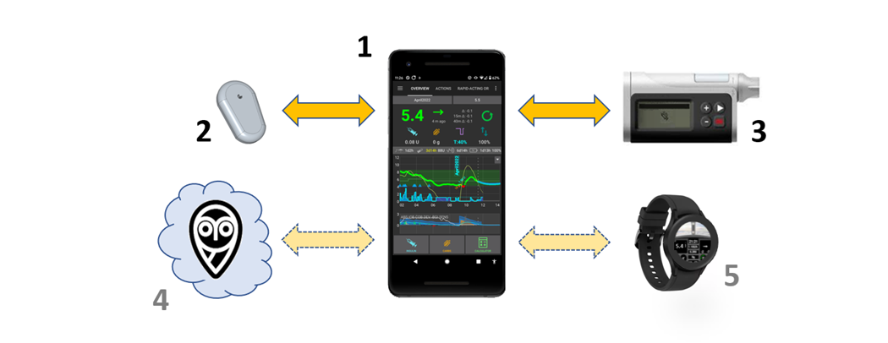

# Bine ați venit la documentația AAPS



```{admonition} Latest Release
:class: note

 10 April 2026 : Version 3.4.2.2 is out. Check the [Release Notes](#latestrelease) to see what's new and follow the instructions in the [update manual](#UpdateToNewVersion) to update to a the version.

```

Android APS (**AAPS**) este un program cu sursă deschisă pentru persoanele care trăiesc cu diabet de tip insulino-dependent. Este un sistem de tip pancreas artificial (APS) care rulează pe telefoanele inteligente cu Android. **AAPS** folosește algoritmul software OpenAPS și are ca scop preluarea sarcinilor unui pancreas adevărat; menținerea nivelului de zahăr din sânge în limite sănătoase prin utilizarea de doze automate de insulină. Pentru a utiliza <0>AAPS</0> ai nevoie de <0>trei</0> dispozitive compatibile: <0>(1)</0> un telefon Android, <0>(2)</0> un senzor de monitorizare continuă a glicemiei (CGM), și<0>(3)</0>  de o pompă de insulină aprobată FDA/CE.</0></0> Opțional veți avea nevoie de servicii în cloud **(4)** pentru a controla de la distanță **AAPS**, a partaja datele și de a stoca într-un server de raportare, și de asemenea **(5)** de un ceas inteligent (smartwatch).

Această documentație explică modul de configurare și utilizare al **AAPS**. Puteți naviga prin documentația **AAPS** fie prin meniul din stânga (și funcția la îndemână "**Căutați în documentație**"), sau prin folosirea [indexului](#index-aaps-documentation-index) din partea de jos a acestei pagini.

## Prezentare generală a documentației AAPS

Secțiunea **2) Noțiuni de bază**, [Introducere](Getting-Started/Introduction.md) explică conceptul general a ceea ce un sistem de tip pancreas artificial (APS) ar trebui să facă. Acesta subliniază informațiile generale ale sistemului de tip buclă închisă, de ce **AAPS** a fost dezvoltat, compară **AAPS** cu alte sisteme, și adresează problematica de siguranță. Vă dă sugestii despre cum să vorbiți cu medicul curant despre **AAPS**, explică de ce trebuie să construiți aplicația **AAPS** singur/ă în loc să o descărcați pur și simplu, și oferă o privire de ansamblu despre conectivitatea tipică a sistemului **AAPS**. De asemenea abordează tematica accesibilității și discută despre cine ar putea să beneficieze de pe urma **AAPS**.

[Pregătirea pentru AAPS](./Getting-Started/PreparingForAaps.md) oferă mai multe detalii despre elementele ce țin de siguranță, și despre telefoanele, senzorii de monitorizare continuă a glicemiei (CGM) și pompele de insulină compatibile cu **AAPS**. Oferă o privire de ansamblu despre procesul prin care veți trece, și oferă o cronologie aproximativă pentru obținerea unei funcționalități complete **AAPS**. Această secțiune vă pregătește din punct de vedere tehnic să vă puneți la punct configurarea **AAPS** cât mai repede și eficient posibil. Subsecțiunea [Configurarea CGM](./Getting-Started/CompatiblesCgms.md) explică configurarea optimă de CGM și care sunt cele mai bune opțiuni de uniformizare ale valorilor de glicemie.

Acum că aveți o înțelegere solidă a procesului, puteți începe să faceți sistemul de buclă închisă **AAPS**.

Secțiunea **3) Configurarea AAPS** conține instrucțiuni pas cu pas pentru a face acest lucru. Acoperă alegerea și [configurarea serverului dumneavoastră de raportare](./SettingUpAaps/SettingUpTheReportingServer.md) (Nightscout sau Tidepool) astfel încât să puteți analiza și partaja datele dumneavoastră, pregătirea pentru construirea aplicației AAPS, construirea efectivă a aplicației AAPS și transferarea aplicației AAPS pe telefonul dumneavoastră. It also covers setting up the **AAPS** app using the setup Wizard, linking it with your CGM app, and either a real or virtual insulin pump, as well as linking **AAPS** to your reporting server. You are then slowly introduced to the full usage of what **AAPS** has to offer via a safe and carefully calibrated step-by-step process designed to make sure that you/your child are thoroughly familiar and comfortable navigating all the different levels and menu configurations before graduating on the next phase, commonly referred to as the next "Objective", until you are have enough experience to begin using the more advanced options available within the app. These Objectives are specially designed in such a way that will gradually unlock more possibilities of **AAPS** and switch from Open Loop to Closed Loop.

Section **4) Daily life with AAPS** covers key **AAPS** features, to help you use (and customise)  **AAPS**. This including understanding the screens, carbs-on-board, sensitivity, profile switching, temp targets, extended carbs (or eCarbs), automations, and DynamicISF. It also covers frequent topics like how to manage different types of meals, how to deal with cannula and sensor changes, smartphone updates, daylight saving changes, and [travelling with AAPS](DailyLifeWithAaps/TimezoneTraveling-DaylightSavingTime.md) and sports. Common questions and answers are located within the troubleshooting section.

Section **5) [Remote AAPS features](./RemoteFeatures/RemoteControl.md)** highlights a real strength of **AAPS**. There are a wide range of possibilities for remotely sending commands to, or simply following the data from **AAPS**. This is equally useful for carers who want to use **AAPS** for minors, and for adults with diabetes who either want to monitor their sugars (and other metrics) more conveniently than just on their phone (on a watch, in the car _etc._), or wish to have significant others to also monitor the data. This section also provides guidance for using Android Auto so you can view glucose levels in the car.

Section **6) Wear OS smartwatches** gives information and procedures to use an Android **Wear OS** smartwatch with the dedicated **AAPS** watchfaces or custom watchfaces, either as a remote control of your phone or just a display indicator.


Section **7) Maintenance of AAPS** covers how to export and backup your settings (which is very important in case you lose/break your phone), gives the latest version notes and details how to update **AAPS**. You can expect that there will be one new version and 2-3 required updates per year. You are required to do these updates as with all software, as any minor bugs are ironed out, and improvements to **AAPS** are made. There is a dedicated "updating" troubleshooting section with the common queries.

Section **8) [Getting Help](GettingHelp/WhereCanIGetHelp.md)** should help direct you to the best places to go to find general help with **AAPS**. This is very important so that you can get in touch with others as quickly as possible, clarify questions and solve the usual pitfalls. A lot of people are already using **AAPS** successfully, but everyone has a question at some point that they couldn't solve on their own. Due to the large number of users, the response times to questions are usually very quick, typically only a few hours. Don’t worry about asking for help, there is no such thing as a dumb question! We encourage users of any/all levels of experience to ask as many questions as they feel is necessary to help get them up and running safely. This section includes general troubleshooting for **AAPS** and **AAPSClient** (a companion following app) as well as explaining how to send your **AAPS** data (logfiles) to the developers for investigation, if you think a technical issue with **AAPS** needs looking at.

Section **9)** covers **Advanced AAPS options** such as how to progress from using **AAPS** for hybrid-closed looping (bolusing for meals _etc._) to full closed looping (no bolusing), and details development and engineering modes. Most users get on just fine with the main or "Master" **AAPS** version without looking into these options, this section is for users who already have good control and are looking to further improve their setup.

In section **10) [How to support AAPS](SupportingAaps/HowToEditTheDocs.md)** we provide  information so that you can support this project. You can donate money, equipment or expertise. You can suggest/make changes to the documentation yourself, help with [translation of the documentation](SupportingAaps/Translations) and provide your data through the Open Humans project.

Section **11) Resources**, contains archived or additional documentation, including a subsection for [clinicians](UsefulLinks/ClinicianGuideToAaps.md) who have expressed interest in open source artificial pancreas technology such as **AAPS**, or for patients who want to share such information with their clinicians, this topic is also addressed in the introduction. More diabetes and looping references and resources are also contained in this section. It includes the  [Glossary](./UsefulLinks/Glossary.md), a list of the acronyms (or short-term names) used throughout **AAPS**. This is where to go to find out what the terms ISF or TT, stand for, for example.


 ### Interested in getting started with **AAPS**? Read more about **AAPS** in the [Introduction](Getting-Started/Introduction.md).

```{admonition} SAFETY NOTICE
:class: danger
The safety of **AAPS** relies on the safety features of your hardware (phone, pump, CGM). Only use a fully functioning FDA/CE approved insulin pump and CGM. Do not use broken, modified or self-built insulin pumps or CGM receivers. Only use original consumable supplies (inserters, cannulas and insulin reservoirs) approved by the manufacturer for use with your pump and CGM. Using untested or modified supplies can cause inaccuracy and insulin dosing errors, resulting in significant risk to the user. 

Do not use **AAPS** if you take SGLT-2 inhibitors (gliflozins), as they lower blood sugar levels. You increase the risk diabetic ketoacidosis (DKA) due to reduced insulin delivery and hypoglycemia due to lowered blood sugar levels. 
```

```{admonition} Disclaimer
:class: note

- All information and code described here is for informational and educational purposes only. Use [Nightscout](https://nightscout.github.io/) and **AAPS** at your own risk, and do not use the information or code to make medical decisions. Nightscout currently makes no attempt at HIPAA privacy compliance. 
- Use of code from github.com is without warranty or formal support of any kind. Please review this repository's LICENSE for details.
- All product and company names, trademarks, servicemarks, registered trademarks, and registered servicemarks are the property of their respective holders. Their use is for information purposes and does not imply any affiliation with or endorsement by them.

**AAPS** has no association with, and is not endorsed by: [SOOIL](http://www.sooil.com/eng/), [Dexcom](https://www.dexcom.com/), [Accu-Chek, Roche Diabetes Care](https://www.accu-chek.com/), [Insulet](https://www.insulet.com/) or [Medtronic](https://www.medtronic.com/).

```

(index-aaps-documentation-index)=

## Indexul documentației AAPS

```{toctree}
:caption: 1) Schimbă limba

Schimbă limba <./NavigateDoc/ChangeLanguage.md>
Modifică versiunea <./NavigateDoc/ChangeVersion.md>
```
```{toctree}
:caption: 2) Introducere în AAPS <./Getting-Started/Introduction.md>
Pregătire pentru AAPS <. Getting-Started/PreparingForAaps.md>
Privire de ansamblu asupra componentelor <./Getting-Started/ComponentOverview.md>
- Pompe compatibile <. Getting-Started/CompatiblePumps.md>
- Senzori de monitorizare continuă a glicemiei compatibili <./Getting-Started/CompatiblesCgms.md>
- Telefoane compatibile  <. Getting-Started/Phones.md>
- Ceasuri compatibile  <./Getting-Started/Watches.md>
```

```{toctree}
:caption: 3) Setting up AAPS

Setting up the reporting server <./SettingUpAaps/SettingUpTheReportingServer.md>
- Nightscout <./SettingUpAaps/Nightscout.md>
- Tidepool <./SettingUpAaps/Tidepool.md>
Building AAPS <./SettingUpAaps/BuildingAaps.md>
- Browser Build <./SettingUpAaps/BrowserBuild.md>
- Android Studio Build <./SettingUpAaps/ComputerBuild.md>
- CLI Build <./SettingUpAaps/CLIBuild.md>
Transferring and Installing AAPS <./SettingUpAaps/TransferringAndInstallingAaps.md>
Setup Wizard <./SettingUpAaps/SetupWizard.md>
Your AAPS Profile <./SettingUpAaps/YourAapsProfile.md>
Change AAPS configuration <./SettingUpAaps/ChangeAapsConfiguration.md>
- Config Builder <./SettingUpAaps/ConfigBuilder.md>
- Preferences <./SettingUpAaps/Preferences.md>
Completing the objectives <./SettingUpAaps/CompletingTheObjectives.md>
```

```{toctree}
:caption: 4) Viața zilnică cu AAPS

Ecranele AAPS <./DailyLifeWithAaps/AapsScreens.md>
Funcționalități cheie AAPS <./DailyLifeWithAaps/KeyAapsFeatures.md>
Calcularea COB <./DailyLifeWithAaps/CobCalculation.md>
Detecția sensibilității <./DailyLifeWithAaps/SensitivityDetectionAndCob.md>
Schimbarea profilului & Profile Percentage <./DailyLifeWithAaps/ProfileSwitch-ProfilePercentage.md>
Ținte-temporare <./DailyLifeWithAaps/TempTargets.md>
Carbohidrați extinși <./DailyLifeWithAaps/ExtendedCarbs.md>
Automatizări <./DailyLifeWithAaps/Automations.md>
ISF Dinamic <./DailyLifeWithAaps/DynamicISF.md>
AAPS pentru copii <./DailyLifeWithAaps/AapsForChildren.md>
Pompe și canule <./DailyLifeWithAaps/PumpsAndCannulas.md>
Călătorit pe alte meridiane & ora de vară <./DailyLifeWithAaps/TimezoneTraveling-DaylightSavingTime.md>

```

```{toctree}
:caption: 5) Funcționalități de la distanță ale AAPS

Monitorizarea de la distanță <./RemoteFeatures/Telecomandă. d>
Control de la distanță <./RemoteFeatures/RemoteControl.md>
Comenzi SMS <. RemoteFeatures/SMSCommands.md>
Doar urmărire <./RemoteFeatures/FollowingOnly.md>
Android Auto <./RemoteFeatures/AndroidAuto.md>

```
```{toctree}
:caption: 6) Ceasuri inteligente Wear OS

AAPS pentru Wear OS <./WearOS/BuildingAapsWearOS.md>
Utilizează ceasul inteligent <. WearOS/WearOsSmartwatch.md>
Control de la distanță <./RemoteFeatures/RemoteControlWearOS. d>
Referințe pentru fețele de ceas personalizate <./ExchangeSiteCustomWatchfaces/CustomWatchfaceReference.md>
Site de schimb pentru fețele personalizate <./ExchangeSiteCustomWatchfaces/index.md>

```

```{toctree}
:caption: 7) Maintenance of AAPS

Export/Import Settings <./Maintenance/ExportImportSettings.md>
Reviewing your data <./Maintenance/Reviewing.md>
AAPS Release Notes <./Maintenance/ReleaseNotes.md>
Documentation updates <./Maintenance/DocumentationUpdate.md>
Updating to a new version of AAPS <./Maintenance/UpdateToNewVersion.md>
- Browser Update <./Maintenance/UpdateBrowserBuild.md>
- Android Studio Update <./Maintenance/UpdateComputerBuild.md>

```

```{toctree}
:caption: 8) Getting Help

Where can I get help with AAPS <./GettingHelp/WhereCanIGetHelp.md>
General troubleshooting <./GettingHelp/GeneralTroubleshooting.md>
- Bluetooth troubleshooting <./GettingHelp/BluetoothTroubleshooting.md>
Profile Tuning Guide <./GettingHelp/ProfileTuning.md>
Troubleshooting Android Studio <./GettingHelp/TroubleshootingAndroidStudio.md>
Accessing logfiles <./GettingHelp/AccessingLogFiles.md>
```

```{toctree}
:caption: 9) Facilități avansate AAPS

Buclă complet închisă <./AdvancedOptions/FullClosedLoop.md>
Ramura dev <./AdvancedOptions/DevBranch.md>
Autotune <./AdvancedOptions/Autotune.md>

```
```{toctree}
:caption: 10) Cum să sprijiniți AAPS

Cum să ajutați <./SupportingAaps/HowCanIHelp. d>
Editând documentația <./SupportingAaps/HowToEditTheDocs.md>
Traducând aplicația și documentația <. SuportAaps/Translations.md>
Starea traducerilor <./SupportingAaps/StateOfTranslations.md>
Open Humans Uploader <./SupportingAaps/OpenHumans.md>

```
```{toctree}
:caption: 11) Resurse

Glosar <./UsefulLinks/Glossary.md>
Secțiunea de întrebări frecvente <. UsefulLinks/FAQ.md>
Resurse generale pentru diabet și sisteme cu buclă închisă <./UsefulLinks/BackgroundReading. d>
Contul Google Dedicat pentru AAPS (opțional)<./UsefulLinks/DedicatedGoogleAccountForAaps.md>
Pentru clinicieni (învechit) <./UsefulLinks/ClinicianGuideToAaps.md>
```
