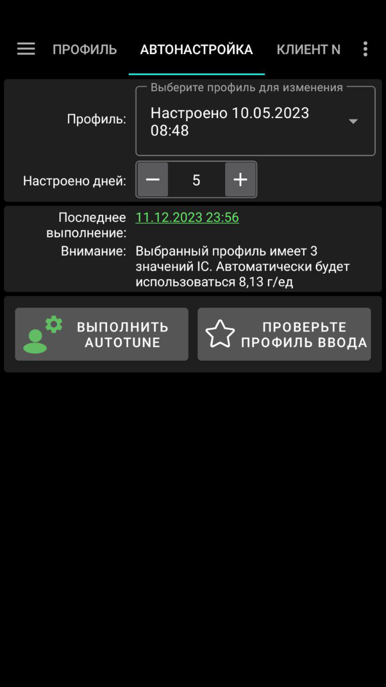
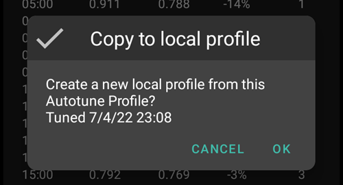

# Как использовать модуль Autotune (только для ветки разработчиков (dev))

Documentation about Autotune algorithm can be found in [OpenAPS documentation](https://openaps.readthedocs.io/en/latest/docs/Customize-Iterate/autotune.html).

Autotune plugin is an implementation of OpenAPS autotune algorithm within AAPS.

**В настоящее время модуль Autotune доступен только в [ветке dev](../AdvancedOptions/DevBranch.md) и в режиме разработчика.**

## Интерфейс пользователя Autotune

- В выпадающем меню профилей можно выбрать профиль, который хотите настроить (по умолчанию выбран ваш текущий активный профиль)
  - Примечание: каждый раз при выборе нового профиля, предыдущие данные будут удалены и параметр дней настройки Tune будет установлен в значение по умолчанию
- Затем необходимо выбрать количество дней, используемых при расчете для настройки профиля. Минимальное значение составляет 1 день и максимальное 30 дней. Это число не должно быть слишком маленьким, чтобы получить правильные итеративные и сглаженные результаты (более 7 дней для каждого расчета)
  - Примечание: каждый раз при изменении параметра дней настройки предыдущие результаты будут удалены
- Последнее выполнение - это ссылка, восстанавливающая предыдущий корректный расчёт. Если вы не запускали Autotune в текущий день, или если предыдущие результаты были удалены с модификацией, то можно восстановить параметры и результаты последнего успешного запуска.
- Предупреждение показывает некоторую информацию о выбранном профиле (если у вас есть несколько значений IC или несколько значений ISF)
  - Примечание: Расчет Autotune работает только с одним углеводным коэффициентом и одним значением ISF. There is currently no existing Autotune algorithm to tune a circadian IC or circadian ISF. Если профиль имеет несколько значений, вы увидите предупреждение о среднем значении, принятом для настройки профиля.
- Проверьте вкладку профиля и убедитесь, что все величины установлены корректно (единицы, DIA, IC, ISF, базал и цели)
  - Примечание: Autotune подстроит только углеводный коэффициент IC (единичное значение), ISF (единичное значение) и базальный профиль (с вариацией в пределах суток). Единицы, продолжительность действия инсулина и цель останутся неизменными в итоговом профиле.

- "Запустить Autotune" запустит расчет Autotune с выбранным профилем и количеством дней, выбранных для подстройки
  - Примечание: Расчет Autotune может занять длительное время. После запуска autotune можно переключиться на другое окно (главый экран и. п., ...) и вернуться позже в Autotune, чтобы увидеть результаты

- Затем во время запуска вы увидите промежуточные результаты

  - Примечание: Во время работы Autotune настройки заблокированы, поэтому изменить выбранный входной профиль или количество суток, участвующих в анализе, уже нельзя. Если требуется запустить другой анализ с другими параметрами, дождитесь окончания текущего расчета.

  

- По завершении вычисления Autotune вы увидите результат - настроенный профиль (Tuned profile) и четыре кнопки.

- Важно всегда сравнивать входной профиль (столбец "Профиль"), выходной профиль (столбец "Настроено") и процент изменений каждого значения (столбец "%").

- Для базальной скорости имеется "количество недостающих дней". Недостающие дни появляются когда Autotune не хватает данных в категории «Basal» для настройки базовой скорости за этот период (например, после каждой еды, когда идет поглощение углеводов). Это число должно быть как можно более низким, особенно если базал важен (например, в ночь или в конце второй половине дня)

- Кнопка "Сравнить профили" открывает окно сравнения профилей. Профиль на входе синий, а на выходе ("Настроенный") - красный.

  - Примечание: в примере ниже профиль на входе имеет циклические суточные отклонения для IC и ISF, но профиль на выходе имеет одно значение. If it's important for you to get a circadian output profile see [Circadian IC or ISF profile](#autotune-circadian-ic-or-isf-profile) below.

  

- Если вы доверяете результатам (низкий процент изменений между входным профилем и выходным профилем), нажмите на кнопку "Активировать профиль" и затем на OK для подтверждения.

  - Активация профиля Tuned автоматически создаст новый профиль "Tuned" в модуле Локальный профиль.
  - Если у вас уже есть профиль с названием "Tuned" (подстроенный) в локальном модуле профиля, то он будет обновлен на рассчитанный профиль Autotune до активации

  

- Если вы считаете, что профиль Tuned должен быть скорректирован (например, если некоторые вариации слишком важны), вы можете нажать на кнопку "Копировать в локальный профиль"

  - Новый профиль с префиксом "Tuned" и датой и временем запуска будет создан в локальном модуле профиля

- Затем вы можете выбрать локальный профиль для редактирования подстроенного профиля Tuned (он будет выбран по умолчанию при открытии локального модуля профиля)

  - значения в локальном профиле, будут округлены в соответствии с возможностями вашей помпы

  

- Если вы захотите заменить свой профиль на результат Autotune, нажмите на кнопку "Обновить профиль ввода" и нажмите OK во всплывшем окне

  - Примечание: если нажать на "Активировать профиль" после "Обновить входной профиль", то вы активируете свой обновленный профиль, а не "Tuned" по умолчанию.

  

- Если вы обновили свой профиль ввода, то кнопка «Обновить профиль ввода» заменяется кнопкой «Вернуть профиль ввода» (см. снимок экрана ниже). Таким образом, можно сразу увидеть, содержит ли профиль, вводимый как локальный, результаты последнего запуска. Также есть возможность восстановить профиль ввода без результатов autotune с помощью этой кнопки

  

## Настройки Autotune

(autotune-plugin-settings)=

### Настройки модуля Autotune

- Automation Switch Profile (default Off): see [Run Autotune with an automation rule](#autotune-run-autotune-with-an-automation-rule) below. Если изменить эту настройку на Включить, профиль ввода будет автоматически обновлен профилем Tuned и активирован.
  - **Будьте внимательны, в течение нескольких следующих дней следите, чтобы после обновления и активации настроенного профиля система заработала лучше по сравнен с профилем без изменений**

- Классифицировать UAM как базал (по умолчанию Вкл.): Этот параметр предназначен для пользователей, использующих AAPS без ввода углеводов (Полный UAM). Это помешает (когда Выключено) классифицировать UAM как базал.
  - Примечание: если в течение одного дня обнаружен по крайней мере один час абсорбции углеводов, тогда все данные, классифицированные как UAM, будут классифицированы как basal, вне зависимости от того, включен параметр или выключен
- Количество дней данных (по умолчанию 5): Для этого параметра можно задать значение по умолчанию. Каждый раз, когда вы выбираете новый профиль в модуле Autotune, параметр "дней для анализа" будет заменен на это значение по умолчанию
- Apply average result in circadian IC/ISF (default Off): see [Circadian IC or ISF profile](#autotune-circadian-ic-or-isf-profile) below.

### Other settings

- Для ограничения вариативности, Autotune применяет Максимальный коэффициент Autosens и Минимальный коэффициент Autosens. Эти параметры можно увидеть и настроить в Конфигураторе > Модуль определения чувствительности > Настройки > Расширенные настройки

  

## Дополнительные возможности

(autotune--циркадный-профиль-ic-или-isf)=

### Циркадный профиль IC или ISF

- Если в профиле присутствуют существенные вариации IC и/или ISF, и вы полностью доверяете своим циркадным (суточным) биоритмам, то можно активировать параметр "Применять средний результат в циркадных IC/ISF"

  - Обратите внимание, что вычисление Autotune всегда будет выполняться с одним значением, а циркадные вариации не будут подстроены при помощи Autotune. Эта настройка применяет среднее отклонение, рассчитанное только для IC и/или ISF на ваши циркадные величины

- На снимке экрана ниже настроенный профиль с отключенной опцией "применять средний вариант значения" слева и с включенной - справа

  

### Настройка определенных дней недели

- Если нажать на галочку с глазом справа от параметра "Дней для анализа", вы увидите дни недели для отбора. Можно указать, какой день недели войдет в расчет Autotune (на снимке экрана пример для "рабочих дней" с неотмеченными для расчета autotune субботой и воскресеньем)
  - Если количество дней, включенных в расчет Autotune меньше, чем количество дней для настройки то вы увидите, сколько дней будет включено справа от селектора настраиваемых дней (10 дней в примере ниже)
  - Этот параметр дает хорошие результаты только в том случае, если количество оставшихся дней не слишком мало (например, если вы настраиваете конкретный профиль на выходные дни только с выбранным воскресеньем и субботой, следует выбрать не менее 21 или 28 дней, чтобы было 6 или 8 дней для расчета Autotune)

- Во время вычисления Autotune вы можете увидеть прогресс вычислений ("Частичный результат дня 3/10 для расчета" на примере внизу)

  

(autotune-run-autotune-with-an-automation-rule)=

## Запустить Autotune с правилом автоматизации

Первый шаг заключается в определении правильной отправной точки (триггера) для правила автоматизации с автонастройкой:

Примечание: подробнее о создании правил для автоматизации см [здесь](../DailyLifeWithAaps/Automations.md).

- Следует выбрать время повторения запускать Autotune только один раз в сутки, ежедневно (после каждого нового выполнения Autotune смещать график на день вперед и делать небольшие быстрые модификации профиля)

  

- Вначале лучше запускать Autotune днем, чтобы иметь возможность проверить результаты. Если вы хотите запустить Autotune ночью, в триггере следует выбрать 4 часа ночи или позже, чтобы включить текущий день в следующий запуск Autotune.

  

- Затем можно выбрать действие "Запустить Autotune" из списка

  

- Затем выберите Действие Autotune чтобы настроить параметры запуска. Параметры по умолчанию - "Активный профиль", значение дней в настройках модуля Autotune по умолчанию - выбраны все дни.

  

- Через несколько дней, если вы полностью доверяете результатам Autotune и процент изменений невысок, можно изменить [настройки Autotune ](#autotune-plugin-settings) "Автоматический переключатель профиля", чтобы включить автоматическое обновление и активацию настроенного после вычислений профиля.

Примечание: если вы хотите автоматически настраивать профили на определенные дни недели (например, профиль для "выходных" и другой для "рабочих дней"), создайте по одному правилу для каждого профиля, выберите те же дни в триггере и в действиях Autotune. Количество дней для настройки должно быть достаточно высоким, не менее 6 или 8 дней, и не забудьте выбрать время после 04: 00 в триггере...

- Смотрите ниже пример правила для настройки "Моего профиля" в "рабочие дни" на основе 14 отобранных дней (то есть в вычислениях учтены только 10 дней).

## Советы и подсказки

Автототал работает с информацией из вашей базы данных, так что если вы только что установили AAPS на новый телефон, вам придется подождать несколько дней, прежде чем запускать Autotune чтобы получить адекватные результаты.

Autotune - всего лишь помощник, важно регулярно проверять, согласны ли вы с расчетным профилем. В случае сомнений, измените параметров Autotune (например, количество дней) или скопируйте результаты в локальный профиль и подкорректируйте перед использованием.

Всегда используйте Autotune несколько дней вручную для проверки результатов перед их применением. И только тогда, когда вы полностью доверяете результатам Autotune и когда между предыдущим и новым профилем и вариации становятся незначительными, можно запускать Автоматизацию (никогда не раньше)

- Autotune может хорошо работать для одних пользователей, и плохо для других, поэтому **Если вы не доверяете результату Autotune, не применяйте его**

Важно также проанализировать результаты Autotune для понимания (или попытки понять), почему Autotune предлагает такие изменения

- вы можете получить полное увеличение или уменьшение силы профиля (например, увеличение общего базала, связанное со снижением значений ISF и IC). it could be associated to several following days with autosens correction above 100% (more aggressivity required) or below 100% (you are more sensitive)
- Иногда Autotune предлагает другой баланс между базалом и IC/ISF (например, более низкие базалы и более агрессивные IC/ISF)

Мы рекомендуем не применять Autotune в следующих случаях:

- Вы не всгда вводите все углеводы
  - Если вы не вносите записи об углеводах на коррекцию гипогликемии, Autotune увидит непредвиденное увеличение ГК и за 4 часа до этого увеличит скорость базала. Возможно, на самом деле, для избежания гипогликемии, потребуется как раз обратное, особенно, если это происходит посреди ночи. Поэтому важно вводить все углеводы, особенно при коррекции гипо.
- В течение дня у вас обнаружено много периодов с непредвиденным приемом пищи UAM.
  - Вы ввели все съеденные углеводы и правильно оценили их количество?
  - Все периоды непредвиденных приемов пищи (за исключением случаев, когда вы не вводите углеводы в течение дня и отключена настройка классифицировать UAM как базалы), все периоды UAM будут классифицированы как базалы, а это может значительно увеличить базал (намного больше, чем необходимо)

- У вас медленное усвоение углеводов: если бóльшая часть абсорбции углеводов рассчитывается с помощью параметра min_5m_carbimpact (эти периоды можно увидеть как маленькую оранжевую точку в верхней части кривой COB), подсчет активных углеводов COB может быть неправильным и привести к неправильным результатам.
  - При занятиях спортом, чувствительность, как правило, повышается, и уровень сахара в крови повышается не сильно, поэтому во время или после тренировки обычно наблюдаются периоды медленного усвоения углеводов. Но если у вас слишком часто происходит неожиданное медленное усвоение углеводов, то может потребоваться корректировка профиля (более высокое значение IC) или значение min_5m_carbimpact слишком высокое.
- У вас были "очень плохие дни", например, вы на несколько часов застряли в состоянии гипергликемии и пришлось вводить огромное количество инсулина на снижение ГК до нормы, или после замены сенсора долго шли неверные значения ГК. Если в последние недели у вас был только один или 2 "плохих дня", вы можете вручную отключить эти дни в автоматическом расчете, и еще раз ** внимательно проверьте, можете ли вы доверять результатам**
- Если очень важен процент изменений
  - Можно увеличить количество дней, чтобы получить более плавные результаты