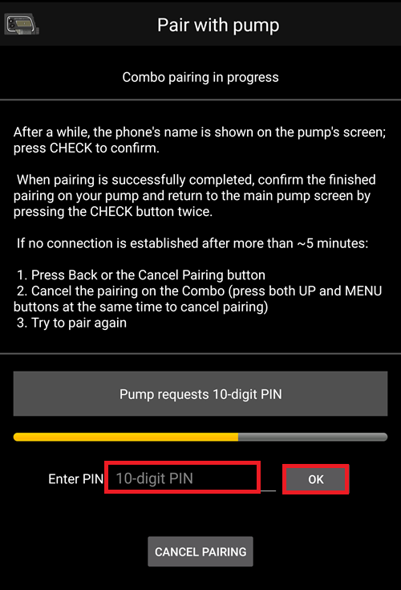

- - -
orphan: true
- - -

# Помпа Accu Chek Combo

**Настоящее ПО является частью самодеятельной разработки, а не готовым программным продуктом. От ВАС потребуется прочитать, изучить и понять систему и то, как ей пользоваться. Она не контролирует диабет за вас, но позволит улучшить компенсацию и качество жизни, если вы готовы уделить ей достаточно времени. Не бросайтесь в систему сломя голову, дайте себе время на изучение. Только вы несете ответственность за то, что делаете.**

## Требования к аппаратному и программному обеспечению

* Помпа Roche Accu-Chek Combo (любая версия прошивки, работают все).
* Устройство Smartpix или Realtyme с приложением "360" для конфигурирования помпы под свои параметры. По вашему запросу фирма Roche бесплатно вышлет устройства и По. (как всегда, Россия здесь исключение. По крайней мере, переводчику данной документации ничего не выслали. Возможно, надо разговаривать с сотрудниками или руководителями фирмы, а не с агентами, чьи контакты нам обычно дают при установке помпы)
* Совместимый телефон. Android 9 (Pie) или новее является обязательным требованием. При использовании кастомных прошивок LineageOS минимальная поддерживаемая версия - 16.1. Подробнее см [примечания к версиям](#maintenance-android-version-aaps-version).
* Приложение AAPS на вашем телефоне.

Некоторые телефоны работают лучше, чем другие, в зависимости от качества поддержки Bluetooth и от того, имеют ли они дополнительный, агрессивный алгоритм экономии энергии. Список телефонов можно найти в документе [телефоны для AAPS](#Phones-list-of-tested-phones). Пожалуйста, имейте в виду, что это не полный список и отражает личный опыт пользователей. Вам предлагается также делиться результатами вашего опыта и тем самым помогать другим (все подобные проекты основаны на идеологии бескорыстной помощи).

(combov2-before-you-begin)=
## Подготовка к работе

**БЕЗОПАСНОСТЬ ПРЕЖДЕ ВСЕГО** - не пытайтесь выполнять эти действия в среде, где нет возможности сделать исправление ошибки. Держите под рукой устройство Smartpix / Realtyme наряду с конфигурационным ПО 360. Планируйте потратить около часа на настройку и на проверку, что все работает правильно.

Помните о следующих ограничениях:

* Пролонгированный болюс и многоволновый болюс не поддерживаются (вместо них можно применять [Расширенные углеводы](../DailyLifeWithAaps/ExtendedCarbs.md)).
* Поддерживается только один базальный профиль (первый).
* Если на помпе в качестве активного профиля установлин не Профиль 1, цикличность не работает. И не будет работать до тех пор, пока Профиль №1 не будет выбран в качестве активного; после этого в следующий раз, когда AAPS соединится с помпой (либо самостоятельно, через некоторое время, либо когда пользователь нажимает кнопку Обновить в интерфейсе combov2), после чего цикл возобновится.
* Если алгоритм цикла запрашивает отмену текущей временной скорости базала (TBR), Combo на 15 минут установит ВБС (TBR) в 90% или 110%. Это происходит потому, что отмена TBR вызывает оповещение помпы, - вибрации, которые невозможно отключить.
* Стабильность соединения по bluetooth различна в разных телефонах и может вызвать оповещение "помпа недоступна" когда соединение разорвано. Если возникает эта ошибка, убедитесь, что Bluetooth включен, нажмите кнопку "обновить" на вкладке Комбо и проверьте, устранена ли проблема и если соединение не восстановится, перезагрузите телефон, что обычно исправляет ошибку.
* Есть еще одна проблема, при которой перезапуск не помогает. В этом случае следует нажать на помпе кнопку, которая перезапускает bluetooth помпы и помпа снова начнет принимать соединение с телефоном.
* Следует избегать программирования временного базала TBR на помпе, так как контроль над TBR задается алгоритмом AAPS. Обнаружение нового временного базала TBR на помпе может занять до 20 минут, а его действие принимается в расчет алгоритмом AAPS с момента обнаружения, так что в худшем случае TBR не будет учтен как активный инсулин IOB в течении 20 минут.

Если вы использовали старый драйвер Combo, который зависит от отдельного приложения Ruffy, и хотите перейти к этому новому, имейте в виду, что сопряжение должно быть сделано заново - Ruffy и новый драйвер Combo не могут обмениваться информацией о сопряжении. Также убедитесь при этом, что Ruffy _не_ запущен. Если сомневаетесь, выполните долгое нажатие на значок приложения Ruffy, чтобы вызвать контекстное меню. В этом меню нажмите на "О приложении". В открывшемся интерфейсе, нажмите "Остановить принудительно". Таким образом, мы добьёмся того, чтобы установленный активный экземпляр Ruffy не мог помешать новому драйверу.

Также, если вы переходите со старого драйвера, имейте в виду, что новый драйвер передает команду на болюс по-другому, гораздо быстрее, чем Combo, и не удивляйтесь, что болюс подается сразу же, независимо от дозировки. Поэтому, общие предложения, советы, подсказки и т. д. о решении проблем подключения и сопряжения с Ruffy, здесь не применимы, так как это совершенно новый драйвер, не имеющий общего кода со старым.

Этот новый драйвер в настоящее время поддерживается следующими языками на Combo. (Это не относится к языку AAPS - речь идет о языке, показываемом на ЖК экране Combo.)

* Английский
* Испанский
* Французский
* Итальянский
* Русский
* Турецкий
* Польский
* Чешский
* Венгерский
* Словацкий
* Румынский
* Хорватский
* Голландский
* Греческий
* Финский
* Норвежский
* Португальский
* Шведский
* Датский
* Немецкий
* Словенский
* Литовский

**Важно** Если ваша помпа использует язык, не входящий в этот список, свяжитесь с разработчиками, чтобы они добавили ваш язык в этот список. В противном случае драйвер не будет работать должным образом.

## Настройка телефона

Важно убедиться, что все оптимизации батареи выключены. AAPS автоматически определяет наличие таких оптимизаций и через свой интерфейс предлагает их отключить. Но, на современных телефонах Android, Bluetooth _сам_ является приложением (системным приложением). И, обычно, это "Приложение Bluetooth" по умолчанию запускается _с включенной оптимизацией заряда батареи_. В результате Bluetooth может не отвечать, когда телефон пытается экономить электроэнергию, потому что он отключает приложение Bluetooth. Это означает, что в системных настройках приложения Bluetooth также необходимо отключить оптимизацию батареи. К сожалению, это системное приложение Bluetooth в разных телефонах определяется по-разному. На стоковом Android, перейдите в Настройки -> Приложения -> Просмотреть все N приложений (N = количество приложений на вашем телефоне). Затем откройте меню в верхнем правом углу, нажмите на "Системные Приложения" или "Показать системные приложения" или "Все приложения". Теперь в новом расширенном списке приложений найдите приложение Bluetooth. Выберите его и на вкладке "Информация о приложении", нажмите "Батарея". Там, отключите оптимизацию батареи (иногда называется "использование батареи").

## Настройка Combo

* Настройте помпу, используя Конфигурационное программное обеспечение Accu-Chek 360. Если у вас нет этой программы, обратитесь в службу поддержки Акку-Чек. Обычно они высылают диск с программой "360° Pump Configuration Software" и устройство инфракрасной связи SmartPix зарегистрированным пользователям (устройство Realtyme также годится для этих целей).

  - **Необходимые настройки** (отмечены зеленым в скриншотах):

     * Установите/оставьте конфигурацию меню как "Стандартная", в результате будут показаны только поддерживаемые меню/действия на помпе и уберутся неподдерживаемые (пролонгированный/многоволновый болюс, множественные скорости базала), которые ограничивают функционал помпы в безопасном режиме AAPS.
     * Убедитесь, что _Краткие сведения - текст_ установлен на "КРАТКИЕ СВЕДЕНИЯ" (без кавычек, в разделе _Параметры инсулиновой помпы_).
     * Установите _Максимум корректировки_ временной скорости базала TBR на 500%
     * Отключите _Сигнал окончания временного базала_
     * Установите _приращение длительности_ временного базала на 15 мин
     * Включите Bluetooth

  - **Рекомендуемые настройки** (отмечены синим цветом на снимках с экрана)

     * Установите сигнал оповещения о малом количестве инсулина в картридже на величину по своему усмотрению
     * Настройте максимальную величину болюса в соответствии с требованиями вашей терапии, но имея в виду защиту от ошибок в программном обеспечении
     * Аналогичным образом настройте максимальную продолжительность временного базала TBR на безопасный уровень. Установите эту величину по крайней мере на 3 часа, так как опция отключения помпы задает нулевой базал на 3 часа.
     * Включите блокировку клавиш помпы для предотвращения случайной подачи болюса, особенно если вы пользовались помпой раньше и имели привычку подавать быстрый болюс.
     * Задайте таймаут отключения экрана и меню минимум на 5,5 и 5 соответственно. Это позволяет AAPS быстрее восстановиться после ошибок и уменьшает количество вибраций во время таких ошибок

  

  

  

  

## Активация драйвера и сопряжение с Combo

* Выберите драйвер "Accu-Chek Combo" в [Конфигураторе > Pump](../SettingUpAaps/ConfigBuilder.md). **Важно**: В списке драйверов помпытакже есть старый драйвер под названием "Accu-Chek Combo (Ruffy)". Его _не_ выбирайте.

  

* Нажмите на значок шестеренки, чтобы открыть настройки драйвера.

* В настройках пользовательского интерфейса нажмите на кнопку "Настройки сопряжения с Accu-Chek Combo" в верхней части экрана. Это откроет интерфейс сопряжения с Combo. Чтобы выполнить сопряжение, следуйте инструкциям на экране. Когда Android запросит разрешение на то, чтобы сделать телефон видимым для других устройств Bluetooth, нажмите "Разрешить". Через некоторое время, на экране Combo появится 10-значный ПИН для сопряжения, и AAPS запросит его. Введите этот PIN-код в соответствующее поле.

  

  

  

  

  

* Когда AAPS запрашивает 10-значный PIN-код, отображаемый на Combo, и код введён неправильно, отображается следующее: 

* По завершении сопряжения, интерфейс закрывается нажатием кнопки ОК на экране, на котором также указывается, что сопряжение прошло успешно. После закрытия экрана вы вернетесь в интерфейс настроек драйвера. Кнопка "Сопряжение с помпой" теперь должна стать серой и неактивной.

  После успешной подключения вкладка Accu-Chek Combo выглядит так:

  

  однако, если сопряжениt с Combo не выполнено, то вкладка будет выглядеть так:

  

* Для проверки настроек, при отключенной помпе в режиме **разъединено**, задайте в AAPS значение временного базала TBR 500% на 15 мин и подайте болюс. После этого в логах помпы появится работающий TBR и болюс. AAPS должен также показать активный TBR и поданный болюс.

* На Combo рекомендуется включить блокировку клавиш для предотвращения подачи болюса, особенно если при прежнем пользовании была привычной "подача быстрого болюса".

## Замечания по сопряжению

Помпа Accu-Chek Combo была разработана до появления Bluetooth 4.0, и лишь спустя год после выпуска первой версии Android. Поэтому ее способ сопряжения с другими устройствами не полностью совместим с тем, как это делается на современных устройствах Android. Для полного преодоления этой проблемы ААПС потребуются системные разрешения, которые доступны только для системных приложений. Они устанавливаются производителями телефонов, пользователи не могут устанавливать системные приложения.

В результате, соединение никогда не будет на 100% свободным от проблем, хотя новый драйвер значительно улучшил качество сопряжения. В частности, во время сопряжения, диалог на ввод Bluetooth-кода может появиться лишь ненадолго и автоматически исчезнуть. Иногда он остается на экране и запрашивает 4-значный PIN-код. (Не путать с 10-значным кодом сопряжения Combo.) Не вводите ничего, просто нажмите Отмена. Если сопряжение не продолжается, следуйте инструкциям на экране и повторите попытку подключения.

(combov2-tab-contents)=
## Содержание вкладки Accu-Chek Combo

На вкладке показывается следующая информация после сопряжения с помпой (элементы перечислены сверху вниз):

1. _Статус драйвера_: Драйвер может находиться в одном из следующих состояний:
   - "Отключен" : Нет Bluetooth-соединения; драйвер в основном находится в этом состоянии и подключается к помпе при необходимости - это экономит питание
   - "соединение устанавливается"
   - "Проверка помпы" : помпа подключена, но в настоящее время драйвер выполняет проверки безопасности, чтобы убедиться, что все нормально и в актуальном состоянии
   - "Готов" : драйвер готов принимать команды от AAPS
   - "Приостановлен": помпа остановлена (показывается "остановлена" в Combo)
   - "Выполнение команды" : выполняется команда AAPS
   - "Ошибка" : произошла ошибка; соединение было прервано, любая текущая команда была прервана
2. _Последнее соединение_: Сколько минут назад драйвер успешно подключился к Combo; если это превышает 30 минут, то этот элемент отображается красным цветом
3. _Текущая активность_: Дополнительная информация о том, что делает помпа; здесь же тонкий индикатор прогресса может показывать ход выполнения команды, например, установки базального профиля
4. _Батарея_: Уровень заряда батареи; Combo показывает только "полный", "низкий", "пустой" заряд аккумулятора, не предлагает более точного (в процентах), варианта, поэтому здесь показаны только эти три уровня
5. _Резервуар_: Сколько единиц инсулина сейчас находится в резервуаре Combo
6. _Предыдущий болюс_: Сколько минут назад был подан болюс; если после запуска AAPS болюсов не было, это поле пустое
7. _Врем базал_: Информация об активном временном базале, если ничего не активно, это поле пустое
8. _Базовая базальная скорость_: Активная базовая базальная скорость ("база" означает базовую скорость без временных TBR. влияющих на коэффициент скорости базала)
9. _Серийный номер_: Серийный номер, указанный помпой (соответствует номеру на задней панели Combo)
10. _Адрес Bluetooth_: адрес Combo в 6-байтном формате `XX:XX:XX:XX:XX`

Combo может управляться при помощи Bluetooth в режиме _удаленного терминала_ или в режиме _команд_. Режим удаленного терминала соответствует "режиму дистанционного управления" глюкометра Combo, который имитирует ЖК-дисплей и четыре кнопки помпы. Некоторые команды драйвер должен выполнять в этом режиме так как они не имеют аналога в командном режиме. Последний режим работает быстрее, но, как уже говорилось, его сфера применения ограничена. При включенном режиме удаленного терминала, экран пульта отображается в поле, расположенном непосредственно над пиктограммой Combo. Однако при переключении драйвера в командный режим это поле остается пустым.

(Пользователь не влияет на это; драйвер самостоятельно решает, какой режим применить. Это примечание для пользователей, чтобы понимать, почему иногда они могут видеть фреймы Combo на этом месте

В самом низу находится кнопка "Обновить". Она инициирует немедленное обновление статуса помпы. It also is used to let AAPS know that a previously discovered error is now fixed and that AAPS can check again that everything is OK (more on that below in [the section about alerts](#combov2-alerts)).

## Настройки

Эти настройки доступны для драйвера Combo (элементы перечислены сверху вниз):

1. _Выполнить сопряжение с помпой_ кнопка для сопряжения с Combo. Она неактивна, если сопряжение уже выполнено.
2. _Разъединиться с помпой_: Выполнить разъединение с помпой, действие, противоположное пункту № 1. Она неактивна, если нет сопряжения с помпой.
3. _Продолжительность обнаружения (в секундах)_: При сопряжении драйвер делает телефон видимым для помпы. Параметр определяет, сколько длится функция обнаружения. По умолчанию выбран максимум (300 секунд = 5 минут). Android не позволяет, чтобы обнаружение длилось бессрочно, поэтому следует задать продолжительность.
4. _Автоопределение замены резервуара инсулинов_: Если включено, выполняется действие "reservoir change" (замена резервуара), которое обычно происходит через кнопку "prime/fill" на вкладке Action (Действия). This is explained [in further detail below](#combov2-autodetections).
5. _Автоопределение замены батареи_: Если включено, выполняется действие "battery change" (замена батареи), которое обычно происходит через кнопку "pump battery change" на вкладке Action (Действия). This is explained [in further detail below](#combov2-autodetections).
6. _Включить подробное журналирование Combo_: Это значительно увеличивает объем логов (журнала), выполняемого драйвером. **ПРЕДУПРЕЖДЕНИЕ**: Включайте только если об этом вас попросил разработчик. В противном случае это добавит много ненужной информации в логи AAPS и уменьшит их полезность.

Большинство пользователей используют только два первых элемента: кнопки _сопряжение с помпой_ и _разъединение с помпой_.

(combov2-autodetections)=
## Автоматическое определение и внесение записей о замене батареи и резервуара инсулина

Драйвер способен обнаружить замену батареи и резервуара через отслеживание уровней батареи и резервуара. Если при последнем обновлении Combo определила уровень батареи как низкий, а теперь, во время обновления статуса помпы, уровень заряда аккумулятора отображается как обычный, то драйвер делает вывод, что пользователь произвел замену аккумулятора. Эта же логика используется и для определения уровня резервуара: если в данный момент он больше чем прежде, то это интерпретируется как замена резервуара.

Это работает только в том случае, когда аккумулятор или резервуар заменяются, когда их уровни показаны как низкие _а_ аккумулятор и резервуар заполнены.

Эти автоопределения могут быть отключены в меню настроек.

(combov2-alerts)=
## Оповещения (предупреждения и ошибки) и как они обрабатываются

Combo показывает оповещения как экраны удаленного терминала. Предупреждения отображаются "Wx" кодом (x - цифра), а также кратким описанием. В качестве примера можно привести "W7", "TBR OVER". Сходным образом показываются ошибки, но с кодом "Ex".

Некоторые предупреждения автоматически сбрасываются драйвером. К ним относятся:

- W1 "Низкий уровень резервуара" : драйвер превращает это в предупреждение "Low reservoir", которое отображается на вкладке AAPS
- W1 "Низкий уровень заряда батареи" : драйвер превращает это в предупреждение "Battery low", которое отображается на вкладке AAPS
- W3, W6, W7, W8 : все это информационные сообщения, поэтому драйвер безопасно удаляет их

Другие предупреждения - _не_ удаляются автоматически. Кроме того, ошибки _никогда_ не закрываются автоматически. Они обрабатываются одинаково, заставляя драйвера создавать диалог оповещения поверх интерфейса AAPS, а также приводит к прекращению выполнения любой текущей команды. The driver then switches to the "error" state (see [the Accu-Chek Combo tab contents description above](#combov2-tab-contents)). Это состояние не допускает выполнения команд. Пользователь должен разобраться с ошибкой на помпе; например, может потребоваться замена каннулы. Как только пользователь исправит причину ошибки, нормальная работа системы может быть возобновлена при нажатии на кнопку "Обновить" на вкладке Accu-Chek Combo. Затем драйвер подключается к Combo и обновляет еt статус, проверяет, отображается ли ошибка на экране и т. д. Также, драйвер автоматически обновляет статус помпы через некоторое время, поэтому ручное нажатие кнопки не является обязательным.

Подача болюса - отдельный случай. Это делается в командном режиме Combo, который не сообщает посреди болюса о появлении оповещения. Как следствие, драйвер не может автоматически убрать предупреждения _во время_ подачи болюса. Это означает, что, к сожалению, помпа будет издавать сигнал до завершения подачи болюса. Наиболее распространенным предупреждением во время подачи болюса обычно является W1 "низкий уровень инсулина в резервуаре". **Не** сбрасывайте предупреждения Comnbo на помпе вручную во время подачи болюса. Вы рискуете прервать болюс. Драйвер сам разберется с оповещением по завершении подачи болюса.

Оповещения в отсутствие подключения драйвера к Combo не будут замечены драйвером. Combo не умеет автоматически передавать оповещения на телефон; соединение всегда инициируется телефоном. Как следствие, оповещение не прекратится до соединения драйвера с помпой. Пользователи могут нажать кнопку «Обновить», чтобы вызвать соединение и позволить драйверу управлять оповещением в тот же момент (вместо того, чтобы ждать, когда AAPS сам решит начать соединение).

**ВАЖНО** Если происходит ошибка или появляется оповещение из числа тех, что не убираются автоматически, драйвер входит в состояние ошибки. В этом случае цикл **БЛОКИРУЕТСЯ** до изменения статуса помпы! Он разблокируется после обновления статуса помпы (либо вручную нажатием кнопки "Обновить", либо автоматическим обновлением драйвера), и ошибка больше не отображаются.

## Осторожность при работе с Combo

* Имейте в виду, вы имеете дело не с коммерческим продуктом; на начальном этапе пользователю следует отслеживать и понимать логику, ограничения и возможные ошибки системы. Настоятельно рекомендуем не пользоваться системой, если нет полного понимания принципов ее работы.
* Из-за особенностей функциональности дистанционного управления, на Combo, по сравнению с другими помпами, медленно работают некоторые операции (особенно установка базального профиля). Это ограничение Combo не может быть преодолено.
* Не устанавливайте и не отменяйте временный базал TBR на помпе. Алгоритм AAPS берет на себя контроль над временным базалом, он не будет работать надежно при иных решениях, поскольку начало подачи временного базала, заданного пользователем на помпе, невозможно определить.
* Не нажимайте никаких кнопок на помпе во время обмена данными между AAPS и помпой (на экране помпы в это время высвечивается логотип блутуса). Если все же такое происходит, Bluetooth-соединение прерывается. Only do that if there are problems with establishing a connection (see [the "Before you begin" section above](#combov2-before-you-begin)).
* Не нажимайте никакие кнопки во время подачи болюса. В частности, не пытайтесь убрать оповещения, нажимая кнопки. See [the section about alerts](#combov2-alerts) for a more detailed explanation why.

## Контрольный лист проверок на случай отсутствия соединения с Комбо

Драйвер делает все возможное, чтобы подключиться к Combo, и использует особые приемы для максимальной надежности. Тем не менее, иногда соединение не устанавливается. Вот некоторые шаги для исправления такой ситуации.

1. Нажмите кнопку на Combo. Иногда Bluetooth на Combo перестает отвечать и не принимает подключения. Нажав кнопку на Combo и вызвав изображение на LCD экране, вы добьетесь перезапуска Bluetooth-модуля помпы. Чаще всего это единственный шаг, необходимый для исправления проблем с подключением.
2. Перезагрузите телефон. Это может потребоваться, если возникает проблема со стеком Bluetooth самого телефона.
3. Если крышечка батарейного отсека Combo старая, подумайте о ее замене. Старые крышечки батарейного отсека могут вызвать проблемы с питанием Combo, которые влияют на Bluetooth.
4. Если соединение все же не устанавливается, попробуйте разъединить, а затем переподключить помпу.
