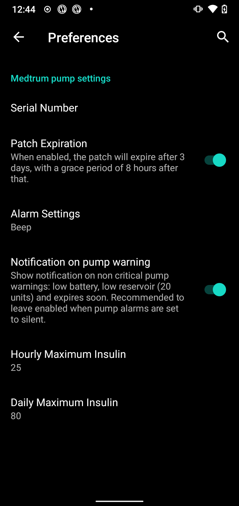

# Medtrum Nano / 300U

Настройка инсулиновой помпы Medtrum. (на сайте производителя помпа именуется насосом, что в общем-то верно. Но мы будем следовать устоявшейся традиции и именовать ее помпой - прим. перев.).

Это программное обеспечение - часть алгоритма самостоятельно настраиваемой ИПЖ; она не является коммерческим продуктом, но требует, чтобы вы прочитали, узнали и поняли, как ей пользоваться. Только вы несете ответственность за то, что делаете.

```{contents} Table of contents
:depth: 1
:local: true
```

## Возможности работы с AAPS
* Поддерживаются все функции замкнутого цикла (SMB, TBR и т. д.)
* Автоматическое определение сезонного времени и часового пояса
* Пролонгированный болюс не поддерживается драйвером AAPS

## Требования к аппаратному и программному обеспечению
* **Совместимые помповые базы и патчи резервуаров**
    - В настоящее время поддерживается:
        - Medtrum TouchCare Nano с помповой базой моделей: **MD0201** и **MD8201**.
        - Medtrum TouchCare Nano 300Uс помповой базой модели: **MD8301**.
        - Если у вас есть неподдерживаемая модель и вы хотите пожертвовать аппаратное обеспечение или помощь в тестировании, пожалуйста, свяжитесь с нами через discord [здесь](https://discordapp.com/channels/629952586895851530/1076120802476441641).
* **Версия 3.2.0.0 или новее, собранная и установленная** с помощью инструкций [Сборка приложения](../SettingUpAaps/BuildingAaps.md).
* **Совместимый Android-телефон** с рабочим модулем BLE Bluetooth
    - См. AAPS [Примечания к выпуску](../Maintenance/ReleaseNotes.md)
* [**Непрерывный мониторинг гликемии**](../Getting-Started/CompatiblesCgms.md)

## Подготовка к работе

**БЕЗОПАСНОСТЬ на первом месте** Не пытайтесь выполнять этот процесс в среде, где нет возможности исправить ошибку (дополнительные патчи, инсулин, устройства управления помпой обязательны).

**Пульт PDM и приложение Medtrum не будут работать с патчем, активированным при помощи AAPS** Прежде, возможно, вы уже пользовались этим устройством и приложением для отправки команд на помпу. В целях безопасности можно пользоваться только активированным патчем с устройством или приложением, которое использовалось для его активации.

*Это НЕ означает, что следует выбросить ваш пульт PDM. Рекомендуется хранить его в надежном месте в качестве резервной копии в случае возникновения чрезвычайных ситуаций, например, если ваш телефон потеряется или AAPS работает неправильно.*

**Помпа не перестанет доставлять инсулин, если она не подключена к AAPS** Скорости Базала запрограммированы на помпе, как указано в текущем активном профиле. Когда работает AAPS, он будет отправлять временные команды на изменение базала, каждая из которх устанавливает базал максимум на 120 минут. Если по каким-то причинам помпа не получаетновых команд (например, из-за потери связи с помпой из-за расстояния до телефона), то после окончания временной базальной скорости. помпа вернется к стандартному базалу, предустановленному на помпе.

**30 -минутные профили базала НЕ поддерживаются в AAPS.** **Профиль AAPS не поддерживает 30-минутный базальный интервал** Если вы новичок в AAPS и устанавливаете базальный профиль впервые, имейте в виду, что получасовые базальные скорости не поддерживаются в AAPS, и следует настроить свой базальный профиль на часовые интервалы. Например, если ваша базальная скорость 1,1 ед., начинается в 09:30, длится 2 часа и заканчивается в 11:30, такие настройки работать не будут. You will need to change this 1.1 unit basal rate to a time range of either 9:00-11:00 or 10:00-12:00. Несмотря на то, что аппаратное обеспечение помпы Medtrum поддерживает профили с 30-минутными отрезками базальной скорости, AAPS в настоящее время не в состоянии учесть их с помощью своих алгоритмов.

**Скорость базала 0 ед/ч НЕ поддерживается в AAPS** Помпа Medtrum не поддерживает нулевую базальную скорость; AAPS использует множество базальных профилей для автоматической терапии и поэтому не может функционировать с нулевой базовой скоростью. A temporary zero basal rate can be achieved through the "Disconnect pump" function or through a combination of Disable Loop/Temp Basal Rate or Suspend Loop/Temp Basal Rate.

## Setup

Внимание: Активируя патч при помощи AAPS **ОБЯЗАТЕЛЬНО** отключите все другие устройства, которые могут связываться с помповой базой Medtrum. например, активный пульт управления помпой PDM и приложение Medtrum. Убедитесь, что помповая база готова, имеется ее серийный номер для активации нового патча.

### Шаг 1: Выберите помпу Medtrum

#### Вариант 1: При начальной установке

Если вы устанавливаете AAPS впервые, вам поможет **Мастер настройки**. Когда дойдете до выбора помпы, выбирайте Medtrum.

Если сомневаетесь, можете выбрать «Виртуальную помпу» и выбрать «Medtrum» после настройки AAPS (см. опцию 2).


#### Вариант 2: Конфигуратор

При существующей установке вы можете выбрать **Medtrum** в [Конфигураторе > Помпа](#Config-Builder-pump):

В левом верхнем углу из **выпадающего меню** выберите **Конфигуратор**\ ➜\ **Помпа**\ ➜\ **Medtrum**\, включив кнопку **Medtrum**.

Поставив флажок в **клетке** напротив **шестеренки настроек** вы активируете вкладку Medtrum в интерфейсе AAPS. Установка этого флажка облегчит доступ к командам Medtrum при использовании AAPS и настоятельно рекомендуется.


### Шаг 2: Изменение настроек Medtrum

Введите настройки Medtrum, нажав на **шестеренку** модуля Medtrum в Конфигураторе.



#### Серийный номер:

Введите здесь серийный номер вашей помповой базы, находящийся на ее корпусе. Убедитесь, что серийный номер указан правильно и без пробелов (можно использовать заглавные или строчные буквы).

ПРИМЕЧАНИЕ: Этот параметр может быть изменен только при отсутствии активного патча.

#### Настройки оповещений

***По умолчанию: звуковой сигнал.***

Этот параметр изменяет способ оповещения об ошибке или предупреждении.

- Звуковой сигнал > Патч будет издавать звуковой сигнал при оповещениях и предупреждениях
- Без звука > патч не будет издавать звука при оповещениях и предупреждениях

Примечание: В беззвучном режиме AAPS по-прежнему будет подавать сигнал в зависимости от настроек громкости вашего телефона. Если вы не реагируете на сигнал, патч в конечном итоге загудит.

#### Уведомление об оповещениях помпы

***По умолчанию: включено.***

Эта настройка меняет способ отображения AAPSом некритических оповещений помпы. При активации на телефоне показываются уведомления с помпы, включая:
    - Низкий заряд батареи
    - В резервуаре мало инсулина (20 ед.)
    - Напоминание об истечении срока патча

В любом случае эти предупреждения также отображаются на экране Medtrum в разделе [Активные оповещения](#medtrum-active-alarms).

(истечение срока действия medtrum)=
#### Окончание срока действия патча

***По умолчанию: включено.***

Этот параметр изменяет поведение патча. Если включено, срок работы патча истечет через 3 дня, о чем при включенном звуке будет выдано звуковое предупреждение. Через 3 дня и 8 часов патч перестанет работать.

Если этот параметр отключен, патч не будет предупреждать вас и продолжит работать, пока не закончится заряд батареи патча или не опустеет резервуар.

#### Предупреждение об истечении срока помпы

***По умолчанию: 72 часа.***

Эта настройка изменяет время предупреждения об [истечении срока действия патча](#medtrum-patch-expiration), AAPS выдаст уведомление в заданное время после активации.

#### Максимальное количество инсулина в час

***По умолчанию: 25 ед.***

Эта настройка изменяет максимальное количество инсулина, которое может быть подано в течение одного часа. Если этот предел превышен, патч будет приостановлен и подаст сигнал. The alarm can be reset by pressing the reset button on in the overview menu see [Reset alarms](#nano-reset-alarms).

Установите это значение на разумную величину вашей потребности.

#### Максимальное количество инсулина в сутки

***По умолчанию: 80 ед.***

Эта настройка изменяет максимальное количество инсулина, которое может быть подано в течение одного дня. Если этот предел превышен, патч будет приостановлен и подаст сигнал. The alarm can be reset by pressing the reset button on in the overview menu see [Reset alarms](#nano-reset-alarms).

Установите это значение на разумную величину вашей потребности.

#### Сканировать при ошибке соединения

***По умолчанию: Выкл.***

Расположено в разделе **Дополнительные настройки**.

Включите только при наличии проблем с подключением. При включении драйвер заново сканирует и пытается подключиться к помпе. Убедитесь, что права доступа к Местоположению установлены на "Всегда позволять".

### Шаг 2b: Настройки оповещений AAPS

Перейдите к настройкам

#### Помпа:

##### BT Watchdog

Перейдите в настройки и выберите **Помпа**:


##### BT Watchdog

Этот параметр попытается обойти любые проблемы блутус BLE. Он активирует попытки снова подключиться к помпе при потере соединения. Кроме того, он будет переподключаться к помпе, когда она недоступен в течение определенного промежутка времени.

Включите этот параметр при частых проблемах соединения с помпой.

#### Локальные оповещения:

Перейдите в настройки и выберите **Локальные оповещения**:


##### Оповещать в случае недоступности помпы

***По умолчанию: включено.***

Эта настройка включается принудительно при активации драйвере Medtrum. Она оповестит вас, когда помпа недоступна. Это может произойти, когда помпа находится вне досягаемости или не отвечает из-за дефектного расположения помповой базы, Например, при поступлении воды между помповой базой и патчем.

В целях безопасности эта настройка не отключается.

##### Порог недоступности помпы [min]

***Значение по умолчанию: 30 мин.***

Этот параметр изменяет время, после которого AAPS будет оповещать вас о недоступности помпы. Это может произойти, когда помпа находится вне досягаемости или не отвечает из-за дефектного расположения помповой базы, Например, при поступлении воды между помповой базой и патчем.

Эта настройка может быть изменена на Medtrum, но по соображениям безопасности рекомендуется оставить 30 минут.

### Шаг 3: Активировать патч

**Прежде чем продолжить:**
- Приготовьте к работе помповую базу Medtrum Nano и резервуар патча.
- Убедитесь, что AAPS правильно настроен и [профиль активирован](../DailyLifeWithAaps/ProfileSwitch-ProfilePercentage.md).
- Другие устройства, которые могут общаться с помпой Medtrum отключены (пульт PDM и приложение Medtrum)

#### Активируйте патч из вкладки Medtrum

Navigate to the [Medtrum TAB](#nano-overview) in the AAPS interface and press the **Change Patch** button in the bottom right corner.

Если патч активен, вам будет предложено сначала деактивировать его. see [Deactivate Patch](#nano-deactivate-patch).

Следуйте подсказкам при заполнении и активации нового патча. Обратите внимание - на этом шаге важно подключить базу помпы к резервуару патча только при появлении подсказки. **Поместить помпу на тело и вставить катетер следует при появлении запроса в процессе активации (после заполнения резервуара).**

##### Начните активацию


На этом шаге дважды нажмите на свой серийный номер и убедитесь, что база помпы еще не подключена к патчу.

Нажмите **Далее** для продолжения.

##### Заполните патч


После того, патч определился и заполнился минимумом 70 ед. инсулина, появится кнопка **Далее**. Нажмите ее.

##### Первичное заполнение (прайм) катетера


Не удаляйте защитный замок и нажмите кнопку иглы на патче.

Нажмите **Далее** для начала заполнения


По завершении первичного заполнения катетера нажмите **Далее**.

##### Прикрепите патч


Очистите кожу, удалите наклейки и прикрепите патч к телу. Снимите предохранительный замок и нажмите на кнопку иглы на патче, чтобы вставить катетер.

Нажмите **Далее** для активации патча.

(medtrum-activate-patch)=
##### Активируйте патч


По завершении активации появится следующий экран


Нажмите **OK** для возврата к главному экрану.

(nano-deactivate-patch)=

### Деактивация патча

To deactivate a currently active patch, go to the [Medtrum TAB](#nano-overview) in the AAPS interface and press the **Change Patch** button.


Вам будет предложено подтвердить отключение текущего патча. **Имейте в виду, что это действие нельзя отменить.** По завершении деактивации можно нажать **Далее** и начать процесс активации нового патча. Если вы не готовы активировать новый патч, нажмите кнопку **Отмена** для выхода на главный экран.


Если AAPS не может деактивировать патч (например, потому что помповая база уже была отсоединена от резервуара патча), можно нажать **Discard** (завершить пользование патчем), чтобы забыть сессию текущего патча и активировать новый патч.


После завершения деактивации, нажмите **OK** для возврата в главное окно или нажмите **Далее** для продолжения активации нового патча.

(nano-resume-interrupted-activation)=

### Возобновить прерванную активацию

If a patch activation is interrupted, for instance because the phone battery runs out, you can resume the activation process by going to the [Medtrum TAB](#nano-overview) in the AAPS interface and press the **Change Patch** button.


Нажмите **Далее** чтобы продолжить активацию патча. Нажмите **Завершить пользование патчем** для сброса текущего патча и активации нового.


Драйвер попробует определить текущий статус активации патча. Если это пройдет успешно, то на текущем шаге начнется активация.

(nano-overview)=

## Общие замечания

На обзорном экране отражен текущий статус патча Medtrum. На нем также находятся кнопки для замены патча, сброса оповещений и обновления статуса.


### Статус BLE:

Показывает текущий статус подключения Bluetooth к помповой базе.

### Последнее подключение:

Показывает, когда помпа подключалась к AAPS.

### Статус помпы:

Показывает текущее состояние помпы. Например:
    - АКТИВНА: помпа активирована и работает в обычном режиме
    - ОСТАНОВЛЕНА: Патч не активирован

### тип базала:

Показывает текущий тип базала.

### Скорость базала:

Показывает текущую базальную скорость.

### предыдущий болюс:

Показывает предыдущий успешный болюс.

### Активный болюс:

Показывает подающийся болюс.

(medtrum-active-alarms)=
### Активные оповещения:

Показывает действующие оповещения.

### резервуар:

Показывает текущий уровень резервуара.

### батарея:

Показывает текущий заряд батареи.

### Тип помпы:

Показывает номер текущего типа помпы.

### Версия ПО:

Показывает текущую версию прошивки патча.

### Номер патча:

Показывает порядковый номер активированного патча. Номер увеличивается каждый раз при активации нового патча.

### Патч заканчивается:

Показывает дату и время окончания срока работы патча.

### Обновить:

Эта кнопка обновляет статус патча.

### Заменить патч:

Эта кнопка запустит процесс замены патча. См [Активировать патч](#medtrum-activate-patch) для получения дополнительной информации.

(nano-reset-alarms)=

### Сбросить оповещения

Кнопка оповещения появляется на главном экране, когда есть активное оповещение, которое может быть убрано с экрана. Нажатие этой кнопки сбросит оповещение и возобновит подачу инсулина, если работа патча была приостановлен из-за оповещения. Например, при приостановке из-за сигнала о достижения максимума суточной подачи инсулина.


Нажмите кнопку **Убрать оповещения** для сброса оповещений и возобновления нормальной работы.

## Смена телефона, экспорт/импорт настроек

При переходе на новый телефон требуются следующие действия:
* Выполните [Экспорт настроек](../Maintenance/ExportImportSettings.md) на вашем старом телефоне
* Перенесите настройки со старого телефона на новый, затем импортируйте их в AAPS

Импортированный файл настроек должен быть с данными того же патча, что вы используете в данный момент, иначе патч не подключится.

После импорта настроек драйвер синхронизирует историю с помпой, это может занять некоторое время, зависящее от давности экспорта файла настроек.

С версии AAPS 3.3.0.0, на главном экране отображается процесс синхронизации: 

## Устранение неполадок

### Проблемы подключения

Если долго не происходит подключение или другие проблемы с подключением:
- В настройках приложений Android для AAPS: Установите разрешение на местоположение на "Разрешать все время".

### Активация прервана

Если активация прервана, например, из-за низкого заряда батареи телефона или поломки телефона. The activation process can be resumed by going to the change patch screen and follow the steps to resume the activation as outlined here: [Resume interrupted activation](#nano-resume-interrupted-activation)

### Предотвращение сбоев в работе патча

Патч может совершить множество ошибок. Во избежание частых ошибок:
- Убедитесь, что помповая база правильно закреплена в патче и не видно никаких зазоров.
- При заполнении патча не применяйте чрезмерную силу к плунжеру. Не пытайтесь заполнять патч сверх максимума, применимого к вашей модели.

## Куда обращаться за помощью

Вся работа по совершенствованию драйвера Medtrum выполняется на основе **добровольности**; просим Вас помнить об этом и, прежде чем запрашивать помощь, придерживаться следующих рекомендаций:

-  **Уровень 0:** Прочитайте соответствующий раздел этой документации, чтобы удостовериться, что вы понимаете, как должна работать функция, с которой вы испытываете трудности.
-  **Уровень 1:** Если вы все еще сталкиваетесь с проблемами, которые вы не можете решить, изучая документацию, перейдите в канал *#Medtrum* на **Discord** с помощью [этой ссылки-приглашения](https://discord.gg/4fQUWHZ4Mw).
-  **Уровень 2:** Ищите среди существующих проблем, отмечена ли она в [Issues](https://github.com/nightscout/AAPS/issues) если она существует, подтвердите/комментарий/добавьте информацию о вашей проблеме. Если нет, создайте [новый вопрос](https://github.com/nightscout/AndroidAPS/issues) и приложите [свои лог-файлы](../GettingHelp/AccessingLogFiles.md).
-  **Будьте терпеливы - решения проблем часто требуют времени и терпения как от пользователей, так и от разработчиков.**