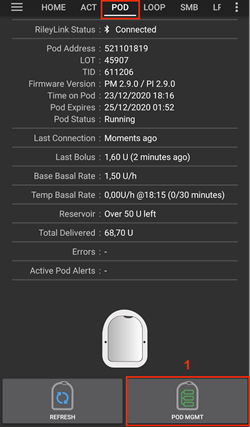

# Документация AAPS по драйверам для помп Omnipod

Эти инструкции для настройки помп Omnipod Eros (**НЕ Omnipod DASH**). Драйвер для Omnipod доступен как составная часть AAPS начиная с версии 2.8.

**Это программное обеспечение - часть алгоритма самостоятельно настраиваемой ИПЖ; она не является коммерческим продуктом, но требует, чтобы вы прочитали, узнали и поняли, как ей пользоваться. Только вы несете ответственность за то, что делаете.**

```{contents}
:backlinks: entry
:depth: 2
```

## Требования к аппаратному и программному обеспечению

- **Устройство связи с Pod**

> Компонент, позволяющий AAPS общаться с подами Eros.
> 
> > -   Сайт [OrangeLink ](https://getrileylink.org/product/orangelink)
> > -  [433MHz RileyLink](https://getrileylink.org/product/rileylink433)
> > -   Сайт [Emalink](https://github.com/sks01/EmaLink) - [Контактная информация](mailto:getemalink@gmail.com)
> > -   DiaLink - [Контактная информация](mailto:Boshetyn@ukr.net)
> > -   [LoopLink сайт](https://www.getlooplink.org/) - [Контактная информация](https://jameswedding.substack.com/) - Непроверено

-   **Мобильный Телефон**

> Компонент, который будет работать с AAPS и отправлять команды управления устройству Pod.
> 
> > - Поддерживающий [Omnipod драйвер на Android](#Phones-list-of-tested-phones) с установленной версией AAPS 2.8 и связанными с ней компонентами.

-   **Устройство подачи инсулина**

> Компонент, который интерпретирует команды, полученные от коммуникационного устройства Pod, для AAPS.
> 
> > - Новый Omnipod (поколения Eros - **НЕ DASH**)

В этих инструкциях предполагается, что вы начинаете новую сессию пода; если это не так, дождитесь замены и начните этот процесс со следующего пода.

## Подготовка к работе

**БЕЗОПАСНОСТЬ на первом месте** Не пытайтесь выполнять этот процесс в среде, где нет возможности исправить ошибку (дополнительные поды, инсулин, устройства управления помпой обязательны).

**Ваш PDM Omnipod не будет работать после того, как драйвер Omnipod активирует ваш под**. Раньше вы использовали Omnipod PDM для отправки команд на Omnipod Eros. Под Omnipod Eros позволяет коммуникацию только с одним устройством. The device that successfully activates the pod is the only device allowed to communicate with it from that point forward. Это означает, что после активации пода с телефона через драйвер AAPS Eros, **вы больше не сможете пользоваться пультом PDM с этим подом**. Драйвер AAPS Omnipod с RileyLink теперь является вашим действующим PDM. *Это НЕ означает, что вы должны выкинуть PDM, рекомендуется хранить его в резерве и для чрезвычайных ситуаций, если ААПС работает неправильно.*

**Можно настроить несколько устройств RileyLink, но только один RileyLink будет обмениваться с подом** Драйвер AAPS Omnipod поддерживает возможность добавления нескольких RileyLink в конфигурацию RileyLink, однако, можно выбрать только один RileyLink, который будет использоваться для коммуникации.

**Ваш Pod не будет отключится, когда RileyLink находится вне диапазона.** Когда RileyLink находится вне диапазона или сигнал заблокирован от связи с активным pod, ваш под будет продолжать давать базальный инсулин. После активации Pod базальный профиль, заданный в AAPS, будет запрограммирован в новый Pod. Если вы потеряете контакт с Pod, он обратится к этому базальному профилю. Вы не сможете выдавать новые команды до тех пор, пока RileyLink не вернется в диапазон и не восстановит соединение.

**30 -минутные профили базала НЕ поддерживаются в AAPS.** Если вы новичок в AAPS и устанавливаете базальный профиль впервые, имейте в виду, что получасовые базальные скорости не поддерживаются в AAPS, и следует настроить свой базальный профиль на часовые интервалы. Например, если ваша базальная скорость 1,1 ед., начинается в 09:30, длится 2 часа и заканчивается в 11:30, такие настройки работать не будут.  Следует изменить базал в 1,1 единицы на диапазон времени с 9:00 до 11:00 или с 10:00 до 12:00.  Несмотря на то, что расширение профиля базисной скорости в 30 минут поддерживается аппаратным обеспечением Omnipod, в настоящее время AAPS не в состоянии учесть их с помощью своих алгоритмов.

## Включение драйвера Eros в AAPS

Активировать драйвер Omnipod Dash в AAPS можно **двумя способами**:

### Вариант 1: Мастер настройки

После установки новой версии AAPS **Мастер Настройки** запустится автоматически.  Это также произойдет во время обновления системы.  Если вы уже экспортировали настройки из предыдущей установки, можно выйти из мастера установки и импортировать старые настройки.  Для новых установок смотрите ниже.

Через ** Мастер настройки AAPS (2)** расположенный в правом верхнем углу **трехточечное меню (1)** и через меню мастера, пока не дойдете до экрана выбора помпы ****. Затем выберите **радио кнопку Omnipod (3)**.

>   

На экране выбора помпы отображаются **Настройки драйвера Omnipod**, под конфигурацией **RileyLink Configuration** добавьте устройство RileyLink, нажав текст **не выбрано**.

На экране **конфигурация RileyLink** нажмите кнопку **Сканировать** и выберите RileyLink, просканировав доступные Bluetooth устройства и выбрав RileyLink из списка. При правильном выборе вы возвращаетесь на экран выбора драйвера помпы с отображением параметров драйвера Omnipod и указанием выбранного вами мак-адреса RileyLink.

Нажмите кнопку **Далее**, чтобы перейти к остальной части **мастера настройки**  Для инициализации выбранного устройства RileyLink может потребоваться до минуты, после чего кнопка **Далее** станет активной.

Detailed steps on how to setup your pod communication device are listed below in the [RileyLink Setup Section](#OmnipodEros-rileylink-setup).

**ИЛИ**

### Вариант 2: Конфигуратор

В левом верхнем углу из **выпадающего меню** выберите **Конфигуратор(1)** ➜**Помпа** ➜ **Omnipod**, включив **радио кнопку(2)** под названием **Omnipod**. Поставив **флажок(4)** напротив **шестеренки настроек(3)** вы активируете вкладку меню Omnipod в интерфейсе AAPS, которая называется **POD**. В документации эта вкладка называется **Omnipod (POD)**.

> **NOTE:** A faster way to access the **Omnipod settings** can be found below in the [Omnipod Settings section](#OmnipodEros-omnipod-settings) of this document.
> 
>  

### Верификация выбора драйвера Omnipod

*Примечание: Если вы уже вышли из мастера настройки без выбора RileyLink, драйвер Omnipod будет включен, но вам все равно нужно выбрать RileyLink.  Вы увидите вкладку Omnipod (POD) как показано ниже*

Чтобы убедиться, что вы активировали драйвер Omnipod в AAPS **смахните экран влево** из вкладки **Начало** и вы увидите вкладку **Omnipod** или **POD**.


## Конфигурация Omnipod

**Смахните главный экран влево** до появления вкладки **Omnipod(POD)**, на которой вы можете управлять всеми функциями пода (некоторые из них неактивны или невидимы вне действующей сессии пода):

>  Обновление соединения и статуса Pod
> 
>  Управление подом (Активация, Деактивация, проверка звукового сигнала, журнал помпы)

(OmnipodEros-rileylink-setup)=

### Настройка RileyLink

If you already successfully paired your RileyLink in the Setup Wizard or steps above, then proceed to the [Activating a Pod Section](#OmnipodEros-activating-a-pod) below.

*Примечание: Визуальным индикатором того, что RileyLink не подключен, является то, что на главном экране не появятся кнопки инсуллина и калькулятора болюса. Это произойдет примерно в течение первых 30 секунд после запуска AAPS, так как он активно подключается к RileyLink.*

1. Убедитесь, что RileyLink полностью заряжен и включен.

2. После выбора драйвера Omnipod, определите и выберите RileyLink в **Конфигураторе (1)** ➜**Помпа**➜**Omnipod**➜**Иконка шестеренки (Настройки) (2)** ➜**Конфигурация RileyLink (3)**, нажав на текст**Не настроен** или **Адрес MAC (если есть)**.

   > Ensure your RileyLink battery is charged and it is [positioned in close proximity](#OmnipodEros-optimal-omnipod-and-rileylink-positioning) (~30 cm away or less) to your phone for AAPS to identify it by its MAC address. Сделав выбор, можете перейти к активации первого сеанса Pod. Нажмите кнопку "Назад" на телефоне, чтобы вернуться к основному интерфейсу AAPS.
   > 
   >  

3. На экране **Выбор RileyLink ** нажмите кнопку **Сканировать (4)** для запуска сканирования bluetooth. **Выберите RileyLink (5)**  из списка доступных устройств. Bluetooth.

   >  

4. После успешного выбора вы возвращаетесь на страницу настроек Omnipod с указанием mac-адреса **выбранного RileyLink (6)**

   > 

5. Убедитесь, что на вкладке **Omnipod (POD)** состояние **RileyLink (1)** отображается как **подключено.** Поле **статус помпы (2)** должно показывать **Нет активных Pod**; если нет, пожалуйста, попробуйте предыдущий шаг или выйдите из AAPS для проверки обновления соединения.

   > 

(OmnipodEros-activating-a-pod)=

### Активация Pod

Перед активацией Pod убедитесь, что вы правильно настроили и подключили RileyLink в настройках Omnipod

*ПРЕДУПРЕЖДЕНИЕ: Коммуникация для активации Pod происходит на ограниченной дистанции, что вызвано мерами безопасности. Перед сопряжением радиосигнал Pod более слабый, однако после подключения связь будет работать при полной мощности сигнала. During these procedures, make sure that your pod is* [within close proximity](#OmnipodEros-optimal-omnipod-and-rileylink-positioning) (~30 cm away or less) but not on top of or right next to the RileyLink.\*

01. Перейдите на вкладку **Omnipod (POD)**, нажмите кнопку **УПРАВЛЕНИЕ помпой (1)**, затем нажмите **Активировать Pod (2)**.

    >  

02. Появится экран **Заполнить Pod**. Заполните новый Pod по меньшей мере 80 единицами инсулина и дождитесь двух звуковых сигналов, подтверждающих, что Pod готов к первичному заполнению катетера. При подсчете общего количества инсулина на 3 дня, учитывайте, что первичное заполнение катетера Pod потребует 12-15 единиц инсулина.

    > 
    > 
    > Убедитесь, что новый Pod и телефон с запущенным AAPS находятся в непосредственной близости друг от друга и нажмите кнопку **Далее**.

03. На экране **Инициализация Pod**, Pod начнет первичное заполнение ( вы услышите щелчок с серией последующих тикающих звуков пока заполняется под). Если RileyLink при активации находится вне диапазона, вы получите сообщение об ошибке **Нет ответа от Pod**. If this occurs, [move the RileyLink closer](#OmnipodEros-optimal-omnipod-and-rileylink-positioning) (~30 cm away or less) to but not on top of or right next to the Pod and click the **Retry (1)** button.

    >  

04. После успешного заполнения катетера появится зеленая галочка, и станет активной кнопка **Далее**. Нажмите на кнопку **Далее** для завершения инициализации и появления экрана **Подключить Pod**.

    > 

05. Затем подготавливаем инфузионный отсек нового пода. Снимите пластмассовый колпачок с иглы, белую бумажную защиту с клеевого слоя и прижмите к обычно выбранному месту на теле. По завершении нажмите кнопку **Далее**.

    > 

06. Теперь появится диалоговое окно **Подключить Pod**. **нажимайте на кнопку OK ТОЛЬКО если вы готовы к установке катетера**.

    > 

07. После нажатия **OK**, понадобится некоторое время для реакции Pod и введения катетера (1-2 минуты максимум), так что наберитесь терпения.

    > Если RileyLink при активации находится вне диапазона, вы получите сообщение об ошибке **Нет ответа от Pod**. Если это происходит, переместите RileyLink ближе (30 см или менее) но не поверх или совсем рядом с Pod и нажмите кнопку **Повторить**.
    > 
    > Если RileyLink находится вне диапазона Bluetooth или не имеет активного подключения к телефону, вы получите сообщение об ошибке **Нет ответа от RileyLink**. Если это происходит, передвиньте RileyLink ближе к телефону и нажмите кнопку **Повторить**.
    > 
    > *ПРИМЕЧАНИЕ: Перед установкой катетера рекомендуется ущипнуть кожу рядом с местом ввода катетера. Это уменьшает болевые ощущения при вводе иглы и снижает шансы на развитие окклюзий.*
    > 
    > 
    > 
    >  

08. При успешном вводе катетера появляется зеленая галочка и активируется кнопка **Далее**. Нажмите на кнопку **Далее**.

    > 

09. Появится экран **Pod активирован**. Нажмите на зеленую кнопку **Завершено**. Поздравляем! Вы начали новую активную сессию Pod.

    > 

10. На экране меню **управления Pod** кнопка **Активировать Pod (1)** теперь *выключена*, а **Деактивировать Pod (2)** *включена*. Это потому, что под активен и вы не можете активировать дополнительный под без деактивации текущего.

    Нажмите на кнопку Назад на телефоне, чтобы вернуться на вкладку **Omnipod (POD)**, которая теперь отображает текущую информацию с Pod, включая скорость базала, заполненность резервуара, введенный инсулин, ошибки и предупреждения.

    For more details on the information displayed go to the [Omnipod (POD) Tab](#OmnipodEros-omnipod-pod-tab) section of this document.

     

### Деактивация Pod

При нормальных условиях ожидаемое время жизни пода 3 дня (72 часа) и дополнительно 8 часов после предупреждения об истечении срока действия, в общей сложности 80 часов.

To deactivate a pod (either from expiration or from a pod failure):

1. Зайдите на вкладку **Omnipod (POD)**, нажмите на кнопку **УПРАВЛЕНИЕ ПОМПОЙ(1)** на экране **Управление помпой Omnipod** нажмите кнопку **Деактивировать Pod(2)**.

   >  

2. На экране **Деактивировать Pod** сначала убедитесь, что RileyLink находится в непосредственной близости от Pod, но не на самом устройстве или совсем рядом с ними, затем нажмите на кнопку **Далее** для начала процесса деактивации Pod.

   > 

3. Появится экран **Деактивация Pod**, и мы получим подтверждение от Pod, что деактивация прошла успешно.

   > 
   > 
   > **Если деактивация не удалась** и звуковое подтверждение не прозвучало, может появиться сообщение **Нет ответа от RileyLink** или **Нет ответа от Pod **. Нажмите на кнопку **Повторить (1)** для повторной попытки деактивации. Если деактивация по-прежнему не удается, пожалуйста, нажмите на кнопку **Завершить пользование Подом(2)** для утилизации Pod. Теперь вы можете удалить свой pod так как активная сессия завершена. Если Pod запрограмирован на громкие звуковые сигналы, возможно потребуется вручную заглушить их, (используя булавкут или скрепку), поскольку кнопка **Завершить пользование Pod (2)** не уберет их.
   > 
   > >   

4. После успешной деактивации на экране появится зеленая галочка. Нажмите на кнопку **Далее**, чтобы отобразился экран Pod деактивирован. Теперь вы можете удалить свой pod так как активная сессия завершена.

   > 

5. Для возврата на экран **Управление помпой Omnipod** нажмите на зеленую кнопку.

   > 

6. Теперь вы оказались в меню **Управление помпой Omnipodt**; нажмите кнопку "Назад" на телефоне, чтобы вернуться на вкладку **Omnipod (POD)**. Убедитесь, что в поле **Статус RileyLink:** отображается **Подключено**, а поле **Статус помпы:** поле отображает сообщение**Нет активных Pod**.

   >   

### Приостановка и возобновление подачи инсулина

Приведенный ниже процесс покажет вам, как приостановить и возобновить подачу инсулина.

*ПРИМЕЧАНИЕ - если вы не видите кнопку ПРИОСТАНОВИТЬ*, то отображение функции не было включено на вкладке Omnipod (POD). Enable the **Show Suspend Delivery button in Omnipod tab** setting in the [Omnipod settings](#OmnipodEros-omnipod-settings) under **Other**.

#### Приостановка подачи инсулина

Используйте эту команду, чтобы перевести активный Pod в приостановленное состояние. В этом приостановленном состоянии Pod больше не подает инсулин. Эта команда имитирует функцию приостановки, которую подает оригинальный пульт Omnipod PDM на активный Pod.

1. Перейдите на вкладку **Omnipod (POD)** и нажмите кнопку **ОСТАНОВ (1)**. Команда приостановки отправляется из RileyLink в активный Pod. При этом кнопка **ОСТАНОВ(3)** становится серой. **Состояние Pod (2)** отображается как **ОСТАНОВ ПОДАЧИ**.

   >  

2. Когда команда остановить подачу прошла успешно, в диалоговом окне подтверждения будет показано сообщение **Введение инсулина приостановлено**. Нажмите **OK** для подтверждения и продолжения.

   > 

3. Активный под теперь приостановил любые подачи инсулина. Вкладка **Omnipod (POD)** обновит статус **Pod (1)** до **приостановлено**. Кнопка **ОСТАНОВ** изменится на новую **Возобновить подачу (2)**

   > 

#### Возобновление подачи инсулина

Use this command to instruct the active, currently suspended pod to resume insulin delivery. После успешной обработки команды, нормальная подача инсулина возобновится в соответствии с текущим активным профилем базала. Pod снова будет принимать команды на болюс, TBR и SMB.

1. Перейдите на вкладку **Omnipod (POD** и убедитесь, что поле **статус помпы (1)** отображает **ПОМПА ОСТАНОВЛЕНА (ПРИОСТАНОВЛЕНО)**, затем нажмите кнопку **ВОЗОБНОВИТЬ ПОДАЧУ(2)** для передачи команды на Pod о возобновлении подачи инсулина. Сообщение **Возобновить подачу** будет отображаться в поле **Статус Pod (3)**, показывая, что RileyLink активно отправляет команду на остановленный Pod.

   >  

2. Когда команда Возобновить подачу прошла успешно, в диалоговом окне подтверждения появится сообщение **Введение инсулина возобновлено**. Нажмите **OK** для подтверждения и продолжения.

   > 

3. Вкладка **Omnipod (POD)** обновит поле **статус помпы (1)**и отобразит **ВЫПОЛНЯЕТСЯ,** а кнопка **Возобновить подачу** примет вид **ОСТАНОВ(2)**.

   > 

### Подтверждение оповещений Pod

*ПРИМЕЧАНИЕ - если вы не видите кнопку "ОПОВЕЩЕНИЕ ПРИНЯТО", то только потому, что оно отображается на вкладке Omnipod (POD), когда срабатывает оповещение о завершении срока действия или низком уровне инсулина в резервуаре.*

Процесс, описанный ниже, поможет подтверждать получение и убирать звуковые сигналы, когда активное время Pod достигнет 72 часов (3‑х суток). Этот предел времени для оповещения определен в настройках сигналов **Времени до выключения** Omnipod. Максимальная продолжительность работы Pod составляет 80 часов (3‑е суток + 8 часов), однако производитель (Insulet) рекомендует не превышать 72 часа (3‑х суток).

*ПРИМЕЧАНИЕ - Если вы включили опцию "Автоматически принимать предупреждения Pod" в Omnipod Alerts, это уведомление будет обработано автоматически после первого вхождения и вам НЕ нужно вручную удалить оповещение.*

1. По достижении заданного времени предупреждения об ** отключении**, под начнет издавать сигналы о сроке отключения и приближении времени замены. Проверить срок замены можно на вкладке **Omnipod (POD)** в поле **Срок действия Пода истекает(1)**, где показывается точное время с момента активации и текст этот становится **красным** спустя 72 часа после активации. Это вызовет кнопку **заглушить сигналы оповещения (3)**. **системное уведомление (4)** также сообщит о предстоящем истечении срока работы пода

   >  

2. Перейдите на вкладку **Omnipod (POD)** и нажмите кнопку **ПОДТВЕРДИТЬ ПОЛУЧЕНИЕ ОПОВЕЩЕНИЯ(1)**). RileyLink отправляет команду на Pod, чтобы деактивировать предупреждение об истечении срока действия Pod, и обновляет состояние **Pod (1)** на ** ОПОВЕЩЕНИЕ ПРИНЯТО**.

   > 

3. После **успешного отключения** оповещений активный Pod издаст **два сигнала** и на экране появится подтверждающее сообщение **активные оповещения заглушены**. Нажмите кнопку **OK** для того, чтобы подтвердить действие и убрать диалоговое окно.

   > 
   > 
   > Если RileyLink находится за пределами диапазона приема Pod в то время, пока команда подтверждения оповещений обрабатывается, могут появиться 2 варианта оповещений. **Отключить звук(1)** заглушит текущее предупреждение. **OK (2)** подтвердит это предупреждение и разрешит пользователю повторно принимать оповещения.
   > 
   > 

4. На вкладке **Omnipod (POD)** в поле **оповещения активного Pod ** больше не будет отображаться предупреждение об истечении срока действия.

(OmnipodEros-view-pod-history)=

### Просмотр истории Pod

В этом разделе показано, как просмотреть историю активного пода и отфильтровать ее по различным категориям. Инструмент истории пода позволяет просматривать действия текущего активного пода за трое суток его жизни (72 - 80 часов).

Эта функция полезна для проверки болюсов, TBR, изменений базала, но без уверенности в завершении. Остальные категории полезны для решения проблем, а также для определения хода событий, приводящих к сбою.

*ПРИМЕЧАНИЕ:* В логах Pod появятся **Не подтверждено**, однако из-за характера таких сообщений невозможно опредилить их точность.

1. Перейдите на вкладку **Omnipod (POD)**, нажмите на кнопку **УПРАВЛЕНИЕ ПОМПОЙ(1)** чтобы вызвать меню **Управление помпой Omnipod** и нажмите на кнопку **История Pod(2)** для вызова экрана истории.

   >  

2. На экране **Журнал Pod** по умолчанию отображается категория **Все (1)** и показываетcz **Дата и время (2)** **Действий (3)** всех Pod и **Результаты (4)** в обратном хронологическом порядке,. Нажмите кнопку назад **на телефоне 2 раза** для возврата на вкладку **Omnipod (POD)** в главном интерфейсе AAPS.

   >  

### Просмотр настроек и журнала RileyLink

В этом разделе показано, как просмотреть настройки активного пода и RileyLink, а также историю их коммуникаций. Эта функция разделена на два раздела: **Настройки** и **История**.

Основное использование этой функции происходит ткогда устройство Bluetooth выходит из диапазона связи с телефоном и через некоторое времяи в поле **RileyLink** появляется сообщение **RileyLink недоступен**. Кнопка **ОБНОВИТЬ** на главной вкладке **Omnipod (POD)** при нажатии позволит попытаться восстановить связь Bluetooth с текущим устройством RileyLink.

В случае если кнопка **ОБНОВИТЬ** на главной вкладке **Omnipod (POD)** не восстанавливает соединение, выполните дополнительные шаги, перечисленные ниже для переподключения вручную.

#### Восстановление передачи данных с устройства Bluetooth

1. С вкладки **Omnipod (POD)**, когда **Статус RileyLink (1)** отображается как **RileyLink недоступен** нажмите кнопку **УПРАВЛЕНИЕ ПОМПОЙ (2)** и перейдите в соответствующее меню. В меню **Управление помпой** вы увидите уведомление о поиске соединения с RileyLink, нажмите кнопку **Статистика RileyLink (3)** и перейдите в экран **настроек RileyLink**.

   >  

2. На экране **Настройки RileyLink (1)** в разделе **RileyLink (2)** отображается статус Bluetooth-соединения, а также ошибки в поле **состояние соединения и ошибки (3)**. Должен быть показан статус *Ошибка Bluetooth* и *RileyLink недоступен*. Запустите ручное соединение Bluetooth, нажав кнопку **обновить (4)** в правом нижнем углу.

   > 
   > 
   > Если Pod не отвечает или находится вне диапазона телефона во время выполнения команды Bluetooth-обновить, предупреждения могут иметь 2 варианта.

   - **Отключить звук(1)** заглушит текущее предупреждение.
   - **OK (2)** подтвердит получение этого предупреждения и позволит пользователю повторно произвести сопряжение Bluetooth.

   > 

3. Если **Соединение Bluetooth** не восстановится, попробуйте вручную **выключить** и затем **включить** функцию Bluetooth в телефоне.

4. После успешного переподключения Bluetooth RileyLink, поле **статуса подключения: (1)** должно сообщать, что **RileyLink готов**. Поздравляем, теперь вы подключились к AAPS с настроенными устройствами!

   > 

#### Коммуникационное устройство Pod и активные настройки Pod

Этот экран отображается статус и информацию о настройках как для текущего коммуникационного устройства, так и для активного пода Omnipod Eros.

1. Перейдите на вкладку **Omnipod (POD)**, нажмите на кнопку **УПРАВЛЕНИЕ ПОМПОЙ(1)**, чтобы вызвать меню **Управление помпой Omnipod**, затем нажмите кнопку **Статистика RileylLnk(2)** для вызова экрана настроек **RileyLink(3)**и **активного пода (4)**.

   >  
   > 
   > 

##### Поля RileyLink (3)

> - **Адрес:** MAC адрес выбранного устройства связи под кодом, определенным в настройках Omnipod.
> - **Название:** идентификационное имя пода, определенное в настройках Bluetooth телефона.
> - **Уровень заряда батареи:** Отображает текущий уровень заряда подключенного устройства связи с подом
> - **Подключенное устройство:** модель Omnipod сопряженного с устройством связи
> - **Статус соединения**: Текущий статус соединения Bluetooth с устройством коммуникации Pod.
> - **Ошибка соединения:** Если есть ошибка соединения с устройством Bluetooth, отображаются подробные сведения о Bluetooth.
> - **Версия прошивки:** Текущая версия прошивки на подключенном устройстве связи.

##### Поля устройства (4) - с активным Pod

> - **Тип устройства:** Тип устройства, связывающегося с устройством связи (Omnipod Pod pump)
> - **Модель устройства:** Модель активного устройства, подключенного к устройству связи Pod (текущее название модели модуля Omnipod, т. е. Eros)
> - **Серийный номер помпы:** Серийный номер активированного в настоящее время пода
> - **Частота помпы:** Радиочастота связи коммуникационного устройства, настроенная, чтобы обеспечить связь между собой и Pod.
> - **Последняя используемая частота:** Последняя известная радиочастота пода, используемая для связи с устройством коммуникации.
> - **Последняя Контактная запись устройства:** Дата и время последнего контакта c устройством соединения.
> - **Кнопка Обновить** вручную обновите настройки на этой странице.

(omnipod-eros-rileylink-i-active-pod-history)=
#### RileyLink и журнал активного Пода

На этом экране отображается информация в обратном хронологическом порядке каждого состояния или действия, которые выполняют в данный момент либо выполнили RileyLink и активный Pod. Вся история доступна только для текущего активного pod, после замены Pod журнал будет удален и будут записаны и показаны только события из вновь активированного Pod.

1. Перейдите на вкладку **Omnipod (POD)**, нажмите на кнопку **УПРАВЛЕНИЕ ПОМПОЙ(1)**, чтобы войти в меню **Управление помпой Omnipod**, нажмите на кнопку **История Pod(2)** для вызова экрана **настроек** и **истории**. Нажмите на **ИСТОРИЯ (3)** для отображения всей истории RileyLink и активного Pod.

   >  
   > 
   > 

##### Поля

> - **Дата & Время**: В обратном хронологическом порядке временная отметка каждого события.
> - **Устройство:** Устройство, на которое ссылается текущее действие или состояние.
> - **Состояние или Действие:** Текущее состояние или действие, совершенное устройством.

(OmnipodEros-omnipod-pod-tab)=

## Вкладка Omnipod (POD)

Ниже приведено объяснение расположения и значения иконок и информационных полей на вкладке **Omnipod (POD)** в главном интерфейсе AAPS.

*ПРИМЕЧАНИЕ: Если в каком-то из информационных полей вкладки Omnipod (POD) появляется сообщение "не подтверждено" нажмите кнопку Обновить для получения точного статуса.*

> 

### Поля

- **Статус RileyLink:** Отображает текущее состояние соединения RileyLink

- *RileyLink Недоступен* — устройство связи Pod Bluetooth нет в зоне телефона который либо выключен или имеет сбой, препятствующий коммуникации через Bluetooth.
- *RileyLink Готов* - устройство связи включено и активно инициализирует соединение Bluetooth
- *Подключено* - устройство связи включено, подключено и способно активно общаться через Bluetooth.

- **адрес Pod:** Отображает текущий адрес, в котором указан активный POD.

- **Номер партии** Отображает номер партии изготовления активного POD

- **Серийный номер** Отображает серийный номер активного POD.

- **Версия прошивки:** Отображает версию прошивки активного POD.

- **Время на Pod:** Отображает текущее время на POD

- **Срок действия Pod истекает:**Отображает дату и время окончания срока работы активного POD.

- **Статус Pod:** Отображает статус активного POD.

- **Прошлое подключение:** Отображает время последней связи с Pod.

- *Только что* - меньше 20 секунд назад.
- *Менее минуты назад* - более 20, но менее 60 секунд назад.
- *1 минуту назад* - более 60, но менее 120 секунд (2 мин)
- *XX минут назад* - более 2 минут назад, определяется величиной XX

- **Предыдущий болюс:** Отображает величину болюса, отправленного в активный Pod с указанием в скобках как давно он был подан.

- **Базовая скорость базала:** Отображает базовую скорость, запрограммированную на текущее время из профиля базала.

- **Временная скорость базала:** Отображает текущую временную скорость базала в следующем формате

- Единицы / час @ время начала TBR (отработаных минут / общее время TBR)
- *Пример:* 0.00ед./ч. @18:25 ( 90/120 мин.)

- **Резервуар:** Показывает 50+ед. когда в резервуаре остается более 50 ед. Ниже этого значения точные единицы отображаются желтым текстом.

- **Всего подано** Отображает общее количество единиц инсулина, доставленных из резервуара. *Обратите внимание, что это приблизительная величина, поскольку первичное заполнение POD не является точным процессом.*

- **Ошибки:** Отображает последнюю возникшую ошибку. Review the [Pod history](#OmnipodEros-view-pod-history), [RileyLink history](#omnipod-eros-rileylink-and-active-pod-history) and log files for past errors and more detailed information.

- **Активные оповещения Pod** зарезервировано для текущих оповещений на активном Pod. Обычно используется при истечении срока действия pod последние 72 часа, а звуковые оповещения работают.

### Значки

- **ОБНОВИТЬ:**

  > 
  > 
  > Отправляет команду обновить в активный Pod для обновления коммуникации
  > 
  > Используйте для обновления статуса pod и сброса полей статуса, содержащих текст (не подтверждено).
  > 
  > See the [Troubleshooting section](#OmnipodEros-troubleshooting) below for additional information.

- **УПРАВЛЕНИЕ ПОМПОЙ:**

  > 
  > 
  > Ведет в меню управления Pod

- **ПРИНЯТЬ ОПОВЕЩЕНИЯ:**

  > 
  > 
  > При нажатии отключает звуковые оповещения и уведомления об истечении срока действия.
  > 
  > Кнопка отображается только при истечении срока действия предупреждения После успешного сброса, этот значок больше не будет отображаться.

- **УСТАНОВИТЬ ВРЕМЯ:**

  > 
  > 
  > При нажатии синхронизирует время на POD с текущим временем на телефоне.

- **ПРИОСТАНОВИТЬ:**

  > 
  > 
  > Останавливает активный под

- **ВОЗОБНОВИТЬ ПОДАЧУ:**

  > 
  > 
  > > Возобновляет остановленный активный под

### Меню управления помпой

Ниже приводится описание макета и значения иконок в меню **Управление Pod**, доступном из вкладки **Omnipod (POD)**.

> 

- **Активация Pod**

  > 
  > 
  > Заполняет катетер и активирует новый Pod

- **Деактивация Pod**

  > 
  > 
  > Деактивирует текущий активный Pod.
  > 
  > Частично сопряженный Pod игнорирует эту команду.
  > 
  > Используйте эту команду, чтобы деактивировать под, издающий звуковое оповещение об окончании срока работы (ошибка 49).
  > 
  > Если кнопка отключена (высвечивается серым) используйте кнопку Завершить пользование Pod'ом.

- **Воспроизвести тестовый звуковой сигнал**

  > 
  > 
  > Воспроизводит один тестовый сигнал на поде при нажатии.

- **Завершить пользование Pod'ом**

  > 
  > 
  > При нажатии деактивирует и сбрасывает состояние не реагирующего пода.
  > 
  > Кнопка отображается только тогда, когда происходят нештатные ситуации поскольку надлежащее деактивация уже невозможна:
  > 
  > > - **Pod не полностью сопряжен ** и поэтому игнорирует команды на деактивацию.
  > > - **Pod завис** между шагами во время процесса сопряжения
  > > - **Pod просто не сопрягается**

- **Журнал Pod**

  > 
  > 
  > Отображает историю активности Pod

- **Статистика RileyLink:**

  > 
  > 
  > Ведетна экран статистики RileyLink, отображающий текущие настройки и историю соединения RileyLink
  > 
  > > - **Настройки** - отображает информацию о RileyLink и настройках активного Pod
  > > - **История** - отображает историю коммуникации RileyLink и Pod

- **Сбросить конфигурацию RileyLink**

  > 
  > 
  > При нажатии эта кнопка сбрасывает текущую конфигурацию подключенного коммуникационного устройства.
  > 
  > > - Когда начата коммуникация, в RileyLink передаются и настраиваются следующие данные > - установлены регистры памяти > -  установлены протоколы связи > - настроена частота 
  > > - См [дополнительные примечания](#OmnipodEros-reset-rileylink-config-notes) в конце таблицы

- **Читать журнал импульсов:**

  > 
  > 
  > > Отправляет журнал импульсов в буфер обмена

(OmnipodEros-reset-rileylink-config-notes)=

#### *Сбросить записи конфигурации RileyLink*

- Эта функция в основном требуется когда не отвечает активное устройство связи и коммуникация зависла.
- Если коммуникационное устройство pod выключено, а затем снова включено, необходимо нажать кнопку **Сбросить конфигурацию RileyLink **, чтобы установить параметры связи в конфигурации коммуникационного устройства.
- Если это НЕ выполнено, то AAPS необходимо будет перезапустить после того, как перезагрузится устройство (Riley) передачи данных.
- Эта кнопка **НЕ** должна быть нажата при переключении между различными устройствами связи (Riley)

(OmnipodEros-omnipod-settings)=

## Настройки Omnipod

Настройки драйвера Omnipod доступны из левого верхнего **выпадающего меню** выберите **Конфигуратор**\ ➜\ **Помпа**\ ➜\ **Omnipod **\ ➜\ **Шестеренка настроек (2)** включить ** радио кнопку (1) **с маркировкой **Omnipod** Поставив **флажок (3)** рядом с **шестеренкой настроек(2)** вы активируете вкладку Omnipod в интерфейсе AAPS. В документации эта вкладка называется **Omnipod (POD)**.


**ПРИМЕЧАНИЕ:** Более быстрый способ доступа к **Настройкам Omnipod** - через меню **3 точки (1)** в правом верхнем углу вкладки **Omnipod(POD)** выбрать **Настройки Omnipod (2)** из выпадающего меню.


The settings groups are listed below; you can enable or disable via a toggle switch for most entries described below:


*ПРИМЕЧАНИЕ: Знак (\*) обозначает что выбрано значение по умолчанию.*

### RileyLink / РайлиЛинк

Позволяет сканировать устройство коммуникации. Драйвер Omnipod не может выбрать несколько устройств связи одновременно.

- **Показать уровень заряда батареи от OrangeLink/EmaLink/DiaLink:** сообщает фактический уровень заряда батареи OrangeLink/EmaLink/Dialink. **Настоятельно рекомендуется** всем пользователям OrangeLink/EmaLink/DiaLink активировать эту настройку.

- НЕ работает с оригинальным RileyLink.
- Может не работать с альтернативами RileyLink.
- Включено - Отображает текущий уровень заряда для поддерживаемых устройств связи.
- Отключено - Отображает значение n/a.

- **Включить запись о замене батареи в Действиях:** в меню Действий, кнопка изменения батареи включена, ЕСЛИ вы включили эту настройку и настройку батареи выше.  Некоторые коммуникационные устройства работают от обычных заменяемых батарей.  Эта опция позволяет сбросить таймеры батареи.

### Звуковые сигналы подтверждения

Provides confirmation beeps from the pod for bolus, basal, SMB, and TBR delivery and changes.

- **Звуковой сигнал болюса включен** Включить или отключить подтверждающие сигналы при подаче болюса.
- **Звуковой сигнал базала включен:** Включить или отключить звуки подтверждения, когда установлена новая базальная скорость, отменена или изменена действующая базальная скорость.
- **Звуковой сигнал микроболюсов SMB включен** Включить или отключить подтверждающие сигналы при подаче микроболюсов.
- **Звуковой сигнал временного базала TBR включен** Включить или отключить подтверждающие сигналы при установке или отмене TBR.

### Оповещения

Оповещения AAPS и Nightscout об истечении срока, выключении, низком резервуаре на основе заданных пороговых значений.

*Note an AAPS notification will ALWAYS be issued for any alert after the initial communication with the pod since the alert was triggered. Dismissing the notification will NOT dismiss the alert UNLESS automatically acknowledge Pod alerts is enabled. Чтобы ВРУЧНУЮ убрать оповещение следует открыть вкладку Omnipod (POD) и нажать кнопку Заглушать СИГНАЛЫ ОПОВЕЩЕНИЯ.*

- ***Включено напоминание об истечении срока действия:** Включение или отключение напоминания о истечении срока действия струи для срабатывания по достижении определенного количества часов до завершения работы.
- **Время до выключения**.
- **Предупреждение о низком уровне резервуара включено:** Включить или отключить оповещение, когда достигается нижний лимит определенный в поле Количество единиц емкости.
- **Количество единиц:** Количество единиц, на которые можно вызывать предупреждение о низком резервуаре резервуара.
- **Автоматически признавать Pod уведомления:** Когда включено, уведомление все еще будет выдано однако сразу после первого сообщения от Pod, оно будет автоматически признано, и предупреждение будет закрыто.

### Уведомления

Выдает уведомления AAPS и звуковые оповещения, когда нет уверенности в успешных TBR, SMB, болюсах или приостановленных событиях.

*NOTE: These are notifications only, no audible beep alerts are made.*

- **Звук для неопределенных уведомлений TBR включен:** Включите или отключите этот параметр, чтобы вызвать звуковое оповещение и визуальное уведомление, когда AAPs неизвестно, был ли установлен TBR.
- **Звук для неопределенных уведомлений SMB включен:** Включите или отключите этот параметр, чтобы вызвать звуковое оповещение и визуальное уведомление, когда AAPs неизвестно, был ли успешно подан микроболюс SMB.
- **Звук для неопределенных уведомлений о болюсах включен:** Включите или отключите этот параметр, чтобы вызвать звуковое оповещение и визуальное уведомление, когда AAPs неизвестно, был ли успешно подан болюс.

### Другое

Предоставляет расширенные настройки для содействия отладке.

- **Показать кнопку Приостановить подачу на вкладке Omnipod:** Скрыть или показать кнопку приостановки подачи инсулина на вкладке **Omnipod (POD)**.
- **Показать кнопку журнала импульсов меню управления Pod:** Скрыть или отобразить кнопку журнала импульсов в меню **Управление Pod**.
- **Показать кнопку статуса RileyLink в меню управления Pod:** Скрыть или отобразить кнопку статуса RileyLink в меню **Управление Pod**.
- **\Когда включено, определать часовой пояс ** позволяет автоматически определять изменения часового пояса, если телефон используется в зоне, где применяется сезонная смена времени.

### Переключение или удаление активного устройства связи с Pod (RileyLink)

При наличии множества эквивалентов RileyLink (например, OrangeLink или EmaLink) или при необходимости в резервном устройстве связи (RileyLink), появляется необходимость переключить или удалить выбранное устройство связи (RileyLink) из конфигурации настроек Omnipod.

Следующие шаги показывают как **Удалить**активное устройство коммуникации (RileyLink), а также **Добавить** новое устройство.  Выполнение шагов **Удалить** и **Добавить** позволит сменить устройство.

1. Откройте меню **Выбора Rileylink **- через меню **3 точки (1)** в правом верхнем углу вкладки **Omnipod(POD)** и выберите **Настройки Omnipod (2)** из выпадающего меню. В меню **Настройки Omnipod** в разделе **Конфигурация RileyLink(3)** нажмите **Не выбрано** (если не выбрано устройство) или **MAC Address** (если устройство используется), чтобы открыть меню **Выбор RileyLink **.

   >  

### Удаление выбранного устройства связи с Pod (RileyLink)

Этот процесс покажет, как удалить выбранное устройство связи с POD (RileyLink) из настроек Omnipod Driver.

1. В **Конфигурации RileyLink** нажмите строку **MAC Address (1)**, чтобы открыть меню **Выбор RileyLink**.

   > 

2. В меню **Выбор RileyLink ** нажмите кнопку **Удалить (2)** для удаления **выбранного вами RileyLink (3)**

   > 

3. В запросе подтверждения нажмите **Да (4)** для подтверждения удаления устройства.

   > 

4. Вы возвращаетесь в меню **Настройки Omnipod**, где в разделе **Конфигурация RileyLink** видно, что устройство **не установлено (5)**.  Поздравляем, вы успешно удалили выбранное устройство коммуникации с Pod.

   > 

### Добавить выбранное устройство связи с POD (RileyLink)

Этот процесс покажет как добавить новое коммуникационное устройство в настройки Omnipod Driver.

1. В меню **Конфигурация RileyLink ** нажмите строку **не установлено (1)**, чтобы открыть меню **Выбор RileyLink**.

   > 

2. Нажмите кнопку **Сканировать (2)** для сканирования доступных устройств Bluetooth.

   > 

3. Выберите **RileyLink (3)** из списка доступных устройств и вы попадете в меню **Настройки Omnipod** с отображением **MAC адреса (4)** вновь выбранного устройства.  Поздравляем, вы успешно выбрали ваше устройство связи с POD.

   >  

## Вкладка Действия (ACT)

Эта вкладка описана в основной документации AAPS, но на этой вкладке есть несколько специфических элементов для Omnipod, в отличие от проводных помп, особенно после установки нового пода.

1. Перейдите на вкладку **Действия (ACT)** в главном интерфейсе AAPS.
2. В секции **портал терапии (1)** поля **Инсулин** и **Катетер помпы** **после каждой замены пода** сбрасывают свой **отработанный срок (возраст)** на 0 дней и 0 часов. Это происходит из-за устройства и принципа работы Omnipod. **Батарея помпы** и **резервуар инсулина** в каждом поде свои. Так как Pod вводит катетер непосредственно в кожу на месте установки, в помпах Omnipod не применяется традиционная трубка. *Поэтому после замены пода значение каждой из этих величин автоматически сбрасывается на ноль***Возраст батареи помпы**не отображается поскольку он всегда больше срока работы пода (максимум 80 часов).

> 

### Уровни

**Insulin Level**

Информация о количестве инсулина в Omnipod Eros не является точной.  Это потому, что точно не известно сколько инсулина было заправлено в Pod, и только при срабатывании 2 звуковых сигналов при заполнении пода, станет понятно, что заправлено 85 единиц инсулина. Под может вместить максимум 200 единиц. Заполнение катетера также может добавить неточности, поскольку это не точный процесс.  Учитывая оба этих фактора и был написан драйвер Omnipod, который дает максимально точное приближение к количеству остающегося в резервуаре инсулина.

> - **больше 50 единиц** - Pod сообщает о количестве более 50 единиц.
> - **Ниже 50 единиц** - Сообщает о приблизительно вычисленном количестве инсулина в резервуаре.
> - **SMS** - В SMS сообщается реальный остаток в ед. или 50+ед
> - **Nightscout** - при более чем 50 единиц в Nightscout выгружается значение 50 ед.(версия 14.07 и старше).  Более новые версии покажут 50 + когда более 50 единиц.

**Уровень заряда батареи**

Отчет об уровне заряда батареи - это настройка, которая может быть включена для отображения текущего уровня заряда таких устройств как OrangeLink, EmaLink или DiaLink.  Устройство RileyLink не может передавать данные об уровне заряда своей батареи.  Уровень заряда батареи указывается после каждой связи с POD, поэтому при зарядке может не наблюдаться линейное увеличение.  Ручное обновление состояния обновит текущий уровень заряда батареи.  При отключении поддерживаемого устройства связи с Pod показывается значение 0%.

> - **Устройство RileyLink НЕ может передавать данные об уровне заряда своей батареи**
> - **Настройка "Показать уровень заряда батареи OrangeLink/EmaLink/DiaLink" ДОЛЖНА быть включена в настройках Omnipod для передачи уровня заряда батареи**
> - **Уровень заряда передается ТОЛЬКО для устройств OrangeLink, EmaLink и DiaLink**
> - **Уровень заряда батареи МОЖЕТ работать для других устройств (за исключением RileyLink)**
> - **SMS** - Возвращает текущий уровень заряда батареи
> - **Nightscout** - Передается при наличии фактического уровня заряда аккумулятора

(OmnipodEros-troubleshooting)=

## Устранение неполадок

### Сбои в работе Pod

Pods fail occasionally due to a variety of issues, including hardware issues with the Pod itself. It is best practice not to call these into Insulet, since AAPS is not an approved use case. Список ошибок можно найти [здесь](https://github.com/openaps/openomni/wiki/Fault-event-codes) для помощи в определении причины.

### Предотвращение ошибки 49 при сбоях Pod

This failure is related to an incorrect pod state for a command or an error during an insulin delivery command. Чтобы предотвратить возможные сбои рекомендуем пользователям переключиться на клиент Nightscout на *только загружать (отключить синхронизацию)* в **Конфигураторе**➜**Общие**➜**NSClient**➜**шестеренка настроек**➜**Расширенные настройки**,.

### Оповещения о недоступности помпы

Рекомендуется настроить оповещения о недоступности сигналов помпы на **120 минут**, перейдя в верхнее правое меню, выберите **Настройки**➜**Локальные оповещения**➜**Порог недоступности помпы \[мин\]** и установить значение **120**.

(OmnipodEros-import-settings-from-previous-aaps)=
### Импорт настроек из предыдущих AAPS

Обратите внимание, что при импорте настроек может быть импортирован устаревший статус пода. В результате вы можете потерять активный Pod. Поэтому настоятельно рекомендуется **не импортировать настройки во время активной сессии Pod.**.

1. Деактивируйте вашу сессию пода. Проверьте, что у вас нет активного сеанса Pod.
2. Экспортируйте ваши настройки и храните копию в надежном месте.
3. Удалите предыдущую версию AAPS и перезапустите телефон.
4. Установите новую версию AAPS и убедитесь, что у вас нет активной сессии Pod.
5. Импортируйте ваши настройки и активируйте новый код.

### Оповещения драйвера Omnipod

обратите внимание, что драйвер Omnipod Erosсодержит множество оповещений на вкладке **Начало**, большинство из них являются информационными и могут быть отключены, в то время как некоторые предоставляют пользователю возможности устранения причин оповещения. A summary of the main alerts that you may encounter is listed below:

#### Нет активных Pod

Активный сеанс Pod не обнаружен. Это предупреждение можно временно отклонить, нажав **УБРАТЬ**, но оно будет продолжать срабатывать до тех пор, пока не активирован новый Pod. После активации предупреждение автоматически заглушается.

#### Omnipod остановлен

Информационное оповещение, о том, что работа Pod приостановлена.

#### Настройка базального профиля не состоялась. Подача инсулина может быть приостановлена! Обновите статус Pod вручную на вкладке Omnipod и, при необходимости, возобновите подачу..

Информационное оповещение о неудачной настройке базального профиля, необходимо нажать *Обновить* на вкладке Omnipod.

#### Не удалось проверить, успешна ли подача болюса SMB. Если вы уверены, что болюс не подан, следует вручную удалить запись о СМБ из терапии.

Предупреждение о том, что успешная подача болюса SMB не может быть проверена, вам следует проверить поле *Предыдущий болюс* на вкладке Omnipod, чтобы убедиться, что SMB был успешным, а если нет - удалить элемент из вкладки Терапия.

#### Неопределено, если "задача bolus/TBR/SMB" завершена, пожалуйста, проверьте правильность выполнения.

Из-за специфики коммуникации RileyLink и Omnipod, могут возникнуть ситуации, когда отображается *не определено*, была ли успешно обработана команда. Было необходимо информировать пользователя об этой неопределенности.

Ниже приведены примеры, когда может быть получено такое уведомление.

- **Болюсы** - Невозможно автоматически подтвердить неопределенные болюсы. Уведомление сохраняется до следующего болюса, но команда на обновление статуса очистит сообщение. *По умолчанию для этого типа уведомлений предупреждения включены, так как пользователю необходимо их верифицировать.*
- **TBRs, Pod Statuses, Profile Switches, Time Changes** - команда на обновление вручную очистит эти сообщение. По умолчанию звуковые сигналы отключены для этого типа уведомлений.
- **Разница во времени с Pod-** Когда время на поде и время телефона слишком сильно отклоняются, AAPS трудно функционировать и делать точные прогнозы и рекомендации дозировки. Если временное отклонение между подом и телефоном составляет более 5 минут, то AAPS сообщит о том, что POD Приостановлен и выдаст сообщение ВЫПОЛНИТЕ СМЕНУ ВРЕМЕНИ. В нижней части вкладки Omnipod (POD) появится дополнительная иконка **Установить время**. Нажав на кнопку Установить время вы синхронизируете время на поде с временем на телефоне, далее вы можете нажать кнопку ВОЗОБНОВИТЬ ПОДАЧУ, чтобы продолжить обычные операции.

## Рекомендации

(OmnipodEros-optimal-omnipod-and-rileylink-positioning)=

### Оптимальное расположение Omnipod и RileyLink

Антенна, используемая на RileyLink, для общения с Omnipod представляет собой спиралевидную антенну, работающую на частоте 433 МГц. Благодаря своим конструктивным особенностям она излучает многонаправленный сигнал, как трехмерный тор с осью z, представляющей вертикально стоящую антенну. Это означает, что для размещения RileyLink, особенно во время активации и деактивации, существуют оптимальные позиции.


> *(рис. 1. Схематическое изображение спиралевидной многонаправленной антенны*

Из соображений безопасности *активация* должна выполняться на расстоянии * ближе (~30 см или меньше)* чем другие операции, такие как введение болюса, установка TBR или просто обновление состояния Pod. В связи с характером передачи сигнала с антенны RileyLink, не рекомендуется размещать под поверх или слишком близко к RileyLink.

На рисунке ниже показан оптимальный способ размещения RileyLink в процессе активации и деактивации. В других позициях Pod также может быть активирована, но вы наилучшее положение показано на изображении ниже.

*Примечание: Если после оптимального позиционирования Pod и RileyLink не удается установить соединение, это может быть вызвано низким зарядом батареи, который уменьшает диапазон антенны RileyLink. Чтобы избежать этого, убедитесь, что RileyLink хорошо заряжен или подключен к зарядному кабелю во время этого процесса.*


## Где получить помощь по драйверу Omnipod

Вся работа по совершенствованию драйвера Omnipod выполняется на добровольной основе просим помнить об этом и, прежде чем запрашивать помощь, придерживаться следующих рекомендаций:

- **Уровень 0:** Прочитайте соответствующий раздел этой документации, чтобы удостовериться, что вы понимаете, как должна работать функция, с которой вы испытываете трудности.
- **Уровень 1:** Если вы все еще сталкиваетесь с проблемами, которые не можете решить, изучая документацию, перейдите в канал *#Aaps* на **Discord** с помощью [этой ссылки-приглашения](https://discord.gg/4fQUWHZ4Mw).
- **Уровень 2:** в существующих проблемах найдите аналогичный вопрос, если нет, задайте новый [ вопрос<](https://github.com/nightscout/AndroidAPS/issues) и приложите свои [лог-файлы](../GettingHelp/AccessingLogFiles.md).
- **Будьте терпеливы - решения проблем часто требуют времени и терпения как от пользователей, так и от разработчиков.**
