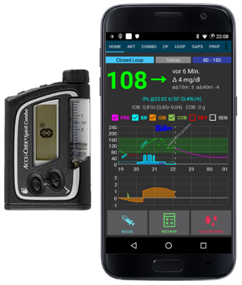

# Помпа Accu Chek Combo

**Настоящее ПО является частью самодеятельной разработки, а не готовым программным продуктом. От ВАС потребуется прочитать, изучить и понять систему и то, как ей пользоваться. Она не контролирует диабет за вас, но позволит улучшить компенсацию и качество жизни, если вы готовы уделить ей достаточно времени. Не бросайтесь в систему сломя голову, дайте себе время на изучение. Только вы несете ответственность за то, что делаете.**

(Accu-Chek-Combo-Pump-hardware-requirements)=

## Требования к оборудованию

- Помпа Roche Accu-Chek Combo (любая версия прошивки, работают все)
- Устройство Smartpix или Realtyme с приложением "360" для конфигурирования помпы под свои параметры. По вашему запросу фирма Roche бесплатно вышлет устройства и По. (как всегда, Россия здесь исключение. По крайней мере, переводчику данной документации ничего не выслали. Возможно, надо разговаривать с сотрудниками или руководителями фирмы, а не с агентами, чьи контакты нам обычно дают при установке помпы)
- A compatible phone: An Android phone with a phone running LineageOS 14.1 (formerly CyanogenMod) or at least Android 8.1 (Oreo). As of AndroidAPS 3.0 Android 9 is mandatory. See [release notes](https://androidaps.readthedocs.io/en/latest/Installing-AndroidAPS/Releasenotes.html#android-version-and-aaps-version) for details.
- With LineageOS 14.1 it has to be a recent version from at least June 2017 since the change needed to pair the Combo pump was only introduced at that time. 
- Список телефонов можно найти в документе [Телефоны, работающие с AAPS](https://docs.google.com/spreadsheets/d/1gZAsN6f0gv6tkgy9EBsYl0BQNhna0RDqA9QGycAqCQc/edit).
- Пожалуйста, имейте в виду, что это не полный список и отражает личный опыт пользователей. Вам предлагается также делиться результатами вашего опыта и тем самым помогать другим (все подобные проекты основаны на идеологии бескорыстной помощи).
- Имейте в виду, что в то время как Android 8.1 позволяет общаться с Combo, все еще есть проблемы с AAPS на 8.1.
- Для опытных пользователей можно выполнить сопряжение на телефоне с рут-правами и перенести его на другой телефон с руфи/AAPS, которые также должны быть рутированы. Такой подход позволяет пользоваться телефонами с версиями Android ниже 8.1, но он еще достаточно не опробован. https://github.com/gregorybel/combo-pairing/blob/master/README.md

## Ограничения

- Extended bolus and multiwave bolus are not supported (see [Extended Carbs](../Usage/Extended-Carbs.md) instead).
- Поддерживается только один базальной профиль.
- Установка профиля, отличного от заданного на помпе или подача пролонгированного/многоволнового болюса с помпы конфликтует с временной скоростью базала TBR и приводит алгоритм ИПЖ к работе только в режиме приостановки на низких ГК в течение 6 часов поскольку безопасность работы цикла при этом нарушается.
- It's currently not possible to set the time and date on the pump, so [daylight saving time changes](Timezone-traveling-accu-chek-combo) have to be performed manually (you may disable the phone's automatic clock update in the evening and change it back in the morning together with the pump clock to avoid an alarm during the night).
- В настоящее время поддерживаются только величины базала от 0.05 до 10 ед./час. Это также относится к изменениям профиля, например, при увеличении до 200% наивысшая скорость базала не должна превышать 5 ед/час, поскольку она удвоится. Аналогично, при снижении на 50%, самая низкая базальная скорость не должна быть меньше 0,10 U/ч.
- Если алгоритм цикла запрашивает отмену текущей временной скорости базала TBR, Combo на 15 минут установит TBR в 90% или 110%. Это делается из-за того, что отмена TBR вызывает лишние вибрации на помпе.
- Периодически (раз в несколько дней) AAPS может дать сбой оповещения TBR ОТМЕНЕН при автоматической отмене TBR. Пользователю придется самостоятельно разобраться с этим (нажав кнопку "обновить" в AAPS для передачи предупреждения в программу или подтвердив получение оповещения кнопкой помпы).
- Стабильность соединения по bluetooth различна в разных телефонах и может вызвать оповещение "помпа недоступна" когда соединение разорвано. 
- Если возникает эта ошибка, убедитесь, что Bluetooth включен, нажмите кнопку "обновить" на вкладке Комбо и проверьте, устранена ли проблема и если соединение не восстановится, перезагрузите телефон, что обычно исправляет ошибку. 
- Есть другая проблема, при которой перезапуск не помогает. В этом случае следует нажать на помпе кнопку, которая перезапускает bluetooth помпы и помпа снова начнет принимать соединение с телефоном. 
- В настоящее время мало что можно сделать для устранения этих проблем. Поэтому если подобные ошибки повторяются часто, подберите себе другой телефон, о котором известно, что он хорошо работает с AndroidAPS и Комбо (см. выше).
- Подача болюса с помпы не всегда распознается вовремя (проверяется только во время соединения с AAPS) и в худшем случае может занять до 20 минут. 
- Болюсы помпы проверяются перед высоким временным базалом TBR или болюсом, подаваемым с AAPS, но из-за встроенных ограничений AAPS откажется подавать TBR/болюс, основанный на неверных расчетах. (-> Не подавайте болюс с помпы! См. главу [Использование](#usage) ниже)
- Следует избегать программирования временного базала TBR на помпе, так как контроль над TBR задается алгоритмом AAPS. Обнаружение нового временного базала TBR на помпе может занять до 20 минут, а его действие принимается в расчет алгоритмом AAPS с момента обнаружения, так что в худшем случае TBR не будет учтен как активный инсулин IOB в течении 20 минут. 

## Настройки

- Настройте помпу с помощью конфигурирующей программы 360. 
- Если у вас нет этой программы, обратитесь в службу поддержки Акку-Чек. Обычно они высылают диск с программой "360° Pump Configuration Software" и устройство инфракрасной связи SmartPix зарегистрированным пользователям (устройство Realtyme также годится для этих целей).
- **Необходимые настройки** (отмечены зеленым в скриншотах):
    
    - Установите/оставьте конфигурацию меню как "Стандартная", в результате будут показаны только поддерживаемые меню/действия на помпе и уберутся неподдерживаемые (пролонгированный/многоволновый болюс, множественные скорости базала), которые ограничивают функционал помпы в безопасном режиме AAPS.
    - Убедитесь, что *Краткие сведения - текст* установлен на "КРАТКИЕ СВЕДЕНИЯ" (без кавычек, в разделе *Параметры инсулиновой помпы*).
    - Установите *Максимум корректировки* суммарной скорости базала TBR на 500%
    - Отключите *Сигнал окончания временного базала*
    - Установите *приращение длительности* временного базала на 15 мин
    - Включите Bluetooth

- **Рекомендуемые настройки** (отмечены синим цветом на снимках с экрана)
    
    - Установите сигнал оповещения о малом количестве инсулина в картридже на величину по своему усмотрению
    - Настройте максимальную величину болюса в соответствии с требованиями вашей терапии, но имея в виду защиту от ошибок в программном обеспечении
    - Аналогичным образом настройте максимальную продолжительность временного базала TBR на безопасный уровень. Установите эту величину по крайней мере на 3 часа, так как опция отключения помпы задает нулевой базал на 3 часа.
    - Включите блокировку клавиш помпы для предотвращения быстрой подачи болюса, особенно если быстрая подача болюса с помпы была в привычке до перехода на AAPS.
    - Задайте таймаут отключения экрана и меню минимум на 5,5 и 5 соответственно. Это позволяет AAPS быстрее восстановиться после ошибок и уменьшает количество вибраций во время таких ошибок

- Install AndroidAPS as described in the [AndroidAPS wiki](https://androidaps.readthedocs.io/)
- Make sure to read the wiki to understand how to setup AndroidAPS.
- Select the MDI plugin in AndroidAPS, not the Combo plugin at this point to avoid the Combo plugin from interfering with ruffy during the pairing process.
- Clone ruffy via git from [MilosKozak/ruffy](https://github.com/MilosKozak/ruffy). At the moment, the primary branch is the `combo` branch, in case of problems you might also try the 'pairing' branch (see below).
- Build and install ruffy and use it to pair the pump. If it doesn't work after multiple attempts, switch to the `pairing` branch, pair the pump and then switch back the original branch. If the pump is already paired and can be controlled via ruffy, installing the `combo` branch is sufficient. Note that the pairing processing is somewhat fragile (but only has to be done once) and may need a few attempts; quickly acknowledge prompts and when starting over, remove the pump device from the Bluetooth settings beforehand. Another option to try is to go to the Bluetooth menu after initiating the pairing process (this keeps the phone's Bluetooth discoverable as long as the menu is displayed) and switch back to ruffy after confirming the pairing on the pump, when the pump displays the authorization code. If you're unsuccessful in pairing the pump (say after 10 attempts), try waiting up to 10s before confirming the pairing on the pump (when the name of the phone is displayed on the pump). If you have configured the menu timeout to be 5s above, you need to increase it again. Some users reported they needed to do this. Lastly, consider moving from one room to another in case of local radio interference. At least one user immediately overcame pairing problems by simply changing rooms.
- When AAPS is using ruffy, the ruffy app can't be used. The easiest way is to just reboot the phone after the pairing process and let AAPS start ruffy in the background.
- If the pump is completely new, you need to do one bolus on the pump, so the pump creates a first history entry.
- Before enabling the Combo plugin in AAPS make sure your profile is set up correctly and activated(!) and your basal profile is up to date as AAPS will sync the basal profile to the pump. Then activate the Combo plugin. Press the *Refresh* button on the Combo tab to initialize the pump.
- To verify your setup, with the pump **disconnected**, use AAPS to set a TBR of 500% for 15 min and issue a bolus. The pump should now have a TBR running and the bolus in the history. AAPS should also show the active TBR and delivered bolus.

(Accu-Chek-Combo-Pump-why-pairing-with-the-pump-does-not-work-with-the-app-ruffy)=

## Why pairing with the pump does not work with the app "ruffy"?

There are serveral possible reasons. Try the following steps:

1. Вставьте в помпу **свежие или полностью заряженные батареи**. Подробнее см. в разделе "батарея". Убедитесь, что помпа находится вблизи смартфона.

2. Turn off or remove any other bluetooth devices so they will not be able to establish a connection to the phone while pairing is in progress. Any parallel bluetooth communication or prompt to establish connections might disturb the pairing process.

3. Delete already connected devices in the Bluetooth menu of the pump: **BLUETOOTH SETTINGS / CONNECTION / REMOVE** until **NO DEVICE** is shown.

4. Delete a pump already connected to the phone via Bluetooth: Under Settings / Bluetooth, remove the paired device "**SpiritCombo**"
5. Убедитесь, что AAPS не работает в фоновом режиме цикла. Deaktivate Loop in AAPS.
6. Try using the '**pairing**' branch from the [MilosKozak/ruffy](https://github.com/MilosKozak/ruffy/tree/pairing) repository to establish the connection 
7. Now start ruffy on the phone. You may press Reset! and remove the old connection. Then hit **Connect!**.
8. In the Bluetooth menu of the pump, go to **ADD DEVICE / ADD CONNECTION**. Press *CONNECT!** 
    - The next three steps are timing-sensitive, so you might need to try different pauses/speed if pairing fails. Read the full sequence before trying it.

9. Now the Pump should show up the BT Name of phone to select for pairing. Here it is importand to wait at least 5s before you hit the select button on Pump. Otherwise the Pumpe will not send the Paring request to the Phone proberly.
    
    - If Combo Pump is set to 5s Screentime out, you may test it with 40s (original setting). From experiance the time between pump is showing up in phone until select phone is around 5-10s. In many other cases pairing just times out without successfully pair. Later you should set it back to 5s, to meet AAPS Combo settings and speed up connections.
    - If the pump does not show the phone as a pairing device at all, your phone's Bluetooth stack is probably not compatible with the pump. Make sure you are running a new **LineageOS ≥ 14.1** or **Android ≥ 8.1 (Oreo)**. If possible, try another smartphone. You can find a list of already successfully used smartphones under \[AAPS Phones\] (https://docs.google.com/spreadsheets/d/1gZAsN6f0gv6tkgy9EBsYl0BQNhna0RDqA9QGycAqCQc/edit#gid=698881435). 

10. Sometimes the phone asks for a (typically 4 digit) bluetooth PIN number that is not related to the 10 digit PIN later shown on the pump. Usually, ruffy will set this PIN automatically, but due to timing issues, this does not always work. If a request for a Bluetooth pairing PIN appears on the phone before any code is shown on the pump, you need to enter **}gZ='GD?gj2r|B}>** as the PIN. This is easiest done if you copy this 16 character text into the clipboard before starting the pairing sequence and just paste it in the dialog at this step. See related [Github issue](https://github.com/MilosKozak/ruffy/issues/14) for details.

11. At next the pump should show up a 10 digit security code. And Ruffy shold show a screen to enter it. So enter the code in Ruffy and you should be ready to go.
12. If pairing was not successful and you got a timeout on the pump, you will need to restart the process from scratch.
13. If you have used the 'Pairing' branch to build the ruffy app, now install the version build from the 'combo' branch on top of it. Make sure that you have used the same keys when signing the two versions of the app to be able to keep all setting and data, as they also contain the connection properties.
14. Reboot the phone.
15. Now you can restart AAPS loop.

## Применение

- Keep in mind that this is not a product, esp. in the beginning the user needs to monitor and understand the system, its limitations and how it can fail. It is strongly advised NOT to use this system when the person using it is not able to fully understand the system.
- Read the OpenAPS documentation https://openaps.org to understand the loop algorithm AndroidAPS is based upon.
- Read the online documentation to learn about and understand AndroidAPS https://androidaps.readthedocs.io/
- This integration uses the same functionality which the meter provides that comes with the Combo. The meter allows to mirror the pump screen and forwards button presses to the pump. The connection to the pump and this forwarding is what the ruffy app does. A `scripter` component reads the screen and automates entering boluses, TBRs etc and making sure inputs are processed correctly. AAPS then interacts with the scripter to apply loop commands and to administer boluses. This mode has some restrictions: it's comparatively slow (but well fast enough for what it is used for), and setting a TBR or giving a bolus causes the pump to vibrate.
- The integration of the Combo with AndroidAPS is designed with the assumption that all inputs are made via AndroidAPS. Boluses entered on the pump directly will be detected by AAPS, but it can take up to 20 min before AndroidAPS becomes aware of such a bolus. Reading boluses delivered directly on the pump is a safety feature and not meant to be regularly used (the loop requires knowledge of carbs consumed, which can't be entered on the pump, which is another reason why all inputs should be done in AndroidAPS). 
- Don't set or cancel a TBR on the pump. The loop assumes control of TBR and cannot work reliably otherwise, since it's not possible to determine the start time of a TBR that was set by the user on the pump.
- The pump's first basal rate profile is read on application start and is updated by AAPS. The basal rate should not be manually changed on the pump, but will be detected and corrected as a safety measure (don't rely on safety measures by default, this is meant to detect an unintended change on the pump).
- It's recommended to enable key lock on the pump to prevent bolusing from the pump, esp. when the pump was used before and using the "quick bolus" feature was a habit. Also, with keylock enabled, accidentally pressing a key will NOT interrupt active communication between AAPS and pump.
- When a BOLUS/TBR CANCELLED alert starts on the pump during bolusing or setting a TBR, this is caused by a disconnect between pump and phone, which happens from time to time. AAPS will try to reconnect and confirm the alert and then retry the last action (boluses are NOT retried for safety reasons). Therefore, such an alarm can be ignored as AAPS will confirm it automatically, usually within 30s (cancelling it is not problem, but will lead to the currently active action to have to wait till the pump's display turns off before it can reconnect to the pump). If the pump's alarm continues, automatic corfirmation failed, in which case the user needs to confirm the alarm manually.
- When a low cartridge or low battery alarm is raised during a bolus, they are confirmed and shown as a notification in AAPS. If they occur while no connection is open to the pump, going to the Combo tab and hitting the Refresh button will take over those alerts by confirming them and show a notification in AAPS.
- When AAPS fails to confirm a TBR CANCELLED alert, or one is raised for a different reason, hitting Refresh in the Combo tab establishes a connection, confirms the alert and shows a notification for it in AAPS. This can safely be done, since those alerts are benign - an appropriate TBR will be set again during the next loop iteration.
- For all other alerts raised by the pump: connecting to the pump will show the alert message in the Combo tab, e.g. "State: E4: Occlusion" as well as showing a notification on the main screen. An error will raise an urgent notification. AAPS never confirms serious errors on the pump, but let's the pump vibrate and ring to make sure the user is informed of a critical situation that needs action.
- After pairing, ruffy should not be used directly (AAPS will start in the background as needed), since using ruffy at AAPS at the same time is not supported.
- If AAPS crashes (or is stopped from the debugger) while AAPS and the pump were communicating (using ruffy), it might be necessary to force close ruffy. Restarting AAPS will start ruffy again. Restarting the phone is also an easy way to resolve this if you don't know how to force kill an app.
- Don't press any buttons on the pump while AAPS communicates with the pump (Bluetooth logo is shown on the pump).