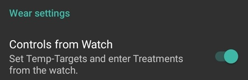

# AAPS на смарт-часах с Wear OS

You can install AAPS app on your **Wear OS based** smartwatch. Версия на часах позволяет:

* **display data on your watch**: by providing [custom watchfaces](Watchfaces-aaps-watchfaces) or in standard watchfaces with use of [complications](Watchfaces-complications)
* **контролировать AAPS на телефоне**: чтобы подать болюс, установить временную цель и т. д.

### Перед тем как купить часы...

* Некоторые * дополнения *, требуют Wear OS версии 2.0 или новее
* Google переименовал *Android Wear 1.x* в *Wear OS* начиная с версии 2.x, так что *Android Wear* может означать старую версию 1.x системы
* Если описание смарт-часов указывает только на совместимость с * Android * и * iOS *-то это не **означает**, что они работают в * Wear OS *, - это может быть другой тип ОС от производителя часов, ** который несовместим с wear AAPS! **
* Check [list of tested phones and watches](Phones-list-of-tested-phones) and [ask community](../Where-To-Go-For-Help/Connect-with-other-users.md) if in doubt if your watch will be supported

### Создание Wear-версии AAPS

The Wear OS App of AAPS has been seperated from the AAPS build for the Android mobile. Therefore you have to generate a second signed APK. Select as module "AndroidAPS.wear" and as build variant "fullRelease" and a second apk file for the Wear OS clock is generated when [building the APK](../Installing-AndroidAPS/Building-APK.md) (or "pumpcontrolRelease" which will allow you to just remote control the pump without looping).

С марта 2021 года требуется самостоятельно устанавливать AAPS на часы, программа больше не доступна через циферблаты на Google Play. Его можно установить через [Wear Installer](https://youtu.be/8HsfWPTFGQI), который устанавливается как на часы, так и на телефон. The Wear Installer app can be downloaded from the Google Play Store. The linked video from Malcolm Bryant the developer of Wear Installer gives you detailed instructions to a) download the apk to your mobile b) setup the Android Debugger on the wear c) use Wear Installer on mobile and wear to sideload the AAPS wear app to the mobile. Once you have selected AAPS as your app to upload wear version onto the watch you will be able to use watchfaces and complications and the AAPS controls.

### Настройка на телефоне

Within AAPS, in the ConfigBuilder you need to [enable Wear plugin](Config-Builder-wear).

## Контроль AAPS с часов

AAPS is designed to be *controlled* by Android Wear watches. Если вы хотите подавать болюс и т. д. с часов, тогда в настройках часов Wear следует включить «Управление с часов».

С часов можно запустить следующие функции:

* установить временные целевые значения СК
* use the bolus calculator (calculation variables can be defined in [settings](Config-Builder-wear) on the phone)
* расписать eCarbs
* подать болюс (инсулин + углеводы)
* настройки часов
* статус 
    * проверить состояние помпы
    * проверьте состояние замкнутого цикла
    * проверить и изменить профиль, CPP (Circadian Percentage Profile = time shift + percentage)
    * показать TDD (Общая суточная доза = болюс + базал в день)

(Watchfaces-aaps-watchfaces)=

## Циферблаты AAPS

There are several watchfaces to choose from that include average delta, IOB, currently active temp basal rate and basal profiles + CGM readings graph.

Ensure notifications from AAPS are not blocked on the watch. Confirmation of action (e.g. bolus, tempt target) comes via notification which you will need to swipe and tick.

To get faster to the AAPS menu, do a double tap on your BG. With a double tap onto the BG curve you can change the time scale..

## Доступные циферблаты

(Watchfaces-new-watchface-as-of-AAPS-2-8)=

### New watchface as of AAPS 2.8

* Цвет, линии и круг настраиваются через меню - шестеренку в меню выбора циферблата.

## Циферблат AAPSv2 - Legend

A - time since last loop run

B - CGM reading

C - minutes since last CGM reading

D - change compared to last CGM reading (in mmol or mg/dl)

E - average change CGM reading last 15 minutes

F - phone battery

G - basal rate (shown in U/h during standard rate and in % during TBR)

H - BGI (blood glucose interaction) -> the degree to which BG “should” be rising or falling based on insulin activity alone.

I - carbs (carbs on board | e-carbs in the future)

J - insulin on board (from bolus | from basal)

## Доступ к главному меню AAPS

To access main menu of AAPS you can use on of following options:

* дважды нажмите на значение ГК
* выбрать значок AAPS в меню приложения часов
* нажмите AAPS (если сконфигурировано в меню)

## Параметры (в часах Wear)

To access to the watchface settings, enter AAPS main menu, slide up and select "Settings".

Filled star is for enabled state (**On**), and hollow star icon indicates that setting is disabled (**Off**):

### Параметры спутника AAPS

* ** Вибрировать при болюсе ** (по умолчанию ` Вкл`):
* ** Единицы для принятия действий ** (по умолчанию ` мг/дл `): если ** Вкл** то на основе ` мг/дл `, если ** Выкл ** то на основе ` ммоль/л `. Используется при установке временной цели ТТ с часов.

(Watchfaces-watchface-settings)=

### Параметры циферблатов

* ** Показать дату ** (значение по умолчанию `Выкл `): примечание: дата доступна не на всех циферблатах
* ** Показывать активный инсулин IOB ** (значение по умолчанию ` Вкл`): (детализация задается в параметрах Wear в AAPS)
* ** Показать активные углеводы COB ** (по умолчанию ` Вкл `): Показывать или не показывать значение COB
* ** Показать дельту ** (по умолчанию ` Вкл `): Показывать или не показывать изменение ГК за последние 5 минут
* ** Показывать среднюю дельту ** (по умолчанию ` Вкл `): Показывать или не показывать среднее изменение ГК за последние 15 минут
* ** Показывать заряд батареи телефона ** (по умолчанию ` Вкл `): Батарея телефона в%. Красная, если ниже 30%.
* ** Показать батарею платформы ** (по умолчанию ` Выкл`): Батарея платформы - это интегральная величина заряда батареи телефона, помпы и трансмиттера (как правило, наименьшее из трех значений)
* ** Показать базальную скорость ** (по умолчанию ` Вкл `): показывать на экране или нет текущую скорость базала (в ед/ч или в%, если TBR)
* ** Показать состояние цикла ** (по умолчанию ` Вкл`): показывает время в мин после недавней работы цикла (стрелки вокруг значения покраснеют, если выше 15 ').
* **Показать ГК** (по умолчанию `Вкл`): показывать или не показывать последнее значение ГК
* **Показать стрелку тренда** (по умолчанию `Вкл`): показывать или не показывать стрелку тренда ГК
* ** Показать Истекшее время ** (по умолчанию ` Вкл `): показать, сколько минут прошло с момента последнего поступления данных.
* **Темный фон ** (по умолчанию `Вкл`): Можно переключиться с темного фона на светлый фон (за исключением циферблатов Cockpit и Steampunk)
* ** Выделять базал ** (по умолчанию ` Выкл `): Улучшить видимость скорости базала и временных базалов
* **Разделитель в цвет** (по умолчанию `Выкл`): для циферблатов AAPS, AAPSv2 и AAPS(Крупный), показывать контрастный фон разделителя (**Выкл.**) или разделитель совпадает с цветом фона (**Вкл.**)
* ** Охват времени графика ** (по умолчанию ` 3 часа `): в подменю можно выбрать максимальное время от 1 часа до 5 часов.

### Настройка интерфейса пользователя

* **Дизайн ввода**: этим параметром вы можете выбрать положение кнопок "+" и "-" при вводе команд для AAPS (TT, Insulin, Carbs...)

### Специфические параметры циферблатов

#### Циферблат Стимпанк

* **Зернистость** (по умолчанию `Средняя`)

#### Круглый циферблат

* ** Крупные цифры ** (по умолчанию ` Выкл.`): Увеличить размер текста для улучшения видимости
* ** Кольца хронологии ** (значение по умолчанию ` Выкл.`): Графическое представление хронологии ГК серыми кольцами в зеленом кольце часа
* ** Кольца хронологии неярко ** (значение по умолчанию ` Вкл.`): Графическое представление хронологии ГК более темными серыми кольцами в зеленом кольце часа
* ** Анимация ** (по умолчанию ` Вкл. `): Во включенном состоянии, при поддержке циферблатом и не в режиме энергосбережения, анимация циферблата

### Настройки команд

* ** Помощник в меню ** (по умолчанию ` Вкл. `): Разрешить интерфейс помощника в главном меню для ввода углеводов и подачи болюса с циферблата часов
* ** Первичное заполнение ** (по умолчанию ` Выкл. `): Разрешить действие Prime/Fill с часов
* ** Единичная цель ** (по умолчанию ` Вкл `):
    
    * ` Вкл. `: задается одно значение для временной цели TT
    * ` Выкл. `: задается низкое и высокое значение временной цели TT

* **Процент мастера** (по умолчанию `Выкл.`): разрешить коррекцию болюса с мастера (значение вводится в процентах до уведомления подтверждения)

(Watchfaces-complications)=

## Усложнения (дополнительные функции)

*Complication* is a term from traditional watchmaking, where it describes addition to the main watchface - as another small window or sub-dial (with date, day of the week, moon phase, etc.). Wear OS 2.0 brings that metaphor to allow custom data providers, like weather, notifications, fitness counters and more - to be added to any watchfaces that support complications.

AAPS Wear OS app supports complications since build `2.6`, and allow any third party watchface that supports complications to be configured to display AAPS related data (BG with the trend, IOB, COB, etc.).

Complications also serve as **shortcut** to AAPS functions. By tapping them you can open AAPS related menus and dialogs (depending on complication type and configuration).

### Типы усложнений (дополнительных функций)

AAPS Wear OS app provides only raw data, according to predefined formats. It is up to third-party watchface to decide where and how to render complications, including its layout, border, color, and font. From many Wear OS complication types available, AAPS uses:

* ` SHORT TEXT `-Содержит две строки текста, по 7 символов каждый, иногда именуется значением и меткой. Обычно отображаетя внутри круга или небольшой таблетки - один под другим, или сбоку друг от друга. Это очень ограниченное размерами усложнение. AAPS пытается удалить ненужные символы чтобы уместить информацию: округляет значения, удаляет начальные и хвостовые нули из значений и т. д.
* `ДЛИННЫЙ ТЕКСТ` - содержит две строки текста, около 20 знаков в каждой. Обычно выводится внутри прямоугольника или длинной таблетки-один ниже другого. Он используется для более детальной информации в виде текста.
* `ВРЕМЯ В ЦЕЛЕВОМ ДИАПАЗОНЕ`-используется для значений из предопределенного диапазона, например, в процентах. Он содержит иконку, ярлык и обычно отображается в виде круга с достигнутыми значениями.
* ` КРУПНОЕ ИЗОБРАЖЕНИЕ`-пользовательское фоновое изображение, которое можно использовать (при поддержке циферблатом) в качестве фона.

### Настройка усложнений (дополнительных функций)

To add complication to watchface, configure it by long press and clicking the gear icon below. Depending on how specific watchface configures them - either click on placeholders or enter the watchface setup menu for complications. AAPS complications are grouped under the AAPS menu entry.

When configuring complications on watchface, Wear OS will present and filter the list of complications that can be fit into selected complication place on watchface. If specific complications cannot be found on the list, it is probably due to its type that cannot be used for the given place.

### Усложнения, предоставляемые AAPS

AAPS provides following complications:

* ** BR, CoB & IoB ** (` КРАТКИЙ ТЕКСТ `, открывается через * Меню *): Отображает * Скорость базального инсулина* на первой строке, * Активные углеводы* и * Активный инсулин * на второй.
* ** Глюкоза крови ** (` КРАТКИЙ ТЕКСТ`, открывает * Меню *): Отображает * Кровь глюкозы * и * trend * стрелка на первой строке и * возраст измерений * и * дельта * на второй строке.
* **Акт Угл CoB & Акт инс IoB ** (` КРАТКИЙ ТЕКСТ `, открывается через * Меню *): Отображает * Активные углеводы COB * на первой строке и *Активный инсулин* на второй.
* **Акт Угл CoB Подробно ** (` КРАТКИЙ ТЕКСТ `, открывается через * Мастер *): Отображает актуальные * Активные углеводы COB * на первой строке и планируемые (e-Углеводы) на второй.
* ** Значок CoB ** (`КРАТКИЙ ТЕКСТ`, открывает * Wizard *): Отображает значение *Активные углеводы* со статичной иконкой.
* **Подробно** (` ПОЛНЫЙ ТЕКСТ `, открывает * Меню *): Содержит большую часть данных одновременно: * Глюкозу крови * и * тренд *, * дельту ГК* и * время от измерения * в первой строке. На второй строке * Активные углеводы *, *Активный инсулин * and * Базальную скорость *.
* ** Полный статус (перевернут) ** (`ДЛИННЫЙ ТЕКСТ `, открывается через * Меню *): те же данные, что и для стандартного * Полного состояние *, но текст перевернут. Может быть использован в циферблатах, которые игнорируют одну из двух строк `ДЛИННОГО ТЕКСТА`
* ** IOB Подробно ** (` КРАТКИЙ ТЕКСТ `, открывается через *Болюс*): Отображает суммарный * Активный инсулин IOB * на первой строке и разделение * IOB * на * Болюсный* и * Базальный* на второй.
* ** Значок IoB ** (`КРАТКИЙ ТЕКСТ`, открывается через * Болюс *): Отображает величину *Активных углеводов IOB* со статичной иконкой.
* ** Загрузчик/батарея телефона ** (`ДИАПАЗОН ВЕЛИЧИН `, открывает * Состояние *): Показывает процент батареи с телефона с AAPS (загрузчика). Выводится в виде процентной шкалы с значком батареи, отражающий сообщаемые значения. Он обновляется не в режиме реального времени, а наряду с изменением других важных данных AAPS (обычно: каждые ~ 5 минут с новым значением * гликемии *).

Additionally, there are three complications of `LARGE IMAGE` kind: **Dark Wallpaper**, **Gray Wallpaper** and **Light Wallpaper**, displaying static AAPS wallpaper.

### Параметры, связанные с усложнениями

* **Действия при шлепке по значку усложнений** (по умолчанию ` Default `): определяет, какой диалог открывается при нажатии на усложнение: 
    * * По умолчанию*: действия, связанные с типом усложнения * (см. список выше) *
    * * Меню *: главное меню AAPS
    * *мастер*: болюс мастер - калькулятор болюса
    * * Болюс *: прямой ввод величины болюса
    * * eCarb *: диалоговое окно конфигурации eCarb
    * * Состояние *: подменю состояния
    * * Отсутствует *: Отключает действие по шлепку для усложнений AAPS
* **Unicode в усложнениях** (по умолчанию - `Вкл`): в положении `Вкл`, будут использоваться символы Unicode для таких величин как `Δ` суммарное изменение `⁞` вертикальный точечный разделитель или `⎍` символ базальной скорости. Отрисовка их зависит от шрифта, который специфичен для каждого циферблата. Эта опция позволяет при необходимости отключать символы Unicode (` Выкл `)- если шрифт, используемый циферблатом, их не поддерживает-чтобы избежать ошибок графики.

## Wear OS Tiles

Wear OS Tiles provide easy access to users' information and actions to get things done. The tiles are only available on Android smartwatches running on Wear Os version 2.0 and higher.

Tiles allow you to quickly access actions on the AAPS application without going through the watch face menu. The tiles are optional and can be added and configured by the user.

The tiles are used "next to" any watch face. To access a tile, when enabled, swipe right to left on your watch face to show them.

Please note; that the tiles do not hold the actual state of the AAPS phone app and will only make a request, which has to be confirmed on the watch before it is applied.

## How to add Tiles

Before using the tiles, you have to switch on "Control from Watch" in the "Wear OS" settings of Android APS.

Depending on your Wear OS version, brand and smartphone there are two ways of enabling the tiles:

1. On your watch, from your watch face; 
    * Swipe right to left till you reach the "+ Add tiles" 
    * Select one of the tiles.
2. On your phone open the companion app for your watch. 
    * For Samsung open "Galaxy Wearable", or for other brands "Wear OS"
    * In the click on the section "Tiles", followed by "+ Add" button
    * Find the AAPS tile you like to add by selecting it.  The order of the tiles can be changed by dragging and dropping

The content of the tiles can be customized by long-pressing a tile and clicking the "Edit" or "gear icon" button.

### APS(Actions) Tile

The action tile can hold 1 to 4 user-defined action buttons. To configure, long-press the tile, which will show the configuration options. Similar actions are also available through the standard watch menu.

Actions supported in the Action tile can request the AAPS phone app for:

* **Calc**; do a bolus calculation, based on carb input and optional a percentage [1]
* **Insulin**; request insulin delivery by entering the unit of insulin
* **Treatment**; request both insulin delivery and add carbs
* **Carbs**; add (extended) carbs
* **TempT**; set a custom temporary target and duration

[1] Via, the Wear OS menu, set the "Calculator Percentage" option to "ON" to show the percentage input in the bolus calculator. The default percentage is based on the phone settings in the"Overview" section ["Deliver this part of the bolus wizard result %"](Config-Builder.html#advanced-settings) When the user does not provide a percentage, the default value from the phone is used. Configure the other parameters for the bolus calculator in the phone app via "Preferences" "Wizard Settings".

### AAPS(Temp Target) Tile

The Temp Target Tile can request a temporary target based on AAPS phone presets. Configure preset time and targets through the phone app setting by going to "Preferences", "Overview", ["Default Temp-Targets"](Config-Builder.html#default-temp-targets) and set the duration and targets for each preset. Configure the visible actions on the tile through the tile settings. Long press the tile to show the configuration options and select 1 to 4 options:

* **Activity**; for sport
* **Hypo**; to raise the target during hypo treatment
* **Eating soon**; to lower the target to raise the insulin on board
* **Manual**; set a custom temporary target and duration
* **Cancel**; to stop the current temporary target

### AAPS(QuickWizard)Tile

The QuickWizard tile can hold 1 to 4 quick wizard action buttons, defined with the phone app[2]. See [QuickWizard](Config-Builder.html#quickwizard-settings). You can set standard meals (carbs and calculation method for the bolus) to be displayed on the tile depending on the time of the day. Ideal for the most common meals/snacks you eat during the day. You can specify if the quick wizard buttons will show on the phone, watch, or both. Please note that the phone can show only one quick wizard button at a time. The quick wizard setup also can specify a custom percentage of the insulin for the bolus. The custom percentage enables you to vary, for example, snack at 120%, slow absorbing breakfast 80% and hypo treatment sugar snack at 0%

[2] Wear OS limits tiles update frequency to only once every 30 seconds. When you notice that the changes on your phone are not reflected on the tile, consider; waiting 30 seconds, using the "Resend all data" button from the Wear OS section of AAPS, or removing the tile and adding it again. To change the order of the QuickWizard buttons dragging an item up or down.

## Always on

Long battery life for Android Wear OS smartwatches is a challenge. Some smartwatches get as much as 30 hours before recharging. The display should be switched off for optimal power saving when not in use. Most watches support the “Always on” display.

Since AAPS version 3, we can use a “Simplify UI” during always-on-mode. This UI only contains the blood glucose, direction, and time. This UI is power-optimized with less frequent updates, showing less information and lightening fewer pixels to save power on OLED displays.

The simplified UI mode is available for the watch-faces: AAPS, AAPS V2, Home Big, Digital Style, Steampunk, and Cockpit. The simplified UI is optional and is configured through the watch face settings. (log press the watch face and click “edit” or the gear icon) Select the configuration “Simplify UI" and set it to “Always on” or “Always on and charging”.

### Night-time mode

While charging, it would be helpful if the display could stay “always-on” and show your blood glucose during the night. However, the standard watch-faces are too bright and have too much information, and the details are hard to read with sleepy eyes. Therefore, we added an option for the watch-face to simplify the UI only during charging when set in the configuration.

The simplified UI mode is available for the watch-faces: AAPS, AAPS V2, Home Big, Digital Style, Steampunk, and Cockpit. The simplified UI is optional and is configured through the watch face settings. (log press the watch face and click “edit” or the gear icon) Select the configuration “Simplify UI" and set it to “During charging” or “Always on and charging”

The Android developer options enable your watch to stay awake during charging. To make the developer options available, see the [official documentation](https://developer.android.com/training/wearables/get-started/debugging). Set the “Stay awake when charging” to “on” in the developer options”.

Note: not all displays can handle always-on very well. It can cause screen burn-in, especially on the older OLED displays. The watches will generally dim the display to prevent burn-in; please check your owner’s manual, the manufacturing, or the internet for advice.

## Snooze Alert shortcut

It is possible to create a shortcut to snooze the alerts/alarm of AAPS. Muting the sound via your watch is convenient and faster without reaching for your phone. Note; you still have to check your alarm message on your phone and handle it accordingly, but you can check that later. When your watch has two buttons, you can assign a key to the `AAPS Snooze Alert` program.

To link the button on the Samsung Watch 4 go to `Settings > Advanced Features > Customize Buttons > Double press > AAPS Snooze Alert`

### Snooze xDrip

When you use xDrip and have xDrip installed on the watch, the 'AAPS Snooze Alert' shortcut will also Snooze any xDrip alarm.

## Performance and battery life tips

Wear OS watches are very power-constrained devices. The size of the watch case limits the capacity of the included battery. Even with recent advancements both on hardware and software side, Wear OS watches still require daily charging.

If an experienced battery span is shorter than a day (from dusk to dawn), here are some tips to troubleshoot the issues.

Main battery-demanding areas are:

* Active display with a backlight on (for LED) or in full intensity mode (for OLED)
* Rendering on screen
* Radio communication over Bluetooth

Since we cannot compromise on communication (we need up-to-date data) and want to have the most recent data rendered, most of the optimizations can be done in *display time* area:

* Stock watchfaces are usually better optimized than custom one, downloaded from the store.
* It is better to use watchfaces that limit the amount of rendered data in inactive / dimmed mode.
* Be aware when mixing other Complications, like third party weather widgets, or other - utilizing data from external sources.
* Start with simpler watchfaces. Add one complication at the time and observe how they affect battery life.
* Try to use **Dark** theme for AAPS watchfaces, and [**Matching divider**](Watchfaces-watchface-settings). On OLED devices it will limit the amount of pixels lit and limit burnout.
* Check what performs better on your watch: AAPS stock watchfaces or other watchfaces with AAPS Complications.
* Observe over a few days, with different activity profiles. Most watches activate the display on glancing, movement and other usage-related triggers.
* Check your global system settings that affect performance: notifications, backlight/active display timeout, when GPS is activated.
* Check [list of tested phones and watches](Phones-list-of-tested-phones) and [ask community](../Where-To-Go-For-Help/Connect-with-other-users.md) for other users experiences and reported battery lifetime.
* **We cannot guarantee that data displayed on watchface or complication is up-to-date**. In the end, it is up to Wear OS to decide when to update a watchface or a complication. Even when the AAPS app requests update, the System may decide to postpone or ignore updates to conserve battery. When in doubt and low on battery on watch - always double-check with main AAPS app on phone.

(Watchfaces-troubleshooting-the-wear-app)=

## Troubleshooting the wear app:

* Sometimes it helps to re-sync the apps to the watch as it can be a bit slow to do so itself: Android Wear > Cog icon > Watch name > Resync apps.
* Enable ADB debugging in Developer Options (on watch), connect the watch via USB and start the Wear app once in Android Studio.
* If Complications does not update data - check first if AAPS watchfaces work at all.

### Sony Smartwatch 3

* The Sony Smartwach 3 is one of the most popular watches to be used with AAPS.
* К сожалению, осенью 2020 года Google прекратил поддержку устройств с операционной системой OS 1.5. This leads to problems when using Sony SW3 with AAPS 2.7 and above.
* A possible workaround can be found on this [troubleshooting page](../Usage/SonySW3.md).

## View Nightscout data

If you are using another looping system and want to *view* your looping detail on an Android Wear watch, or want to watch your child's looping, then you can build/download just the NSClient APK. To do this follow the [build APK instructions](../Installing-AndroidAPS/Building-APK.md) selecting the build variant "NSClientRelease". There are several watchfaces to choose from that include average delta, IOB, currently active temp basal rate and basal profiles + CGM readings graph.

# Смарт-часы Pebble

Pebble users can use the [Urchin watchface](https://github.com/mddub/urchin-cgm) to *view* looping data (if uploaded to Nightscout), but you will not be able to interact with AAPS through the watch. You can choose fields to display such as IOB and currently active temp basal rate and predictions. If open looping you can use [IFTTT](https://ifttt.com/) to create an applet that says if Notification received from AAPS then send either SMS or pushover notification.