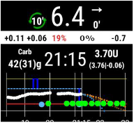

# Циферблаты смарт-часов

AndroidAPS предусматривает возможность *управления* часами Android Wear. Если вы хотите иметь возможность давать болюс с часов, тогда в настройках часов Wear следует включить «Управление с часов».

Следующие функции могут быть запущены с часов:

* установить временные целевые значения СК
* подать болюс
* расписать eCarbs
* использовать калькулятор болюса (переменные могут быть определены в [настройках](../Configuration/Config-Builder#wear) на телефоне)
* проверить работу алгоритма цикла и помпы
* показать TDD (Общая суточная доза = болюс + базал в день)

Для этого необходимо выбрать вариант сборки "fullRelease" при [построении приложения APK](../Installing-AndroidAPS/Building-APK.md) (или "pumpRelease", который позволяет просто дистанционно управлять помпой без активации цикла). В конфигураторе AndroidAPS при этом нужно [активировать Wear](../Configuration/Config-Builder#wear).

Есть несколько часовых циферблатов на выбор, в которых показывается средняя дельта СК, активный инсулин IOB, действующий временный базал и профили базы и график мониторинга.

Убедитесь, что уведомления от AndroidAPS не заблокированы на часах. Подтверждение действия (например, болюс, временные цели) происходит через уведомления, которые нужно сдвинуть в сторону и нажать на галочку.

Чтобы быстрее попасть в меню AAPS, сделайте двойное нажатие на ГК. При двойном нажатии на кривую ГК можно изменить масштаб времени..

## Устранение неполадок в приложении Wear:

* На Android Wear 2.0 экран часов больше не устанавливается сам собой. Вам нужно зайти в playstore - циферблаты для часов (не путать с Play Market для телефона), и найти его в категории приложений установленных на вашем телефоне, откуда вы можете его активировать. Также включите автообновление. 
* Иногда помогает повторная синхронизация приложений с часами, поскольку этот процесс иногда затягивается: Android Wear > значок шестеренки > наименование часов > повторная синхронизация часов.
* Включите отладку ADB в настройках разработчика (на часах), подключите часы через USB к компьютеру и запустите приложение Wear в Android Studio.

## Циферблат Легенда AndroidAPSv2

О - время с запуска последнего цикла

B - данные ГК мониторинга

C - минуты с последнего получения данных ГК

D - изменение по сравнению с последним полученным значением ГК (в mmol или mg/dl)

E - среднее изменение данных ГК за последние 15 минут

F - состояние аккумулятора телефона

G - скорость подачи базала (в ед/ч во время стандартной подачи и в % при временном базале TBR)

H - BGI (взаимодействие с глюкозой крови) -> Степень, с которой ГК “должна” расти или падать, основываясь только на активности инсулина (без учета других факторов).

I - углеводы (активные углеводы | e-carb в будущем)

J - активный инсулин (от болюсов | от базала)

## Настройки

Существуют различные настройки смарт-часов для AndroidAPS:

* Вибрация на болюс (вкл | выкл)
* Единицы для действий (мг/дл | ммоль/л)
* Показать дату (вкл. | выключить)
* Показывать активный инсулин IOB (вкл. | выключить)
* Показать активные углеводы COB (вкл| выкл)
* Показывать дельту изменений (вкл | выкл)
* Показывать среднюю дельту изменений (вкл | выкл)
* Показывать батарею телефона (вкл | выкл.)
* Показывать батарею главного устройства (вкл | выкл.)
* Показывать базальную скорость (вкл | выкл)
* Показать закольцованность (вкл | выкл)
* Показать ГК (вкл | выкл)
* Показать стрелку тенденции (вкл | выкл)
* Показать давность (вкл | выкл)
* Темный фон (вкл | выкл)
* Выделить базал (вкл | выкл)
* Временной диапазон графика (1 | 2 | 3 | 4 | 5 часов)
* Эскиз ввода (по умолчанию | быстрый для правшей | быстрый для левшей | современный разреженный)
* Зернистость (для циферблата Steampunk) (Низкая | Средняя | Высокая)
* Большие цифры (вкл | выкл)
* Хронология кольца (вкл | выкл)
* Краткая хронология кольца (вкл | выкл)
* Анимация (вкл | выкл)
* Мастер настроек в меню (вкл | выкл)
* Заполнение инфузионного набора в меню (вкл | выкл)
* Одиночная цель (вкл | выкл)
* Процент мастера (вкл | выкл)

## Просмотр данных Nightscout

Если вы используете другую систему цикла (не AAPS) и хотите *просмотреть* детали работы контура на часах Android Wear, или хотите посмотреть работу контура вашего ребенка, то можете построить/загрузить только NSClient APK. Для этого перейдите по ссылке [инструкции по созданию APK ](../Installing-AndroidAPS/Building-APK.md) выбрав вариант сборки "NSClientRelease". Есть несколько часовых циферблатов на выбор, в которых показывается средняя дельта СК, активный инсулин IOB, действующий временный базал и профили базы и график мониторинга.

## Смарт-часы Pebble

Пользователи Pebble могут пользоваться [циферблатом Urchin](https://github.com/mddub/urchin-cgm) для *просмотра* данных цикла (если они загружаются на сайт Nightscout), но не смогут взаимодействовать с AndroidAPS через часы. Вы можете выбрать поля для отображения, такие как активный инсулин IOB, активный врем. базал и прогнозы. Если вы работаете с открытым циклом, вы можете пользоваться алгоритмом [IFTTT](https://ifttt.com/) для создания апплета, который, получив уведомление от AndroidAPS, отправляет SMS или создает push-уведомление.