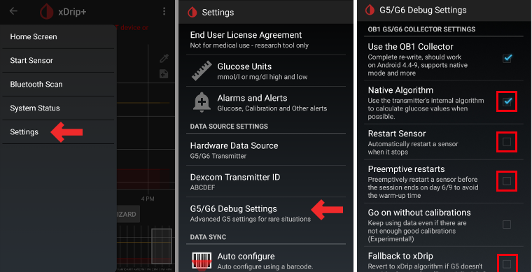

# Настройки xDrip+

Если это еще не сделано, скачайте [xDrip+](https://jamorham.github.io/#xdrip-plus).

** Эта документация относится только к xDrip + для Android. ** Существует приложение "xDrip for iOS", которое не имеет ничего общего с исходным xDrip + для Android.

Для трансмиттеров G6, изготовленных после осени/конца 2018 года (серийный номер которых начинается с 80 или 81) пользуйтесь версией [ master ](https://jamorham.github.io/#xdrip-plus).

Если серийный номер трансмиттера Dexcom G6 начинается с 8G..., 8Н... или 8J... используйте одну из новейших [ночных сборок](https://github.com/NightscoutFoundation/xDrip/releases).

Если в вашем телефоне работает Android 10 и у вас возникли трудности с xDrip + master попробуйте [ nightly build 2019/12/31 или новее ](https://github.com/NightscoutFoundation/xDrip/releases).

## Основные настройки для всех систем мониторинга

* Правильно вводите адрес локатора вашего сайта (URL) включая **S** в конце http**s**:// (не http://)
   
   напр. https://API_SECRET@imyavashegosaita.herokuapp.com/api/v1/
   
   -> Сэндвич-меню (левый верхний угол домашнего экрана) -> Настройки-> Загрузка в облако-> Синхронизация с Nightscout (REST-API) -> Базовый URL

* Отключите `Автоматическую Калибровку` Если отмечено поле `Автоматическая Калибровка`, одноразово активируйте `Данные загрузки`, а затем удалите флажок для `Автоматической Калибровки` и снова отключите `Скачать данные`, иначе ваши назначения (инсулин & углеводы) будут дважды добавлены в Nightscout.

* Нажмите на `Дополнительные опции`

* Отключите `Загружать назначения` и `Восполнять пропущенные данные`.
   
   **Предупреждение безопасности: Следует деактивировать "Загружать лечение/назначения" с xDrip, иначе в AAPS эти величины удвоятся, что приведет к неверному количеству активных углеводов COB и активного инсулина IOB.**

* Опция `Оповещение о сбоях` также должна быть отключена. Иначе вы будете получать сигнал каждые 5 минут если wifi/мобильная сеть слабые или сервер недоступен.
   
   
   
   

* **Взаимодействие с приложениями (Inter-app settings)** (Трансляция) Для пользования AndroidAPS данные должны перенаправляться; вам следует активировать трансляцию xDrip+ в настройках Inter-App.

* Для того чтобы не было расхождений между приложениями, необходимо активировать `Отправлять отображаемое значение ГК`.

* Если вы также активировали `Принимать назначения (Accept treatments)` и трансляцию в AndroidAPS, то xDrip+ получит информацию об инсулине, углеводах и базальной скорости от AndroidAPS и сможет прогнозировать гипогликемию и т. д. более точно.
   
   

### Идентификатор ресивера

* Если вы обнаружили проблемы с локальной трансляцией (AAPS не получает значения ГК из xDrip +), перейдите в Параметры > Взаимодействие приложений > Идентификация получателя и введите ` info.nightscout.androidaps `.
* Внимание: Автокоррекция, как правило, меняет i на прописную букву. **Необходимо использовать только строчные буквы ** при вводе ` info.nightscout.androidaps `. Прописная I не позволит AAPS получать данные ГК из xDrip+.
   
   

## xDrip+ & Dexcom G6

* Трансмиттер Dexcom G6 может одновременно подключаться к ресиверу Dexcom (или к помпе T:slim) и одному приложению на вашем телефоне.
* При использовании xDrip+ в качестве приемника сначала удалите приложение Dexcom. **Невозможно одновременно подключить к трансмиттеру приложения xDrip+ и Dexcom!**
* Если вам нужен функционал оригинального приложения Clarity и оповещения от xDrip +, пользуйтесь [модифицированным приложением Dexcom ](../Hardware/DexcomG6#if-using-g6-with-patched-dexcom-app) с локальной передачей данных в xDrip +.

### Версия xDrip+ в зависимости от серии трансмиттера G6.

* Для передатчиков G6, изготовленных после осени/конца 2018 года (серийный номер которых начинается с 80 или 81) пользуйтесь версией [ master ](https://jamorham.github.io/#xdrip-plus). 
* Если серийный номер трансмиттера Dexcom G6 начинается с 8G и 8Н попробуйте [ночные сборки от 2019/07/28 или позднее](https://github.com/NightscoutFoundation/xDrip/releases).

### Настройки для работы с Dexcom

* Откройте настройки отладки G5/G6 -> Сэндвич-Меню (сверху слева на домашнем экране) -> Настройки -> Настройки отладки G5/G6 

* Активируйте следующие параметры
   
   * `Использовать коллектор OB1`
   * `Нативный Алгоритм` (важно, если вы хотите использовать супер микроболюс SMB)
   * `Поддержка G6`
   * `Разрешить разъединение OB1`
   * `Разрешить OB1 инициировать сопряжение`
* Все другие опции должны быть отключены
* Настройте уровень предупреждения о низком заряде батареи на 280 (внизу настроек отладки G5/G6)
   
   

### Упреждающие перезапуски не рекомендуются

**В трансмиттерах Dexcom чей серийный номер начинается с 8G, 8H, или 8J упреждающие перезапуски не работают и могут полностью убить сенсор!**

Автоматическое продление работы сенсоров Dexcom (`упреждающие перезапуски, preemtive restarts`) не рекомендуется, так как может привести к скачкам значений ГК на 9 день после перезапуска.

Применение G6 немного сложнее, чем казалось раньше. Для правильного применения необходимо иметь в виду следующие моменты:

* Если вы используете нативные данные с кодом калибровки в xDrip или Spike, в целях безопасности не следует разрешать упреждающий (preemptive) перезапуск датчика.
* Если все же упреждающие перезапуски необходимы, то убедитесь, что вы делаете это в то время, когда можете следить за изменениями и калибровать при потребности. 
* Если вы перезапускаете сенсор, делайте это либо без заводской калибровки для безопасных результатов в дни 11 и 12, либо будьте готовы калибровать и следить за изменениями.
* "Предварительное погружение" (установка сенсора намного раньше его старта в приложении) G6 с заводской калибровкой приведет к отклонениям в данных. Если вы все же делаете "предварительное погружение", то для получения лучших результатов вам, вероятно, придется калибровать сенсор.
* Если вы не планируете отслеживать все возможные изменения, то лучше вернуться к традиционному режиму калибровки и использовать систему, как G5.

Подробнее о деталях и причинах этих рекомендаций читайте [полную статью](http://www.diabettech.com/artificial-pancreas/diy-looping-and-cgm/) опубликованную в Tim Street на [www.diabettech.com](http://www.diabettech.com).

### Первое подключение трансмиттера G6

**Для второго и следующего трансмиттера смотрите [Продление срока работы трансмиттера](../Configuration/xdrip#extend-transmitter-life) ниже.**

Для передатчиков G6, изготовленных после осени/конца 2018 года (серийный номер которых начинается с 80 или 81) пользуйтесь версией [ master ](https://jamorham.github.io/#xdrip-plus).

Если серийный номер трансмиттера Dexcom G6 начинается с 8G, 8Н bkb 8J попробуйте [ночные сборки от 2019/07/28 или позднее](https://github.com/NightscoutFoundation/xDrip/releases).

* Выключите оригинальный ресивер Dexcom (если используете).
* Удерживайте на главном экране xDrip+ иконку капли крови для активации кнопки `Мастер выбора источника ГК`.
* Использование Мастера выбора источника ГК обеспечивает настройки по умолчанию, включая OB1 & нативный режим 
   * Мастер позволит провести начальную настройку.
   * Вам понадобится серийный номер трансмиттера, если вы пользуетесь им впервые.

* Введите серийный номер нового трансмиттера (на упаковке трансмиттера или на его обратной стороне). Be careful not to confuse `0` (zero) and `O` (capital letter o).
   
   

* Вставьте новый сенсор (только при замене)

* Поместите трансмиттер в платформу сенсора
* If a message pops up asking to pair with "DexcomXX", where "XX" is the last two characters of the transmitter's serial no., accept it (tap "pair")
* Do not start new sensor before the following information is shown in Classic Status Page -> G5/G6 status -> PhoneServiceState:
   
   * С трансмиттерами, серийный номер которых начинается с 80 или 81: "Got data hh:mm" (напр. "Got data 19:04 ")
   * Transmitter serial starting with 8G, 8H or 8J: "Got glucose hh:mm" (i.e. "Got glucose 19:04") or "Got no raw hh:mm" (i.e. "Got no raw 19:04")
   
   

* Start sensor (only if replacing)
   
   -> Near the bottom of the screen `Warm Up x,x hours left` must be displayed after a few minutes.

-> Если серийный номер трансмиттера не начинается с 8G, 8H или 8J и в течение нескольких минут не появляется никаких указаний о времени прогрева сенсора, остановите и перезапустите сенсор.

* Перезапустите коллектор (состояние системы - если не заменяете сенсор}
* Не включайте оригинальный ресивер Dexcom (если им пользуетесь) до появления первых данных в xDrip+.
* Удерживайте на главном экране xDrip+ иконку капли крови для активации кнопки `Мастер выбора источника ГК`.
   
   
   
   
   
   
   
   

### Состояние батареи трансмиттера

* Статус батареи может быть виден в окне состояния системы (сэндвич-меню вверху слева на главном экране)
* Сделайте свайп влево, чтобы увидеть второй экран. 

* Точные величины, когда наступает "смерть" трансмиттера из-за низкого заряда батареи, неизвестны. Следующая информация была размещена в сети после того, как передатчик "умер":
   
   * Пост 1: Дни передатчика: 151/Напряжение А: 297/Напряжение В: 260/Сопротивление: 2391
   * Пост 2: передатчик дней: 249 / напряжение: 275 (на момент отказа)

### Увеличение срока работы трансмиттера

* Пока что не найдено способа продлить жизнь трансмиттеров, чей серийный номер начинается с 8G, 8H или 8J. То же относится и к трансмиттерам с серийным номером начинающимся с 81 и прошивкой 1.6.5. ** 27 ** (см. xDrip + - Состояние системы-G5/G6, как показано на [ снимке экрана выше ](../Configuration/xdrip#transmitter-battery-status)).
* Для предотвращения трудностей при запуске сенсоров настоятельно рекомендуется продлить срок действия трансмиттера до 100-го дня первого использования.
* -> Если серийный номер трансмиттера начинается с 81 с прошивкой 1.6.5. ** 27 ** переход за день 100 возможен только в том случае, если включен 'инженерный режим' и деактивирован 'нативный режим' (сэндвич-меню -> параметры-> Параметры отладки G5/G6-> нативный алгоритм), так как жесткий сброс трансмиттера невозможен.
* При продлении срока действия трансмиттера работа сенсора будет остановлена. Поэтому проводить эту манипуляцию следует перед заменой сенсора или быть готовыми к тому, что состоится двухчасовая фаза его прогрева.
* Остановите сенсор вручную через сэндвич-меню.
* Переключитесь в `инженерный режим`: 
   * нажмите на пиктограмму шприца на главном экране xDrip+ справа
   * затем нажмите на значок микрофона в нижнем правом углу
   * В открывшемся текстовом окне впечатайте "включить инженерный режим" 
   * нажмите "Готово"
   * Если включен Google Speak, вы можете дать голосовую команду: "enable engineering mode" ("включить инженерный режим"). 
* Зайти в настройки отладки G5 и убедитесь что `использовать OB1 коллектор` включен.
* Дайте голосовую команду: “hard reset transmitter”(«жесткий сброс трансмиттера»)
* Голосовая команда будет выполнена при следующем получении данных трансмиттера
* Посмотрите на статус системы (сэндвич-меню -> системный статус) и убедитесь в результате
* Через примерно 10 мин. вы можете переключиться на классический статус страницы (свайпом вправо) и нажать кнопку 'Restart collector". Это позволит обнулить счетчик дней без необходимости запуска нового сенсора.
* Если на втором экране состояния системы вы видите сообщение "Состояние телефона: жесткий сброс возможно не произошел", просто перезапустите сенсор и это сообщение должно исчезнуть.
   
   

* Срок работы трансмиттера будет сброшен до 0 в случае успеха.

### Замена трансмиттера

Для передатчиков G6, изготовленных после осени/конца 2018 года (серийный номер которых начинается с 80 или 81) пользуйтесь версией [ master ](https://jamorham.github.io/#xdrip-plus).

Если серийный номер трансмиттера Dexcom G6 начинается с 8G, 8H или 8J, пользуйтесь одной из [новых ночных сборок](https://github.com/NightscoutFoundation/xDrip/releases).

* Выключите оригинальный ресивер Dexcom (если используете).
* Остановить сенсор (только при смене сенсора)
   
   Убедитесь, что он действительно остановлен:
   
   На следующем экране "G5/G6 Status" найдите `Queue Items` (`Элементы в очереди`) на полпути вниз - там появится что-то вроде "Остановить Сенсор"
   
   Подождите, пока это происходит - обычно в течение нескольких минут. Состояние сенсора должно быть "Остановлен" (см. снимок экрана).
   
   -> Как удалить трансмиттер без остановки сенсора, см. видео <https://youtu.be/AAhBVsc6NZo>.
   
   
   
   

* Забудьте устройство в системном состоянии XDrip и в настройках BT смартфона (показывается как Dexcom?? где ?? последние две цифры серийного № трансмиттера
   
   

* Удалите трансмиттер (и сенсор при замене)

* Поместите старый трансмиттер подальше, чтобы предотвратить повторное соединение. Микроволновая печь является идеальным щитом Фарадея для этого - но отключите кабель питания, чтобы быть на 100% уверенным, что никто ее не включит.
* Удерживайте на главном экране xDrip+ иконку капли крови для активации кнопки `Мастер выбора источника ГК`.
* Использование Мастера выбора источника ГК обеспечивает настройки по умолчанию, включая OB1 & нативный режим 
   * Мастер позволит провести начальную настройку.
   * Вам понадобится серийный номер трансмиттера, если вы пользуетесь им впервые.
* Введите серийный номер нового трансмиттера. Будьте внимательны и не перепутайте 0 (ноль) и O (заглавная буква o).
* Вставьте новый сенсор (только при замене).
* Поместите трансмиттер на сенсор - ** не запускайте сенсор немедленно!**
* Новые "Трансмиттеры Firefly" (серийный номер начинающиеся с 8G, 8H или 8J) можно использовать только в нативном режиме.
* Следующие опции не должны быть активированы для новых трансмиттеров "Firefly" (серийный номер которых начинается с 8G, 8H или 8J):
   
   * Упреждающий перезапуск (отключить!)
   * Перезапуск сенсора (отключить!)
   * Возврат к xDrip (отключить!)
   
   

* Проверьте в классическом состоянии страницу Состояние-> Состояние G5/G6-> PhoneServiceState, показано ли одно из следующих сведений:
   
   * С трансмиттерами, серийный номер которых начинается с 80 или 81: "Got data hh:mm" (напр. "Got data 19:04 ")
   * С трансмиттерами, серийный номер которых начинается с 8G, 8H или 8J: "Got glucose hh:mm" (напр. "Got glucose 19:04 ") или "Got no raw hh:mm" (i.e. "Got no raw 19:04")
   
   

* Подождите 15 минут, так как трансмиттер должен соединиться несколько раз с xDrip до запуска нового сенсора. Данные батареи будут показаны ниже информации о прошивке.
   
   

* Выполните пуск сенсора но НЕ ЗАДНИМ ЧИСЛОМ! Всегда выбираем "Да, сегодня"!

* Перезапустите коллектор (состояние системы - если не заменяете сенсор)
* Не включайте оригинальный ресивер Dexcom (если им пользуетесь) до появления первых данных в xDrip+.
* Удерживайте на главном экране xDrip+ иконку капли крови для активации кнопки `Мастер выбора источника ГК`.
   
   
   
   
   
   
   
   

### Новый сенсор

* Выключите оригинальный ресивер Dexcom (если используете).
* При необходимости остановите сенсор
   
   Убедитесь, что он действительно остановлен:
   
   На следующем экране "G5/G6 Status" найдите `Queue Items` (`Элементы в очереди`) на полпути вниз - там появится что-то вроде "Остановить Сенсор"
   
   Подождите, пока не исчезнет - обычно в течение нескольких минут.
   
   
   
   

* Протрите контакты (обратная сторона трансмиттера) спиртом и просушите.

* Если вы пользуетесь этой функцией, отключите `Restart Sensor` и `Preemptive restarts` (Сэндвич-меню -> Настройки -> Отладка G5/G6). Если вы пропустите этот шаг и оставите эти функции включенными, новый датчик не будет корректно запущен.
   
   

* Запустите сенсор
   
   ** Для новых трансмиттеров Firefly ** (серийный номер начинается с 8G, 8H или 8J) ** это обязательно, для всех остальных трансмиттеров рекомендуется ждать около 15 минут между остановкой и запуском нового сенсора (до тех пор пока ` Sensor Status: Stopped ` не появится на втором экране состояния системы). НЕ НАСТРАИВАЙТЕ ЗАДНИМ ЧИСЛОМ!**

* Введите время установки
   
   * Для использования нативного режима G6 необходимо подождать 2 часа для прогрева (т.е. время установки -- сейчас).
   * Если вы используете алгоритм xDrip+, то можно установить время более 2 часов назад, чтобы избежать прогрева. Данные могут быть очень неточными. Поэтому это не рекомендуется.
* Введите код сенсора (на снимаемой фольге сенсора) 
   * Сохраните код на случай дополнительной переустановки (новый запуск после удаления трансмиттера)
   * Код также можно найти в логах [xDrip+ ](../Configuration/xdrip#retrieve-sensor-code): Нажмите 3-точечное меню на главном экране xDrip+ и выберите `Просмотр журналов событий`.
* При использовании G6 в "нативном режиме" калибровка не требуется. xDrip+ будет показывать данные автоматически после двухчасового прогрева.
* Не включайте оригинальный ресивер Dexcom (если им пользуетесь) до появления первых данных в xDrip+.
   
   
   
   

### Получение кода сенсора

* В свежих версиях программы (начиная с 18 мая 2019) код сенсора отображается в состоянии системы (сэндвич-меню вверху слева на главном экране).
* Сделайте свайп влево, чтобы увидеть второй экран.
   
   

* Код сенсора Dexcom можно также найти в логах xDrip+.

* Нажмите 3 точки меню (сверху справа на главном экране)
* Выберите `Просмотр журналов событий` и выполните поиск слова "code"
   
   

## Устранение неполадок Dexcom G6 и xDrip+

### Проблемы сопряжения с трансмиттером

* Трансмиттер должен быть виден в настройках bluetooth вашего смартфона.
* Трансмиттер будет виден как Dexcom?? где ?? последние две цифры серийного № трансмиттера (например, DexcomHY).
* Откройте состояние системы в xDrip+ (сэндвич-меню в левой верхней части главного экрана).
* Проверьте, виден ли трансмиттер на первой странице состояния системы ('классическая страничка состояния системы').
* Если нет: Удалите устройство из настроек bluetooth вашего смартфона.
* Подождите около 5 мин. до тех пор, пока трансмиттер Dexcom не подключится автоматически.

### Проблемы при запуске нового сенсора

Обратите внимание, что следующий метод, скорее всего, не работает, если серийный номер передатчика Dexcom G6 которых начинается с 8G, 8H или 8J.

* Запуск сенсора сопровождается сообщением: "ОШИБКА: Сенсор не удалось запустить"
* Остановить сенсор
* Перезапустить телефон
* Запустить сенсор введя код 0000 (четыре нуля)
* Подождать 15 минут
* Остановить сенсор
* Запустить датчик с "реальным" кодом (напечатан на клеящемся протекторе)

Проверьте журнал xDrip+, начат ли в xDrip+ отсчет "Duration: 1 минута" (и так далее). Только в логах xdrip+ вы можете обнаружить на раннем этапе, остановлен ли сенсор. Более поздний статус статус не всегда отображается правильно внизу начального экрана.

## xDrip+ & Libre Freestyle

### Специфические настройки Libre

* Откройте настройки Bluetooth -> Сэндвич-меню (сверху слева на главном экране) -> Настройки -> прокрутить вниз -> Менее распространенные настройки -> Настройки Bluetooth
   
   

* Активируйте следующие параметры
   
   * `Включить Bluetooth` 
   * `Использовать сканирование`
   * `Всегда обнаруживать сервисы`

* Все другие опции должны быть отключены
   
   

### Подключите трансмиттер Libre и запустите сенсор

