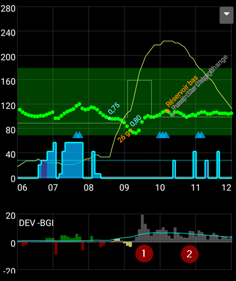

# Что мы видим на экранах AAPS

```{contents}
:backlinks: entry
:depth: 2
```

## The Homescreen


This is the first screen you will come across when you open **AAPS**, and it contains most of the information that you will need day to day.

### Section A - Tabs

* Navigate between the various **AAPS** modules.
* Alternatively you can change screens by swiping left or right.
* Displayed tabs can be selected in [config builder](#Config-Builder-tab-or-hamburger-menu).

### Section B - Profile & target

#### Current Profile

The current profile is displayed in the left bar.

Short press profile bar to view profile details. Long press profile bar to [switch between different profiles](../DailyLifeWithAaps/ProfileSwitch-ProfilePercentage.md).


1. Regular display with a standard profile activation.
2. Profile switch with a remaining duration of 59mn.
3. Profile switch with a specific percentage of 120%.
4. Profile switch with a specific percentage of 80% and a remaining duration of 59 mn.
5. Profile switch with a time shift of -1 hour.
6. Profile switch with a specific percentage of 120%, time shift of 1 hour, and a remaining duration of 59mn.

#### Target


Current target blood glucose level is displayed in the right bar.

Short press target bar to set a **[Temporary Target](../DailyLifeWithAaps/TempTargets.md)**.

If a temp target is set, the bar turns yellow and the remaining time in minutes is shown in brackets.

(AapsScreens-visualization-of-dynamic-target-adjustment)=

#### Visualization of Dynamic target adjustment


When using the [SMB algorithm](#Config-Builder-aps) and [Autosens](#Open-APS-features-autosens) functionality, **AAPS** can dynamically adjust your target based on sensitivity.

Enable either one or both of the following options in [Preferences > OpenAPS SMB settings](#Preferences-openaps-smb-settings):

* "sensitivity raises target" and/or 
* "resistance lowers target" 

If **AAPS** detects resistance or sensitivity, the target will change from what is set from profile. When it alters the target glucose, the background will change to green.

(AapsScreens-section-c-bg-loop-status)=

### Section C - BG & loop status

#### Current blood glucose

The latest blood glucose reading from your CGM is shown on the left side.

The color of the BG value reflects the status to the defined [range](#Preferences-range-for-visualization).

* green = in range
* red = below range
* yellow = above range 

The greyish block in the middle shows minutes since last reading and changes since last reading, in the last 15 and 40 minutes.

(AapsScreens-loop-status)=

#### Loop status


On the right side, an icon shows the loop status:

1. Green circle = loop running
2. Green circle with dotted line = [low glucose suspend (LGS)](#objectives-objective6)
3. Red circled = loop disabled (not working permanently)
4. Yellow circle = loop suspended (temporarily paused but basal insulin will be given) - remaining time is shown below icon
5. Grey circle = pump disconnected (temporarily no insulin dosage at all) - remaining time is shown below icon
6. Orange circle = super bolus running - remaining time is shown below icon
7. Blue circle with dotted line = open loop

Short press or Long press the icon to open the Loop dialog to switch loop mode (Close, Low Glucose Suspend, Open or Disable), suspend / re-enable loop or disconnect / reconnect pump.

* If short press on Loop icon, a validation is required after selection in Loop Dialog
    
    

(aaps-screens-bg-warning-sign)=

#### BG warning sign

If for any reason, there are issues in the BG readings **AAPS** receives, you will get a warning signal beneath your BG number on the main screen.

##### Red warning sign: Duplicate BG data

The red warning sign is signaling you to get active immediately: You are receiving **duplicate BG data**, which does avoid the loop to do its work right. Therefore, your loop will be disabled until it is resolved.

    {admonition} Your loop is not running
    :class: note
    Your loop is not running until you solve this issue !


Следует выяснить, почему данные ГК дублируются:

* Is Dexcom bridge enabled on your Nightscout site? Disable the bridge by going to the administration panel of your Nightscout instance, edit the "enable" variable and remove the "bridge" part there. (Для Heroku [подробности можно найти здесь](https://nightscout.github.io/troubleshoot/troublehoot/#heroku-settings).)
* Do multiple sources upload your BG to Nightscout? If you use the BYODA app, enable the upload in **AAPS** but do not enable it in xDrip+, if you use that.
* Do you have any followers that might receive your BG but do also upload it again to your Nightscout site?
* Last resort: In **AAPS**, go to [Preferences > NSClient](#Preferences-nsclient), select the sync settings and disable the "Accept CGM data from NS" option.

To remove the warning immediately and get to loop running again, you need to manually delete a couple of entries from the Dexcom/xDrip+ tab.

Однако если задублированных данных много, может быть проще сделать следующее:

* [backup your settings](../Maintenance/ExportImportSettings.md),
* сбросить базу данных в меню обслуживания и
* [import your settings](../Maintenance/ExportImportSettings.md) again

##### Желтый восклицательный знак

The yellow warning signal is indicating that your BG arrived in irregular time intervals or that some BGs are missing. When pressing the sign, the message indicates “Recalculated data used”.


Обычно предпринимать никаких действий не требуется. Замкнутый цикл продолжит работать!

As a sensor change is interrupting the constant flow of BG data, a yellow warning sign after sensor change is normal and nothing to worry about.

Special note for Libre users:

* Каждый сенсор libre пропускает данные раз или два в несколько часов, а это означает, что идеального потока значений ГК не получится.
* Also, jumpy readings interrupt the continuous flow.
* Therefore, the yellow warning sign will be 'always on' for Libre users.

*Note*: Up to 30h hours are taken into accord for **AAPS** calculations. Поэтому даже после устранения проблемы нерегулярной передачи данных, может потребоваться до 30 часов, чтобы исчез желтый треугольник.

### Раздел D - АктИнс, АктУгл, БС и AS


**Syringe**: insulin on board (IOB) - amount of active insulin inside your body

1. Значение активного инсулина IOB будет равно нулю, если активна только база текущего профиля и нет остаточного инсулина от предыдущих болюсов.
    
    * IOB может быть отрицательным если был период с пониженным относительно текущего профиля базалом.
    * Нажмите на иконку (только короткое нажатие), чтобы увидеть как IOB распределяется между базой и болюсом.

2. **Grain**: [carbs on board (COB)](../DailyLifeWithAaps/CobCalculation.md) - yet unabsorbed carbs you have eaten before The icon pulses red if carbs are required (see [below](#aaps-screens-carbs-required))

3. **Purple line**: current basal rate. The icon changes to reflect temporary changes in basal rate (flat at 100%) 
    * Кратко нажмите на иконку, чтобы увидеть подробности базала (значение текущего базала, время начала, остаток/общая продолжительность в минутах)
4. **Arrows up & down**: indicating actual [Autosens](#Open-APS-features-autosens) status (enabled or disabled) and value is shown below icon

(aaps-screens-carbs-required)=

#### Требуются углеводы


Требование углеводов появляется, когда расчеты определяют их недостаток.

This is when the oref algorithm thinks it can't rescue you by zero-temping, and you will need carbs to fix.

Уведомления об углеводах значительно сложнее, чем уведомления калькулятора болюса. Вы можете увидеть требование углеводов даже когда калькулятор болюса не показывает их нехватку.

При желании уведомления об углеводах могут быть переданы в Nightscout. В этом случае сработают стандартные настройки оповещения NS. 

### Раздел E- Индикаторы состояния


Индикаторы состояния сообщают:

* сколько времени прошло с момента установки канюли
* сколько времени прошло с момента установки резервуара
* об уровне заполнения резервуара (в единицах)
* сколько времени отработал сенсор
* сколько времени прошло с замены батареи и об уровне ее заряда (%)

Если превышено пороговое значение, данные показываются желтым цветом.

Если превышено критическое пороговое значение, значения будут показаны красным цветом.

Settings can be changed in [Preferences > Overview > Status lights](#Preferences-status-lights).

Depending on the pump you use, you may not have all of these icons.

(aaps-screens-main-graph)=

### Раздел F - Основной график


The graph shows your blood glucose (BG) as read from your glucose monitor (CGM).

Здесь показаны заметки, введенные на вкладке действия, такие как калибровка с глюкометра и записи углеводов, а также переключения профиля.

Long press on the graph to change the timescale. Можно выбрать отображение последних 6, 8, 12, 18 или 24 часов.

Зеленая область отражает ваш целевой диапазон.

Blue triangles show [SMB](#Open-APS-features-super-micro-bolus-smb) - if enabled in [Preferences > OpenAPS SMB](#Preferences-openaps-smb-settings).

(AapsScreens-activate-optional-information)=

#### Активация дополнительной информации

On the main graph, you can switch on these optional information:

* Прогнозирование
* Базал
* Нагрузка - кривая действия инсулина

To show this information, click the triangle on the right side of the main graph. Для главного графика доступны три варианта выше строки "\---\---- График 1 \---\----".


(aaps-screens-prediction-lines)=

#### Линии прогнозирования

* **Orange** line: [COB](CobCalculation) (color is used generally to represent COB and carbs)
    
    This prediction line shows where your BG (not where COB itself!) will go based on the current **Profile** settings, assuming that the deviations due to carb absorption remain constant. Эта линия появляется только при известном наличии активных углеводов COB.

* **Dark blue** line: IOB (color is used generally to represent IOB and insulin)
    
    This prediction line shows what would happen under the influence of insulin only. For example if you dialed in some insulin and then didn’t eat any carbs.

* **Голубая** линия: нулевой временный базал (предсказанная ГК, если будет установлена временная базальная скорость в 0%)
    
    This prediction line shows how the BG trajectory line would change if the pump stopped all insulin delivery (0% TBR).
    
    *This line appears only when the [SMB](#Config-Builder-aps) algorithm is used.*

* **Dark yellow** line: [UAM](#SensitivityDetectionAndCob-sensitivity-oref1) (un-announced meals)
    
    Незапланированный прием пищи - обнаружение значительного повышения уровня глюкозы, как следствие приема пищи, выброса адреналина или других факторов. Prediction line is similar to the **orange COB line**, but it assumes that the deviations will taper down at a constant rate (by extending the current rate of reduction).
    
    *This line appears only when the [SMB](#Config-Builder-aps) algorithm is used.*

* **Темно-оранжевая** линия: aCOB (ускоренное усвоение углеводов)
    
    Аналогично COB, но скорость усвоения углеводов считается постоянной и равной 10 мг/дл/5м (-0.555 ммоль/л/5м). Устарело и имеет ограниченную полезность.
    
    *This line appears only when the older [AMA](#Config-Builder-aps) algorithm is used.*

Обычно реальная кривая глюкозы находится где-то между этих линий, или близка к той, которая ближе всего описывает вашу текущую ситуацию.

#### Базал

**Сплошная синяя** линия показывает базальную скорость помпы и отражает фактическую подачу инсулина с течением времени.

**Пунктирная синяя** линия - это базальная скорость из профиля, если бы не было временных изменений базальной скорости (ВБС).

When the standard basal rate is given, the area under the curve is shown in dark blue. When the basal rate is temporarily adjusted (increased or decreased), the area under the curve is shown in light blue.

#### Нагрузка

**Тонкая желтая** линия отображает активность инсулина.

Она основана на ожидаемом падении ГК из-за действия инсулина в системе, если не присутствуют другие факторы (например, углеводы).

(AapsScreens-section-g-additional-graphs)=

### Раздел G - Дополнительные графики

Можно активировать до четырех дополнительных графиков ниже главного графика.

To open settings for additional graphs click the triangle on the right side of the [main graph](#section-f---main-graph) and scroll down.


To add another graph check the box on the left side of its name (i.e. \---\---- Graph 1 \---\----).

Most users find the following configuration of additional graphs to be adequate :

* Graph 1 with IOB, COB, Sensitivity
* Graph 2 with Deviations and BGI.

#### Абсолютный инсулин

Активный инсулин, включая болюсный **и базальный**.

#### Активный инсулин (IOB)

Показывает инсулин, который вы имеете "на борту" (= активный инсулин в вашем теле). Он включает инсулин болюсов и временного базала (**но исключает базальную скорость, установленную в вашем профиле**).

If there were no [SMBs](#Open-APS-features-super-micro-bolus-smb), no boluses and no TBR during DIA time this would be zero.

Активный инсулин IOB может быть отрицательным, если у не осталось ни болюсов, ни нулевого/низкого временного базала в течение более длительного времени чем DIA.

Decaying depends on your [DIA and insulin profile settings](../SettingUpAaps/YourAapsProfile.md).

#### Активные углеводы (COB)

Показывает активные углеводы в организме (= еще не усвоенные углеводы).

Decaying depends on the [deviations the algorithm detects](../DailyLifeWithAaps/CobCalculation.md).

Если обнаружится более быстрое усвоение углеводов, чем ожидалось, будет подан инсулин, и это увеличит количество активного инсулина IOB (с учетом настроек безопасности).

#### Чувствительность

Shows the sensitivity that [Autosens](#Open-APS-features-autosens) has detected.

Чувствительность - это расчет чувствительности к инсулину в результате нагрузки, гормонов и т.д.

#### Heart rate

This data may be available when using a [Garmin smartwatch](#Watchfaces-garmin).

#### Отклонения

* **Grey** bars show a deviation due to carbs. 
* **Green** bars show that BG is higher than the algorithm expected it to be. Green bars are used to increase resistance in [Autosens](#Open-APS-features-autosens).
* **Red** bars show that BG is lower than the algorithm expected. Red bars are used to increase sensitivity in [Autosens](#Open-APS-features-autosens).
* **Yellow** bars show a deviation due to UAM.
* **Black** bars show small deviations not taken into account for sensitivity

#### Blood Glucose Impact

This line shows the degree to which BG ‘should’ rise or fall based on insulin activity alone.



It is a good combination to display this line along with the Deviation bars. They share the same scale, but it is a different one than the other optional data, so it is a good idea to display them on a separate graph, as shown above. Comparing the BGI line and the Deviation bars is another way to understand how **BG** fluctuates. Here, at the time marked **1**, the Deviation bars are greater than the BGI line, indicating that BG is rising. Later, during the hours marked **2**, BGI and DEV are pretty much in line, indicating that BG is stable.

### Раздел H - Кнопки


Buttons for Insulin, Carbs and Calculator are almost always visible. If the connection to the pump is lost, the insulin button will not be visible.

Other Buttons can be setup in [Preferences > Overview > Buttons](#Preferences-buttons).

About using the Insulin, Carbs and Calculator buttons : If enabled in the [Preferences > Overview](#Preferences-show-notes-field-in-treatments-dialogs), the **Notes** field allows you to enter text that will show on the main graph, and may be uploaded to Nightscout - depending on your settings for NS client.

#### Инсулин


To give a certain amount of insulin without using the [bolus calculator](#bolus-wizard).

By checking the box **Start eating soon TT**, you can automatically start your [eating soon temp target](#TempTargets-eating-soon-temp-target).

If you do not want to bolus through the pump but record an insulin amount (i.e. insulin given by pen) check the corresponding box. When checking this box, you get an additional field “Time offset”, that you can use to record an insulin injection made in the past.

You can use the buttons to quickly increase the insulin quantity. The increment values can be changed in the [Preferences > Overview > Buttons](#Preferences-buttons).

#### Углеводы


Делает запись об углеводах без подачи болюса.

Certain [pre-set temporary targets](#TempTargets-hypo-temp-target) can be set directly by checking the box.

**Time offset**: When will you / have you been eaten carbs (in minutes).

**Duration**: To be used for ["extended carbs"](ExtendedCarbs)

You can use the buttons to quickly increase the carb amount. The increment values can be changed in the [Preferences > Overview > Buttons](#Preferences-buttons).

#### Калькулятор

See Bolus Wizard [section below](#bolus-wizard).

#### Калибровки

Отправляет калибровку в xDrip+ или открывает диалог калибровки Dexcom.

Must be activated in [Preferences > Overview > Buttons](#Preferences-buttons).

#### CGM / НМГ

Открывает xDrip+.

Back button returns to **AAPS**.

Must be activated in [Preferences > Overview > Buttons](#Preferences-buttons).

#### Мастер быстрых настроек

Быстрый ввод заранее заданного количества углеводов с предварительно настроенными параметрами расчета дозы.

Details are set up in [Preferences > Overview > QuickWizard settings](#Preferences-quick-wizard).

## Мастер Болюса


When you want to make a meal bolus, this is where you will normally make it from.

### Раздел I

Показывает рассчитываемый болюс.

Если количество активного инсулина превышает рассчитанный болюс, то оно просто покажет количество углеводов, которые еще требуются.

(AapsScreens-section-j)=

### Раздел J

Поле ГК обычно уже заполнено данными с мониторинга. Если мониторинг ГК не работает, то поле будет пустым.

In the **Carbs** field, you add your estimate of the amount of carbs - or equivalent - that you want to bolus for.

The **Corr** field is if you want to modify the end dosage for some reason.

The **Carb time** field is for pre-bolusing so you can tell the system that there will be a delay before the carbs are to be expected. Вы можете добавить отрицательное число в это поле, если даете болюс на прошлые углеводы.

**Eating reminder** : For carbs in the future, the alarm checkbox can be selected (and is by default when a time in the future is entered) so that you can be reminded at the given time, when to eat the carbs you have input into **AAPS**.


### Раздел K

**Profile** allows you to select a different profile than the current one, to make the calculation for the insulin required. This profile selection applies only for the current bolus, it is not a profile change.

**Super Bolus** is where the basal insulin for the next two hours is added to the immediate bolus and a zero TBR is issued for the following two hours to take back the extra insulin. The option only shows when "Enable Superbolus in wizard" is set in the [Preferences > Overview > Advanced Settings](#Preferences-advanced-settings-overview). Идея заключается в том, чтобы доставить инсулин по возможности раньше и, желательно, сократить пики.

Подробная информация находится на сайте [diabetesnet.com](https://www.diabetesnet.com/diabetes-technology/blue-skying/super-bolus/).

### Раздел L

Details of the wizard's bolus calculation.

You can deselect any that you do not want to include, but you normally wouldn't want to.

For safety reasons the **TT box must be ticked manually**, if you want the bolus wizard to calculate based on an existing temporary target.

#### Комбинации активных углеводов COB и активного инсулина IOB и что они означают

* For safety reasons, the IOB box cannot be unticked when COB box is ticked as you might run the risk of too much insulin as **AAPS** is not accounting for what’s already given.
* If you tick COB and IOB, unabsorbed carbs that are not already covered with insulin + all insulin that has been delivered as TBR or SMB will be taken into account.
* If you tick IOB without COB, **AAPS** takes account of already delivered insulin but won’t cover that off against any carbs still to be absorbed. Это приводит к уведомлению о "недостатке углеводов".
* Если подается болюс на ** дополнительную еду** вскоре после болюса на прием пищи (напр. дополнительный десерт) полезно **снять все галочки**. Таким образом, добавляются только новые углеводы а поскольку основная еда не еще не усвоена, то IOB не будет точно соответствовать углеводам COB вскоре после болюса на еду.


The box near the eye allows you to choose between the detailed view, with the numbers entering the calculation for each item, or the simple view with icons. Pressing on an icon will enable / disable this entry from the calculation.

(AapsScreens-wrong-cob-detection)=

#### Неверное обнаружение активных углеводов COB


If you see the warning above after using bolus wizard, **AAPS** has detected that the calculated COB value may be wrong. So, if you want to bolus again after a previous meal with COB, you should be aware of overdosing!

For details, see the hints on [COB calculation page](#CobCalculation-detection-of-wrong-cob-values).

(screens-action-tab)=

## Вкладка "Действия"


### Действия-раздел M

Button **[Profile switch](../DailyLifeWithAaps/ProfileSwitch-ProfilePercentage.md)** as an alternative to pressing the [current profile](#section-b---profile--target) on homescreen.

Button **[Temporary target](../DailyLifeWithAaps/TempTargets.md)** as an alternative to pressing the [current target](#section-b---profile--target) on homescreen.

Кнопка начала или отмены временного базала. Обратите внимание, что кнопка меняется с “TEMPBASAL” (ВРЕМБАЗАЛ) на “CANCEL x%” (ОТМЕНА х%), после начала действия.

Even though [extended boluses](#Extended-Carbs-extended-bolus-and-why-they-wont-work-in-closed-loop-environment) do not really work in a closed loop environment some people were asking for an option to use extended bolus anyway.

* Эта опция доступна только для помпDana RS и Insight. 
    * Замкнутый цикл автоматически будет остановлен и переключится на режим открытого цикла на время пролонгированных болюсов.
    * Make sure to read the [details](../DailyLifeWithAaps/ExtendedCarbs.md) before using this option.

### Портал терапии-раздел N

Displays information on:

* sensor age & level (battery percentage)
* insulin age & level (units)
* cannula age
* pump battery age & level (percentage

Less information will be shown if **low resolution skin** is used ([Preferences > General > Skin](#Preferences-skin)).

(screens-sensor-level-battery)=

#### Уровень заряда сенсора (батарея)

Works for CGM with an additional transmitter such as MiaoMiao 2. (Датчик должен послать информацию об уровне батареи на xDrip+.)

Thresholds can be set in [Preferences > Overview > Status lights](#Preferences-status-lights).

### Портал терапии-раздел О

BG check, prime/fill, sensor insert and pump battery change are the base for the data displayed in [section N](#careportal---section-n).

Кнопка Заполнение инфузионного набора позволяет регистрировать смену места катетера помпы, а также замену картриджа инсулина.

Раздел O отражает состояние портала терапии сайта Nightscout. Так что упражнения, объявление и вопрос являются специальными формами заметок.

### Инструменты - раздел P

#### Просмотр логов

Allows you to ride back in **AAPS** [history](../Maintenance/Reviewing.md).

#### TDD / общая суточная доза инсулина

Общая суточная доза = болюс + базал за сутки

Некоторые врачи рекомендуют - особенно для новых пользователей - соотношение базал-болюс 50:50.

Therefore, ratio is calculated as TDD / 2 * TBB (Total base basal = sum of basal rate within 24 hours).

Другие принимают за суточную базу TBB диапазон от 32% до 37% от суммарной суточной дозы TDD.

Как и большинство подобных подсказок они имеют ограниченное практическое значение. Примечание: Ваш диабет может быть иным!

(AapsScreens-insulin-profile)=

## Профиль Инсулина


This shows the activity profile of the insulin you have chosen in [config builder](#Config-Builder-insulin).

The **purple** line shows how much insulin remains after it has been injected as it decays with time and the **blue** line shows how active it is. The important thing to note is that the decay has a **long tail**. If you have been used to manual pumping, you have probably been used to assuming that insulin decays over about 3.5 hours. However, when you are looping, the long tail matters as the calculations are far more precise and these small amounts add up when they are subjected to the recursive calculations in the **AAPS** algorithm.

Более подробное обсуждение различных типов инсулина, их профилей активности и почему это важно, см. здесь [Понимание новых кривых IOB на основе экспоненциальных кривых активности](https://openaps.readthedocs.io/en/latest/docs/While%20You%20Wait%20For%20Gear/understanding-insulin-on-board-calculations.html#understanding-the-new-iob-curves-based-on-exponential-activity-curves)

Отличная статья об этом: [Почему мы регулярно ошибались в определении длительности действия инсулина (DIA) и почему это важно…](https://www.diabettech.com/insulin/why-we-are-regularly-wrong-in-the-duration-of-insulin-action-dia-times-we-use-and-why-it-matters/)

And even more at: [Exponential Insulin Curves + Fiasp](https://web.archive.org/web/20220630154425/http://seemycgm.com/2017/10/21/exponential-insulin-curves-fiasp/)

## Статус помпы


* Разная информация о состоянии помпы. Отображаемая информация зависит от модели помпы.
* See [pumps page](../Getting-Started/CompatiblePumps.md) for details.

## Замкнутый цикл, помощник болюса AMA / микроболюсы SMB

These tabs show details about the algorithm's calculations and why **AAPS** acts the way it does.

Calculations are run each time the system gets a fresh reading from the CGM.

For more details see [APS section on config builder page](#Config-Builder-aps).

## Profile


Профиль содержит информацию об индивидуальных настройках диабета:

* DIA (Duration of Insulin Action)
* IC or I:C: Insulin to Carb ratio
* ISF: Insulin Sensitivity Factor
* Basal rate
* Target: Blood glucose level that you want **AAPS** to be aiming for

See the detailed **[Profile](../SettingUpAaps/YourAapsProfile.md)** page for more information.

## Автоматизация

See the dedicated page [here](../DailyLifeWithAaps/Automations.md).

## клиент NS


This page displays the status of the connection with your Nightscout site.

Settings can be changed in [Preferences > NS Client](#Preferences-nsclient).

For troubleshooting see this [page](../GettingHelp/TroubleshootingNsClient.md).

## Источник ГК - xDrip+, BYODA...


Depending on your BG source settings, this tab is named differently.

Shows history of CGM readings and offers option to remove reading in case of failure (i.e. compression low) or duplicate readings.

## Терапия

This view can be accessed by pressing the 3 dots on the right of the menu, then Treatments. It is not possible to show it in the main menu through the Config Builder. In this view, you can view and alter the history of the following treatments:

* Bolus & carbs
* [Пролонгированный болюс](#Extended-Carbs-extended-bolus-and-switch-to-open-loop-dana-and-insight-pump-only)
* Временная базальная скорость
* [Временная цель](../DailyLifeWithAaps/TempTargets.md)
* [Переключение профиля](../DailyLifeWithAaps/ProfileSwitch-ProfilePercentage.md)
* Careportal: notes entered through action tab and notes in dialogues
* User entry: other notes that are not sent to Nightscout

In the last column, the data source for each line is displayed in blue. It can be :

* NS for Nightscout : the data comes from or has been recorded to Nightscout
* PH for Pump History : the data has been processed by the pump

(screens-bolus-carbs)=

### Bolus & carbs


On this tab you can view the bolus and carbs log. Each bolus (line **1** and **4**) shows the remaining associated IOB next to the insulin amount. The origin of the bolus can be either :

* Meal (manually entered though the Insulin, Quick Wizard or Bolus Wizard buttons)
* SMB, when using the SMB Functionality

The carbs (line **2**) are only stored in Nightscout. If you have used the [Bolus Wizard](#bolus-wizard) to calculate insulin dosage, you can press the “Calc” text (line **3**) to show the details of how the bolus was calculated.

Depending on the pump used, insulin and carbs can be shown in one single line, or will result in multiple lines: one for the calculation detail, one for the carbs, one for the bolus itself.

The treatment tab can be used to correct faulty carb entries (*i.e.* you over- or underestimated carbs). Note that it is not possible to edit an existing entry, you need to follow the following process:

1. Проверьте и запомните фактические активные углеводы COB и активный инсулин IOB на главном экране.
2. В зависимости от помпы углеводы на вкладке терапии могут быть показаны одной линией с инсулином или в виде отдельной записи (например, для Dana RS).
3. Remove the entry with the faulty carb amount. (Latest versions have trashcan icon in treatments screen. Press the trashcan icon, select the lines to remove, and then press the trashcan icon again to finalize.)
4. Убедитесь, что углеводы удалены успешно, повторно проверив активные углеводы COB на главном экране.
5. Сделайте то же для активного инсулина IOB, если на вкладке терапии только одна линия для углеводов и инсулина.
    
    → If carbs are not removed as intended, and you add additional carbs as explained here (6.), COB will be too high and that might lead to too high insulin delivery.

6. Введите правильное количество углеводов при помощи кнопки углеводов на главном экране и убедитесь, что точное время события также введено.

7. Если на вкладке терапии только одна линия для углеводов и инсулина, следует также добавить и запись о количестве инсулина. Убедитесь в том, чтобы установить правильное время событие и проверить активный инсулин IOB на главном экране после подтверждения новой записи.

### Temp Basal


The **temp basals** applied by the loop are shown here. When there is still an impact on the IOB for an entry, the information is shown in green. It can be:

* Positive IOB if the temp basal was higher than the one set in the Profile (line **2**)
* Negative IOB for a zero-temp or if the temp basal was lower than the one set in the Profile (line **1**)

Deleting the entries only affects your reports in Nightscout and will probably tamper your real IOB - it is not recommended.

On the left of a line, a red S means “Suspend” : it happens when basal is not currently delivered. This is a normal situation when in the process of changing a pod, for example.

### Временная цель


The history of temporary targets can be seen here.

### Profile Switch


The history of profile switches can be seen here. You may see multiple entries each time you switch profile : line **1**, stored in Nightscout but not in Pump History, corresponds to the request of a profile switch made by the user. Line **2**, stored both in NS and PH, correspond to the actual switch.

Deleting the entries only affects your reports in Nightscout and will never actually change the current profile.

### Care portal


This tab shows all notes and alerts recorded in Nightscout.

## Просмотр логов

This view can be accessed by pressing the 3 dots on the right of the menu, then History. It is not possible to put in the main menu through the Config Builder. It can also be accessed through a button at the bottom of the [Action tab](#action-tab).

Allows you to ride back in **AAPS** history.

## Profile Helper

This view can be accessed by pressing the 3 dots on the right of the menu, then Profile Helper. It is not possible to put in the main menu through the Config Builder. The [Profile Helper](../SettingUpAaps/ProfileHelper.md) can help you:

* build a profile from scratch for a kid
* compare two profiles
* clone a profile